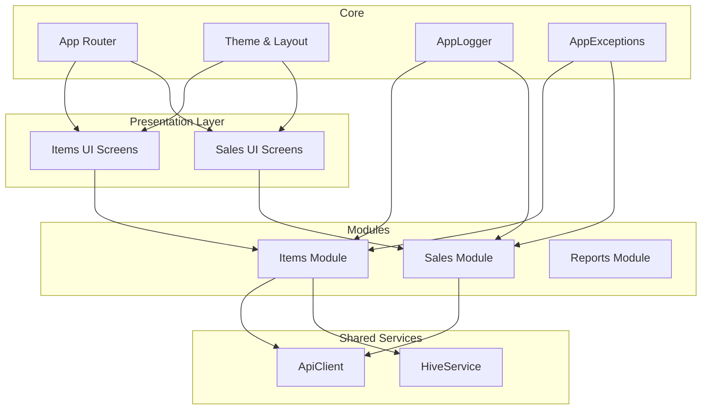
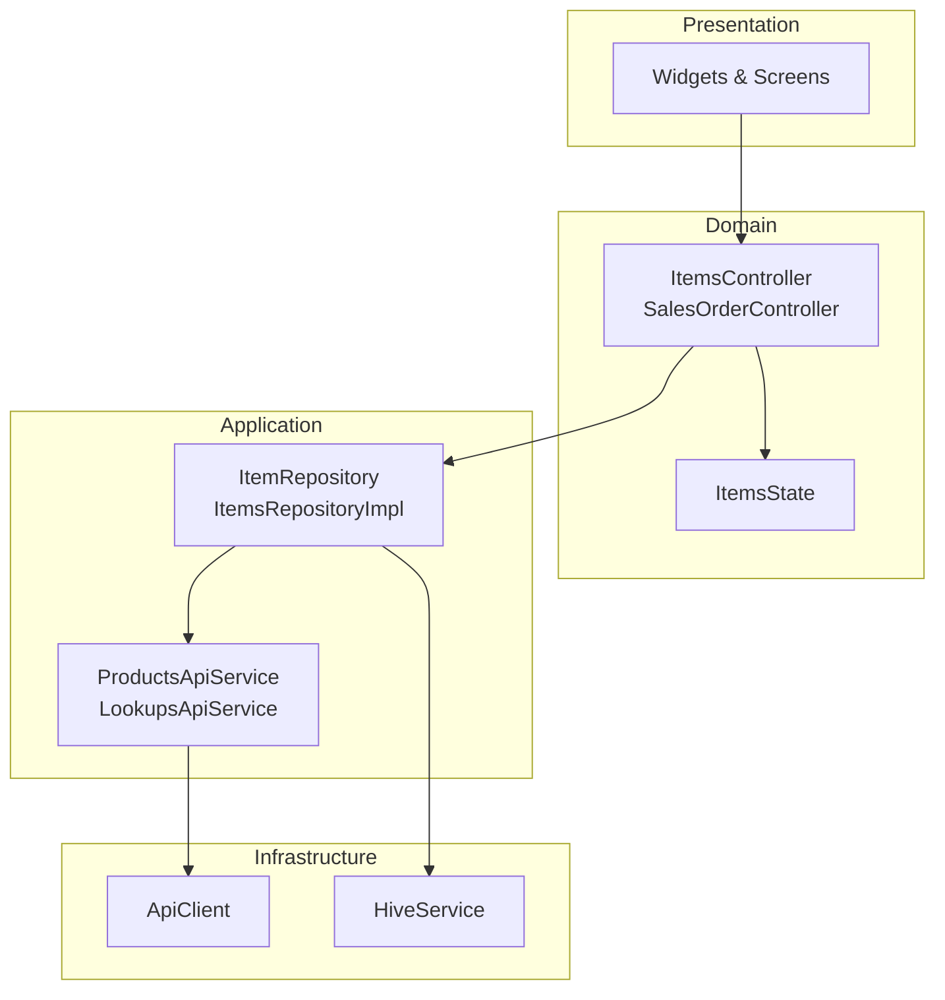
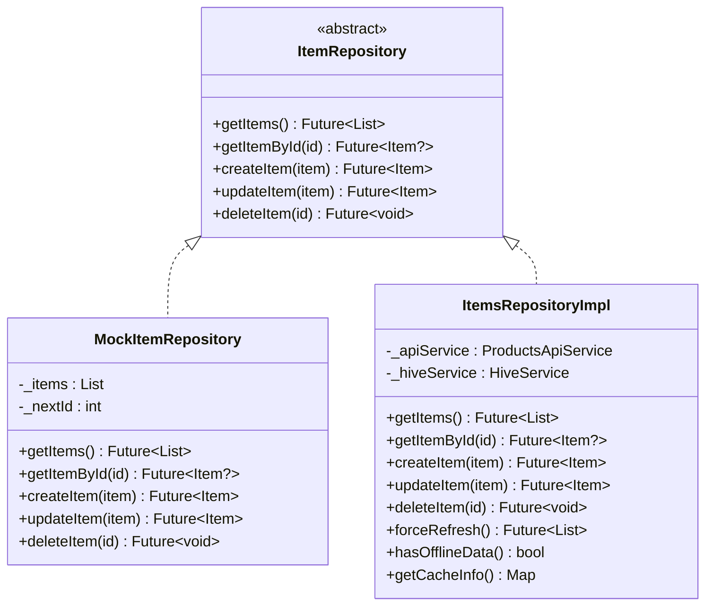
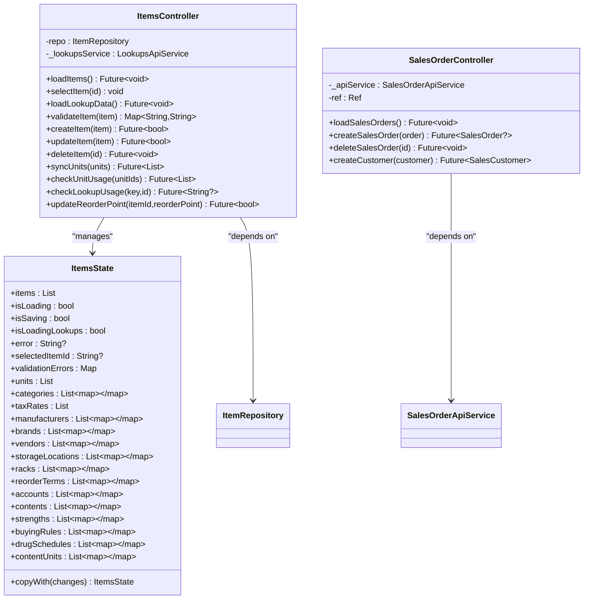
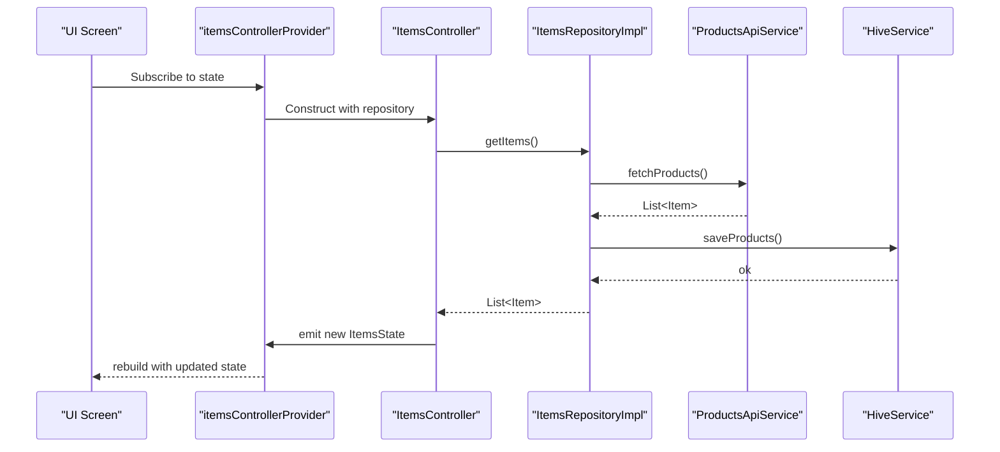
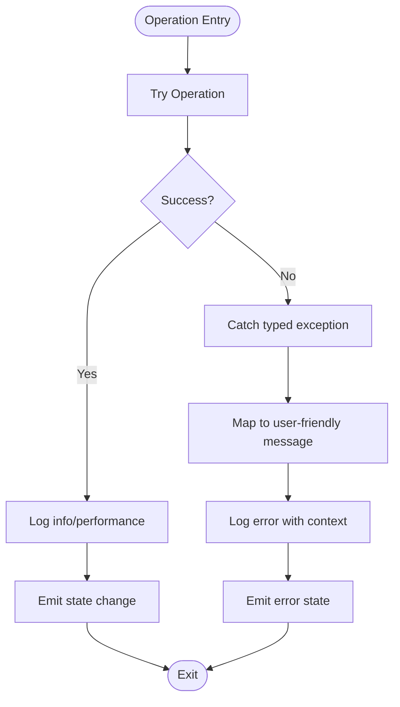
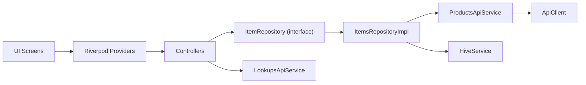

# Design Patterns & Principles

<cite>
**Referenced Files in This Document**
- [main.dart](file://lib/main.dart)
- [app.dart](file://lib/app.dart)
- [items_repository.dart](file://lib/modules/items/repositories/items_repository.dart)
- [items_repository_impl.dart](file://lib/modules/items/repositories/items_repository_impl.dart)
- [item_repository_provider.dart](file://lib/modules/items/repositories/item_repository_provider.dart)
- [items_controller.dart](file://lib/modules/items/controller/items_controller.dart)
- [items_state.dart](file://lib/modules/items/controller/items_state.dart)
- [sales_order_controller.dart](file://lib/modules/sales/controller/sales_order_controller.dart)
- [composite_items_provider.dart](file://lib/modules/composite/providers/composite_items_provider.dart)
- [hive_service.dart](file://lib/shared/services/hive_service.dart)
- [api_client.dart](file://lib/shared/services/api_client.dart)
- [app_logger.dart](file://lib/core/logging/app_logger.dart)
- [app_exceptions.dart](file://lib/core/errors/app_exceptions.dart)
- [products_api_service.dart](file://lib/modules/items/services/products_api_service.dart)
- [lookups_api_service.dart](file://lib/modules/items/services/lookups_api_service.dart)
</cite>

## Table of Contents
1. [Introduction](#introduction)
2. [Project Structure](#project-structure)
3. [Core Components](#core-components)
4. [Architecture Overview](#architecture-overview)
5. [Detailed Component Analysis](#detailed-component-analysis)
6. [Dependency Analysis](#dependency-analysis)
7. [Performance Considerations](#performance-considerations)
8. [Troubleshooting Guide](#troubleshooting-guide)
9. [Conclusion](#conclusion)
10. [Appendices](#appendices)

## Introduction
This document explains the design patterns and architectural principles implemented in ZerpAI ERP. It focuses on:
- Repository pattern for data access abstraction
- Provider pattern for state management with Riverpod
- Modular architecture for code organization
- SOLID principles, dependency inversion, and separation of concerns
- Reactive programming patterns, asynchronous programming, and performance-aware design
- Logging, error handling, and debugging strategies
- Testing patterns and quality assurance practices
- Extensibility guidelines for integrating new features

## Project Structure
ZerpAI ERP follows a modular, layered structure:
- Core: shared infrastructure (logging, routing, theme, errors)
- Modules: feature-specific packages (items, sales, reports)
- Shared: cross-cutting services (API client, Hive caching)
- Presentation: UI widgets and screens organized per feature

**Diagram sources**
- [app.dart](file://lib/app.dart#L1-L32)
- [main.dart](file://lib/main.dart#L1-L29)
- [api_client.dart](file://lib/shared/services/api_client.dart#L1-L62)
- [hive_service.dart](file://lib/shared/services/hive_service.dart#L1-L134)
- [app_logger.dart](file://lib/core/logging/app_logger.dart#L1-L218)
- [app_exceptions.dart](file://lib/core/errors/app_exceptions.dart#L1-L218)

**Section sources**
- [app.dart](file://lib/app.dart#L1-L32)
- [main.dart](file://lib/main.dart#L1-L29)

## Core Components
- Repository abstraction and implementation: Defines a clean contract for data access and provides an offline-capable implementation.
- Provider-based state management: Controllers expose state via Riverpod providers, enabling reactive UI updates.
- Modular organization: Feature modules encapsulate domain logic, models, repositories, services, and presentation.
- Logging and error handling: Centralized logger and standardized exception hierarchy improve observability and user feedback.
- Asynchronous programming: Services and repositories leverage futures and structured error handling for robust network and cache operations.

**Section sources**
- [items_repository.dart](file://lib/modules/items/repositories/items_repository.dart#L1-L53)
- [items_repository_impl.dart](file://lib/modules/items/repositories/items_repository_impl.dart#L1-L297)
- [items_controller.dart](file://lib/modules/items/controller/items_controller.dart#L1-L568)
- [items_state.dart](file://lib/modules/items/controller/items_state.dart#L1-L113)
- [app_logger.dart](file://lib/core/logging/app_logger.dart#L1-L218)
- [app_exceptions.dart](file://lib/core/errors/app_exceptions.dart#L1-L218)

## Architecture Overview
ZerpAI ERP applies a layered architecture with clear separation of concerns:
- Presentation: UI screens and widgets
- Domain: Controllers and state models
- Application: Repositories and services
- Infrastructure: API client and local storage

**Diagram sources**
- [items_controller.dart](file://lib/modules/items/controller/items_controller.dart#L1-L568)
- [items_state.dart](file://lib/modules/items/controller/items_state.dart#L1-L113)
- [items_repository.dart](file://lib/modules/items/repositories/items_repository.dart#L1-L53)
- [items_repository_impl.dart](file://lib/modules/items/repositories/items_repository_impl.dart#L1-L297)
- [products_api_service.dart](file://lib/modules/items/services/products_api_service.dart#L1-L208)
- [lookups_api_service.dart](file://lib/modules/items/services/lookups_api_service.dart#L1-L363)
- [api_client.dart](file://lib/shared/services/api_client.dart#L1-L62)
- [hive_service.dart](file://lib/shared/services/hive_service.dart#L1-L134)

## Detailed Component Analysis

### Repository Pattern Implementation
The Repository pattern abstracts data access behind a simple interface and provides an implementation that supports online-first with offline fallback.

**Diagram sources**
- [items_repository.dart](file://lib/modules/items/repositories/items_repository.dart#L1-L53)
- [items_repository_impl.dart](file://lib/modules/items/repositories/items_repository_impl.dart#L1-L297)

Key characteristics:
- Abstraction: The ItemRepository interface decouples UI and domain logic from data sources.
- Implementation: ItemsRepositoryImpl orchestrates API calls and Hive caching, with structured logging and fallback behavior.
- Offline-first: API calls are attempted first; failures fall back to Hive cache, ensuring resilience.
- Dependency injection: Constructor injection allows swapping implementations (mock vs. production).

**Section sources**
- [items_repository.dart](file://lib/modules/items/repositories/items_repository.dart#L1-L53)
- [items_repository_impl.dart](file://lib/modules/items/repositories/items_repository_impl.dart#L1-L297)
- [item_repository_provider.dart](file://lib/modules/items/repositories/item_repository_provider.dart#L1-L12)
- [hive_service.dart](file://lib/shared/services/hive_service.dart#L1-L134)
- [products_api_service.dart](file://lib/modules/items/services/products_api_service.dart#L1-L208)

### Provider Pattern for State Management (Riverpod)
Controllers expose state via Riverpod providers, enabling reactive updates and fine-grained subscriptions.

**Diagram sources**
- [items_state.dart](file://lib/modules/items/controller/items_state.dart#L1-L113)
- [items_controller.dart](file://lib/modules/items/controller/items_controller.dart#L1-L568)
- [sales_order_controller.dart](file://lib/modules/sales/controller/sales_order_controller.dart#L1-L119)

Behavior highlights:
- Reactive UI: Consumers subscribe to providers and rebuild when state changes.
- Parallel lookups: ItemsController loads multiple lookup sets concurrently for performance.
- Validation and error propagation: Validation errors and exceptions are surfaced to the UI via state.
- Composition filtering: A derived provider filters composite items based on business rules.

**Section sources**
- [items_controller.dart](file://lib/modules/items/controller/items_controller.dart#L1-L568)
- [items_state.dart](file://lib/modules/items/controller/items_state.dart#L1-L113)
- [sales_order_controller.dart](file://lib/modules/sales/controller/sales_order_controller.dart#L1-L119)
- [composite_items_provider.dart](file://lib/modules/composite/providers/composite_items_provider.dart#L1-L26)

### Asynchronous Programming and Reactive Patterns
Asynchronous operations are central to data fetching, caching, and UI updates:
- Futures for API calls and repository operations
- Structured error handling with typed exceptions
- Derived providers for computed state (e.g., composite items)
- Performance logging for async operations

**Diagram sources**
- [items_controller.dart](file://lib/modules/items/controller/items_controller.dart#L1-L568)
- [items_repository_impl.dart](file://lib/modules/items/repositories/items_repository_impl.dart#L1-L297)
- [products_api_service.dart](file://lib/modules/items/services/products_api_service.dart#L1-L208)
- [hive_service.dart](file://lib/shared/services/hive_service.dart#L1-L134)

**Section sources**
- [items_controller.dart](file://lib/modules/items/controller/items_controller.dart#L1-L568)
- [items_repository_impl.dart](file://lib/modules/items/repositories/items_repository_impl.dart#L1-L297)

### Logging, Error Handling, and Debugging
- Centralized logging: AppLogger provides structured logs with context (module, user, org, data).
- Standardized exceptions: AppException hierarchy maps backend/API/network errors to user-friendly messages.
- Debugging aids: Print statements in services and controllers during development; structured logs for production visibility.

**Diagram sources**
- [app_logger.dart](file://lib/core/logging/app_logger.dart#L1-L218)
- [app_exceptions.dart](file://lib/core/errors/app_exceptions.dart#L1-L218)
- [items_controller.dart](file://lib/modules/items/controller/items_controller.dart#L1-L568)
- [items_repository_impl.dart](file://lib/modules/items/repositories/items_repository_impl.dart#L1-L297)

**Section sources**
- [app_logger.dart](file://lib/core/logging/app_logger.dart#L1-L218)
- [app_exceptions.dart](file://lib/core/errors/app_exceptions.dart#L1-L218)
- [items_controller.dart](file://lib/modules/items/controller/items_controller.dart#L1-L568)

### Testing Patterns and Quality Assurance
- Mock repositories: MockItemRepository enables isolated unit tests for controllers without external dependencies.
- Testable services: API services depend on ApiClient, allowing DI for test doubles.
- State-driven tests: Controllers’ state transitions can be validated by injecting mock repositories and asserting emitted states.

Recommended practices:
- Replace repository/provider under test with mocks in unit tests.
- Verify logging calls and error propagation using test doubles.
- Use Future.wait patterns to simulate concurrent operations in tests.

**Section sources**
- [items_repository.dart](file://lib/modules/items/repositories/items_repository.dart#L1-L53)
- [api_client.dart](file://lib/shared/services/api_client.dart#L1-L62)

### Extensibility and Integration Guidelines
To integrate new features following established principles:
- Define a repository interface and a production implementation with offline fallback.
- Expose a Riverpod provider for the repository and a controller/provider for state.
- Encapsulate API interactions in dedicated services using ApiClient.
- Centralize logging and error handling via AppLogger and AppException.
- Add derived providers for computed UI state.
- Keep UI widgets declarative and focused on rendering state.

**Section sources**
- [items_repository.dart](file://lib/modules/items/repositories/items_repository.dart#L1-L53)
- [items_repository_impl.dart](file://lib/modules/items/repositories/items_repository_impl.dart#L1-L297)
- [items_controller.dart](file://lib/modules/items/controller/items_controller.dart#L1-L568)
- [api_client.dart](file://lib/shared/services/api_client.dart#L1-L62)
- [app_logger.dart](file://lib/core/logging/app_logger.dart#L1-L218)
- [app_exceptions.dart](file://lib/core/errors/app_exceptions.dart#L1-L218)

## Dependency Analysis
The system exhibits low coupling and high cohesion:
- UI depends on Riverpod providers, not concrete implementations.
- Controllers depend on abstractions (ItemRepository, LookupsApiService).
- Repositories depend on services and local storage, not UI.
- Shared services (ApiClient, HiveService) are singletons with clear responsibilities.

**Diagram sources**
- [items_controller.dart](file://lib/modules/items/controller/items_controller.dart#L1-L568)
- [items_repository.dart](file://lib/modules/items/repositories/items_repository.dart#L1-L53)
- [items_repository_impl.dart](file://lib/modules/items/repositories/items_repository_impl.dart#L1-L297)
- [products_api_service.dart](file://lib/modules/items/services/products_api_service.dart#L1-L208)
- [lookups_api_service.dart](file://lib/modules/items/services/lookups_api_service.dart#L1-L363)
- [api_client.dart](file://lib/shared/services/api_client.dart#L1-L62)
- [hive_service.dart](file://lib/shared/services/hive_service.dart#L1-L134)

**Section sources**
- [items_controller.dart](file://lib/modules/items/controller/items_controller.dart#L1-L568)
- [items_repository.dart](file://lib/modules/items/repositories/items_repository.dart#L1-L53)
- [items_repository_impl.dart](file://lib/modules/items/repositories/items_repository_impl.dart#L1-L297)

## Performance Considerations
- Parallelization: ItemsController loads lookup data concurrently to reduce latency.
- Offline-first caching: HiveService stores normalized data; cache misses trigger fallback to API.
- Structured logging: AppLogger tracks performance durations and cache hits/misses.
- Minimal rebuilds: Riverpod’s fine-grained providers reduce unnecessary UI updates.

Recommendations:
- Prefer Future.wait for independent async tasks.
- Cache only essential data; invalidate selectively.
- Use derived providers to compute derived state off the main thread.

**Section sources**
- [items_controller.dart](file://lib/modules/items/controller/items_controller.dart#L66-L184)
- [items_repository_impl.dart](file://lib/modules/items/repositories/items_repository_impl.dart#L24-L83)
- [app_logger.dart](file://lib/core/logging/app_logger.dart#L1-L218)

## Troubleshooting Guide
Common scenarios and strategies:
- Network failures: ItemsRepositoryImpl catches network/API exceptions and falls back to Hive cache; logs warnings and continues.
- Unexpected errors: Logged with stack traces; UI receives user-friendly messages via state.
- Local storage errors: CacheException maps to user guidance; repository continues with degraded mode.
- Debugging: Use AppLogger.apiRequest/apiResponse for HTTP tracing; enable debug prints in development.

Actions:
- Inspect AppLogger output for module, data, and performance metrics.
- Verify cache stats via HiveService.getCacheStats().
- Reproduce with MockItemRepository to isolate UI/domain logic.

**Section sources**
- [items_repository_impl.dart](file://lib/modules/items/repositories/items_repository_impl.dart#L57-L82)
- [app_exceptions.dart](file://lib/core/errors/app_exceptions.dart#L1-L218)
- [app_logger.dart](file://lib/core/logging/app_logger.dart#L1-L218)
- [hive_service.dart](file://lib/shared/services/hive_service.dart#L124-L133)

## Conclusion
ZerpAI ERP demonstrates a pragmatic application of SOLID principles, dependency inversion, and separation of concerns. The Repository pattern abstracts data access, Riverpod enables reactive state management, and modular architecture promotes maintainability. Logging and standardized exceptions improve reliability and user experience. Asynchronous programming patterns, combined with offline-first caching, deliver robust performance. The provided extensibility guidelines ensure new features align with existing architectural principles.

## Appendices

### SOLID Principles in Practice
- Single Responsibility: Services handle HTTP; repositories handle persistence; controllers manage state.
- Open/Closed: New repositories can replace implementations without changing controllers.
- Liskov Substitution: MockItemRepository adheres to ItemRepository contract.
- Interface Segregation: Separate interfaces for repositories and services.
- Dependency Inversion: Controllers depend on ItemRepository, not concrete implementations.

**Section sources**
- [items_repository.dart](file://lib/modules/items/repositories/items_repository.dart#L1-L53)
- [items_controller.dart](file://lib/modules/items/controller/items_controller.dart#L1-L568)
- [items_repository_impl.dart](file://lib/modules/items/repositories/items_repository_impl.dart#L1-L297)