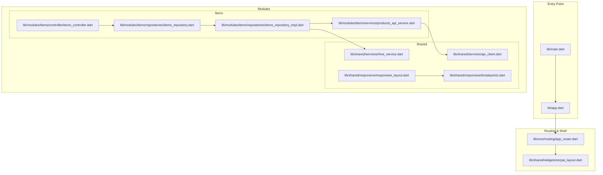
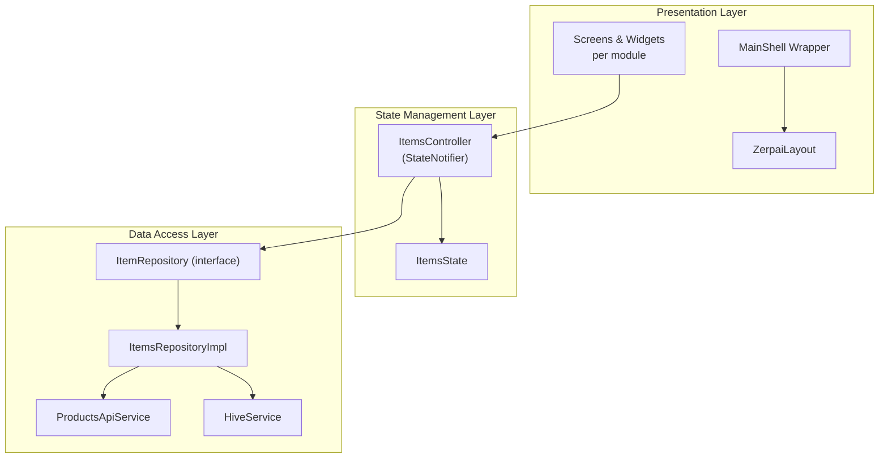
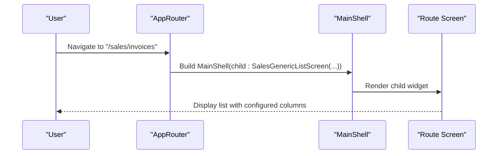
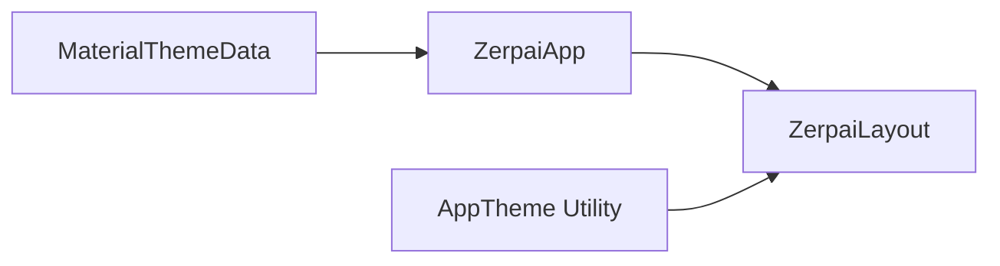
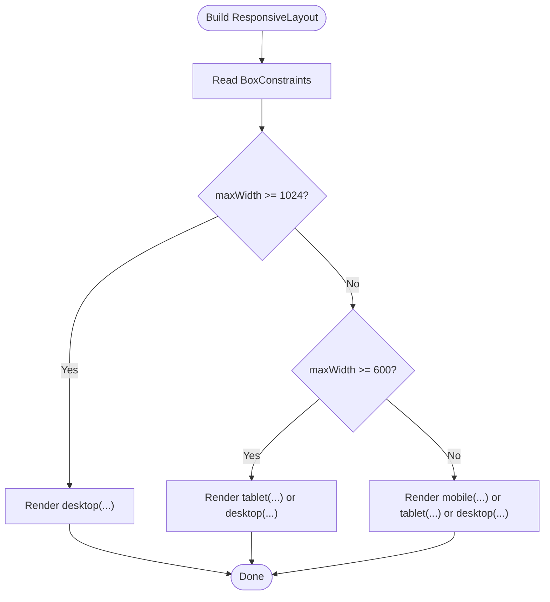
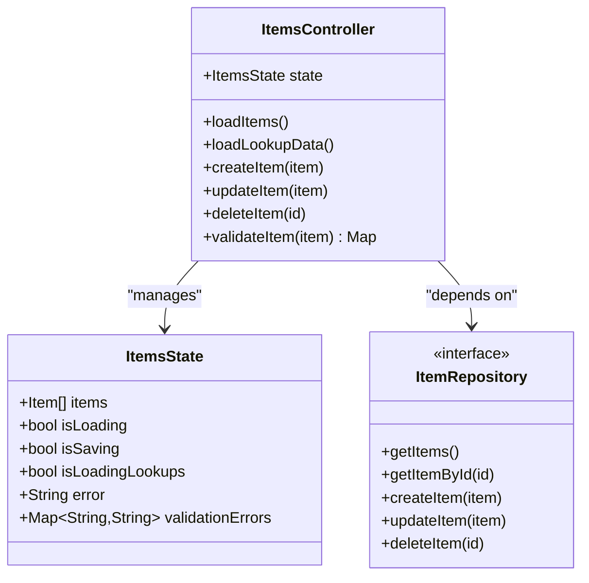
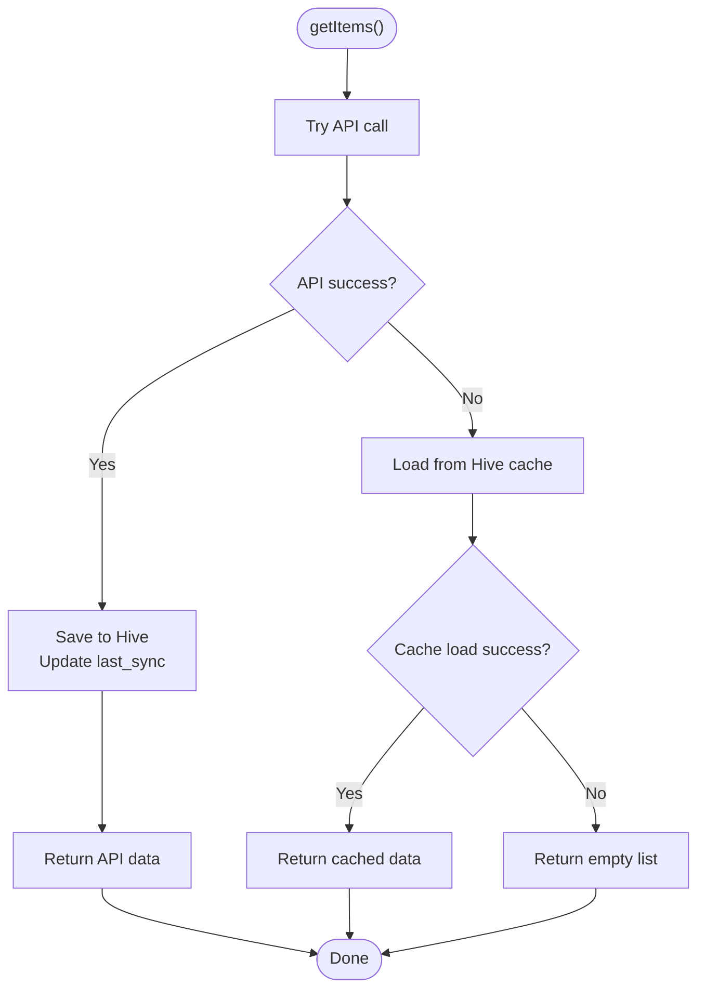
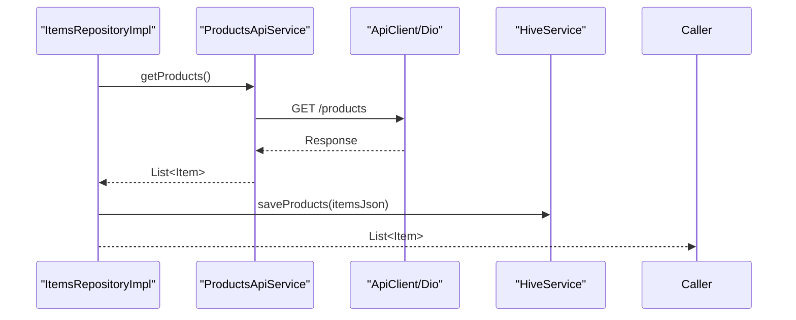
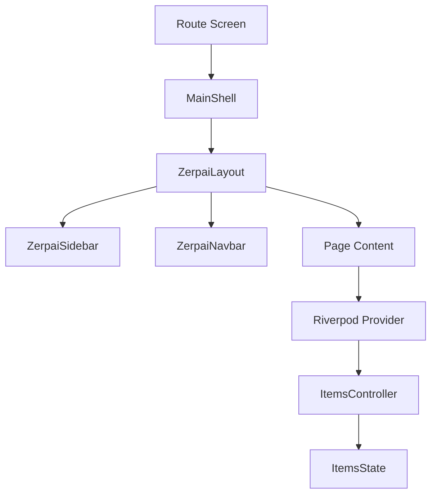
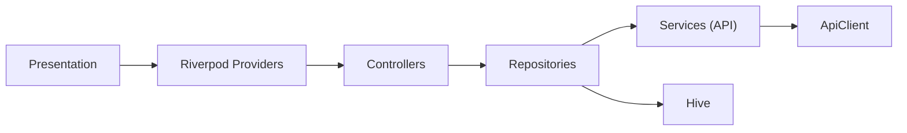

# Frontend Architecture

<cite>
**Referenced Files in This Document**
- [main.dart](file://lib/main.dart)
- [app.dart](file://lib/app.dart)
- [app_router.dart](file://lib/core/routing/app_router.dart)
- [app_theme.dart](file://lib/core/theme/app_theme.dart)
- [zerpai_layout.dart](file://lib/shared/widgets/zerpai_layout.dart)
- [responsive_layout.dart](file://lib/shared/responsive/responsive_layout.dart)
- [breakpoints.dart](file://lib/shared/responsive/breakpoints.dart)
- [items_controller.dart](file://lib/modules/items/controller/items_controller.dart)
- [items_state.dart](file://lib/modules/items/controller/items_state.dart)
- [items_repository.dart](file://lib/modules/items/repositories/items_repository.dart)
- [items_repository_impl.dart](file://lib/modules/items/repositories/items_repository_impl.dart)
- [products_api_service.dart](file://lib/modules/items/services/products_api_service.dart)
- [api_client.dart](file://lib/shared/services/api_client.dart)
- [hive_service.dart](file://lib/shared/services/hive_service.dart)
</cite>

## Table of Contents
1. [Introduction](#introduction)
2. [Project Structure](#project-structure)
3. [Core Components](#core-components)
4. [Architecture Overview](#architecture-overview)
5. [Detailed Component Analysis](#detailed-component-analysis)
6. [Dependency Analysis](#dependency-analysis)
7. [Performance Considerations](#performance-considerations)
8. [Troubleshooting Guide](#troubleshooting-guide)
9. [Conclusion](#conclusion)

## Introduction
This document describes the frontend architecture of the Flutter application. It explains the layered architecture (presentation, state management, and data access), the modular structure separating items, sales, reports, and shared components, the routing system, theme management, responsive layout implementation, state management patterns using Riverpod, offline-first strategy with Hive integration, and backend integration. It also covers performance optimization and memory management strategies.

Canonical placement rule:
- `lib/core/` = app infrastructure only
- `lib/core/layout/` = shell/navigation infrastructure
- `lib/shared/widgets/` = reusable UI widgets and page wrappers
- `lib/shared/services/` = cross-feature services

## Project Structure
The application follows a feature-based modular structure under lib/, with clear separation of concerns:
- Presentation layer: widgets and screens organized per module (items, sales, reports) and shared UI components.
- State management layer: Riverpod providers and controllers encapsulate state and side effects.
- Data access layer: repositories and services handle API communication and offline caching.
- Core infrastructure: router, theme, layout, and responsive utilities.

**Diagram sources**
- [main.dart](file://lib/main.dart#L1-L29)
- [app.dart](file://lib/app.dart#L1-L32)
- [app_router.dart](file://lib/core/routing/app_router.dart#L1-L341)
- [zerpai_layout.dart](file://lib/shared/widgets/zerpai_layout.dart#L1-L73)
- [items_controller.dart](file://lib/modules/items/controller/items_controller.dart#L1-L568)
- [items_repository.dart](file://lib/modules/items/repositories/items_repository.dart#L1-L53)
- [items_repository_impl.dart](file://lib/modules/items/repositories/items_repository_impl.dart#L1-L297)
- [products_api_service.dart](file://lib/modules/items/services/products_api_service.dart#L1-L208)
- [api_client.dart](file://lib/shared/services/api_client.dart#L1-L62)
- [hive_service.dart](file://lib/shared/services/hive_service.dart#L1-L134)
- [responsive_layout.dart](file://lib/shared/responsive/responsive_layout.dart#L1-L48)
- [breakpoints.dart](file://lib/shared/responsive/breakpoints.dart#L1-L64)

**Section sources**
- [main.dart](file://lib/main.dart#L1-L29)
- [app.dart](file://lib/app.dart#L1-L32)
- [app_router.dart](file://lib/core/routing/app_router.dart#L1-L341)
- [zerpai_layout.dart](file://lib/shared/widgets/zerpai_layout.dart#L1-L73)
- [responsive_layout.dart](file://lib/shared/responsive/responsive_layout.dart#L1-L48)
- [breakpoints.dart](file://lib/shared/responsive/breakpoints.dart#L1-L64)

## Core Components
- Initialization and offline storage: The app initializes Hive boxes for offline caching and Supabase for backend connectivity during startup.
- Routing: A centralized router defines named routes and wraps screens with a common shell layout.
- Theme: Material theme configuration and a dedicated AppTheme utility define consistent styling.
- Responsive layout: Breakpoint utilities and a responsive wrapper adapt UI to device sizes.
- State management: Riverpod StateNotifier-based controller manages items state and orchestrates repository interactions.
- Data access: Repository pattern abstracts API and offline storage, implementing an online-first strategy with Hive caching.

**Section sources**
- [main.dart](file://lib/main.dart#L8-L28)
- [app_router.dart](file://lib/core/routing/app_router.dart#L93-L265)
- [app_theme.dart](file://lib/core/theme/app_theme.dart#L1-L85)
- [responsive_layout.dart](file://lib/shared/responsive/responsive_layout.dart#L1-L48)
- [breakpoints.dart](file://lib/shared/responsive/breakpoints.dart#L1-L64)
- [items_controller.dart](file://lib/modules/items/controller/items_controller.dart#L16-L23)
- [items_repository_impl.dart](file://lib/modules/items/repositories/items_repository_impl.dart#L14-L83)

## Architecture Overview
The frontend architecture is layered and modular:
- Presentation layer: Screens and widgets are organized per feature module and wrapped in a common layout shell.
- State management layer: Controllers (Riverpod StateNotifier) manage UI state and orchestrate data operations.
- Data access layer: Repositories abstract API and offline storage, providing unified interfaces to the presentation layer.

**Diagram sources**
- [app_router.dart](file://lib/core/routing/app_router.dart#L267-L276)
- [zerpai_layout.dart](file://lib/shared/widgets/zerpai_layout.dart#L5-L21)
- [items_controller.dart](file://lib/modules/items/controller/items_controller.dart#L16-L23)
- [items_state.dart](file://lib/modules/items/controller/items_state.dart#L7-L61)
- [items_repository.dart](file://lib/modules/items/repositories/items_repository.dart#L3-L9)
- [items_repository_impl.dart](file://lib/modules/items/repositories/items_repository_impl.dart#L14-L83)
- [products_api_service.dart](file://lib/modules/items/services/products_api_service.dart#L7-L13)
- [hive_service.dart](file://lib/shared/services/hive_service.dart#L6-L15)

## Detailed Component Analysis

### Routing System
- Centralized routes: Named routes are defined in a single router file and mapped to widgets.
- Shell wrapper: All routes render inside a common shell that applies layout, navigation, and page headers.
- Dynamic lists: Generic list screens accept provider and column configuration to reduce duplication.

**Diagram sources**
- [app_router.dart](file://lib/core/routing/app_router.dart#L93-L169)
- [app_router.dart](file://lib/core/routing/app_router.dart#L267-L276)

**Section sources**
- [app_router.dart](file://lib/core/routing/app_router.dart#L29-L90)
- [app_router.dart](file://lib/core/routing/app_router.dart#L93-L265)
- [app_router.dart](file://lib/core/routing/app_router.dart#L267-L341)

### Theme Management
- Global theme: The app sets a global Material theme with consistent colors, typography, and button styles.
- Dedicated theme utility: A theme utility centralizes color and style definitions for reuse across the app.

**Diagram sources**
- [app.dart](file://lib/app.dart#L12-L22)
- [app_theme.dart](file://lib/core/theme/app_theme.dart#L10-L68)

**Section sources**
- [app.dart](file://lib/app.dart#L12-L22)
- [app_theme.dart](file://lib/core/theme/app_theme.dart#L1-L85)

### Responsive Layout Implementation
- Breakpoints: Logical breakpoints define device categories for consistent responsive behavior.
- Responsive wrapper: A layout builder selects desktop/tablet/mobile views based on constraints.
- Utilities: Helpers determine device size from BuildContext for conditional rendering.

**Diagram sources**
- [responsive_layout.dart](file://lib/shared/responsive/responsive_layout.dart#L32-L46)
- [breakpoints.dart](file://lib/shared/responsive/breakpoints.dart#L26-L37)

**Section sources**
- [responsive_layout.dart](file://lib/shared/responsive/responsive_layout.dart#L1-L48)
- [breakpoints.dart](file://lib/shared/responsive/breakpoints.dart#L1-L64)

### State Management Patterns with Riverpod
- Controller as StateNotifier: The ItemsController manages ItemsState and coordinates repository calls.
- Provider wiring: A StateNotifierProvider wires the controller to the repository dependency.
- Validation and error handling: Validation errors and user-friendly messages are maintained in state.
- Parallel lookups: Lookup data is fetched concurrently to improve responsiveness.

**Diagram sources**
- [items_controller.dart](file://lib/modules/items/controller/items_controller.dart#L16-L23)
- [items_state.dart](file://lib/modules/items/controller/items_state.dart#L7-L61)
- [items_repository.dart](file://lib/modules/items/repositories/items_repository.dart#L3-L9)

**Section sources**
- [items_controller.dart](file://lib/modules/items/controller/items_controller.dart#L16-L568)
- [items_state.dart](file://lib/modules/items/controller/items_state.dart#L1-L113)
- [items_repository.dart](file://lib/modules/items/repositories/items_repository.dart#L1-L53)

### Offline-First Strategy with Hive Integration
- Online-first with offline fallback: The repository attempts API calls first, caches successful responses, and falls back to Hive on failures.
- Hive service: Provides typed accessors for products, customers, POS drafts, and config, plus cache statistics and timestamps.
- Repository caching: On successful API calls, data is serialized and stored in Hive; cache timestamps track last sync.
- Error resilience: Repository catches network/API errors and safely loads from cache, returning empty results if cache retrieval fails.

**Diagram sources**
- [items_repository_impl.dart](file://lib/modules/items/repositories/items_repository_impl.dart#L24-L83)
- [hive_service.dart](file://lib/shared/services/hive_service.dart#L19-L45)

**Section sources**
- [items_repository_impl.dart](file://lib/modules/items/repositories/items_repository_impl.dart#L10-L83)
- [hive_service.dart](file://lib/shared/services/hive_service.dart#L1-L134)

### Backend Integration
- API client: A singleton Dio-based client handles base URL, timeouts, headers, and interceptors.
- Products API service: Encapsulates CRUD operations for products, formatting payloads and parsing responses.
- Repository compatibility: Methods that return raw maps enable caching in Hive while maintaining repository abstractions.

**Diagram sources**
- [items_repository_impl.dart](file://lib/modules/items/repositories/items_repository_impl.dart#L24-L56)
- [products_api_service.dart](file://lib/modules/items/services/products_api_service.dart#L51-L64)
- [api_client.dart](file://lib/shared/services/api_client.dart#L46-L60)
- [hive_service.dart](file://lib/shared/services/hive_service.dart#L19-L25)

**Section sources**
- [api_client.dart](file://lib/shared/services/api_client.dart#L1-L62)
- [products_api_service.dart](file://lib/modules/items/services/products_api_service.dart#L1-L208)
- [items_repository_impl.dart](file://lib/modules/items/repositories/items_repository_impl.dart#L1-L297)

### Component Hierarchy and Communication
- Shell and layout: All route screens are rendered inside ZerpaiLayout, which embeds sidebar, navbar, and page title.
- Navigation: The layout’s sidebar invokes navigation callbacks; routes are handled centrally.
- Provider-driven updates: Screens subscribe to Riverpod providers to react to state changes from the controller.

**Diagram sources**
- [app_router.dart](file://lib/core/routing/app_router.dart#L267-L276)
- [zerpai_layout.dart](file://lib/shared/widgets/zerpai_layout.dart#L5-L21)
- [items_controller.dart](file://lib/modules/items/controller/items_controller.dart#L563-L568)

**Section sources**
- [zerpai_layout.dart](file://lib/shared/widgets/zerpai_layout.dart#L1-L73)
- [app_router.dart](file://lib/core/routing/app_router.dart#L267-L341)
- [items_controller.dart](file://lib/modules/items/controller/items_controller.dart#L563-L568)

## Dependency Analysis
The modules and shared components exhibit low coupling and high cohesion:
- Presentation depends on Riverpod providers, not on repositories directly.
- Repositories depend on services and Hive, enabling testability via mocking.
- Shared services (API client, Hive) are injected into repositories, minimizing duplication.

**Diagram sources**
- [items_controller.dart](file://lib/modules/items/controller/items_controller.dart#L563-L568)
- [items_repository_impl.dart](file://lib/modules/items/repositories/items_repository_impl.dart#L14-L22)
- [products_api_service.dart](file://lib/modules/items/services/products_api_service.dart#L7-L8)
- [api_client.dart](file://lib/shared/services/api_client.dart#L6-L10)
- [hive_service.dart](file://lib/shared/services/hive_service.dart#L6-L9)

**Section sources**
- [items_controller.dart](file://lib/modules/items/controller/items_controller.dart#L1-L568)
- [items_repository_impl.dart](file://lib/modules/items/repositories/items_repository_impl.dart#L1-L297)
- [products_api_service.dart](file://lib/modules/items/services/products_api_service.dart#L1-L208)
- [api_client.dart](file://lib/shared/services/api_client.dart#L1-L62)
- [hive_service.dart](file://lib/shared/services/hive_service.dart#L1-L134)

## Performance Considerations
- Concurrent lookups: Lookup data is fetched in parallel to reduce initialization latency.
- Logging and timing: Stopwatch-based performance logs help identify slow operations.
- Offline-first caching: Reduces network latency and improves reliability by serving cached data when offline.
- Responsive rendering: Using LayoutBuilder and breakpoint utilities avoids unnecessary rebuilds and enables adaptive UI.
- Memory management: Avoid retaining large lists longer than needed; clear caches selectively and rely on Hive for persistence.

[No sources needed since this section provides general guidance]

## Troubleshooting Guide
- Network/API errors: The repository catches network and API exceptions and falls back to Hive cache. Inspect logs for error messages and last sync timestamps.
- Validation errors: Validation errors are surfaced in state and displayed to users; ensure UI reads validationErrors from the controller’s state.
- Cache integrity: If cached data appears stale, trigger a force refresh via repository methods and verify last_sync timestamps.
- Logging: Use the logger to trace operations and stack traces for deeper diagnostics.

**Section sources**
- [items_repository_impl.dart](file://lib/modules/items/repositories/items_repository_impl.dart#L57-L82)
- [items_controller.dart](file://lib/modules/items/controller/items_controller.dart#L43-L59)
- [hive_service.dart](file://lib/shared/services/hive_service.dart#L101-L113)

## Conclusion
The application employs a clean, layered architecture with strong separation between presentation, state management, and data access. Riverpod provides predictable state updates, while the repository pattern and Hive integration deliver robust offline-first capabilities. The centralized router and shared layout ensure consistent navigation and UX across modules. With responsive utilities and performance-conscious design choices, the app scales effectively across devices and maintains reliability in offline scenarios.

