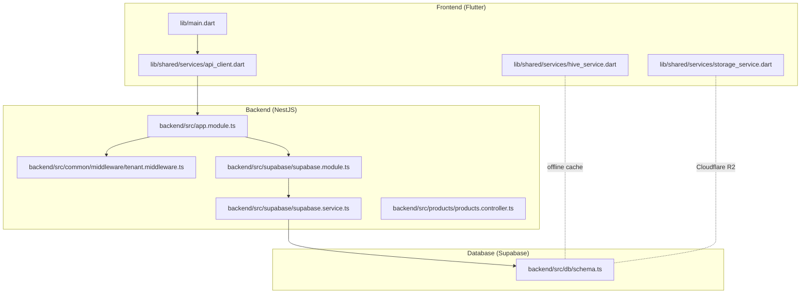
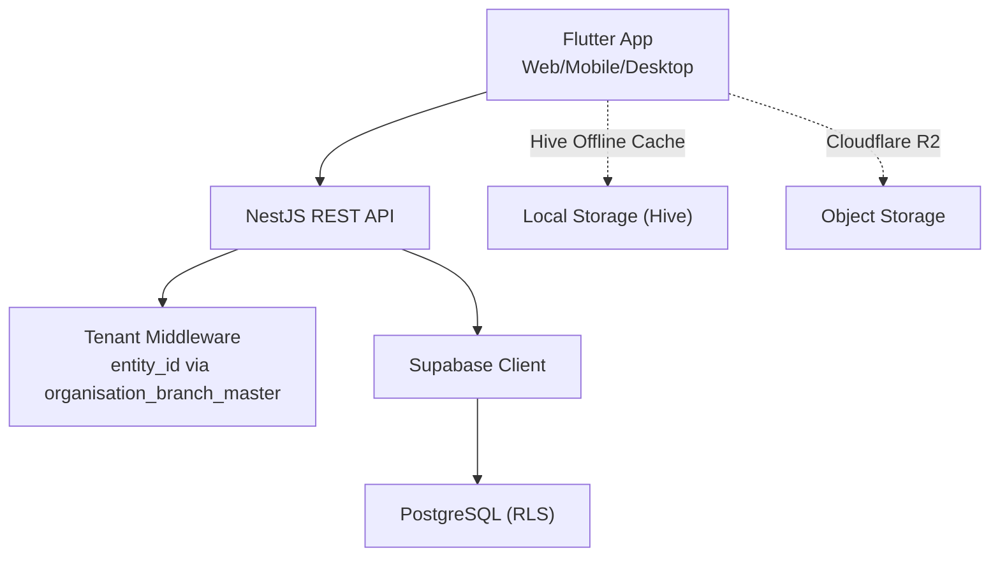
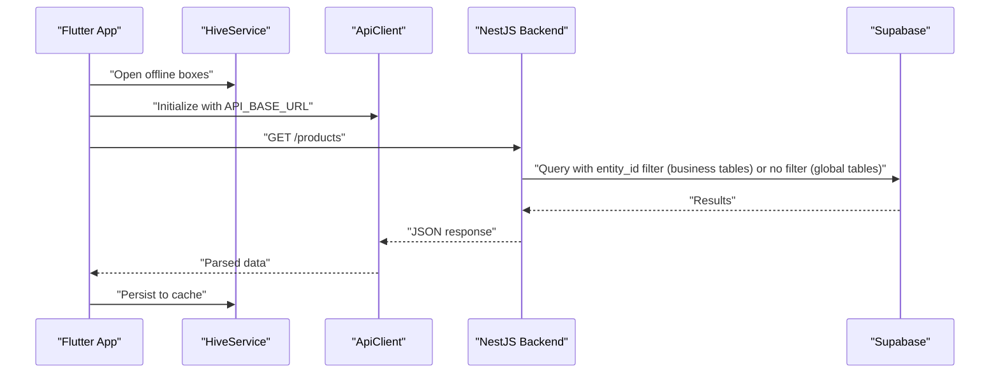
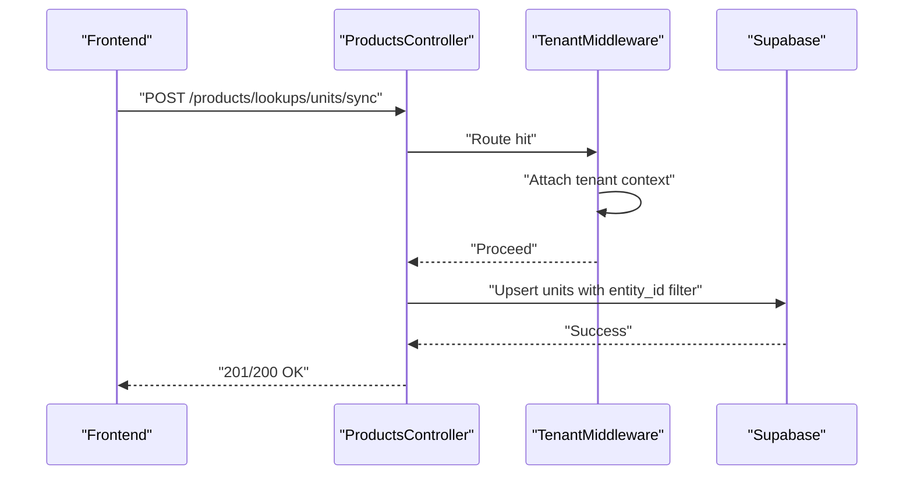
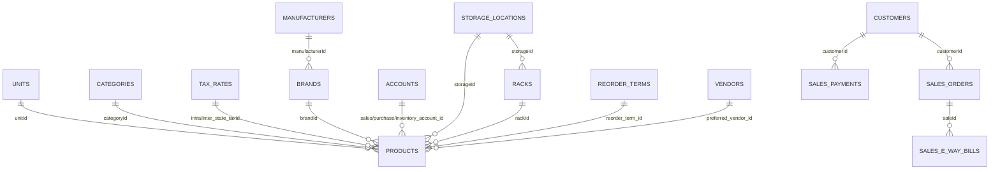
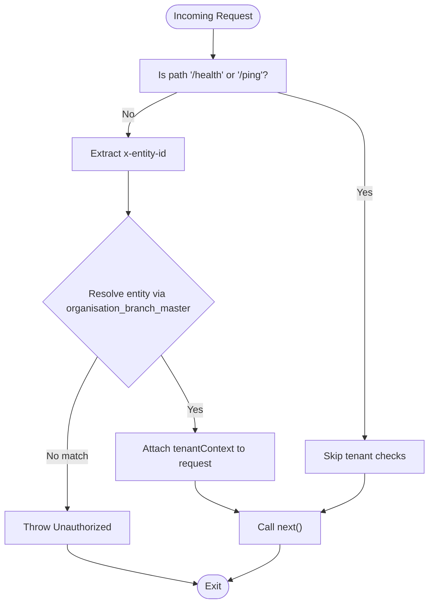
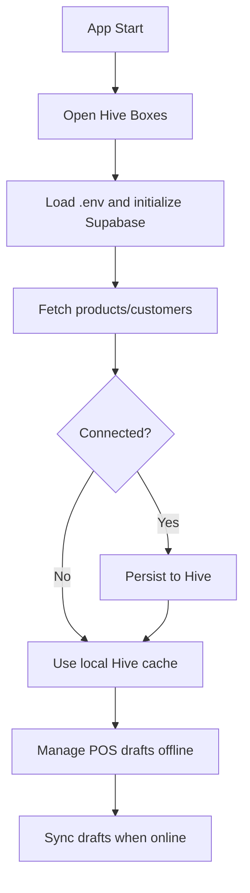
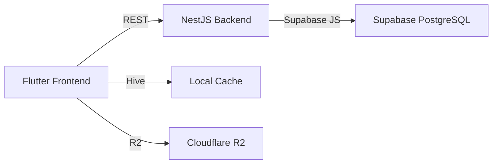

# System Overview

<cite>
**Referenced Files in This Document**
- [README.md](file://README.md)
- [PRD.md](file://PRD/PRD.md)
- [pubspec.yaml](file://pubspec.yaml)
- [package.json](file://backend/package.json)
- [main.dart](file://lib/main.dart)
- [api_client.dart](file://lib/shared/services/api_client.dart)
- [hive_service.dart](file://lib/shared/services/hive_service.dart)
- [storage_service.dart](file://lib/shared/services/storage_service.dart)
- [app.module.ts](file://backend/src/app.module.ts)
- [tenant.middleware.ts](file://backend/src/common/middleware/tenant.middleware.ts)
- [supabase.module.ts](file://backend/src/supabase/supabase.module.ts)
- [supabase.service.ts](file://backend/src/supabase/supabase.service.ts)
- [products.controller.ts](file://backend/src/products/products.controller.ts)
- [schema.ts](file://backend/src/db/schema.ts)
</cite>

## Table of Contents
1. [Introduction](#introduction)
2. [Project Structure](#project-structure)
3. [Core Components](#core-components)
4. [Architecture Overview](#architecture-overview)
5. [Detailed Component Analysis](#detailed-component-analysis)
6. [Dependency Analysis](#dependency-analysis)
7. [Performance Considerations](#performance-considerations)
8. [Troubleshooting Guide](#troubleshooting-guide)
9. [Conclusion](#conclusion)
10. [Appendices](#appendices)

## Introduction
ZerpAI ERP is a modern, cloud-native ERP solution designed for Indian SMEs with a focus on retail, pharmacy, and trading. It adopts an offline-first strategy to ensure operational continuity during network interruptions, while enabling real-time synchronization when connectivity is available. The system integrates a Flutter frontend, a NestJS backend, and a Supabase-powered PostgreSQL database. It is architected to support multi-tenant scenarios through a single `entity_id` column (FK to `organisation_branch_master`) on all business tables, and it is designed to scale across hundreds of branches on a single database instance.

## Project Structure
The repository is organized as a monorepo with three primary areas:
- Flutter frontend (lib/) for web and mobile/desktop targets
- NestJS backend (backend/src/) exposing REST APIs
- Supabase database (supabase/migrations/) with SQL-based migrations

**Diagram sources**
- [main.dart](file://lib/main.dart#L1-L29)
- [api_client.dart](file://lib/shared/services/api_client.dart#L1-L62)
- [hive_service.dart](file://lib/shared/services/hive_service.dart#L1-L134)
- [storage_service.dart](file://lib/shared/services/storage_service.dart#L1-L227)
- [app.module.ts](file://backend/src/app.module.ts#L1-L20)
- [tenant.middleware.ts](file://backend/src/common/middleware/tenant.middleware.ts#L1-L70)
- [supabase.module.ts](file://backend/src/supabase/supabase.module.ts#L1-L12)
- [supabase.service.ts](file://backend/src/supabase/supabase.service.ts#L1-L32)
- [products.controller.ts](file://backend/src/products/products.controller.ts#L1-L250)
- [schema.ts](file://backend/src/db/schema.ts#L1-L293)

**Section sources**
- [README.md](file://README.md#L5-L28)
- [pubspec.yaml](file://pubspec.yaml#L1-L128)
- [package.json](file://backend/package.json#L1-L79)

## Core Components
- Flutter frontend
  - Initialization and offline-first caching via Hive
  - REST client powered by Dio
  - Optional object storage integration via Cloudflare R2
- NestJS backend
  - Application module wiring and middleware pipeline
  - Multi-tenant middleware enforcing entity_id filtering via organisation_branch_master
  - Supabase client module/service for database access
  - Product module with extensive lookup endpoints
- Supabase database
  - Drizzle ORM schema defining entities and relationships
  - Migrations for initial setup and seed data

**Section sources**
- [main.dart](file://lib/main.dart#L8-L28)
- [api_client.dart](file://lib/shared/services/api_client.dart#L6-L43)
- [hive_service.dart](file://lib/shared/services/hive_service.dart#L6-L133)
- [storage_service.dart](file://lib/shared/services/storage_service.dart#L9-L226)
- [app.module.ts](file://backend/src/app.module.ts#L3-L19)
- [tenant.middleware.ts](file://backend/src/common/middleware/tenant.middleware.ts#L6-L68)
- [supabase.module.ts](file://backend/src/supabase/supabase.module.ts#L3-L11)
- [supabase.service.ts](file://backend/src/supabase/supabase.service.ts#L7-L31)
- [products.controller.ts](file://backend/src/products/products.controller.ts#L19-L249)
- [schema.ts](file://backend/src/db/schema.ts#L1-L293)

## Architecture Overview
ZerpAI ERP follows a cloud-native, multi-tenant design:
- Frontend: Flutter app initializes offline caches, authenticates with Supabase, and communicates with the backend via REST.
- Backend: NestJS application applies multi-tenant middleware to enforce `entity_id` scoping via `organisation_branch_master`, exposes product and lookup endpoints, and interacts with Supabase.
- Database: Supabase-hosted PostgreSQL with Drizzle ORM schema and migrations.

**Diagram sources**
- [main.dart](file://lib/main.dart#L20-L25)
- [api_client.dart](file://lib/shared/services/api_client.dart#L12-L25)
- [tenant.middleware.ts](file://backend/src/common/middleware/tenant.middleware.ts#L24-L39)
- [supabase.service.ts](file://backend/src/supabase/supabase.service.ts#L10-L26)
- [schema.ts](file://backend/src/db/schema.ts#L117-L195)

## Detailed Component Analysis

### Frontend: Flutter App
- Initialization
  - Initializes Hive boxes for offline data (products, customers, POS drafts, config)
  - Loads environment variables and initializes Supabase client
- Offline-first strategy
  - HiveService provides centralized caching for products and customers
  - Config box stores timestamps for last successful sync
- REST client
  - ApiClient encapsulates base URL and Dio interceptors
- Object storage
  - StorageService integrates with Cloudflare R2 for product images

**Diagram sources**
- [main.dart](file://lib/main.dart#L11-L28)
- [hive_service.dart](file://lib/shared/services/hive_service.dart#L19-L45)
- [api_client.dart](file://lib/shared/services/api_client.dart#L12-L43)
- [tenant.middleware.ts](file://backend/src/common/middleware/tenant.middleware.ts#L24-L39)
- [products.controller.ts](file://backend/src/products/products.controller.ts#L217-L220)

**Section sources**
- [main.dart](file://lib/main.dart#L8-L28)
- [api_client.dart](file://lib/shared/services/api_client.dart#L6-L61)
- [hive_service.dart](file://lib/shared/services/hive_service.dart#L6-L133)
- [storage_service.dart](file://lib/shared/services/storage_service.dart#L9-L226)

### Backend: NestJS Application
- Application module
  - Registers Supabase, Products, and Sales modules
  - Applies TenantMiddleware globally to all routes
- Tenant middleware
  - Extracts `x-entity-id` from headers
  - Resolves `entityId` by looking up `organisation_branch_master`
  - Attaches full `TenantContext` to requests; controllers access it via `@Tenant()` decorator
- Supabase module/service
  - Provides a configured Supabase client using service role key
- Products controller
  - Exposes product CRUD endpoints
  - Provides numerous lookup endpoints for master data (units, categories, tax rates, etc.)
  - Includes sync endpoints for master data

**Diagram sources**
- [app.module.ts](file://backend/src/app.module.ts#L14-L19)
- [tenant.middleware.ts](file://backend/src/common/middleware/tenant.middleware.ts#L24-L39)
- [products.controller.ts](file://backend/src/products/products.controller.ts#L29-L45)
- [supabase.service.ts](file://backend/src/supabase/supabase.service.ts#L10-L26)

**Section sources**
- [app.module.ts](file://backend/src/app.module.ts#L3-L19)
- [tenant.middleware.ts](file://backend/src/common/middleware/tenant.middleware.ts#L6-L68)
- [supabase.module.ts](file://backend/src/supabase/supabase.module.ts#L3-L11)
- [supabase.service.ts](file://backend/src/supabase/supabase.service.ts#L7-L31)
- [products.controller.ts](file://backend/src/products/products.controller.ts#L19-L249)

### Database: Supabase and Drizzle ORM
- Schema
  - Defines core entities: units, categories, tax rates, manufacturers, brands, accounts, storage locations, racks, reorder terms, vendors, products, product compositions, customers, sales orders, sales payments, e-way bills, payment links
  - Includes enums for product type, tax preference, valuation method, unit type, tax type, account type, vendor type
  - Establishes foreign key relationships and timestamps
- Migrations
  - Initial schema and seed data migrations reside under supabase/migrations/

**Diagram sources**
- [schema.ts](file://backend/src/db/schema.ts#L13-L293)

**Section sources**
- [schema.ts](file://backend/src/db/schema.ts#L1-L293)

### Multi-Tenant Architecture
- Context headers
  - x-entity-id: mandatory — direct `organisation_branch_master.id` for the active scope
- Middleware behavior
  - TenantMiddleware resolves `entityId` from headers by looking up `organisation_branch_master`
  - Attaches full `TenantContext` to each request; controllers access it via `@Tenant()` decorator
- Data isolation
  - All business tables have `entity_id uuid NOT NULL` FK to `organisation_branch_master(id)`
  - `organisation_branch_master`: `type` = `'ORG'` or `'BRANCH'`, `ref_id` → actual org or branch UUID
  - Global lookup tables (products, categories, tax_rates, currencies, etc.) have no `entity_id`

**Diagram sources**
- [tenant.middleware.ts](file://backend/src/common/middleware/tenant.middleware.ts#L24-L39)

**Section sources**
- [README.md](file://README.md#L93-L100)
- [tenant.middleware.ts](file://backend/src/common/middleware/tenant.middleware.ts#L6-L68)

### Real-Time Synchronization and Offline-First
- Offline-first strategy
  - HiveService persists products and customers locally
  - Config box tracks last sync timestamps
  - POS drafts are cached for offline transaction creation
- Synchronization
  - Lookup sync endpoints allow master data synchronization
  - Image uploads integrate with Cloudflare R2 for media assets
- Mobile and desktop access
  - Flutter supports web, Android, iOS, macOS, Windows, and Linux targets
  - Hive provides consistent offline persistence across platforms

**Diagram sources**
- [main.dart](file://lib/main.dart#L11-L18)
- [hive_service.dart](file://lib/shared/services/hive_service.dart#L19-L45)
- [storage_service.dart](file://lib/shared/services/storage_service.dart#L25-L44)

**Section sources**
- [PRD.md](file://PRD/PRD.md#L13-L20)
- [PRD.md](file://PRD/PRD.md#L190-L195)
- [main.dart](file://lib/main.dart#L8-L28)
- [hive_service.dart](file://lib/shared/services/hive_service.dart#L6-L133)
- [storage_service.dart](file://lib/shared/services/storage_service.dart#L9-L226)

## Dependency Analysis
- Frontend dependencies
  - Flutter SDK, Riverpod, Dio, Hive, Supabase Flutter SDK, shared_preferences, file_picker, crypto, logger
- Backend dependencies
  - NestJS core, Supabase JS client, Drizzle ORM, PostgreSQL driver, class-transformer, class-validator, dotenv
- Cross-cutting concerns
  - Environment variables for Supabase URLs and keys
  - API base URL for backend communication

**Diagram sources**
- [pubspec.yaml](file://pubspec.yaml#L38-L69)
- [package.json](file://backend/package.json#L22-L36)
- [api_client.dart](file://lib/shared/services/api_client.dart#L12-L25)
- [supabase.service.ts](file://backend/src/supabase/supabase.service.ts#L10-L26)

**Section sources**
- [pubspec.yaml](file://pubspec.yaml#L38-L69)
- [package.json](file://backend/package.json#L22-L36)
- [README.md](file://README.md#L67-L81)

## Performance Considerations
- Minimize API calls during POS operations by leveraging local cache
- Batch sync operations for lookup data to reduce network overhead
- Use appropriate timeouts and retry logic in the REST client
- Optimize database queries with proper indexing and RLS policies
- Cache frequently accessed master data in Hive to reduce latency

## Troubleshooting Guide
- Environment variables
  - Ensure SUPABASE_URL, SUPABASE_ANON_KEY, SUPABASE_SERVICE_ROLE_KEY, and API_BASE_URL are correctly configured
- Authentication placeholder
  - Tenant middleware currently bypasses JWT verification; enable production auth when ready
- Hive initialization
  - Verify Hive boxes are opened before use and that offline cache is cleared appropriately
- Supabase client
  - Confirm Supabase client is initialized with correct URL and service role key

**Section sources**
- [README.md](file://README.md#L67-L81)
- [tenant.middleware.ts](file://backend/src/common/middleware/tenant.middleware.ts#L30-L39)
- [main.dart](file://lib/main.dart#L11-L25)
- [supabase.service.ts](file://backend/src/supabase/supabase.service.ts#L10-L26)

## Conclusion
ZerpAI ERP combines a responsive Flutter frontend with a scalable NestJS backend and a robust Supabase database to deliver an offline-first ERP solution tailored for Indian SMEs. Its multi-tenant design, real-time synchronization capabilities, and cloud-native deployment topology position it for growth across multiple branches while maintaining operational resilience during network disruptions.

## Appendices
- Deployment topology
  - Frontend and backend deployments via Vercel (configuration files present)
  - Database hosted on Supabase with managed migrations
- Scalability considerations
  - Single database instance supporting hundreds of branches
  - Modular backend architecture enabling horizontal scaling of services
  - Efficient offline-first design reducing server load during outages

**Section sources**
- [PRD.md](file://PRD/PRD.md#L105-L107)
- [README.md](file://README.md#L83-L91)