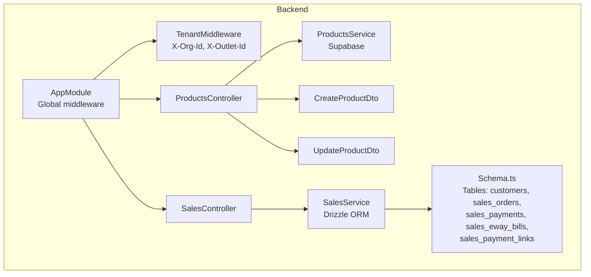
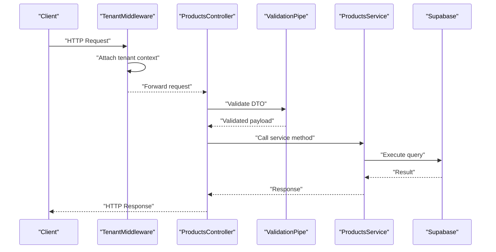
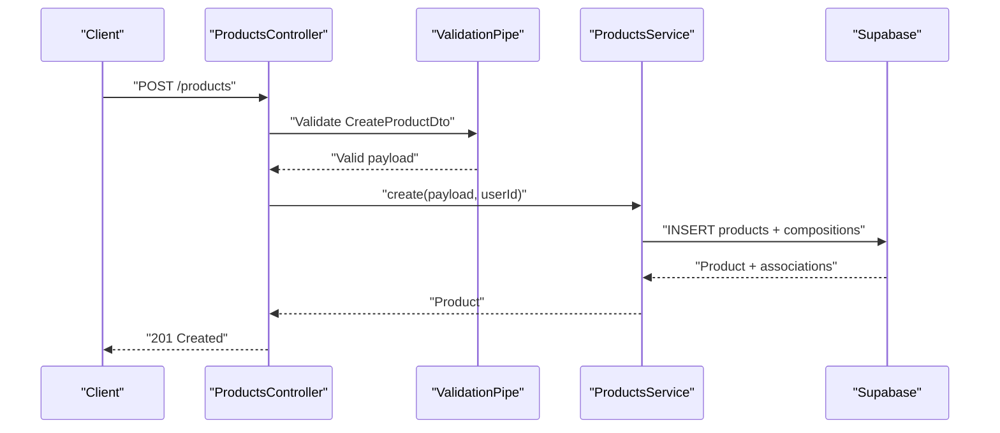
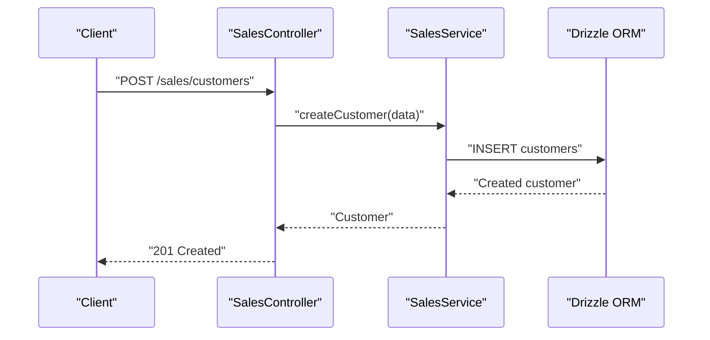
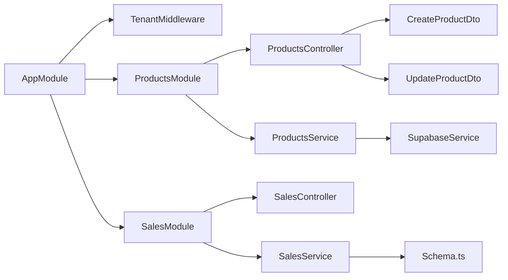

# API Endpoints & Controllers

<cite>
**Referenced Files in This Document**
- [main.ts](file://backend/src/main.ts)
- [app.module.ts](file://backend/src/app.module.ts)
- [tenant.middleware.ts](file://backend/src/common/middleware/tenant.middleware.ts)
- [products.controller.ts](file://backend/src/products/products.controller.ts)
- [products.service.ts](file://backend/src/products/products.service.ts)
- [create-product.dto.ts](file://backend/src/products/dto/create-product.dto.ts)
- [update-product.dto.ts](file://backend/src/products/dto/update-product.dto.ts)
- [sales.controller.ts](file://backend/src/sales/sales.controller.ts)
- [sales.service.ts](file://backend/src/sales/sales.service.ts)
- [schema.ts](file://backend/src/db/schema.ts)
- [supabase.service.ts](file://backend/src/supabase/supabase.service.ts)
- [.env.example](file://backend/.env.example)
- [package.json](file://backend/package.json)
</cite>

## Table of Contents
1. [Introduction](#introduction)
2. [Project Structure](#project-structure)
3. [Core Components](#core-components)
4. [Architecture Overview](#architecture-overview)
5. [Detailed Component Analysis](#detailed-component-analysis)
6. [Dependency Analysis](#dependency-analysis)
7. [Performance Considerations](#performance-considerations)
8. [Troubleshooting Guide](#troubleshooting-guide)
9. [Conclusion](#conclusion)
10. [Appendices](#appendices)

## Introduction
This document provides comprehensive API documentation for the REST endpoints in ZerpAI ERP’s backend. It covers:
- Product management endpoints: GET /products, POST /products, PUT /products/:id, and lookup endpoints for master data synchronization and usage checks.
- Sales operation endpoints: customer management, GSTIN lookup, payments, e-way bills, payment links, and sales orders/invoices.
- Customer management endpoints: GET /sales/customers, GET /sales/customers/:id, POST /sales/customers.
- Controller architecture, service layer integration, and DTO usage.
- Request/response schemas, parameter validation, error handling patterns, HTTP status codes, and API versioning strategy.
- Examples of complex queries, pagination, filtering, sorting, and client integration patterns.

## Project Structure
The backend is a NestJS application with modular separation:
- Modules: ProductsModule, SalesModule, SupabaseModule.
- Middleware: TenantMiddleware applied globally to enforce tenant context.
- Controllers: ProductsController and SalesController expose REST endpoints.
- Services: ProductsService (Supabase-backed) and SalesService (Drizzle ORM-backed).
- DTOs: Strongly typed request models for product creation and updates.
- Schema: Drizzle schema for relational tables used by SalesService.

**Diagram sources**
- [app.module.ts](file://backend/src/app.module.ts#L9-L19)
- [tenant.middleware.ts](file://backend/src/common/middleware/tenant.middleware.ts#L23-L39)
- [products.controller.ts](file://backend/src/products/products.controller.ts#L19-L250)
- [sales.controller.ts](file://backend/src/sales/sales.controller.ts#L14-L102)
- [products.service.ts](file://backend/src/products/products.service.ts#L8-L723)
- [sales.service.ts](file://backend/src/sales/sales.service.ts#L7-L162)
- [create-product.dto.ts](file://backend/src/products/dto/create-product.dto.ts#L21-L245)
- [update-product.dto.ts](file://backend/src/products/dto/update-product.dto.ts#L3-L6)
- [schema.ts](file://backend/src/db/schema.ts#L213-L291)

**Section sources**
- [app.module.ts](file://backend/src/app.module.ts#L9-L19)
- [tenant.middleware.ts](file://backend/src/common/middleware/tenant.middleware.ts#L23-L39)
- [products.controller.ts](file://backend/src/products/products.controller.ts#L19-L250)
- [sales.controller.ts](file://backend/src/sales/sales.controller.ts#L14-L102)
- [schema.ts](file://backend/src/db/schema.ts#L213-L291)

## Core Components
- ProductsController: Exposes product CRUD and lookup endpoints, including master data sync and usage checks.
- ProductsService: Implements product operations against Supabase, handles DTO mapping, and supports metadata synchronization with conflict resolution.
- SalesController: Exposes customer, GSTIN lookup, payment, e-way bill, payment link, and sales order endpoints.
- SalesService: Implements sales operations using Drizzle ORM with strong typing via schema definitions.
- DTOs: CreateProductDto and UpdateProductDto define request schemas and validation rules.
- Middleware: TenantMiddleware injects tenant context into requests (currently stubbed for testing).

**Section sources**
- [products.controller.ts](file://backend/src/products/products.controller.ts#L19-L250)
- [products.service.ts](file://backend/src/products/products.service.ts#L8-L723)
- [sales.controller.ts](file://backend/src/sales/sales.controller.ts#L14-L102)
- [sales.service.ts](file://backend/src/sales/sales.service.ts#L7-L162)
- [create-product.dto.ts](file://backend/src/products/dto/create-product.dto.ts#L21-L245)
- [update-product.dto.ts](file://backend/src/products/dto/update-product.dto.ts#L3-L6)
- [tenant.middleware.ts](file://backend/src/common/middleware/tenant.middleware.ts#L23-L39)

## Architecture Overview
The backend follows a layered architecture:
- HTTP Layer: NestJS controllers handle routing and request binding.
- Validation Layer: Global ValidationPipe enforces DTO constraints and transforms payloads.
- Service Layer: Business logic orchestrates data access and transformations.
- Data Access Layer: Supabase client for product operations; Drizzle ORM for sales data.
- Middleware: TenantMiddleware enriches requests with tenant context.

**Diagram sources**
- [main.ts](file://backend/src/main.ts#L26-L42)
- [tenant.middleware.ts](file://backend/src/common/middleware/tenant.middleware.ts#L23-L39)
- [products.controller.ts](file://backend/src/products/products.controller.ts#L227-L233)
- [products.service.ts](file://backend/src/products/products.service.ts#L18-L89)
- [supabase.service.ts](file://backend/src/supabase/supabase.service.ts#L28-L30)

## Detailed Component Analysis

### Product Management Endpoints
- Base path: /products
- Endpoints:
  - GET /products
  - GET /products/:id
  - POST /products
  - PUT /products/:id
  - DELETE /products/:id
  - Lookup endpoints (master data):
    - GET /products/lookups/units
    - POST /products/lookups/units/sync
    - POST /products/lookups/units/check-usage
    - GET /products/lookups/content-units
    - POST /products/lookups/content-units/sync
    - GET /products/lookups/categories
    - POST /products/lookups/categories/sync
    - GET /products/lookups/tax-rates
    - GET /products/lookups/manufacturers
    - POST /products/lookups/manufacturers/sync
    - GET /products/lookups/brands
    - POST /products/lookups/brands/sync
    - GET /products/lookups/vendors
    - POST /products/lookups/vendors/sync
    - GET /products/lookups/storage-locations
    - POST /products/lookups/storage-locations/sync
    - GET /products/lookups/racks
    - POST /products/lookups/racks/sync
    - GET /products/lookups/reorder-terms
    - POST /products/lookups/reorder-terms/sync
    - GET /products/lookups/accounts
    - POST /products/lookups/accounts/sync
    - GET /products/lookups/contents
    - POST /products/lookups/contents/sync
    - GET /products/lookups/strengths
    - POST /products/lookups/strengths/sync
    - GET /products/lookups/buying-rules
    - POST /products/lookups/buying-rules/sync
    - GET /products/lookups/drug-schedules
    - POST /products/lookups/drug-schedules/sync
    - POST /products/lookups/:lookup/check-usage

- Request/Response Schemas:
  - CreateProductDto and UpdateProductDto define the shape and validation rules for product creation and updates.
  - Lookup sync endpoints accept arrays of master data items and return upserted results.
  - Usage check endpoints return whether a lookup value is in use and where.

- Parameter Validation:
  - DTOs use class-validator decorators to enforce presence, types, enums, and optional fields.
  - Global ValidationPipe transforms and rejects non-whitelisted fields.

- Error Handling:
  - ValidationPipe returns structured errors with field, constraints, and value.
  - Service layer throws ConflictException on duplicate item codes and NotFoundException when resources are missing.
  - Generic Error exceptions are thrown for unexpected database errors.

- DTO Usage:
  - CreateProductDto: Used in POST /products.
  - UpdateProductDto: Generated from CreateProductDto using PartialType to allow partial updates.

- Complex Queries, Pagination, Filtering, Sorting:
  - findAll returns joined relations and sorts by created_at descending.
  - findOne returns product with related entities and compositions.
  - Lookup sync uses upsert with conflict resolution on unique keys.
  - Usage checks query related tables with optional active filters.

- HTTP Status Codes:
  - 200 OK for successful reads and updates.
  - 201 Created for successful creations.
  - 400 Bad Request for validation failures.
  - 404 Not Found for missing resources.
  - 409 Conflict for duplicate item codes.

- API Versioning Strategy:
  - Environment variable API_VERSION is set to v1; API_PREFIX is configurable via API_PREFIX.

- Client Integration Examples:
  - Create product: Send POST /products with CreateProductDto payload.
  - Update product: Send PUT /products/:id with UpdateProductDto payload.
  - Bulk sync units: Send POST /products/lookups/units/sync with array of unit objects.
  - Check usage: Send POST /products/lookups/units/check-usage with unitIds array.

**Section sources**
- [products.controller.ts](file://backend/src/products/products.controller.ts#L217-L248)
- [products.controller.ts](file://backend/src/products/products.controller.ts#L24-L216)
- [products.service.ts](file://backend/src/products/products.service.ts#L91-L118)
- [products.service.ts](file://backend/src/products/products.service.ts#L120-L146)
- [products.service.ts](file://backend/src/products/products.service.ts#L148-L179)
- [products.service.ts](file://backend/src/products/products.service.ts#L196-L389)
- [create-product.dto.ts](file://backend/src/products/dto/create-product.dto.ts#L21-L245)
- [update-product.dto.ts](file://backend/src/products/dto/update-product.dto.ts#L3-L6)
- [main.ts](file://backend/src/main.ts#L26-L42)
- [.env.example](file://backend/.env.example#L25-L27)

#### Product Controller Sequence

**Diagram sources**
- [products.controller.ts](file://backend/src/products/products.controller.ts#L227-L233)
- [products.service.ts](file://backend/src/products/products.service.ts#L18-L89)
- [supabase.service.ts](file://backend/src/supabase/supabase.service.ts#L28-L30)

### Sales Operation Endpoints
- Base path: /sales
- Endpoints:
  - GET /sales/customers
  - GET /sales/customers/:id
  - POST /sales/customers
  - GET /sales/gstin/lookup?gstin=...
  - GET /sales/payments
  - POST /sales/payments
  - GET /sales/eway-bills
  - POST /sales/eway-bills
  - GET /sales/payment-links
  - POST /sales/payment-links
  - GET /sales?type=...
  - GET /sales/:id
  - POST /sales
  - DELETE /sales/:id

- Request/Response Schemas:
  - Strong typing via Drizzle schema for customers, sales orders, payments, e-way bills, and payment links.
  - GSTIN lookup returns mock response with legal name, trade name, status, taxpayer type, and addresses.

- Parameter Validation:
  - Query parameters (e.g., gstin) are parsed from the request.
  - Body payloads are accepted as generic objects; in practice, clients should align payloads with schema expectations.

- Error Handling:
  - NotFoundException is thrown when a requested customer or sales record is not found.

- HTTP Status Codes:
  - 200 OK for successful reads and updates.
  - 201 Created for successful creations.
  - 404 Not Found for missing resources.

- Client Integration Examples:
  - Create customer: Send POST /sales/customers with customer fields.
  - Lookup GSTIN: Send GET /sales/gstin/lookup?gstin=...
  - Create payment: Send POST /sales/payments with payment fields.
  - Create e-way bill: Send POST /sales/eway-bills with e-way bill fields.
  - Create payment link: Send POST /sales/payment-links with link fields.
  - Create sales order: Send POST /sales with sales order fields.

**Section sources**
- [sales.controller.ts](file://backend/src/sales/sales.controller.ts#L18-L100)
- [sales.service.ts](file://backend/src/sales/sales.service.ts#L29-L160)
- [schema.ts](file://backend/src/db/schema.ts#L213-L291)

#### Sales Controller Sequence

**Diagram sources**
- [sales.controller.ts](file://backend/src/sales/sales.controller.ts#L29-L33)
- [sales.service.ts](file://backend/src/sales/sales.service.ts#L42-L61)
- [schema.ts](file://backend/src/db/schema.ts#L213-L234)

### Customer Management Endpoints
- Base path: /sales/customers
- Endpoints:
  - GET /sales/customers
  - GET /sales/customers/:id
  - POST /sales/customers

- Behavior:
  - findAllCustomers returns all customer records.
  - findCustomerById returns a single customer or throws NotFoundException.
  - createCustomer inserts a new customer with provided fields.

- HTTP Status Codes:
  - 200 OK for GET.
  - 201 Created for POST.
  - 404 Not Found for missing customer.

**Section sources**
- [sales.controller.ts](file://backend/src/sales/sales.controller.ts#L18-L33)
- [sales.service.ts](file://backend/src/sales/sales.service.ts#L29-L61)

## Dependency Analysis
- NestJS AppModule configures global middleware and imports module boundaries.
- ProductsController depends on ProductsService and DTOs.
- SalesController depends on SalesService and Drizzle schema.
- SupabaseService provides a singleton client for product operations.
- ValidationPipe is configured globally to enforce DTO constraints.

**Diagram sources**
- [app.module.ts](file://backend/src/app.module.ts#L9-L19)
- [products.controller.ts](file://backend/src/products/products.controller.ts#L19-L250)
- [products.service.ts](file://backend/src/products/products.service.ts#L8-L723)
- [sales.controller.ts](file://backend/src/sales/sales.controller.ts#L14-L102)
- [sales.service.ts](file://backend/src/sales/sales.service.ts#L7-L162)
- [supabase.service.ts](file://backend/src/supabase/supabase.service.ts#L7-L31)
- [schema.ts](file://backend/src/db/schema.ts#L1-L293)

**Section sources**
- [app.module.ts](file://backend/src/app.module.ts#L9-L19)
- [products.controller.ts](file://backend/src/products/products.controller.ts#L19-L250)
- [sales.controller.ts](file://backend/src/sales/sales.controller.ts#L14-L102)
- [supabase.service.ts](file://backend/src/supabase/supabase.service.ts#L7-L31)
- [schema.ts](file://backend/src/db/schema.ts#L1-L293)

## Performance Considerations
- Prefer selective field retrieval and joins only when needed to reduce payload sizes.
- Use server-side filtering and sorting for large datasets; avoid client-side pagination.
- Batch operations for lookup syncs to minimize round trips.
- Monitor Supabase and Drizzle query performance; consider indexing on frequently filtered columns.

## Troubleshooting Guide
- Validation Failures:
  - The global ValidationPipe returns a structured array of validation errors with field, constraints, and value. Inspect the response to identify invalid fields.
- Duplicate Item Codes:
  - Creating or updating a product may trigger a ConflictException if the item code already exists.
- Resource Not Found:
  - Deleting or retrieving non-existent resources yields a NotFoundException.
- Tenant Context:
  - TenantMiddleware currently injects test context; ensure proper headers (X-Org-Id, X-Outlet-Id) are passed in production.

**Section sources**
- [main.ts](file://backend/src/main.ts#L26-L42)
- [products.service.ts](file://backend/src/products/products.service.ts#L45-L51)
- [products.service.ts](file://backend/src/products/products.service.ts#L171-L176)
- [sales.service.ts](file://backend/src/sales/sales.service.ts#L34-L40)
- [sales.service.ts](file://backend/src/sales/sales.service.ts#L72-L78)
- [sales.service.ts](file://backend/src/sales/sales.service.ts#L100-L106)
- [tenant.middleware.ts](file://backend/src/common/middleware/tenant.middleware.ts#L23-L39)

## Conclusion
ZerpAI ERP’s backend provides a clear separation of concerns with robust DTO-driven validation, modular controllers, and service-layer operations. Product endpoints support comprehensive CRUD and master data synchronization, while sales endpoints cover customer management, payments, e-way bills, payment links, and sales orders. The architecture leverages Supabase and Drizzle ORM for data persistence, with global validation and structured error handling for reliable client integrations.

## Appendices

### API Versioning and Base URL
- API version: v1 (configured via environment variable).
- API prefix: configurable via environment variable (default present in configuration).
- Example base URL pattern: https://host/api/v1

**Section sources**
- [.env.example](file://backend/.env.example#L25-L27)

### Request/Response Schemas Overview
- Product Creation (CreateProductDto):
  - Includes product type, identifiers, tax preferences, pricing, images, sales/purchase info, formulation, composition, inventory settings, and status flags.
- Product Update (UpdateProductDto):
  - Partial fields derived from CreateProductDto to allow incremental updates.
- Sales Entities (Schema.ts):
  - Strongly typed tables for customers, sales orders, payments, e-way bills, and payment links.

**Section sources**
- [create-product.dto.ts](file://backend/src/products/dto/create-product.dto.ts#L21-L245)
- [update-product.dto.ts](file://backend/src/products/dto/update-product.dto.ts#L3-L6)
- [schema.ts](file://backend/src/db/schema.ts#L213-L291)

### Client Integration Patterns
- Use consistent headers: Content-Type: application/json, Authorization (when available), and tenant headers (X-Org-Id, X-Outlet-Id).
- Validate DTOs client-side before sending requests to reduce server load.
- For bulk operations, batch requests and handle partial failures gracefully.

**Section sources**
- [main.ts](file://backend/src/main.ts#L19-L24)
- [tenant.middleware.ts](file://backend/src/common/middleware/tenant.middleware.ts#L23-L39)