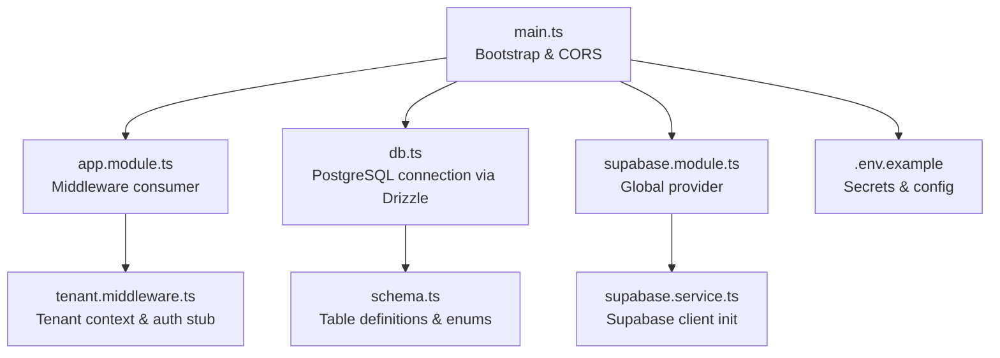
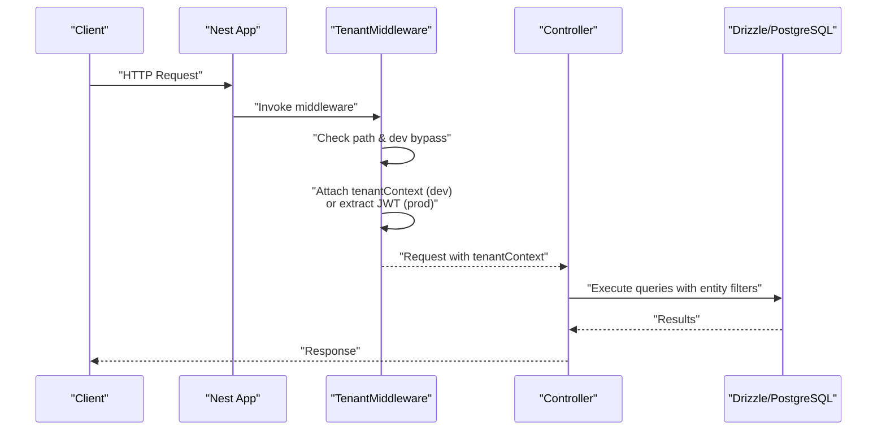
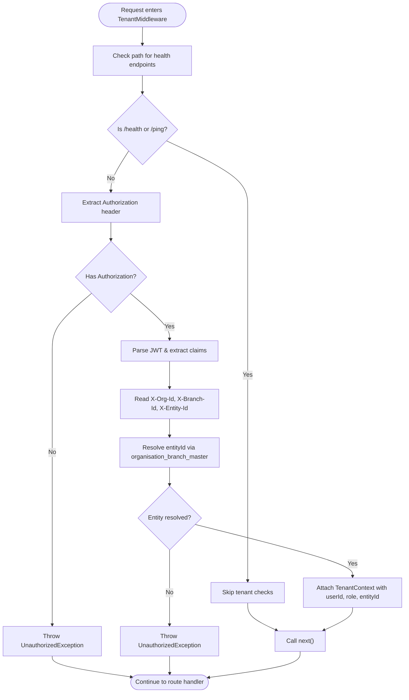
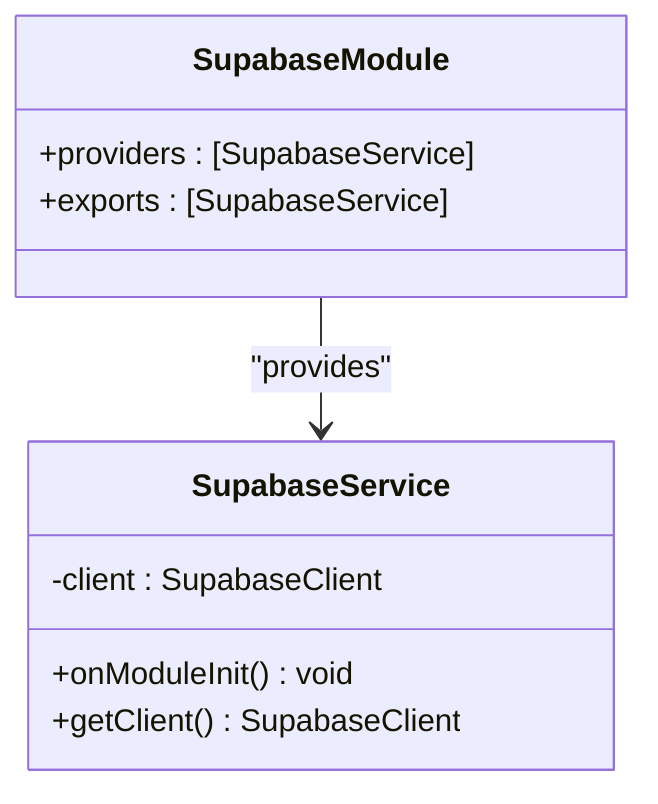
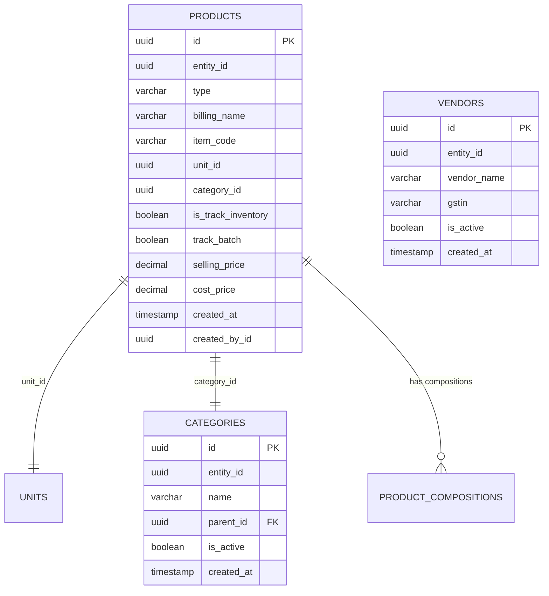
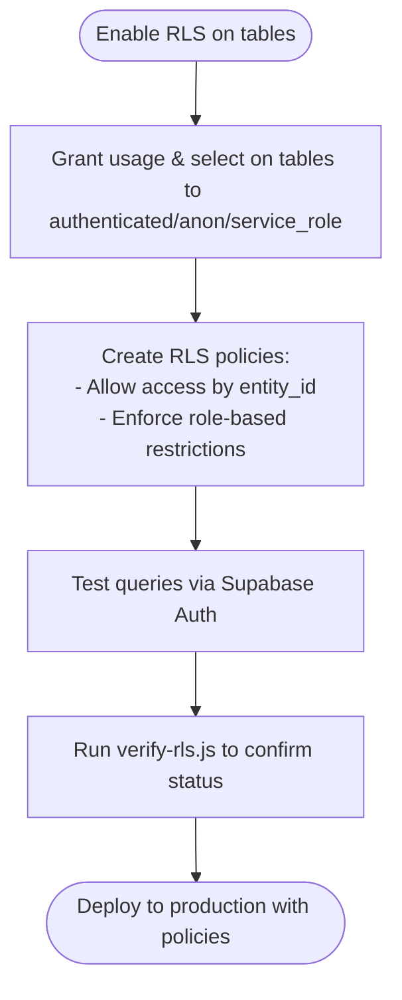
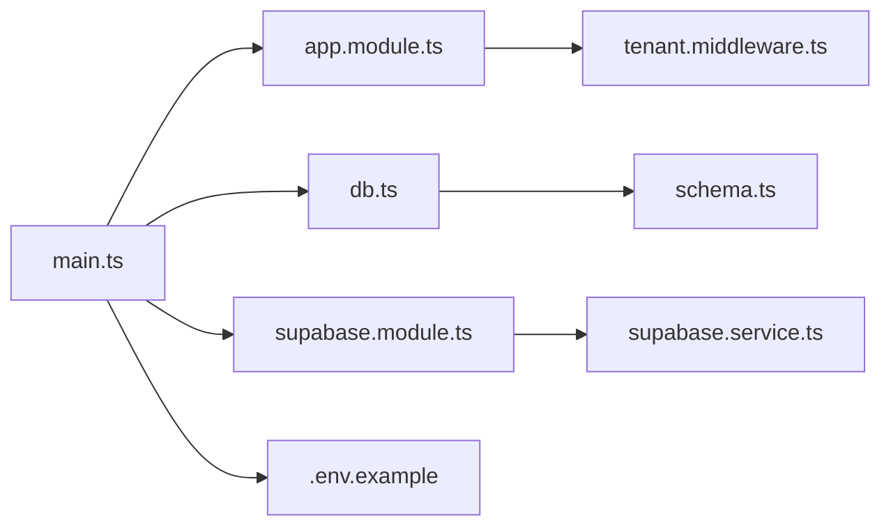

# Authentication & Security
**Last Updated: 2026-04-20 12:46:08**

<cite>
**Referenced Files in This Document**
- [tenant.middleware.ts](file://backend/src/common/middleware/tenant.middleware.ts)
- [app.module.ts](file://backend/src/app.module.ts)
- [main.ts](file://backend/src/main.ts)
- [db.ts](file://backend/src/db/db.ts)
- [schema.ts](file://backend/src/db/schema.ts)
- [supabase.service.ts](file://backend/src/supabase/supabase.service.ts)
- [supabase.module.ts](file://backend/src/supabase/supabase.module.ts)
- [.env.example](file://backend/.env.example)
- [001_initial_schema_and_seed.sql](file://supabase/migrations/001_initial_schema_and_seed.sql)
- [fix_rls.sql](file://backend/fix_rls.sql)
- [grant-permissions.js](file://backend/grant-permissions.js)
- [verify-rls.js](file://backend/verify-rls.js)
- [package.json](file://backend/package.json)
</cite>

## Table of Contents
1. [Introduction](#introduction)
2. [Project Structure](#project-structure)
3. [Core Components](#core-components)
4. [Architecture Overview](#architecture-overview)
5. [Detailed Component Analysis](#detailed-component-analysis)
6. [Dependency Analysis](#dependency-analysis)
7. [Performance Considerations](#performance-considerations)
8. [Troubleshooting Guide](#troubleshooting-guide)
9. [Conclusion](#conclusion)
10. [Appendices](#appendices)

## Introduction
This document provides comprehensive security documentation for the ZerpAI ERP backend. It focuses on authentication and authorization mechanisms, multi-tenant architecture, organization or branch entity isolation, tenant context management, row-level security (RLS) policies, data access controls, input validation, sanitization, and protections against common vulnerabilities. It also covers session management, security headers, secure API development practices, data encryption, audit logging, and compliance considerations for Indian business regulations.

## Project Structure
Security-relevant components are primarily located under the backend/src directory:
- Middleware for tenant context extraction and enforcement
- Database configuration and Drizzle ORM schema definitions
- Supabase client initialization and module wiring
- Application bootstrap with CORS and validation pipes
- Environment variables for secrets and configuration
- Supabase migrations defining multi-tenant tables and indexes

**Diagram sources**
- [main.ts](file://backend/src/main.ts#L10-L56)
- [app.module.ts](file://backend/src/app.module.ts#L9-L19)
- [tenant.middleware.ts](file://backend/src/common/middleware/tenant.middleware.ts#L22-L70)
- [db.ts](file://backend/src/db/db.ts#L1-L13)
- [schema.ts](file://backend/src/db/schema.ts#L1-L293)
- [supabase.module.ts](file://backend/src/supabase/supabase.module.ts#L1-L12)
- [supabase.service.ts](file://backend/src/supabase/supabase.service.ts#L6-L32)
- [.env.example](file://backend/.env.example#L1-L40)

**Section sources**
- [main.ts](file://backend/src/main.ts#L10-L56)
- [app.module.ts](file://backend/src/app.module.ts#L9-L19)
- [tenant.middleware.ts](file://backend/src/common/middleware/tenant.middleware.ts#L22-L70)
- [db.ts](file://backend/src/db/db.ts#L1-L13)
- [schema.ts](file://backend/src/db/schema.ts#L1-L293)
- [supabase.module.ts](file://backend/src/supabase/supabase.module.ts#L1-L12)
- [supabase.service.ts](file://backend/src/supabase/supabase.service.ts#L6-L32)
- [.env.example](file://backend/.env.example#L1-L40)

## Core Components
- Tenant Middleware: Extracts organization and branch context from `X-Entity-Id` header, resolves `entityId` via `organisation_branch_master`, and attaches a `TenantContext` to requests. Controllers access it via the `@Tenant()` decorator.
- Supabase Service: Initializes a Supabase client using service role credentials with disabled automatic token refresh and session persistence.
- Database Layer: Uses Drizzle ORM with a PostgreSQL connection configured via environment variables.
- Application Bootstrap: Enables CORS for trusted origins, registers a global validation pipe, and logs environment details.

Key security implications:
- Tenant context is currently injected for development; production requires JWT verification and role extraction.
- Supabase client is initialized with service role credentials; ensure least privilege and avoid exposing these keys.
- Validation pipe enforces DTO whitelisting and transforms inputs, aiding in input sanitization.

**Section sources**
- [tenant.middleware.ts](file://backend/src/common/middleware/tenant.middleware.ts#L6-L20)
- [tenant.middleware.ts](file://backend/src/common/middleware/tenant.middleware.ts#L24-L70)
- [supabase.service.ts](file://backend/src/supabase/supabase.service.ts#L10-L30)
- [db.ts](file://backend/src/db/db.ts#L7-L12)
- [main.ts](file://backend/src/main.ts#L19-L42)

## Architecture Overview
The backend applies a tenant middleware globally to enforce multi-tenant context on all routes. Requests carry entity identifiers via headers. The Supabase client is used for database operations. The current implementation bypasses authentication for development, while production code is marked as TODO for JWT verification and role extraction.

**Diagram sources**
- [app.module.ts](file://backend/src/app.module.ts#L15-L18)
- [tenant.middleware.ts](file://backend/src/common/middleware/tenant.middleware.ts#L24-L70)
- [db.ts](file://backend/src/db/db.ts#L7-L12)

## Detailed Component Analysis

### Tenant Middleware
Purpose:
- Enforce multi-tenant context per request
- Extract entity identifiers from headers
- Attach a typed tenant context to the request object
- Provide development bypass and production TODO markers

Current behavior:
- Health endpoints are skipped
- Development bypass attaches a static tenant context
- Production code is commented out with TODOs for JWT parsing and role extraction

Recommended improvements:
- Implement JWT verification and extract user ID, role, and tenant claims
- Enforce mandatory presence of X-Entity-Id header
- Add strict validation and error handling for missing or invalid headers
- Integrate with Supabase Auth for session validation

**Diagram sources**
- [tenant.middleware.ts](file://backend/src/common/middleware/tenant.middleware.ts#L24-L70)

**Section sources**
- [tenant.middleware.ts](file://backend/src/common/middleware/tenant.middleware.ts#L24-L70)

### Supabase Service and Module
Purpose:
- Initialize a Supabase client using service role credentials
- Provide a global singleton for database operations

Security considerations:
- Service role key must be protected and rotated regularly
- Automatic token refresh and session persistence are disabled to prevent unintended session leakage
- Ensure the client is only used for administrative tasks and never exposed to untrusted contexts

**Diagram sources**
- [supabase.module.ts](file://backend/src/supabase/supabase.module.ts#L6-L11)
- [supabase.service.ts](file://backend/src/supabase/supabase.service.ts#L6-L31)

**Section sources**
- [supabase.module.ts](file://backend/src/supabase/supabase.module.ts#L1-L12)
- [supabase.service.ts](file://backend/src/supabase/supabase.service.ts#L10-L30)

### Database Layer and Multi-Tenant Schema
Purpose:
- Define tables with organization and branch identifiers for multi-tenant isolation
- Provide indexes for efficient filtering by entity_id
- Support product, category, vendor, and related lookup tables

Security implications:
- Tables include `entity_id uuid NOT NULL` FK to `organisation_branch_master(id)` for tenant isolation
- `organisation_branch_master`: `type` = `'ORG'` or `'BRANCH'`, `ref_id` links to actual org or branch UUID
- Global lookup tables (products, categories, tax_rates, etc.) have no `entity_id` and are shared across all tenants

**Diagram sources**
- [schema.ts](file://backend/src/db/schema.ts#L117-L195)
- [schema.ts](file://backend/src/db/schema.ts#L213-L234)
- [schema.ts](file://backend/src/db/schema.ts#L101-L114)
- [001_initial_schema_and_seed.sql](file://supabase/migrations/001_initial_schema_and_seed.sql#L24-L89)

**Section sources**
- [schema.ts](file://backend/src/db/schema.ts#L117-L195)
- [schema.ts](file://backend/src/db/schema.ts#L213-L234)
- [schema.ts](file://backend/src/db/schema.ts#L101-L114)
- [001_initial_schema_and_seed.sql](file://supabase/migrations/001_initial_schema_and_seed.sql#L24-L89)

### Row-Level Security (RLS) Policies and Data Access Controls
Current state:
- Migration comments indicate RLS was disabled for development
- Utility scripts exist to temporarily disable RLS and grant permissions for testing
- Verification script reports RLS status across tables

Recommended actions:
- Re-enable RLS on all tenant-relevant tables
- Define precise RLS policies to restrict access to records based on entity_id
- Ensure policies apply to authenticated sessions and enforce role-based access
- Use Supabase Auth to tie user sessions to entity_id scoping

**Diagram sources**
- [fix_rls.sql](file://backend/fix_rls.sql#L1-L16)
- [grant-permissions.js](file://backend/grant-permissions.js#L8-L39)
- [verify-rls.js](file://backend/verify-rls.js#L8-L43)
- [001_initial_schema_and_seed.sql](file://supabase/migrations/001_initial_schema_and_seed.sql#L137-L141)

**Section sources**
- [fix_rls.sql](file://backend/fix_rls.sql#L1-L16)
- [grant-permissions.js](file://backend/grant-permissions.js#L8-L39)
- [verify-rls.js](file://backend/verify-rls.js#L8-L43)
- [001_initial_schema_and_seed.sql](file://supabase/migrations/001_initial_schema_and_seed.sql#L137-L141)

### Input Validation, Sanitization, and Vulnerability Protection
- Global Validation Pipe: Enabled with whitelist and forbidNonWhitelisted to reject unknown fields and transform inputs
- Allowed Headers: Authorization, Content-Type, X-Entity-Id
- Recommended enhancements:
  - Implement CSRF protection for state-changing requests
  - Sanitize rich text inputs and escape HTML where rendered
  - Use parameterized queries (already enforced by Drizzle)
  - Validate and normalize numeric inputs (prices, quantities)
  - Enforce maximum lengths and charset restrictions for identifiers

**Section sources**
- [main.ts](file://backend/src/main.ts#L26-L42)
- [main.ts](file://backend/src/main.ts#L19-L24)

### Authentication Flow and Session Management
Current state:
- Tenant middleware includes a development bypass and production TODOs for JWT verification and role extraction
- Supabase client is initialized with service role credentials

Recommended implementation:
- Integrate with Supabase Auth for JWT-based authentication
- Extract user ID, role, and tenant claims from JWT
- Enforce session validation and refresh tokens via Supabase Auth, scoped by entity context
- Store minimal session data server-side and avoid sensitive data in cookies

**Section sources**
- [tenant.middleware.ts](file://backend/src/common/middleware/tenant.middleware.ts#L41-L67)
- [supabase.service.ts](file://backend/src/supabase/supabase.service.ts#L18-L23)

### Security Headers Implementation
- CORS is enabled for specific origins with credentials and selected methods
- Additional headers should be considered:
  - Strict-Transport-Security for HTTPS enforcement
  - Content-Security-Policy to mitigate XSS
  - X-Content-Type-Options: nosniff
  - X-Frame-Options: DENY
  - Referrer-Policy: strict-origin-when-cross-origin

**Section sources**
- [main.ts](file://backend/src/main.ts#L19-L24)

### Secure API Development Guidelines
- Use DTOs with class-validator/class-transformer for input validation and transformation
- Centralize tenant context checks in middleware
- Log validation errors and security events without exposing sensitive data
- Implement rate limiting and request size limits
- Use HTTPS everywhere and rotate secrets regularly

**Section sources**
- [main.ts](file://backend/src/main.ts#L26-L42)
- [package.json](file://backend/package.json#L22-L37)

### Data Encryption and Audit Logging
- Data at rest: Use database encryption features provided by the hosting platform
- Data in transit: Enforce TLS for all connections
- Audit logging: Track user actions, tenant access attempts, and policy violations
- Retention: Define retention policies for logs and ensure immutable storage

**Section sources**
- [.env.example](file://backend/.env.example#L3-L10)

### Compliance Considerations for Indian Business Regulations
- GST compliance: Ensure tax-related fields and validations align with GST requirements
- Financial reporting: Maintain audit trails for financial transactions
- Data localization: Store data within jurisdictional boundaries where applicable
- Privacy: Protect personal data and implement data subject rights mechanisms

[No sources needed since this section provides general guidance]

## Dependency Analysis

**Diagram sources**
- [main.ts](file://backend/src/main.ts#L10-L56)
- [app.module.ts](file://backend/src/app.module.ts#L9-L19)
- [tenant.middleware.ts](file://backend/src/common/middleware/tenant.middleware.ts#L22-L70)
- [db.ts](file://backend/src/db/db.ts#L1-L13)
- [schema.ts](file://backend/src/db/schema.ts#L1-L293)
- [supabase.module.ts](file://backend/src/supabase/supabase.module.ts#L1-L12)
- [supabase.service.ts](file://backend/src/supabase/supabase.service.ts#L6-L32)
- [.env.example](file://backend/.env.example#L1-L40)

**Section sources**
- [main.ts](file://backend/src/main.ts#L10-L56)
- [app.module.ts](file://backend/src/app.module.ts#L9-L19)
- [tenant.middleware.ts](file://backend/src/common/middleware/tenant.middleware.ts#L22-L70)
- [db.ts](file://backend/src/db/db.ts#L1-L13)
- [schema.ts](file://backend/src/db/schema.ts#L1-L293)
- [supabase.module.ts](file://backend/src/supabase/supabase.module.ts#L1-L12)
- [supabase.service.ts](file://backend/src/supabase/supabase.service.ts#L6-L32)
- [.env.example](file://backend/.env.example#L1-L40)

## Performance Considerations
- Use indexes on entity_id for tenant filtering
- Prefer batch operations for bulk updates
- Limit result sets with pagination and appropriate filters
- Monitor slow queries and optimize RLS policies

[No sources needed since this section provides general guidance]

## Troubleshooting Guide
Common issues and resolutions:
- Missing tenant context: Ensure `X-Entity-Id` header is present; verify middleware path exemptions
- Validation failures: Review global validation pipe error logs and DTO constraints
- RLS not working: Confirm RLS is enabled and policies are correctly defined; use verification script
- Supabase client errors: Verify SUPABASE_URL and SUPABASE_SERVICE_ROLE_KEY are set and valid

**Section sources**
- [tenant.middleware.ts](file://backend/src/common/middleware/tenant.middleware.ts#L24-L70)
- [main.ts](file://backend/src/main.ts#L26-L42)
- [verify-rls.js](file://backend/verify-rls.js#L8-L43)
- [supabase.service.ts](file://backend/src/supabase/supabase.service.ts#L14-L16)

## Conclusion
The ZerpAI ERP backend currently implements a foundational multi-tenant architecture with tenant context propagation via headers and a Supabase client. Authentication and authorization are not yet fully enforced in production, with development bypasses in place. To achieve a secure production deployment, implement JWT-based authentication, enforce RLS policies, strengthen input validation, and adopt comprehensive security headers and logging practices aligned with Indian business regulations.

[No sources needed since this section summarizes without analyzing specific files]

## Appendices
- Environment variables reference: DATABASE_URL, SUPABASE_URL, SUPABASE_SERVICE_ROLE_KEY, JWT_SECRET, CORS_ORIGINS, API_PREFIX, API_VERSION
- Supabase migration notes: Multi-tenant tables, indexes, and RLS comments

**Section sources**
- [.env.example](file://backend/.env.example#L3-L27)
- [001_initial_schema_and_seed.sql](file://supabase/migrations/001_initial_schema_and_seed.sql#L123-L141)
