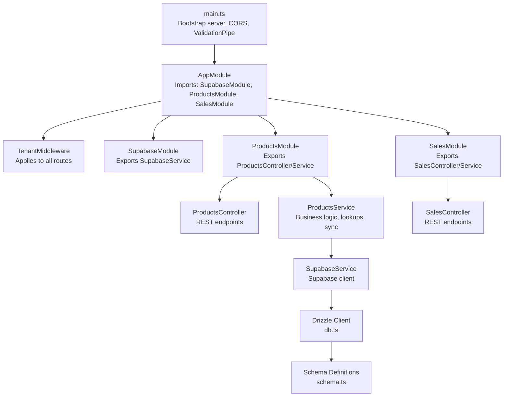
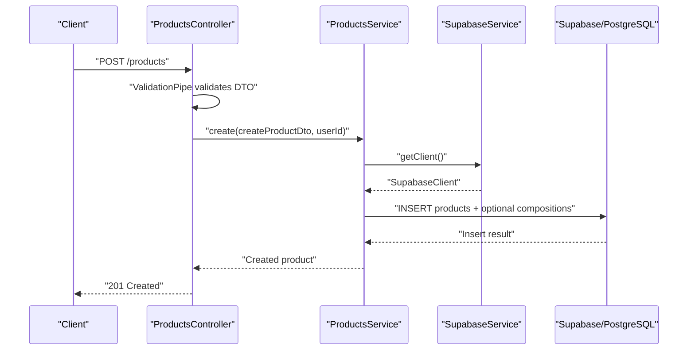
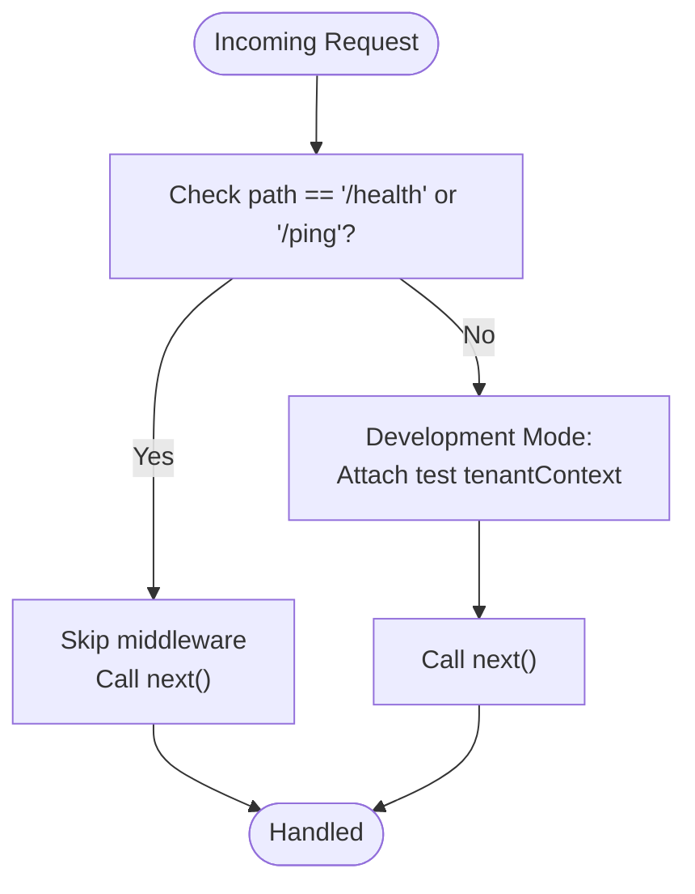
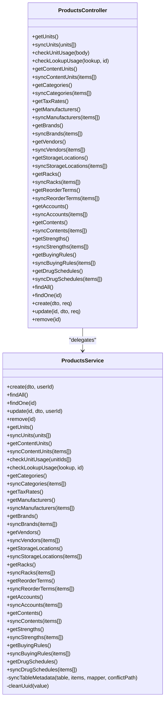
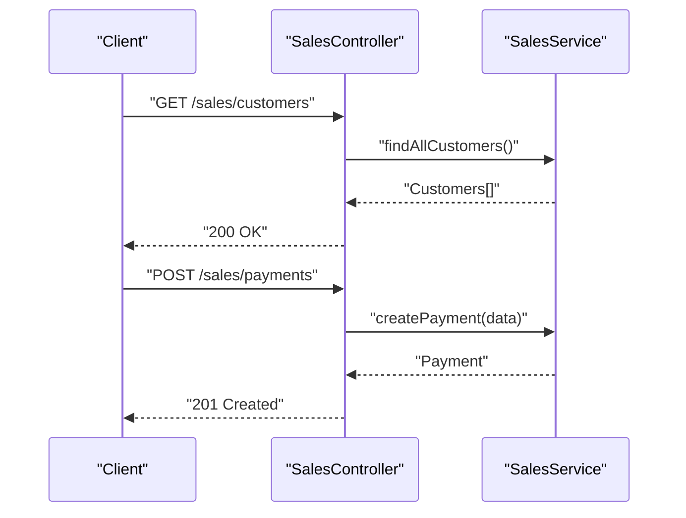
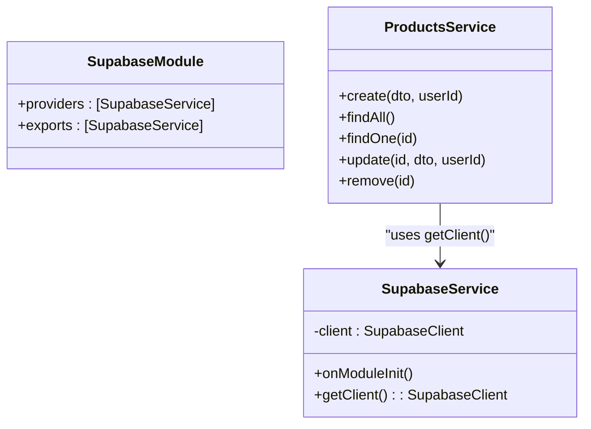
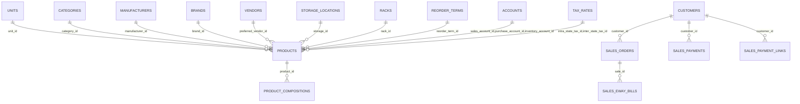
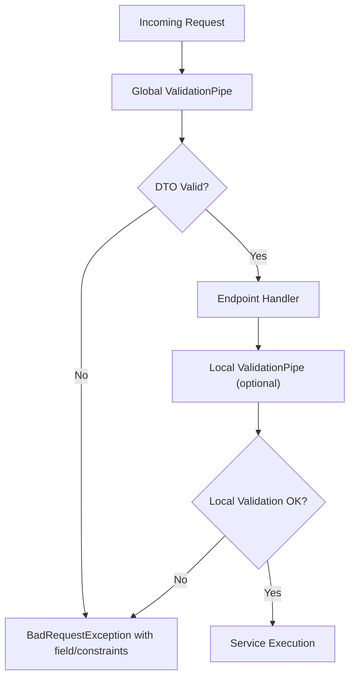
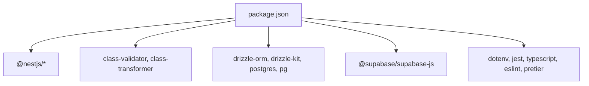

# Backend Development

<cite>
**Referenced Files in This Document**
- [app.module.ts](file://backend/src/app.module.ts)
- [main.ts](file://backend/src/main.ts)
- [tenant.middleware.ts](file://backend/src/common/middleware/tenant.middleware.ts)
- [schema.ts](file://backend/src/db/schema.ts)
- [db.ts](file://backend/src/db/db.ts)
- [products.module.ts](file://backend/src/products/products.module.ts)
- [products.controller.ts](file://backend/src/products/products.controller.ts)
- [products.service.ts](file://backend/src/products/products.service.ts)
- [create-product.dto.ts](file://backend/src/products/dto/create-product.dto.ts)
- [update-product.dto.ts](file://backend/src/products/dto/update-product.dto.ts)
- [sales.module.ts](file://backend/src/sales/sales.module.ts)
- [sales.controller.ts](file://backend/src/sales/sales.controller.ts)
- [supabase.module.ts](file://backend/src/supabase/supabase.module.ts)
- [supabase.service.ts](file://backend/src/supabase/supabase.service.ts)
- [package.json](file://backend/package.json)
</cite>

## Table of Contents
1. [Introduction](#introduction)
2. [Project Structure](#project-structure)
3. [Core Components](#core-components)
4. [Architecture Overview](#architecture-overview)
5. [Detailed Component Analysis](#detailed-component-analysis)
6. [Dependency Analysis](#dependency-analysis)
7. [Performance Considerations](#performance-considerations)
8. [Troubleshooting Guide](#troubleshooting-guide)
9. [Conclusion](#conclusion)
10. [Appendices](#appendices)

## Introduction
This document provides comprehensive backend development guidance for the NestJS-based ZerpAI ERP API. It explains module organization, dependency injection patterns, controller-service architecture, multi-tenant middleware, database schema design, and Drizzle ORM usage. It also documents REST API endpoints, request/response patterns, data validation strategies, Supabase integration, authentication patterns, and security implementations. Finally, it offers guidelines for creating new modules, implementing business logic consistently, and maintaining API stability.

## Project Structure
The backend follows a NestJS modular architecture with feature-based modules (products, sales) and shared infrastructure (Supabase, middleware, database). The application bootstraps via main.ts, applies global validation, enables CORS, and registers middleware to enforce tenant context across all routes. Modules import and expose services/providers, while controllers define REST endpoints.

**Diagram sources**
- [main.ts](file://backend/src/main.ts#L10-L56)
- [app.module.ts](file://backend/src/app.module.ts#L9-L19)
- [tenant.middleware.ts](file://backend/src/common/middleware/tenant.middleware.ts#L23-L69)
- [supabase.module.ts](file://backend/src/supabase/supabase.module.ts#L6-L11)
- [supabase.service.ts](file://backend/src/supabase/supabase.service.ts#L7-L31)
- [products.module.ts](file://backend/src/products/products.module.ts#L7-L11)
- [products.controller.ts](file://backend/src/products/products.controller.ts#L19-L250)
- [products.service.ts](file://backend/src/products/products.service.ts#L8-L9)
- [sales.module.ts](file://backend/src/sales/sales.module.ts#L5-L10)
- [sales.controller.ts](file://backend/src/sales/sales.controller.ts#L14-L102)
- [db.ts](file://backend/src/db/db.ts#L1-L13)
- [schema.ts](file://backend/src/db/schema.ts#L1-L293)

**Section sources**
- [main.ts](file://backend/src/main.ts#L10-L56)
- [app.module.ts](file://backend/src/app.module.ts#L9-L19)

## Core Components
- Application bootstrap and middleware registration
  - main.ts configures CORS, global ValidationPipe, and starts the server.
  - AppModule registers SupabaseModule, ProductsModule, SalesModule, and applies TenantMiddleware to all routes.
- Multi-tenant middleware
  - TenantMiddleware injects a tenant context into requests, currently stubbed for testing and development. Production-ready auth parsing is commented and marked for future implementation.
- Supabase integration
  - SupabaseModule provides a globally scoped SupabaseService that initializes a Supabase client using environment variables and exposes a getClient method for services.
- Drizzle ORM and database
  - db.ts creates a Drizzle client connected to the PostgreSQL database via DATABASE_URL.
  - schema.ts defines enums and tables for products, lookups, and sales entities.

**Section sources**
- [main.ts](file://backend/src/main.ts#L10-L56)
- [app.module.ts](file://backend/src/app.module.ts#L9-L19)
- [tenant.middleware.ts](file://backend/src/common/middleware/tenant.middleware.ts#L23-L69)
- [supabase.module.ts](file://backend/src/supabase/supabase.module.ts#L6-L11)
- [supabase.service.ts](file://backend/src/supabase/supabase.service.ts#L7-L31)
- [db.ts](file://backend/src/db/db.ts#L1-L13)
- [schema.ts](file://backend/src/db/schema.ts#L1-L293)

## Architecture Overview
The system follows a layered NestJS architecture:
- Controllers handle HTTP requests and delegate to Services.
- Services encapsulate business logic and coordinate with Supabase for persistence.
- Middleware enforces tenant context before controllers execute.
- ValidationPipe ensures DTO constraints are enforced globally.

**Diagram sources**
- [products.controller.ts](file://backend/src/products/products.controller.ts#L227-L233)
- [products.service.ts](file://backend/src/products/products.service.ts#L18-L89)
- [supabase.service.ts](file://backend/src/supabase/supabase.service.ts#L28-L30)

## Detailed Component Analysis

### Multi-Tenant Middleware
- Purpose: Inject tenant context into every request except health endpoints.
- Behavior:
  - Currently stubbed to attach a test tenant context for development.
  - Production code is present as comments and can be enabled to parse Authorization headers and extract X-Org-Id/X-Branch-Id.
- Impact: Ensures downstream services can enforce tenant scoping via the tenantContext property.

**Diagram sources**
- [tenant.middleware.ts](file://backend/src/common/middleware/tenant.middleware.ts#L24-L39)

**Section sources**
- [tenant.middleware.ts](file://backend/src/common/middleware/tenant.middleware.ts#L23-L69)

### Products Module
- Module organization:
  - ProductsModule declares ProductsController and ProductsService.
- Controller responsibilities:
  - CRUD endpoints for products.
  - Lookup endpoints for units, categories, tax rates, manufacturers, brands, vendors, storage locations, racks, reorder terms, accounts, contents, strengths, buying rules, and drug schedules.
  - Sync endpoints for each lookup to upsert metadata with conflict handling.
  - ValidationPipe applied per endpoint where needed.
- Service responsibilities:
  - Business logic for create/update/find/soft-delete.
  - Lookup retrieval and usage checks.
  - Generic syncTableMetadata helper to upsert lookups with conflict resolution and deactivation of removed records.
  - UUID cleaning and legacy key mapping for compatibility.

**Diagram sources**
- [products.controller.ts](file://backend/src/products/products.controller.ts#L19-L250)
- [products.service.ts](file://backend/src/products/products.service.ts#L8-L723)

**Section sources**
- [products.module.ts](file://backend/src/products/products.module.ts#L7-L11)
- [products.controller.ts](file://backend/src/products/products.controller.ts#L19-L250)
- [products.service.ts](file://backend/src/products/products.service.ts#L8-L723)

### Sales Module
- Module organization:
  - SalesModule declares SalesController and SalesService.
- Controller responsibilities:
  - Customer CRUD endpoints.
  - GSTIN lookup endpoint.
  - Payments CRUD endpoints.
  - E-Way bills CRUD endpoints.
  - Payment links CRUD endpoints.
  - Sales orders/invoices/list endpoints with optional type filtering.

**Diagram sources**
- [sales.controller.ts](file://backend/src/sales/sales.controller.ts#L14-L102)

**Section sources**
- [sales.module.ts](file://backend/src/sales/sales.module.ts#L5-L10)
- [sales.controller.ts](file://backend/src/sales/sales.controller.ts#L14-L102)

### Supabase Integration
- SupabaseModule provides a globally scoped SupabaseService.
- SupabaseService initializes a Supabase client using SUPABASE_URL and SUPABASE_SERVICE_ROLE_KEY, logs initialization, and exposes getClient().
- ProductsService uses SupabaseService.getClient() to perform inserts, updates, selects, and upserts.

**Diagram sources**
- [supabase.module.ts](file://backend/src/supabase/supabase.module.ts#L6-L11)
- [supabase.service.ts](file://backend/src/supabase/supabase.service.ts#L7-L31)
- [products.service.ts](file://backend/src/products/products.service.ts#L8-L9)

**Section sources**
- [supabase.module.ts](file://backend/src/supabase/supabase.module.ts#L6-L11)
- [supabase.service.ts](file://backend/src/supabase/supabase.service.ts#L7-L31)
- [products.service.ts](file://backend/src/products/products.service.ts#L8-L9)

### Database Schema and Drizzle ORM
- Drizzle client initialization:
  - db.ts reads DATABASE_URL from environment and creates a Drizzle client.
- Schema design:
  - schema.ts defines enums and tables for units, categories, tax rates, manufacturers, brands, accounts, storage locations, racks, reorder terms, vendors, products, product compositions, customers, sales orders, sales payments, sales e-way bills, and sales payment links.
  - Tables include foreign keys, timestamps, and soft-delete flags.
- Usage pattern:
  - Services use Supabase client to perform SQL operations against these tables.

**Diagram sources**
- [schema.ts](file://backend/src/db/schema.ts#L13-L293)

**Section sources**
- [db.ts](file://backend/src/db/db.ts#L1-L13)
- [schema.ts](file://backend/src/db/schema.ts#L1-L293)

### Data Validation Strategies
- Global ValidationPipe:
  - Enabled in main.ts with whitelist, forbidNonWhitelisted, transform, and a custom exception factory that logs detailed validation errors and returns a structured BadRequest response.
- Endpoint-specific ValidationPipe:
  - ProductsController applies ValidationPipe to specific endpoints (e.g., sync endpoints) with relaxed rules to support flexible payloads.
- DTOs:
  - CreateProductDto and UpdateProductDto define strict validation rules for product creation and updates, including enums, numeric ranges, UUIDs, and optional fields.
  - UpdateProductDto extends PartialType of CreateProductDto to allow partial updates.

**Diagram sources**
- [main.ts](file://backend/src/main.ts#L26-L42)
- [products.controller.ts](file://backend/src/products/products.controller.ts#L30-L31)
- [create-product.dto.ts](file://backend/src/products/dto/create-product.dto.ts#L21-L245)
- [update-product.dto.ts](file://backend/src/products/dto/update-product.dto.ts#L6)

**Section sources**
- [main.ts](file://backend/src/main.ts#L26-L42)
- [products.controller.ts](file://backend/src/products/products.controller.ts#L30-L31)
- [create-product.dto.ts](file://backend/src/products/dto/create-product.dto.ts#L21-L245)
- [update-product.dto.ts](file://backend/src/products/dto/update-product.dto.ts#L6)

### REST API Endpoints and Patterns
- Products endpoints:
  - GET /products/lookups/*
  - POST /products/lookups/*/sync
  - POST /products/lookups/*/check-usage
  - GET, POST, PUT, DELETE /products
- Sales endpoints:
  - GET, POST, DELETE /sales/customers
  - GET /sales/gstin/lookup
  - GET, POST /sales/payments
  - GET, POST /sales/eway-bills
  - GET, POST /sales/payment-links
  - GET, POST, DELETE /sales
- Request/Response patterns:
  - ValidationPipe ensures DTO constraints.
  - Services return structured data; controllers set appropriate HTTP status codes.
  - Sync endpoints accept arrays and return upserted results.

**Section sources**
- [products.controller.ts](file://backend/src/products/products.controller.ts#L19-L250)
- [sales.controller.ts](file://backend/src/sales/sales.controller.ts#L14-L102)

## Dependency Analysis
- NestJS core dependencies:
  - @nestjs/common, @nestjs/core, @nestjs/platform-express, @nestjs/mapped-types.
- Validation:
  - class-validator, class-transformer.
- Database and ORM:
  - drizzle-orm, drizzle-kit, postgres, pg.
- Supabase:
  - @supabase/supabase-js.
- Environment and tooling:
  - dotenv, jest, typescript, eslint, prettier.

**Diagram sources**
- [package.json](file://backend/package.json#L22-L59)

**Section sources**
- [package.json](file://backend/package.json#L22-L59)

## Performance Considerations
- Prefer selective field queries and joins to reduce payload sizes (as seen in ProductsService findAll/findOne).
- Use upsert with conflict paths to minimize round trips during metadata sync.
- Avoid unnecessary logging in production; current implementation logs extensively for debugging.
- Consider pagination for large lists (e.g., GET /products) to improve responsiveness.
- Ensure database indexes align with frequent filters (e.g., item_code, is_active).

## Troubleshooting Guide
- Validation errors:
  - Global ValidationPipe returns structured errors with field, constraints, and value. Review logs for detailed messages.
- Supabase client initialization:
  - Missing SUPABASE_URL or SUPABASE_SERVICE_ROLE_KEY will cause initialization failure. Confirm environment variables.
- Tenant middleware:
  - In development mode, tenantContext is injected automatically. For production, ensure Authorization and tenant headers are provided.
- Sync failures:
  - syncTableMetadata logs detailed errors including code, message, hint, and failed entries. Validate input shape and conflict paths.

**Section sources**
- [main.ts](file://backend/src/main.ts#L26-L42)
- [supabase.service.ts](file://backend/src/supabase/supabase.service.ts#L14-L16)
- [tenant.middleware.ts](file://backend/src/common/middleware/tenant.middleware.ts#L41-L67)
- [products.service.ts](file://backend/src/products/products.service.ts#L709-L715)

## Conclusion
The ZerpAI ERP backend leverages NestJS’s modular architecture, strong validation, and Supabase integration to deliver a scalable, tenant-aware API. Drizzle ORM simplifies database operations, while robust DTOs and global validation ensure data integrity. The multi-tenant middleware and Supabase client provide a foundation for secure, tenant-scoped operations. Following the guidelines below will help maintain consistency and accelerate development.

## Appendices

### Guidelines for Creating New Modules
- Create a new feature folder under backend/src/<feature>/ with module.ts, controller.ts, service.ts, and dto/.
- Define DTOs with class-validator decorators for strict validation.
- Implement the controller with REST endpoints and apply ValidationPipe where needed.
- Implement the service with business logic and use SupabaseService.getClient() for persistence.
- Register the new module in AppModule and apply middleware if tenant scoping is required.
- Add tests and keep endpoints consistent with existing patterns.

### Implementing Business Logic Consistently
- Centralize logic in services; keep controllers thin.
- Use DTOs to enforce input constraints; leverage PartialType for updates.
- Use upsert with conflict paths for metadata synchronization.
- Log errors with structured context but avoid sensitive data exposure.
- Respect tenant context via tenantContext for multi-tenancy.

### Maintaining API Consistency
- Keep endpoint paths and verbs aligned with REST conventions.
- Return consistent HTTP status codes and error structures.
- Use ValidationPipe globally and selectively per endpoint.
- Version endpoints when evolving schemas.

### Authentication and Security
- TenantMiddleware currently injects a test tenant context. Enable JWT parsing and enforce X-Org-Id/X-Branch-Id headers for production.
- Use Supabase service role key for server-side operations; avoid exposing client-side keys.
- Enforce CORS origins and headers as configured in main.ts.
- Consider adding guards and interceptors for audit/logging in production.