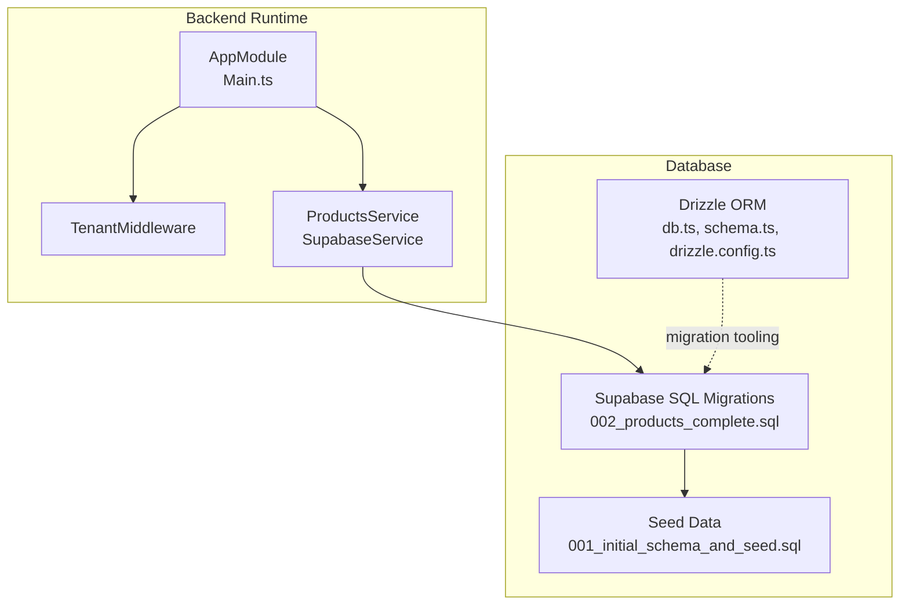
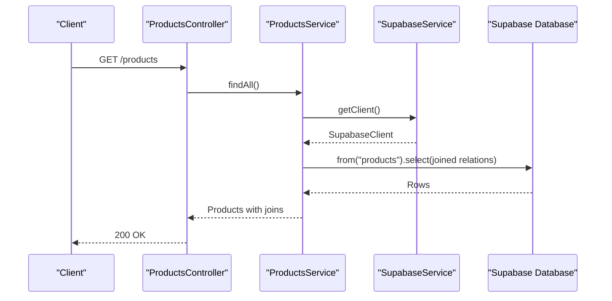
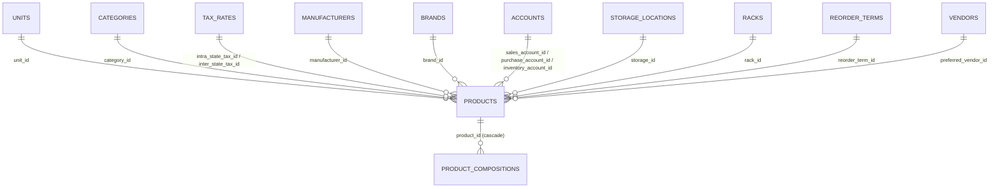
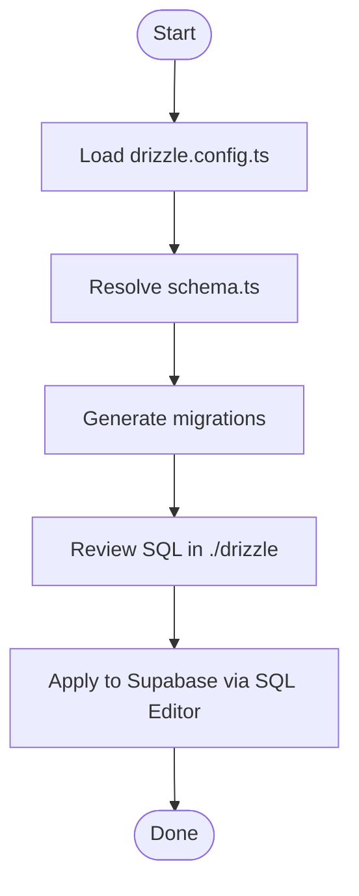
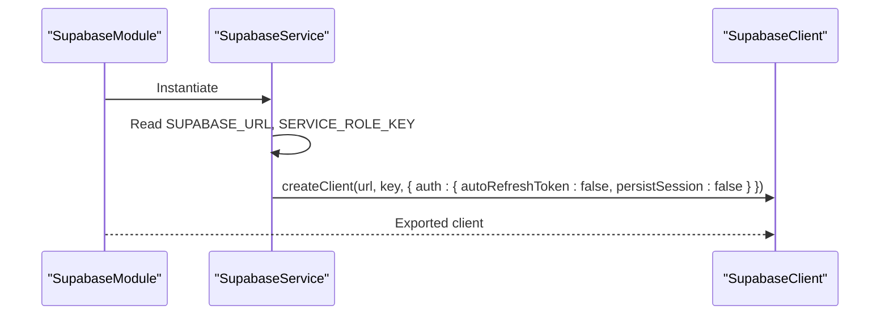
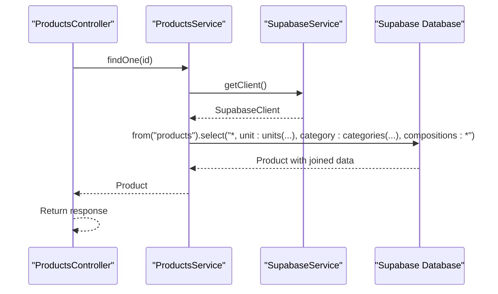
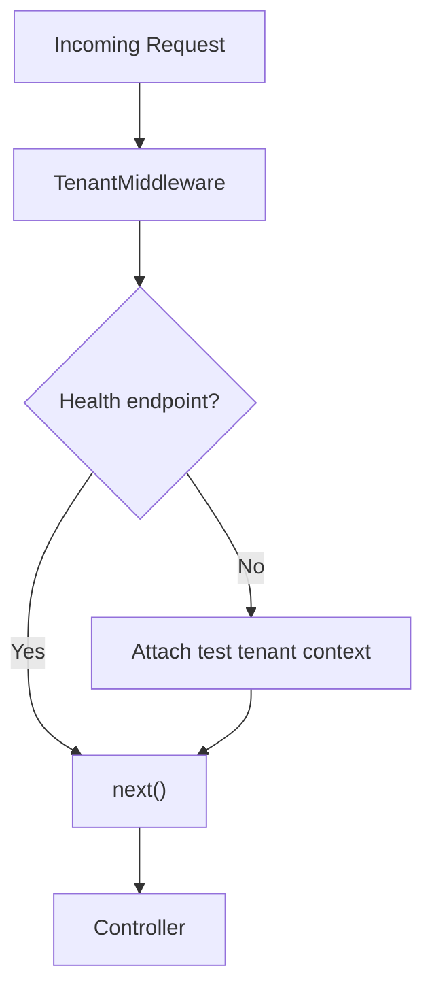
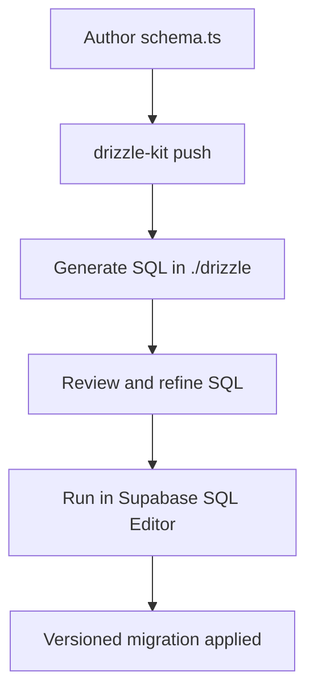
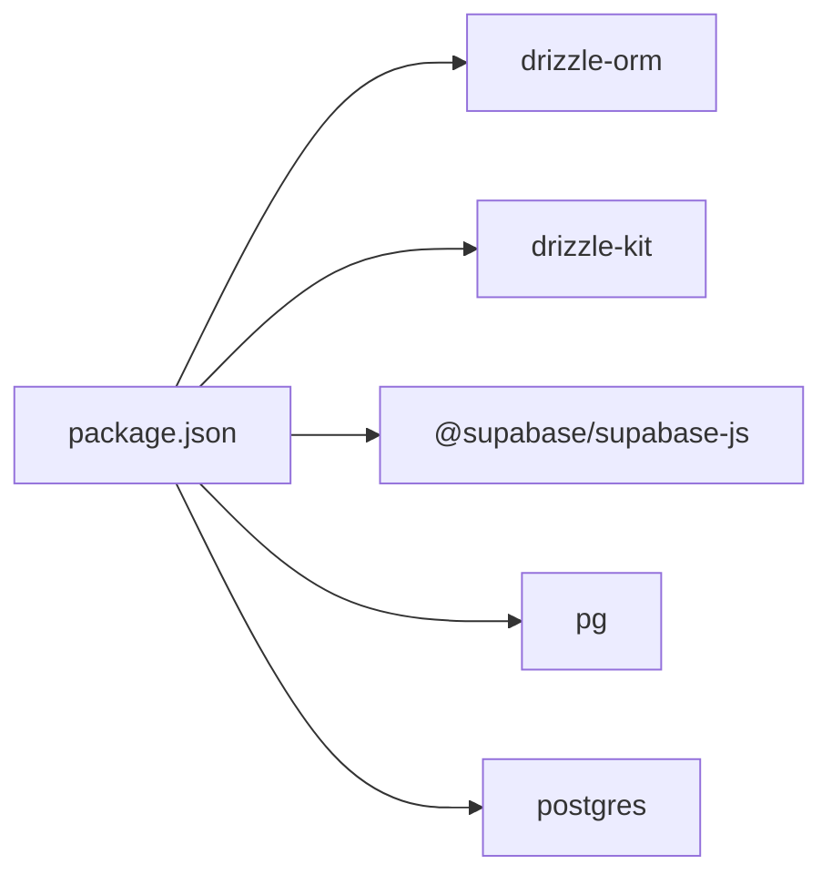

# Database Layer & ORM

<cite>
**Referenced Files in This Document**
- [schema.ts](file://backend/src/db/schema.ts)
- [db.ts](file://backend/src/db/db.ts)
- [drizzle.config.ts](file://backend/drizzle.config.ts)
- [001_initial_schema_and_seed.sql](file://supabase/migrations/001_initial_schema_and_seed.sql)
- [002_products_complete.sql](file://supabase/migrations/002_products_complete.sql)
- [supabase.service.ts](file://backend/src/supabase/supabase.service.ts)
- [supabase.module.ts](file://backend/src/supabase/supabase.module.ts)
- [tenant.middleware.ts](file://backend/src/common/middleware/tenant.middleware.ts)
- [products.service.ts](file://backend/src/products/products.service.ts)
- [products.controller.ts](file://backend/src/products/products.controller.ts)
- [app.module.ts](file://backend/src/app.module.ts)
- [main.ts](file://backend/src/main.ts)
- [package.json](file://backend/package.json)
- [fix_rls.sql](file://backend/fix_rls.sql)
- [disable_rls_temp.sql](file://backend/disable_rls_temp.sql)
- [verify-rls.js](file://backend/verify-rls.js)
</cite>

## Table of Contents
1. [Introduction](#introduction)
2. [Project Structure](#project-structure)
3. [Core Components](#core-components)
4. [Architecture Overview](#architecture-overview)
5. [Detailed Component Analysis](#detailed-component-analysis)
6. [Dependency Analysis](#dependency-analysis)
7. [Performance Considerations](#performance-considerations)
8. [Troubleshooting Guide](#troubleshooting-guide)
9. [Conclusion](#conclusion)
10. [Appendices](#appendices)

## Introduction
This document explains the database layer and Drizzle ORM implementation in ZerpAI ERP. It covers the database schema design, entity relationships, and table definitions; Drizzle ORM configuration and migration management; Supabase integration including real-time capabilities and row-level security (RLS); practical examples of database operations, joins, and complex queries; connection management, transaction handling, and performance optimization strategies; and the migration system, seed data management, and database versioning approach.

## Project Structure
The database layer spans two complementary parts:
- Supabase-managed migrations define the authoritative schema and seed data.
- Drizzle ORM is configured for schema typing and migration tooling, while the backend primarily uses Supabase’s JavaScript client for runtime operations.

**Diagram sources**
- [app.module.ts](file://backend/src/app.module.ts#L9-L19)
- [main.ts](file://backend/src/main.ts#L10-L56)
- [tenant.middleware.ts](file://backend/src/common/middleware/tenant.middleware.ts#L23-L70)
- [products.service.ts](file://backend/src/products/products.service.ts#L1-L723)
- [supabase.service.ts](file://backend/src/supabase/supabase.service.ts#L1-L32)
- [schema.ts](file://backend/src/db/schema.ts#L1-L293)
- [db.ts](file://backend/src/db/db.ts#L1-L13)
- [drizzle.config.ts](file://backend/drizzle.config.ts#L1-L16)
- [002_products_complete.sql](file://supabase/migrations/002_products_complete.sql#L1-L381)
- [001_initial_schema_and_seed.sql](file://supabase/migrations/001_initial_schema_and_seed.sql#L1-L218)

**Section sources**
- [app.module.ts](file://backend/src/app.module.ts#L9-L19)
- [main.ts](file://backend/src/main.ts#L10-L56)
- [tenant.middleware.ts](file://backend/src/common/middleware/tenant.middleware.ts#L23-L70)
- [products.service.ts](file://backend/src/products/products.service.ts#L1-L723)
- [supabase.service.ts](file://backend/src/supabase/supabase.service.ts#L1-L32)
- [schema.ts](file://backend/src/db/schema.ts#L1-L293)
- [db.ts](file://backend/src/db/db.ts#L1-L13)
- [drizzle.config.ts](file://backend/drizzle.config.ts#L1-L16)
- [002_products_complete.sql](file://supabase/migrations/002_products_complete.sql#L1-L381)
- [001_initial_schema_and_seed.sql](file://supabase/migrations/001_initial_schema_and_seed.sql#L1-L218)

## Core Components
- Drizzle ORM schema and configuration
  - Strongly-typed tables and enums are defined in the Drizzle schema file.
  - Drizzle Kit config points to the schema and database connection string for migrations.
- Supabase migrations and seed data
  - Migrations define the authoritative schema and indexes.
  - Seed data initializes master data and sample products.
- Supabase client integration
  - A dedicated service creates and exposes a Supabase client for runtime operations.
- Middleware and tenant scoping
  - A global middleware attaches a tenant context to requests for multi-tenancy.

**Section sources**
- [schema.ts](file://backend/src/db/schema.ts#L1-L293)
- [drizzle.config.ts](file://backend/drizzle.config.ts#L1-L16)
- [db.ts](file://backend/src/db/db.ts#L1-L13)
- [002_products_complete.sql](file://supabase/migrations/002_products_complete.sql#L1-L381)
- [001_initial_schema_and_seed.sql](file://supabase/migrations/001_initial_schema_and_seed.sql#L1-L218)
- [supabase.service.ts](file://backend/src/supabase/supabase.service.ts#L1-L32)
- [tenant.middleware.ts](file://backend/src/common/middleware/tenant.middleware.ts#L23-L70)

## Architecture Overview
ZerpAI ERP uses Supabase as the primary database and runtime engine. Drizzle ORM is leveraged for:
- Type-safe schema definitions consumed by the migration tooling.
- Local development and schema authoring consistency.

Runtime operations (CRUD, lookups, metadata sync) are executed via the Supabase JavaScript client. Multi-tenancy is enforced at the application level through middleware that injects tenant context into requests.

**Diagram sources**
- [products.controller.ts](file://backend/src/products/products.controller.ts#L217-L220)
- [products.service.ts](file://backend/src/products/products.service.ts#L91-L118)
- [supabase.service.ts](file://backend/src/supabase/supabase.service.ts#L28-L30)

**Section sources**
- [products.controller.ts](file://backend/src/products/products.controller.ts#L1-L250)
- [products.service.ts](file://backend/src/products/products.service.ts#L1-L723)
- [supabase.service.ts](file://backend/src/supabase/supabase.service.ts#L1-L32)
- [app.module.ts](file://backend/src/app.module.ts#L9-L19)
- [main.ts](file://backend/src/main.ts#L10-L56)

## Detailed Component Analysis

### Database Schema Design and Entity Relationships
The schema defines core entities for products, categories, units, taxes, manufacturers, brands, accounts, storage locations, racks, reorder terms, vendors, and related product compositions. Enumerations standardize domain-specific values.

**Diagram sources**
- [schema.ts](file://backend/src/db/schema.ts#L13-L293)

Key characteristics:
- UUID primary keys with defaultRandom() for auto-generation.
- Strong foreign key constraints linking related entities.
- Enumerations for product type, tax preference, valuation method, unit type, tax type, account type, and vendor type.
- JSONB-like text fields for structured data (e.g., image URLs).
- Timestamps for audit fields and soft-deletion flags.

**Section sources**
- [schema.ts](file://backend/src/db/schema.ts#L1-L293)

### Drizzle ORM Configuration and Migration Management
- Drizzle schema file defines typed tables and enums.
- Drizzle Kit configuration points to the schema path, output directory, driver, and database connection string.
- Drizzle ORM runtime client is configured with a PostgreSQL connection string and disabled prepared statements for transaction compatibility.

**Diagram sources**
- [drizzle.config.ts](file://backend/drizzle.config.ts#L6-L15)
- [schema.ts](file://backend/src/db/schema.ts#L1-L293)
- [db.ts](file://backend/src/db/db.ts#L10-L12)

Operational notes:
- The backend’s runtime primarily uses the Supabase client for queries; Drizzle is mainly used for schema typing and migration generation.
- The Drizzle ORM client is configured with a PostgreSQL connection string and prepared statements disabled to avoid incompatibilities with transaction pooling modes.

**Section sources**
- [drizzle.config.ts](file://backend/drizzle.config.ts#L1-L16)
- [schema.ts](file://backend/src/db/schema.ts#L1-L293)
- [db.ts](file://backend/src/db/db.ts#L1-L13)

### Supabase Integration: Real-Time Capabilities and RLS
- Supabase client initialization is encapsulated in a dedicated service with environment-driven configuration.
- Real-time subscriptions are not implemented in the current backend code; the service exposes a client instance for potential future use.
- RLS policies are disabled in development migrations and scripts to simplify testing. Production deployments should re-enable RLS and define appropriate policies.

**Diagram sources**
- [supabase.module.ts](file://backend/src/supabase/supabase.module.ts#L1-L12)
- [supabase.service.ts](file://backend/src/supabase/supabase.service.ts#L10-L26)

RLS verification and remediation:
- Utility script connects to the database and lists RLS statuses per table.
- SQL scripts can quickly disable RLS for specific tables during testing.

**Section sources**
- [supabase.service.ts](file://backend/src/supabase/supabase.service.ts#L1-L32)
- [supabase.module.ts](file://backend/src/supabase/supabase.module.ts#L1-L12)
- [verify-rls.js](file://backend/verify-rls.js#L1-L44)
- [fix_rls.sql](file://backend/fix_rls.sql#L1-L16)
- [disable_rls_temp.sql](file://backend/disable_rls_temp.sql#L1-L14)

### Database Operations, Joins, and Complex Queries
The backend performs rich joins and aggregations through Supabase’s query builder. Example patterns include:
- Fetching products with related entities (units, categories, manufacturers, brands, vendors, storage locations, racks, tax rates) and nested compositions.
- Upserting lookup metadata with conflict resolution on unique keys.
- Checking usage of lookup entities before deactivation.

**Diagram sources**
- [products.controller.ts](file://backend/src/products/products.controller.ts#L222-L225)
- [products.service.ts](file://backend/src/products/products.service.ts#L120-L146)

Additional patterns:
- Metadata synchronization with upsert and conflict handling on unique identifiers.
- Usage checks across multiple referencing tables to prevent orphaning.

**Section sources**
- [products.service.ts](file://backend/src/products/products.service.ts#L91-L118)
- [products.service.ts](file://backend/src/products/products.service.ts#L120-L146)
- [products.service.ts](file://backend/src/products/products.service.ts#L609-L716)
- [products.service.ts](file://backend/src/products/products.service.ts#L290-L389)

### Multi-Tenancy and Tenant Context
A global middleware attaches a tenant context to each request for development and testing. In production, this middleware should enforce authentication and derive tenant identifiers from tokens or headers.

**Diagram sources**
- [tenant.middleware.ts](file://backend/src/common/middleware/tenant.middleware.ts#L24-L40)

Note: The current implementation bypasses authentication for development. Production code is commented out and marked as “TODO” for enabling JWT verification and extracting org/outlet context from headers.

**Section sources**
- [tenant.middleware.ts](file://backend/src/common/middleware/tenant.middleware.ts#L23-L70)
- [app.module.ts](file://backend/src/app.module.ts#L15-L18)

### Migration System, Seed Data, and Versioning
- Migrations are authored as SQL scripts under the Supabase migrations folder.
- The initial migration sets up tables, indexes, and seed data.
- A subsequent migration refactors the schema to align with UI and feedback, adding comprehensive lookup tables and indexes.
- Drizzle Kit configuration enables generating migrations from the TypeScript schema definitions.

**Diagram sources**
- [drizzle.config.ts](file://backend/drizzle.config.ts#L6-L15)
- [schema.ts](file://backend/src/db/schema.ts#L1-L293)
- [002_products_complete.sql](file://supabase/migrations/002_products_complete.sql#L1-L381)

Seed data:
- Initial migration seeds categories, vendors, and products.
- Subsequent migration seeds units, categories, tax rates, accounts, storage locations, racks, reorder terms, manufacturers, and brands.

**Section sources**
- [001_initial_schema_and_seed.sql](file://supabase/migrations/001_initial_schema_and_seed.sql#L144-L218)
- [002_products_complete.sql](file://supabase/migrations/002_products_complete.sql#L280-L381)
- [drizzle.config.ts](file://backend/drizzle.config.ts#L1-L16)

## Dependency Analysis
External dependencies relevant to the database layer:
- Drizzle ORM and Drizzle Kit for schema typing and migrations.
- Supabase JS client for runtime database operations.
- Postgres and postgres driver for raw connections (used by Drizzle ORM).

**Diagram sources**
- [package.json](file://backend/package.json#L22-L36)

**Section sources**
- [package.json](file://backend/package.json#L22-L36)

## Performance Considerations
- Indexes are defined in migrations for frequently filtered columns (e.g., product type, item code, category, unit, vendor, active flags).
- Joins in queries select only required columns to minimize payload size.
- Soft deletion is used (e.g., is_active flags) to preserve referential integrity and enable audits.
- Prepared statements are disabled in the Drizzle ORM client to avoid transaction pool incompatibilities.

Recommendations:
- Add selective indexes for tenant-scoped filters if multi-tenancy is enforced at the database level.
- Consider partitioning or materialized views for complex reporting queries.
- Monitor slow queries and add targeted indexes based on query patterns.

**Section sources**
- [002_products_complete.sql](file://supabase/migrations/002_products_complete.sql#L244-L272)
- [products.service.ts](file://backend/src/products/products.service.ts#L96-L110)
- [db.ts](file://backend/src/db/db.ts#L10-L12)

## Troubleshooting Guide
Common issues and remedies:
- RLS permission errors
  - Symptoms: Access denied when querying tables.
  - Remedy: Use provided SQL scripts to disable RLS temporarily for testing, or re-enable and define proper policies.
- Validation failures
  - Symptoms: 400 Bad Request with field-level constraints.
  - Remedy: Inspect the global validation pipe logs for detailed constraint messages.
- Duplicate key errors
  - Symptoms: Conflict exceptions on inserts (e.g., item code uniqueness).
  - Remedy: Ensure unique constraints are respected before insert/upsert operations.

Verification utilities:
- Use the RLS verification script to inspect RLS status across tables and confirm direct access.

**Section sources**
- [fix_rls.sql](file://backend/fix_rls.sql#L1-L16)
- [disable_rls_temp.sql](file://backend/disable_rls_temp.sql#L1-L14)
- [verify-rls.js](file://backend/verify-rls.js#L1-L44)
- [products.service.ts](file://backend/src/products/products.service.ts#L47-L51)
- [main.ts](file://backend/src/main.ts#L26-L42)

## Conclusion
ZerpAI ERP’s database layer combines Supabase as the primary runtime and schema authority with Drizzle ORM for type-safe schema definitions and migration tooling. The schema emphasizes strong relationships, enumerations, and audit fields. Supabase’s client is used for CRUD and joins, while RLS is currently disabled for development and should be re-enabled in production. The migration system supports iterative schema evolution with seed data. Performance relies on strategic indexing and careful join usage, with room for further optimization based on workload patterns.

## Appendices

### Appendix A: Environment Variables
- DATABASE_URL: Drizzle ORM connection string.
- SUPABASE_URL: Supabase project URL.
- SUPABASE_SERVICE_ROLE_KEY: Supabase service role key for server-side operations.
- CORS_ORIGINS: Comma-separated origins for CORS configuration.
- PORT: Backend server port.

**Section sources**
- [db.ts](file://backend/src/db/db.ts#L8-L8)
- [supabase.service.ts](file://backend/src/supabase/supabase.service.ts#L11-L12)
- [main.ts](file://backend/src/main.ts#L14-L24)