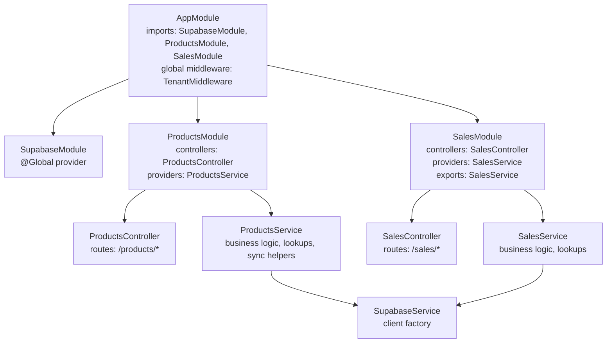
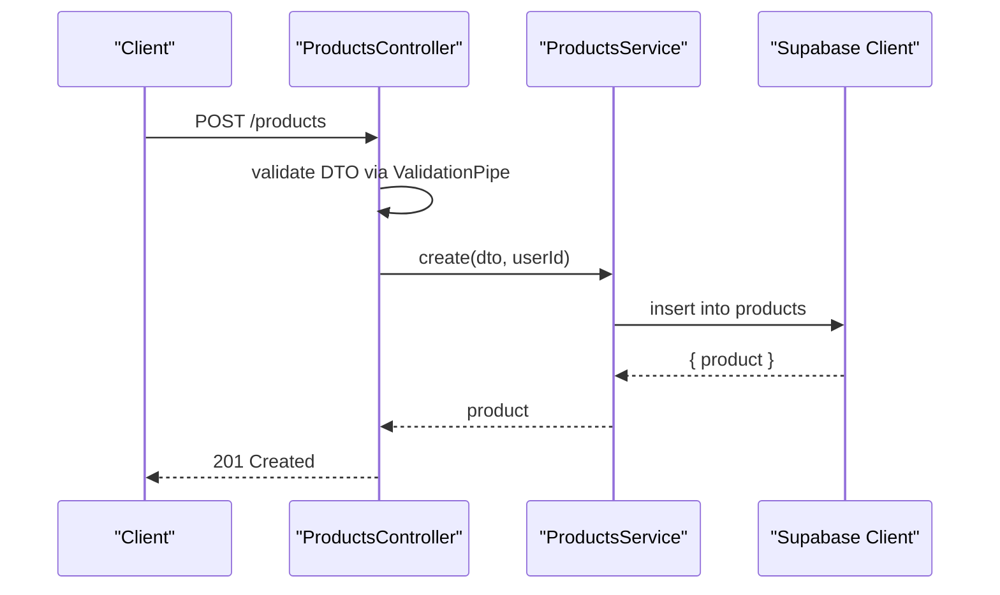
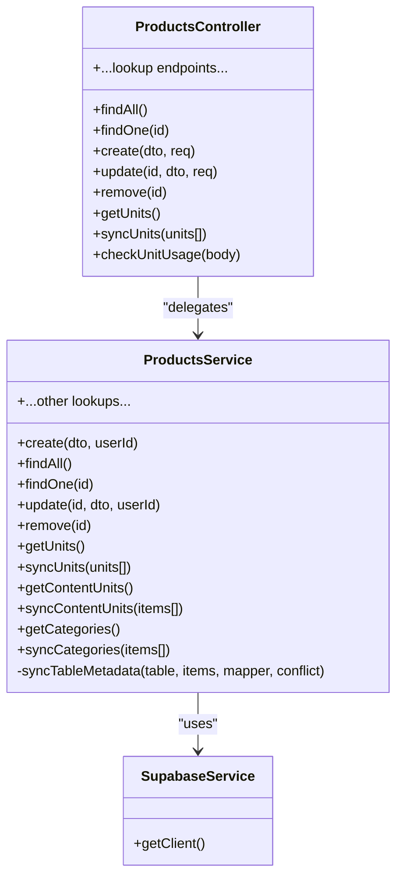
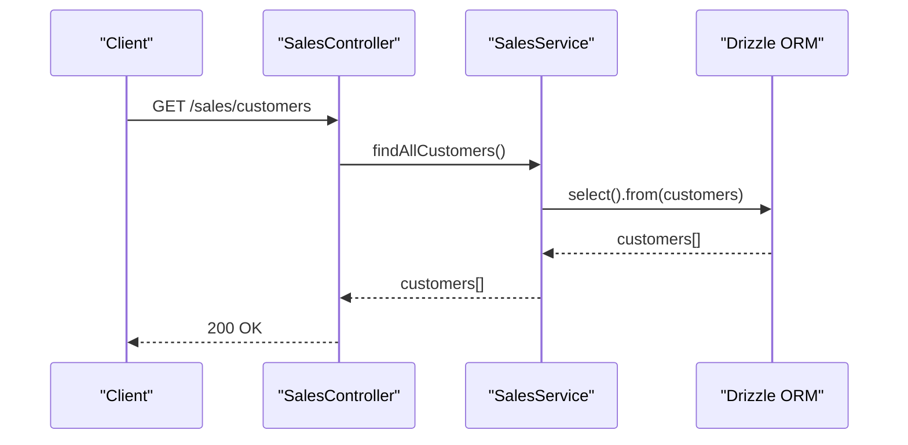
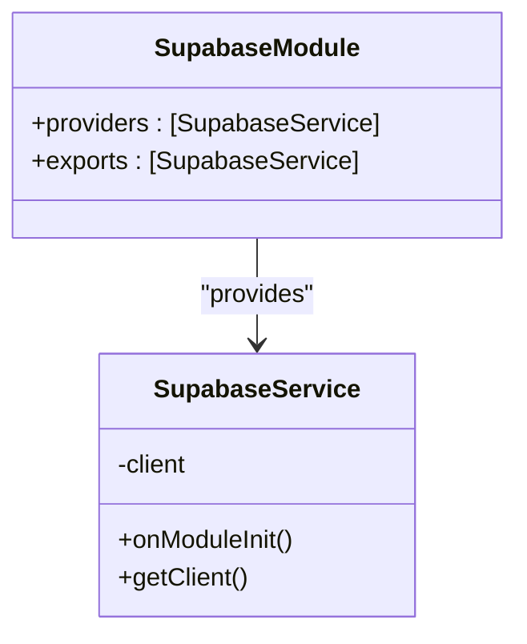
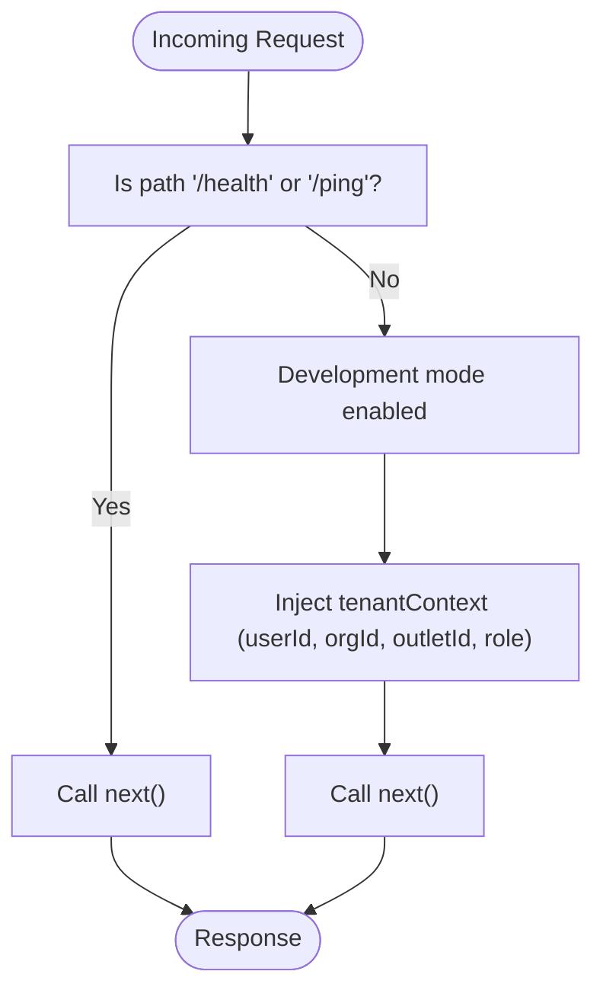
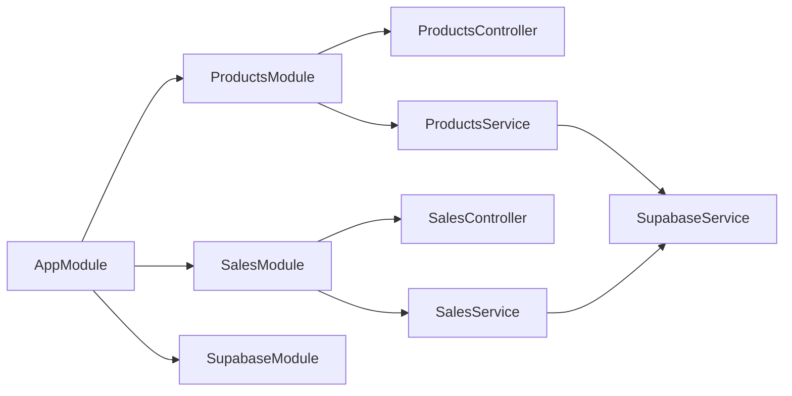

# Module Development Patterns

<cite>
**Referenced Files in This Document**
- [app.module.ts](file://backend/src/app.module.ts)
- [tenant.middleware.ts](file://backend/src/common/middleware/tenant.middleware.ts)
- [supabase.module.ts](file://backend/src/supabase/supabase.module.ts)
- [supabase.service.ts](file://backend/src/supabase/supabase.service.ts)
- [products.module.ts](file://backend/src/products/products.module.ts)
- [products.controller.ts](file://backend/src/products/products.controller.ts)
- [products.service.ts](file://backend/src/products/products.service.ts)
- [create-product.dto.ts](file://backend/src/products/dto/create-product.dto.ts)
- [update-product.dto.ts](file://backend/src/products/dto/update-product.dto.ts)
- [sales.module.ts](file://backend/src/sales/sales.module.ts)
- [sales.controller.ts](file://backend/src/sales/sales.controller.ts)
- [sales.service.ts](file://backend/src/sales/sales.service.ts)
- [schema.ts](file://backend/src/db/schema.ts)
- [package.json](file://backend/package.json)
- [nest-cli.json](file://backend/nest-cli.json)
</cite>

## Table of Contents
1. [Introduction](#introduction)
2. [Project Structure](#project-structure)
3. [Core Components](#core-components)
4. [Architecture Overview](#architecture-overview)
5. [Detailed Component Analysis](#detailed-component-analysis)
6. [Dependency Analysis](#dependency-analysis)
7. [Performance Considerations](#performance-considerations)
8. [Troubleshooting Guide](#troubleshooting-guide)
9. [Conclusion](#conclusion)
10. [Appendices](#appendices)

## Introduction
This document explains how to develop new modules in the ZerpAI ERP backend using NestJS. It covers the standard module structure, naming conventions, file organization, repository pattern usage, service-layer architecture, dependency injection, and CRUD plus advanced business logic. It also documents inter-module communication, testing strategies, error handling patterns, performance optimization techniques, and step-by-step guides to add new features while maintaining code quality.

## Project Structure
The backend follows a feature-based module organization under backend/src. Each module encapsulates:
- A controller for HTTP endpoints
- A service for business logic and persistence orchestration
- A DTO folder for request/response validation
- Optional database schema definitions and repository abstractions

High-level structure:
- Root module composes feature modules and applies middleware globally
- Feature modules declare controllers and providers
- Shared services (e.g., Supabase) are provided globally for cross-module access
- Middleware enforces tenant context on all routes

**Diagram sources**
- [app.module.ts](file://backend/src/app.module.ts#L9-L19)
- [supabase.module.ts](file://backend/src/supabase/supabase.module.ts#L6-L11)
- [products.module.ts](file://backend/src/products/products.module.ts#L7-L11)
- [sales.module.ts](file://backend/src/sales/sales.module.ts#L5-L10)
- [products.controller.ts](file://backend/src/products/products.controller.ts#L19-L249)
- [sales.controller.ts](file://backend/src/sales/sales.controller.ts#L14-L101)
- [products.service.ts](file://backend/src/products/products.service.ts#L7-L9)
- [sales.service.ts](file://backend/src/sales/sales.service.ts#L6-L7)
- [supabase.service.ts](file://backend/src/supabase/supabase.service.ts#L6-L31)

**Section sources**
- [app.module.ts](file://backend/src/app.module.ts#L1-L20)
- [products.module.ts](file://backend/src/products/products.module.ts#L1-L12)
- [sales.module.ts](file://backend/src/sales/sales.module.ts#L1-L11)
- [supabase.module.ts](file://backend/src/supabase/supabase.module.ts#L1-L12)

## Core Components
- AppModule: Composes feature modules and applies TenantMiddleware to all routes.
- TenantMiddleware: Injects tenant context into requests (placeholder implementation for dev).
- SupabaseModule and SupabaseService: Provide a globally available Supabase client.
- ProductsModule/Controller/Service: Example of a full CRUD module with DTOs and lookup/sync endpoints.
- SalesModule/Controller/Service: Example of a simpler module using Drizzle ORM for queries.

Key patterns:
- Controllers are thin; they delegate to Services.
- Services encapsulate business logic and data access.
- DTOs validate and normalize inputs.
- Modules export providers when needed by other modules.

**Section sources**
- [app.module.ts](file://backend/src/app.module.ts#L9-L19)
- [tenant.middleware.ts](file://backend/src/common/middleware/tenant.middleware.ts#L22-L69)
- [supabase.module.ts](file://backend/src/supabase/supabase.module.ts#L6-L11)
- [supabase.service.ts](file://backend/src/supabase/supabase.service.ts#L6-L31)
- [products.controller.ts](file://backend/src/products/products.controller.ts#L19-L249)
- [products.service.ts](file://backend/src/products/products.service.ts#L7-L9)
- [sales.controller.ts](file://backend/src/sales/sales.controller.ts#L14-L101)
- [sales.service.ts](file://backend/src/sales/sales.service.ts#L6-L7)

## Architecture Overview
The system uses a layered architecture:
- HTTP Layer: Controllers
- Application Layer: Services
- Persistence Layer: Supabase client or Drizzle ORM
- Cross-cutting: Middleware, DTOs, enums, and shared modules

**Diagram sources**
- [products.controller.ts](file://backend/src/products/products.controller.ts#L227-L233)
- [products.service.ts](file://backend/src/products/products.service.ts#L18-L89)
- [supabase.service.ts](file://backend/src/supabase/supabase.service.ts#L28-L30)

## Detailed Component Analysis

### Products Module: CRUD, DTOs, Lookups, and Sync
- Entities: Products and related lookup tables are defined in the schema.
- DTOs: Strong typing and validation for create/update operations.
- Controller: Exposes CRUD endpoints and extensive lookup/sync endpoints.
- Service: Implements business logic, joins, and metadata synchronization helpers.

**Diagram sources**
- [products.controller.ts](file://backend/src/products/products.controller.ts#L19-L249)
- [products.service.ts](file://backend/src/products/products.service.ts#L7-L9)
- [supabase.service.ts](file://backend/src/supabase/supabase.service.ts#L28-L30)

**Section sources**
- [products.controller.ts](file://backend/src/products/products.controller.ts#L19-L249)
- [products.service.ts](file://backend/src/products/products.service.ts#L18-L194)
- [create-product.dto.ts](file://backend/src/products/dto/create-product.dto.ts#L21-L245)
- [update-product.dto.ts](file://backend/src/products/dto/update-product.dto.ts#L6-L6)
- [schema.ts](file://backend/src/db/schema.ts#L116-L195)

### Sales Module: Simpler ORM-Based Service
- Uses Drizzle ORM for typed queries against the schema.
- Provides customer, order, payment, e-way bill, and payment link operations.
- Exports the SalesService for potential reuse by other modules.

**Diagram sources**
- [sales.controller.ts](file://backend/src/sales/sales.controller.ts#L18-L33)
- [sales.service.ts](file://backend/src/sales/sales.service.ts#L30-L32)
- [schema.ts](file://backend/src/db/schema.ts#L213-L234)

**Section sources**
- [sales.controller.ts](file://backend/src/sales/sales.controller.ts#L14-L101)
- [sales.service.ts](file://backend/src/sales/sales.service.ts#L30-L61)
- [schema.ts](file://backend/src/db/schema.ts#L213-L291)

### Supabase Integration: Global Provider Pattern
- SupabaseService is provided globally and exposes a single client instance.
- Controllers and Services depend on SupabaseService via constructor injection.
- Environment variables are validated during initialization.

**Diagram sources**
- [supabase.module.ts](file://backend/src/supabase/supabase.module.ts#L6-L11)
- [supabase.service.ts](file://backend/src/supabase/supabase.service.ts#L6-L31)

**Section sources**
- [supabase.module.ts](file://backend/src/supabase/supabase.module.ts#L1-L12)
- [supabase.service.ts](file://backend/src/supabase/supabase.service.ts#L10-L26)

### Middleware: Tenant Context
- TenantMiddleware attaches a tenant context to each request.
- In development mode, it injects placeholder values; production logic is commented as a guide.

**Diagram sources**
- [tenant.middleware.ts](file://backend/src/common/middleware/tenant.middleware.ts#L24-L39)

**Section sources**
- [tenant.middleware.ts](file://backend/src/common/middleware/tenant.middleware.ts#L22-L69)

## Dependency Analysis
- AppModule composes feature modules and registers global middleware.
- ProductsModule depends on ProductsController and ProductsService.
- SalesModule depends on SalesController and SalesService and exports SalesService.
- Both Services depend on SupabaseService (via DI).
- DTOs are consumed by Controllers and validated by ValidationPipe.

**Diagram sources**
- [app.module.ts](file://backend/src/app.module.ts#L9-L19)
- [products.module.ts](file://backend/src/products/products.module.ts#L7-L11)
- [sales.module.ts](file://backend/src/sales/sales.module.ts#L5-L10)
- [supabase.module.ts](file://backend/src/supabase/supabase.module.ts#L6-L11)

**Section sources**
- [app.module.ts](file://backend/src/app.module.ts#L9-L19)
- [products.module.ts](file://backend/src/products/products.module.ts#L1-L12)
- [sales.module.ts](file://backend/src/sales/sales.module.ts#L1-L11)
- [supabase.module.ts](file://backend/src/supabase/supabase.module.ts#L1-L12)

## Performance Considerations
- Prefer selective field selection and joins only when needed to reduce payload sizes.
- Use server-side filtering and pagination for large datasets.
- Minimize round-trips by batching operations where appropriate.
- Leverage DTO transformations to avoid unnecessary object cloning.
- Keep DTOs minimal and aligned with endpoint needs.
- Use ValidationPipe with transform enabled judiciously to avoid heavy processing overhead.

[No sources needed since this section provides general guidance]

## Troubleshooting Guide
Common issues and resolutions:
- Missing environment variables for Supabase: Initialization throws an error if required variables are absent.
- Validation failures: DTO validation errors surface as HTTP errors; review ValidationPipe configuration and DTO decorators.
- Not found exceptions: Services throw NotFoundException when records are missing; ensure IDs are correct and resources exist.
- Conflict exceptions: Duplicates on unique fields raise ConflictException; handle gracefully in controllers.
- Tenant context: In development, middleware injects placeholder context; ensure production auth logic is enabled before deployment.

**Section sources**
- [supabase.service.ts](file://backend/src/supabase/supabase.service.ts#L14-L16)
- [products.service.ts](file://backend/src/products/products.service.ts#L45-L50)
- [products.controller.ts](file://backend/src/products/products.controller.ts#L38-L44)
- [tenant.middleware.ts](file://backend/src/common/middleware/tenant.middleware.ts#L24-L39)

## Conclusion
ZerpAI ERP’s backend uses a clean, modular architecture with clear separation of concerns. By following the established patterns—feature-based modules, DTO-driven validation, service-layer orchestration, and global providers—you can implement robust modules quickly and consistently. Use the provided guides to add entities, DTOs, controllers, services, and tests, and adhere to the error handling and performance recommendations to maintain quality.

[No sources needed since this section summarizes without analyzing specific files]

## Appendices

### Step-by-Step: Add a New Module
1. Create the module folder under backend/src/<your_module>.
2. Scaffold files:
   - <your_module>.controller.ts
   - <your_module>.service.ts
   - dto/<your_entity>.dto.ts (and update-product.dto.ts if applicable)
3. Define entity schema in backend/src/db/schema.ts if it does not exist.
4. Register the module:
   - Add imports in backend/src/app.module.ts
   - Register TenantMiddleware if needed
5. Implement CRUD in the controller and delegate to the service.
6. Implement business logic in the service; inject SupabaseService or Drizzle ORM as needed.
7. Export providers from the module if other modules need them.
8. Add DTOs with class-validator decorators and use ValidationPipe in controllers.
9. Write tests using NestJS TestingModule and Jest.
10. Run linting and tests locally before committing.

**Section sources**
- [app.module.ts](file://backend/src/app.module.ts#L9-L19)
- [products.controller.ts](file://backend/src/products/products.controller.ts#L19-L249)
- [products.service.ts](file://backend/src/products/products.service.ts#L7-L9)
- [create-product.dto.ts](file://backend/src/products/dto/create-product.dto.ts#L21-L245)
- [package.json](file://backend/package.json#L8-L21)
- [nest-cli.json](file://backend/nest-cli.json#L1-L12)

### Inter-Module Communication
- Import and use exported providers from another module (e.g., SalesService exported by SalesModule).
- Inject the provider in the consuming module’s service via constructor injection.
- Keep coupling low by relying on interfaces or abstractions where possible.

**Section sources**
- [sales.module.ts](file://backend/src/sales/sales.module.ts#L8-L8)
- [sales.service.ts](file://backend/src/sales/sales.service.ts#L6-L7)

### Testing Strategies
- Use NestJS TestingModule to create isolated tests for controllers and services.
- Mock external dependencies (e.g., SupabaseService) to focus on business logic.
- Test DTO validation by sending malformed payloads and asserting error responses.
- For database-related logic, mock repository/service layers or use a test database.

**Section sources**
- [package.json](file://backend/package.json#L16-L20)