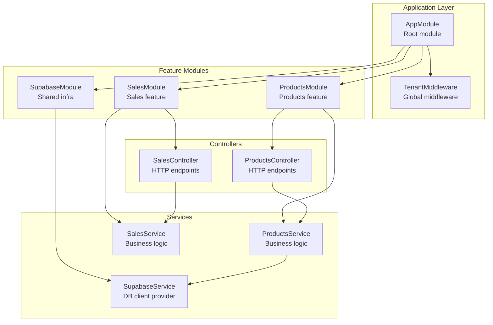
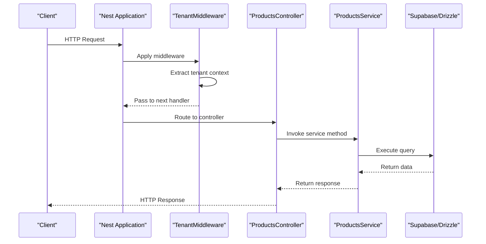
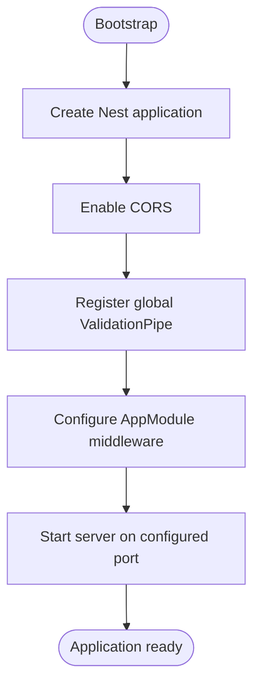
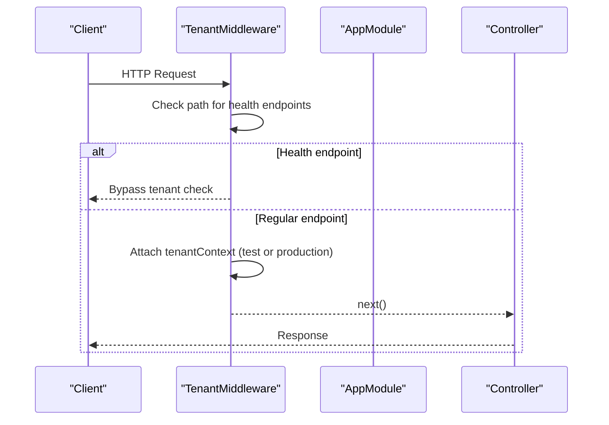
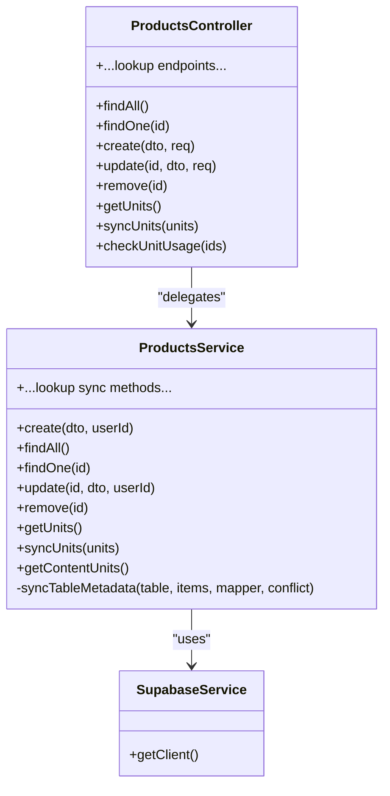
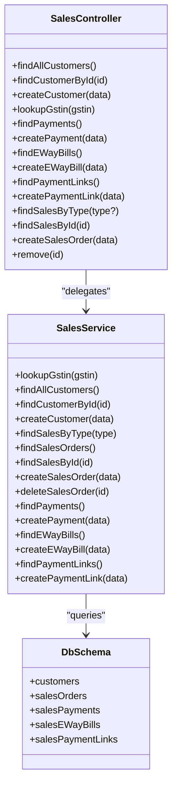
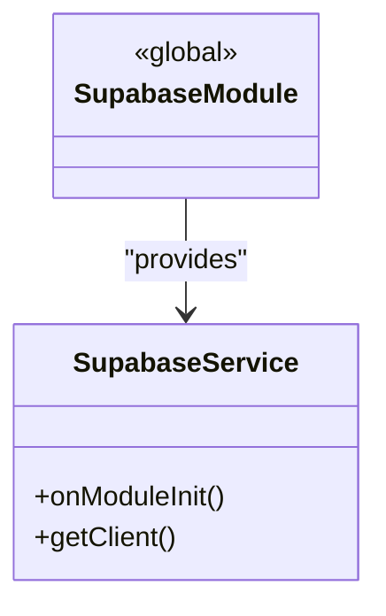
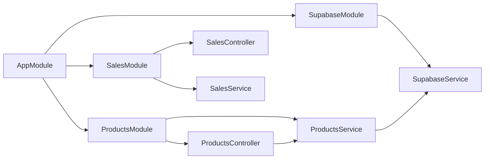
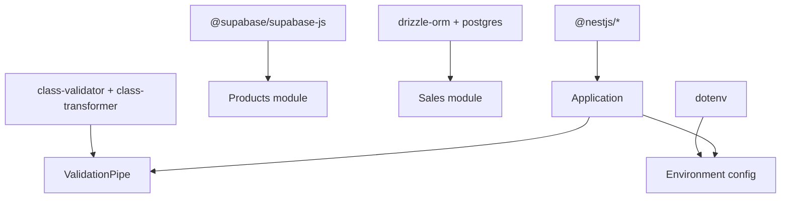

# NestJS Application Structure

<cite>
**Referenced Files in This Document**
- [app.module.ts](file://backend/src/app.module.ts)
- [main.ts](file://backend/src/main.ts)
- [tenant.middleware.ts](file://backend/src/common/middleware/tenant.middleware.ts)
- [products.module.ts](file://backend/src/products/products.module.ts)
- [sales.module.ts](file://backend/src/sales/sales.module.ts)
- [supabase.module.ts](file://backend/src/supabase/supabase.module.ts)
- [products.controller.ts](file://backend/src/products/products.controller.ts)
- [sales.controller.ts](file://backend/src/sales/sales.controller.ts)
- [products.service.ts](file://backend/src/products/products.service.ts)
- [sales.service.ts](file://backend/src/sales/sales.service.ts)
- [supabase.service.ts](file://backend/src/supabase/supabase.service.ts)
- [create-product.dto.ts](file://backend/src/products/dto/create-product.dto.ts)
- [update-product.dto.ts](file://backend/src/products/dto/update-product.dto.ts)
- [schema.ts](file://backend/src/db/schema.ts)
- [db.ts](file://backend/src/db/db.ts)
- [package.json](file://backend/package.json)
</cite>

## Table of Contents
1. [Introduction](#introduction)
2. [Project Structure](#project-structure)
3. [Core Components](#core-components)
4. [Architecture Overview](#architecture-overview)
5. [Detailed Component Analysis](#detailed-component-analysis)
6. [Dependency Analysis](#dependency-analysis)
7. [Performance Considerations](#performance-considerations)
8. [Troubleshooting Guide](#troubleshooting-guide)
9. [Conclusion](#conclusion)

## Introduction
This document explains the NestJS application structure in ZerpAI ERP, focusing on the module-based architecture, dependency injection patterns, and the roles of major modules (Products, Sales, Supabase). It also covers the main application module configuration, middleware registration, routing patterns, the NestJS lifecycle, inter-module communication, and the dependency injection container. Practical guidance is included for creating new modules, implementing NestJS decorators, and following established architectural patterns. The tenant middleware implementation and its integration into the application flow are explained in detail.

## Project Structure
The backend follows a clear module-based structure with feature-based organization:
- Root module (AppModule) orchestrates middleware and imports feature modules
- Feature modules (ProductsModule, SalesModule) encapsulate domain logic
- Shared infrastructure modules (SupabaseModule) provide cross-cutting concerns
- Controllers define HTTP endpoints and delegate to services
- Services encapsulate business logic and data access
- DTOs validate and transform request payloads
- Database integration via Drizzle ORM and Supabase clients

**Diagram sources**
- [app.module.ts](file://backend/src/app.module.ts#L1-L20)
- [tenant.middleware.ts](file://backend/src/common/middleware/tenant.middleware.ts#L1-L70)
- [products.module.ts](file://backend/src/products/products.module.ts#L1-L12)
- [sales.module.ts](file://backend/src/sales/sales.module.ts#L1-L11)
- [supabase.module.ts](file://backend/src/supabase/supabase.module.ts#L1-L12)
- [products.controller.ts](file://backend/src/products/products.controller.ts#L1-L250)
- [sales.controller.ts](file://backend/src/sales/sales.controller.ts#L1-L102)
- [products.service.ts](file://backend/src/products/products.service.ts#L1-L723)
- [sales.service.ts](file://backend/src/sales/sales.service.ts#L1-L162)
- [supabase.service.ts](file://backend/src/supabase/supabase.service.ts#L1-L32)

**Section sources**
- [app.module.ts](file://backend/src/app.module.ts#L1-L20)
- [main.ts](file://backend/src/main.ts#L1-L56)

## Core Components
- AppModule: Declares imports, registers global middleware, and defines the application boundary
- TenantMiddleware: Adds tenant context to requests and enforces tenant-awareness
- ProductsModule: Exposes product CRUD and lookup endpoints via ProductsController, backed by ProductsService
- SalesModule: Exposes sales-related endpoints via SalesController, backed by SalesService
- SupabaseModule: Provides a globally available Supabase client via SupabaseService
- DTOs: Validate and normalize request payloads for product creation and updates
- Database integration: Drizzle ORM schema and connection for PostgreSQL-backed Sales domain

**Section sources**
- [app.module.ts](file://backend/src/app.module.ts#L1-L20)
- [tenant.middleware.ts](file://backend/src/common/middleware/tenant.middleware.ts#L1-L70)
- [products.module.ts](file://backend/src/products/products.module.ts#L1-L12)
- [sales.module.ts](file://backend/src/sales/sales.module.ts#L1-L11)
- [supabase.module.ts](file://backend/src/supabase/supabase.module.ts#L1-L12)
- [create-product.dto.ts](file://backend/src/products/dto/create-product.dto.ts#L1-L265)
- [update-product.dto.ts](file://backend/src/products/dto/update-product.dto.ts#L1-L7)
- [schema.ts](file://backend/src/db/schema.ts#L1-L293)
- [db.ts](file://backend/src/db/db.ts#L1-L13)

## Architecture Overview
The application follows a layered architecture:
- HTTP layer: Controllers expose REST endpoints
- Domain layer: Services encapsulate business logic
- Data access layer: Supabase client (Products) and Drizzle ORM (Sales)
- Cross-cutting concerns: Middleware, validation pipes, and global configuration

**Diagram sources**
- [main.ts](file://backend/src/main.ts#L1-L56)
- [tenant.middleware.ts](file://backend/src/common/middleware/tenant.middleware.ts#L1-L70)
- [products.controller.ts](file://backend/src/products/products.controller.ts#L1-L250)
- [products.service.ts](file://backend/src/products/products.service.ts#L1-L723)
- [supabase.service.ts](file://backend/src/supabase/supabase.service.ts#L1-L32)
- [sales.controller.ts](file://backend/src/sales/sales.controller.ts#L1-L102)
- [sales.service.ts](file://backend/src/sales/sales.service.ts#L1-L162)
- [db.ts](file://backend/src/db/db.ts#L1-L13)

## Detailed Component Analysis

### AppModule and Lifecycle
- AppModule imports feature modules and registers global middleware
- NestJS lifecycle: Bootstrap initializes the application, enables CORS, installs global validation pipe, and starts the server
- Middleware execution order: Global middleware runs before controller handlers

**Diagram sources**
- [main.ts](file://backend/src/main.ts#L1-L56)
- [app.module.ts](file://backend/src/app.module.ts#L1-L20)

**Section sources**
- [main.ts](file://backend/src/main.ts#L1-L56)
- [app.module.ts](file://backend/src/app.module.ts#L1-L20)

### Tenant Middleware Implementation
- Purpose: Enforce tenant context per request and skip checks for health endpoints
- Design: Extends Express Request with tenantContext; attaches userId, role, entityId
- Security: Includes commented production-ready JWT verification and header extraction; current implementation uses test context
- Integration: Applied globally to all routes via AppModule

**Diagram sources**
- [tenant.middleware.ts](file://backend/src/common/middleware/tenant.middleware.ts#L1-L70)
- [app.module.ts](file://backend/src/app.module.ts#L14-L19)

**Section sources**
- [tenant.middleware.ts](file://backend/src/common/middleware/tenant.middleware.ts#L1-L70)
- [app.module.ts](file://backend/src/app.module.ts#L14-L19)

### Products Module
- Structure: ProductsModule declares ProductsController and ProductsService
- Controllers: Define endpoints for CRUD and lookup synchronization
- Services: Implement business logic, data normalization, and database operations
- DTOs: Validate and transform payloads for product creation and updates
- Data access: Uses SupabaseService client for product operations

**Diagram sources**
- [products.controller.ts](file://backend/src/products/products.controller.ts#L1-L250)
- [products.service.ts](file://backend/src/products/products.service.ts#L1-L723)
- [supabase.service.ts](file://backend/src/supabase/supabase.service.ts#L1-L32)

**Section sources**
- [products.module.ts](file://backend/src/products/products.module.ts#L1-L12)
- [products.controller.ts](file://backend/src/products/products.controller.ts#L1-L250)
- [products.service.ts](file://backend/src/products/products.service.ts#L1-L723)
- [create-product.dto.ts](file://backend/src/products/dto/create-product.dto.ts#L1-L265)
- [update-product.dto.ts](file://backend/src/products/dto/update-product.dto.ts#L1-L7)

### Sales Module
- Structure: SalesModule declares SalesController and SalesService
- Controllers: Define endpoints for customers, payments, e-way bills, payment links, and sales orders
- Services: Implement mock GSTIN lookup and CRUD operations using Drizzle ORM
- Data access: Uses Drizzle ORM with PostgreSQL connection

**Diagram sources**
- [sales.controller.ts](file://backend/src/sales/sales.controller.ts#L1-L102)
- [sales.service.ts](file://backend/src/sales/sales.service.ts#L1-L162)
- [schema.ts](file://backend/src/db/schema.ts#L213-L291)
- [db.ts](file://backend/src/db/db.ts#L1-L13)

**Section sources**
- [sales.module.ts](file://backend/src/sales/sales.module.ts#L1-L11)
- [sales.controller.ts](file://backend/src/sales/sales.controller.ts#L1-L102)
- [sales.service.ts](file://backend/src/sales/sales.service.ts#L1-L162)
- [schema.ts](file://backend/src/db/schema.ts#L1-L293)
- [db.ts](file://backend/src/db/db.ts#L1-L13)

### Supabase Module
- Structure: SupabaseModule is global and exports SupabaseService
- Service: Initializes Supabase client during module initialization and exposes getClient
- Environment: Requires SUPABASE_URL and SUPABASE_SERVICE_ROLE_KEY

**Diagram sources**
- [supabase.module.ts](file://backend/src/supabase/supabase.module.ts#L1-L12)
- [supabase.service.ts](file://backend/src/supabase/supabase.service.ts#L1-L32)

**Section sources**
- [supabase.module.ts](file://backend/src/supabase/supabase.module.ts#L1-L12)
- [supabase.service.ts](file://backend/src/supabase/supabase.service.ts#L1-L32)

### Routing Patterns and Decorators
- Controllers use @Controller with base paths (e.g., 'products', 'sales')
- Endpoints use standard HTTP decorators (@Get, @Post, @Put, @Delete) with optional parameters and query strings
- Validation decorators are applied via ValidationPipe at the global level and per-endpoint when needed
- DTOs enforce payload validation and transformation

Examples of decorator usage:
- Controller base path: [products.controller.ts](file://backend/src/products/products.controller.ts#L19-L20)
- GET endpoint with parameter: [products.controller.ts](file://backend/src/products/products.controller.ts#L222-L225)
- POST endpoint with body validation: [products.controller.ts](file://backend/src/products/products.controller.ts#L227-L233)
- DTO validation: [create-product.dto.ts](file://backend/src/products/dto/create-product.dto.ts#L21-L244)

**Section sources**
- [products.controller.ts](file://backend/src/products/products.controller.ts#L1-L250)
- [create-product.dto.ts](file://backend/src/products/dto/create-product.dto.ts#L1-L265)

### Dependency Injection Container
- NestJS DI container manages instances and resolves dependencies
- Providers are declared in modules and injected via constructors
- Example: ProductsController receives ProductsService; ProductsService receives SupabaseService
- Global providers: ValidationPipe registered at bootstrap; SupabaseService provided by SupabaseModule

**Diagram sources**
- [app.module.ts](file://backend/src/app.module.ts#L1-L20)
- [products.module.ts](file://backend/src/products/products.module.ts#L1-L12)
- [sales.module.ts](file://backend/src/sales/sales.module.ts#L1-L11)
- [supabase.module.ts](file://backend/src/supabase/supabase.module.ts#L1-L12)
- [products.controller.ts](file://backend/src/products/products.controller.ts#L1-L250)
- [products.service.ts](file://backend/src/products/products.service.ts#L1-L723)
- [sales.controller.ts](file://backend/src/sales/sales.controller.ts#L1-L102)
- [sales.service.ts](file://backend/src/sales/sales.service.ts#L1-L162)
- [supabase.service.ts](file://backend/src/supabase/supabase.service.ts#L1-L32)

**Section sources**
- [app.module.ts](file://backend/src/app.module.ts#L1-L20)
- [products.controller.ts](file://backend/src/products/products.controller.ts#L20-L21)
- [products.service.ts](file://backend/src/products/products.service.ts#L8-L9)
- [main.ts](file://backend/src/main.ts#L26-L42)

## Dependency Analysis
External dependencies and their roles:
- @nestjs/common, @nestjs/core: Core NestJS framework
- @nestjs/platform-express: Express adapter
- @supabase/supabase-js: Supabase client for Products module
- drizzle-orm, postgres: PostgreSQL ORM and driver for Sales module
- class-validator, class-transformer: Validation and transformation
- dotenv: Environment variable loading

**Diagram sources**
- [package.json](file://backend/package.json#L22-L60)

**Section sources**
- [package.json](file://backend/package.json#L1-L79)

## Performance Considerations
- ValidationPipe configuration: Whitelist enforcement and transformation reduce unnecessary fields and improve performance
- Supabase client initialization: One-time initialization avoids repeated client creation overhead
- Drizzle ORM: Efficient query building and connection pooling minimize latency
- DTO usage: Structured validation prevents expensive error handling downstream

[No sources needed since this section provides general guidance]

## Troubleshooting Guide
Common issues and resolutions:
- Missing environment variables: SupabaseModule requires SUPABASE_URL and SUPABASE_SERVICE_ROLE_KEY; missing values cause initialization failure
- Validation errors: Global ValidationPipe logs detailed error messages; review field constraints and values
- Tenant context: Ensure X-Entity-Id header is present for protected endpoints; otherwise, UnauthorizedException is thrown
- Database connectivity: Confirm DATABASE_URL and connection parameters for Drizzle ORM

**Section sources**
- [supabase.service.ts](file://backend/src/supabase/supabase.service.ts#L10-L26)
- [main.ts](file://backend/src/main.ts#L26-L42)
- [tenant.middleware.ts](file://backend/src/common/middleware/tenant.middleware.ts#L41-L67)
- [db.ts](file://backend/src/db/db.ts#L7-L12)

## Conclusion
ZerpAI ERP demonstrates a clean, modular NestJS architecture with explicit separation of concerns. The Products and Sales modules encapsulate domain logic, while the Supabase module centralizes database connectivity. The tenant middleware ensures tenant-aware requests across the board. Following the established patterns—feature-based modules, DTO-driven validation, and service-layer delegation—enables scalable development and maintainability.