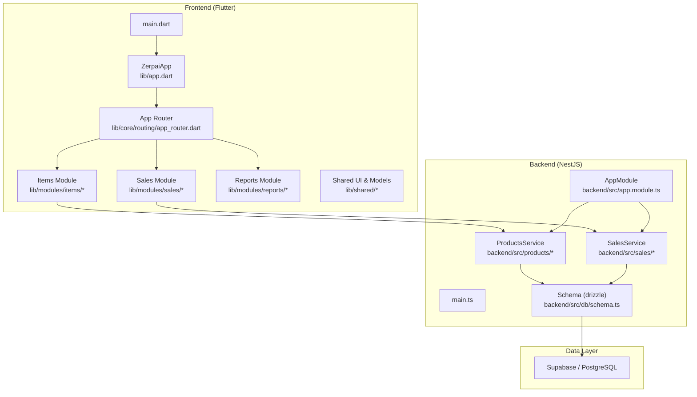
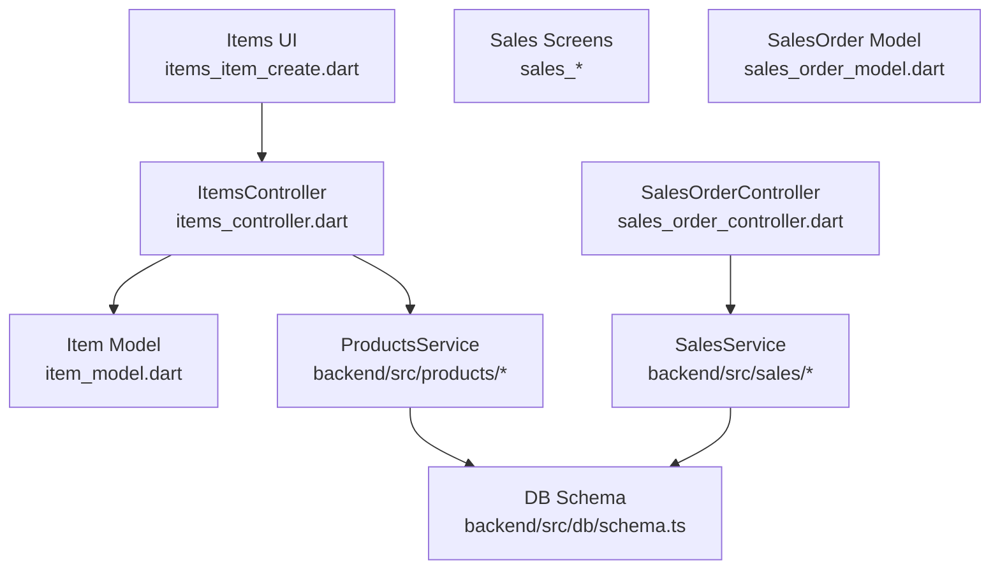
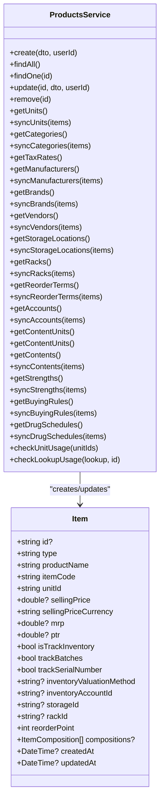
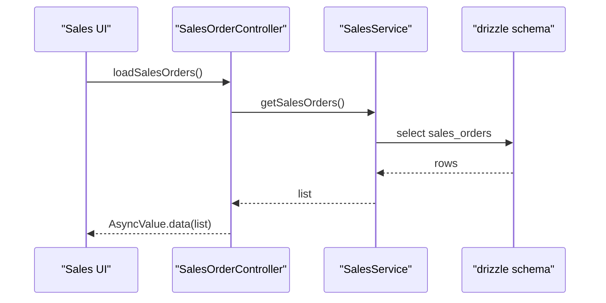
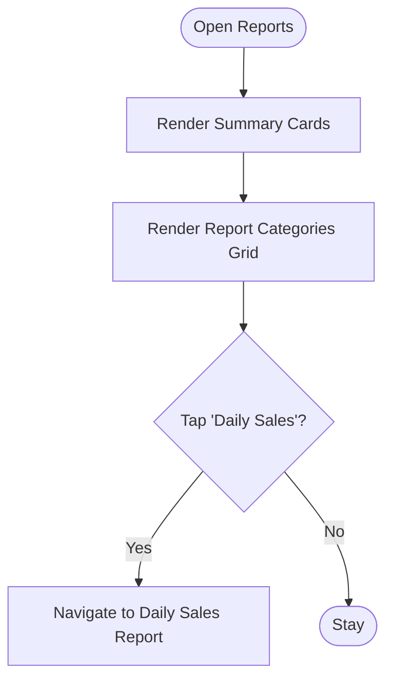
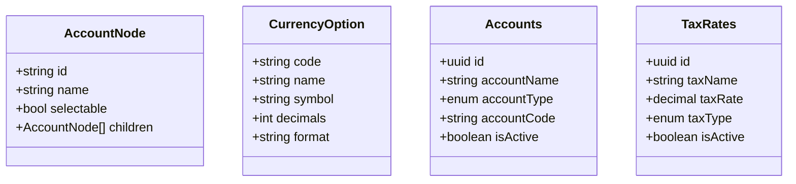
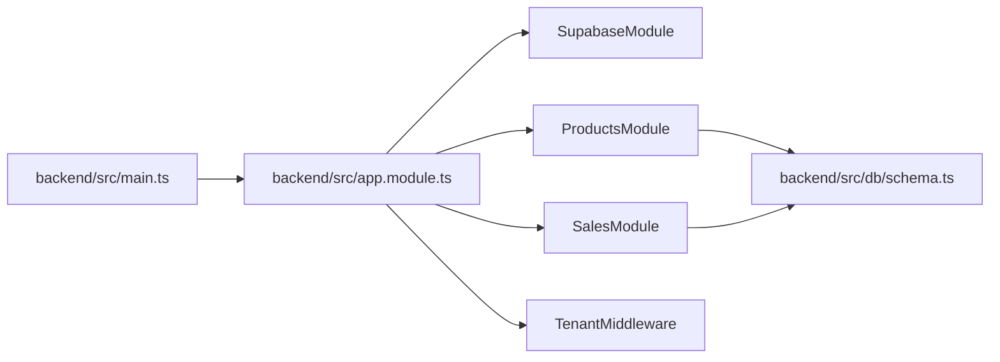

# Core Modules

<cite>
**Referenced Files in This Document**
- [lib/app.dart](file://lib/app.dart)
- [lib/main.dart](file://lib/main.dart)
- [backend/src/app.module.ts](file://backend/src/app.module.ts)
- [backend/src/main.ts](file://backend/src/main.ts)
- [lib/core/routing/app_router.dart](file://lib/core/routing/app_router.dart)
- [lib/modules/items/models/item_model.dart](file://lib/modules/items/models/item_model.dart)
- [lib/modules/items/controller/items_controller.dart](file://lib/modules/items/controller/items_controller.dart)
- [lib/modules/items/presentation/items_item_create.dart](file://lib/modules/items/presentation/items_item_create.dart)
- [lib/modules/sales/models/sales_order_model.dart](file://lib/modules/sales/models/sales_order_model.dart)
- [lib/modules/sales/controller/sales_order_controller.dart](file://lib/modules/sales/controller/sales_order_controller.dart)
- [backend/src/sales/sales.service.ts](file://backend/src/sales/sales.service.ts)
- [lib/modules/reports/presentation/reports_reports_dashboard.dart](file://lib/modules/reports/presentation/reports_reports_dashboard.dart)
- [lib/shared/constants/currency_constants.dart](file://lib/shared/constants/currency_constants.dart)
- [lib/shared/models/account_node.dart](file://lib/shared/models/account_node.dart)
- [backend/src/db/schema.ts](file://backend/src/db/schema.ts)
</cite>

## Table of Contents
1. [Introduction](#introduction)
2. [Project Structure](#project-structure)
3. [Core Components](#core-components)
4. [Architecture Overview](#architecture-overview)
5. [Detailed Component Analysis](#detailed-component-analysis)
6. [Dependency Analysis](#dependency-analysis)
7. [Performance Considerations](#performance-considerations)
8. [Troubleshooting Guide](#troubleshooting-guide)
9. [Conclusion](#conclusion)
10. [Appendices](#appendices)

## Introduction
This document explains ZerpAI ERP’s core business modules: Items/Products, Sales, Reports, Purchase, and Financial. It covers product lifecycle management, inventory tracking, pricing, batch/serial tracking, customer and sales workflows, invoicing and payments, e-way bill generation, dashboard analytics, vendor management, chart of accounts, multi-currency support, and tax automation. It also documents data models, UI patterns, and inter-module relationships.

## Project Structure
ZerpAI ERP is a Flutter desktop/web application with a NestJS backend and Supabase/drizzle ORM. The frontend uses Riverpod for state management and a centralized router. The backend exposes REST-like services via NestJS modules and persists data using drizzle-orm with PostgreSQL.

**Diagram sources**
- [lib/app.dart](file://lib/app.dart#L1-L32)
- [lib/main.dart](file://lib/main.dart#L1-L29)
- [backend/src/app.module.ts](file://backend/src/app.module.ts#L1-L20)
- [backend/src/main.ts](file://backend/src/main.ts#L1-L56)
- [lib/core/routing/app_router.dart](file://lib/core/routing/app_router.dart#L1-L341)
- [backend/src/db/schema.ts](file://backend/src/db/schema.ts#L1-L293)

**Section sources**
- [lib/app.dart](file://lib/app.dart#L1-L32)
- [lib/main.dart](file://lib/main.dart#L1-L29)
- [backend/src/app.module.ts](file://backend/src/app.module.ts#L1-L20)
- [backend/src/main.ts](file://backend/src/main.ts#L1-L56)
- [lib/core/routing/app_router.dart](file://lib/core/routing/app_router.dart#L1-L341)

## Core Components
- Items/Products module: Product master, formulations, pricing, inventory settings, tax preferences, and composition tracking.
- Sales module: Customer lifecycle, quotations, orders, invoices, credit notes, challans, payments, and e-way bills.
- Reports module: Dashboard cards and categorized report listings.
- Purchase module: Vendor management and procurement processes (UI placeholders present).
- Financial module: Chart of accounts, multi-currency support, and tax automation.

**Section sources**
- [lib/modules/items/models/item_model.dart](file://lib/modules/items/models/item_model.dart#L1-L461)
- [lib/modules/sales/models/sales_order_model.dart](file://lib/modules/sales/models/sales_order_model.dart#L1-L118)
- [lib/modules/reports/presentation/reports_reports_dashboard.dart](file://lib/modules/reports/presentation/reports_reports_dashboard.dart#L1-L214)
- [lib/shared/constants/currency_constants.dart](file://lib/shared/constants/currency_constants.dart#L1-L800)
- [lib/shared/models/account_node.dart](file://lib/shared/models/account_node.dart#L1-L14)
- [backend/src/db/schema.ts](file://backend/src/db/schema.ts#L1-L293)

## Architecture Overview
The system follows a layered architecture:
- Presentation layer: Flutter screens and Riverpod controllers/providers.
- Domain layer: Controllers orchestrate UI state and API interactions.
- Data layer: Services encapsulate business logic and database operations.
- Persistence layer: drizzle-orm schema maps to PostgreSQL tables.

**Diagram sources**
- [lib/modules/items/presentation/items_item_create.dart](file://lib/modules/items/presentation/items_item_create.dart#L1-L544)
- [lib/modules/items/controller/items_controller.dart](file://lib/modules/items/controller/items_controller.dart#L1-L568)
- [lib/modules/items/models/item_model.dart](file://lib/modules/items/models/item_model.dart#L1-L461)
- [backend/src/products/products.service.ts](file://backend/src/products/products.service.ts#L1-L723)
- [lib/modules/sales/controller/sales_order_controller.dart](file://lib/modules/sales/controller/sales_order_controller.dart#L1-L119)
- [lib/modules/sales/models/sales_order_model.dart](file://lib/modules/sales/models/sales_order_model.dart#L1-L118)
- [backend/src/sales/sales.service.ts](file://backend/src/sales/sales.service.ts#L1-L162)
- [backend/src/db/schema.ts](file://backend/src/db/schema.ts#L1-L293)

## Detailed Component Analysis

### Items/Products Module
- Purpose: Manage product definitions, formulations, pricing, inventory settings, tax preferences, and compositions.
- Key UI patterns:
  - Tabbed creation/editing screens with sections for composition, formulation, sales, purchase, and settings.
  - Lookup synchronization for units, categories, tax rates, manufacturers, brands, vendors, storage locations, racks, reorder terms, accounts, contents, strengths, buying rules, and drug schedules.
  - Image upload and primary image selection.
- Data model highlights:
  - Product type, billing/product name, item code/SKU, unit, category, returnability, e-commerce push flag.
  - Tax preference and HSN/HSN-like codes.
  - Pricing (selling price, MRP, PTR) with per-item currency.
  - Formulation (dimensions, weight, units, identifiers).
  - Inventory tracking (batch/serial), valuation method, storage/rack, reorder point/term, and accounts.
  - Compositions (child table) for associated ingredients.
- Backend service responsibilities:
  - Create, update, find, and soft-delete products.
  - Upsert and synchronize lookup metadata with conflict resolution.
  - Usage checks for lookups before deletion.
- API endpoints (backend):
  - GET /products
  - GET /products/:id
  - POST /products
  - PUT /products/:id
  - DELETE /products/:id
  - GET /products/lookup/{table}
  - POST /products/lookup/{table}/sync
  - GET /products/lookup/{table}/usage/{id}

**Diagram sources**
- [lib/modules/items/models/item_model.dart](file://lib/modules/items/models/item_model.dart#L1-L461)
- [backend/src/products/products.service.ts](file://backend/src/products/products.service.ts#L1-L723)

**Section sources**
- [lib/modules/items/models/item_model.dart](file://lib/modules/items/models/item_model.dart#L1-L461)
- [lib/modules/items/controller/items_controller.dart](file://lib/modules/items/controller/items_controller.dart#L1-L568)
- [lib/modules/items/presentation/items_item_create.dart](file://lib/modules/items/presentation/items_item_create.dart#L1-L544)
- [backend/src/products/products.service.ts](file://backend/src/products/products.service.ts#L1-L723)
- [backend/src/db/schema.ts](file://backend/src/db/schema.ts#L116-L195)

### Sales Module
- Purpose: Customer management, sales workflow (quotes, orders, invoices, returns, credit notes, challans), payments, and e-way bills.
- UI patterns:
  - Centralized routing for all sales screens.
  - Generic list screens with provider-driven data loading.
  - Dedicated creation screens for each document type.
- Data model highlights:
  - SalesOrder with customer, items, totals, taxes, discounts, shipping, adjustments, status, and document type.
  - Payment, e-way bill, and payment link entities.
- Backend service responsibilities:
  - Customer CRUD.
  - Sales document CRUD by type.
  - Payments CRUD.
  - E-way bills CRUD.
  - Payment links CRUD.
  - Mocked GSTIN lookup.
- API endpoints (backend):
  - GET /sales/customers
  - GET /sales/customers/:id
  - POST /sales/customers
  - GET /sales/orders?type=...
  - GET /sales/orders/:id
  - POST /sales/orders
  - DELETE /sales/orders/:id
  - GET /sales/payments
  - POST /sales/payments
  - GET /sales/eway-bills
  - POST /sales/eway-bills
  - GET /sales/payment-links
  - POST /sales/payment-links
  - GET /sales/gstin/:gstin

**Diagram sources**
- [lib/modules/sales/controller/sales_order_controller.dart](file://lib/modules/sales/controller/sales_order_controller.dart#L1-L119)
- [backend/src/sales/sales.service.ts](file://backend/src/sales/sales.service.ts#L1-L162)
- [backend/src/db/schema.ts](file://backend/src/db/schema.ts#L236-L291)

**Section sources**
- [lib/modules/sales/models/sales_order_model.dart](file://lib/modules/sales/models/sales_order_model.dart#L1-L118)
- [lib/modules/sales/controller/sales_order_controller.dart](file://lib/modules/sales/controller/sales_order_controller.dart#L1-L119)
- [backend/src/sales/sales.service.ts](file://backend/src/sales/sales.service.ts#L1-L162)
- [lib/core/routing/app_router.dart](file://lib/core/routing/app_router.dart#L37-L90)
- [backend/src/db/schema.ts](file://backend/src/db/schema.ts#L213-L291)

### Reports Module
- Purpose: Dashboard with summary cards and categorized report listings.
- UI patterns:
  - Summary cards for key metrics.
  - Grid of report categories with actionable items.
  - Navigation to daily sales report.
- Implementation:
  - Dashboard screen defines categories and navigates to specific report routes.

**Diagram sources**
- [lib/modules/reports/presentation/reports_reports_dashboard.dart](file://lib/modules/reports/presentation/reports_reports_dashboard.dart#L1-L214)
- [lib/core/routing/app_router.dart](file://lib/core/routing/app_router.dart#L260-L265)

**Section sources**
- [lib/modules/reports/presentation/reports_reports_dashboard.dart](file://lib/modules/reports/presentation/reports_reports_dashboard.dart#L1-L214)
- [lib/core/routing/app_router.dart](file://lib/core/routing/app_router.dart#L260-L265)

### Purchase Module
- Purpose: Vendor management and procurement processes.
- Current state:
  - UI placeholders for purchase-related features (coming soon).
- Implementation note:
  - Purchase module UI routes are registered but content is placeholder.

**Section sources**
- [lib/core/routing/app_router.dart](file://lib/core/routing/app_router.dart#L234-L258)

### Financial Module
- Purpose: Chart of accounts, multi-currency support, and tax automation.
- Chart of accounts:
  - Account nodes with selectable children for hierarchical navigation.
- Multi-currency:
  - Currency options with code, name, symbol, decimals, and format.
- Tax automation:
  - Tax rate definitions and product tax preference mapping.
- Backend schema supports:
  - Accounts table with type and code.
  - Tax rates table with type and rate.
  - Product tax linkage via foreign keys.

**Diagram sources**
- [lib/shared/models/account_node.dart](file://lib/shared/models/account_node.dart#L1-L14)
- [lib/shared/constants/currency_constants.dart](file://lib/shared/constants/currency_constants.dart#L1-L800)
- [backend/src/db/schema.ts](file://backend/src/db/schema.ts#L60-L68)
- [backend/src/db/schema.ts](file://backend/src/db/schema.ts#L32-L40)

**Section sources**
- [lib/shared/models/account_node.dart](file://lib/shared/models/account_node.dart#L1-L14)
- [lib/shared/constants/currency_constants.dart](file://lib/shared/constants/currency_constants.dart#L1-L800)
- [backend/src/db/schema.ts](file://backend/src/db/schema.ts#L60-L68)
- [backend/src/db/schema.ts](file://backend/src/db/schema.ts#L32-L40)

## Dependency Analysis
- Frontend dependencies:
  - ZerpaiApp depends on the centralized router.
  - Items and Sales modules depend on controllers/providers and models.
  - Reports module depends on shared layout and router.
- Backend dependencies:
  - AppModule composes Supabase, Products, and Sales modules.
  - Services depend on drizzle schema for database operations.
- Cross-cutting concerns:
  - Tenant middleware applied globally.
  - Validation pipe ensures DTO safety.
  - CORS configured for development origins.

**Diagram sources**
- [backend/src/main.ts](file://backend/src/main.ts#L1-L56)
- [backend/src/app.module.ts](file://backend/src/app.module.ts#L1-L20)
- [backend/src/db/schema.ts](file://backend/src/db/schema.ts#L1-L293)

**Section sources**
- [backend/src/main.ts](file://backend/src/main.ts#L1-L56)
- [backend/src/app.module.ts](file://backend/src/app.module.ts#L1-L20)

## Performance Considerations
- Parallel lookups: Items controller loads lookup sets concurrently to reduce latency.
- Validation pipeline: Backend enforces DTO validation early to fail fast.
- Offline-first UI: Flutter app initializes Hive boxes for offline support; network failures are handled gracefully in controllers.
- Image uploads: UI defers image upload until save; errors are surfaced via snackbars.

**Section sources**
- [lib/modules/items/controller/items_controller.dart](file://lib/modules/items/controller/items_controller.dart#L66-L184)
- [backend/src/main.ts](file://backend/src/main.ts#L26-L42)
- [lib/main.dart](file://lib/main.dart#L11-L18)
- [lib/modules/items/presentation/items_item_create.dart](file://lib/modules/items/presentation/items_item_create.dart#L326-L350)

## Troubleshooting Guide
- Items creation/update validation:
  - Controller validates required fields and positive numeric values; errors are surfaced to UI.
- Lookup usage checks:
  - Before deleting lookup items, verify usage across related tables.
- Network exceptions:
  - Controllers catch and log network/App exceptions; UI displays user-friendly messages.
- Backend validation errors:
  - Validation pipe transforms errors into structured messages with field and constraints.

**Section sources**
- [lib/modules/items/controller/items_controller.dart](file://lib/modules/items/controller/items_controller.dart#L186-L230)
- [lib/modules/items/controller/items_controller.dart](file://lib/modules/items/controller/items_controller.dart#L404-L422)
- [backend/src/main.ts](file://backend/src/main.ts#L26-L42)

## Conclusion
ZerpAI ERP’s core modules provide a robust foundation for product, sales, financial, and reporting workflows. The Items module centralizes product definition and inventory controls, while the Sales module manages the end-to-end customer journey. Reports offer actionable insights, and the Financial module supports chart of accounts, multi-currency, and tax automation. The backend’s modular design and schema-driven persistence enable scalable growth and compliance-ready operations.

## Appendices
- API endpoint summaries:
  - Items: GET /products, GET /products/:id, POST /products, PUT /products/:id, DELETE /products/:id; GET /products/lookup/*; POST /products/lookup/*/sync; GET /products/lookup/*/usage/:id
  - Sales: GET /sales/customers, GET /sales/customers/:id, POST /sales/customers; GET /sales/orders?type=..., GET /sales/orders/:id, POST /sales/orders, DELETE /sales/orders/:id; GET /sales/payments, POST /sales/payments; GET /sales/eway-bills, POST /sales/eway-bills; GET /sales/payment-links, POST /sales/payment-links; GET /sales/gstin/:gstin

**Section sources**
- [backend/src/products/products.service.ts](file://backend/src/products/products.service.ts#L91-L194)
- [backend/src/sales/sales.service.ts](file://backend/src/sales/sales.service.ts#L29-L161)
