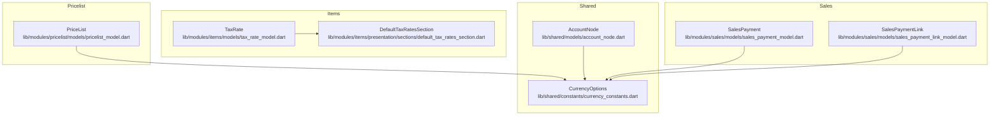
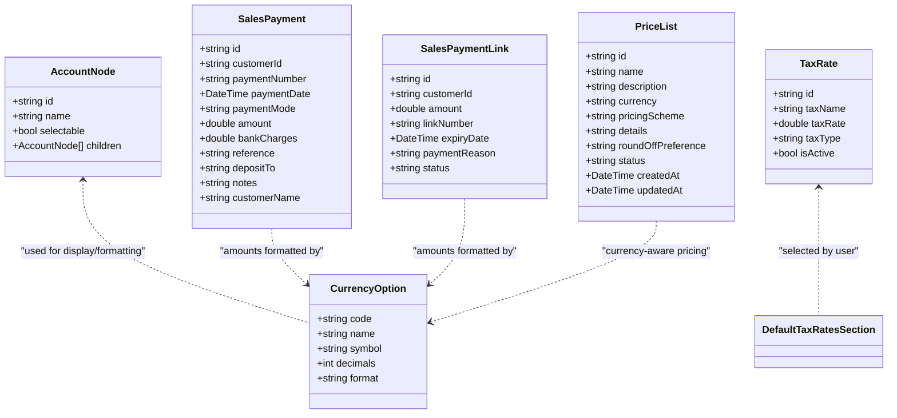
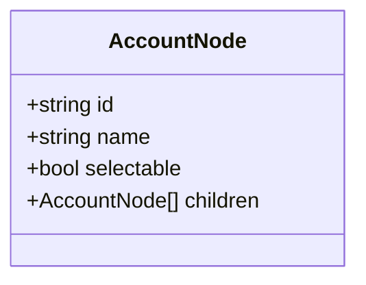
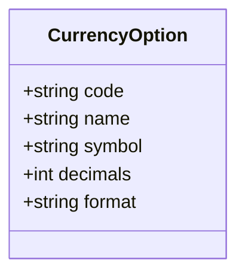
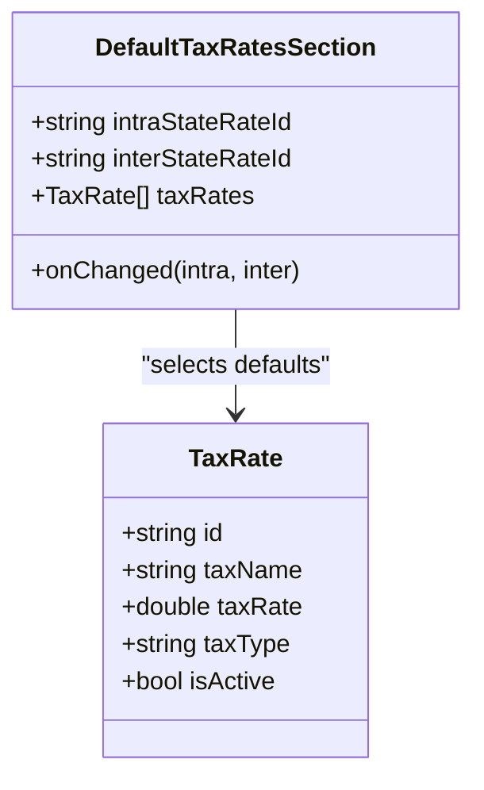
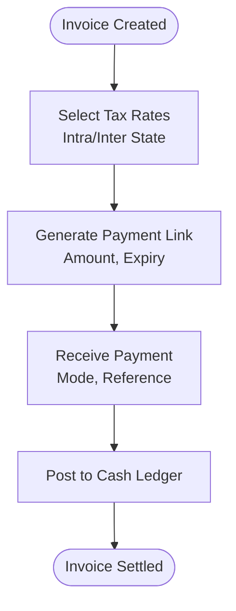
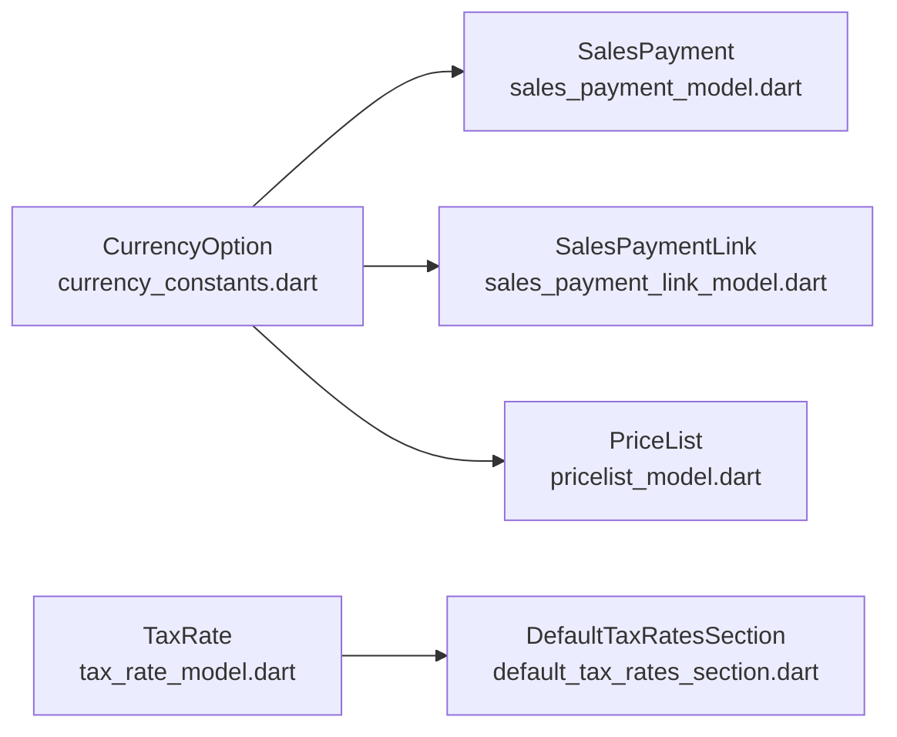

# Financial Module

<cite>
**Referenced Files in This Document**
- [account_node.dart](file://lib/shared/models/account_node.dart)
- [currency_constants.dart](file://lib/shared/constants/currency_constants.dart)
- [tax_rate_model.dart](file://lib/modules/items/models/tax_rate_model.dart)
- [default_tax_rates_section.dart](file://lib/modules/items/presentation/sections/default_tax_rates_section.dart)
- [sales_payment_model.dart](file://lib/modules/sales/models/sales_payment_model.dart)
- [sales_payment_link_model.dart](file://lib/modules/sales/models/sales_payment_link_model.dart)
- [pricelist_model.dart](file://lib/modules/pricelist/models/pricelist_model.dart)
</cite>

## Table of Contents
1. [Introduction](#introduction)
2. [Project Structure](#project-structure)
3. [Core Components](#core-components)
4. [Architecture Overview](#architecture-overview)
5. [Detailed Component Analysis](#detailed-component-analysis)
6. [Dependency Analysis](#dependency-analysis)
7. [Performance Considerations](#performance-considerations)
8. [Troubleshooting Guide](#troubleshooting-guide)
9. [Conclusion](#conclusion)
10. [Appendices](#appendices)

## Introduction
This document describes the Financial module of the Zerpai ERP system with emphasis on:
- Chart of accounts and account hierarchy
- Multi-currency support and currency formatting
- Tax automation (including GST categorization and defaults)
- Payment processing workflows (receivables, payables, and cash flow)
- Financial reporting foundations (profit and loss, balance sheet, cash flow)
- Integration with accounting standards and regulatory compliance
- Implementation details for financial calculations, currency conversions, and tax computations
- Practical workflows: invoice processing, payment collection, vendor payments, and month-end closing

The module leverages shared models and UI components to maintain consistency across pricing, taxes, and financial transactions.

## Project Structure
The Financial module spans shared models, UI sections, and domain-specific models:
- Shared models define the account tree structure and currency options
- Items module defines tax rates and default tax rate selection
- Sales module defines payment and payment-link models
- Pricelist module encapsulates currency-aware pricing schemes



**Diagram sources**
- [account_node.dart](file://lib/shared/models/account_node.dart#L1-L14)
- [currency_constants.dart](file://lib/shared/constants/currency_constants.dart#L1-L20)
- [tax_rate_model.dart](file://lib/modules/items/models/tax_rate_model.dart#L1-L38)
- [default_tax_rates_section.dart](file://lib/modules/items/presentation/sections/default_tax_rates_section.dart#L1-L225)
- [sales_payment_model.dart](file://lib/modules/sales/models/sales_payment_model.dart#L1-L61)
- [sales_payment_link_model.dart](file://lib/modules/sales/models/sales_payment_link_model.dart#L1-L49)
- [pricelist_model.dart](file://lib/modules/pricelist/models/pricelist_model.dart#L1-L150)

**Section sources**
- [account_node.dart](file://lib/shared/models/account_node.dart#L1-L14)
- [currency_constants.dart](file://lib/shared/constants/currency_constants.dart#L1-L20)
- [tax_rate_model.dart](file://lib/modules/items/models/tax_rate_model.dart#L1-L38)
- [default_tax_rates_section.dart](file://lib/modules/items/presentation/sections/default_tax_rates_section.dart#L1-L225)
- [sales_payment_model.dart](file://lib/modules/sales/models/sales_payment_model.dart#L1-L61)
- [sales_payment_link_model.dart](file://lib/modules/sales/models/sales_payment_link_model.dart#L1-L49)
- [pricelist_model.dart](file://lib/modules/pricelist/models/pricelist_model.dart#L1-L150)

## Core Components
- AccountNode: Lightweight hierarchical account model used to represent chart of accounts nodes with selectable flags and children.
- CurrencyOption and DEFAULT_CURRENCY_OPTIONS: Centralized currency metadata for formatting and display.
- TaxRate: Defines tax identifiers, rates, optional tax type (e.g., IGST/CGST/SGST), and active status.
- DefaultTaxRatesSection: UI component to select intra-state and inter-state default tax rates from available TaxRate entries.
- SalesPayment: Receivable payment record with mode, amount, bank charges, reference, and optional deposit-to account.
- SalesPaymentLink: Receivable link with amount, expiry date, reason, and status for payment requests.
- PriceList: Currency-aware pricing scheme with pricing scheme type, details, and rounding preferences.

These components collectively enable:
- Hierarchical chart of accounts representation
- Multi-currency formatting and display
- GST-compliant tax rate management
- Receivable tracking and cash flow recording
- Pricing and invoicing workflows

**Section sources**
- [account_node.dart](file://lib/shared/models/account_node.dart#L1-L14)
- [currency_constants.dart](file://lib/shared/constants/currency_constants.dart#L1-L20)
- [tax_rate_model.dart](file://lib/modules/items/models/tax_rate_model.dart#L1-L38)
- [default_tax_rates_section.dart](file://lib/modules/items/presentation/sections/default_tax_rates_section.dart#L1-L225)
- [sales_payment_model.dart](file://lib/modules/sales/models/sales_payment_model.dart#L1-L61)
- [sales_payment_link_model.dart](file://lib/modules/sales/models/sales_payment_link_model.dart#L1-L49)
- [pricelist_model.dart](file://lib/modules/pricelist/models/pricelist_model.dart#L1-L150)

## Architecture Overview
The Financial module integrates shared models with domain-specific models to support:
- Chart of Accounts: represented via AccountNode
- Multi-Currency: via CurrencyOption constants
- Taxes: via TaxRate and DefaultTaxRatesSection
- Payments: via SalesPayment and SalesPaymentLink
- Pricing: via PriceList with currency awareness



**Diagram sources**
- [account_node.dart](file://lib/shared/models/account_node.dart#L1-L14)
- [currency_constants.dart](file://lib/shared/constants/currency_constants.dart#L1-L20)
- [tax_rate_model.dart](file://lib/modules/items/models/tax_rate_model.dart#L1-L38)
- [default_tax_rates_section.dart](file://lib/modules/items/presentation/sections/default_tax_rates_section.dart#L1-L225)
- [sales_payment_model.dart](file://lib/modules/sales/models/sales_payment_model.dart#L1-L61)
- [sales_payment_link_model.dart](file://lib/modules/sales/models/sales_payment_link_model.dart#L1-L49)
- [pricelist_model.dart](file://lib/modules/pricelist/models/pricelist_model.dart#L1-L150)

## Detailed Component Analysis

### Chart of Accounts
- Structure: AccountNode supports hierarchical grouping of accounts with selectable leaf nodes and nested children.
- Usage: Intended to represent asset, liability, equity, income, and expense categories in a tree structure suitable for financial reporting and drill-down.



**Diagram sources**
- [account_node.dart](file://lib/shared/models/account_node.dart#L1-L14)

**Section sources**
- [account_node.dart](file://lib/shared/models/account_node.dart#L1-L14)

### Multi-Currency Support
- Currency metadata: CurrencyOption defines code, name, symbol, decimal precision, and format pattern.
- Defaults: DEFAULT_CURRENCY_OPTIONS enumerates numerous currencies with standardized formatting and decimal rules.
- Integration points: Currency options inform display formatting for amounts in payments, links, and pricing lists.



**Diagram sources**
- [currency_constants.dart](file://lib/shared/constants/currency_constants.dart#L1-L20)

**Section sources**
- [currency_constants.dart](file://lib/shared/constants/currency_constants.dart#L1-L20)

### Tax Automation
- TaxRate: Encapsulates tax identity, name, rate, optional tax type (e.g., IGST/CGST/SGST), and active flag.
- DefaultTaxRatesSection: Provides a configurable UI to set intra-state and inter-state default tax rates from available TaxRate entries.
- Compliance: Supports GST-style tax categorization via taxType and maintains active/inactive state for rates.



**Diagram sources**
- [tax_rate_model.dart](file://lib/modules/items/models/tax_rate_model.dart#L1-L38)
- [default_tax_rates_section.dart](file://lib/modules/items/presentation/sections/default_tax_rates_section.dart#L1-L225)

**Section sources**
- [tax_rate_model.dart](file://lib/modules/items/models/tax_rate_model.dart#L1-L38)
- [default_tax_rates_section.dart](file://lib/modules/items/presentation/sections/default_tax_rates_section.dart#L1-L225)

### Payment Processing Workflows
- Receivables:
  - SalesPaymentLink: Represents payable links with amount, expiry, reason, and status.
  - SalesPayment: Records received payments with mode, amount, bank charges, reference, and optional deposit-to account.
- Payables: Not modeled in the referenced files; typically managed via purchase modules and payable ledgers.
- Cash Flow: Amounts recorded in SalesPayment and SalesPaymentLink contribute to cash flow tracking.

```mermaid
sequenceDiagram
participant Customer as "Customer"
participant Link as "SalesPaymentLink"
participant Payment as "SalesPayment"
Customer->>Link : "Open payment link"
Note right of Link : "Amount, expiry, reason, status"
Customer->>Payment : "Create payment record"
Payment-->>Link : "Reference link number"
Note over Payment,Link : "Cash inflow tracked"
```

**Diagram sources**
- [sales_payment_model.dart](file://lib/modules/sales/models/sales_payment_model.dart#L1-L61)
- [sales_payment_link_model.dart](file://lib/modules/sales/models/sales_payment_link_model.dart#L1-L49)

**Section sources**
- [sales_payment_model.dart](file://lib/modules/sales/models/sales_payment_model.dart#L1-L61)
- [sales_payment_link_model.dart](file://lib/modules/sales/models/sales_payment_link_model.dart#L1-L49)

### Financial Reporting Foundations
- Profit and Loss: Derived from chart of accounts categories (income and expenses) and transaction records (payments/receipts).
- Balance Sheet: Derived from asset, liability, and equity accounts in the chart of accounts.
- Cash Flow: Derived from receivable/payable movements and payment records.

Note: The referenced files provide foundational models and UI sections. Full reporting requires integration with ledger posting and aggregation logic not present in the referenced files.

[No sources needed since this section synthesizes reporting concepts without analyzing specific files]

### Implementation Details

#### Financial Calculations
- Amount parsing and serialization: SalesPayment and SalesPaymentLink parse numeric fields safely and serialize dates consistently.
- Rounding and currency formatting: PriceList supports round-off preferences; CurrencyOption provides decimal and format metadata for consistent display.

**Section sources**
- [sales_payment_model.dart](file://lib/modules/sales/models/sales_payment_model.dart#L28-L60)
- [sales_payment_link_model.dart](file://lib/modules/sales/models/sales_payment_link_model.dart#L22-L47)
- [pricelist_model.dart](file://lib/modules/pricelist/models/pricelist_model.dart#L1-L150)
- [currency_constants.dart](file://lib/shared/constants/currency_constants.dart#L1-L20)

#### Currency Conversions
- Exchange rate management: Not implemented in the referenced files. Suggested approach:
  - Store base currency and transaction currency on each record
  - Maintain a daily exchange rate table keyed by date and currency pair
  - Convert amounts at transaction creation time using the applicable rate
  - Store both original and converted values for auditability

[No sources needed since this section proposes conceptual implementation]

#### Tax Computations
- GST calculation: Not implemented in the referenced files. Suggested approach:
  - Compute tax amounts using selected TaxRate and taxType (IGST/CGST/SGST)
  - Apply intra-state vs inter-state rules based on DefaultTaxRatesSection selections
  - Aggregate tax totals per invoice/document and post to ledger

[No sources needed since this section proposes conceptual implementation]

### Examples of Financial Workflows

#### Invoice Processing
- Create invoice with line items and tax rates
- Apply intra-state or inter-state tax defaults
- Generate payment link with expiry and amount
- Record receipt of payment with mode and reference



[No sources needed since this diagram shows conceptual workflow, not actual code structure]

#### Payment Collection
- Create SalesPaymentLink for customer
- Capture SalesPayment with payment mode and bank charges
- Update receivable balances and cash ledger

```mermaid
sequenceDiagram
participant Customer as "Customer"
participant Link as "SalesPaymentLink"
participant Payment as "SalesPayment"
Customer->>Link : "Open link"
Customer->>Payment : "Submit payment"
Payment-->>Link : "Settle link"
```

[No sources needed since this diagram shows conceptual workflow, not actual code structure]

#### Vendor Payments and Month-End Closing
- Track payables via purchase module (not shown here)
- Record vendor payments and reconcile outstanding balances
- Perform month-end close by posting adjusting entries and generating reports

[No sources needed since this section provides general guidance]

## Dependency Analysis
- Shared models depend on currency constants for formatting.
- Items module depends on tax rate models for tax configuration.
- Sales module depends on currency constants for amount formatting.
- Pricelist module depends on currency constants for currency-aware pricing.



**Diagram sources**
- [currency_constants.dart](file://lib/shared/constants/currency_constants.dart#L1-L20)
- [sales_payment_model.dart](file://lib/modules/sales/models/sales_payment_model.dart#L1-L61)
- [sales_payment_link_model.dart](file://lib/modules/sales/models/sales_payment_link_model.dart#L1-L49)
- [pricelist_model.dart](file://lib/modules/pricelist/models/pricelist_model.dart#L1-L150)
- [tax_rate_model.dart](file://lib/modules/items/models/tax_rate_model.dart#L1-L38)
- [default_tax_rates_section.dart](file://lib/modules/items/presentation/sections/default_tax_rates_section.dart#L1-L225)

**Section sources**
- [currency_constants.dart](file://lib/shared/constants/currency_constants.dart#L1-L20)
- [sales_payment_model.dart](file://lib/modules/sales/models/sales_payment_model.dart#L1-L61)
- [sales_payment_link_model.dart](file://lib/modules/sales/models/sales_payment_link_model.dart#L1-L49)
- [pricelist_model.dart](file://lib/modules/pricelist/models/pricelist_model.dart#L1-L150)
- [tax_rate_model.dart](file://lib/modules/items/models/tax_rate_model.dart#L1-L38)
- [default_tax_rates_section.dart](file://lib/modules/items/presentation/sections/default_tax_rates_section.dart#L1-L225)

## Performance Considerations
- Currency formatting: Use CurrencyOption metadata to avoid repeated formatting computations.
- Tax rate lookups: Cache TaxRate lists in UI sections to minimize repeated fetches.
- Payment link expiration: Implement background checks to mark expired links and prevent stale queries.
- Serialization: Prefer typed numeric parsing and safe fallbacks to avoid runtime errors.

[No sources needed since this section provides general guidance]

## Troubleshooting Guide
- Parsing failures: Verify numeric fields in SalesPayment and SalesPaymentLink are parsable; handle nulls gracefully.
- Tax defaults: Ensure DefaultTaxRatesSection updates notify parent components and validates non-null selections.
- Currency display: Confirm CurrencyOption decimals and format align with regional expectations.

**Section sources**
- [sales_payment_model.dart](file://lib/modules/sales/models/sales_payment_model.dart#L28-L60)
- [sales_payment_link_model.dart](file://lib/modules/sales/models/sales_payment_link_model.dart#L22-L47)
- [default_tax_rates_section.dart](file://lib/modules/items/presentation/sections/default_tax_rates_section.dart#L47-L123)

## Conclusion
The Financial module establishes a solid foundation for chart of accounts, multi-currency support, tax automation, and payment processing. While core models and UI sections are present, advanced features such as exchange rate management, GST computation, and full financial reporting require extension. Integrating these capabilities will enable robust financial operations aligned with accounting standards and regulatory compliance.

[No sources needed since this section summarizes without analyzing specific files]

## Appendices

### Appendix A: Chart of Accounts Categories
- Assets
- Liabilities
- Equity
- Income
- Expenses

[No sources needed since this section provides general guidance]

### Appendix B: Regulatory Compliance Notes
- GST categorization supported via taxType on TaxRate
- Default intra-state and inter-state rates via DefaultTaxRatesSection
- Currency formatting via CurrencyOption supports international standards

**Section sources**
- [tax_rate_model.dart](file://lib/modules/items/models/tax_rate_model.dart#L1-L38)
- [default_tax_rates_section.dart](file://lib/modules/items/presentation/sections/default_tax_rates_section.dart#L1-L225)
- [currency_constants.dart](file://lib/shared/constants/currency_constants.dart#L1-L20)