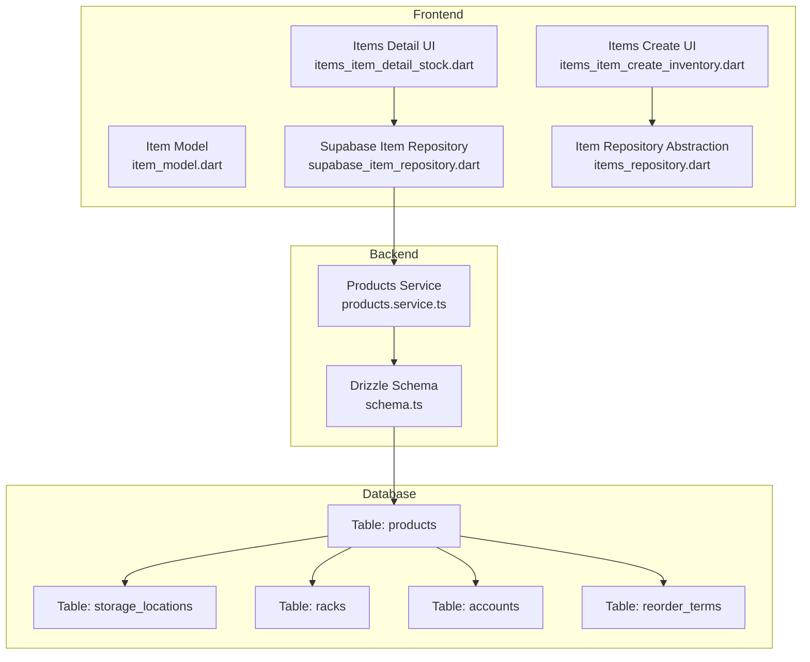
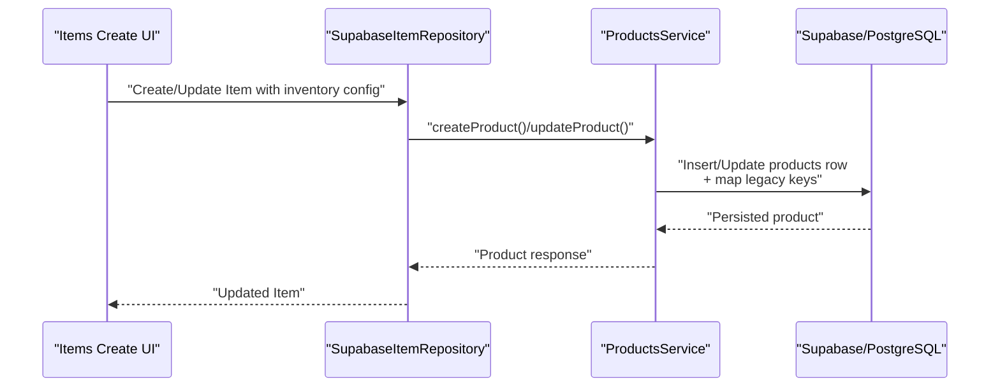
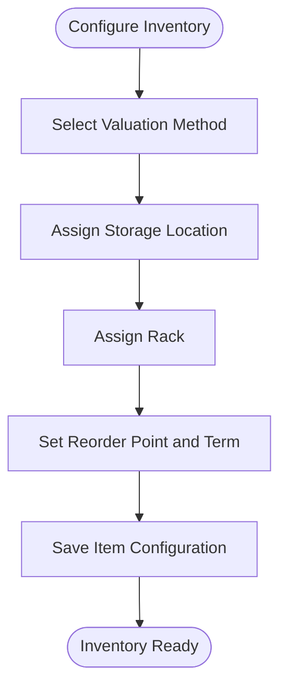
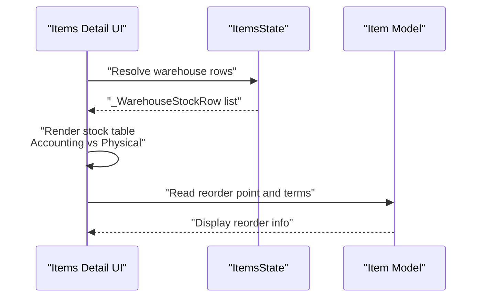
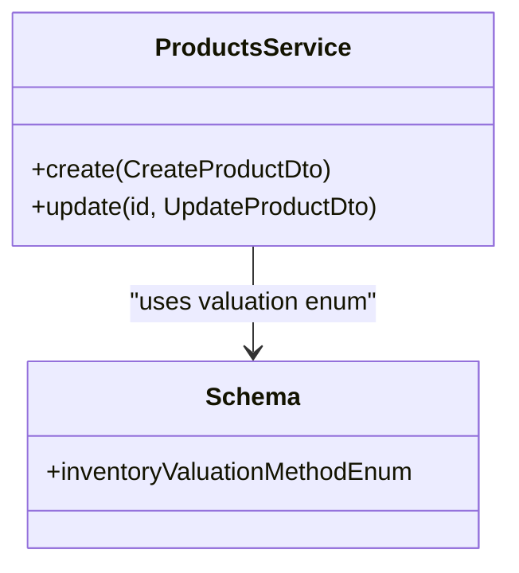
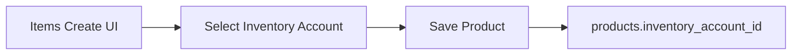
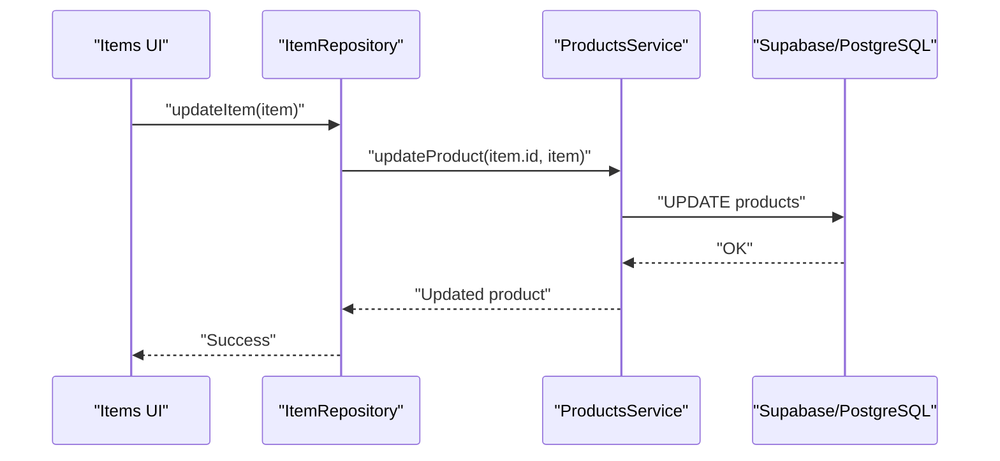
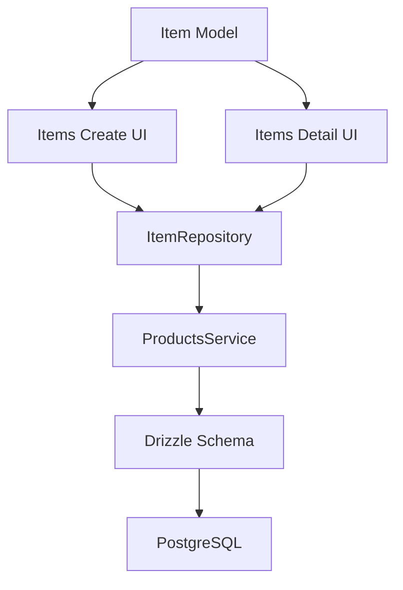

# Inventory Tracking System

<cite>
**Referenced Files in This Document**
- [item_model.dart](file://lib/modules/items/models/item_model.dart)
- [items_item_create_inventory.dart](file://lib/modules/items/presentation/sections/items_item_create_inventory.dart)
- [items_item_detail_stock.dart](file://lib/modules/items/presentation/sections/items_item_detail_stock.dart)
- [supabase_item_repository.dart](file://lib/modules/items/repositories/supabase_item_repository.dart)
- [items_repository.dart](file://lib/modules/items/repositories/items_repository.dart)
- [products.service.ts](file://backend/src/products/products.service.ts)
- [schema.ts](file://backend/src/db/schema.ts)
- [004_add_track_serial_number.sql](file://supabase/migrations/004_add_track_serial_number.sql)
</cite>

## Table of Contents
1. [Introduction](#introduction)
2. [Project Structure](#project-structure)
3. [Core Components](#core-components)
4. [Architecture Overview](#architecture-overview)
5. [Detailed Component Analysis](#detailed-component-analysis)
6. [Dependency Analysis](#dependency-analysis)
7. [Performance Considerations](#performance-considerations)
8. [Troubleshooting Guide](#troubleshooting-guide)
9. [Conclusion](#conclusion)
10. [Appendices](#appendices)

## Introduction
This document explains the inventory tracking system, covering the three inventory tracking modes (none, serial numbers, and batches), inventory configuration options (valuation methods, storage locations, reorder point management), integration with physical location tracking and bin management, multi-location inventory support, valuation algorithms and cost calculations, and accounting integration. It also provides practical examples for setup, batch entry workflows, serial number tracking scenarios, inventory adjustments, and real-time synchronization with Supabase along with offline conflict resolution strategies.

## Project Structure
The inventory tracking system spans the frontend Flutter modules and the backend NestJS service with a Supabase/PostgreSQL persistence layer. Key areas:
- Frontend: Items module defines inventory flags, valuation method selection, storage/rack associations, and reorder point configuration. It renders stock summaries and warehouse views.
- Backend: Products service handles product creation, updates, and lookups, including inventory-related fields and metadata synchronization for storage locations, racks, and accounts.
- Database: Drizzle schema defines inventory-related columns and enums, including valuation methods and foreign keys to lookup tables.



**Diagram sources**
- [items_item_create_inventory.dart](file://lib/modules/items/presentation/sections/items_item_create_inventory.dart#L1-L769)
- [items_item_detail_stock.dart](file://lib/modules/items/presentation/sections/items_item_detail_stock.dart#L1-L786)
- [item_model.dart](file://lib/modules/items/models/item_model.dart#L1-L461)
- [supabase_item_repository.dart](file://lib/modules/items/repositories/supabase_item_repository.dart#L1-L42)
- [items_repository.dart](file://lib/modules/items/repositories/items_repository.dart#L1-L53)
- [products.service.ts](file://backend/src/products/products.service.ts#L1-L723)
- [schema.ts](file://backend/src/db/schema.ts#L1-L293)

**Section sources**
- [items_item_create_inventory.dart](file://lib/modules/items/presentation/sections/items_item_create_inventory.dart#L1-L769)
- [items_item_detail_stock.dart](file://lib/modules/items/presentation/sections/items_item_detail_stock.dart#L1-L786)
- [item_model.dart](file://lib/modules/items/models/item_model.dart#L1-L461)
- [supabase_item_repository.dart](file://lib/modules/items/repositories/supabase_item_repository.dart#L1-L42)
- [items_repository.dart](file://lib/modules/items/repositories/items_repository.dart#L1-L53)
- [products.service.ts](file://backend/src/products/products.service.ts#L1-L723)
- [schema.ts](file://backend/src/db/schema.ts#L1-L293)

## Core Components
- Item model encapsulates inventory flags and configuration: inventory tracking toggle, bin/location tracking, batch tracking, serial number tracking, valuation method, storage and rack associations, and reorder point settings.
- Items create UI exposes inventory settings and valuation method selection, plus storage and reorder term associations.
- Items detail UI shows stock summary cards, warehouse stock tables, and reorder point management.
- Repository abstraction and Supabase repository implement CRUD operations against the backend API service.
- Backend Products service persists inventory fields, maps legacy keys to database columns, and supports metadata synchronization for storage locations, racks, and accounts.
- Database schema defines inventory-related columns, valuation method enum, and foreign keys to lookup tables.

**Section sources**
- [item_model.dart](file://lib/modules/items/models/item_model.dart#L74-L86)
- [items_item_create_inventory.dart](file://lib/modules/items/presentation/sections/items_item_create_inventory.dart#L114-L154)
- [items_item_detail_stock.dart](file://lib/modules/items/presentation/sections/items_item_detail_stock.dart#L521-L610)
- [supabase_item_repository.dart](file://lib/modules/items/repositories/supabase_item_repository.dart#L7-L41)
- [products.service.ts](file://backend/src/products/products.service.ts#L18-L89)
- [schema.ts](file://backend/src/db/schema.ts#L116-L195)

## Architecture Overview
The system follows a layered architecture:
- Presentation layer (Flutter) renders inventory configuration and stock views.
- Domain/repository layer abstracts data access and delegates to the backend API service.
- Backend service layer (NestJS) interacts with Supabase/PostgreSQL via Drizzle ORM.
- Database layer stores product inventory settings and related metadata.



**Diagram sources**
- [items_item_create_inventory.dart](file://lib/modules/items/presentation/sections/items_item_create_inventory.dart#L1-L769)
- [supabase_item_repository.dart](file://lib/modules/items/repositories/supabase_item_repository.dart#L25-L35)
- [products.service.ts](file://backend/src/products/products.service.ts#L18-L89)

## Detailed Component Analysis

### Inventory Tracking Modes
The system supports three inventory tracking modes selectable in the Items Create UI:
- None: Basic inventory tracking disabled.
- Track Serial Number: Each unit is tracked individually with unique identifiers.
- Track Batches: Units are grouped by batch identifiers with expiry and lot controls.

These modes are represented by flags in the Item model and surfaced in the UI for selection during item creation.

```mermaid
classDiagram
class Item {
+bool isTrackInventory
+bool trackBinLocation
+bool trackBatches
+bool trackSerialNumber
+String inventoryValuationMethod
+String storageId
+String rackId
+int reorderPoint
+String reorderTermId
}
class InventoryTrackingMode {
<<enumeration>>
"none"
"serialNumbers"
"batches"
}
Item --> InventoryTrackingMode : "trackingMode"
```

**Diagram sources**
- [item_model.dart](file://lib/modules/items/models/item_model.dart#L76-L85)
- [items_item_create_inventory.dart](file://lib/modules/items/presentation/sections/items_item_create_inventory.dart#L114-L154)

**Section sources**
- [item_model.dart](file://lib/modules/items/models/item_model.dart#L76-L85)
- [items_item_create_inventory.dart](file://lib/modules/items/presentation/sections/items_item_create_inventory.dart#L114-L154)

### Inventory Configuration Options
- Valuation Methods: FIFO, LIFO, Weighted Average are supported in the UI and persisted via the backend service.
- Storage Locations and Racks: Items can be associated with storage and rack identifiers for physical bin management.
- Reorder Point Management: Items maintain a reorder point and term association to trigger replenishment alerts.



**Diagram sources**
- [items_item_create_inventory.dart](file://lib/modules/items/presentation/sections/items_item_create_inventory.dart#L228-L281)
- [items_item_create_inventory.dart](file://lib/modules/items/presentation/sections/items_item_create_inventory.dart#L416-L484)
- [items_item_create_inventory.dart](file://lib/modules/items/presentation/sections/items_item_create_inventory.dart#L569-L651)

**Section sources**
- [items_item_create_inventory.dart](file://lib/modules/items/presentation/sections/items_item_create_inventory.dart#L228-L281)
- [items_item_create_inventory.dart](file://lib/modules/items/presentation/sections/items_item_create_inventory.dart#L416-L484)
- [items_item_create_inventory.dart](file://lib/modules/items/presentation/sections/items_item_create_inventory.dart#L569-L651)

### Integration with Physical Location Tracking, Bin Management, and Multi-Location Inventory
- Physical location tracking: The Items Detail UI displays stock by warehouse and toggles between Accounting Stock and Physical Stock views.
- Bin management: The Items Create UI allows enabling bin/location tracking for precise storage assignment.
- Multi-location inventory: The UI aggregates stock across warehouses and shows committed and available quantities.



**Diagram sources**
- [items_item_detail_stock.dart](file://lib/modules/items/presentation/sections/items_item_detail_stock.dart#L392-L403)
- [items_item_detail_stock.dart](file://lib/modules/items/presentation/sections/items_item_detail_stock.dart#L108-L215)
- [items_item_detail_stock.dart](file://lib/modules/items/presentation/sections/items_item_detail_stock.dart#L521-L610)

**Section sources**
- [items_item_detail_stock.dart](file://lib/modules/items/presentation/sections/items_item_detail_stock.dart#L50-L106)
- [items_item_detail_stock.dart](file://lib/modules/items/presentation/sections/items_item_detail_stock.dart#L108-L215)
- [items_item_detail_stock.dart](file://lib/modules/items/presentation/sections/items_item_detail_stock.dart#L521-L610)

### Inventory Valuation Algorithms and Cost Calculation Methods
- Supported valuation methods include FIFO, LIFO, and Weighted Average. These are selectable in the UI and persisted in the product record.
- The backend service maps inventory valuation method values to the database column and ensures compatibility with the schema enum.



**Diagram sources**
- [items_item_create_inventory.dart](file://lib/modules/items/presentation/sections/items_item_create_inventory.dart#L234)
- [products.service.ts](file://backend/src/products/products.service.ts#L18-L89)
- [schema.ts](file://backend/src/db/schema.ts#L6)

**Section sources**
- [items_item_create_inventory.dart](file://lib/modules/items/presentation/sections/items_item_create_inventory.dart#L234)
- [products.service.ts](file://backend/src/products/products.service.ts#L18-L89)
- [schema.ts](file://backend/src/db/schema.ts#L6)

### Accounting Integration
- Inventory account association: Items can be linked to an inventory account for financial reporting.
- Backend service persists inventory account ID and supports account metadata synchronization.



**Diagram sources**
- [items_item_create_inventory.dart](file://lib/modules/items/presentation/sections/items_item_create_inventory.dart#L159-L178)
- [products.service.ts](file://backend/src/products/products.service.ts#L148-L179)

**Section sources**
- [items_item_create_inventory.dart](file://lib/modules/items/presentation/sections/items_item_create_inventory.dart#L159-L178)
- [products.service.ts](file://backend/src/products/products.service.ts#L148-L179)

### Practical Examples

#### Example 1: Inventory Setup for a Serialized Item
- Enable inventory tracking and select “Track Serial Number.”
- Choose an inventory account and valuation method.
- Assign storage and rack for bin management.
- Set reorder point and term.
- Save the item; the backend maps the serial tracking flag to the database column.

**Section sources**
- [items_item_create_inventory.dart](file://lib/modules/items/presentation/sections/items_item_create_inventory.dart#L114-L154)
- [items_item_create_inventory.dart](file://lib/modules/items/presentation/sections/items_item_create_inventory.dart#L159-L178)
- [items_item_create_inventory.dart](file://lib/modules/items/presentation/sections/items_item_create_inventory.dart#L416-L484)
- [items_item_create_inventory.dart](file://lib/modules/items/presentation/sections/items_item_create_inventory.dart#L569-L651)
- [products.service.ts](file://backend/src/products/products.service.ts#L29-L37)
- [004_add_track_serial_number.sql](file://supabase/migrations/004_add_track_serial_number.sql#L1-L13)

#### Example 2: Batch Entry Workflow
- Enable inventory tracking and select “Track Batches.”
- On the Items Detail screen, open the “Add Opening Stock” dialog.
- Select the appropriate warehouse and enter batch details.
- The system records batched inventory for accounting and physical stock reconciliation.

**Section sources**
- [items_item_create_inventory.dart](file://lib/modules/items/presentation/sections/items_item_create_inventory.dart#L142-L154)
- [items_item_detail_stock.dart](file://lib/modules/items/presentation/sections/items_item_detail_stock.dart#L419-L457)

#### Example 3: Serial Number Tracking Scenario
- Create a serialized item with serial tracking enabled.
- During inbound or opening stock, assign serial numbers to each unit.
- The system maintains serial-specific stock visibility and traceability.

**Section sources**
- [items_item_create_inventory.dart](file://lib/modules/items/presentation/sections/items_item_create_inventory.dart#L129-L140)
- [004_add_track_serial_number.sql](file://supabase/migrations/004_add_track_serial_number.sql#L1-L13)

#### Example 4: Inventory Adjustment Process
- Navigate to the item’s stock tab and choose the appropriate warehouse.
- Toggle between Accounting Stock and Physical Stock to reconcile differences.
- Adjust quantities accordingly; the system reflects committed and available stock.

**Section sources**
- [items_item_detail_stock.dart](file://lib/modules/items/presentation/sections/items_item_detail_stock.dart#L276-L338)
- [items_item_detail_stock.dart](file://lib/modules/items/presentation/sections/items_item_detail_stock.dart#L108-L215)

### Real-Time Synchronization with Supabase and Offline Conflict Resolution
- Real-time synchronization: The Supabase repository delegates CRUD operations to the backend API service, which persists inventory configurations to Supabase/PostgreSQL.
- Offline conflict resolution: The repository abstraction allows implementing caching and optimistic concurrency strategies. While the current repository throws on update without ID, future enhancements can include conflict detection and merge strategies for offline edits.



**Diagram sources**
- [supabase_item_repository.dart](file://lib/modules/items/repositories/supabase_item_repository.dart#L30-L35)
- [items_repository.dart](file://lib/modules/items/repositories/items_repository.dart#L3-L8)
- [products.service.ts](file://backend/src/products/products.service.ts#L148-L179)

**Section sources**
- [supabase_item_repository.dart](file://lib/modules/items/repositories/supabase_item_repository.dart#L1-L42)
- [items_repository.dart](file://lib/modules/items/repositories/items_repository.dart#L1-L53)
- [products.service.ts](file://backend/src/products/products.service.ts#L148-L179)

## Dependency Analysis
The inventory configuration depends on:
- Item model fields for tracking flags and valuation method.
- Backend service mapping of inventory fields and metadata synchronization.
- Database schema enforcing valuation method enum and foreign keys.



**Diagram sources**
- [item_model.dart](file://lib/modules/items/models/item_model.dart#L74-L86)
- [items_item_create_inventory.dart](file://lib/modules/items/presentation/sections/items_item_create_inventory.dart#L1-L769)
- [items_item_detail_stock.dart](file://lib/modules/items/presentation/sections/items_item_detail_stock.dart#L1-L786)
- [supabase_item_repository.dart](file://lib/modules/items/repositories/supabase_item_repository.dart#L1-L42)
- [items_repository.dart](file://lib/modules/items/repositories/items_repository.dart#L1-L53)
- [products.service.ts](file://backend/src/products/products.service.ts#L1-L723)
- [schema.ts](file://backend/src/db/schema.ts#L1-L293)

**Section sources**
- [item_model.dart](file://lib/modules/items/models/item_model.dart#L74-L86)
- [products.service.ts](file://backend/src/products/products.service.ts#L1-L723)
- [schema.ts](file://backend/src/db/schema.ts#L116-L195)

## Performance Considerations
- Prefer enabling bin/location tracking only when necessary to reduce UI complexity and data volume.
- Use valuation methods consistently across similar items to simplify reporting and reconciliation.
- Keep reorder points aligned with demand forecasts to minimize stockouts and overstock situations.
- Leverage warehouse views to compare Accounting Stock versus Physical Stock for timely reconciliations.

## Troubleshooting Guide
- Validation errors: The Items Create UI surfaces validation errors for required fields like inventory account and valuation method.
- Update without ID: The mock repository throws an error when attempting to update an item without an ID; ensure the item has a valid identifier before updates.
- Legacy key mapping: The backend service maps legacy keys (e.g., track_serial_number) to actual database columns to preserve compatibility.

**Section sources**
- [items_item_create_inventory.dart](file://lib/modules/items/presentation/sections/items_item_create_inventory.dart#L223-L225)
- [items_item_create_inventory.dart](file://lib/modules/items/presentation/sections/items_item_create_inventory.dart#L278-L280)
- [items_repository.dart](file://lib/modules/items/repositories/items_repository.dart#L39-L46)
- [products.service.ts](file://backend/src/products/products.service.ts#L29-L37)

## Conclusion
The inventory tracking system provides flexible configuration for inventory modes, robust valuation options, and strong integration with physical location tracking and accounting. The frontend offers intuitive UIs for setup and stock management, while the backend ensures reliable persistence and metadata synchronization. By aligning inventory settings with operational needs and leveraging warehouse reconciliation views, organizations can achieve accurate, real-time inventory visibility and efficient multi-location management.

## Appendices
- Database migration for serial number tracking adds the necessary column and index for performance.
- Backend service supports metadata synchronization for storage locations, racks, and accounts to maintain consistent lookups.

**Section sources**
- [004_add_track_serial_number.sql](file://supabase/migrations/004_add_track_serial_number.sql#L1-L13)
- [products.service.ts](file://backend/src/products/products.service.ts#L488-L531)