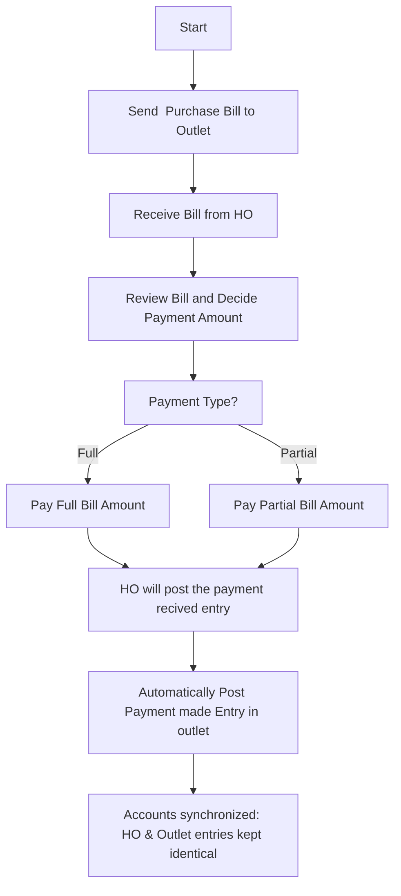
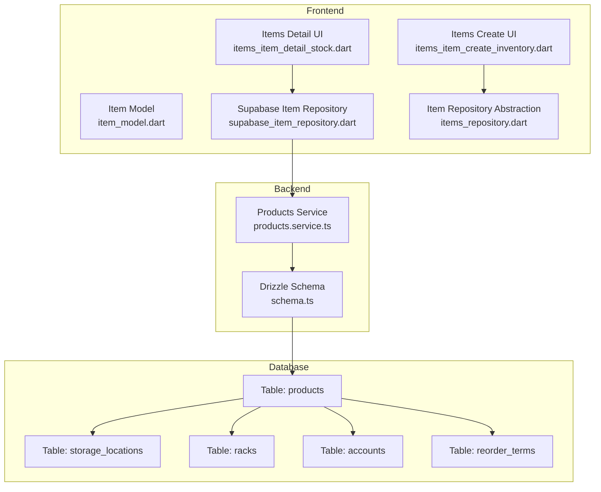
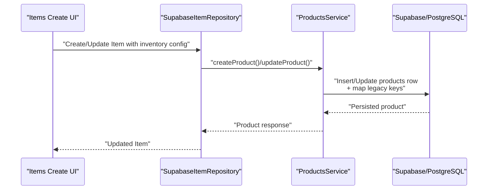
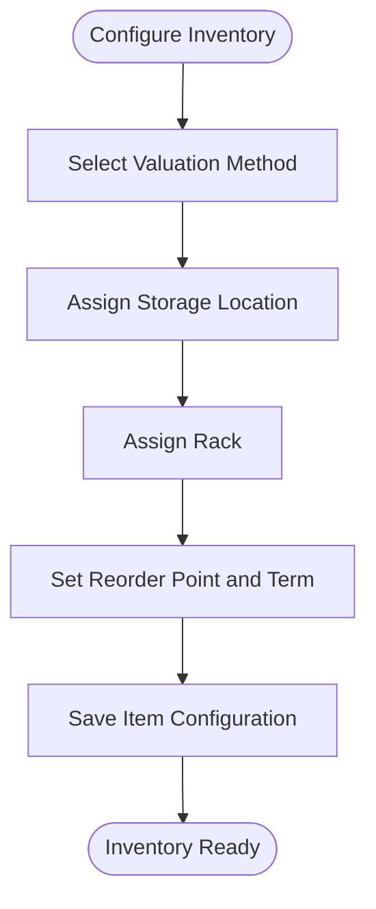
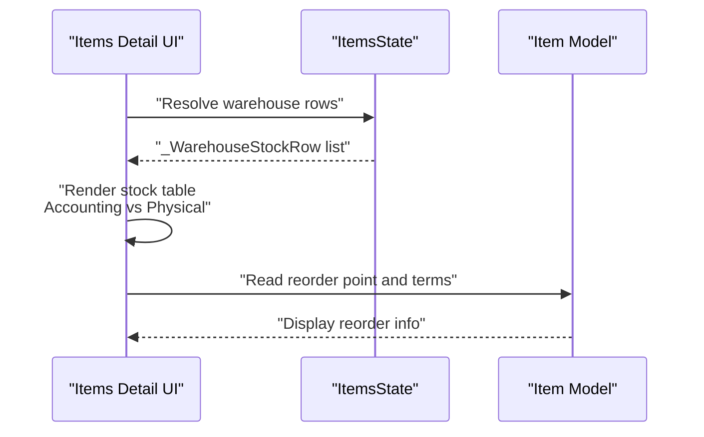
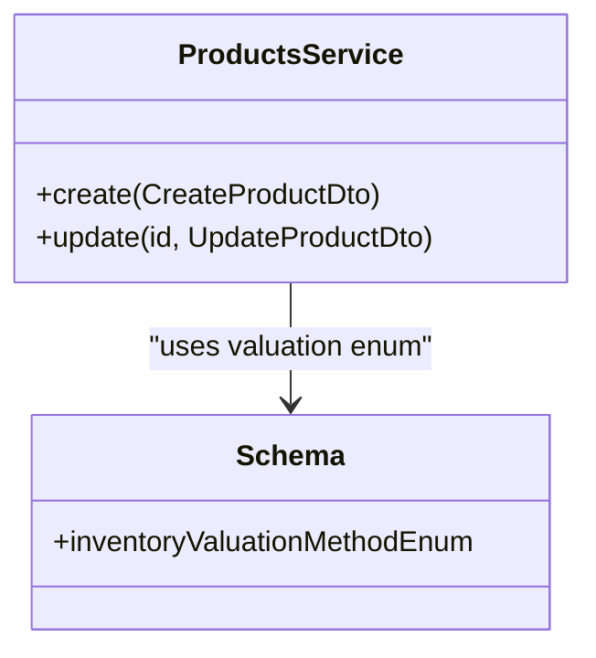
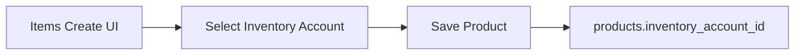
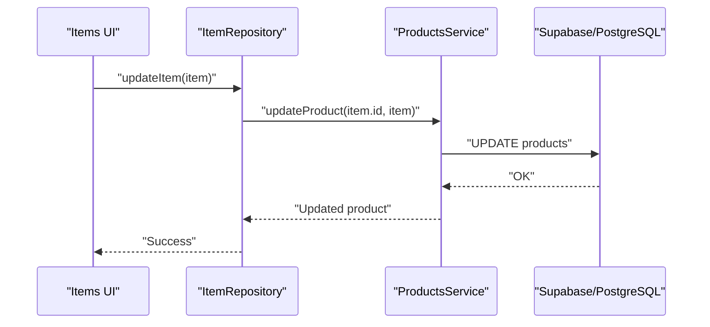
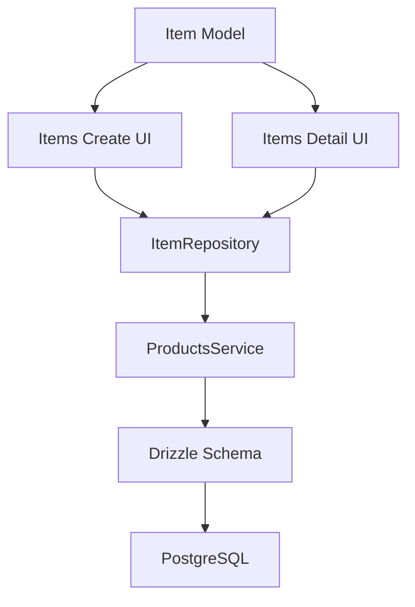

# Inventory Tracking System

<cite>
**Referenced Files in This Document**
- [item_model.dart](file://lib/modules/items/models/item_model.dart)
- [items_item_create_inventory.dart](file://lib/modules/items/presentation/sections/items_item_create_inventory.dart)
- [items_item_detail_stock.dart](file://lib/modules/items/presentation/sections/items_item_detail_stock.dart)
- [supabase_item_repository.dart](file://lib/modules/items/repositories/supabase_item_repository.dart)
- [items_repository.dart](file://lib/modules/items/repositories/items_repository.dart)
- [products.service.ts](file://backend/src/products/products.service.ts)
- [schema.ts](file://backend/src/db/schema.ts)
- [004_add_track_serial_number.sql](file://supabase/migrations/004_add_track_serial_number.sql)
</cite>

## 0. Process Workflows (System Source of Truth)

These workflows define the inter-branch and financial synchronization logic for inventory.

### 0.1 Store to Store Transfer Workflow

#### Mermaid Diagram
```mermaid
graph TD
    dqUQsr5I1gpn["OUTLET A_Create Product Requirement Request"] --> dqUQgSZ_e3Vi["Send Request to Outlet B"]
    dqUQgSZ_e3Vi["Send Request to Outlet B"] --> eqUQz5wCBK1F["Review Request"]
    eqUQz5wCBK1F["Review Request"] --> eqUQ2v2Z65hs["{Approve request?}"]
    eqUQ2v2Z65hs["{Approve request?}"] -->|Entry-wise: Approve| eqUQ1gbc89XM["Raise Purchase Return Request to HO"]
    eqUQ1gbc89XM["Raise Purchase Return Request to HO"] --> eqUQ~ugs0EB4["Review Purchase Return Request"]
    eqUQ~ugs0EB4["Review Purchase Return Request"] --> eqUQcqV2-A9T["{HO approves purchase return?}"]
    eqUQcqV2-A9T["{HO approves purchase return?}"] -->|Yes| eqUQZ46xTSCY["_Auto Convert to Sales RETURN and Credit Note"]
    eqUQZ46xTSCY["_Auto Convert to Sales RETURN and Credit Note"] --> eqUQ22vuMGcw["Auto Convert to Invoice for Outlet A"]
    eqUQ22vuMGcw["Auto Convert to Invoice for Outlet A"] --> eqUQu65RykJc["Dispatch Items from Outlet B"]
    eqUQu65RykJc["Dispatch Items from Outlet B"] --> dqUQw4_XDqIS["Receive Items at Outlet A"]
    dqUQw4_XDqIS["Receive Items at Outlet A"] --> eqUQrquGWeAG["Complete Transfer and Settlement"]
```

#### Written Workflow
- **Initiation:** Start -> OUTLET A_Create Product Requirement Request -> Send Request to Outlet B.
- **Review:** Review Request -> {Approve request?}.
- **HO Intervention:** {Approve request?} (Approve) -> Raise Purchase Return Request to HO -> Review Purchase Return Request -> {HO approves purchase return?}.
- **Conversion:** {HO approves purchase return?} (Yes) -> _Auto Convert to Sales RETURN and Credit Note -> Auto Convert to Invoice for Outlet A.
- **Execution:** Dispatch Items from Outlet B -> Receive Items at Outlet A -> Complete Transfer and Settlement -> End.

### 0.2 Auto Payment Ledger Workflow (Branch to HO)

#### Mermaid Diagram

```mermaid
graph TD
    08TQTIFFSvbx["Start"] --> 08TQ74X9E89D["Send  Purchase Bill to Outlet"]
    08TQ74X9E89D["Send  Purchase Bill to Outlet"] --> 08TQ7f4WN0Lm["Receive Bill from HO"]
    08TQ7f4WN0Lm["Receive Bill from HO"] --> 08TQLzeYozmi["Review Bill and Decide Payment Amount"]
    08TQLzeYozmi["Review Bill and Decide Payment Amount"] --> 08TQsATBiqyB["Payment Type?"]
    08TQsATBiqyB["Payment Type?"] -->|Full| 08TQeVOREMPQ["Pay Full Bill Amount"]
    08TQsATBiqyB["Payment Type?"] -->|Partial| 08TQ4C0yRPga["Pay Partial Bill Amount"]
    08TQeVOREMPQ["Pay Full Bill Amount"] --> 08TQxrpYwy6d["HO will post the payment recived entry"]
    08TQ4C0yRPga["Pay Partial Bill Amount"] --> 08TQxrpYwy6d["HO will post the payment recived entry"]
    08TQxrpYwy6d["HO will post the payment recived entry"] --> 08TQcWBEVo8I["Automatically Post Payment made Entry in outlet"]
    08TQcWBEVo8I["Automatically Post Payment made Entry in outlet"] --> 08TQZn4kmVcz["Accounts synchronized: HO & Outlet entries kept identical"]
```

- **Synchronization:** Automatically Post Payment made Entry in outlet -> Accounts synchronized: HO & Outlet entries kept identical -> End.

### 0.3 Detailed Module Workflows

#### Mermaid Diagram
```mermaid
graph TD
    buqPy5TtCGY3["Enter Bill"] --> buqPYGJxOZ.a["Generate Picklist"]
    mjqPtrNA3skL["Prepare Estimate(quatation) (Optional)"] --> mjqPfppiCHhQ["Accepted Estimate"]
    I7qPnk.-EOze["Delivered Order"] --> I7qPxeoquyCe["Sales Return Created"]
    mjqPVNHxq822["Shipment"] --> mjqPIjMbAlVd["Create Invoice"]
    I7qPAfZ.2~V3["Picklist Created"] --> I7qPgikgbVOd["Package Created"]
    mjqPFmPQFoKc["Stock Available?"] -->|No| mjqPbCv-u7T.["Create Purchase Order"]
    I7qPg8coFvX2["Shipment Created"] -->|Full| I7qPpXHXEXSI["Full Delivery → Invoice → Paid"]
    I7qP6KmGTpyo["Purchase Request (Auto/Manual)"] --> I7qPnxCeAvI6["Purchase Order (PO)"]
    I7qP5yaI5Whc["Vendor Bill Recorded"] --> I7qPvpJ2rdes["Vendor Payment"]
    mjqPFmPQFoKc["Stock Available?"] -->|Yes| mjqPaCwgd8la["Create Picklist"]
    I7qPnxCeAvI6["Purchase Order (PO)"] --> I7qPu4fvknrp["purchase recieves"]
    H7qP1SrqFnHn["Customer Request"] --> J7qPc~n_hB9-["Customer Advance / Retainer Invoice"]
    J7qPT9TewTDW["Adjust with Future Bills"] --> I7qP5yaI5Whc["Vendor Bill Recorded"]
    I7qP7rTcjhq7["Goods Received Back (Stock Increased)"] --> I7qPXZbleBXA["Credit Note Issued"]
    buqPxz._cO26["Package Items"] --> buqP65XRq6S9["Shipment"]
    buqPirUNPn-9["Start"] --> buqPzmxJR1kJ["Sales Order (SO)"]
    buqPhU6F-7v1["Raise Purchase Order to Vendor"] --> buqPvgTHmTqO["Purchase Receives"]
    mjqPaCwgd8la["Create Picklist"] --> mjqPKrZ4wRni["Package Items"]
    mjqPKrZ4wRni["Package Items"] --> mjqPVNHxq822["Shipment"]
    I7qPiy6V36EB["Return to Supplier(purchase return)"] --> I7qP2dcMI8xC["Vendor Credit Note"]
    I7qPXZbleBXA["Credit Note Issued"] --> I7qPozU2NqGz["Customer: Refund or Apply as Credit?"]
    I7qPERxUTw2u["Confirm Sales Order"] --> I7qPOKpm5kj1["Check Stock Availability"]
    I7qPXZbleBXA["Credit Note Issued"] -->|NON ACTIVE GOODS| I7qPiy6V36EB["Return to Supplier(purchase return)"]
    mjqP1xHdO1E9["Enter Vendor Bills"] --> mjqPaCwgd8la["Create Picklist"]
    mjqPUawRGLYw["Customer Request"] --> mjqP5lyV3J5.["Create Sales Order"]
    I7qPnk.-EOze["Delivered Order"] --> I7qPxeoquyCe["Sales Return Created"]
    I7qPOKpm5kj1["Check Stock Availability"] -->|Stock Available| I7qPAfZ.2~V3["Picklist Created"]
    I7qPILDwd0Dm["Refund Processed"] --> J7qPEbfuRYW8["End"]
    buqP65XRq6S9["Shipment"] --> cuqP9rv4MwQI["invoice"]
    mjqPbCv-u7T.["Create Purchase Order"] --> mjqP2VHa7dsB["Receive Purchased Items(PURCHASE RECIEVE)"]
    I7qP_0dpnDh6["Create Sales Order (SO)"] --> I7qPERxUTw2u["Confirm Sales Order"]
    I7qPNHu-IcmK["Mark as Delivered"] -->|if reject| I7qPnk.-EOze["Delivered Order"]
    I7qPg80M2_n2["PAID"] --> J7qPEbfuRYW8["End"]
    H7qPyX5DprAq["Start"] --> H7qP1SrqFnHn["Customer Request"]
    mjqP2VHa7dsB["Receive Purchased Items(PURCHASE RECIEVE)"] --> mjqP1xHdO1E9["Enter Vendor Bills"]
    I7qPxeoquyCe["Sales Return Created"] --> I7qP7rTcjhq7["Goods Received Back (Stock Increased)"]
    I7qPXZbleBXA["Credit Note Issued"] -->|ACTIVE STOCK| j7ZPSohrRueb["transfer orders"]
    I7qPNHu-IcmK["Mark as Delivered"] -->|if accept| I7qPYZANBrm9["Invoice Created (Draft)"]
    buqPvgTHmTqO["Purchase Receives"] --> buqPy5TtCGY3["Enter Bill"]
    I7qP-brN8NSh["Stock Increased + Batch Created"] --> I7qP5yaI5Whc["Vendor Bill Recorded"]
    I7qP03kSnnC5["Applied as Credit to Future Invoice"] --> I7qPYZANBrm9["Invoice Created (Draft)"]
    I7qPPaZWr1P7["Vendor: Refund or Adjust with Future Bills?"] -->|Adjust| J7qPT9TewTDW["Adjust with Future Bills"]
    J7qPc~n_hB9-["Customer Advance / Retainer Invoice"] --> J7qPPEN8kGiM["Advance Payment Received"]
    I7qP1Lo89wdo["Invoice Sent"] --> I7qPnr0JdP3e["Payment Received"]
    cuqPYyXFC3.1["Stock available?"] -->||Stocked|| buqPYGJxOZ.a["Generate Picklist"]
    I7qPYZANBrm9["Invoice Created (Draft)"] --> I7qP1Lo89wdo["Invoice Sent"]
    I7qPg8coFvX2["Shipment Created"] -->|Partial| I7qPREBC.DHs["Partial Delivery → Partial Invoice + Backorder"]
    buqPYGJxOZ.a["Generate Picklist"] --> buqPxz._cO26["Package Items"]
    I7qPvpJ2rdes["Vendor Payment"] --> I7qPYZANBrm9["Invoice Created (Draft)"]
    mjqPpRxjpX9P["Start"] --> mjqPUawRGLYw["Customer Request"]
    I7qP5yaI5Whc["Vendor Bill Recorded"] --> I7qPYZANBrm9["Invoice Created (Draft)"]
    I7qPOKpm5kj1["Check Stock Availability"] -->|Stock Not Available| I7qP6KmGTpyo["Purchase Request (Auto/Manual)"]
    H7qPmUu0~2eO["Accepted Estimate"] --> I7qP_0dpnDh6["Create Sales Order (SO)"]
    I7qPu4fvknrp["purchase recieves"] --> I7qP-brN8NSh["Stock Increased + Batch Created"]
    I7qP2dcMI8xC["Vendor Credit Note"] --> I7qPPaZWr1P7["Vendor: Refund or Adjust with Future Bills?"]
    mjqPbf9BTnZV["Confirm Sales Order"] --> mjqPFmPQFoKc["Stock Available?"]
    I7qPu4fvknrp["purchase recieves"] --> I7qP-brN8NSh["Stock Increased + Batch Created"]
    H7qP1SrqFnHn["Customer Request"] --> H7qPZ1teyN7w["Estimate(QUOTES) (Optional)"]
    buqPy5TtCGY3["Enter Bill"] --> cuqP9rv4MwQI["invoice"]
    J7qPFt6~Z7fA["Stored as Customer Credit"] --> J7qPv3wCRTGf["Auto Apply to Future Invoices"]
    mjqPfppiCHhQ["Accepted Estimate"] --> mjqP5lyV3J5.["Create Sales Order"]
    I7qPozU2NqGz["Customer: Refund or Apply as Credit?"] -->|Apply as Credit| I7qP03kSnnC5["Applied as Credit to Future Invoice"]
    J7qPPEN8kGiM["Advance Payment Received"] --> J7qPFt6~Z7fA["Stored as Customer Credit"]
    I7qPu4fvknrp["purchase recieves"] --> I7qPAfZ.2~V3["Picklist Created"]
    J7qP~l_JrJsc["Vendor Refund"] --> J7qPEbfuRYW8["End"]
    H7qPZ1teyN7w["Estimate(QUOTES) (Optional)"] --> H7qPmUu0~2eO["Accepted Estimate"]
    mjqP5lyV3J5.["Create Sales Order"] --> mjqPbf9BTnZV["Confirm Sales Order"]
    mjqP98BFcWvy["Receive Payment"] --> mjqPcZ9LOf0e["End"]
    H7qP1SrqFnHn["Customer Request"] --> I7qP_0dpnDh6["Create Sales Order (SO)"]
    I7qPnr0JdP3e["Payment Received"] --> I7qPg80M2_n2["PAID"]
    J7qPv3wCRTGf["Auto Apply to Future Invoices"] --> I7qPYZANBrm9["Invoice Created (Draft)"]
    mjqPUawRGLYw["Customer Request"] --> mjqPtrNA3skL["Prepare Estimate(quatation) (Optional)"]
    buqPzmxJR1kJ["Sales Order (SO)"] --> cuqPYyXFC3.1["Stock available?"]
    I7qPRWhz6a0T["Failed Delivery → Return Entry"] --> I7qPxeoquyCe["Sales Return Created"]
    cuqPYyXFC3.1["Stock available?"] -->||Non-stocked|| buqPhU6F-7v1["Raise Purchase Order to Vendor"]
    I7qPozU2NqGz["Customer: Refund or Apply as Credit?"] -->|Refund| I7qPILDwd0Dm["Refund Processed"]
    mjqPIjMbAlVd["Create Invoice"] --> mjqP98BFcWvy["Receive Payment"]
    I7qPg8coFvX2["Shipment Created"] -->|Failed| I7qPRWhz6a0T["Failed Delivery → Return Entry"]
    I7qPg8coFvX2["Shipment Created"] --> I7qPvP8H2Xey["Delivery Challan (Optional)"]
    I7qPvP8H2Xey["Delivery Challan (Optional)"] --> I7qPNHu-IcmK["Mark as Delivered"]
    I7qPgikgbVOd["Package Created"] --> I7qPg8coFvX2["Shipment Created"]
    I7qPPaZWr1P7["Vendor: Refund or Adjust with Future Bills?"] -->|Refund| J7qP~l_JrJsc["Vendor Refund"]
```

#### Written Workflow
- **Enter Bill** -> Generate Picklist
- **Prepare Estimate(quatation) (Optional)** -> Accepted Estimate
- **Delivered Order** -> Sales Return Created
- **Shipment** -> Create Invoice
- **Picklist Created** -> Package Created
- **Stock Available? (No)** -> Create Purchase Order
- **Shipment Created (Full)** -> Full Delivery → Invoice → Paid
- **Purchase Request (Auto/Manual)** -> Purchase Order (PO)
- **Vendor Bill Recorded** -> Vendor Payment
- **Stock Available? (Yes)** -> Create Picklist
- **Purchase Order (PO)** -> purchase recieves
- **Customer Request** -> Customer Advance / Retainer Invoice
- **Adjust with Future Bills** -> Vendor Bill Recorded
- **Goods Received Back (Stock Increased)** -> Credit Note Issued
- **Package Items** -> Shipment
- **Start** -> Sales Order (SO)
- **Raise Purchase Order to Vendor** -> Purchase Receives
- **Create Picklist** -> Package Items
- **Package Items** -> Shipment
- **Return to Supplier(purchase return)** -> Vendor Credit Note
- **Credit Note Issued** -> Customer: Refund or Apply as Credit?
- **Confirm Sales Order** -> Check Stock Availability
- **Credit Note Issued (NON ACTIVE GOODS)** -> Return to Supplier(purchase return)
- **Enter Vendor Bills** -> Create Picklist
- **Customer Request** -> Create Sales Order
- **Delivered Order** -> Sales Return Created
- **Check Stock Availability (Stock Available)** -> Picklist Created
- **Refund Processed** -> End
- **Shipment** -> invoice
- **Create Purchase Order** -> Receive Purchased Items(PURCHASE RECIEVE)
- **Create Sales Order (SO)** -> Confirm Sales Order
- **Mark as Delivered (if reject)** -> Delivered Order
- **PAID** -> End
- **Start** -> Customer Request
- **Receive Purchased Items(PURCHASE RECIEVE)** -> Enter Vendor Bills
- **Sales Return Created** -> Goods Received Back (Stock Increased)
- **Credit Note Issued (ACTIVE STOCK)** -> transfer orders
- **Mark as Delivered (if accept)** -> Invoice Created (Draft)
- **Purchase Receives** -> Enter Bill
- **Stock Increased + Batch Created** -> Vendor Bill Recorded
- **Applied as Credit to Future Invoice** -> Invoice Created (Draft)
- **Vendor: Refund or Adjust with Future Bills? (Adjust)** -> Adjust with Future Bills
- **Customer Advance / Retainer Invoice** -> Advance Payment Received
- **Invoice Sent** -> Payment Received
- **Stock available? (Stocked)** -> Generate Picklist
- **Invoice Created (Draft)** -> Invoice Sent
- **Shipment Created (Partial)** -> Partial Delivery → Partial Invoice + Backorder
- **Generate Picklist** -> Package Items
- **Vendor Payment** -> Invoice Created (Draft)
- **Start** -> Customer Request
- **Vendor Bill Recorded** -> Invoice Created (Draft)
- **Check Stock Availability (Stock Not Available)** -> Purchase Request (Auto/Manual)
- **Accepted Estimate** -> Create Sales Order (SO)
- **purchase recieves** -> Stock Increased + Batch Created
- **Vendor Credit Note** -> Vendor: Refund or Adjust with Future Bills?
- **Confirm Sales Order** -> Stock Available?
- **purchase recieves** -> Stock Increased + Batch Created
- **Customer Request** -> Estimate(QUOTES) (Optional)
- **Enter Bill** -> invoice
- **Stored as Customer Credit** -> Auto Apply to Future Invoices
- **Accepted Estimate** -> Create Sales Order
- **Customer: Refund or Apply as Credit? (Apply as Credit)** -> Applied as Credit to Future Invoice
- **Advance Payment Received** -> Stored as Customer Credit
- **purchase recieves** -> Picklist Created
- **Vendor Refund** -> End
- **Estimate(QUOTES) (Optional)** -> Accepted Estimate
- **Create Sales Order** -> Confirm Sales Order
- **Receive Payment** -> End
- **Customer Request** -> Create Sales Order (SO)
- **Payment Received** -> PAID
- **Auto Apply to Future Invoices** -> Invoice Created (Draft)
- **Customer Request** -> Prepare Estimate(quatation) (Optional)
- **Sales Order (SO)** -> Stock available?
- **Failed Delivery → Return Entry** -> Sales Return Created
- **Stock available? (Non-stocked)** -> Raise Purchase Order to Vendor
- **Customer: Refund or Apply as Credit? (Refund)** -> Refund Processed
- **Create Invoice** -> Receive Payment
- **Shipment Created (Failed)** -> Failed Delivery → Return Entry
- **Shipment Created** -> Delivery Challan (Optional)
- **Delivery Challan (Optional)** -> Mark as Delivered
- **Package Created** -> Shipment Created
- **Vendor: Refund or Adjust with Future Bills? (Refund)** -> Vendor Refund

---

## Table of Contents
1. [Introduction](#introduction)
2. [Project Structure](#project-structure)
3. [Core Components](#core-components)
4. [Architecture Overview](#architecture-overview)
5. [Detailed Component Analysis](#detailed-component-analysis)
6. [Dependency Analysis](#dependency-analysis)
7. [Performance Considerations](#performance-considerations)
8. [Troubleshooting Guide](#troubleshooting-guide)
9. [Conclusion](#conclusion)
10. [Appendices](#appendices)

## Introduction
This document explains the inventory tracking system, covering the three inventory tracking modes (none, serial numbers, and batches), inventory configuration options (valuation methods, storage locations, reorder point management), integration with physical location tracking and bin management, multi-location inventory support, valuation algorithms and cost calculations, and accounting integration. It also provides practical examples for setup, batch entry workflows, serial number tracking scenarios, inventory adjustments, and real-time synchronization with Supabase along with offline conflict resolution strategies.

## Project Structure
The inventory tracking system spans the frontend Flutter modules and the backend NestJS service with a Supabase/PostgreSQL persistence layer. Key areas:
- Frontend: Items module defines inventory flags, valuation method selection, storage/rack associations, and reorder point configuration. It renders stock summaries and warehouse views.
- Backend: Products service handles product creation, updates, and lookups, including inventory-related fields and metadata synchronization for storage locations, racks, and accounts.
- Database: Drizzle schema defines inventory-related columns and enums, including valuation methods and foreign keys to lookup tables.

```mermaid
graph TB
subgraph "Frontend"
UI_Create["Items Create UI<br/>items_item_create_inventory.dart"]
UI_Detail["Items Detail UI<br/>items_item_detail_stock.dart"]
Model_Item["Item Model<br/>item_model.dart"]
Repo_Supabase["Supabase Item Repository<br/>supabase_item_repository.dart"]
Repo_Abstraction["Item Repository Abstraction<br/>items_repository.dart"]
end
subgraph "Backend"
Service_Products["Products Service<br/>products.service.ts"]
Schema_DB["Drizzle Schema<br/>schema.ts"]
end
subgraph "Database"
Tbl_Products["Table: products"]
Tbl_Storage["Table: storage_locations"]
Tbl_Racks["Table: racks"]
Tbl_Accounts["Table: accounts"]
Tbl_Reorder["Table: reorder_terms"]
end
UI_Create --> Repo_Abstraction
UI_Detail --> Repo_Supabase
Repo_Supabase --> Service_Products
Service_Products --> Schema_DB
Schema_DB --> Tbl_Products
Tbl_Products --> Tbl_Storage
Tbl_Products --> Tbl_Racks
Tbl_Products --> Tbl_Accounts
Tbl_Products --> Tbl_Reorder
```

**Diagram sources**
- [items_item_create_inventory.dart](file://lib/modules/items/presentation/sections/items_item_create_inventory.dart#L1-L769)
- [items_item_detail_stock.dart](file://lib/modules/items/presentation/sections/items_item_detail_stock.dart#L1-L786)
- [item_model.dart](file://lib/modules/items/models/item_model.dart#L1-L461)
- [supabase_item_repository.dart](file://lib/modules/items/repositories/supabase_item_repository.dart#L1-L42)
- [items_repository.dart](file://lib/modules/items/repositories/items_repository.dart#L1-L53)
- [products.service.ts](file://backend/src/products/products.service.ts#L1-L723)
- [schema.ts](file://backend/src/db/schema.ts#L1-L293)

**Section sources**
- [items_item_create_inventory.dart](file://lib/modules/items/presentation/sections/items_item_create_inventory.dart#L1-L769)
- [items_item_detail_stock.dart](file://lib/modules/items/presentation/sections/items_item_detail_stock.dart#L1-L786)
- [item_model.dart](file://lib/modules/items/models/item_model.dart#L1-L461)
- [supabase_item_repository.dart](file://lib/modules/items/repositories/supabase_item_repository.dart#L1-L42)
- [items_repository.dart](file://lib/modules/items/repositories/items_repository.dart#L1-L53)
- [products.service.ts](file://backend/src/products/products.service.ts#L1-L723)
- [schema.ts](file://backend/src/db/schema.ts#L1-L293)

## Core Components
- Item model encapsulates inventory flags and configuration: inventory tracking toggle, bin/location tracking, batch tracking, serial number tracking, valuation method, storage and rack associations, and reorder point settings.
- Items create UI exposes inventory settings and valuation method selection, plus storage and reorder term associations.
- Items detail UI shows stock summary cards, warehouse stock tables, and reorder point management.
- Repository abstraction and Supabase repository implement CRUD operations against the backend API service.
- Backend Products service persists inventory fields, maps legacy keys to database columns, and supports metadata synchronization for storage locations, racks, and accounts.
- Database schema defines inventory-related columns, valuation method enum, and foreign keys to lookup tables.

**Section sources**
- [item_model.dart](file://lib/modules/items/models/item_model.dart#L74-L86)
- [items_item_create_inventory.dart](file://lib/modules/items/presentation/sections/items_item_create_inventory.dart#L114-L154)
- [items_item_detail_stock.dart](file://lib/modules/items/presentation/sections/items_item_detail_stock.dart#L521-L610)
- [supabase_item_repository.dart](file://lib/modules/items/repositories/supabase_item_repository.dart#L7-L41)
- [products.service.ts](file://backend/src/products/products.service.ts#L18-L89)
- [schema.ts](file://backend/src/db/schema.ts#L116-L195)

## Architecture Overview
The system follows a layered architecture:
- Presentation layer (Flutter) renders inventory configuration and stock views.
- Domain/repository layer abstracts data access and delegates to the backend API service.
- Backend service layer (NestJS) interacts with Supabase/PostgreSQL via Drizzle ORM.
- Database layer stores product inventory settings and related metadata.

```mermaid
sequenceDiagram
participant UI as "Items Create UI"
participant Repo as "SupabaseItemRepository"
participant API as "ProductsService"
participant DB as "Supabase/PostgreSQL"
UI->>Repo : "Create/Update Item with inventory config"
Repo->>API : "createProduct()/updateProduct()"
API->>DB : "Insert/Update products row<br/>+ map legacy keys"
DB-->>API : "Persisted product"
API-->>Repo : "Product response"
Repo-->>UI : "Updated Item"
```

**Diagram sources**
- [items_item_create_inventory.dart](file://lib/modules/items/presentation/sections/items_item_create_inventory.dart#L1-L769)
- [supabase_item_repository.dart](file://lib/modules/items/repositories/supabase_item_repository.dart#L25-L35)
- [products.service.ts](file://backend/src/products/products.service.ts#L18-L89)

## Detailed Component Analysis

### Inventory Tracking Modes
The system supports three inventory tracking modes selectable in the Items Create UI:
- None: Basic inventory tracking disabled.
- Track Serial Number: Each unit is tracked individually with unique identifiers.
- Track Batches: Units are grouped by batch identifiers with expiry and lot controls.

These modes are represented by flags in the Item model and surfaced in the UI for selection during item creation.

```mermaid
classDiagram
class Item {
+bool isTrackInventory
+bool trackBinLocation
+bool trackBatches
+bool trackSerialNumber
+String inventoryValuationMethod
+String storageId
+String rackId
+int reorderPoint
+String reorderTermId
}
class InventoryTrackingMode {
<<enumeration>>
"none"
"serialNumbers"
"batches"
}
Item --> InventoryTrackingMode : "trackingMode"
```

**Diagram sources**
- [item_model.dart](file://lib/modules/items/models/item_model.dart#L76-L85)
- [items_item_create_inventory.dart](file://lib/modules/items/presentation/sections/items_item_create_inventory.dart#L114-L154)

**Section sources**
- [item_model.dart](file://lib/modules/items/models/item_model.dart#L76-L85)
- [items_item_create_inventory.dart](file://lib/modules/items/presentation/sections/items_item_create_inventory.dart#L114-L154)

### Inventory Configuration Options
- Valuation Methods: FIFO, LIFO, Weighted Average are supported in the UI and persisted via the backend service.
- Storage Locations and Racks: Items can be associated with storage and rack identifiers for physical bin management.
- Reorder Point Management: Items maintain a reorder point and term association to trigger replenishment alerts.

```mermaid
flowchart TD
Start(["Configure Inventory"]) --> Valuation["Select Valuation Method"]
Valuation --> Storage["Assign Storage Location"]
Storage --> Rack["Assign Rack"]
Rack --> Reorder["Set Reorder Point and Term"]
Reorder --> Save["Save Item Configuration"]
Save --> End(["Inventory Ready"])
```

**Diagram sources**
- [items_item_create_inventory.dart](file://lib/modules/items/presentation/sections/items_item_create_inventory.dart#L228-L281)
- [items_item_create_inventory.dart](file://lib/modules/items/presentation/sections/items_item_create_inventory.dart#L416-L484)
- [items_item_create_inventory.dart](file://lib/modules/items/presentation/sections/items_item_create_inventory.dart#L569-L651)

**Section sources**
- [items_item_create_inventory.dart](file://lib/modules/items/presentation/sections/items_item_create_inventory.dart#L228-L281)
- [items_item_create_inventory.dart](file://lib/modules/items/presentation/sections/items_item_create_inventory.dart#L416-L484)
- [items_item_create_inventory.dart](file://lib/modules/items/presentation/sections/items_item_create_inventory.dart#L569-L651)

### Integration with Physical Location Tracking, Bin Management, and Multi-Location Inventory
- Physical location tracking: The Items Detail UI displays stock by warehouse and toggles between Accounting Stock and Physical Stock views.
- Bin management: The Items Create UI allows enabling bin/location tracking for precise storage assignment.
- Multi-location inventory: The UI aggregates stock across warehouses and shows committed and available quantities.

```mermaid
sequenceDiagram
participant UI as "Items Detail UI"
participant State as "ItemsState"
participant Item as "Item Model"
UI->>State : "Resolve warehouse rows"
State-->>UI : "_WarehouseStockRow list"
UI->>UI : "Render stock table<br/>Accounting vs Physical"
UI->>Item : "Read reorder point and terms"
Item-->>UI : "Display reorder info"
```

**Diagram sources**
- [items_item_detail_stock.dart](file://lib/modules/items/presentation/sections/items_item_detail_stock.dart#L392-L403)
- [items_item_detail_stock.dart](file://lib/modules/items/presentation/sections/items_item_detail_stock.dart#L108-L215)
- [items_item_detail_stock.dart](file://lib/modules/items/presentation/sections/items_item_detail_stock.dart#L521-L610)

**Section sources**
- [items_item_detail_stock.dart](file://lib/modules/items/presentation/sections/items_item_detail_stock.dart#L50-L106)
- [items_item_detail_stock.dart](file://lib/modules/items/presentation/sections/items_item_detail_stock.dart#L108-L215)
- [items_item_detail_stock.dart](file://lib/modules/items/presentation/sections/items_item_detail_stock.dart#L521-L610)

### Inventory Valuation Algorithms and Cost Calculation Methods
- Supported valuation methods include FIFO, LIFO, and Weighted Average. These are selectable in the UI and persisted in the product record.
- The backend service maps inventory valuation method values to the database column and ensures compatibility with the schema enum.

```mermaid
classDiagram
class ProductsService {
+create(CreateProductDto)
+update(id, UpdateProductDto)
}
class Schema {
+inventoryValuationMethodEnum
}
ProductsService --> Schema : "uses valuation enum"
```

**Diagram sources**
- [items_item_create_inventory.dart](file://lib/modules/items/presentation/sections/items_item_create_inventory.dart#L234)
- [products.service.ts](file://backend/src/products/products.service.ts#L18-L89)
- [schema.ts](file://backend/src/db/schema.ts#L6)

**Section sources**
- [items_item_create_inventory.dart](file://lib/modules/items/presentation/sections/items_item_create_inventory.dart#L234)
- [products.service.ts](file://backend/src/products/products.service.ts#L18-L89)
- [schema.ts](file://backend/src/db/schema.ts#L6)

### Accounting Integration
- Inventory account association: Items can be linked to an inventory account for financial reporting.
- Backend service persists inventory account ID and supports account metadata synchronization.

```mermaid
flowchart LR
UI["Items Create UI"] --> Account["Select Inventory Account"]
Account --> Save["Save Product"]
Save --> DB["products.inventory_account_id"]
```

**Diagram sources**
- [items_item_create_inventory.dart](file://lib/modules/items/presentation/sections/items_item_create_inventory.dart#L159-L178)
- [products.service.ts](file://backend/src/products/products.service.ts#L148-L179)

**Section sources**
- [items_item_create_inventory.dart](file://lib/modules/items/presentation/sections/items_item_create_inventory.dart#L159-L178)
- [products.service.ts](file://backend/src/products/products.service.ts#L148-L179)

### Practical Examples

#### Example 1: Inventory Setup for a Serialized Item
- Enable inventory tracking and select “Track Serial Number.”
- Choose an inventory account and valuation method.
- Assign storage and rack for bin management.
- Set reorder point and term.
- Save the item; the backend maps the serial tracking flag to the database column.

**Section sources**
- [items_item_create_inventory.dart](file://lib/modules/items/presentation/sections/items_item_create_inventory.dart#L114-L154)
- [items_item_create_inventory.dart](file://lib/modules/items/presentation/sections/items_item_create_inventory.dart#L159-L178)
- [items_item_create_inventory.dart](file://lib/modules/items/presentation/sections/items_item_create_inventory.dart#L416-L484)
- [items_item_create_inventory.dart](file://lib/modules/items/presentation/sections/items_item_create_inventory.dart#L569-L651)
- [products.service.ts](file://backend/src/products/products.service.ts#L29-L37)
- [004_add_track_serial_number.sql](file://supabase/migrations/004_add_track_serial_number.sql#L1-L13)

#### Example 2: Batch Entry Workflow
- Enable inventory tracking and select “Track Batches.”
- On the Items Detail screen, open the “Add Opening Stock” dialog.
- Select the appropriate warehouse and enter batch details.
- The system records batched inventory for accounting and physical stock reconciliation.

**Section sources**
- [items_item_create_inventory.dart](file://lib/modules/items/presentation/sections/items_item_create_inventory.dart#L142-L154)
- [items_item_detail_stock.dart](file://lib/modules/items/presentation/sections/items_item_detail_stock.dart#L419-L457)

#### Example 3: Serial Number Tracking Scenario
- Create a serialized item with serial tracking enabled.
- During inbound or opening stock, assign serial numbers to each unit.
- The system maintains serial-specific stock visibility and traceability.

**Section sources**
- [items_item_create_inventory.dart](file://lib/modules/items/presentation/sections/items_item_create_inventory.dart#L129-L140)
- [004_add_track_serial_number.sql](file://supabase/migrations/004_add_track_serial_number.sql#L1-L13)

#### Example 4: Inventory Adjustment Process
- Navigate to the item’s stock tab and choose the appropriate warehouse.
- Toggle between Accounting Stock and Physical Stock to reconcile differences.
- Adjust quantities accordingly; the system reflects committed and available stock.

**Section sources**
- [items_item_detail_stock.dart](file://lib/modules/items/presentation/sections/items_item_detail_stock.dart#L276-L338)
- [items_item_detail_stock.dart](file://lib/modules/items/presentation/sections/items_item_detail_stock.dart#L108-L215)

### Real-Time Synchronization with Supabase and Offline Conflict Resolution
- Real-time synchronization: The Supabase repository delegates CRUD operations to the backend API service, which persists inventory configurations to Supabase/PostgreSQL.
- Offline conflict resolution: The repository abstraction allows implementing caching and optimistic concurrency strategies. While the current repository throws on update without ID, future enhancements can include conflict detection and merge strategies for offline edits.

```mermaid
sequenceDiagram
participant UI as "Items UI"
participant Repo as "ItemRepository"
participant API as "ProductsService"
participant DB as "Supabase/PostgreSQL"
UI->>Repo : "updateItem(item)"
Repo->>API : "updateProduct(item.id, item)"
API->>DB : "UPDATE products"
DB-->>API : "OK"
API-->>Repo : "Updated product"
Repo-->>UI : "Success"
```

**Diagram sources**
- [supabase_item_repository.dart](file://lib/modules/items/repositories/supabase_item_repository.dart#L30-L35)
- [items_repository.dart](file://lib/modules/items/repositories/items_repository.dart#L3-L8)
- [products.service.ts](file://backend/src/products/products.service.ts#L148-L179)

**Section sources**
- [supabase_item_repository.dart](file://lib/modules/items/repositories/supabase_item_repository.dart#L1-L42)
- [items_repository.dart](file://lib/modules/items/repositories/items_repository.dart#L1-L53)
- [products.service.ts](file://backend/src/products/products.service.ts#L148-L179)

## Dependency Analysis
The inventory configuration depends on:
- Item model fields for tracking flags and valuation method.
- Backend service mapping of inventory fields and metadata synchronization.
- Database schema enforcing valuation method enum and foreign keys.

```mermaid
graph TB
ItemModel["Item Model"] --> UI_Create["Items Create UI"]
ItemModel --> UI_Detail["Items Detail UI"]
UI_Create --> Repo["ItemRepository"]
UI_Detail --> Repo
Repo --> Service["ProductsService"]
Service --> Schema["Drizzle Schema"]
Schema --> DB["PostgreSQL"]
```

**Diagram sources**
- [item_model.dart](file://lib/modules/items/models/item_model.dart#L74-L86)
- [items_item_create_inventory.dart](file://lib/modules/items/presentation/sections/items_item_create_inventory.dart#L1-L769)
- [items_item_detail_stock.dart](file://lib/modules/items/presentation/sections/items_item_detail_stock.dart#L1-L786)
- [supabase_item_repository.dart](file://lib/modules/items/repositories/supabase_item_repository.dart#L1-L42)
- [items_repository.dart](file://lib/modules/items/repositories/items_repository.dart#L1-L53)
- [products.service.ts](file://backend/src/products/products.service.ts#L1-L723)
- [schema.ts](file://backend/src/db/schema.ts#L1-L293)

**Section sources**
- [item_model.dart](file://lib/modules/items/models/item_model.dart#L74-L86)
- [products.service.ts](file://backend/src/products/products.service.ts#L1-L723)
- [schema.ts](file://backend/src/db/schema.ts#L116-L195)

## Performance Considerations
- Prefer enabling bin/location tracking only when necessary to reduce UI complexity and data volume.
- Use valuation methods consistently across similar items to simplify reporting and reconciliation.
- Keep reorder points aligned with demand forecasts to minimize stockouts and overstock situations.
- Leverage warehouse views to compare Accounting Stock versus Physical Stock for timely reconciliations.

## Troubleshooting Guide
- Validation errors: The Items Create UI surfaces validation errors for required fields like inventory account and valuation method.
- Update without ID: The mock repository throws an error when attempting to update an item without an ID; ensure the item has a valid identifier before updates.
- Legacy key mapping: The backend service maps legacy keys (e.g., track_serial_number) to actual database columns to preserve compatibility.

**Section sources**
- [items_item_create_inventory.dart](file://lib/modules/items/presentation/sections/items_item_create_inventory.dart#L223-L225)
- [items_item_create_inventory.dart](file://lib/modules/items/presentation/sections/items_item_create_inventory.dart#L278-L280)
- [items_repository.dart](file://lib/modules/items/repositories/items_repository.dart#L39-L46)
- [products.service.ts](file://backend/src/products/products.service.ts#L29-L37)

## Conclusion
The inventory tracking system provides flexible configuration for inventory modes, robust valuation options, and strong integration with physical location tracking and accounting. The frontend offers intuitive UIs for setup and stock management, while the backend ensures reliable persistence and metadata synchronization. By aligning inventory settings with operational needs and leveraging warehouse reconciliation views, organizations can achieve accurate, real-time inventory visibility and efficient multi-location management.

## Appendices
- Database migration for serial number tracking adds the necessary column and index for performance.
- Backend service supports metadata synchronization for storage locations, racks, and accounts to maintain consistent lookups.

**Section sources**
- [004_add_track_serial_number.sql](file://supabase/migrations/004_add_track_serial_number.sql#L1-L13)
- [products.service.ts](file://backend/src/products/products.service.ts#L488-L531)