# Items/Products Module

<cite>
**Referenced Files in This Document**
- [items_controller.dart](file://lib/modules/items/controller/items_controller.dart)
- [items_state.dart](file://lib/modules/items/controller/items_state.dart)
- [item_model.dart](file://lib/modules/items/models/item_model.dart)
- [item_composition_model.dart](file://lib/modules/items/models/item_composition_model.dart)
- [items_item_create.dart](file://lib/modules/items/presentation/items_item_create.dart)
- [items_item_detail.dart](file://lib/modules/items/presentation/items_item_detail.dart)
- [items_repository.dart](file://lib/modules/items/repositories/items_repository.dart)
- [items_repository_impl.dart](file://lib/modules/items/repositories/items_repository_impl.dart)
- [products_api_service.dart](file://lib/modules/items/services/products_api_service.dart)
- [lookups_api_service.dart](file://lib/modules/items/services/lookups_api_service.dart)
- [products.controller.ts](file://backend/src/products/products.controller.ts)
- [products.service.ts](file://backend/src/products/products.service.ts)
- [supabase.service.ts](file://backend/src/supabase/supabase.service.ts)
- [hive_service.dart](file://lib/shared/services/hive_service.dart)
</cite>

## Table of Contents
1. [Introduction](#introduction)
2. [Project Structure](#project-structure)
3. [Core Components](#core-components)
4. [Architecture Overview](#architecture-overview)
5. [Detailed Component Analysis](#detailed-component-analysis)
6. [Dependency Analysis](#dependency-analysis)
7. [Performance Considerations](#performance-considerations)
8. [Troubleshooting Guide](#troubleshooting-guide)
9. [Conclusion](#conclusion)
10. [Appendices](#appendices)

## Introduction
This document describes the Items/Products module end-to-end, covering product lifecycle management (create, edit, delete), the multi-tab UI (composition, formulation, sales, purchase), inventory tracking modes (batch, serial numbers, physical locations), pricing and taxation configuration, multi-currency support, product composition for manufacturing, catalog views, search and filters, and the integration with Supabase for real-time synchronization and offline storage via Hive. It also explains the Riverpod state management, API integration patterns, and validation rules.

## Project Structure
The Items/Products module is organized by concerns:
- Presentation: screens and UI sections for create, detail, and report views
- Controller: Riverpod state management and orchestration
- Models: strongly typed domain models for items and compositions
- Services: API clients for products and lookups
- Repositories: unified repository abstraction with online-first offline fallback
- Backend: NestJS controllers and services integrating with Supabase

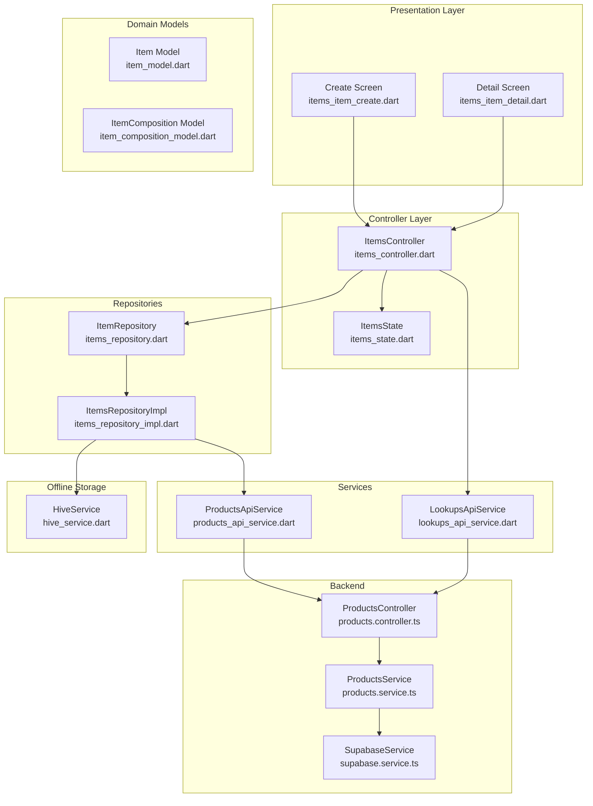

**Diagram sources**
- [items_item_create.dart](file://lib/modules/items/presentation/items_item_create.dart#L44-L544)
- [items_item_detail.dart](file://lib/modules/items/presentation/items_item_detail.dart#L46-L346)
- [items_controller.dart](file://lib/modules/items/controller/items_controller.dart#L16-L568)
- [items_state.dart](file://lib/modules/items/controller/items_state.dart)
- [item_model.dart](file://lib/modules/items/models/item_model.dart#L4-L461)
- [item_composition_model.dart](file://lib/modules/items/models/item_composition_model.dart#L3-L51)
- [items_repository.dart](file://lib/modules/items/repositories/items_repository.dart#L3-L53)
- [items_repository_impl.dart](file://lib/modules/items/repositories/items_repository_impl.dart#L14-L297)
- [products_api_service.dart](file://lib/modules/items/services/products_api_service.dart#L7-L208)
- [lookups_api_service.dart](file://lib/modules/items/services/lookups_api_service.dart#L7-L363)
- [products.controller.ts](file://backend/src/products/products.controller.ts#L19-L250)
- [products.service.ts](file://backend/src/products/products.service.ts#L8-L723)
- [supabase.service.ts](file://backend/src/supabase/supabase.service.ts#L6-L32)
- [hive_service.dart](file://lib/shared/services/hive_service.dart#L6-L134)

**Section sources**
- [items_item_create.dart](file://lib/modules/items/presentation/items_item_create.dart#L44-L544)
- [items_item_detail.dart](file://lib/modules/items/presentation/items_item_detail.dart#L46-L346)
- [items_controller.dart](file://lib/modules/items/controller/items_controller.dart#L16-L568)
- [items_repository_impl.dart](file://lib/modules/items/repositories/items_repository_impl.dart#L14-L297)
- [products_api_service.dart](file://lib/modules/items/services/products_api_service.dart#L7-L208)
- [lookups_api_service.dart](file://lib/modules/items/services/lookups_api_service.dart#L7-L363)
- [products.controller.ts](file://backend/src/products/products.controller.ts#L19-L250)
- [products.service.ts](file://backend/src/products/products.service.ts#L8-L723)
- [supabase.service.ts](file://backend/src/supabase/supabase.service.ts#L6-L32)
- [hive_service.dart](file://lib/shared/services/hive_service.dart#L6-L134)

## Core Components
- ItemsController: Orchestrates product CRUD, loads lookup data, validates items, and exposes helpers for lookup sync and usage checks.
- ItemsState: Immutable state container for items, loading flags, errors, and lookup lists.
- Item model: Comprehensive product entity supporting sales/purchase pricing, taxes, inventory flags, composition, and metadata.
- ItemComposition model: Child table for product composition (content, strength, unit, schedule).
- Repository pattern: Abstraction over data access with online-first fallback to Hive.
- API services: ProductsApiService and LookupsApiService encapsulate HTTP calls and error formatting.
- Backend integration: NestJS controllers expose endpoints for products and lookups; ProductsService integrates with Supabase.

**Section sources**
- [items_controller.dart](file://lib/modules/items/controller/items_controller.dart#L16-L568)
- [items_state.dart](file://lib/modules/items/controller/items_state.dart)
- [item_model.dart](file://lib/modules/items/models/item_model.dart#L4-L461)
- [item_composition_model.dart](file://lib/modules/items/models/item_composition_model.dart#L3-L51)
- [items_repository.dart](file://lib/modules/items/repositories/items_repository.dart#L3-L53)
- [items_repository_impl.dart](file://lib/modules/items/repositories/items_repository_impl.dart#L14-L297)
- [products_api_service.dart](file://lib/modules/items/services/products_api_service.dart#L7-L208)
- [lookups_api_service.dart](file://lib/modules/items/services/lookups_api_service.dart#L7-L363)

## Architecture Overview
The system follows an online-first architecture:
- UI triggers actions via ItemsController.
- ItemsController delegates to ItemRepository.
- ItemsRepositoryImpl calls ProductsApiService for network operations and caches results to Hive.
- Backend is a NestJS service using Supabase for database operations and lookups.

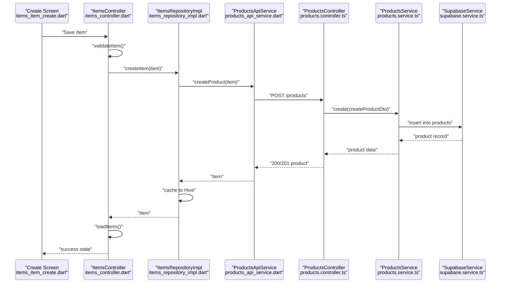

**Diagram sources**
- [items_item_create.dart](file://lib/modules/items/presentation/items_item_create.dart#L449-L451)
- [items_controller.dart](file://lib/modules/items/controller/items_controller.dart#L232-L288)
- [items_repository_impl.dart](file://lib/modules/items/repositories/items_repository_impl.dart#L166-L197)
- [products_api_service.dart](file://lib/modules/items/services/products_api_service.dart#L80-L101)
- [products.controller.ts](file://backend/src/products/products.controller.ts#L227-L233)
- [products.service.ts](file://backend/src/products/products.service.ts#L18-L89)
- [supabase.service.ts](file://backend/src/supabase/supabase.service.ts#L28-L30)

## Detailed Component Analysis

### Multi-Tab Interface: Composition, Formulation, Sales, Purchase
- Composition tab: Manages associated ingredients via ItemComposition entries.
- Formulation tab: Captures dimensions, weight, manufacturer/brand identifiers, GTINs (UPC/EAN/ISBN/MPN).
- Sales tab: Selling price, MRP, PTR, sales account, currency, and sales description.
- Purchase tab: Cost price, preferred vendor, purchase account, currency, and purchase description.

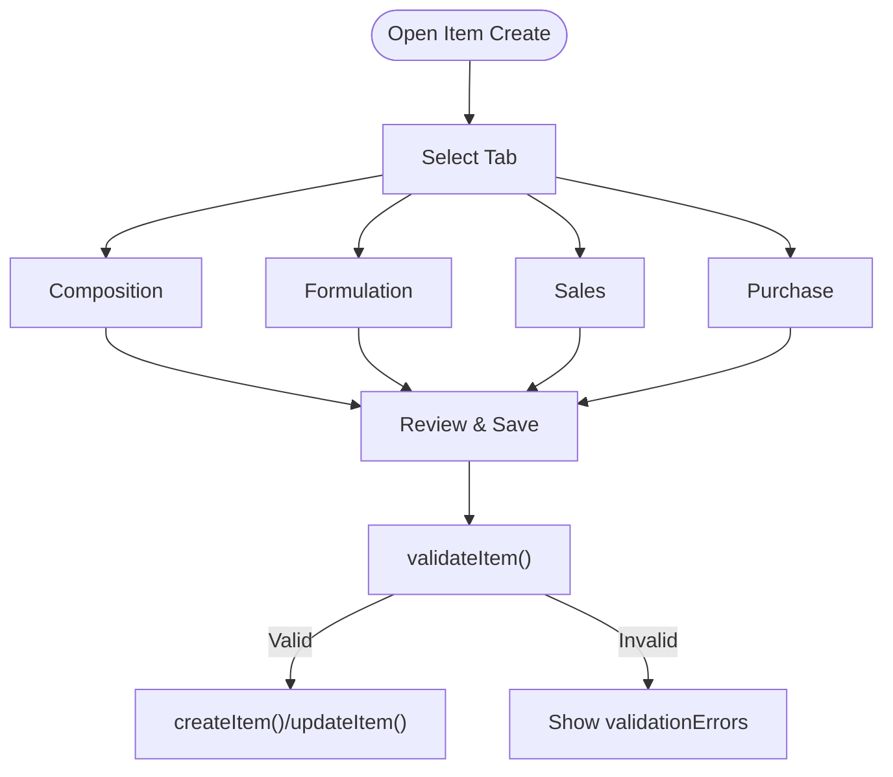

**Diagram sources**
- [items_item_create.dart](file://lib/modules/items/presentation/items_item_create.dart#L32-L36)
- [items_item_create.dart](file://lib/modules/items/presentation/items_item_create.dart#L262-L272)
- [items_controller.dart](file://lib/modules/items/controller/items_controller.dart#L186-L230)
- [items_controller.dart](file://lib/modules/items/controller/items_controller.dart#L232-L346)

**Section sources**
- [items_item_create.dart](file://lib/modules/items/presentation/items_item_create.dart#L32-L36)
- [items_item_create.dart](file://lib/modules/items/presentation/items_item_create.dart#L262-L272)
- [items_controller.dart](file://lib/modules/items/controller/items_controller.dart#L186-L230)
- [items_controller.dart](file://lib/modules/items/controller/items_controller.dart#L232-L346)

### Inventory Tracking Modes
Supported tracking modes:
- None: Standard inventory without batch/serial tracking.
- Serial Numbers: Track individual serial-numbered items.
- Batches: Track items by batch with expiry and lot controls.

UI flags map to backend columns:
- isTrackInventory
- trackBinLocation
- trackBatches
- trackSerialNumber
- inventoryAccountId
- inventoryValuationMethod
- storageId
- rackId
- reorderPoint
- reorderTermId

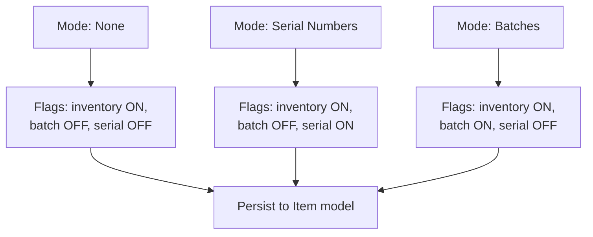

**Diagram sources**
- [items_item_create.dart](file://lib/modules/items/presentation/items_item_create.dart#L235-L244)
- [item_model.dart](file://lib/modules/items/models/item_model.dart#L76-L85)

**Section sources**
- [items_item_create.dart](file://lib/modules/items/presentation/items_item_create.dart#L235-L244)
- [item_model.dart](file://lib/modules/items/models/item_model.dart#L76-L85)

### Pricing Configurations and Multi-Currency Support
- Sales pricing: sellingPrice, sellingPriceCurrency, optional MRP/PTR.
- Purchase pricing: costPrice, costPriceCurrency, preferredVendorId, purchaseAccountId.
- Multi-currency: separate currency fields per pricing channel.

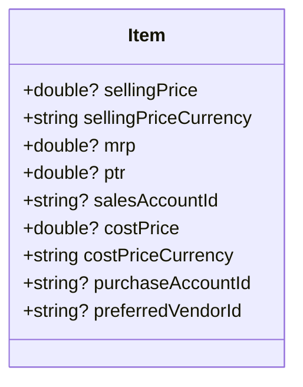

**Diagram sources**
- [item_model.dart](file://lib/modules/items/models/item_model.dart#L34-L48)

**Section sources**
- [item_model.dart](file://lib/modules/items/models/item_model.dart#L34-L48)

### Taxation Settings
- Tax preference: taxable, exempt, non-taxable.
- Intra-state and inter-state tax rates via tax rate lookups.
- HSN code support for tax classification.

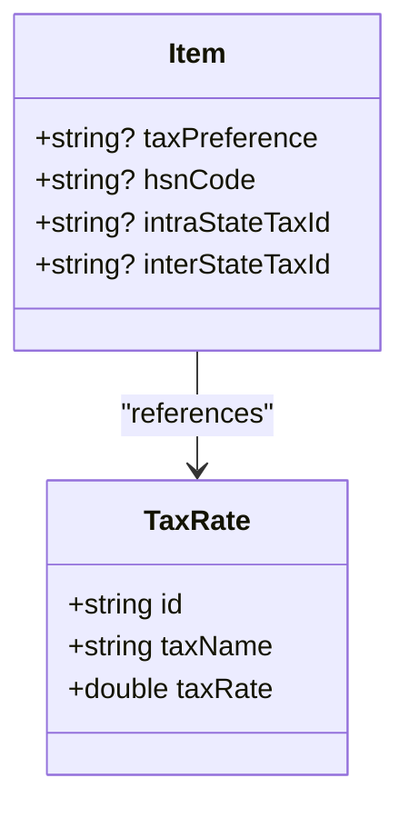

**Diagram sources**
- [item_model.dart](file://lib/modules/items/models/item_model.dart#L21-L25)
- [lookups_api_service.dart](file://lib/modules/items/services/lookups_api_service.dart#L112-L126)

**Section sources**
- [item_model.dart](file://lib/modules/items/models/item_model.dart#L21-L25)
- [lookups_api_service.dart](file://lib/modules/items/services/lookups_api_service.dart#L112-L126)

### Product Composition for Manufacturing
- trackAssocIngredients toggles composition capture.
- ItemComposition includes contentId, strengthId, contentUnitId, scheduleId.
- Backend persists compositions into product_compositions with display_order.

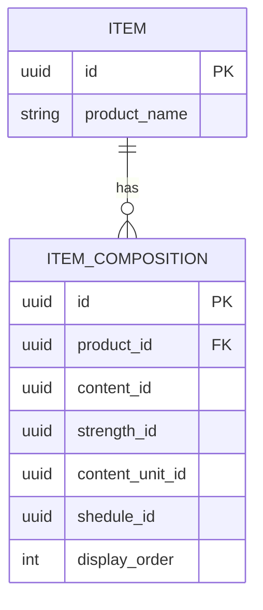

**Diagram sources**
- [item_model.dart](file://lib/modules/items/models/item_model.dart#L96-L97)
- [item_composition_model.dart](file://lib/modules/items/models/item_composition_model.dart#L3-L51)
- [products.service.ts](file://backend/src/products/products.service.ts#L53-L86)

**Section sources**
- [item_model.dart](file://lib/modules/items/models/item_model.dart#L96-L97)
- [item_composition_model.dart](file://lib/modules/items/models/item_composition_model.dart#L3-L51)
- [products.service.ts](file://backend/src/products/products.service.ts#L53-L86)

### Product Catalog View, Search, and Filters
- Catalog rendered via report/table components in presentation.
- Filtering and sorting enums exist in the detail screen for advanced views.
- Import/export dialogs are integrated for bulk operations.

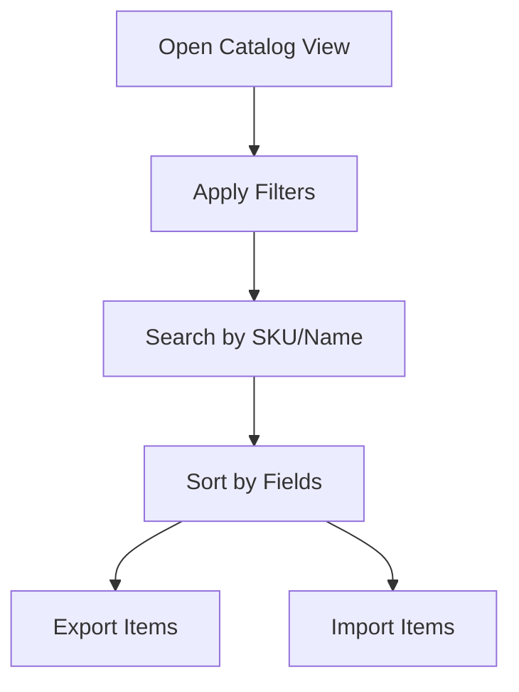

**Diagram sources**
- [items_item_detail.dart](file://lib/modules/items/presentation/items_item_detail.dart#L24-L42)
- [items_item_detail.dart](file://lib/modules/items/presentation/items_item_detail.dart#L10-L14)

**Section sources**
- [items_item_detail.dart](file://lib/modules/items/presentation/items_item_detail.dart#L24-L42)
- [items_item_detail.dart](file://lib/modules/items/presentation/items_item_detail.dart#L10-L14)

### Backend Integration with Supabase
- ProductsController exposes CRUD and lookup endpoints.
- ProductsService performs inserts/updates, composes payloads, and handles compositions.
- SupabaseService initializes the Supabase client with environment credentials.

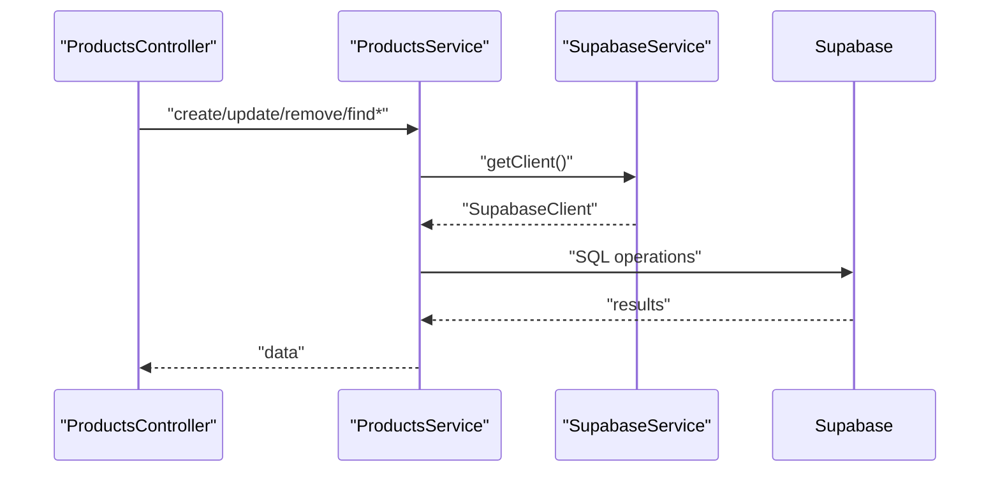

**Diagram sources**
- [products.controller.ts](file://backend/src/products/products.controller.ts#L19-L250)
- [products.service.ts](file://backend/src/products/products.service.ts#L8-L723)
- [supabase.service.ts](file://backend/src/supabase/supabase.service.ts#L6-L32)

**Section sources**
- [products.controller.ts](file://backend/src/products/products.controller.ts#L19-L250)
- [products.service.ts](file://backend/src/products/products.service.ts#L8-L723)
- [supabase.service.ts](file://backend/src/supabase/supabase.service.ts#L6-L32)

### Riverpod State Management and API Integration Patterns
- ItemsController extends StateNotifier<ItemsState>, holding items, loading flags, errors, and lookup lists.
- ItemsController.loadItems() fetches from repository and updates state.
- ItemsController.validateItem() enforces required fields and numeric constraints.
- ProductsApiService wraps ApiClient and formats Dio errors into user-friendly messages.
- ItemsRepositoryImpl implements online-first fallback: tries API, caches to Hive, falls back to cache on failure.

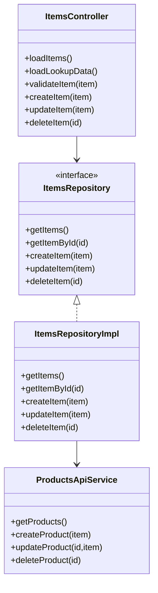

**Diagram sources**
- [items_controller.dart](file://lib/modules/items/controller/items_controller.dart#L16-L568)
- [items_repository.dart](file://lib/modules/items/repositories/items_repository.dart#L3-L9)
- [items_repository_impl.dart](file://lib/modules/items/repositories/items_repository_impl.dart#L14-L297)
- [products_api_service.dart](file://lib/modules/items/services/products_api_service.dart#L7-L208)

**Section sources**
- [items_controller.dart](file://lib/modules/items/controller/items_controller.dart#L16-L568)
- [items_repository.dart](file://lib/modules/items/repositories/items_repository.dart#L3-L9)
- [items_repository_impl.dart](file://lib/modules/items/repositories/items_repository_impl.dart#L14-L297)
- [products_api_service.dart](file://lib/modules/items/services/products_api_service.dart#L7-L208)

### Offline Storage with Hive
- HiveService centralizes caching for products, customers, POS drafts, and config.
- ItemsRepositoryImpl saves fetched data to Hive and updates last sync timestamps.
- On API failures, repository returns cached data and logs warnings.

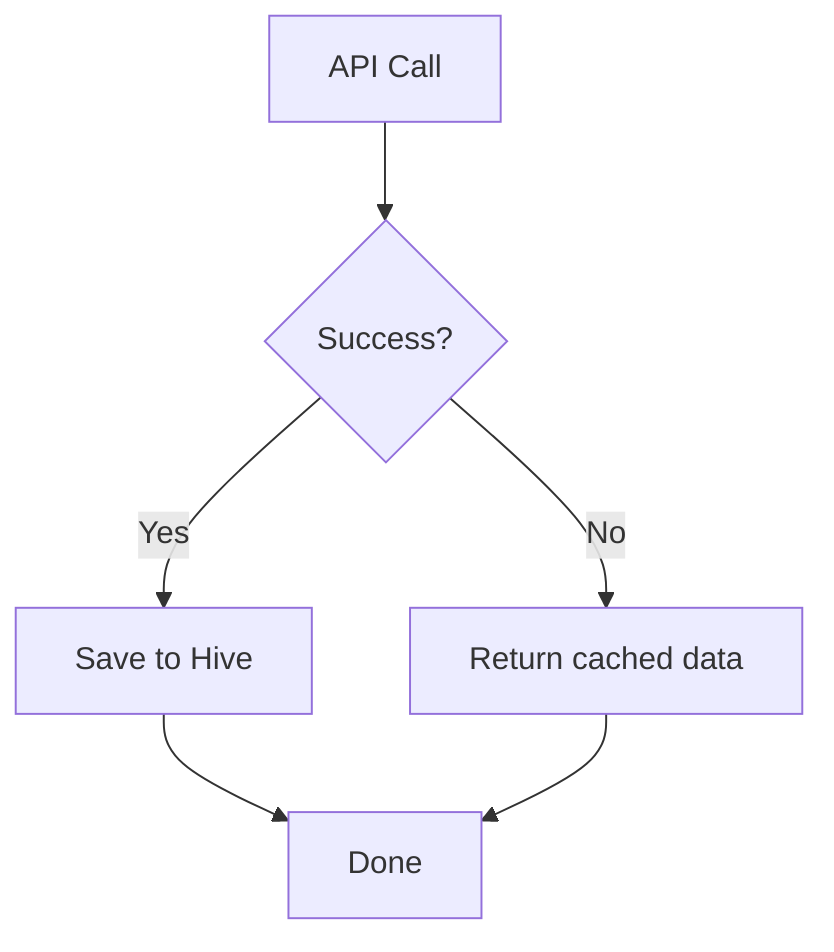

**Diagram sources**
- [items_repository_impl.dart](file://lib/modules/items/repositories/items_repository_impl.dart#L25-L83)
- [hive_service.dart](file://lib/shared/services/hive_service.dart#L19-L45)

**Section sources**
- [items_repository_impl.dart](file://lib/modules/items/repositories/items_repository_impl.dart#L25-L83)
- [hive_service.dart](file://lib/shared/services/hive_service.dart#L19-L45)

### Practical Workflows

#### Product Creation Workflow
- Fill tabs: Composition, Formulation, Sales, Purchase.
- Select inventory tracking mode (none/serial/batch).
- Click Save; validation runs; on success, repository caches and reloads items.

**Section sources**
- [items_item_create.dart](file://lib/modules/items/presentation/items_item_create.dart#L449-L524)
- [items_controller.dart](file://lib/modules/items/controller/items_controller.dart#L232-L288)
- [items_repository_impl.dart](file://lib/modules/items/repositories/items_repository_impl.dart#L166-L197)

#### Batch Management Scenario
- Enable batch tracking in inventory flags.
- On receipt, create opening stock entries per batch with expiry dates.
- Track movements by batch in warehouse view.

**Section sources**
- [items_item_create.dart](file://lib/modules/items/presentation/items_item_create.dart#L276-L279)
- [item_model.dart](file://lib/modules/items/models/item_model.dart#L76-L85)

#### Inventory Adjustment Processes
- Use reorder point updates via controller helper.
- Adjust stock via warehouse tab and transaction history.

**Section sources**
- [items_controller.dart](file://lib/modules/items/controller/items_controller.dart#L513-L560)
- [items_item_detail.dart](file://lib/modules/items/presentation/items_item_detail.dart#L67-L73)

## Dependency Analysis
- UI depends on ItemsController provider.
- ItemsController depends on ItemRepository and LookupsApiService.
- ItemsRepositoryImpl depends on ProductsApiService and HiveService.
- Backend controllers depend on ProductsService; ProductsService depends on SupabaseService.

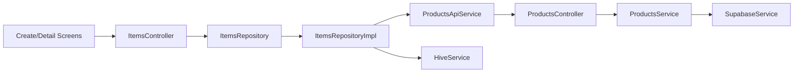

**Diagram sources**
- [items_item_create.dart](file://lib/modules/items/presentation/items_item_create.dart#L248-L249)
- [items_controller.dart](file://lib/modules/items/controller/items_controller.dart#L16-L23)
- [items_repository_impl.dart](file://lib/modules/items/repositories/items_repository_impl.dart#L14-L22)
- [products_api_service.dart](file://lib/modules/items/services/products_api_service.dart#L7-L8)
- [products.controller.ts](file://backend/src/products/products.controller.ts#L19-L21)
- [products.service.ts](file://backend/src/products/products.service.ts#L8-L9)
- [supabase.service.ts](file://backend/src/supabase/supabase.service.ts#L6-L31)

**Section sources**
- [items_item_create.dart](file://lib/modules/items/presentation/items_item_create.dart#L248-L249)
- [items_controller.dart](file://lib/modules/items/controller/items_controller.dart#L16-L23)
- [items_repository_impl.dart](file://lib/modules/items/repositories/items_repository_impl.dart#L14-L22)
- [products_api_service.dart](file://lib/modules/items/services/products_api_service.dart#L7-L8)
- [products.controller.ts](file://backend/src/products/products.controller.ts#L19-L21)
- [products.service.ts](file://backend/src/products/products.service.ts#L8-L9)
- [supabase.service.ts](file://backend/src/supabase/supabase.service.ts#L6-L31)

## Performance Considerations
- Parallel lookup loading in ItemsController improves initial load performance.
- Online-first caching reduces latency and enables offline usability.
- Use of Stopwatch and AppLogger helps measure and monitor performance.

**Section sources**
- [items_controller.dart](file://lib/modules/items/controller/items_controller.dart#L66-L184)
- [items_repository_impl.dart](file://lib/modules/items/repositories/items_repository_impl.dart#L25-L83)

## Troubleshooting Guide
Common issues and remedies:
- Validation errors: Inspect validationErrors returned by ItemsController and surface user-friendly messages.
- Network/API errors: ProductsApiService formats Dio exceptions; check formatted messages for field-level constraints.
- Usage conflicts: Use checkLookupUsage to detect dependencies before deletions.
- Offline fallback: If API fails, repository returns cached data; verify HiveService cache presence.

**Section sources**
- [items_controller.dart](file://lib/modules/items/controller/items_controller.dart#L264-L287)
- [products_api_service.dart](file://lib/modules/items/services/products_api_service.dart#L10-L49)
- [items_controller.dart](file://lib/modules/items/controller/items_controller.dart#L404-L422)
- [items_repository_impl.dart](file://lib/modules/items/repositories/items_repository_impl.dart#L57-L82)

## Conclusion
The Items/Products module provides a robust, scalable solution for product management with a modern UI, comprehensive validation, flexible inventory tracking, and resilient offline support. Its integration with Supabase ensures real-time synchronization while maintaining reliability through Hive caching.

## Appendices

### Data Validation Rules
- Required fields enforced server-side via DTOs and validated client-side by ItemsController.
- Numeric fields validated for positivity where applicable.
- Inventory valuation method required when inventory tracking is enabled.

**Section sources**
- [items_controller.dart](file://lib/modules/items/controller/items_controller.dart#L186-L230)
- [products.controller.ts](file://backend/src/products/products.controller.ts#L227-L233)