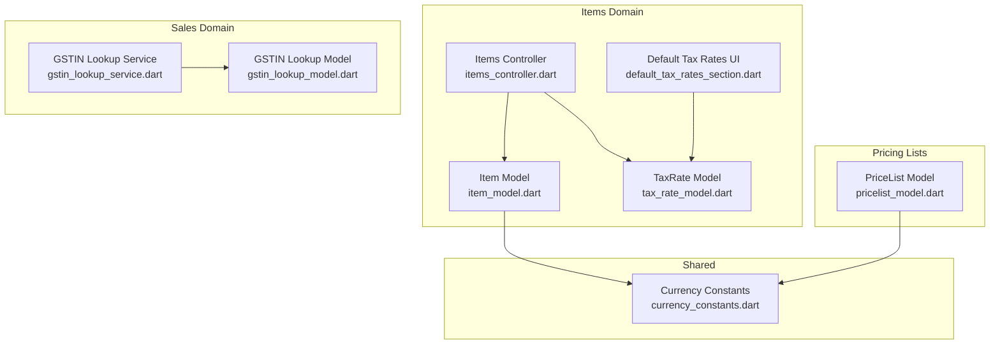
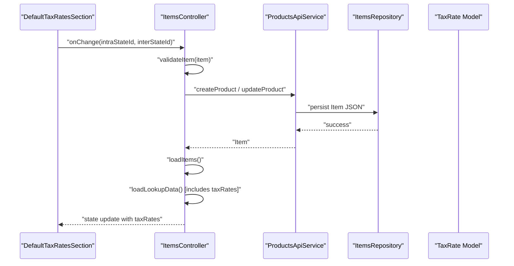
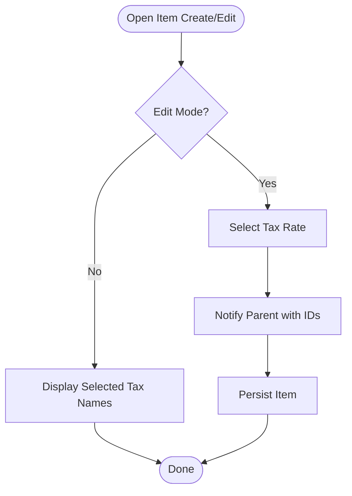
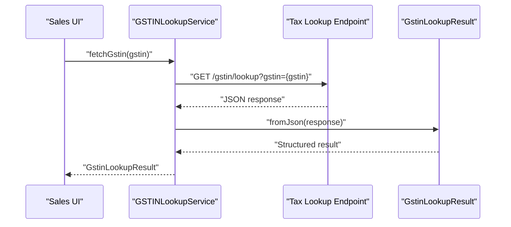
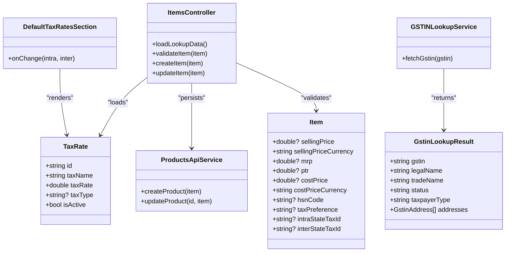

# Pricing & Taxation Configuration

<cite>
**Referenced Files in This Document**
- [tax_rate_model.dart](file://lib/modules/items/models/tax_rate_model.dart)
- [default_tax_rates_section.dart](file://lib/modules/items/presentation/sections/default_tax_rates_section.dart)
- [item_model.dart](file://lib/modules/items/models/item_model.dart)
- [items_controller.dart](file://lib/modules/items/controller/items_controller.dart)
- [products_api_service.dart](file://lib/modules/items/services/products_api_service.dart)
- [currency_constants.dart](file://lib/shared/constants/currency_constants.dart)
- [gstin_lookup_model.dart](file://lib/modules/sales/models/gstin_lookup_model.dart)
- [gstin_lookup_service.dart](file://lib/modules/sales/services/gstin_lookup_service.dart)
- [pricelist_model.dart](file://lib/modules/pricelist/models/pricelist_model.dart)
</cite>

## Table of Contents
1. [Introduction](#introduction)
2. [Project Structure](#project-structure)
3. [Core Components](#core-components)
4. [Architecture Overview](#architecture-overview)
5. [Detailed Component Analysis](#detailed-component-analysis)
6. [Dependency Analysis](#dependency-analysis)
7. [Performance Considerations](#performance-considerations)
8. [Troubleshooting Guide](#troubleshooting-guide)
9. [Conclusion](#conclusion)
10. [Appendices](#appendices)

## Introduction
This document describes the pricing and taxation configuration system in the Zerpai ERP project. It covers:
- Multi-tier pricing structure: selling price, MRP, PTR, and cost price management
- Tax preference options and HSN/SAC code integration
- Default tax rates configuration and state-specific tax selection
- Currency support, exchange rate handling, and multi-currency pricing
- Tax rule engine foundations, GST compliance features, and automated tax calculation workflows
- Practical examples, configuration scenarios, and compliance reporting requirements
- Integration with tax lookup services and real-time tax rate updates

## Project Structure
The pricing and taxation system spans frontend models, UI sections, controllers, services, and shared constants. The most relevant areas are:
- Items domain: item model, tax rate model, default tax rates UI section, and items controller
- Sales domain: GSTIN lookup model and service
- Shared domain: currency constants
- Pricing lists: pricing scheme and round-off preferences

**Diagram sources**
- [item_model.dart](file://lib/modules/items/models/item_model.dart#L1-L461)
- [tax_rate_model.dart](file://lib/modules/items/models/tax_rate_model.dart#L1-L38)
- [default_tax_rates_section.dart](file://lib/modules/items/presentation/sections/default_tax_rates_section.dart#L1-L225)
- [items_controller.dart](file://lib/modules/items/controller/items_controller.dart#L1-L568)
- [gstin_lookup_model.dart](file://lib/modules/sales/models/gstin_lookup_model.dart#L1-L173)
- [gstin_lookup_service.dart](file://lib/modules/sales/services/gstin_lookup_service.dart#L1-L28)
- [currency_constants.dart](file://lib/shared/constants/currency_constants.dart#L1-L800)
- [pricelist_model.dart](file://lib/modules/pricelist/models/pricelist_model.dart#L1-L150)

**Section sources**
- [item_model.dart](file://lib/modules/items/models/item_model.dart#L1-L461)
- [tax_rate_model.dart](file://lib/modules/items/models/tax_rate_model.dart#L1-L38)
- [default_tax_rates_section.dart](file://lib/modules/items/presentation/sections/default_tax_rates_section.dart#L1-L225)
- [items_controller.dart](file://lib/modules/items/controller/items_controller.dart#L1-L568)
- [gstin_lookup_model.dart](file://lib/modules/sales/models/gstin_lookup_model.dart#L1-L173)
- [gstin_lookup_service.dart](file://lib/modules/sales/services/gstin_lookup_service.dart#L1-L28)
- [currency_constants.dart](file://lib/shared/constants/currency_constants.dart#L1-L800)
- [pricelist_model.dart](file://lib/modules/pricelist/models/pricelist_model.dart#L1-L150)

## Core Components
- Item model encapsulates pricing fields (selling price, MRP, PTR, cost price) and currency fields, along with tax-related attributes (HSN/SAC, tax preference, intra-state/inter-state tax IDs).
- TaxRate model defines tax identifiers, names, rates, types (e.g., IGST, CGST, SGST), and activation status.
- DefaultTaxRatesSection UI allows selecting default intra-state and inter-state tax rates for items.
- ItemsController orchestrates loading lookup data (including tax rates), validation, and persistence via ProductsApiService.
- GSTINLookupModel and GSTINLookupService support GST registration number verification and address resolution.
- Currency constants define supported currencies, symbols, decimal places, and formatting.
- PriceList model supports pricing schemes (unit pricing, volume pricing, markup, markdown, per-item rate) and round-off preferences.

**Section sources**
- [item_model.dart](file://lib/modules/items/models/item_model.dart#L21-L48)
- [tax_rate_model.dart](file://lib/modules/items/models/tax_rate_model.dart#L3-L16)
- [default_tax_rates_section.dart](file://lib/modules/items/presentation/sections/default_tax_rates_section.dart#L5-L22)
- [items_controller.dart](file://lib/modules/items/controller/items_controller.dart#L66-L184)
- [gstin_lookup_model.dart](file://lib/modules/sales/models/gstin_lookup_model.dart#L1-L173)
- [gstin_lookup_service.dart](file://lib/modules/sales/services/gstin_lookup_service.dart#L1-L28)
- [currency_constants.dart](file://lib/shared/constants/currency_constants.dart#L4-L18)
- [pricelist_model.dart](file://lib/modules/pricelist/models/pricelist_model.dart#L6-L50)

## Architecture Overview
The system integrates UI, models, services, and APIs to configure pricing and taxes. The ItemsController loads tax rates and other lookups, exposes validation and persistence, and feeds UI sections. GSTIN lookup complements tax configuration for GST-compliant transactions.

**Diagram sources**
- [default_tax_rates_section.dart](file://lib/modules/items/presentation/sections/default_tax_rates_section.dart#L47-L123)
- [items_controller.dart](file://lib/modules/items/controller/items_controller.dart#L186-L230)
- [products_api_service.dart](file://lib/modules/items/services/products_api_service.dart#L80-L124)
- [tax_rate_model.dart](file://lib/modules/items/models/tax_rate_model.dart#L18-L36)

## Detailed Component Analysis

### Multi-Tier Pricing Structure
- Selling price, MRP, PTR, and cost price are stored as numeric fields with dedicated currency fields per tier.
- Validation enforces non-negative values for selling price and MRP.
- Currency defaults to INR and can be overridden per tier.

Implementation highlights:
- Pricing fields and currencies in the Item model
- Validation rules for selling price and MRP
- Persistence via ProductsApiService

Practical implications:
- Enable multi-currency pricing by setting per-tier currency codes.
- Use validation feedback to prevent invalid pricing entries.

**Section sources**
- [item_model.dart](file://lib/modules/items/models/item_model.dart#L34-L48)
- [items_controller.dart](file://lib/modules/items/controller/items_controller.dart#L213-L229)
- [products_api_service.dart](file://lib/modules/items/services/products_api_service.dart#L80-L124)

### Tax Preference Options and HSN/SAC Integration
- Tax preference supports taxable, non-taxable, and exempt configurations.
- HSN/SAC codes are stored as free-form strings for goods and services classification.
- Tax rates are selected by intra-state and inter-state identifiers on items.

UI and model linkage:
- DefaultTaxRatesSection displays and edits intra-state and inter-state tax selections.
- ItemsController loads tax rates from lookups and passes them to the UI.

**Section sources**
- [item_model.dart](file://lib/modules/items/models/item_model.dart#L22-L25)
- [default_tax_rates_section.dart](file://lib/modules/items/presentation/sections/default_tax_rates_section.dart#L105-L123)
- [items_controller.dart](file://lib/modules/items/controller/items_controller.dart#L66-L184)

### Default Tax Rates Configuration and State-Specific Selection
- DefaultTaxRatesSection toggles edit mode and renders a responsive row for intra-state and inter-state tax selections.
- The parent component receives onChange callbacks with updated IDs.
- ItemsController loads tax rates from the lookups service and populates the UI.

**Diagram sources**
- [default_tax_rates_section.dart](file://lib/modules/items/presentation/sections/default_tax_rates_section.dart#L24-L123)
- [items_controller.dart](file://lib/modules/items/controller/items_controller.dart#L66-L184)

**Section sources**
- [default_tax_rates_section.dart](file://lib/modules/items/presentation/sections/default_tax_rates_section.dart#L24-L123)
- [items_controller.dart](file://lib/modules/items/controller/items_controller.dart#L66-L184)

### Tax Rule Engine and Automated Tax Calculation Workflows
- TaxRate model supports tax types (e.g., IGST, CGST, SGST) and numeric rates.
- ItemsController loads tax rates and makes them available to UI sections.
- The system is structured to support state-specific tax selection via intra-state and inter-state IDs.

Note: The current codebase provides foundational models and UI for tax configuration. Automated tax calculation workflows and state-specific logic would be implemented by extending the existing models and controllers with calculation routines and state-aware selection logic.

**Section sources**
- [tax_rate_model.dart](file://lib/modules/items/models/tax_rate_model.dart#L3-L16)
- [items_controller.dart](file://lib/modules/items/controller/items_controller.dart#L66-L184)

### GST Compliance Features and GSTIN Lookup Integration
- GSTINLookupModel normalizes GSTIN, legal name, trade name, status, taxpayer type, and addresses from diverse API response shapes.
- GSTINLookupService performs a GET request to a tax lookup endpoint and returns a strongly typed result.
- This enables GST-compliant customer identification and address validation during sales.

**Diagram sources**
- [gstin_lookup_service.dart](file://lib/modules/sales/services/gstin_lookup_service.dart#L7-L26)
- [gstin_lookup_model.dart](file://lib/modules/sales/models/gstin_lookup_model.dart#L18-L104)

**Section sources**
- [gstin_lookup_model.dart](file://lib/modules/sales/models/gstin_lookup_model.dart#L1-L173)
- [gstin_lookup_service.dart](file://lib/modules/sales/services/gstin_lookup_service.dart#L1-L28)

### Currency Support, Exchange Rate Handling, and Multi-Currency Pricing
- Currency constants define supported currencies, symbols, decimals, and formatting.
- Item model includes separate currency fields for selling price and cost price.
- PriceList model supports a currency field and pricing schemes with round-off preferences.

Guidance:
- Use currency codes from CurrencyOption to set per-tier currency.
- For exchange rate handling, extend the pricing pipeline to convert amounts at order time using external exchange rate services and store base currency totals alongside tiered currency values.

**Section sources**
- [currency_constants.dart](file://lib/shared/constants/currency_constants.dart#L20-L800)
- [item_model.dart](file://lib/modules/items/models/item_model.dart#L35-L45)
- [pricelist_model.dart](file://lib/modules/pricelist/models/pricelist_model.dart#L18-L28)

### Practical Examples and Scenarios
- Example 1: Multi-currency product
  - Set sellingPriceCurrency to USD and costPriceCurrency to INR.
  - Configure default tax rates for intra-state and inter-state as applicable.
  - Use GSTIN lookup for customer GSTIN verification before invoicing.
- Example 2: Volume pricing with rounding
  - Create a PriceList with pricingScheme set to volume pricing and roundOffPreference to whole number.
  - Apply the price list to items and validate pricing tiers.
- Example 3: Markup-based pricing
  - Create a PriceList with pricingScheme set to markup and details indicating percentage.
  - Apply to items to compute selling price from cost price with rounding preferences.

[No sources needed since this section provides practical examples without analyzing specific files]

## Dependency Analysis
The following diagram shows key dependencies among components involved in pricing and taxation.

**Diagram sources**
- [item_model.dart](file://lib/modules/items/models/item_model.dart#L34-L48)
- [tax_rate_model.dart](file://lib/modules/items/models/tax_rate_model.dart#L3-L16)
- [default_tax_rates_section.dart](file://lib/modules/items/presentation/sections/default_tax_rates_section.dart#L5-L22)
- [items_controller.dart](file://lib/modules/items/controller/items_controller.dart#L66-L184)
- [products_api_service.dart](file://lib/modules/items/services/products_api_service.dart#L80-L124)
- [gstin_lookup_model.dart](file://lib/modules/sales/models/gstin_lookup_model.dart#L1-L173)
- [gstin_lookup_service.dart](file://lib/modules/sales/services/gstin_lookup_service.dart#L1-L28)

**Section sources**
- [items_controller.dart](file://lib/modules/items/controller/items_controller.dart#L66-L184)
- [products_api_service.dart](file://lib/modules/items/services/products_api_service.dart#L80-L124)
- [gstin_lookup_service.dart](file://lib/modules/sales/services/gstin_lookup_service.dart#L1-L28)

## Performance Considerations
- Parallel lookup loading: ItemsController loads multiple lookup sets concurrently to reduce latency.
- Validation pre-save: validateItem prevents invalid submissions and reduces server-side failures.
- UI responsiveness: DefaultTaxRatesSection switches between view and edit modes efficiently.

Recommendations:
- Cache frequently accessed tax rates and lookup data locally.
- Debounce user input in pricing fields to minimize unnecessary validations.
- Batch updates for large item lists to reduce network overhead.

**Section sources**
- [items_controller.dart](file://lib/modules/items/controller/items_controller.dart#L71-L88)
- [items_controller.dart](file://lib/modules/items/controller/items_controller.dart#L186-L230)
- [default_tax_rates_section.dart](file://lib/modules/items/presentation/sections/default_tax_rates_section.dart#L170-L223)

## Troubleshooting Guide
Common issues and resolutions:
- Validation errors on save
  - validateItem returns field-specific messages for missing or invalid values (e.g., negative prices).
  - Clear validation errors after correcting input.
- Network failures during product creation/update
  - ProductsApiService formats DioException responses into user-friendly messages.
- GSTIN lookup failures
  - GSTINLookupService returns a structured result; handle empty or partial data gracefully in UI.

**Section sources**
- [items_controller.dart](file://lib/modules/items/controller/items_controller.dart#L186-L230)
- [products_api_service.dart](file://lib/modules/items/services/products_api_service.dart#L10-L49)
- [gstin_lookup_service.dart](file://lib/modules/sales/services/gstin_lookup_service.dart#L7-L26)

## Conclusion
The Zerpai ERP pricing and taxation configuration system provides a solid foundation for managing multi-tier pricing, tax preferences, HSN/SAC codes, and default tax rates. It integrates currency support and offers extensibility for automated tax calculation and GST compliance. By leveraging the existing models, controllers, and services, teams can implement state-specific tax logic, real-time tax updates, and robust pricing strategies tailored to regional regulations.

[No sources needed since this section summarizes without analyzing specific files]

## Appendices

### Appendix A: Pricing Scheme and Round-Off Preferences
- Pricing schemes supported by PriceList include unit pricing, volume pricing, markup, markdown, and per-item rate.
- Round-off preferences include never mind, 0.99, 0.50, whole number, and 0.25.

**Section sources**
- [pricelist_model.dart](file://lib/modules/pricelist/models/pricelist_model.dart#L98-L150)