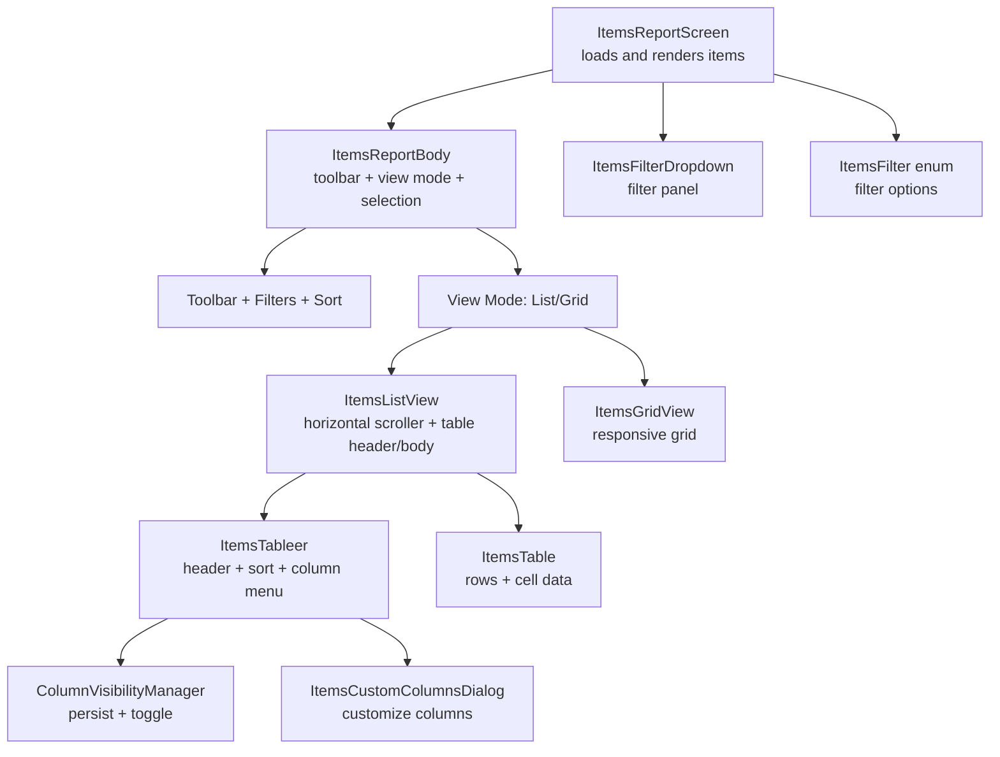
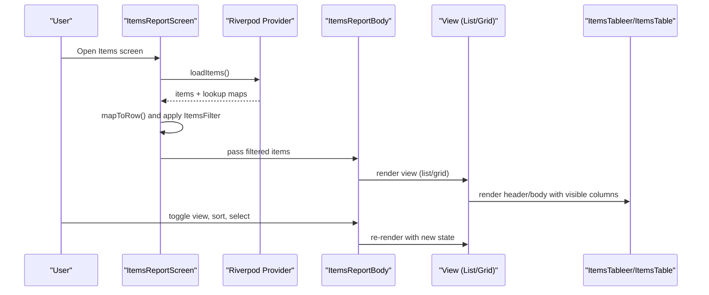
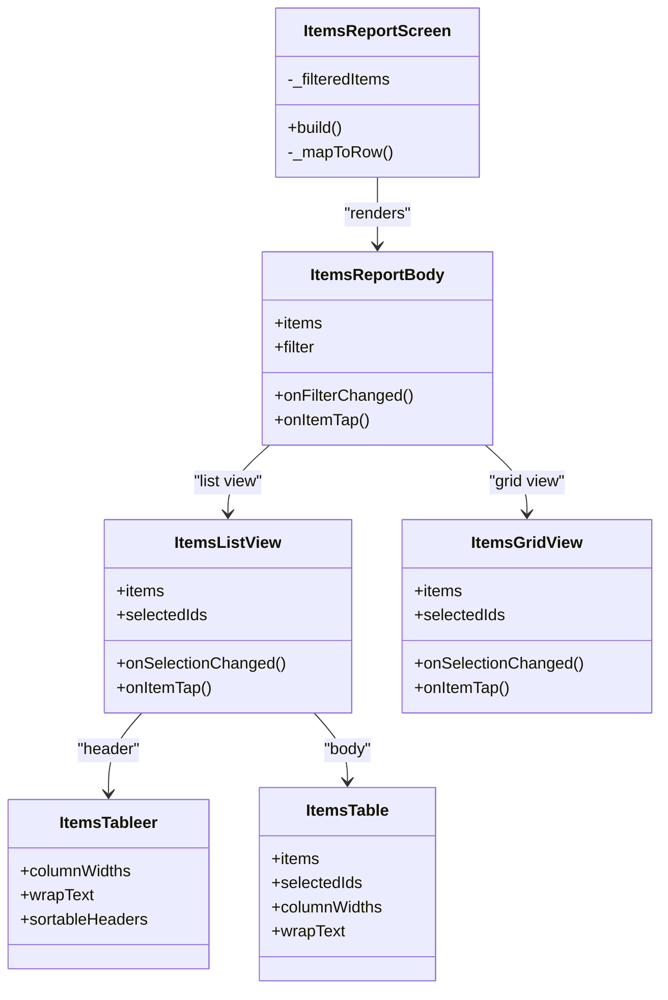
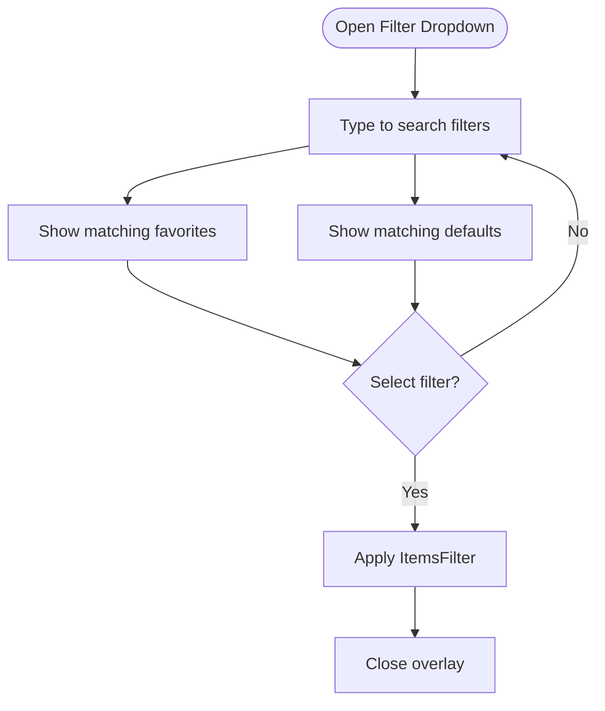
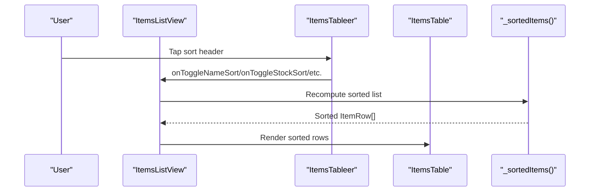
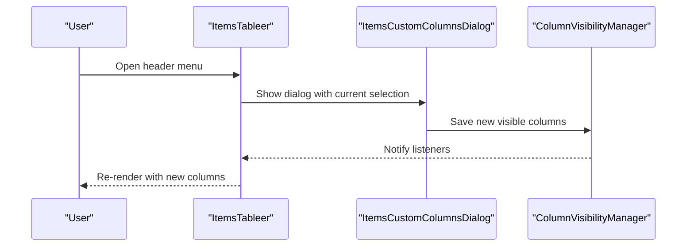
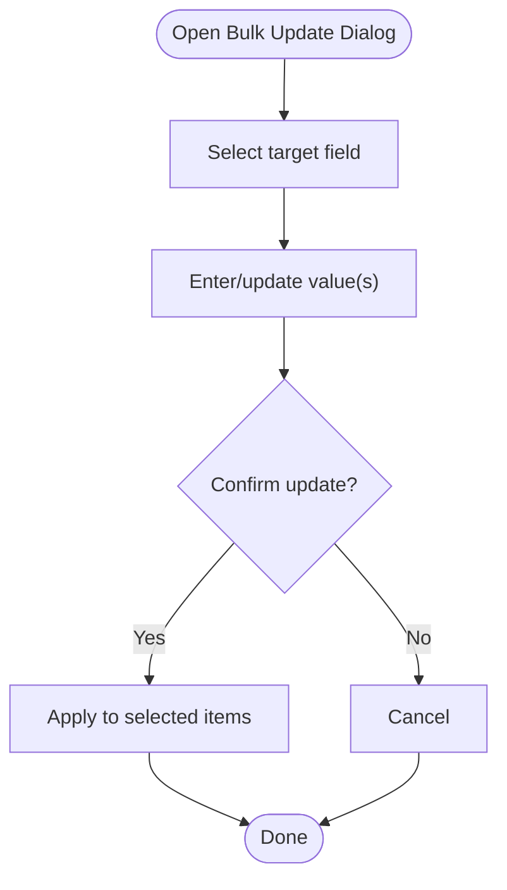
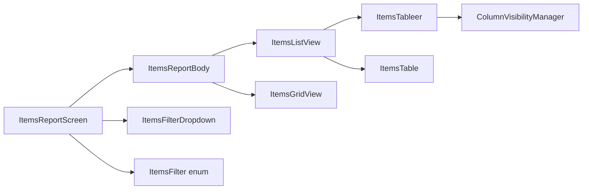

# Product Catalog & Search

<cite>
**Referenced Files in This Document**
- [items_report_screen.dart](file://lib/modules/items/presentation/sections/report/items_report_screen.dart)
- [items_report_body.dart](file://lib/modules/items/presentation/sections/report/items_report_body.dart)
- [items_table.dart](file://lib/modules/items/presentation/sections/report/items_table.dart)
- [items_list_view.dart](file://lib/modules/items/presentation/sections/report/itemslist_view.dart)
- [items_grid_view.dart](file://lib/modules/items/presentation/sections/report/itemsgrid_view.dart)
- [items_filters.dart](file://lib/modules/items/presentation/sections/report/items_filters.dart)
- [items_filter_dropdown.dart](file://lib/modules/items/presentation/sections/report/items_filter_dropdown.dart)
- [column_visibility_manager.dart](file://lib/modules/items/presentation/sections/report/column_visibility_manager.dart)
- [items_custom_columns.dart](file://lib/modules/items/presentation/sections/report/dialogs/items_custom_columns.dart)
- [bulk_update_dialog.dart](file://lib/modules/items/presentation/sections/report/dialogs/bulk_update_dialog.dart)
</cite>

## Table of Contents
1. [Introduction](#introduction)
2. [Project Structure](#project-structure)
3. [Core Components](#core-components)
4. [Architecture Overview](#architecture-overview)
5. [Detailed Component Analysis](#detailed-component-analysis)
6. [Dependency Analysis](#dependency-analysis)
7. [Performance Considerations](#performance-considerations)
8. [Troubleshooting Guide](#troubleshooting-guide)
9. [Conclusion](#conclusion)
10. [Appendices](#appendices)

## Introduction
This document explains the product catalog management and search functionality centered around the Items module. It covers product listing views (grid, table, and list), customizable columns, advanced filtering, sorting, bulk operations (mass updates, exports, imports, and bulk deletion workflows), categorization/tagging/metadata management, responsive/mobile optimization, and practical examples for search/filter/reporting. The goal is to help both technical and non-technical users understand how to browse, refine, and operate on product records efficiently.

## Project Structure
The product catalog UI is implemented under the Items module’s presentation layer. The key building blocks are:
- Report screen orchestrating data and UI
- Report body coordinating toolbar, filters, view modes, and selection
- Table/list/grid rendering engines
- Filter dropdown and filter logic
- Column visibility manager and customization dialog
- Bulk operations dialogs

**Diagram sources**
- [items_report_screen.dart](file://lib/modules/items/presentation/sections/report/items_report_screen.dart#L15-L333)
- [items_report_body.dart](file://lib/modules/items/presentation/sections/report/items_report_body.dart#L44-L187)
- [items_list_view.dart](file://lib/modules/items/presentation/sections/report/itemslist_view.dart#L7-L174)
- [items_table.dart](file://lib/modules/items/presentation/sections/report/items_table.dart#L17-L658)
- [items_grid_view.dart](file://lib/modules/items/presentation/sections/report/itemsgrid_view.dart#L5-L213)
- [items_filter_dropdown.dart](file://lib/modules/items/presentation/sections/report/items_filter_dropdown.dart#L10-L397)
- [items_filters.dart](file://lib/modules/items/presentation/sections/report/items_filters.dart#L7-L72)
- [column_visibility_manager.dart](file://lib/modules/items/presentation/sections/report/column_visibility_manager.dart#L9-L259)
- [items_custom_columns.dart](file://lib/modules/items/presentation/sections/report/dialogs/items_custom_columns.dart#L7-L216)

**Section sources**
- [items_report_screen.dart](file://lib/modules/items/presentation/sections/report/items_report_screen.dart#L15-L333)
- [items_report_body.dart](file://lib/modules/items/presentation/sections/report/items_report_body.dart#L44-L187)
- [items_list_view.dart](file://lib/modules/items/presentation/sections/report/itemslist_view.dart#L7-L174)
- [items_table.dart](file://lib/modules/items/presentation/sections/report/items_table.dart#L17-L658)
- [items_grid_view.dart](file://lib/modules/items/presentation/sections/report/itemsgrid_view.dart#L5-L213)
- [items_filter_dropdown.dart](file://lib/modules/items/presentation/sections/report/items_filter_dropdown.dart#L10-L397)
- [items_filters.dart](file://lib/modules/items/presentation/sections/report/items_filters.dart#L7-L72)
- [column_visibility_manager.dart](file://lib/modules/items/presentation/sections/report/column_visibility_manager.dart#L9-L259)
- [items_custom_columns.dart](file://lib/modules/items/presentation/sections/report/dialogs/items_custom_columns.dart#L7-L216)

## Core Components
- ItemsReportScreen: Loads items via controller provider, maps domain items to ItemRow, applies filters, and renders the report body.
- ItemsReportBody: Hosts toolbar, sorting controls, view mode toggles (list/grid), and selection state. Delegates rendering to ItemsListView or ItemsGridView.
- ItemsListView: Horizontal scrolling list view backed by a table-like header and body; supports resizable columns and text wrapping.
- ItemsGridView: Responsive grid view with adaptive column counts and per-item cards.
- ItemsTableer and ItemsTable: Dynamic column rendering, sorting indicators, and cell content based on visible columns.
- ItemsFilterDropdown and ItemsFilter: Advanced filter panel with favorites, search, and categorized filter options.
- ColumnVisibilityManager and ItemsCustomColumnsDialog: Persist and customize visible columns across sessions.
- Bulk operations: Bulk update dialog supports mass field updates; import/export dialogs are present in the report sections.

**Section sources**
- [items_report_screen.dart](file://lib/modules/items/presentation/sections/report/items_report_screen.dart#L22-L333)
- [items_report_body.dart](file://lib/modules/items/presentation/sections/report/items_report_body.dart#L44-L187)
- [items_list_view.dart](file://lib/modules/items/presentation/sections/report/itemslist_view.dart#L7-L174)
- [items_table.dart](file://lib/modules/items/presentation/sections/report/items_table.dart#L17-L658)
- [items_grid_view.dart](file://lib/modules/items/presentation/sections/report/itemsgrid_view.dart#L5-L213)
- [items_filter_dropdown.dart](file://lib/modules/items/presentation/sections/report/items_filter_dropdown.dart#L10-L397)
- [items_filters.dart](file://lib/modules/items/presentation/sections/report/items_filters.dart#L7-L72)
- [column_visibility_manager.dart](file://lib/modules/items/presentation/sections/report/column_visibility_manager.dart#L9-L259)
- [items_custom_columns.dart](file://lib/modules/items/presentation/sections/report/dialogs/items_custom_columns.dart#L7-L216)
- [bulk_update_dialog.dart](file://lib/modules/items/presentation/sections/report/dialogs/bulk_update_dialog.dart#L5-L1024)

## Architecture Overview
The report architecture follows a layered pattern:
- Presentation layer: Screens and widgets render data and collect user actions.
- State/provider layer: Riverpod providers manage loading, filters, selections, and column visibility.
- Data mapping: Domain items are mapped to ItemRow for UI consumption.
- Filtering/sorting: Applied in ItemsReportScreen and ItemsReportBody; sorting delegated to list/table extensions.

**Diagram sources**
- [items_report_screen.dart](file://lib/modules/items/presentation/sections/report/items_report_screen.dart#L22-L333)
- [items_report_body.dart](file://lib/modules/items/presentation/sections/report/items_report_body.dart#L91-L178)
- [items_list_view.dart](file://lib/modules/items/presentation/sections/report/itemslist_view.dart#L90-L172)
- [items_table.dart](file://lib/modules/items/presentation/sections/report/items_table.dart#L17-L658)
- [items_grid_view.dart](file://lib/modules/items/presentation/sections/report/itemsgrid_view.dart#L19-L213)

## Detailed Component Analysis

### Product Listing Views: Grid, Table, and List
- List view (ItemsListView):
  - Horizontal scroller with fixed leading area for selection and checkbox.
  - Resizable columns via ItemsTableer; widths persisted per session.
  - Text wrapping toggle for long content.
  - Renders ItemsTable body with dynamic visible columns.
- Grid view (ItemsGridView):
  - Responsive grid with adaptive cross-axis count based on viewport width.
  - Per-card layout with image placeholder, name, stock on hand, and pricing.
  - Hover and selection states with animated borders and checkboxes.
- Table view (ItemsTableer + ItemsTable):
  - Dynamic header rendering based on visible columns.
  - Sort indicators and active sort state per sortable column.
  - Cell rendering via ItemRow data keys.

**Diagram sources**
- [items_report_screen.dart](file://lib/modules/items/presentation/sections/report/items_report_screen.dart#L22-L333)
- [items_report_body.dart](file://lib/modules/items/presentation/sections/report/items_report_body.dart#L44-L187)
- [items_list_view.dart](file://lib/modules/items/presentation/sections/report/itemslist_view.dart#L7-L174)
- [items_table.dart](file://lib/modules/items/presentation/sections/report/items_table.dart#L17-L658)
- [items_grid_view.dart](file://lib/modules/items/presentation/sections/report/itemsgrid_view.dart#L5-L213)

**Section sources**
- [items_list_view.dart](file://lib/modules/items/presentation/sections/report/itemslist_view.dart#L7-L174)
- [items_table.dart](file://lib/modules/items/presentation/sections/report/items_table.dart#L17-L658)
- [items_grid_view.dart](file://lib/modules/items/presentation/sections/report/itemsgrid_view.dart#L5-L213)

### Advanced Filtering System
- ItemsFilter enum defines granular filters (e.g., service, composite, inventory/non-inventory, batch/non-batch, low-stock, reorder thresholds, returnable flags, taxability, category presence, SKU presence).
- ItemsFilterDropdown provides:
  - Overlay-based filter panel with search-as-you-type.
  - Favorites section for quick access.
  - Two sections: Favorites and Default Filters.
  - Toggle favorite filters and apply selected filter.
- ItemsReportScreen applies the chosen filter to the mapped ItemRow list.

**Diagram sources**
- [items_filter_dropdown.dart](file://lib/modules/items/presentation/sections/report/items_filter_dropdown.dart#L102-L242)
- [items_filters.dart](file://lib/modules/items/presentation/sections/report/items_filters.dart#L7-L72)
- [items_report_screen.dart](file://lib/modules/items/presentation/sections/report/items_report_screen.dart#L188-L281)

**Section sources**
- [items_filters.dart](file://lib/modules/items/presentation/sections/report/items_filters.dart#L7-L72)
- [items_filter_dropdown.dart](file://lib/modules/items/presentation/sections/report/items_filter_dropdown.dart#L10-L397)
- [items_report_screen.dart](file://lib/modules/items/presentation/sections/report/items_report_screen.dart#L188-L281)

### Sorting Options
- ItemsReportBody exposes sortable columns: name, reorder level, HSN/SAC, SKU, stock on hand.
- Sorting toggles maintain current sort field and direction (ascending/descending).
- ItemsListView passes sort props to ItemsTableer and ItemsTable.
- ItemsTableer dynamically builds sortable headers; ItemsTableer extension sorts ItemRow lists accordingly.

**Diagram sources**
- [items_report_body.dart](file://lib/modules/items/presentation/sections/report/items_report_body.dart#L23-L65)
- [items_list_view.dart](file://lib/modules/items/presentation/sections/report/itemslist_view.dart#L154-L163)
- [items_table.dart](file://lib/modules/items/presentation/sections/report/items_table.dart#L17-L210)

**Section sources**
- [items_report_body.dart](file://lib/modules/items/presentation/sections/report/items_report_body.dart#L27-L65)
- [items_list_view.dart](file://lib/modules/items/presentation/sections/report/itemslist_view.dart#L15-L58)
- [items_table.dart](file://lib/modules/items/presentation/sections/report/items_table.dart#L17-L210)

### Customizable Columns
- ColumnVisibilityManager:
  - Stores visible columns in persistent storage.
  - Provides default visible columns and required columns (e.g., name).
  - Supports toggling, setting multiple columns, and resetting to defaults.
- ItemsCustomColumnsDialog:
  - Presents flattened column definitions grouped by category.
  - Searchable column picker with required column locks.
  - Saves user selections back to ColumnVisibilityManager.

**Diagram sources**
- [items_table.dart](file://lib/modules/items/presentation/sections/report/items_table.dart#L212-L216)
- [items_custom_columns.dart](file://lib/modules/items/presentation/sections/report/dialogs/items_custom_columns.dart#L7-L216)
- [column_visibility_manager.dart](file://lib/modules/items/presentation/sections/report/column_visibility_manager.dart#L9-L91)

**Section sources**
- [column_visibility_manager.dart](file://lib/modules/items/presentation/sections/report/column_visibility_manager.dart#L9-L259)
- [items_custom_columns.dart](file://lib/modules/items/presentation/sections/report/dialogs/items_custom_columns.dart#L7-L216)
- [items_table.dart](file://lib/modules/items/presentation/sections/report/items_table.dart#L212-L216)

### Bulk Operations
- Bulk Update:
  - Dialog supports selecting a field and entering/updating values for all selected items.
  - Includes categories for fields like Category, HSN/SAC, Tax rates, Unit, Accounts, Prices, Rules, Descriptions, Inventory settings, Storage/Rack, Reorder Point/Terms, and flags (Returnable, Ecommerce, Lock).
- Import/Export:
  - Import/Export dialogs are present in the report sections and can be triggered from the More menu.
- Bulk Deletion:
  - Selection state is maintained; deletion workflow can be initiated from the More menu actions.

**Diagram sources**
- [bulk_update_dialog.dart](file://lib/modules/items/presentation/sections/report/dialogs/bulk_update_dialog.dart#L5-L1024)
- [items_report_body.dart](file://lib/modules/items/presentation/sections/report/items_report_body.dart#L17-L25)

**Section sources**
- [bulk_update_dialog.dart](file://lib/modules/items/presentation/sections/report/dialogs/bulk_update_dialog.dart#L5-L1024)
- [items_report_body.dart](file://lib/modules/items/presentation/sections/report/items_report_body.dart#L17-L25)

### Product Categorization, Tagging, and Metadata Management
- Categorization:
  - Items support category association and brand mapping via lookup maps.
  - Category picker is integrated into bulk update dialog for mass updates.
- Tagging/Metadata:
  - Fields include HSN/SAC, tax preference, MPN/UPC/ISBN, manufacturer, buying rules, schedule of drugs, storage location, reorder terms, and more.
  - These are surfaced in ItemRow and rendered in table/grid views.

**Section sources**
- [items_report_screen.dart](file://lib/modules/items/presentation/sections/report/items_report_screen.dart#L46-L152)
- [bulk_update_dialog.dart](file://lib/modules/items/presentation/sections/report/dialogs/bulk_update_dialog.dart#L21-L28)

### Responsive Design and Mobile Optimization
- Grid responsiveness:
  - Adaptive cross-axis count based on viewport width.
  - Per-card layout optimized for touch interaction and small screens.
- Horizontal scrolling list:
  - Dedicated horizontal scrollbar for narrow screens.
  - Resizable columns with min/max constraints.
- Text wrapping:
  - Optional text wrapping for long content in table cells.
- Touch-friendly controls:
  - Larger hit targets for selection and sorting.

**Section sources**
- [items_grid_view.dart](file://lib/modules/items/presentation/sections/report/itemsgrid_view.dart#L21-L60)
- [items_list_view.dart](file://lib/modules/items/presentation/sections/report/itemslist_view.dart#L90-L172)
- [items_table.dart](file://lib/modules/items/presentation/sections/report/items_table.dart#L72-L76)

### Practical Examples
- Search and filter combinations:
  - Combine “Low-Stock” with “Non-Taxable” to focus on out-of-stocks requiring special tax handling.
  - Use “Batch-tracked Items” + “Below Reorder Point” to prioritize restocking serialized goods.
- Sorting:
  - Sort by “Stock on Hand” ascending to quickly identify low inventory.
  - Sort by “Reorder Level” descending to prioritize items with higher reorder thresholds.
- Report generation:
  - Export current view after applying filters for downstream reporting.
  - Use “Customize Columns” to include only relevant metrics (e.g., SKU, HSN, Cost Price, Stock on Hand).

[No sources needed since this section provides practical guidance derived from previously cited components]

## Dependency Analysis
- ItemsReportScreen depends on:
  - Riverpod provider for items and lookups.
  - ItemsReportBody for UI orchestration.
- ItemsReportBody depends on:
  - ItemsFilter for filtering logic.
  - ItemsListView or ItemsGridView for rendering.
- ItemsListView depends on:
  - ItemsTableer and ItemsTable for header/body rendering.
  - ColumnVisibilityManager for visible columns and widths.
- ItemsTableer depends on:
  - ColumnVisibilityManager for dynamic column rendering.
- ItemsFilterDropdown depends on:
  - ItemsFilter enum and ItemsFilterOption labels.

**Diagram sources**
- [items_report_screen.dart](file://lib/modules/items/presentation/sections/report/items_report_screen.dart#L22-L333)
- [items_report_body.dart](file://lib/modules/items/presentation/sections/report/items_report_body.dart#L44-L187)
- [items_list_view.dart](file://lib/modules/items/presentation/sections/report/itemslist_view.dart#L7-L174)
- [items_table.dart](file://lib/modules/items/presentation/sections/report/items_table.dart#L17-L658)
- [items_grid_view.dart](file://lib/modules/items/presentation/sections/report/itemsgrid_view.dart#L5-L213)
- [items_filter_dropdown.dart](file://lib/modules/items/presentation/sections/report/items_filter_dropdown.dart#L10-L397)
- [items_filters.dart](file://lib/modules/items/presentation/sections/report/items_filters.dart#L7-L72)
- [column_visibility_manager.dart](file://lib/modules/items/presentation/sections/report/column_visibility_manager.dart#L9-L259)

**Section sources**
- [items_report_screen.dart](file://lib/modules/items/presentation/sections/report/items_report_screen.dart#L22-L333)
- [items_report_body.dart](file://lib/modules/items/presentation/sections/report/items_report_body.dart#L44-L187)
- [items_list_view.dart](file://lib/modules/items/presentation/sections/report/itemslist_view.dart#L7-L174)
- [items_table.dart](file://lib/modules/items/presentation/sections/report/items_table.dart#L17-L658)
- [items_grid_view.dart](file://lib/modules/items/presentation/sections/report/itemsgrid_view.dart#L5-L213)
- [items_filter_dropdown.dart](file://lib/modules/items/presentation/sections/report/items_filter_dropdown.dart#L10-L397)
- [items_filters.dart](file://lib/modules/items/presentation/sections/report/items_filters.dart#L7-L72)
- [column_visibility_manager.dart](file://lib/modules/items/presentation/sections/report/column_visibility_manager.dart#L9-L259)

## Performance Considerations
- Efficient filtering:
  - Precompute lookup maps once per render pass to avoid repeated O(n) scans.
- Sorting:
  - Sorting operates on a copy of ItemRow list; keep lists reasonably sized for smooth UI.
- Rendering:
  - Use ListView.separated for table body to minimize rebuild scope.
  - Grid uses GridView.builder for virtualized rendering.
- Persistence:
  - Column visibility and widths are persisted to reduce reconfiguration on subsequent visits.

[No sources needed since this section provides general guidance]

## Troubleshooting Guide
- Columns not appearing:
  - Verify ColumnVisibilityManager persistence and default columns.
  - Use “Reset to Defaults” if needed.
- Filters not applied:
  - Ensure ItemsFilterDropdown is closed and selection applied.
  - Confirm ItemsReportScreen._filteredItems logic matches expected filter semantics.
- Sorting not working:
  - Check that the current sort field matches the intended column.
  - Confirm ItemsTableer extension handles the column key in sorting logic.
- Bulk update not taking effect:
  - Ensure items are selected before opening the dialog.
  - Verify required fields are filled for the chosen update category.

**Section sources**
- [column_visibility_manager.dart](file://lib/modules/items/presentation/sections/report/column_visibility_manager.dart#L87-L91)
- [items_filter_dropdown.dart](file://lib/modules/items/presentation/sections/report/items_filter_dropdown.dart#L86-L89)
- [items_report_body.dart](file://lib/modules/items/presentation/sections/report/items_report_body.dart#L23-L65)
- [bulk_update_dialog.dart](file://lib/modules/items/presentation/sections/report/dialogs/bulk_update_dialog.dart#L5-L1024)

## Conclusion
The product catalog and search system offers a robust, user-driven experience with flexible views, powerful filtering, customizable columns, and efficient bulk operations. Its responsive design ensures usability across devices, while persistent settings improve productivity over time. The modular architecture allows for incremental enhancements to analytics, trending, and inventory reporting in future iterations.

## Appendices
- Additional report integrations:
  - Inventory status reporting can leverage existing “Stock on Hand,” “Reorder Level,” and “Low-Stock” filters.
  - Trending product tracking can be built on top of sales-related fields exposed in the table/grid.

[No sources needed since this section provides general guidance]