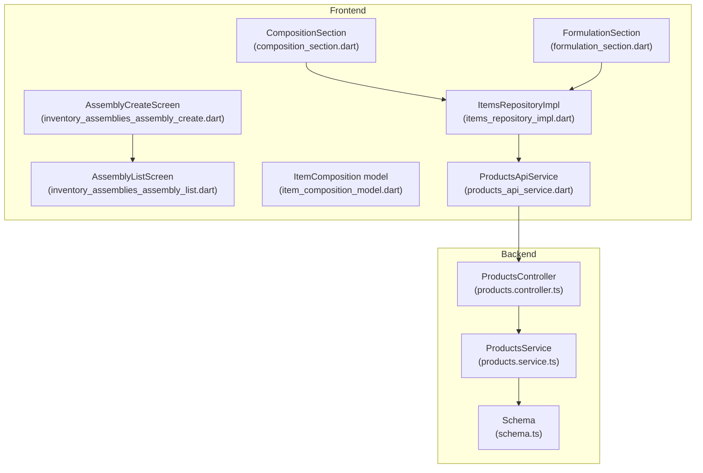
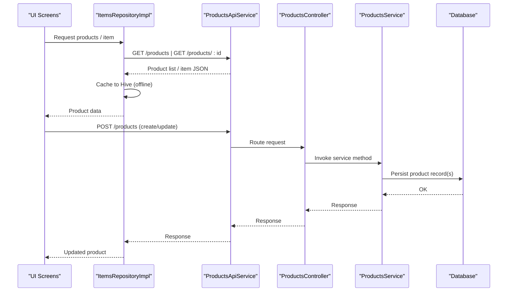
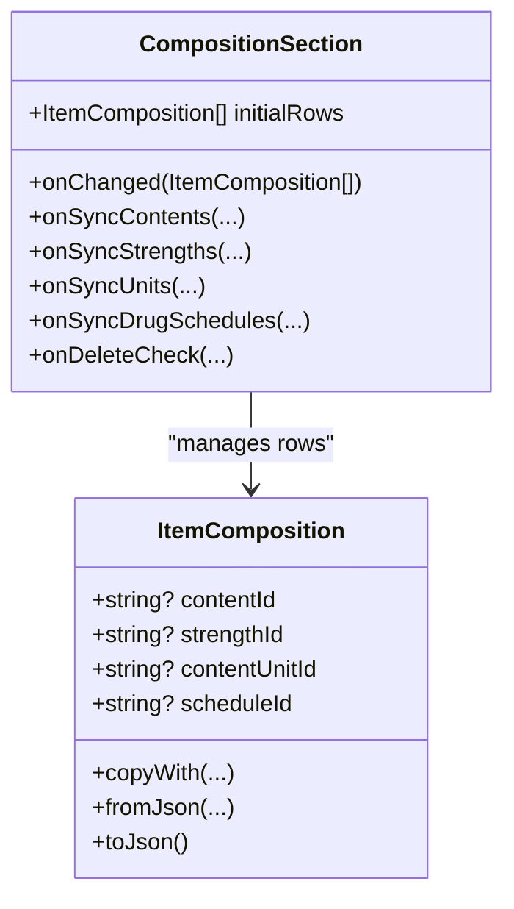
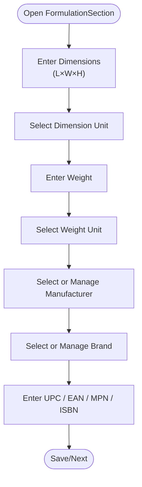
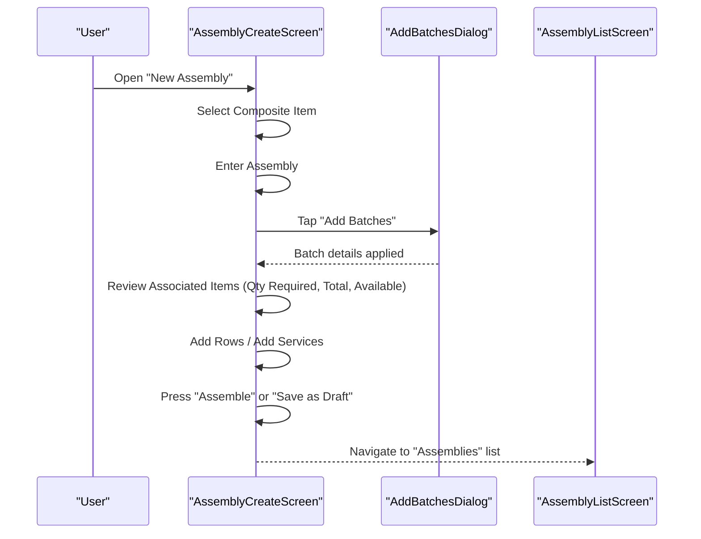
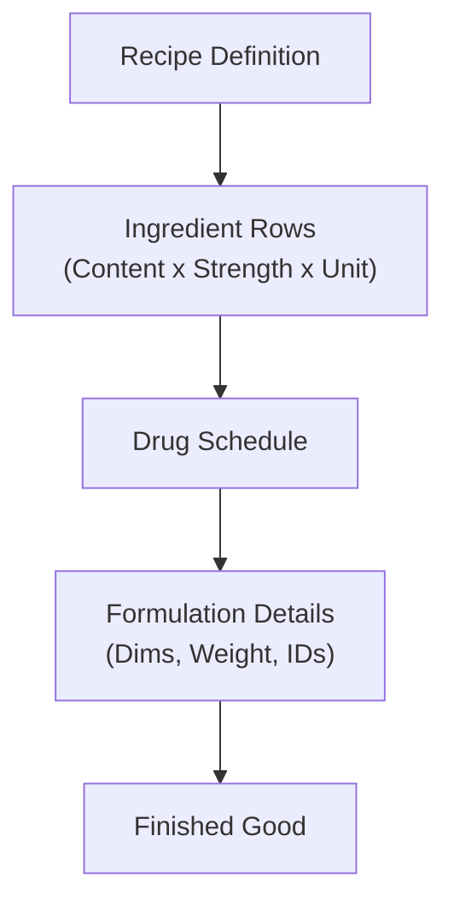
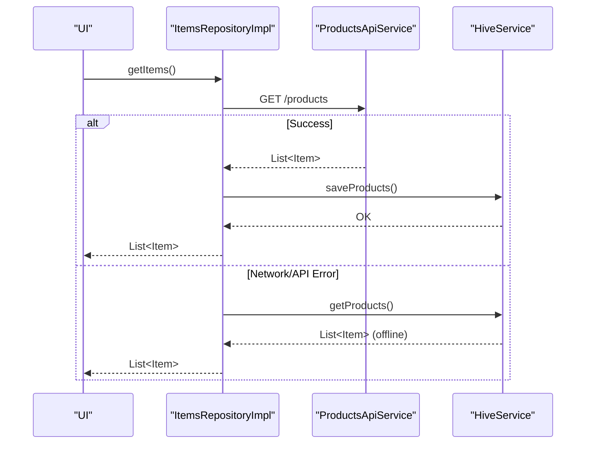
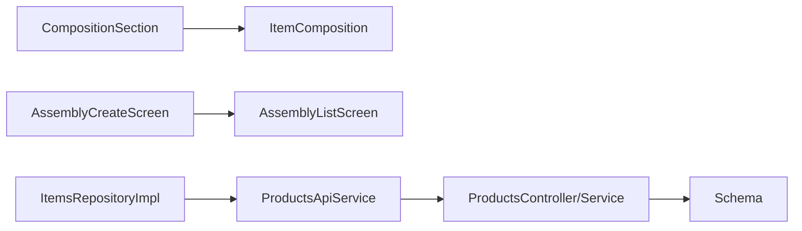

# Product Composition & Manufacturing

<cite>
**Referenced Files in This Document**
- [inventory_assemblies_assembly_create.dart](file://lib/modules/inventory/assemblies/presentation/inventory_assemblies_assembly_create.dart)
- [inventory_assemblies_assembly_list.dart](file://lib/modules/inventory/assemblies/presentation/inventory_assemblies_assembly_list.dart)
- [item_composition_model.dart](file://lib/modules/items/models/item_composition_model.dart)
- [composition_section.dart](file://lib/modules/items/presentation/sections/composition_section.dart)
- [formulation_section.dart](file://lib/modules/items/presentation/sections/formulation_section.dart)
- [products_api_service.dart](file://lib/modules/items/services/products_api_service.dart)
- [items_repository.dart](file://lib/modules/items/repositories/items_repository.dart)
- [items_repository_impl.dart](file://lib/modules/items/repositories/items_repository_impl.dart)
- [schema.ts](file://backend/src/db/schema.ts)
- [products.service.ts](file://backend/src/products/products.service.ts)
- [products.controller.ts](file://backend/src/products/products.controller.ts)
</cite>

## Table of Contents
1. [Introduction](#introduction)
2. [Project Structure](#project-structure)
3. [Core Components](#core-components)
4. [Architecture Overview](#architecture-overview)
5. [Detailed Component Analysis](#detailed-component-analysis)
6. [Dependency Analysis](#dependency-analysis)
7. [Performance Considerations](#performance-considerations)
8. [Troubleshooting Guide](#troubleshooting-guide)
9. [Conclusion](#conclusion)
10. [Appendices](#appendices)

## Introduction
This document explains the product composition and manufacturing capabilities implemented in the system. It focuses on:
- Bill of Materials (BOM) for manufacturing items composed of multiple raw materials
- Composition calculation and formulation tracking for consumable products
- Assembly workflow, component tracking, and finished goods production management
- Integration with inventory for raw material consumption and work-in-progress tracking
- Quality control and batch traceability considerations

The documentation synthesizes frontend UI components and models with backend services and database schema to present a complete picture of the manufacturing domain.

## Project Structure
The manufacturing-related functionality spans:
- Frontend UI and models for composition and formulation
- Assembly creation and listing screens
- Backend product services and database schema

**Diagram sources**
- [composition_section.dart](file://lib/modules/items/presentation/sections/composition_section.dart#L1-L581)
- [formulation_section.dart](file://lib/modules/items/presentation/sections/formulation_section.dart#L1-L548)
- [inventory_assemblies_assembly_create.dart](file://lib/modules/inventory/assemblies/presentation/inventory_assemblies_assembly_create.dart#L1-L590)
- [inventory_assemblies_assembly_list.dart](file://lib/modules/inventory/assemblies/presentation/inventory_assemblies_assembly_list.dart#L1-L37)
- [item_composition_model.dart](file://lib/modules/items/models/item_composition_model.dart#L1-L51)
- [items_repository_impl.dart](file://lib/modules/items/repositories/items_repository_impl.dart#L1-L297)
- [products_api_service.dart](file://lib/modules/items/services/products_api_service.dart#L1-L208)
- [products.controller.ts](file://backend/src/products/products.controller.ts)
- [products.service.ts](file://backend/src/products/products.service.ts)
- [schema.ts](file://backend/src/db/schema.ts)

**Section sources**
- [composition_section.dart](file://lib/modules/items/presentation/sections/composition_section.dart#L1-L581)
- [formulation_section.dart](file://lib/modules/items/presentation/sections/formulation_section.dart#L1-L548)
- [inventory_assemblies_assembly_create.dart](file://lib/modules/inventory/assemblies/presentation/inventory_assemblies_assembly_create.dart#L1-L590)
- [inventory_assemblies_assembly_list.dart](file://lib/modules/inventory/assemblies/presentation/inventory_assemblies_assembly_list.dart#L1-L37)
- [item_composition_model.dart](file://lib/modules/items/models/item_composition_model.dart#L1-L51)
- [items_repository_impl.dart](file://lib/modules/items/repositories/items_repository_impl.dart#L1-L297)
- [products_api_service.dart](file://lib/modules/items/services/products_api_service.dart#L1-L208)
- [schema.ts](file://backend/src/db/schema.ts)
- [products.service.ts](file://backend/src/products/products.service.ts)
- [products.controller.ts](file://backend/src/products/products.controller.ts)

## Core Components
- CompositionSection: Manages active ingredient composition rows, content/strength/unit/schedule lookups, and “Track Active Ingredients” toggle. Emits updates to parent via onChanged callback.
- ItemComposition model: Holds content/strength/unit/schedule identifiers and supports JSON serialization/deserialization.
- FormulationSection: Captures product formulation metadata (dimensions, weight, manufacturer, brand, UPC/EAN/MPN/ISBN).
- Assembly screens: Provide assembly creation and listing UIs for finished goods production.
- ItemsRepositoryImpl and ProductsApiService: Provide online-first data access with offline caching and API integration for product data.

Practical implications:
- CompositionSection drives BOM-like composition for consumable products.
- FormulationSection supports packaging and identification attributes for finished goods.
- Assembly screens orchestrate component selection and quantity calculations prior to production.

**Section sources**
- [composition_section.dart](file://lib/modules/items/presentation/sections/composition_section.dart#L1-L581)
- [item_composition_model.dart](file://lib/modules/items/models/item_composition_model.dart#L1-L51)
- [formulation_section.dart](file://lib/modules/items/presentation/sections/formulation_section.dart#L1-L548)
- [inventory_assemblies_assembly_create.dart](file://lib/modules/inventory/assemblies/presentation/inventory_assemblies_assembly_create.dart#L1-L590)
- [items_repository_impl.dart](file://lib/modules/items/repositories/items_repository_impl.dart#L1-L297)
- [products_api_service.dart](file://lib/modules/items/services/products_api_service.dart#L1-L208)

## Architecture Overview
The system follows an online-first architecture with offline caching for product data. Composition and formulation inputs are captured in the UI and persisted through the API to the backend database.

**Diagram sources**
- [items_repository_impl.dart](file://lib/modules/items/repositories/items_repository_impl.dart#L24-L83)
- [products_api_service.dart](file://lib/modules/items/services/products_api_service.dart#L51-L136)
- [products.controller.ts](file://backend/src/products/products.controller.ts)
- [products.service.ts](file://backend/src/products/products.service.ts)
- [schema.ts](file://backend/src/db/schema.ts)

## Detailed Component Analysis

### Composition and BOM Modeling
CompositionSection maintains a table of ItemComposition entries representing the BOM for consumable products. Each row links content, strength, unit, and schedule identifiers. The UI supports adding/removing rows and managing lookup lists.

- Composition calculation: The UI computes total quantities per associated item based on the assembly quantity multiplier. The assembly screen displays “Total Qty required” and “Quantity Available” for each associated item.
- Lookup synchronization: CompositionSection exposes callbacks to synchronize content, strength, unit, and schedule lists, enabling dynamic management of composition metadata.

**Diagram sources**
- [item_composition_model.dart](file://lib/modules/items/models/item_composition_model.dart#L3-L50)
- [composition_section.dart](file://lib/modules/items/presentation/sections/composition_section.dart#L6-L51)

**Section sources**
- [composition_section.dart](file://lib/modules/items/presentation/sections/composition_section.dart#L84-L131)
- [item_composition_model.dart](file://lib/modules/items/models/item_composition_model.dart#L29-L50)
- [inventory_assemblies_assembly_create.dart](file://lib/modules/inventory/assemblies/presentation/inventory_assemblies_assembly_create.dart#L258-L471)

### Formulation Tracking for Finished Goods
FormulationSection captures physical attributes and identification codes for finished goods:
- Dimensions (length × width × height) and unit
- Weight and unit
- Manufacturer and brand (with manage actions)
- UPC, EAN, MPN, ISBN

These fields support packaging, labeling, and traceability workflows.

**Diagram sources**
- [formulation_section.dart](file://lib/modules/items/presentation/sections/formulation_section.dart#L191-L547)

**Section sources**
- [formulation_section.dart](file://lib/modules/items/presentation/sections/formulation_section.dart#L1-L548)

### Assembly Workflow and Component Tracking
AssemblyCreateScreen orchestrates the assembly process:
- Select composite item (finished good)
- Enter assembly number, description, assembled date, and quantity
- Associate component items with required quantities
- Optional: add batches and services
- Footer provides Save as Draft, Assemble, and Cancel actions

- Yield and waste handling: The assembly screen does not expose explicit yield or waste fields. To implement yield management, integrate a “Yield %” or “Waste Factor” input alongside quantity calculations and adjust “Total Qty Required” accordingly.
- Batch traceability: The “Add Batches” dialog enables associating serial/lot numbers with components, supporting batch traceability during assembly.

**Diagram sources**
- [inventory_assemblies_assembly_create.dart](file://lib/modules/inventory/assemblies/presentation/inventory_assemblies_assembly_create.dart#L10-L590)
- [inventory_assemblies_assembly_list.dart](file://lib/modules/inventory/assemblies/presentation/inventory_assemblies_assembly_list.dart#L6-L36)

**Section sources**
- [inventory_assemblies_assembly_create.dart](file://lib/modules/inventory/assemblies/presentation/inventory_assemblies_assembly_create.dart#L1-L590)
- [inventory_assemblies_assembly_list.dart](file://lib/modules/inventory/assemblies/presentation/inventory_assemblies_assembly_list.dart#L1-L37)

### Recipe-Based Manufacturing Processes
Recipe-based manufacturing can be modeled using CompositionSection:
- Each composition row represents a recipe ingredient with strength and unit.
- The “Schedule of Drug” field supports regulatory categorization.
- FormulationSection complements recipe metadata with packaging and identification attributes.

**Diagram sources**
- [composition_section.dart](file://lib/modules/items/presentation/sections/composition_section.dart#L192-L234)
- [formulation_section.dart](file://lib/modules/items/presentation/sections/formulation_section.dart#L106-L186)

**Section sources**
- [composition_section.dart](file://lib/modules/items/presentation/sections/composition_section.dart#L1-L581)
- [formulation_section.dart](file://lib/modules/items/presentation/sections/formulation_section.dart#L1-L548)

### Data Access and Offline Support
ItemsRepositoryImpl provides online-first data access with offline caching:
- Attempts API calls first, caches successful responses to Hive, and falls back to cache on network/API errors.
- Exposes methods to force refresh and inspect cache statistics.

**Diagram sources**
- [items_repository_impl.dart](file://lib/modules/items/repositories/items_repository_impl.dart#L24-L83)
- [products_api_service.dart](file://lib/modules/items/services/products_api_service.dart#L51-L64)

**Section sources**
- [items_repository_impl.dart](file://lib/modules/items/repositories/items_repository_impl.dart#L1-L297)
- [items_repository.dart](file://lib/modules/items/repositories/items_repository.dart#L1-L53)
- [products_api_service.dart](file://lib/modules/items/services/products_api_service.dart#L1-L208)

## Dependency Analysis
- CompositionSection depends on ItemComposition model and lookup synchronization callbacks.
- Assembly screens depend on composition data and batch management dialogs.
- ItemsRepositoryImpl depends on ProductsApiService and HiveService for caching.
- Backend services depend on database schema for persistence.

**Diagram sources**
- [composition_section.dart](file://lib/modules/items/presentation/sections/composition_section.dart#L1-L581)
- [item_composition_model.dart](file://lib/modules/items/models/item_composition_model.dart#L1-L51)
- [inventory_assemblies_assembly_create.dart](file://lib/modules/inventory/assemblies/presentation/inventory_assemblies_assembly_create.dart#L1-L590)
- [inventory_assemblies_assembly_list.dart](file://lib/modules/inventory/assemblies/presentation/inventory_assemblies_assembly_list.dart#L1-L37)
- [items_repository_impl.dart](file://lib/modules/items/repositories/items_repository_impl.dart#L1-L297)
- [products_api_service.dart](file://lib/modules/items/services/products_api_service.dart#L1-L208)
- [products.controller.ts](file://backend/src/products/products.controller.ts)
- [products.service.ts](file://backend/src/products/products.service.ts)
- [schema.ts](file://backend/src/db/schema.ts)

**Section sources**
- [composition_section.dart](file://lib/modules/items/presentation/sections/composition_section.dart#L1-L581)
- [item_composition_model.dart](file://lib/modules/items/models/item_composition_model.dart#L1-L51)
- [inventory_assemblies_assembly_create.dart](file://lib/modules/inventory/assemblies/presentation/inventory_assemblies_assembly_create.dart#L1-L590)
- [inventory_assemblies_assembly_list.dart](file://lib/modules/inventory/assemblies/presentation/inventory_assemblies_assembly_list.dart#L1-L37)
- [items_repository_impl.dart](file://lib/modules/items/repositories/items_repository_impl.dart#L1-L297)
- [products_api_service.dart](file://lib/modules/items/services/products_api_service.dart#L1-L208)
- [schema.ts](file://backend/src/db/schema.ts)
- [products.service.ts](file://backend/src/products/products.service.ts)
- [products.controller.ts](file://backend/src/products/products.controller.ts)

## Performance Considerations
- Online-first caching reduces latency and improves reliability in low-connectivity environments.
- CompositionSection uses efficient row updates and minimal rebuilds via setState and onChanged callbacks.
- Assembly screens compute derived quantities (total required) client-side; keep row counts reasonable to avoid excessive recomputation.

[No sources needed since this section provides general guidance]

## Troubleshooting Guide
Common issues and resolutions:
- Network/API failures: ItemsRepositoryImpl automatically falls back to cached data. Verify cache presence and last sync time.
- Validation errors on create/update: ProductsApiService formats detailed error messages from the backend; inspect formatted messages for field-specific constraints.
- Missing item ID on update: ItemsRepositoryImpl throws a validation error if ID is absent; ensure item has a valid identifier before update.

**Section sources**
- [items_repository_impl.dart](file://lib/modules/items/repositories/items_repository_impl.dart#L57-L82)
- [products_api_service.dart](file://lib/modules/items/services/products_api_service.dart#L10-L49)
- [items_repository_impl.dart](file://lib/modules/items/repositories/items_repository_impl.dart#L200-L206)

## Conclusion
The system provides a robust foundation for product composition and manufacturing:
- CompositionSection and ItemComposition model capture BOM-like composition for consumables.
- FormulationSection supports finished goods packaging and identification.
- Assembly screens facilitate component association and batch management.
- Online-first data access ensures reliable operation across connectivity conditions.

Future enhancements could include explicit yield/waste controls, recipe versioning, and deeper integration with inventory for real-time raw material consumption and WIP tracking.

[No sources needed since this section summarizes without analyzing specific files]

## Appendices

### Practical Scenarios

- BOM Creation
  - Use CompositionSection to define ingredients with content, strength, unit, and schedule.
  - Manage lookup lists via “Manage…” actions to keep composition metadata current.

- Manufacturing Routing
  - Define recipe steps in CompositionSection rows and link to formulation attributes in FormulationSection.
  - Use AssemblyCreateScreen to plan production runs and allocate components.

- Production Scheduling
  - Enter assembly quantity and review “Total Qty Required.”
  - Use “Add Batches” to associate serial/lot numbers for traceability.

[No sources needed since this section provides general guidance]

### Database Schema Notes
- The backend schema defines product and lookup tables. Composition and formulation data are stored as product attributes and linked via identifiers exposed by the UI components.

**Section sources**
- [schema.ts](file://backend/src/db/schema.ts)
- [products.service.ts](file://backend/src/products/products.service.ts)
- [products.controller.ts](file://backend/src/products/products.controller.ts)