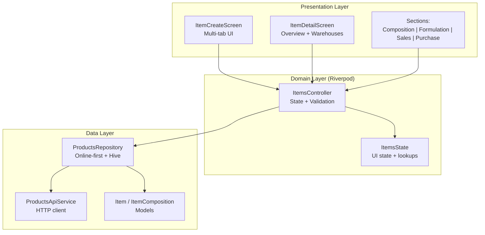
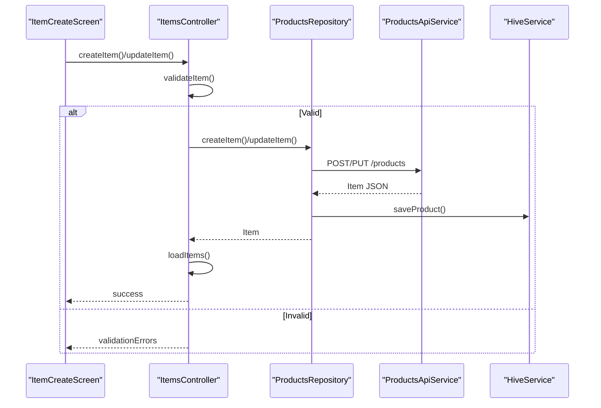
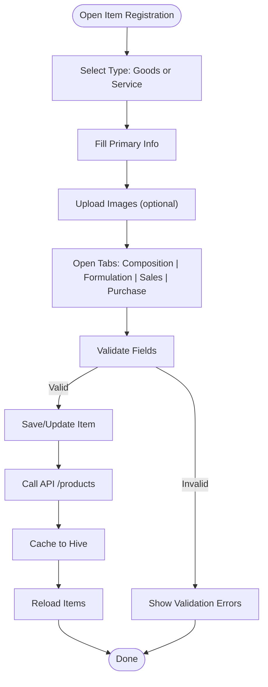
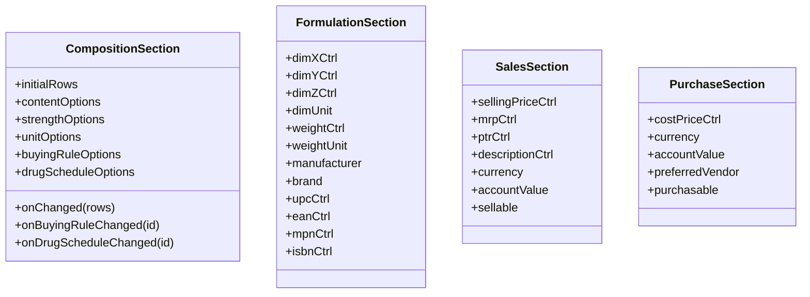
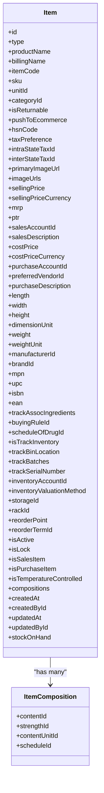
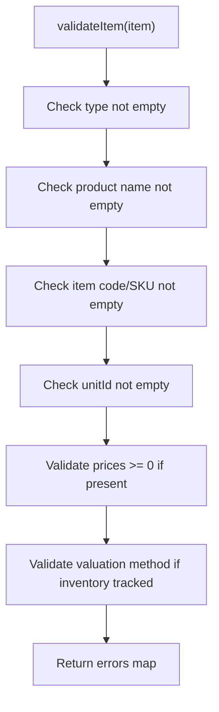
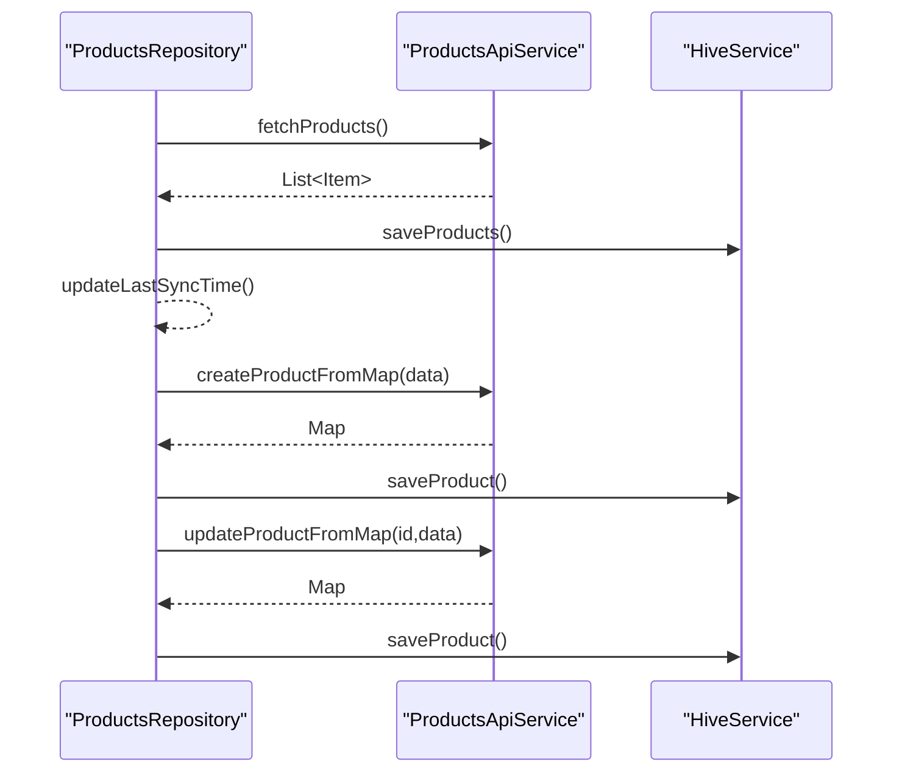
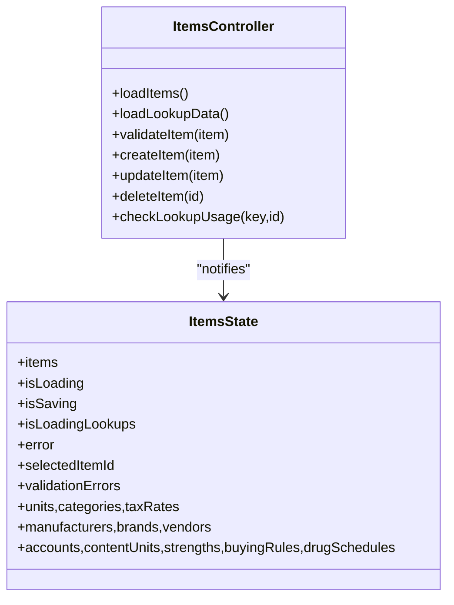
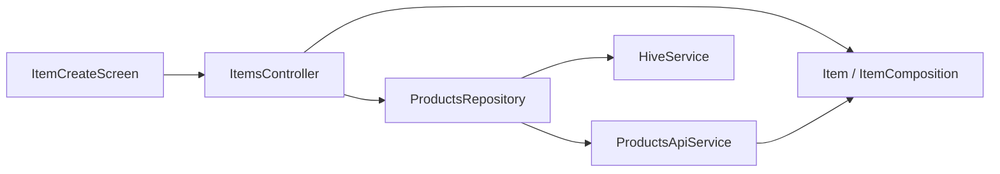

# Product Creation & Management

<cite>
**Referenced Files in This Document**
- [items_item_create.dart](file://lib/modules/items/presentation/items_item_create.dart)
- [items_item_detail.dart](file://lib/modules/items/presentation/items_item_detail.dart)
- [item_model.dart](file://lib/modules/items/models/item_model.dart)
- [item_composition_model.dart](file://lib/modules/items/models/item_composition_model.dart)
- [items_controller.dart](file://lib/modules/items/controller/items_controller.dart)
- [items_state.dart](file://lib/modules/items/controller/items_state.dart)
- [products_api_service.dart](file://lib/modules/items/services/products_api_service.dart)
- [products_repository.dart](file://lib/modules/items/repositories/products_repository.dart)
- [items_repository.dart](file://lib/modules/items/repositories/items_repository.dart)
- [composition_section.dart](file://lib/modules/items/presentation/sections/composition_section.dart)
- [formulation_section.dart](file://lib/modules/items/presentation/sections/formulation_section.dart)
- [sales_section.dart](file://lib/modules/items/presentation/sections/sales_section.dart)
- [purchase_section.dart](file://lib/modules/items/presentation/sections/purchase_section.dart)
</cite>

## Table of Contents
1. [Introduction](#introduction)
2. [Project Structure](#project-structure)
3. [Core Components](#core-components)
4. [Architecture Overview](#architecture-overview)
5. [Detailed Component Analysis](#detailed-component-analysis)
6. [Dependency Analysis](#dependency-analysis)
7. [Performance Considerations](#performance-considerations)
8. [Troubleshooting Guide](#troubleshooting-guide)
9. [Conclusion](#conclusion)
10. [Appendices](#appendices)

## Introduction
This document explains the product creation and management functionality, focusing on the end-to-end workflow for registering and maintaining product records. It covers the multi-tab interface design, data capture across composition, formulation, sales, and purchase sections, the underlying product data model, validation and error handling, offline-first persistence via Hive, and API integration patterns for CRUD operations. Practical scenarios such as creating goods vs. services, managing composition and formulations, setting pricing and taxes, and handling media uploads are included.

## Project Structure
The product feature spans three layers:
- Presentation: Screen and tabbed sections for capturing product data
- Domain: Controller and state management with Riverpod
- Data: API service and repository implementing online-first with offline fallback

**Diagram sources**
- [items_item_create.dart](file://lib/modules/items/presentation/items_item_create.dart#L44-L544)
- [items_item_detail.dart](file://lib/modules/items/presentation/items_item_detail.dart#L46-L346)
- [items_controller.dart](file://lib/modules/items/controller/items_controller.dart#L16-L568)
- [items_state.dart](file://lib/modules/items/controller/items_state.dart#L7-L113)
- [products_api_service.dart](file://lib/modules/items/services/products_api_service.dart#L7-L208)
- [products_repository.dart](file://lib/modules/items/repositories/products_repository.dart#L7-L161)
- [item_model.dart](file://lib/modules/items/models/item_model.dart#L4-L461)
- [item_composition_model.dart](file://lib/modules/items/models/item_composition_model.dart#L3-L51)

**Section sources**
- [items_item_create.dart](file://lib/modules/items/presentation/items_item_create.dart#L44-L544)
- [items_item_detail.dart](file://lib/modules/items/presentation/items_item_detail.dart#L46-L346)
- [items_controller.dart](file://lib/modules/items/controller/items_controller.dart#L16-L568)
- [items_state.dart](file://lib/modules/items/controller/items_state.dart#L7-L113)
- [products_api_service.dart](file://lib/modules/items/services/products_api_service.dart#L7-L208)
- [products_repository.dart](file://lib/modules/items/repositories/products_repository.dart#L7-L161)
- [item_model.dart](file://lib/modules/items/models/item_model.dart#L4-L461)
- [item_composition_model.dart](file://lib/modules/items/models/item_composition_model.dart#L3-L51)

## Core Components
- ItemCreateScreen orchestrates the entire product creation flow, including media upload, tax preference translation, and saving/updating items.
- Multi-tab UI organizes data capture into Composition, Formulation, Sales, and Purchase sections.
- ItemsController manages state, validation, and API interactions via ProductsApiService and ProductsRepository.
- ProductsRepository implements online-first strategy with Hive caching for offline support.
- Item and ItemComposition models define the product data schema and child table entries.

**Section sources**
- [items_item_create.dart](file://lib/modules/items/presentation/items_item_create.dart#L44-L544)
- [items_controller.dart](file://lib/modules/items/controller/items_controller.dart#L16-L568)
- [products_api_service.dart](file://lib/modules/items/services/products_api_service.dart#L7-L208)
- [products_repository.dart](file://lib/modules/items/repositories/products_repository.dart#L7-L161)
- [item_model.dart](file://lib/modules/items/models/item_model.dart#L4-L461)
- [item_composition_model.dart](file://lib/modules/items/models/item_composition_model.dart#L3-L51)

## Architecture Overview
The system follows an online-first architecture with offline caching:
- UI captures product data and triggers controller actions.
- Controller validates and calls repository.
- Repository attempts API first, caches results to Hive, and falls back to cache on failure.
- API service encapsulates HTTP requests and error formatting.

**Diagram sources**
- [items_item_create.dart](file://lib/modules/items/presentation/items_item_create.dart#L352-L451)
- [items_controller.dart](file://lib/modules/items/controller/items_controller.dart#L232-L346)
- [products_repository.dart](file://lib/modules/items/repositories/products_repository.dart#L76-L117)
- [products_api_service.dart](file://lib/modules/items/services/products_api_service.dart#L80-L124)

## Detailed Component Analysis

### Product Registration Workflow
- Type selection toggles tabs: Goods (Composition, Formulation, Sales, Purchase) vs. Service (Sales, Purchase).
- Primary info collects name, billing name, item code/SKU, unit, category, returnable flag, ecommerce push, HSN/SAC, and tax preference.
- Media upload allows selecting multiple images; on success, primary image and URLs are attached to the item.
- Saving triggers validation, then controller delegates to repository and API, followed by cache update and reload.

**Diagram sources**
- [items_item_create.dart](file://lib/modules/items/presentation/items_item_create.dart#L352-L524)
- [items_controller.dart](file://lib/modules/items/controller/items_controller.dart#L186-L230)
- [products_repository.dart](file://lib/modules/items/repositories/products_repository.dart#L21-L48)

**Section sources**
- [items_item_create.dart](file://lib/modules/items/presentation/items_item_create.dart#L44-L544)
- [items_controller.dart](file://lib/modules/items/controller/items_controller.dart#L186-L230)

### Multi-Tab Interface Design
- Composition: Tracks active ingredients, strength, units, schedules, and buying rules. Supports managing lookup lists and checking usage before deletion.
- Formulation: Captures dimensions, weight, manufacturer, brand, and identifiers (MPN, UPC, ISBN, EAN).
- Sales: Captures selling price, MRP, PTR, currency, account, and description; controlled by a “sellable” flag.
- Purchase: Captures cost price, currency, account, preferred vendor, and description; controlled by a “purchasable” flag.

**Diagram sources**
- [composition_section.dart](file://lib/modules/items/presentation/sections/composition_section.dart#L6-L51)
- [formulation_section.dart](file://lib/modules/items/presentation/sections/formulation_section.dart#L5-L33)
- [sales_section.dart](file://lib/modules/items/presentation/sections/sales_section.dart#L42-L83)
- [purchase_section.dart](file://lib/modules/items/presentation/sections/purchase_section.dart#L40-L85)

**Section sources**
- [items_item_create.dart](file://lib/modules/items/presentation/items_item_create.dart#L107-L258)
- [composition_section.dart](file://lib/modules/items/presentation/sections/composition_section.dart#L6-L51)
- [formulation_section.dart](file://lib/modules/items/presentation/sections/formulation_section.dart#L5-L33)
- [sales_section.dart](file://lib/modules/items/presentation/sections/sales_section.dart#L42-L83)
- [purchase_section.dart](file://lib/modules/items/presentation/sections/purchase_section.dart#L40-L85)

### Product Data Model
The Item model defines the canonical product record, including:
- Basic info: type, product name, billing name, item code/SKU, unit, category, returnable, ecommerce flag
- Tax and regulatory: HSN/SAC, tax preference, intra/inter-state tax IDs
- Pricing: selling price, MRP, PTR, cost price, currencies, sales/purchase account IDs
- Formulation: dimensions (L×W×H), weight, units, manufacturer, brand, identifiers
- Inventory: tracking flags, valuation method, storage/rack, reorder point, terms
- Status flags: active, locked, sales/purchase eligibility, temperature-controlled
- Associations: compositions (child table), timestamps, and computed stock-on-hand

**Diagram sources**
- [item_model.dart](file://lib/modules/items/models/item_model.dart#L4-L172)
- [item_composition_model.dart](file://lib/modules/items/models/item_composition_model.dart#L3-L27)

**Section sources**
- [item_model.dart](file://lib/modules/items/models/item_model.dart#L4-L461)
- [item_composition_model.dart](file://lib/modules/items/models/item_composition_model.dart#L3-L51)

### Validation Rules, Input Sanitization, and Error Handling
- Validation enforces required fields and numeric constraints:
  - Required: type, product name, item code/SKU, unit ID
  - Optional numeric validations: selling price ≥ 0, MRP ≥ 0, inventory valuation method when inventory tracking is enabled
- Error handling:
  - Validation exceptions populate UI validationErrors
  - API exceptions are formatted and surfaced to the UI
  - Repository catches and rethrows errors, optionally falling back to cached data

**Diagram sources**
- [items_controller.dart](file://lib/modules/items/controller/items_controller.dart#L186-L230)

**Section sources**
- [items_controller.dart](file://lib/modules/items/controller/items_controller.dart#L186-L230)
- [products_api_service.dart](file://lib/modules/items/services/products_api_service.dart#L10-L49)

### Integration with API and Offline Persistence
- ProductsApiService encapsulates HTTP GET/POST/PUT/DELETE for /products and formats error responses.
- ProductsRepository implements online-first:
  - Fetch from API, cache to Hive, update last sync timestamp
  - On failure, return cached data
  - Create/update/delete propagate to API then update cache
- ItemsRepository is an abstract contract; a mock implementation exists for development.

**Diagram sources**
- [products_repository.dart](file://lib/modules/items/repositories/products_repository.dart#L21-L48)
- [products_api_service.dart](file://lib/modules/items/services/products_api_service.dart#L142-L206)

**Section sources**
- [products_api_service.dart](file://lib/modules/items/services/products_api_service.dart#L7-L208)
- [products_repository.dart](file://lib/modules/items/repositories/products_repository.dart#L7-L161)
- [items_repository.dart](file://lib/modules/items/repositories/items_repository.dart#L3-L53)

### State Management with Riverpod
- ItemsController extends StateNotifier<ItemsState> and exposes provider itemsControllerProvider.
- ItemsState holds items list, loading flags, error messages, selected item ID, validation errors, and lookup collections.
- Consumers watch itemsControllerProvider for UI updates and call createItem/updateItem.

**Diagram sources**
- [items_controller.dart](file://lib/modules/items/controller/items_controller.dart#L16-L568)
- [items_state.dart](file://lib/modules/items/controller/items_state.dart#L7-L113)

**Section sources**
- [items_controller.dart](file://lib/modules/items/controller/items_controller.dart#L16-L568)
- [items_state.dart](file://lib/modules/items/controller/items_state.dart#L7-L113)

### Practical Scenarios
- Creating a new product (goods):
  - Select type “Goods”
  - Fill primary info (name, item code, SKU, unit, category)
  - Optionally upload images
  - Configure composition, formulation, sales, and purchase details
  - Save; on success, show confirmation dialog and reset to new form
- Editing an existing product:
  - Prepopulate fields from Item
  - Update as needed and save to trigger updateItem
- Bulk operations and migrations:
  - Use repository’s raw map APIs to fetch and persist product sets for batch operations
  - Clear cache via repository if needed

**Section sources**
- [items_item_create.dart](file://lib/modules/items/presentation/items_item_create.dart#L74-L139)
- [items_item_create.dart](file://lib/modules/items/presentation/items_item_create.dart#L352-L524)
- [products_api_service.dart](file://lib/modules/items/services/products_api_service.dart#L173-L206)
- [products_repository.dart](file://lib/modules/items/repositories/products_repository.dart#L155-L160)

## Dependency Analysis
- UI depends on ItemsController via Riverpod provider
- Controller depends on ProductsRepository and ProductsApiService
- Repository depends on ProductsApiService and HiveService
- Models are used across UI, controller, and repository boundaries

**Diagram sources**
- [items_item_create.dart](file://lib/modules/items/presentation/items_item_create.dart#L247-L249)
- [items_controller.dart](file://lib/modules/items/controller/items_controller.dart#L17-L23)
- [products_repository.dart](file://lib/modules/items/repositories/products_repository.dart#L7-L13)
- [products_api_service.dart](file://lib/modules/items/services/products_api_service.dart#L7-L8)
- [item_model.dart](file://lib/modules/items/models/item_model.dart#L4-L461)
- [item_composition_model.dart](file://lib/modules/items/models/item_composition_model.dart#L3-L51)

**Section sources**
- [items_item_create.dart](file://lib/modules/items/presentation/items_item_create.dart#L247-L249)
- [items_controller.dart](file://lib/modules/items/controller/items_controller.dart#L17-L23)
- [products_repository.dart](file://lib/modules/items/repositories/products_repository.dart#L7-L13)
- [products_api_service.dart](file://lib/modules/items/services/products_api_service.dart#L7-L8)
- [item_model.dart](file://lib/modules/items/models/item_model.dart#L4-L461)
- [item_composition_model.dart](file://lib/modules/items/models/item_composition_model.dart#L3-L51)

## Performance Considerations
- Parallel lookup loading in ItemsController improves initial render performance.
- Online-first caching reduces repeated network calls and enables offline usability.
- Numeric parsing and trimming occur during item construction to prevent invalid payloads.
- Consider debouncing heavy lookups and batching cache writes for large datasets.

[No sources needed since this section provides general guidance]

## Troubleshooting Guide
- Validation failures:
  - Check validationErrors surfaced in UI; resolve missing/invalid fields
- API errors:
  - Review formatted error messages returned by ProductsApiService
- Offline issues:
  - Confirm cache availability and staleness thresholds
  - Use repository’s cache info and clear cache when necessary
- Image upload warnings:
  - Inspect warnings shown in UI when uploads fail

**Section sources**
- [items_controller.dart](file://lib/modules/items/controller/items_controller.dart#L264-L287)
- [products_api_service.dart](file://lib/modules/items/services/products_api_service.dart#L10-L49)
- [products_repository.dart](file://lib/modules/items/repositories/products_repository.dart#L135-L153)
- [items_item_create.dart](file://lib/modules/items/presentation/items_item_create.dart#L335-L347)

## Conclusion
The product creation and management feature provides a robust, offline-capable solution for registering and maintaining product records. Its modular design with Riverpod state management, strict validation, and layered data access ensures reliability and scalability. The multi-tab UI streamlines data capture across composition, formulation, sales, and purchase domains, while API and repository abstractions support seamless integration and caching strategies.

[No sources needed since this section summarizes without analyzing specific files]

## Appendices

### API Endpoints Used
- GET /products
- GET /products/:id
- POST /products
- PUT /products/:id
- DELETE /products/:id

**Section sources**
- [products_api_service.dart](file://lib/modules/items/services/products_api_service.dart#L51-L136)