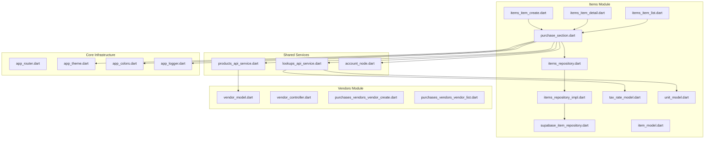
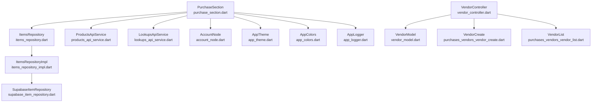
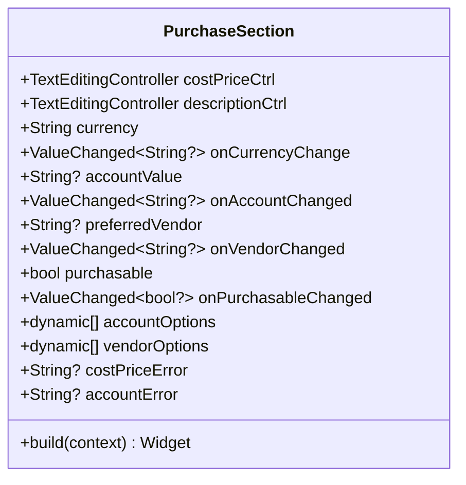
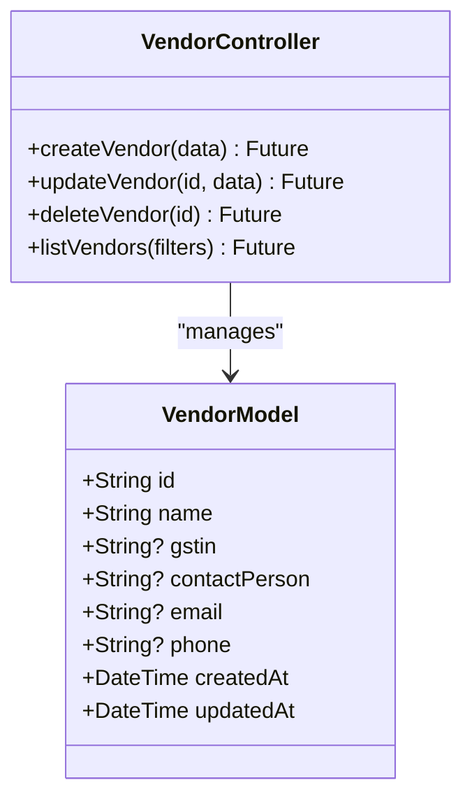
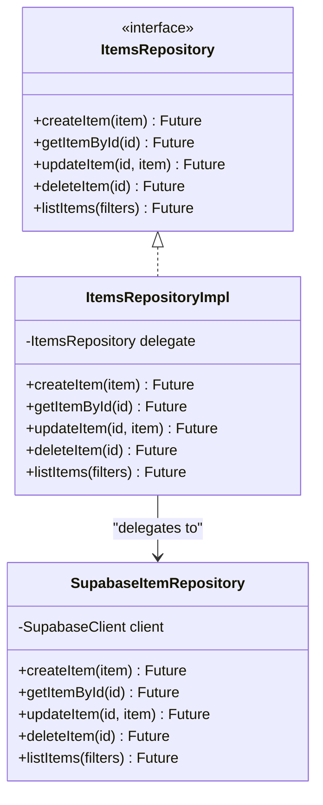
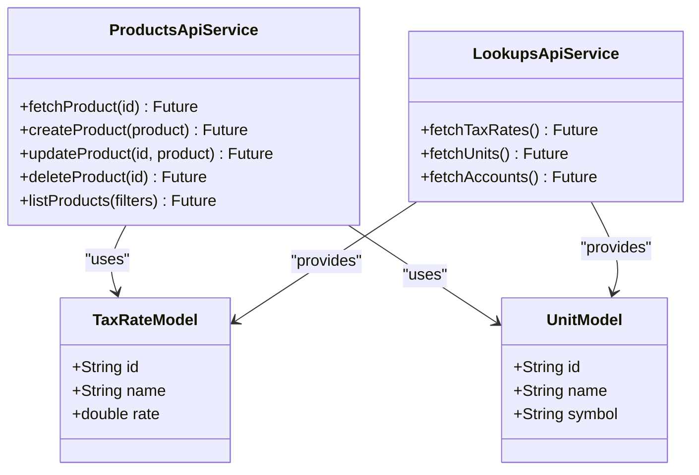
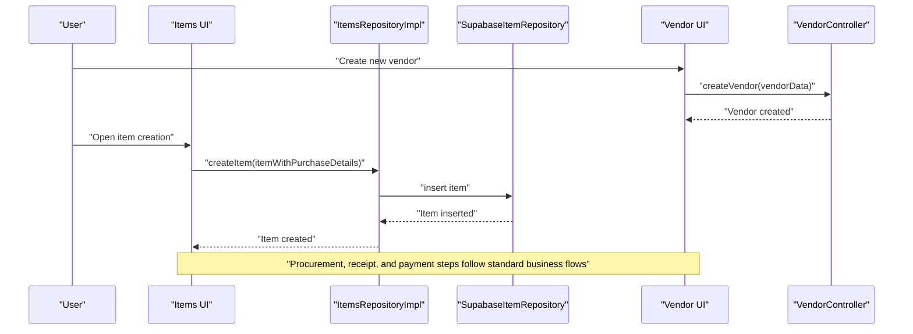
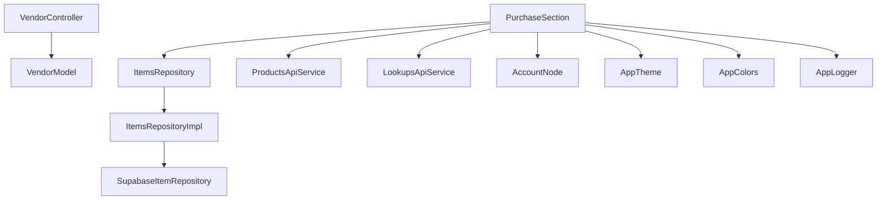

# Purchase Module

<cite>
**Referenced Files in This Document**
- [purchase_section.dart](file://lib/modules/items/presentation/sections/purchase_section.dart)
- [vendor_model.dart](file://lib/modules/vendors/models/vendor_model.dart)
- [vendor_controller.dart](file://lib/modules/vendors/controller/vendor_controller.dart)
- [purchases_vendors_vendor_create.dart](file://lib/modules/vendors/presentation/purchases_vendors_vendor_create.dart)
- [purchases_vendors_vendor_list.dart](file://lib/modules/vendors/presentation/purchases_vendors_vendor_list.dart)
- [items_item_create.dart](file://lib/modules/items/presentation/items_item_create.dart)
- [items_item_detail.dart](file://lib/modules/items/presentation/items_item_detail.dart)
- [items_item_list.dart](file://lib/modules/items/presentation/items_item_list.dart)
- [items_repository.dart](file://lib/modules/items/repositories/items_repository.dart)
- [items_repository_impl.dart](file://lib/modules/items/repositories/items_repository_impl.dart)
- [supabase_item_repository.dart](file://lib/modules/items/repositories/supabase_item_repository.dart)
- [products_api_service.dart](file://lib/modules/items/services/products_api_service.dart)
- [lookups_api_service.dart](file://lib/modules/items/services/lookups_api_service.dart)
- [item_model.dart](file://lib/modules/items/models/item_model.dart)
- [tax_rate_model.dart](file://lib/modules/items/models/tax_rate_model.dart)
- [unit_model.dart](file://lib/modules/items/models/unit_model.dart)
- [account_node.dart](file://lib/shared/models/account_node.dart)
- [app_colors.dart](file://lib/core/constants/app_colors.dart)
- [app_logger.dart](file://lib/core/logging/app_logger.dart)
- [app_router.dart](file://lib/core/routing/app_router.dart)
- [app_theme.dart](file://lib/core/theme/app_theme.dart)
- [README.md](file://README.md)
</cite>

## Table of Contents
1. [Introduction](#introduction)
2. [Project Structure](#project-structure)
3. [Core Components](#core-components)
4. [Architecture Overview](#architecture-overview)
5. [Detailed Component Analysis](#detailed-component-analysis)
6. [Dependency Analysis](#dependency-analysis)
7. [Performance Considerations](#performance-considerations)
8. [Troubleshooting Guide](#troubleshooting-guide)
9. [Conclusion](#conclusion)
10. [Appendices](#appendices)

## Introduction
This document provides comprehensive documentation for the Purchase module within the Zerpai ERP system. It focuses on vendor management and procurement processes, including vendor/customer creation and management with GST compliance features, purchase order workflows (requisition, approval, and fulfillment), receipt management for incoming goods, quality inspection, and inventory updates, bill processing (invoice matching, payment authorization, and vendor reconciliation), integration with supplier databases and procurement workflows, and purchase analytics (supplier performance, spend analysis, and procurement efficiency metrics). Implementation details cover purchase document lifecycle, approval hierarchies, and compliance tracking, along with practical examples of end-to-end purchase workflows from vendor onboarding to payment processing, including integrations with inventory and accounting systems.

## Project Structure
The Purchase module is primarily implemented in the Flutter frontend under the modules directory, with supporting services and models. The structure includes:
- Items module with purchase-specific UI sections integrated into item creation and detail views
- Vendors module for vendor management and vendor-related UI components
- Shared services for API communication and lookup data
- Core infrastructure for routing, theming, and logging

**Diagram sources**
- [purchase_section.dart](file://lib/modules/items/presentation/sections/purchase_section.dart#L40-L380)
- [items_repository.dart](file://lib/modules/items/repositories/items_repository.dart)
- [items_repository_impl.dart](file://lib/modules/items/repositories/items_repository_impl.dart)
- [supabase_item_repository.dart](file://lib/modules/items/repositories/supabase_item_repository.dart)
- [items_item_create.dart](file://lib/modules/items/presentation/items_item_create.dart)
- [items_item_detail.dart](file://lib/modules/items/presentation/items_item_detail.dart)
- [items_item_list.dart](file://lib/modules/items/presentation/items_item_list.dart)
- [item_model.dart](file://lib/modules/items/models/item_model.dart)
- [tax_rate_model.dart](file://lib/modules/items/models/tax_rate_model.dart)
- [unit_model.dart](file://lib/modules/items/models/unit_model.dart)
- [vendor_model.dart](file://lib/modules/vendors/models/vendor_model.dart)
- [vendor_controller.dart](file://lib/modules/vendors/controller/vendor_controller.dart)
- [purchases_vendors_vendor_create.dart](file://lib/modules/vendors/presentation/purchases_vendors_vendor_create.dart)
- [purchases_vendors_vendor_list.dart](file://lib/modules/vendors/presentation/purchases_vendors_vendor_list.dart)
- [products_api_service.dart](file://lib/modules/items/services/products_api_service.dart)
- [lookups_api_service.dart](file://lib/modules/items/services/lookups_api_service.dart)
- [account_node.dart](file://lib/shared/models/account_node.dart)
- [app_router.dart](file://lib/core/routing/app_router.dart)
- [app_theme.dart](file://lib/core/theme/app_theme.dart)
- [app_colors.dart](file://lib/core/constants/app_colors.dart)
- [app_logger.dart](file://lib/core/logging/app_logger.dart)

**Section sources**
- [purchase_section.dart](file://lib/modules/items/presentation/sections/purchase_section.dart#L1-L380)
- [vendor_model.dart](file://lib/modules/vendors/models/vendor_model.dart#L1-L2)
- [vendor_controller.dart](file://lib/modules/vendors/controller/vendor_controller.dart)
- [purchases_vendors_vendor_create.dart](file://lib/modules/vendors/presentation/purchases_vendors_vendor_create.dart)
- [purchases_vendors_vendor_list.dart](file://lib/modules/vendors/presentation/purchases_vendors_vendor_list.dart)
- [items_item_create.dart](file://lib/modules/items/presentation/items_item_create.dart)
- [items_item_detail.dart](file://lib/modules/items/presentation/items_item_detail.dart)
- [items_item_list.dart](file://lib/modules/items/presentation/items_item_list.dart)
- [items_repository.dart](file://lib/modules/items/repositories/items_repository.dart)
- [items_repository_impl.dart](file://lib/modules/items/repositories/items_repository_impl.dart)
- [supabase_item_repository.dart](file://lib/modules/items/repositories/supabase_item_repository.dart)
- [products_api_service.dart](file://lib/modules/items/services/products_api_service.dart)
- [lookups_api_service.dart](file://lib/modules/items/services/lookups_api_service.dart)
- [item_model.dart](file://lib/modules/items/models/item_model.dart)
- [tax_rate_model.dart](file://lib/modules/items/models/tax_rate_model.dart)
- [unit_model.dart](file://lib/modules/items/models/unit_model.dart)
- [account_node.dart](file://lib/shared/models/account_node.dart)
- [app_router.dart](file://lib/core/routing/app_router.dart)
- [app_theme.dart](file://lib/core/theme/app_theme.dart)
- [app_colors.dart](file://lib/core/constants/app_colors.dart)
- [app_logger.dart](file://lib/core/logging/app_logger.dart)

## Core Components
The Purchase module centers around three primary components:
- Purchase Section UI: Provides controls for cost price, currency, account selection, preferred vendor, and description within item creation/detail screens.
- Vendor Management: Includes vendor models, controllers, and UI for vendor creation and listing.
- Item Repository Layer: Manages item data persistence and retrieval, integrating with Supabase for backend operations.

Key capabilities:
- Purchase Section integrates with account tree dropdowns, vendor dropdowns, and currency selection to support procurement workflows.
- Vendor management supports vendor creation and listing UI components.
- Item repository abstraction enables flexible data access and potential backend integrations.

**Section sources**
- [purchase_section.dart](file://lib/modules/items/presentation/sections/purchase_section.dart#L40-L380)
- [vendor_model.dart](file://lib/modules/vendors/models/vendor_model.dart#L1-L2)
- [vendor_controller.dart](file://lib/modules/vendors/controller/vendor_controller.dart)
- [purchases_vendors_vendor_create.dart](file://lib/modules/vendors/presentation/purchases_vendors_vendor_create.dart)
- [purchases_vendors_vendor_list.dart](file://lib/modules/vendors/presentation/purchases_vendors_vendor_list.dart)
- [items_repository.dart](file://lib/modules/items/repositories/items_repository.dart)
- [items_repository_impl.dart](file://lib/modules/items/repositories/items_repository_impl.dart)
- [supabase_item_repository.dart](file://lib/modules/items/repositories/supabase_item_repository.dart)

## Architecture Overview
The Purchase module follows a layered architecture:
- Presentation Layer: Purchase Section UI and vendor UI components.
- Domain Layer: Item and vendor models, and repository abstractions.
- Service Layer: API services for product data and lookup data.
- Infrastructure Layer: Routing, theming, logging, and shared models.

**Diagram sources**
- [purchase_section.dart](file://lib/modules/items/presentation/sections/purchase_section.dart#L40-L380)
- [items_repository.dart](file://lib/modules/items/repositories/items_repository.dart)
- [items_repository_impl.dart](file://lib/modules/items/repositories/items_repository_impl.dart)
- [supabase_item_repository.dart](file://lib/modules/items/repositories/supabase_item_repository.dart)
- [products_api_service.dart](file://lib/modules/items/services/products_api_service.dart)
- [lookups_api_service.dart](file://lib/modules/items/services/lookups_api_service.dart)
- [account_node.dart](file://lib/shared/models/account_node.dart)
- [app_theme.dart](file://lib/core/theme/app_theme.dart)
- [app_colors.dart](file://lib/core/constants/app_colors.dart)
- [app_logger.dart](file://lib/core/logging/app_logger.dart)
- [vendor_controller.dart](file://lib/modules/vendors/controller/vendor_controller.dart)
- [vendor_model.dart](file://lib/modules/vendors/models/vendor_model.dart)
- [purchases_vendors_vendor_create.dart](file://lib/modules/vendors/presentation/purchases_vendors_vendor_create.dart)
- [purchases_vendors_vendor_list.dart](file://lib/modules/vendors/presentation/purchases_vendors_vendor_list.dart)

## Detailed Component Analysis

### Purchase Section UI
The Purchase Section UI encapsulates purchase-related fields within item creation and detail screens. It provides:
- Cost Price input with currency selection
- Account selection via a tree dropdown
- Preferred Vendor selection
- Description field for additional notes

Implementation highlights:
- Conditional enabling/disabling of fields based on the item's purchasable flag
- Integration with shared UI components for consistent UX
- Support for error messaging and disabled states

**Diagram sources**
- [purchase_section.dart](file://lib/modules/items/presentation/sections/purchase_section.dart#L40-L380)

**Section sources**
- [purchase_section.dart](file://lib/modules/items/presentation/sections/purchase_section.dart#L40-L380)

### Vendor Management
Vendor management includes:
- Vendor Model definition
- Vendor Controller for managing vendor operations
- Vendor Create and Vendor List UI components

**Diagram sources**
- [vendor_controller.dart](file://lib/modules/vendors/controller/vendor_controller.dart)
- [vendor_model.dart](file://lib/modules/vendors/models/vendor_model.dart#L1-L2)

**Section sources**
- [vendor_model.dart](file://lib/modules/vendors/models/vendor_model.dart#L1-L2)
- [vendor_controller.dart](file://lib/modules/vendors/controller/vendor_controller.dart)
- [purchases_vendors_vendor_create.dart](file://lib/modules/vendors/presentation/purchases_vendors_vendor_create.dart)
- [purchases_vendors_vendor_list.dart](file://lib/modules/vendors/presentation/purchases_vendors_vendor_list.dart)

### Item Repository Layer
The item repository layer abstracts data access and persistence:
- ItemsRepository defines the contract for item operations
- ItemsRepositoryImpl provides the implementation
- SupabaseItemRepository integrates with Supabase for backend operations

**Diagram sources**
- [items_repository.dart](file://lib/modules/items/repositories/items_repository.dart)
- [items_repository_impl.dart](file://lib/modules/items/repositories/items_repository_impl.dart)
- [supabase_item_repository.dart](file://lib/modules/items/repositories/supabase_item_repository.dart)

**Section sources**
- [items_repository.dart](file://lib/modules/items/repositories/items_repository.dart)
- [items_repository_impl.dart](file://lib/modules/items/repositories/items_repository_impl.dart)
- [supabase_item_repository.dart](file://lib/modules/items/repositories/supabase_item_repository.dart)

### API Services and Lookup Data
The system leverages API services for product data and lookup data:
- ProductsApiService handles product-related API calls
- LookupsApiService manages lookup data such as tax rates and units

**Diagram sources**
- [products_api_service.dart](file://lib/modules/items/services/products_api_service.dart)
- [lookups_api_service.dart](file://lib/modules/items/services/lookups_api_service.dart)
- [tax_rate_model.dart](file://lib/modules/items/models/tax_rate_model.dart)
- [unit_model.dart](file://lib/modules/items/models/unit_model.dart)

**Section sources**
- [products_api_service.dart](file://lib/modules/items/services/products_api_service.dart)
- [lookups_api_service.dart](file://lib/modules/items/services/lookups_api_service.dart)
- [tax_rate_model.dart](file://lib/modules/items/models/tax_rate_model.dart)
- [unit_model.dart](file://lib/modules/items/models/unit_model.dart)

### Purchase Workflow Sequence
The following sequence illustrates a typical purchase workflow from vendor onboarding to payment processing:

**Diagram sources**
- [purchase_section.dart](file://lib/modules/items/presentation/sections/purchase_section.dart#L40-L380)
- [items_repository_impl.dart](file://lib/modules/items/repositories/items_repository_impl.dart)
- [supabase_item_repository.dart](file://lib/modules/items/repositories/supabase_item_repository.dart)
- [vendor_controller.dart](file://lib/modules/vendors/controller/vendor_controller.dart)
- [purchases_vendors_vendor_create.dart](file://lib/modules/vendors/presentation/purchases_vendors_vendor_create.dart)

## Dependency Analysis
The Purchase module exhibits clear separation of concerns:
- Presentation depends on domain models and services
- Repository layer abstracts data access
- Services depend on models and external APIs
- Shared models and infrastructure support UI consistency

**Diagram sources**
- [purchase_section.dart](file://lib/modules/items/presentation/sections/purchase_section.dart#L40-L380)
- [items_repository.dart](file://lib/modules/items/repositories/items_repository.dart)
- [items_repository_impl.dart](file://lib/modules/items/repositories/items_repository_impl.dart)
- [supabase_item_repository.dart](file://lib/modules/items/repositories/supabase_item_repository.dart)
- [products_api_service.dart](file://lib/modules/items/services/products_api_service.dart)
- [lookups_api_service.dart](file://lib/modules/items/services/lookups_api_service.dart)
- [vendor_controller.dart](file://lib/modules/vendors/controller/vendor_controller.dart)
- [vendor_model.dart](file://lib/modules/vendors/models/vendor_model.dart)
- [account_node.dart](file://lib/shared/models/account_node.dart)
- [app_theme.dart](file://lib/core/theme/app_theme.dart)
- [app_colors.dart](file://lib/core/constants/app_colors.dart)
- [app_logger.dart](file://lib/core/logging/app_logger.dart)

**Section sources**
- [purchase_section.dart](file://lib/modules/items/presentation/sections/purchase_section.dart#L40-L380)
- [items_repository.dart](file://lib/modules/items/repositories/items_repository.dart)
- [items_repository_impl.dart](file://lib/modules/items/repositories/items_repository_impl.dart)
- [supabase_item_repository.dart](file://lib/modules/items/repositories/supabase_item_repository.dart)
- [products_api_service.dart](file://lib/modules/items/services/products_api_service.dart)
- [lookups_api_service.dart](file://lib/modules/items/services/lookups_api_service.dart)
- [vendor_controller.dart](file://lib/modules/vendors/controller/vendor_controller.dart)
- [vendor_model.dart](file://lib/modules/vendors/models/vendor_model.dart)
- [account_node.dart](file://lib/shared/models/account_node.dart)
- [app_theme.dart](file://lib/core/theme/app_theme.dart)
- [app_colors.dart](file://lib/core/constants/app_colors.dart)
- [app_logger.dart](file://lib/core/logging/app_logger.dart)

## Performance Considerations
- UI responsiveness: Purchase Section uses conditional rendering and disabled states to prevent unnecessary computations.
- Data fetching: Repository layer abstracts data access, enabling caching and batching strategies at the service level.
- Network efficiency: API services should implement pagination and filtering to reduce payload sizes.
- Theme and colors: Centralized theming reduces re-render overhead across components.

## Troubleshooting Guide
Common issues and resolutions:
- Disabled fields not updating: Verify the purchasable flag binding and ensure state updates propagate to the UI.
- Account dropdown display issues: Confirm that account options are properly mapped and display functions return valid strings.
- Vendor selection problems: Ensure vendor options are populated and display functions handle unknown values gracefully.
- Logging and debugging: Use the logger to trace UI interactions and repository calls.

**Section sources**
- [purchase_section.dart](file://lib/modules/items/presentation/sections/purchase_section.dart#L87-L103)
- [app_logger.dart](file://lib/core/logging/app_logger.dart)
- [app_theme.dart](file://lib/core/theme/app_theme.dart)
- [app_colors.dart](file://lib/core/constants/app_colors.dart)

## Conclusion
The Purchase module provides a robust foundation for vendor management and procurement workflows within Zerpai ERP. Its layered architecture ensures maintainability and scalability, while the Purchase Section UI integrates seamlessly with vendor management and item repositories. The module supports essential procurement features such as cost price tracking, account allocation, vendor selection, and description fields. Future enhancements can focus on implementing full procurement lifecycle features (approval hierarchies, receipts, bills, analytics) and integrating with backend systems for comprehensive end-to-end procurement management.

## Appendices
- Practical examples of complete purchase workflows:
  - Vendor onboarding: Use the vendor create UI to register suppliers with GST details.
  - Item creation: Utilize the Purchase Section to set cost price, currency, account, and preferred vendor during item creation.
  - Procurement process: Integrate with inventory and accounting systems through repository and service layers.
  - Payment processing: Extend the current structure to include bill processing and reconciliation flows.

[No sources needed since this section provides general guidance]
