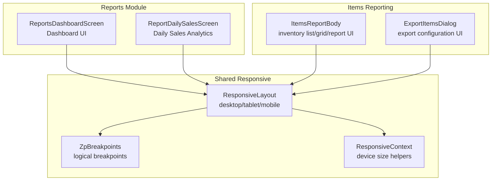
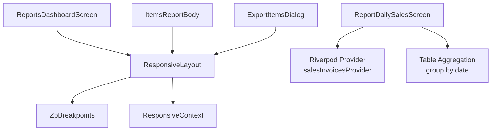
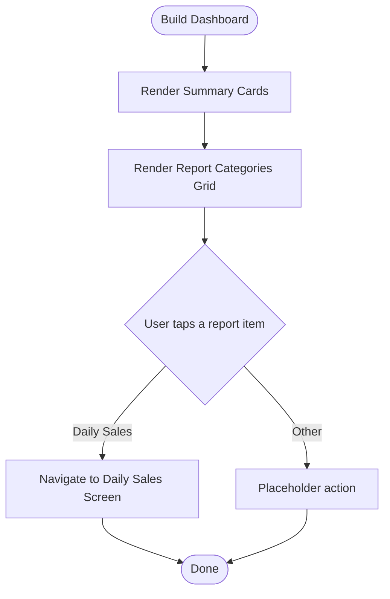
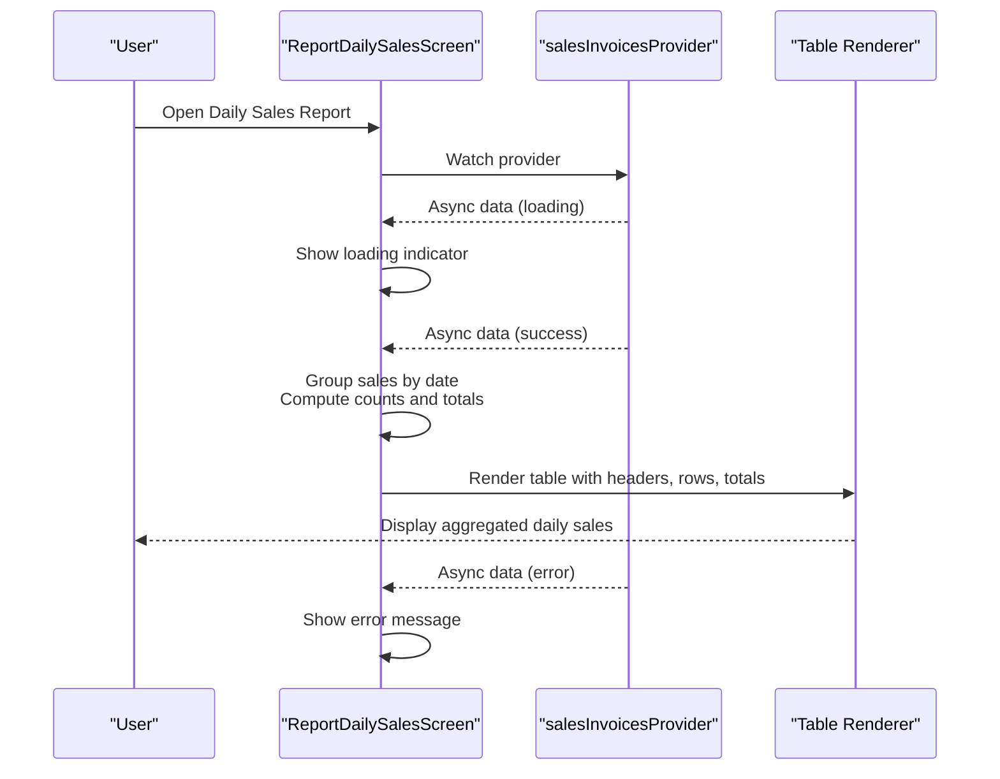
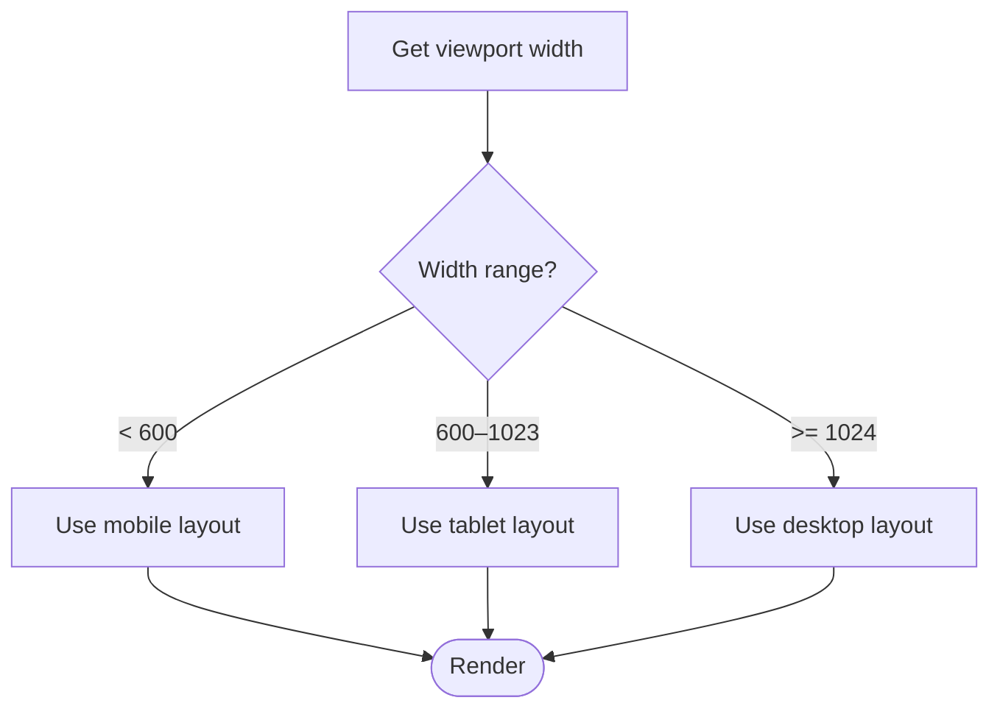
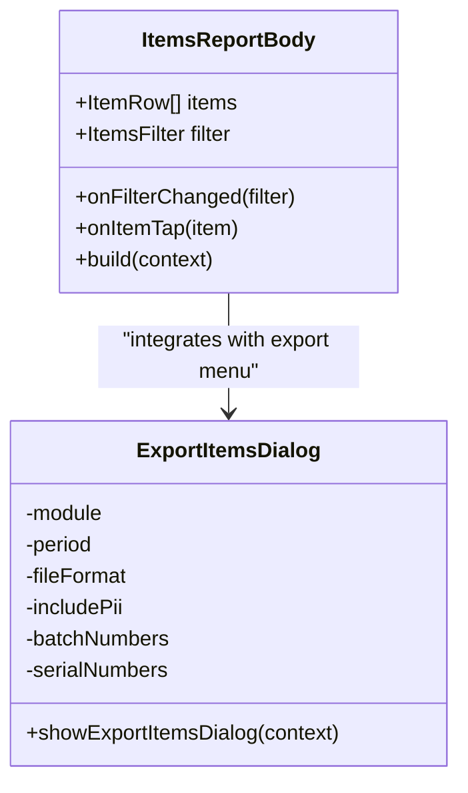
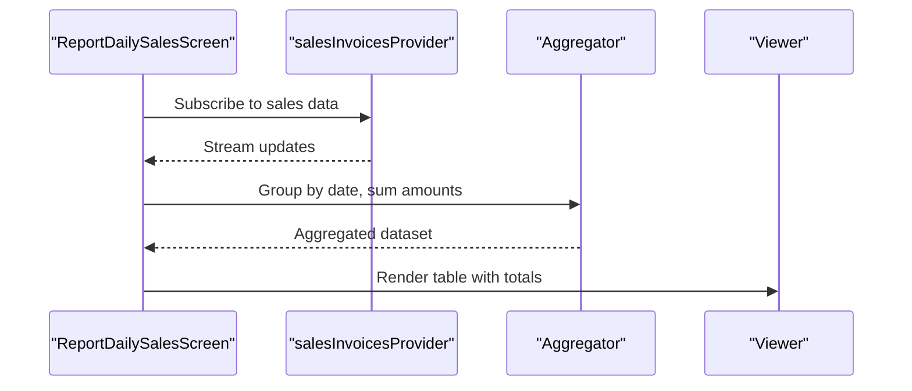
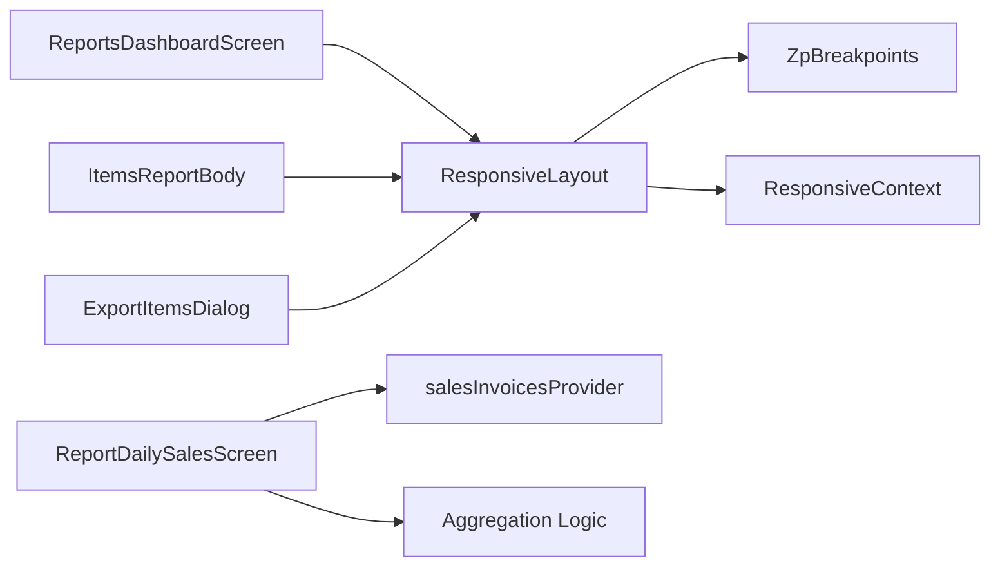

# Reports Module

<cite>
**Referenced Files in This Document**
- [reports_reports_dashboard.dart](file://lib/modules/reports/presentation/reports_reports_dashboard.dart)
- [reports_sales_sales_daily.dart](file://lib/modules/reports/presentation/reports_sales_sales_daily.dart)
- [responsive_layout.dart](file://lib/shared/responsive/responsive_layout.dart)
- [breakpoints.dart](file://lib/shared/responsive/breakpoints.dart)
- [responsive_context.dart](file://lib/shared/responsive/responsive_context.dart)
- [items_report_body.dart](file://lib/modules/items/presentation/sections/report/items_report_body.dart)
- [export_items_dialog.dart](file://lib/modules/items/presentation/sections/report/dialogs/export_items_dialog.dart)
</cite>

## Table of Contents
1. [Introduction](#introduction)
2. [Project Structure](#project-structure)
3. [Core Components](#core-components)
4. [Architecture Overview](#architecture-overview)
5. [Detailed Component Analysis](#detailed-component-analysis)
6. [Dependency Analysis](#dependency-analysis)
7. [Performance Considerations](#performance-considerations)
8. [Troubleshooting Guide](#troubleshooting-guide)
9. [Conclusion](#conclusion)
10. [Appendices](#appendices)

## Introduction
This document describes the Reports module’s analytics and dashboard functionality. It covers the main dashboard components (sales summaries, inventory levels, financial metrics), the sales reporting system (daily analytics), inventory reporting capabilities (stock levels and valuation), responsive design support, integration with real-time data sources, filtering and customization options, export capabilities, and performance considerations for large datasets. It also outlines common reporting scenarios and potential integration with external business intelligence tools.

## Project Structure
The Reports module is organized under the Flutter application’s modules and shared responsive utilities:
- Reports screens: dashboard and daily sales report
- Shared responsive utilities: breakpoints, device size detection, and layout helpers
- Inventory reporting UI: items report body and export dialog
- Sales reporting: daily sales aggregation and display

**Diagram sources**
- [reports_reports_dashboard.dart](file://lib/modules/reports/presentation/reports_reports_dashboard.dart#L1-L214)
- [reports_sales_sales_daily.dart](file://lib/modules/reports/presentation/reports_sales_sales_daily.dart#L1-L213)
- [responsive_layout.dart](file://lib/shared/responsive/responsive_layout.dart#L1-L48)
- [breakpoints.dart](file://lib/shared/responsive/breakpoints.dart#L1-L64)
- [responsive_context.dart](file://lib/shared/responsive/responsive_context.dart#L1-L20)
- [items_report_body.dart](file://lib/modules/items/presentation/sections/report/items_report_body.dart#L1-L187)
- [export_items_dialog.dart](file://lib/modules/items/presentation/sections/report/dialogs/export_items_dialog.dart#L1-L843)

**Section sources**
- [reports_reports_dashboard.dart](file://lib/modules/reports/presentation/reports_reports_dashboard.dart#L1-L214)
- [reports_sales_sales_daily.dart](file://lib/modules/reports/presentation/reports_sales_sales_daily.dart#L1-L213)
- [responsive_layout.dart](file://lib/shared/responsive/responsive_layout.dart#L1-L48)
- [breakpoints.dart](file://lib/shared/responsive/breakpoints.dart#L1-L64)
- [responsive_context.dart](file://lib/shared/responsive/responsive_context.dart#L1-L20)
- [items_report_body.dart](file://lib/modules/items/presentation/sections/report/items_report_body.dart#L1-L187)
- [export_items_dialog.dart](file://lib/modules/items/presentation/sections/report/dialogs/export_items_dialog.dart#L1-L843)

## Core Components
- Reports Dashboard Screen
  - Displays summary cards for key metrics (e.g., total sales, total customers, pending invoices, escaped profits)
  - Provides categorized navigation to report types (Sales, Inventory, Receivables, Tax)
  - Uses a responsive card-based layout for report categories
- Daily Sales Report Screen
  - Consumes sales data via Riverpod provider
  - Groups sales by date, computes invoice counts and totals per day
  - Renders a tabular summary with totals and loading/error states
- Responsive Utilities
  - Logical breakpoints and device-size helpers for adaptive layouts
  - A flexible ResponsiveLayout wrapper for desktop/tablet/mobile views
- Items Report Body
  - Supports list and grid view modes, sorting, selection, and filtering
  - Integrates with overlay menus for actions and export templates
- Export Items Dialog
  - Configurable export options for module, period, decimal format, file format, and additional fields
  - Includes safeguards and guidance for large datasets

**Section sources**
- [reports_reports_dashboard.dart](file://lib/modules/reports/presentation/reports_reports_dashboard.dart#L32-L212)
- [reports_sales_sales_daily.dart](file://lib/modules/reports/presentation/reports_sales_sales_daily.dart#L9-L204)
- [responsive_layout.dart](file://lib/shared/responsive/responsive_layout.dart#L7-L47)
- [breakpoints.dart](file://lib/shared/responsive/breakpoints.dart#L8-L64)
- [responsive_context.dart](file://lib/shared/responsive/responsive_context.dart#L5-L19)
- [items_report_body.dart](file://lib/modules/items/presentation/sections/report/items_report_body.dart#L44-L187)
- [export_items_dialog.dart](file://lib/modules/items/presentation/sections/report/dialogs/export_items_dialog.dart#L477-L774)

## Architecture Overview
The Reports module follows a layered architecture:
- Presentation layer: Screens and widgets render dashboards and reports
- State management: Riverpod providers supply sales data to the daily sales screen
- Responsive layer: Breakpoints and context helpers adapt UI to device sizes
- Data aggregation: Screens compute summaries (e.g., daily totals) from raw records
- Export layer: Dialogs configure and trigger exports for report data

**Diagram sources**
- [reports_reports_dashboard.dart](file://lib/modules/reports/presentation/reports_reports_dashboard.dart#L5-L30)
- [reports_sales_sales_daily.dart](file://lib/modules/reports/presentation/reports_sales_sales_daily.dart#L9-L204)
- [responsive_layout.dart](file://lib/shared/responsive/responsive_layout.dart#L7-L47)
- [breakpoints.dart](file://lib/shared/responsive/breakpoints.dart#L8-L22)
- [responsive_context.dart](file://lib/shared/responsive/responsive_context.dart#L5-L19)
- [items_report_body.dart](file://lib/modules/items/presentation/sections/report/items_report_body.dart#L44-L187)
- [export_items_dialog.dart](file://lib/modules/items/presentation/sections/report/dialogs/export_items_dialog.dart#L477-L774)

## Detailed Component Analysis

### Reports Dashboard Screen
- Summary Cards
  - Displays KPIs such as total sales, customer counts, pending invoices, and profit metrics
  - Uses a responsive card layout with consistent styling and spacing
- Report Categories Grid
  - Presents categorized report types with icons and actionable items
  - Routes to specific report screens (e.g., Daily Sales) via navigation

**Diagram sources**
- [reports_reports_dashboard.dart](file://lib/modules/reports/presentation/reports_reports_dashboard.dart#L32-L212)

**Section sources**
- [reports_reports_dashboard.dart](file://lib/modules/reports/presentation/reports_reports_dashboard.dart#L32-L212)

### Daily Sales Report Screen
- Data Consumption
  - Watches a Riverpod provider for sales invoices
  - Handles loading, empty, and error states
- Aggregation
  - Groups sales by date (year-month-day)
  - Computes invoice count and total amount per day
  - Sorts dates descending and renders a summary table with totals
- Rendering
  - Uses a bordered table with flexible column widths
  - Applies consistent typography and alignment for readability

**Diagram sources**
- [reports_sales_sales_daily.dart](file://lib/modules/reports/presentation/reports_sales_sales_daily.dart#L9-L204)

**Section sources**
- [reports_sales_sales_daily.dart](file://lib/modules/reports/presentation/reports_sales_sales_daily.dart#L9-L204)

### Responsive Design Implementation
- Logical Breakpoints
  - Defines thresholds for mobile, tablet, desktop, and large desktop widths
  - Provides helper functions to determine device size from context
- Responsive Layout Wrapper
  - Selects desktop, tablet, or mobile UI based on viewport constraints
  - Ensures consistent layout across devices

**Diagram sources**
- [breakpoints.dart](file://lib/shared/responsive/breakpoints.dart#L8-L37)
- [responsive_layout.dart](file://lib/shared/responsive/responsive_layout.dart#L32-L46)

**Section sources**
- [breakpoints.dart](file://lib/shared/responsive/breakpoints.dart#L8-L64)
- [responsive_layout.dart](file://lib/shared/responsive/responsive_layout.dart#L7-L47)
- [responsive_context.dart](file://lib/shared/responsive/responsive_context.dart#L5-L19)

### Inventory Reporting Capabilities
- Items Report Body
  - Supports list and grid view modes
  - Provides sorting across multiple fields (name, reorder level, SKU, stock on hand, HSN/SAC rate)
  - Manages selection state and integrates with overlay menus for actions
- Export Items Dialog
  - Allows selecting module, period, decimal format, and file format
  - Offers optional inclusion of sensitive data and additional fields (batch/serial numbers)
  - Includes guidance for large datasets and export initiation feedback

**Diagram sources**
- [items_report_body.dart](file://lib/modules/items/presentation/sections/report/items_report_body.dart#L44-L187)
- [export_items_dialog.dart](file://lib/modules/items/presentation/sections/report/dialogs/export_items_dialog.dart#L477-L774)

**Section sources**
- [items_report_body.dart](file://lib/modules/items/presentation/sections/report/items_report_body.dart#L44-L187)
- [export_items_dialog.dart](file://lib/modules/items/presentation/sections/report/dialogs/export_items_dialog.dart#L477-L774)

### Financial Metrics and Turnover Analysis
- Current Coverage
  - The dashboard displays high-level financial KPIs (e.g., total sales, pending invoices)
  - The daily sales report aggregates revenue by date
- Extension Opportunities
  - Add turnover calculations by computing cost of goods sold against average inventory
  - Integrate receivable aging and tax liability summaries from existing categories
  - Provide pivot-style analytics for deeper insights (customer, product, region)

[No sources needed since this section provides extension guidance]

### Real-Time Data Integration and Historical Aggregation
- Real-Time Data
  - The daily sales screen subscribes to a Riverpod provider for live sales data
  - Loading and error states ensure robust UX during data fetch
- Historical Aggregation
  - Aggregates sales into daily buckets; can be extended to weekly/monthly periods
  - Sorting and totals computed client-side for quick insights

**Diagram sources**
- [reports_sales_sales_daily.dart](file://lib/modules/reports/presentation/reports_sales_sales_daily.dart#L13-L204)

**Section sources**
- [reports_sales_sales_daily.dart](file://lib/modules/reports/presentation/reports_sales_sales_daily.dart#L13-L204)

### Customizable Report Parameters and Filtering
- Items Report Body
  - Sorting controls for multiple fields with ascending/descending toggles
  - View mode switching between list and grid
  - Selection management for batch actions
- Export Items Dialog
  - Module selection, period options, and file format choices
  - Optional inclusion of PII and additional fields
  - Password protection for exported files

**Section sources**
- [items_report_body.dart](file://lib/modules/items/presentation/sections/report/items_report_body.dart#L91-L178)
- [export_items_dialog.dart](file://lib/modules/items/presentation/sections/report/dialogs/export_items_dialog.dart#L576-L774)

### Chart Rendering and Data Visualization Components
- Current Implementation
  - The dashboard and daily sales report use basic cards and tables
- Recommendations
  - Introduce chart libraries for trend visualization (e.g., line charts for daily sales, pie charts for category breakdowns)
  - Ensure charts are responsive and adapt to device size using the shared responsive utilities
  - Provide interactive drill-down capabilities from summary cards to detailed tables

[No sources needed since this section provides recommendations]

## Dependency Analysis
The Reports module interacts with shared responsive utilities and the items reporting UI. The daily sales screen depends on Riverpod for data and performs client-side aggregation.

**Diagram sources**
- [reports_reports_dashboard.dart](file://lib/modules/reports/presentation/reports_reports_dashboard.dart#L5-L30)
- [reports_sales_sales_daily.dart](file://lib/modules/reports/presentation/reports_sales_sales_daily.dart#L9-L204)
- [responsive_layout.dart](file://lib/shared/responsive/responsive_layout.dart#L7-L47)
- [breakpoints.dart](file://lib/shared/responsive/breakpoints.dart#L8-L22)
- [responsive_context.dart](file://lib/shared/responsive/responsive_context.dart#L5-L19)
- [items_report_body.dart](file://lib/modules/items/presentation/sections/report/items_report_body.dart#L44-L187)
- [export_items_dialog.dart](file://lib/modules/items/presentation/sections/report/dialogs/export_items_dialog.dart#L477-L774)

**Section sources**
- [reports_reports_dashboard.dart](file://lib/modules/reports/presentation/reports_reports_dashboard.dart#L5-L30)
- [reports_sales_sales_daily.dart](file://lib/modules/reports/presentation/reports_sales_sales_daily.dart#L9-L204)
- [responsive_layout.dart](file://lib/shared/responsive/responsive_layout.dart#L7-L47)
- [breakpoints.dart](file://lib/shared/responsive/breakpoints.dart#L8-L22)
- [responsive_context.dart](file://lib/shared/responsive/responsive_context.dart#L5-L19)
- [items_report_body.dart](file://lib/modules/items/presentation/sections/report/items_report_body.dart#L44-L187)
- [export_items_dialog.dart](file://lib/modules/items/presentation/sections/report/dialogs/export_items_dialog.dart#L477-L774)

## Performance Considerations
- Client-Side Aggregation
  - Grouping and totaling occur in memory; for very large datasets, consider pagination or server-side aggregation
- Rendering Efficiency
  - Use virtualized lists for long report tables to reduce widget tree size
  - Debounce filters and sorting to avoid frequent rebuilds
- Responsive Rendering
  - Prefer flexibly sized columns and adaptive layouts to minimize reflows
- Export Limits
  - Respect dataset limits in export dialogs and guide users to backup/download for larger exports

[No sources needed since this section provides general guidance]

## Troubleshooting Guide
- Daily Sales Report Issues
  - Empty state: Verify provider subscription and ensure sales data exists
  - Error state: Inspect provider error handling and network/service availability
- Responsive Layout Problems
  - Confirm breakpoint thresholds and device size helpers are applied consistently
- Export Failures
  - Validate selected file format and template compatibility
  - Ensure password meets complexity requirements and export permissions are granted

**Section sources**
- [reports_sales_sales_daily.dart](file://lib/modules/reports/presentation/reports_sales_sales_daily.dart#L184-L199)
- [responsive_context.dart](file://lib/shared/responsive/responsive_context.dart#L5-L19)
- [export_items_dialog.dart](file://lib/modules/items/presentation/sections/report/dialogs/export_items_dialog.dart#L745-L751)

## Conclusion
The Reports module currently provides a dashboard overview and a daily sales analytics screen with responsive design support. Inventory reporting is present through the items report body and export dialog. To meet advanced analytics needs, consider extending aggregation to weekly/monthly periods, adding chart components, and integrating deeper financial metrics. The existing responsive utilities and provider-based data flow offer a solid foundation for future enhancements.

## Appendices
- Common Reporting Scenarios
  - Daily sales review: open the daily sales report and review the aggregated totals
  - Inventory snapshot: switch to grid/list view in the items report and apply filters
  - Export inventory data: open the export dialog, select desired options, and confirm export
- Custom Report Creation
  - Extend the items report body with additional sort fields and filters
  - Add new report categories in the dashboard grid and wire navigation to dedicated screens
- BI Tool Integration
  - Use the export dialog to produce CSV/XLSX files for ingestion into external BI platforms
  - Consider exposing provider data via REST endpoints for direct integrations

[No sources needed since this section provides general guidance]