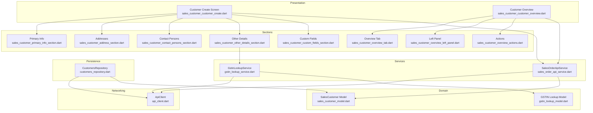
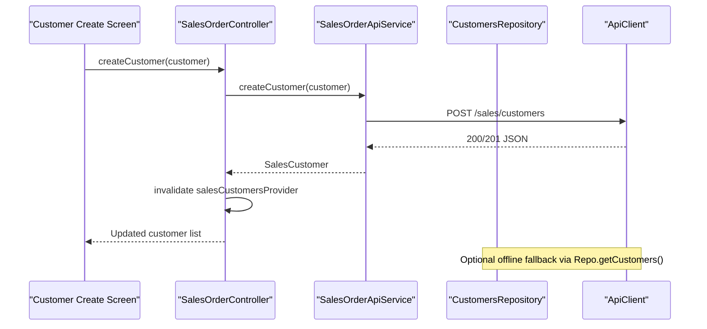
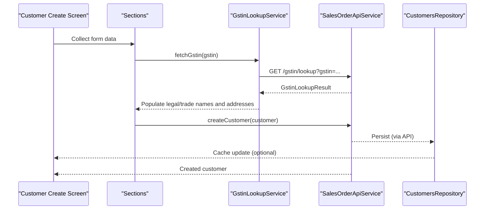
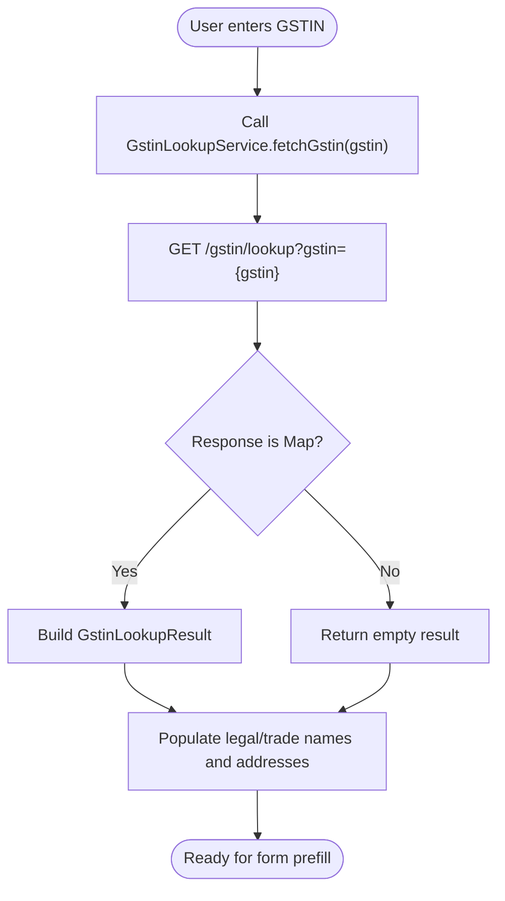
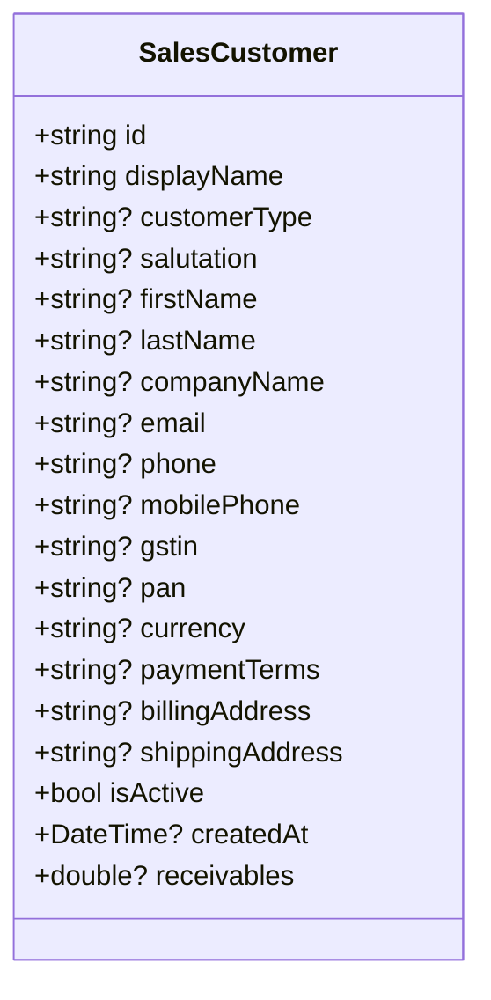
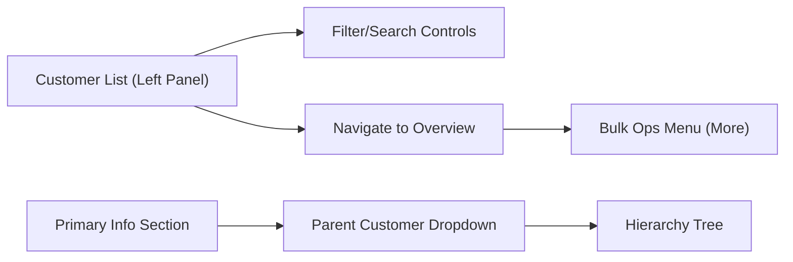
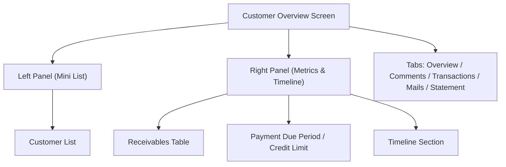
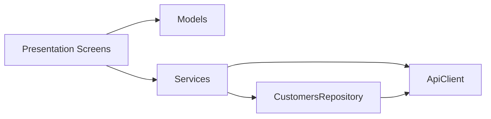

# Customer Management

<cite>
**Referenced Files in This Document**
- [sales_customer_model.dart](file://lib/modules/sales/models/sales_customer_model.dart)
- [gstin_lookup_model.dart](file://lib/modules/sales/models/gstin_lookup_model.dart)
- [gstin_lookup_service.dart](file://lib/modules/sales/services/gstin_lookup_service.dart)
- [customers_repository.dart](file://lib/modules/sales/repositories/customers_repository.dart)
- [sales_customer_customer_create.dart](file://lib/modules/sales/presentation/sales_customer_customer_create.dart)
- [sales_customer_primary_info_section.dart](file://lib/modules/sales/presentation/sections/sales_customer_primary_info_section.dart)
- [sales_customer_address_section.dart](file://lib/modules/sales/presentation/sections/sales_customer_address_section.dart)
- [sales_customer_contact_persons_section.dart](file://lib/modules/sales/presentation/sections/sales_customer_contact_persons_section.dart)
- [sales_customer_other_details_section.dart](file://lib/modules/sales/presentation/sections/sales_customer_other_details_section.dart)
- [sales_customer_custom_fields_section.dart](file://lib/modules/sales/presentation/sections/sales_customer_custom_fields_section.dart)
- [sales_customer_customer_overview.dart](file://lib/modules/sales/presentation/sales_customer_customer_overview.dart)
- [sales_customer_overview_tab.dart](file://lib/modules/sales/presentation/sections/sales_customer_overview_tab.dart)
- [sales_customer_overview_left_panel.dart](file://lib/modules/sales/presentation/sections/sales_customer_overview_left_panel.dart)
- [sales_customer_overview_actions.dart](file://lib/modules/sales/presentation/sections/sales_customer_overview_actions.dart)
- [sales_order_controller.dart](file://lib/modules/sales/controller/sales_order_controller.dart)
- [sales_order_api_service.dart](file://lib/modules/sales/services/sales_order_api_service.dart)
- [api_client.dart](file://lib/shared/services/api_client.dart)
</cite>

## Table of Contents
1. [Introduction](#introduction)
2. [Project Structure](#project-structure)
3. [Core Components](#core-components)
4. [Architecture Overview](#architecture-overview)
5. [Detailed Component Analysis](#detailed-component-analysis)
6. [Dependency Analysis](#dependency-analysis)
7. [Performance Considerations](#performance-considerations)
8. [Troubleshooting Guide](#troubleshooting-guide)
9. [Conclusion](#conclusion)
10. [Appendices](#appendices)

## Introduction
This document describes the Customer Management system within the Sales module. It covers end-to-end workflows for customer creation (including GST registration, contact persons, and addresses), profile management (credit limits, payment terms, segmentation), GSTIN lookup and compliance validation, search and filtering, bulk operations, hierarchy management, and the customer overview dashboard. It also outlines validation, duplicate detection, and GDPR-related features, with practical examples for onboarding, updates, and compliance verification.

## Project Structure
The Sales module organizes customer management across models, services, repositories, controllers, and presentation layers:
- Models define the customer entity and GSTIN lookup results.
- Services encapsulate API interactions for customers and GSTIN lookups.
- Repositories implement online-first caching with offline fallback.
- Controllers expose Riverpod providers for reactive UI updates.
- Presentation screens assemble forms, sections, and dashboards.

**Diagram sources**
- [sales_customer_customer_create.dart](file://lib/modules/sales/presentation/sales_customer_customer_create.dart#L1-L454)
- [sales_customer_customer_overview.dart](file://lib/modules/sales/presentation/sales_customer_customer_overview.dart#L1-L217)
- [sales_customer_primary_info_section.dart](file://lib/modules/sales/presentation/sections/sales_customer_primary_info_section.dart#L1-L347)
- [sales_customer_address_section.dart](file://lib/modules/sales/presentation/sections/sales_customer_address_section.dart#L1-L275)
- [sales_customer_contact_persons_section.dart](file://lib/modules/sales/presentation/sections/sales_customer_contact_persons_section.dart#L1-L143)
- [sales_customer_other_details_section.dart](file://lib/modules/sales/presentation/sections/sales_customer_other_details_section.dart#L1-L466)
- [sales_customer_custom_fields_section.dart](file://lib/modules/sales/presentation/sections/sales_customer_custom_fields_section.dart#L1-L223)
- [sales_customer_overview_tab.dart](file://lib/modules/sales/presentation/sections/sales_customer_overview_tab.dart#L1-L800)
- [sales_customer_overview_left_panel.dart](file://lib/modules/sales/presentation/sections/sales_customer_overview_left_panel.dart#L1-L173)
- [sales_customer_overview_actions.dart](file://lib/modules/sales/presentation/sections/sales_customer_overview_actions.dart#L1-L252)
- [sales_customer_model.dart](file://lib/modules/sales/models/sales_customer_model.dart#L1-L93)
- [gstin_lookup_model.dart](file://lib/modules/sales/models/gstin_lookup_model.dart#L1-L173)
- [sales_order_api_service.dart](file://lib/modules/sales/services/sales_order_api_service.dart#L1-L192)
- [gstin_lookup_service.dart](file://lib/modules/sales/services/gstin_lookup_service.dart#L1-L28)
- [customers_repository.dart](file://lib/modules/sales/repositories/customers_repository.dart#L1-L165)
- [api_client.dart](file://lib/shared/services/api_client.dart#L1-L62)

**Section sources**
- [sales_customer_model.dart](file://lib/modules/sales/models/sales_customer_model.dart#L1-L93)
- [gstin_lookup_model.dart](file://lib/modules/sales/models/gstin_lookup_model.dart#L1-L173)
- [gstin_lookup_service.dart](file://lib/modules/sales/services/gstin_lookup_service.dart#L1-L28)
- [customers_repository.dart](file://lib/modules/sales/repositories/customers_repository.dart#L1-L165)
- [sales_customer_customer_create.dart](file://lib/modules/sales/presentation/sales_customer_customer_create.dart#L1-L454)
- [sales_customer_customer_overview.dart](file://lib/modules/sales/presentation/sales_customer_customer_overview.dart#L1-L217)
- [sales_order_api_service.dart](file://lib/modules/sales/services/sales_order_api_service.dart#L1-L192)
- [api_client.dart](file://lib/shared/services/api_client.dart#L1-L62)

## Core Components
- SalesCustomer model defines the customer entity with fields for identity, GST/PAN, addresses, currency, payment terms, receivables, and activity status.
- GSTIN lookup model normalizes diverse upstream formats into a unified result with addresses.
- GstinLookupService orchestrates GSTIN fetch via ApiClient and returns a typed result.
- CustomersRepository implements online-first caching with Hive for offline fallback and staleness checks.
- SalesOrderApiService exposes customer CRUD endpoints and integrates with ApiClient.
- Presentation screens assemble multi-section forms and overview dashboards.

Key responsibilities:
- Validation and normalization occur in models and services.
- Persistence and offline availability are handled by the repository.
- UI updates leverage Riverpod providers.

**Section sources**
- [sales_customer_model.dart](file://lib/modules/sales/models/sales_customer_model.dart#L1-L93)
- [gstin_lookup_model.dart](file://lib/modules/sales/models/gstin_lookup_model.dart#L1-L173)
- [gstin_lookup_service.dart](file://lib/modules/sales/services/gstin_lookup_service.dart#L1-L28)
- [customers_repository.dart](file://lib/modules/sales/repositories/customers_repository.dart#L1-L165)
- [sales_order_api_service.dart](file://lib/modules/sales/services/sales_order_api_service.dart#L13-L40)
- [sales_customer_customer_create.dart](file://lib/modules/sales/presentation/sales_customer_customer_create.dart#L233-L269)

## Architecture Overview
The system follows a layered architecture:
- Presentation: Screens and sections render forms and dashboards.
- Domain: Models represent business entities.
- Services: Encapsulate API interactions and domain logic.
- Repository: Manage persistence and caching.
- Networking: Centralized HTTP client with interceptors.

**Diagram sources**
- [sales_customer_customer_create.dart](file://lib/modules/sales/presentation/sales_customer_customer_create.dart#L233-L269)
- [sales_order_controller.dart](file://lib/modules/sales/controller/sales_order_controller.dart#L107-L117)
- [sales_order_api_service.dart](file://lib/modules/sales/services/sales_order_api_service.dart#L27-L40)
- [customers_repository.dart](file://lib/modules/sales/repositories/customers_repository.dart#L78-L98)
- [api_client.dart](file://lib/shared/services/api_client.dart#L50-L52)

## Detailed Component Analysis

### Customer Creation Workflow
End-to-end creation includes:
- Primary info (type, names, company, display name, parent, emails, numbers, language).
- Addresses (billing and shipping, copy billing to shipping).
- GSTIN lookup and tax treatment (legal/trade names, place of supply).
- Other details (PAN, tax preference, currency, opening balance, credit limit, payment terms, price list, portal enablement).
- Contact persons (repeatable rows with salutation, names, emails, phones).
- Custom fields, reporting tags, remarks, assigned staff, referrals.

**Diagram sources**
- [sales_customer_customer_create.dart](file://lib/modules/sales/presentation/sales_customer_customer_create.dart#L233-L269)
- [sales_customer_primary_info_section.dart](file://lib/modules/sales/presentation/sections/sales_customer_primary_info_section.dart#L1-L347)
- [sales_customer_address_section.dart](file://lib/modules/sales/presentation/sections/sales_customer_address_section.dart#L1-L275)
- [sales_customer_other_details_section.dart](file://lib/modules/sales/presentation/sections/sales_customer_other_details_section.dart#L1-L466)
- [sales_customer_contact_persons_section.dart](file://lib/modules/sales/presentation/sections/sales_customer_contact_persons_section.dart#L1-L143)
- [gstin_lookup_service.dart](file://lib/modules/sales/services/gstin_lookup_service.dart#L7-L26)
- [sales_order_api_service.dart](file://lib/modules/sales/services/sales_order_api_service.dart#L27-L40)
- [customers_repository.dart](file://lib/modules/sales/repositories/customers_repository.dart#L78-L98)

**Section sources**
- [sales_customer_customer_create.dart](file://lib/modules/sales/presentation/sales_customer_customer_create.dart#L27-L270)
- [sales_customer_primary_info_section.dart](file://lib/modules/sales/presentation/sections/sales_customer_primary_info_section.dart#L3-L327)
- [sales_customer_address_section.dart](file://lib/modules/sales/presentation/sections/sales_customer_address_section.dart#L3-L275)
- [sales_customer_other_details_section.dart](file://lib/modules/sales/presentation/sections/sales_customer_other_details_section.dart#L3-L466)
- [sales_customer_contact_persons_section.dart](file://lib/modules/sales/presentation/sections/sales_customer_contact_persons_section.dart#L3-L143)
- [gstin_lookup_service.dart](file://lib/modules/sales/services/gstin_lookup_service.dart#L1-L28)

### GSTIN Lookup and Compliance Validation
- The service calls a backend endpoint with the GSTIN query parameter.
- The result is normalized into a unified model with addresses and metadata.
- The UI enables fetching details and populates legal/trade names and addresses when available.

**Diagram sources**
- [gstin_lookup_service.dart](file://lib/modules/sales/services/gstin_lookup_service.dart#L7-L26)
- [gstin_lookup_model.dart](file://lib/modules/sales/models/gstin_lookup_model.dart#L1-L173)

**Section sources**
- [gstin_lookup_service.dart](file://lib/modules/sales/services/gstin_lookup_service.dart#L1-L28)
- [gstin_lookup_model.dart](file://lib/modules/sales/models/gstin_lookup_model.dart#L1-L173)

### Customer Profile Management
- Credit limits and payment terms are captured during creation and can be edited inline in the overview.
- Currency selection supports multiple options with formatting.
- Tax preference toggles between taxable and exempt, optionally requiring a reason.
- Place of supply influences GST calculations.
- Parent customer linkage enables hierarchical purchasing.

**Diagram sources**
- [sales_customer_model.dart](file://lib/modules/sales/models/sales_customer_model.dart#L1-L93)

**Section sources**
- [sales_customer_other_details_section.dart](file://lib/modules/sales/presentation/sections/sales_customer_other_details_section.dart#L11-L466)
- [sales_customer_overview_tab.dart](file://lib/modules/sales/presentation/sections/sales_customer_overview_tab.dart#L285-L303)

### Customer Search, Filtering, Bulk Operations, and Hierarchy
- Overview left panel lists customers with quick navigation and collapse/expand behavior.
- Filtering and search are supported via the customer list and dropdowns in sections.
- Bulk operations are exposed via the “More” menu in the overview actions.
- Parent-child linking is available in primary info to establish hierarchy.

**Diagram sources**
- [sales_customer_overview_left_panel.dart](file://lib/modules/sales/presentation/sections/sales_customer_overview_left_panel.dart#L1-L173)
- [sales_customer_overview_actions.dart](file://lib/modules/sales/presentation/sections/sales_customer_overview_actions.dart#L1-L252)
- [sales_customer_primary_info_section.dart](file://lib/modules/sales/presentation/sections/sales_customer_primary_info_section.dart#L107-L164)

**Section sources**
- [sales_customer_overview_left_panel.dart](file://lib/modules/sales/presentation/sections/sales_customer_overview_left_panel.dart#L1-L173)
- [sales_customer_overview_actions.dart](file://lib/modules/sales/presentation/sections/sales_customer_overview_actions.dart#L1-L252)
- [sales_customer_primary_info_section.dart](file://lib/modules/sales/presentation/sections/sales_customer_primary_info_section.dart#L107-L164)

### Customer Overview Dashboard
- Left panel: collapsible customer list with receivable highlights.
- Right panel: Receivables summary, payment due period, credit limit, timeline, and counts.
- Inline editing for select fields; address blocks support editing.
- Attachments panel and transaction/comment/mail/statement tabs.

**Diagram sources**
- [sales_customer_customer_overview.dart](file://lib/modules/sales/presentation/sales_customer_customer_overview.dart#L1-L217)
- [sales_customer_overview_tab.dart](file://lib/modules/sales/presentation/sections/sales_customer_overview_tab.dart#L1-L800)
- [sales_customer_overview_left_panel.dart](file://lib/modules/sales/presentation/sections/sales_customer_overview_left_panel.dart#L1-L173)

**Section sources**
- [sales_customer_customer_overview.dart](file://lib/modules/sales/presentation/sales_customer_customer_overview.dart#L1-L217)
- [sales_customer_overview_tab.dart](file://lib/modules/sales/presentation/sections/sales_customer_overview_tab.dart#L1-L800)
- [sales_customer_overview_left_panel.dart](file://lib/modules/sales/presentation/sections/sales_customer_overview_left_panel.dart#L1-L173)

### Implementation Details: Validation, Duplicate Detection, GDPR
- Data validation occurs at the UI level via form controls and dropdowns, ensuring required fields and controlled selections.
- Duplicate detection is not explicitly implemented in the UI; however, the backend is responsible for enforcing uniqueness constraints. The repository caches and returns data without explicit duplicate checks.
- GDPR features are not explicitly implemented in the customer module; ensure privacy controls and consent mechanisms are configured at the application level.

[No sources needed since this section provides general guidance]

## Dependency Analysis
- Presentation depends on models and services.
- Services depend on ApiClient for HTTP requests.
- Repository depends on ApiClient and Hive for caching.
- Controllers depend on services/providers for reactive updates.

**Diagram sources**
- [sales_customer_customer_create.dart](file://lib/modules/sales/presentation/sales_customer_customer_create.dart#L1-L454)
- [sales_order_api_service.dart](file://lib/modules/sales/services/sales_order_api_service.dart#L1-L192)
- [customers_repository.dart](file://lib/modules/sales/repositories/customers_repository.dart#L1-L165)
- [api_client.dart](file://lib/shared/services/api_client.dart#L1-L62)

**Section sources**
- [sales_order_api_service.dart](file://lib/modules/sales/services/sales_order_api_service.dart#L1-L192)
- [customers_repository.dart](file://lib/modules/sales/repositories/customers_repository.dart#L1-L165)
- [api_client.dart](file://lib/shared/services/api_client.dart#L1-L62)

## Performance Considerations
- Online-first caching reduces latency and improves reliability; fallback to cached data is automatic on failure.
- Staleness thresholds prevent outdated data usage.
- Large lists benefit from virtualization and lazy loading in the overview left panel.
- Debounce or batch operations for bulk actions to avoid excessive network calls.

[No sources needed since this section provides general guidance]

## Troubleshooting Guide
Common issues and resolutions:
- API failures during customer creation/update: The repository logs warnings and rethrows; inspect logs and retry.
- GSTIN lookup failures: Verify network connectivity and endpoint availability; confirm GSTIN format.
- Offline mode: If API fails, cached data is returned; ensure cache is fresh or refresh manually.

**Section sources**
- [customers_repository.dart](file://lib/modules/sales/repositories/customers_repository.dart#L34-L49)
- [sales_order_api_service.dart](file://lib/modules/sales/services/sales_order_api_service.dart#L27-L40)

## Conclusion
The Customer Management system provides a robust, layered architecture supporting end-to-end customer lifecycle operations. It emphasizes usability with multi-section forms, compliance with GSTIN lookup and tax configuration, and operational visibility via the overview dashboard. The repository’s online-first caching ensures resilience, while Riverpod enables reactive UI updates. Extending validation, duplicate detection, and GDPR features at the backend and UI will further strengthen the system.

## Appendices

### Practical Examples

- Customer Onboarding Workflow
  - Open the customer creation screen, fill primary info, addresses, and GSTIN details.
  - Use the GSTIN lookup to auto-fill legal/trade names and addresses.
  - Set credit limit, payment terms, and tax preference; add contact persons and custom fields.
  - Save and verify the new customer appears in the overview list.

- Profile Updates
  - Navigate to the customer overview; click edit icons to inline-edit fields like language, GST treatment, and place of supply.
  - Update payment terms and credit limit; save changes to persist.

- Compliance Verification
  - Enter a GSTIN and trigger the lookup; review fetched legal/trade names and addresses.
  - Confirm taxpayer type and status; adjust tax preference and exemption reason if applicable.

[No sources needed since this section provides general guidance]