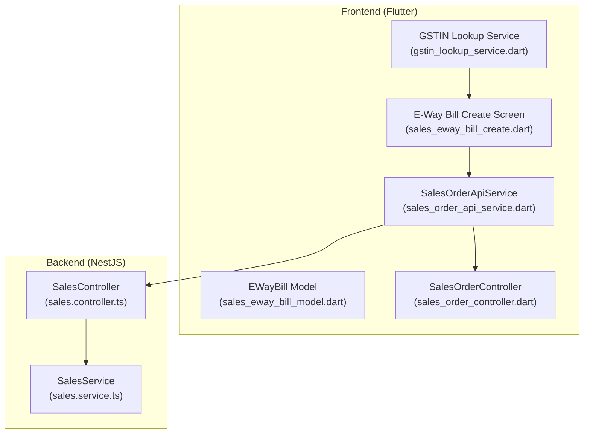
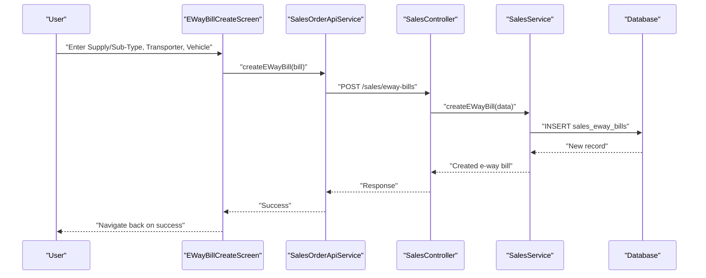
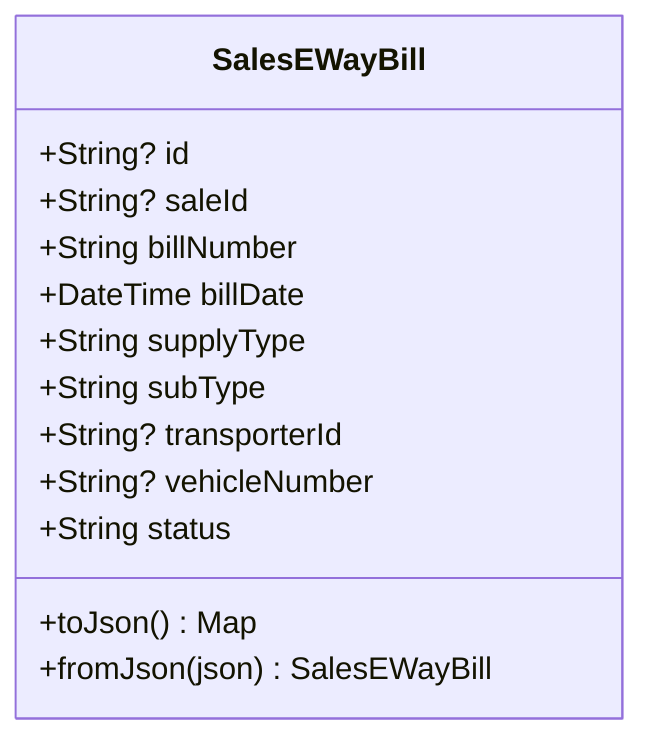
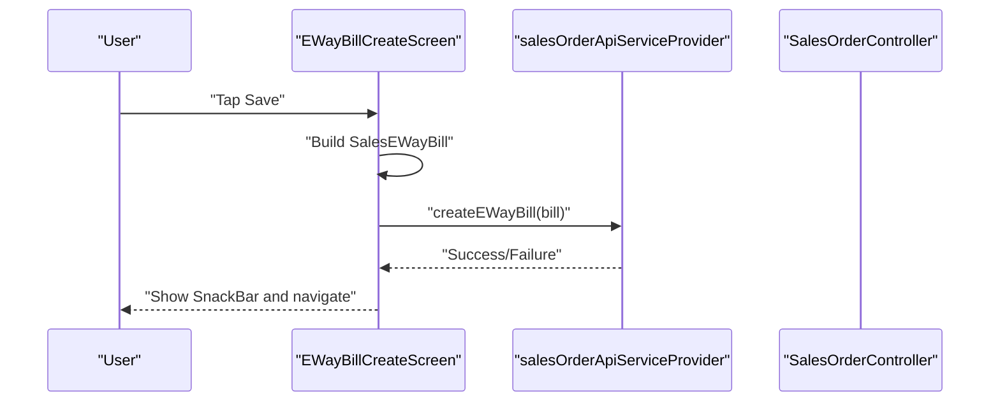
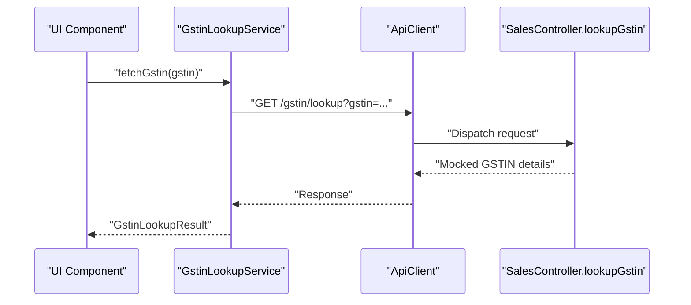
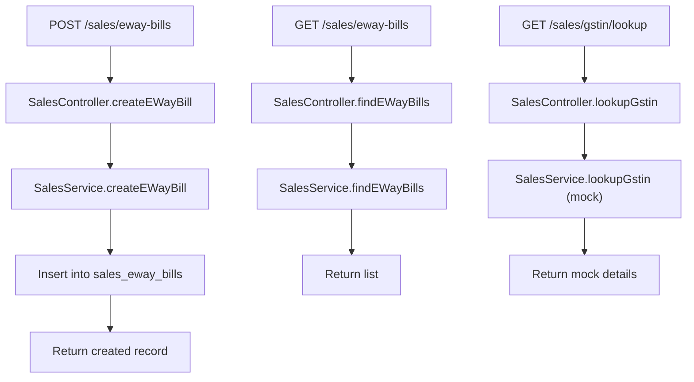
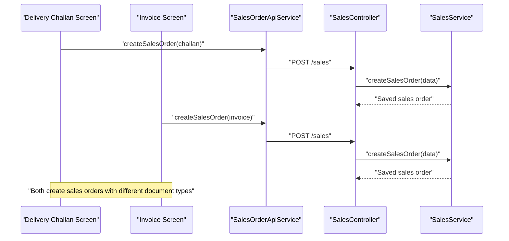
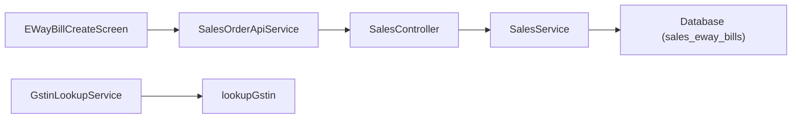

# E-Way Bill Generation

<cite>
**Referenced Files in This Document**
- [sales_eway_bill_model.dart](file://lib/modules/sales/models/sales_eway_bill_model.dart)
- [sales_eway_bill_create.dart](file://lib/modules/sales/presentation/sales_eway_bill_create.dart)
- [gstin_lookup_service.dart](file://lib/modules/sales/services/gstin_lookup_service.dart)
- [sales_order_controller.dart](file://lib/modules/sales/controller/sales_order_controller.dart)
- [sales_order_api_service.dart](file://lib/modules/sales/services/sales_order_api_service.dart)
- [sales_delivery_challan_create.dart](file://lib/modules/sales/presentation/sales_delivery_challan_create.dart)
- [sales_invoice_invoice_create.dart](file://lib/modules/sales/presentation/sales_invoice_invoice_create.dart)
- [sales.service.ts](file://backend/src/sales/sales.service.ts)
- [sales.controller.ts](file://backend/src/sales/sales.controller.ts)
</cite>

## Table of Contents
1. [Introduction](#introduction)
2. [Project Structure](#project-structure)
3. [Core Components](#core-components)
4. [Architecture Overview](#architecture-overview)
5. [Detailed Component Analysis](#detailed-component-analysis)
6. [Dependency Analysis](#dependency-analysis)
7. [Performance Considerations](#performance-considerations)
8. [Troubleshooting Guide](#troubleshooting-guide)
9. [Conclusion](#conclusion)
10. [Appendices](#appendices)

## Introduction
This document describes the E-Way Bill Generation system within the ZerpAI ERP platform. It focuses on GST-compliant transportation documentation and covers:
- How e-way bills are created from invoices or delivery challans
- Integration points with GST-related lookups
- Mandatory fields for e-way bill creation (distance, vehicle, transporter, goods)
- Modification and cancellation workflows
- Integration with delivery challans and packing slips
- Compliance considerations for intra-state and inter-state movement, thresholds, and exemptions
- Status tracking, notifications, and audit trail
- Practical scenarios: single/multiple items, consolidated shipments, and returns

## Project Structure
The e-way bill feature spans the frontend Flutter app and the NestJS backend:
- Frontend Flutter screens capture e-way bill inputs and persist via API services/providers
- Backend NestJS controllers and services expose endpoints for e-way bills and GST-related lookups
- Data models represent e-way bill records and integrate with sales documents

**Diagram sources**
- [sales_eway_bill_create.dart](file://lib/modules/sales/presentation/sales_eway_bill_create.dart#L1-L215)
- [sales_eway_bill_model.dart](file://lib/modules/sales/models/sales_eway_bill_model.dart#L1-L52)
- [sales_order_api_service.dart](file://lib/modules/sales/services/sales_order_api_service.dart#L1-L192)
- [sales_order_controller.dart](file://lib/modules/sales/controller/sales_order_controller.dart#L1-L119)
- [gstin_lookup_service.dart](file://lib/modules/sales/services/gstin_lookup_service.dart#L1-L28)
- [sales.controller.ts](file://backend/src/sales/sales.controller.ts#L1-L102)
- [sales.service.ts](file://backend/src/sales/sales.service.ts#L1-L162)

**Section sources**
- [sales_eway_bill_create.dart](file://lib/modules/sales/presentation/sales_eway_bill_create.dart#L1-L215)
- [sales_eway_bill_model.dart](file://lib/modules/sales/models/sales_eway_bill_model.dart#L1-L52)
- [sales_order_api_service.dart](file://lib/modules/sales/services/sales_order_api_service.dart#L1-L192)
- [sales_order_controller.dart](file://lib/modules/sales/controller/sales_order_controller.dart#L1-L119)
- [gstin_lookup_service.dart](file://lib/modules/sales/services/gstin_lookup_service.dart#L1-L28)
- [sales.controller.ts](file://backend/src/sales/sales.controller.ts#L1-L102)
- [sales.service.ts](file://backend/src/sales/sales.service.ts#L1-L162)

## Core Components
- EWayBill model: captures bill number, date, supply/sub-type, transporter, vehicle, and status
- EWayBill create screen: collects transaction and transport details and persists via API service
- SalesOrderApiService: exposes endpoints for e-way bills and integrates with backend
- SalesController/SalesService: backend endpoints and persistence for e-way bills and GSTIN lookup
- GSTIN Lookup Service: supports GST registration verification and address retrieval

Key responsibilities:
- Capture mandatory e-way bill fields
- Persist e-way bill records
- Trigger downstream actions (e.g., real-time validation and generation against GST portal APIs)
- Support delivery challan and invoice linkage for shipment documentation

**Section sources**
- [sales_eway_bill_model.dart](file://lib/modules/sales/models/sales_eway_bill_model.dart#L1-L52)
- [sales_eway_bill_create.dart](file://lib/modules/sales/presentation/sales_eway_bill_create.dart#L193-L214)
- [sales_order_api_service.dart](file://lib/modules/sales/services/sales_order_api_service.dart#L134-L161)
- [sales.service.ts](file://backend/src/sales/sales.service.ts#L128-L145)
- [sales.controller.ts](file://backend/src/sales/sales.controller.ts#L53-L63)

## Architecture Overview
End-to-end flow from UI to backend and potential integration with GST portal APIs:

**Diagram sources**
- [sales_eway_bill_create.dart](file://lib/modules/sales/presentation/sales_eway_bill_create.dart#L193-L214)
- [sales_order_api_service.dart](file://lib/modules/sales/services/sales_order_api_service.dart#L148-L161)
- [sales.controller.ts](file://backend/src/sales/sales.controller.ts#L59-L63)
- [sales.service.ts](file://backend/src/sales/sales.service.ts#L133-L145)

## Detailed Component Analysis

### EWayBill Model
Represents the persisted e-way bill entity with essential fields for GST compliance.

- Fields support intra/inter-state movement classification via supply/sub-type
- Status maintained for lifecycle tracking
- Serialization enables seamless API exchange

**Diagram sources**
- [sales_eway_bill_model.dart](file://lib/modules/sales/models/sales_eway_bill_model.dart#L1-L52)

**Section sources**
- [sales_eway_bill_model.dart](file://lib/modules/sales/models/sales_eway_bill_model.dart#L12-L50)

### EWayBill Create Screen
Collects user inputs and triggers creation via API service.

- Supports supply type and sub-type selection
- Captures transporter ID and vehicle number
- Uses Riverpod provider pattern for API access

**Diagram sources**
- [sales_eway_bill_create.dart](file://lib/modules/sales/presentation/sales_eway_bill_create.dart#L193-L214)
- [sales_order_api_service.dart](file://lib/modules/sales/services/sales_order_api_service.dart#L148-L161)

**Section sources**
- [sales_eway_bill_create.dart](file://lib/modules/sales/presentation/sales_eway_bill_create.dart#L45-L96)
- [sales_eway_bill_create.dart](file://lib/modules/sales/presentation/sales_eway_bill_create.dart#L193-L214)

### GSTIN Lookup Service
Provides GST registration verification and address details.

- Mocked endpoint currently returns predefined details
- Real-world integration would call a GST portal API

**Diagram sources**
- [gstin_lookup_service.dart](file://lib/modules/sales/services/gstin_lookup_service.dart#L7-L26)
- [sales.controller.ts](file://backend/src/sales/sales.controller.ts#L35-L39)
- [sales.service.ts](file://backend/src/sales/sales.service.ts#L8-L27)

**Section sources**
- [gstin_lookup_service.dart](file://lib/modules/sales/services/gstin_lookup_service.dart#L1-L28)
- [sales.service.ts](file://backend/src/sales/sales.service.ts#L8-L27)

### Backend EWayBill Endpoints
Backend controllers and services expose CRUD operations for e-way bills and GSTIN lookup.

**Diagram sources**
- [sales.controller.ts](file://backend/src/sales/sales.controller.ts#L53-L75)
- [sales.service.ts](file://backend/src/sales/sales.service.ts#L128-L161)

**Section sources**
- [sales.controller.ts](file://backend/src/sales/sales.controller.ts#L53-L75)
- [sales.service.ts](file://backend/src/sales/sales.service.ts#L128-L161)

### Integration with Delivery Challans and Invoices
- Delivery Challan creation screen builds a sales order with document type set to “challan”
- Invoice creation screen builds a sales order with document type set to “invoice”
- EWayBill creation screen persists e-way bill records linked to a sale (via saleId)

**Diagram sources**
- [sales_delivery_challan_create.dart](file://lib/modules/sales/presentation/sales_delivery_challan_create.dart#L304-L342)
- [sales_invoice_invoice_create.dart](file://lib/modules/sales/presentation/sales_invoice_invoice_create.dart#L525-L565)
- [sales_order_api_service.dart](file://lib/modules/sales/services/sales_order_api_service.dart#L104-L132)
- [sales.controller.ts](file://backend/src/sales/sales.controller.ts#L77-L95)
- [sales.service.ts](file://backend/src/sales/sales.service.ts#L80-L97)

**Section sources**
- [sales_delivery_challan_create.dart](file://lib/modules/sales/presentation/sales_delivery_challan_create.dart#L317-L327)
- [sales_invoice_invoice_create.dart](file://lib/modules/sales/presentation/sales_invoice_invoice_create.dart#L540-L552)
- [sales_order_api_service.dart](file://lib/modules/sales/services/sales_order_api_service.dart#L104-L132)
- [sales.service.ts](file://backend/src/sales/sales.service.ts#L80-L97)

## Dependency Analysis
- Frontend depends on Riverpod providers and API client to communicate with backend
- Backend controllers depend on SalesService for database operations
- EWayBill persistence relies on sales_eway_bills table schema
- GSTIN lookup is exposed via dedicated endpoint and service method

**Diagram sources**
- [sales_eway_bill_create.dart](file://lib/modules/sales/presentation/sales_eway_bill_create.dart#L193-L214)
- [sales_order_api_service.dart](file://lib/modules/sales/services/sales_order_api_service.dart#L148-L161)
- [sales.controller.ts](file://backend/src/sales/sales.controller.ts#L53-L75)
- [sales.service.ts](file://backend/src/sales/sales.service.ts#L128-L161)
- [gstin_lookup_service.dart](file://lib/modules/sales/services/gstin_lookup_service.dart#L7-L26)

**Section sources**
- [sales_order_controller.dart](file://lib/modules/sales/controller/sales_order_controller.dart#L10-L61)
- [sales_order_api_service.dart](file://lib/modules/sales/services/sales_order_api_service.dart#L134-L191)
- [sales.service.ts](file://backend/src/sales/sales.service.ts#L128-L161)

## Performance Considerations
- Minimize UI rebuilds by using Riverpod providers and immutable models
- Batch network requests where possible (e.g., combine GSTIN lookup with e-way bill creation)
- Cache frequently accessed customer and product data in the frontend
- Use pagination for lists of e-way bills and sales orders
- Debounce user input for GSTIN lookup to avoid excessive API calls

## Troubleshooting Guide
Common issues and resolutions:
- Network failures during e-way bill creation: verify backend connectivity and endpoint availability
- Invalid GSTIN: use GSTIN lookup service to validate and retrieve registered address details
- Missing mandatory fields: ensure supply type, sub-type, transporter ID, and vehicle number are populated
- Duplicate bill numbers: implement uniqueness checks at the backend before insertion
- Audit trail: maintain logs of all e-way bill modifications and cancellations

**Section sources**
- [sales_order_api_service.dart](file://lib/modules/sales/services/sales_order_api_service.dart#L148-L161)
- [gstin_lookup_service.dart](file://lib/modules/sales/services/gstin_lookup_service.dart#L7-L26)
- [sales.service.ts](file://backend/src/sales/sales.service.ts#L133-L145)

## Conclusion
The ZerpAI ERP system provides a structured foundation for e-way bill generation, integrating frontend UI, Riverpod state management, and backend NestJS services. While the current implementation includes mock GSTIN lookup and basic e-way bill persistence, real-world deployment requires:
- Integration with live GST portal APIs for validation and generation
- Implementation of distance calculation, vehicle details, and transporter information
- Endpoints for e-way bill modification and cancellation
- Delivery challan and packing slip integration
- Compliance logic for intra-state vs inter-state, thresholds, and exemptions
- Status tracking, SMS notifications, and audit trails

## Appendices

### Compliance Requirements and Field Mapping
- Intra-state vs inter-state: controlled via supply type and sub-type
- Thresholds and exemptions: configurable in business rules and validated during generation
- Distance calculation: implement based on origin/destination and mode of transport
- Vehicle details and transporter info: captured in e-way bill model and persisted
- Goods description: derived from invoice/challan items

### Practical Scenarios
- Single-item delivery: create invoice, then create e-way bill with vehicle and transporter details
- Multiple items: invoice with multiple lines, consolidate in e-way bill
- Consolidated shipment: multiple invoices/challans mapped to a single e-way bill
- Returns: create delivery challan and e-way bill with appropriate supply/sub-type

[No sources needed since this section provides general guidance]