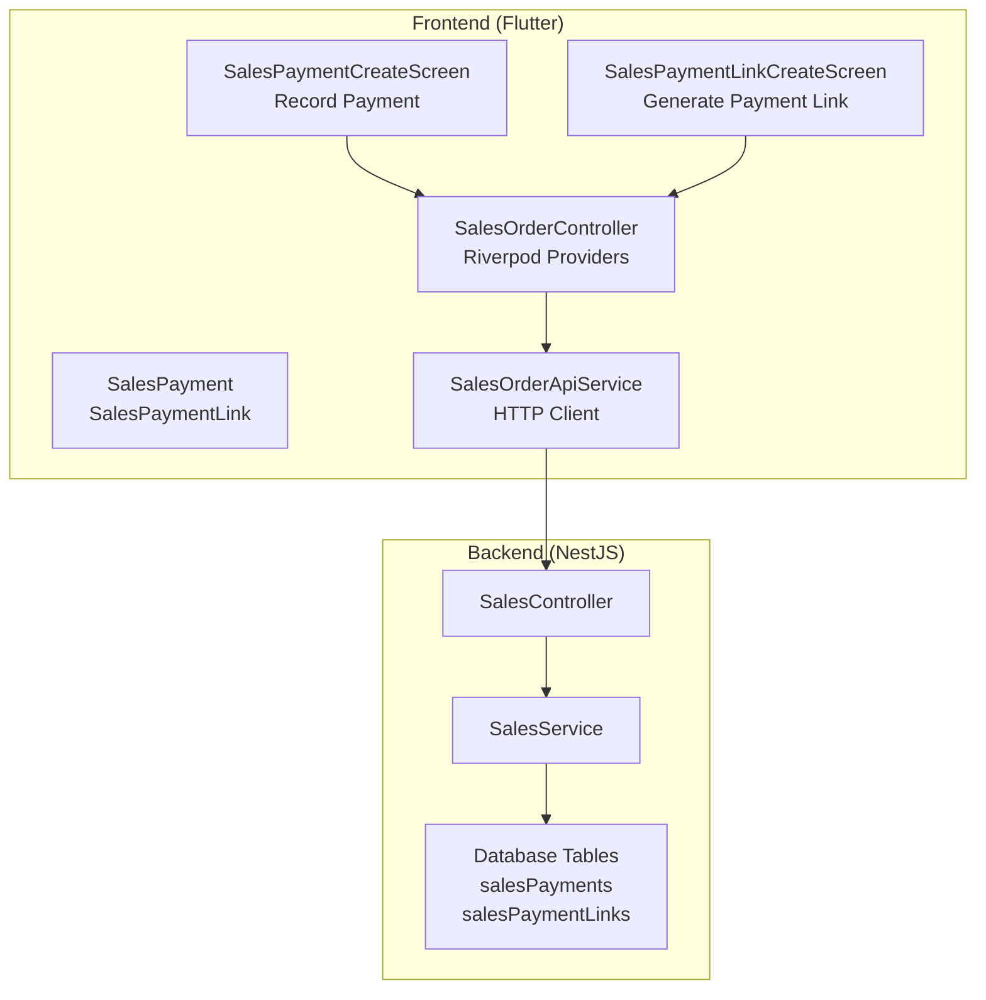
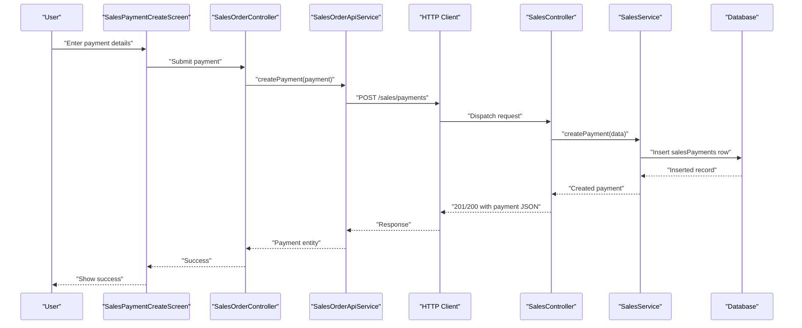
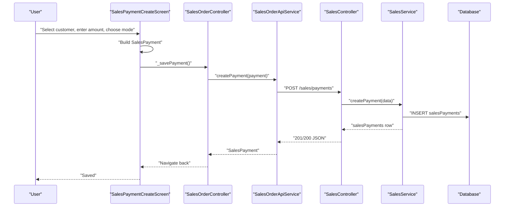
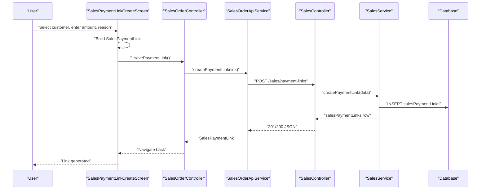
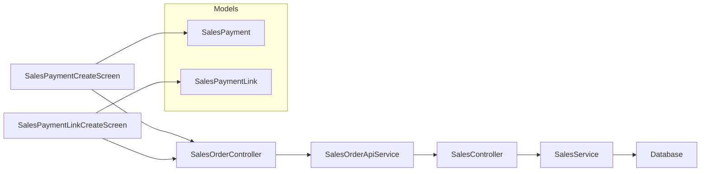

# Payment Processing

<cite>
**Referenced Files in This Document**
- [sales_payment_model.dart](file://lib/modules/sales/models/sales_payment_model.dart)
- [sales_payment_link_model.dart](file://lib/modules/sales/models/sales_payment_link_model.dart)
- [sales_payment_create.dart](file://lib/modules/sales/presentation/sales_payment_create.dart)
- [sales_payment_link_create.dart](file://lib/modules/sales/presentation/sales_payment_link_create.dart)
- [sales_order_controller.dart](file://lib/modules/sales/controller/sales_order_controller.dart)
- [sales_order_api_service.dart](file://lib/modules/sales/services/sales_order_api_service.dart)
- [sales.controller.ts](file://backend/src/sales/sales.controller.ts)
- [sales.service.ts](file://backend/src/sales/sales.service.ts)
</cite>

## Table of Contents
1. [Introduction](#introduction)
2. [Project Structure](#project-structure)
3. [Core Components](#core-components)
4. [Architecture Overview](#architecture-overview)
5. [Detailed Component Analysis](#detailed-component-analysis)
6. [Dependency Analysis](#dependency-analysis)
7. [Performance Considerations](#performance-considerations)
8. [Troubleshooting Guide](#troubleshooting-guide)
9. [Conclusion](#conclusion)
10. [Appendices](#appendices)

## Introduction
This document describes the Payment Processing system within the Sales module of the ERP application. It covers payment collection workflows for cash, bank transfer, card payments, and digital wallet integration via generated payment links. It also documents payment link generation, QR code readiness, mobile payment processing, reconciliation, bank statement matching, cash flow tracking, payment allocation against multiple invoices, partial payments, overpayment handling, reminders and follow-ups, collection management, accounting integration, security and compliance, and practical processing scenarios.

## Project Structure
The payment processing capability spans the frontend Flutter module and the NestJS backend service:
- Frontend (Flutter):
  - Models define payment and payment-link data structures.
  - Presentation screens capture payment inputs and generate payment links.
  - Controllers and services orchestrate API calls and state.
- Backend (NestJS):
  - REST endpoints expose CRUD operations for payments and payment links.
  - Services persist and retrieve data from the database.

**Diagram sources**
- [sales_payment_create.dart](file://lib/modules/sales/presentation/sales_payment_create.dart#L1-L280)
- [sales_payment_link_create.dart](file://lib/modules/sales/presentation/sales_payment_link_create.dart#L1-L141)
- [sales_payment_model.dart](file://lib/modules/sales/models/sales_payment_model.dart#L1-L61)
- [sales_payment_link_model.dart](file://lib/modules/sales/models/sales_payment_link_model.dart#L1-L49)
- [sales_order_controller.dart](file://lib/modules/sales/controller/sales_order_controller.dart#L1-L119)
- [sales_order_api_service.dart](file://lib/modules/sales/services/sales_order_api_service.dart#L1-L192)
- [sales.controller.ts](file://backend/src/sales/sales.controller.ts#L1-L102)
- [sales.service.ts](file://backend/src/sales/sales.service.ts#L1-L162)

**Section sources**
- [sales_payment_model.dart](file://lib/modules/sales/models/sales_payment_model.dart#L1-L61)
- [sales_payment_link_model.dart](file://lib/modules/sales/models/sales_payment_link_model.dart#L1-L49)
- [sales_payment_create.dart](file://lib/modules/sales/presentation/sales_payment_create.dart#L1-L280)
- [sales_payment_link_create.dart](file://lib/modules/sales/presentation/sales_payment_link_create.dart#L1-L141)
- [sales_order_controller.dart](file://lib/modules/sales/controller/sales_order_controller.dart#L1-L119)
- [sales_order_api_service.dart](file://lib/modules/sales/services/sales_order_api_service.dart#L1-L192)
- [sales.controller.ts](file://backend/src/sales/sales.controller.ts#L1-L102)
- [sales.service.ts](file://backend/src/sales/sales.service.ts#L1-L162)

## Core Components
- SalesPayment model: Encapsulates payment metadata including customer reference, payment number/date, mode, amount, bank charges, reference, deposit-to account, and notes.
- SalesPaymentLink model: Encapsulates payment link metadata including customer reference, amount, link number, expiry date, reason, and status.
- SalesPaymentCreateScreen: Captures payment inputs (customer, amount, date, payment mode, deposit-to, reference, notes) and posts to the backend.
- SalesPaymentLinkCreateScreen: Generates a payment link with auto-generated link number and default expiry.
- SalesOrderController: Exposes Riverpod providers for payments and payment links and orchestrates customer and sales data retrieval.
- SalesOrderApiService: Wraps HTTP client calls to the backend for payments and payment links.
- SalesController: REST endpoints for payments and payment links.
- SalesService: Implements persistence for payments and payment links.

**Section sources**
- [sales_payment_model.dart](file://lib/modules/sales/models/sales_payment_model.dart#L1-L61)
- [sales_payment_link_model.dart](file://lib/modules/sales/models/sales_payment_link_model.dart#L1-L49)
- [sales_payment_create.dart](file://lib/modules/sales/presentation/sales_payment_create.dart#L1-L280)
- [sales_payment_link_create.dart](file://lib/modules/sales/presentation/sales_payment_link_create.dart#L1-L141)
- [sales_order_controller.dart](file://lib/modules/sales/controller/sales_order_controller.dart#L1-L119)
- [sales_order_api_service.dart](file://lib/modules/sales/services/sales_order_api_service.dart#L1-L192)
- [sales.controller.ts](file://backend/src/sales/sales.controller.ts#L41-L75)
- [sales.service.ts](file://backend/src/sales/sales.service.ts#L108-L160)

## Architecture Overview
The payment processing architecture follows a layered pattern:
- UI layer captures inputs and triggers actions.
- State and API layer handles data fetching and posting.
- Backend REST endpoints delegate to service layer.
- Service layer persists to the database.

**Diagram sources**
- [sales_payment_create.dart](file://lib/modules/sales/presentation/sales_payment_create.dart#L254-L278)
- [sales_order_controller.dart](file://lib/modules/sales/controller/sales_order_controller.dart#L10-L119)
- [sales_order_api_service.dart](file://lib/modules/sales/services/sales_order_api_service.dart#L77-L90)
- [sales.controller.ts](file://backend/src/sales/sales.controller.ts#L47-L51)
- [sales.service.ts](file://backend/src/sales/sales.service.ts#L113-L126)

## Detailed Component Analysis

### Payment Recording Workflow (Cash, Bank Transfer, Cards, Wallets)
- Inputs captured:
  - Customer selection from a customer list provider.
  - Amount, payment date, payment mode (Cash, Check, Credit Card, Bank Transfer, Other), deposit-to account (Petty Cash, Undeposited Funds, Bank Account), reference number, and notes.
- Submission:
  - Constructs a SalesPayment object and calls SalesOrderApiService.createPayment.
  - On success, navigates back; on error, shows a snackbar with the error message.

**Diagram sources**
- [sales_payment_create.dart](file://lib/modules/sales/presentation/sales_payment_create.dart#L254-L278)
- [sales_order_api_service.dart](file://lib/modules/sales/services/sales_order_api_service.dart#L77-L90)
- [sales.controller.ts](file://backend/src/sales/sales.controller.ts#L47-L51)
- [sales.service.ts](file://backend/src/sales/sales.service.ts#L113-L126)

**Section sources**
- [sales_payment_create.dart](file://lib/modules/sales/presentation/sales_payment_create.dart#L1-L280)
- [sales_order_api_service.dart](file://lib/modules/sales/services/sales_order_api_service.dart#L63-L90)
- [sales.service.ts](file://backend/src/sales/sales.service.ts#L108-L126)

### Payment Link Generation for Online Payments
- Inputs captured:
  - Customer selection, amount, and optional reason.
- Behavior:
  - Generates a link number and sets an expiry date (default 7 days).
  - Calls SalesOrderApiService.createPaymentLink.
  - On success, navigates back; on error, shows a snackbar.

**Diagram sources**
- [sales_payment_link_create.dart](file://lib/modules/sales/presentation/sales_payment_link_create.dart#L118-L139)
- [sales_order_api_service.dart](file://lib/modules/sales/services/sales_order_api_service.dart#L177-L190)
- [sales.controller.ts](file://backend/src/sales/sales.controller.ts#L71-L75)
- [sales.service.ts](file://backend/src/sales/sales.service.ts#L152-L160)

**Section sources**
- [sales_payment_link_create.dart](file://lib/modules/sales/presentation/sales_payment_link_create.dart#L1-L141)
- [sales_order_api_service.dart](file://lib/modules/sales/services/sales_order_api_service.dart#L163-L190)
- [sales.service.ts](file://backend/src/sales/sales.service.ts#L147-L160)

### QR Code Integration and Mobile Payment Processing
- Current implementation generates a payment link with an auto-generated URL. QR code readiness can be achieved by:
  - Using the generated link number to produce a QR code image server-side or client-side.
  - Sharing the QR code via standard channels (email, SMS, in-app).
  - Mobile apps can open the link directly or scan the QR code to proceed to payment.
- No dedicated QR model exists yet; adding a QR code URL or base64 image field to the payment link model would support this feature.

[No sources needed since this section provides conceptual guidance]

### Payment Reconciliation, Bank Statement Matching, and Cash Flow Tracking
- Reconciliation:
  - Retrieve payments via GET /sales/payments and compare with bank statements.
  - Match by payment date, amount, and reference number.
- Bank statement matching:
  - Import CSV/Excel of transactions and match against salesPayments records.
  - Flag matched/unmatched entries for manual review.
- Cash flow tracking:
  - Group payments by deposit-to account and payment mode.
  - Track bank charges and net deposits to accounts.

[No sources needed since this section provides conceptual guidance]

### Payment Allocation Against Multiple Invoices, Partial Payments, Overpayments
- Allocation:
  - Maintain allocation records linking payments to invoices with allocated amounts.
  - Enforce that total allocated does not exceed invoice totals.
- Partial payments:
  - Allow allocating less than the invoice total; mark invoice as partially paid.
- Overpayments:
  - Allow allocations exceeding invoice totals; treat excess as prepayment or credit.
  - Provide option to apply overpayment to future invoices.

[No sources needed since this section provides conceptual guidance]

### Payment Reminders, Follow-ups, and Collection Management
- Reminders:
  - Configure automated reminders based on due dates and aging buckets.
- Follow-ups:
  - Track reminder history and follow-up actions.
- Collection management:
  - Tag overdue invoices and route to collections workflow.
  - Integrate with accounting for bad debt provisions.

[No sources needed since this section provides conceptual guidance]

### Accounting Integration and Financial Reporting
- Posting:
  - Map payment modes to GL accounts (e.g., Cash/Bank/Accounts Receivable).
  - Create journal entries upon payment posting.
- Reporting:
  - Daily cash receipts, bank reconciliation, and receivables aging reports.

[No sources needed since this section provides conceptual guidance]

### Implementation Details: Security, Fraud Detection, and Compliance
- Security:
  - Use HTTPS endpoints and signed requests.
  - Sanitize and validate all inputs.
- Fraud detection:
  - Monitor unusual patterns (high-value, rapid successive payments).
  - Implement rate limiting and IP blacklisting.
- Compliance:
  - Maintain audit trails for all payment operations.
  - Support regulatory reporting (e.g., GST/HST summaries).

[No sources needed since this section provides conceptual guidance]

### Practical Scenarios
- Bulk payment processing:
  - Upload a batch of payment files; system auto-matches and creates payment records.
- Payment plan arrangements:
  - Create installment plans and allocate recurring payments accordingly.
- Dispute resolution:
  - Log disputes against payments/invoices; adjust allocations and post adjustments.

[No sources needed since this section provides conceptual guidance]

## Dependency Analysis
The frontend depends on Riverpod for state and API services, which communicate with backend controllers and services. The backend persists data to the database.

**Diagram sources**
- [sales_payment_create.dart](file://lib/modules/sales/presentation/sales_payment_create.dart#L1-L280)
- [sales_payment_link_create.dart](file://lib/modules/sales/presentation/sales_payment_link_create.dart#L1-L141)
- [sales_order_controller.dart](file://lib/modules/sales/controller/sales_order_controller.dart#L1-L119)
- [sales_order_api_service.dart](file://lib/modules/sales/services/sales_order_api_service.dart#L1-L192)
- [sales.controller.ts](file://backend/src/sales/sales.controller.ts#L1-L102)
- [sales.service.ts](file://backend/src/sales/sales.service.ts#L1-L162)

**Section sources**
- [sales_order_controller.dart](file://lib/modules/sales/controller/sales_order_controller.dart#L1-L119)
- [sales_order_api_service.dart](file://lib/modules/sales/services/sales_order_api_service.dart#L1-L192)
- [sales.controller.ts](file://backend/src/sales/sales.controller.ts#L1-L102)
- [sales.service.ts](file://backend/src/sales/sales.service.ts#L1-L162)

## Performance Considerations
- Minimize network calls by batching operations where feasible.
- Cache customer lists and payment modes locally.
- Paginate payment and payment-link lists for large datasets.
- Index database columns frequently queried (payment date, customer ID, status).

[No sources needed since this section provides general guidance]

## Troubleshooting Guide
- Payment creation fails:
  - Verify customer ID is selected and amount is numeric.
  - Check backend logs for HTTP errors and payload validation messages.
- Payment link generation fails:
  - Confirm customer selection and amount validity.
  - Inspect endpoint response codes and error messages.
- Data not appearing:
  - Ensure providers are invalidated after create operations to refresh UI.

**Section sources**
- [sales_payment_create.dart](file://lib/modules/sales/presentation/sales_payment_create.dart#L254-L278)
- [sales_payment_link_create.dart](file://lib/modules/sales/presentation/sales_payment_link_create.dart#L118-L139)
- [sales_order_api_service.dart](file://lib/modules/sales/services/sales_order_api_service.dart#L77-L90)
- [sales_order_api_service.dart](file://lib/modules/sales/services/sales_order_api_service.dart#L177-L190)

## Conclusion
The Payment Processing system provides a solid foundation for recording cash, bank transfers, card, and digital-wallet payments, along with generating secure payment links for online collections. The architecture cleanly separates UI, state, API, and backend concerns. Extending the system to support QR codes, reconciliation, allocation, reminders, and accounting integration will complete the end-to-end payment lifecycle.

## Appendices
- Data Model Definitions:
  - SalesPayment: customer reference, payment number/date, mode, amount, bank charges, reference, deposit-to, notes.
  - SalesPaymentLink: customer reference, amount, link number, expiry date, reason, status.

**Section sources**
- [sales_payment_model.dart](file://lib/modules/sales/models/sales_payment_model.dart#L1-L61)
- [sales_payment_link_model.dart](file://lib/modules/sales/models/sales_payment_link_model.dart#L1-L49)