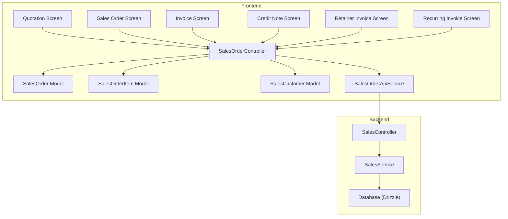
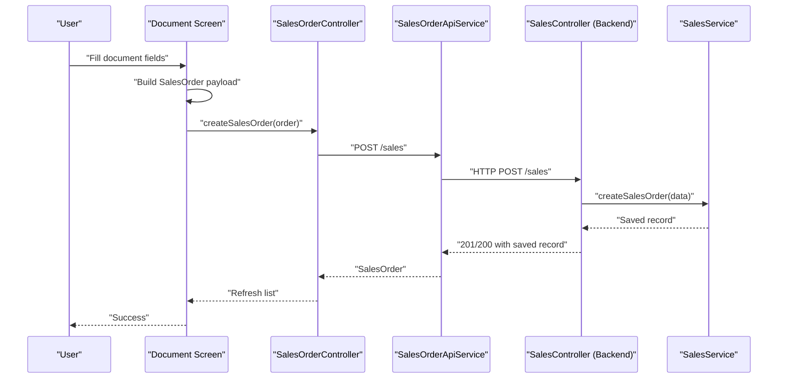
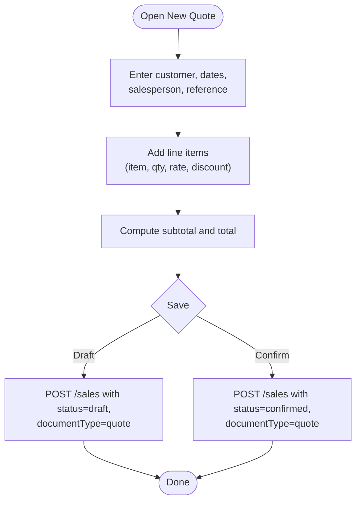
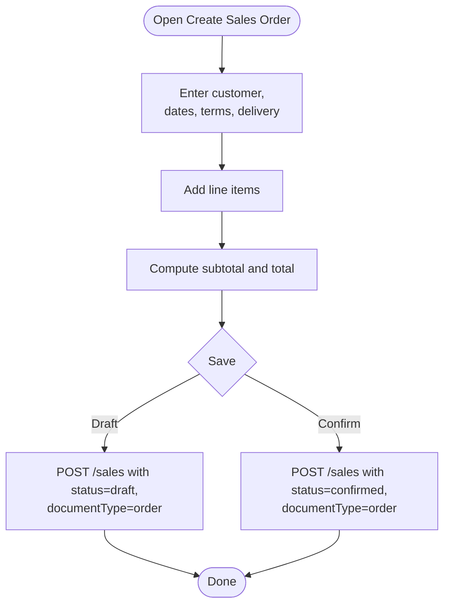
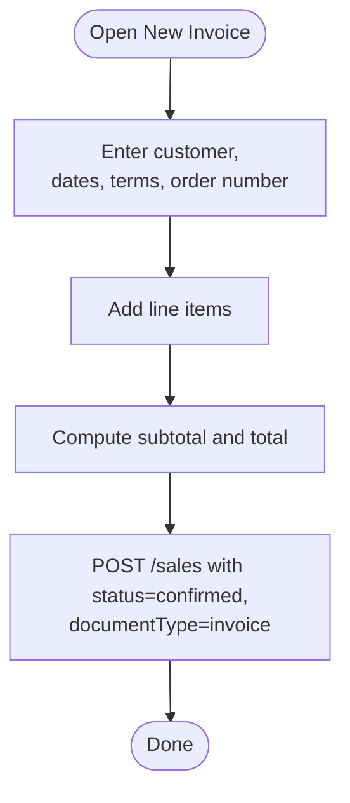
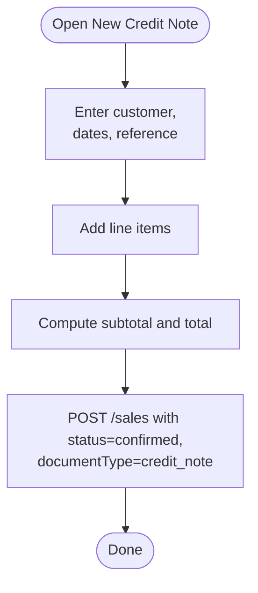
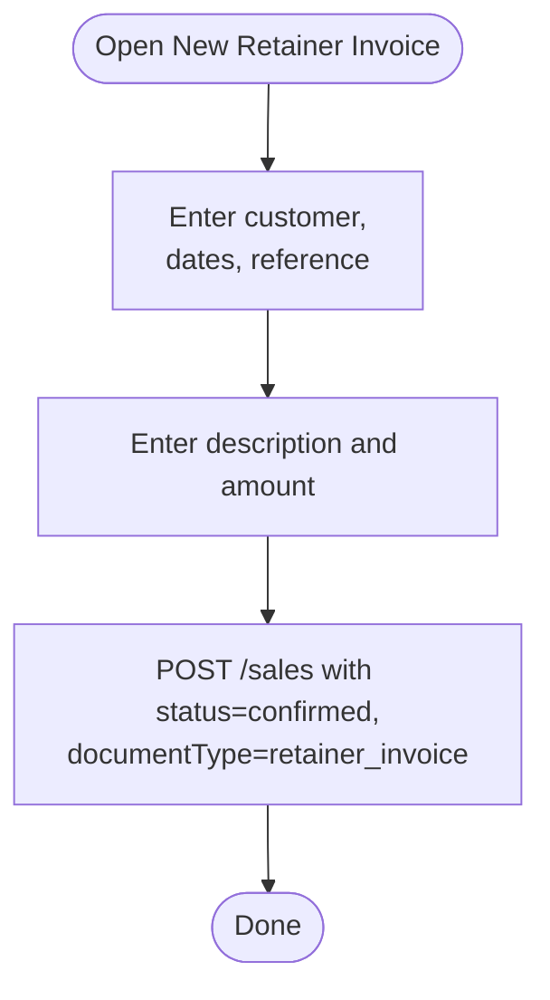
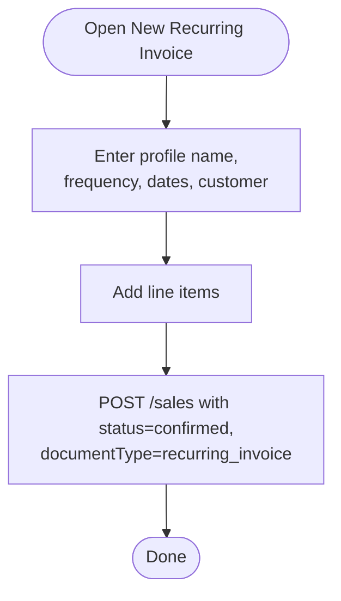
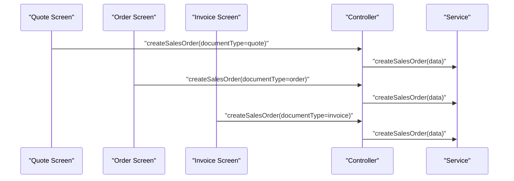
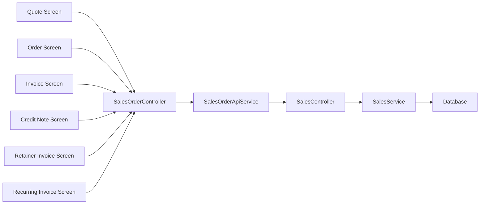

# Sales Document Workflow

<cite>
**Referenced Files in This Document**
- [sales_quotation_quotation_create.dart](file://lib/modules/sales/presentation/sales_quotation_quotation_create.dart)
- [sales_sales_order_create.dart](file://lib/modules/sales/presentation/sales_sales_order_create.dart)
- [sales_invoice_invoice_create.dart](file://lib/modules/sales/presentation/sales_invoice_invoice_create.dart)
- [sales_credit_note_create.dart](file://lib/modules/sales/presentation/sales_credit_note_create.dart)
- [sales_retainer_invoice_create.dart](file://lib/modules/sales/presentation/sales_retainer_invoice_create.dart)
- [sales_recurring_invoice_create.dart](file://lib/modules/sales/presentation/sales_recurring_invoice_create.dart)
- [sales_order_model.dart](file://lib/modules/sales/models/sales_order_model.dart)
- [sales_order_item_model.dart](file://lib/modules/sales/models/sales_order_item_model.dart)
- [sales_customer_model.dart](file://lib/modules/sales/models/sales_customer_model.dart)
- [sales_order_controller.dart](file://lib/modules/sales/controller/sales_order_controller.dart)
- [sales_order_api_service.dart](file://lib/modules/sales/services/sales_order_api_service.dart)
- [sales_order_item_row.dart](file://lib/modules/sales/presentation/widgets/sales_order_item_row.dart)
- [sales.controller.ts](file://backend/src/sales/sales.controller.ts)
- [sales.service.ts](file://backend/src/sales/sales.service.ts)
</cite>

## Table of Contents
1. [Introduction](#introduction)
2. [Project Structure](#project-structure)
3. [Core Components](#core-components)
4. [Architecture Overview](#architecture-overview)
5. [Detailed Component Analysis](#detailed-component-analysis)
6. [Dependency Analysis](#dependency-analysis)
7. [Performance Considerations](#performance-considerations)
8. [Troubleshooting Guide](#troubleshooting-guide)
9. [Conclusion](#conclusion)
10. [Appendices](#appendices)

## Introduction
This document describes the Sales Document Workflow system that supports the end-to-end sales lifecycle from quotation to invoice generation. It covers the supported document types (quotes, sales orders, invoices, credit notes, retainer invoices, and recurring invoices), creation workflows, totals computation, and the underlying frontend/backend integration. It also outlines the current state of numbering schemes, approval/status transitions, templates, and inventory integration points.

## Project Structure
The sales workflow spans the frontend Flutter modules and the NestJS backend:
- Frontend (Flutter):
  - Presentation screens for each document type
  - Models for documents and items
  - Controller/provider for state and API orchestration
  - API service for HTTP communication
- Backend (NestJS):
  - REST endpoints for sales, customers, payments, e-way bills, and payment links
  - Service layer persisting to database via Drizzle ORM

**Diagram sources**
- [sales_quotation_quotation_create.dart](file://lib/modules/sales/presentation/sales_quotation_quotation_create.dart#L1-L559)
- [sales_sales_order_create.dart](file://lib/modules/sales/presentation/sales_sales_order_create.dart#L1-L685)
- [sales_invoice_invoice_create.dart](file://lib/modules/sales/presentation/sales_invoice_invoice_create.dart#L1-L573)
- [sales_credit_note_create.dart](file://lib/modules/sales/presentation/sales_credit_note_create.dart#L1-L520)
- [sales_retainer_invoice_create.dart](file://lib/modules/sales/presentation/sales_retainer_invoice_create.dart#L1-L280)
- [sales_recurring_invoice_create.dart](file://lib/modules/sales/presentation/sales_recurring_invoice_create.dart#L1-L346)
- [sales_order_model.dart](file://lib/modules/sales/models/sales_order_model.dart#L1-L118)
- [sales_order_item_model.dart](file://lib/modules/sales/models/sales_order_item_model.dart#L1-L62)
- [sales_customer_model.dart](file://lib/modules/sales/models/sales_customer_model.dart#L1-L93)
- [sales_order_controller.dart](file://lib/modules/sales/controller/sales_order_controller.dart#L1-L119)
- [sales_order_api_service.dart](file://lib/modules/sales/services/sales_order_api_service.dart#L1-L192)
- [sales.controller.ts](file://backend/src/sales/sales.controller.ts#L1-L102)
- [sales.service.ts](file://backend/src/sales/sales.service.ts#L1-L162)

**Section sources**
- [sales_quotation_quotation_create.dart](file://lib/modules/sales/presentation/sales_quotation_quotation_create.dart#L1-L559)
- [sales_sales_order_create.dart](file://lib/modules/sales/presentation/sales_sales_order_create.dart#L1-L685)
- [sales_invoice_invoice_create.dart](file://lib/modules/sales/presentation/sales_invoice_invoice_create.dart#L1-L573)
- [sales_credit_note_create.dart](file://lib/modules/sales/presentation/sales_credit_note_create.dart#L1-L520)
- [sales_retainer_invoice_create.dart](file://lib/modules/sales/presentation/sales_retainer_invoice_create.dart#L1-L280)
- [sales_recurring_invoice_create.dart](file://lib/modules/sales/presentation/sales_recurring_invoice_create.dart#L1-L346)
- [sales_order_model.dart](file://lib/modules/sales/models/sales_order_model.dart#L1-L118)
- [sales_order_item_model.dart](file://lib/modules/sales/models/sales_order_item_model.dart#L1-L62)
- [sales_customer_model.dart](file://lib/modules/sales/models/sales_customer_model.dart#L1-L93)
- [sales_order_controller.dart](file://lib/modules/sales/controller/sales_order_controller.dart#L1-L119)
- [sales_order_api_service.dart](file://lib/modules/sales/services/sales_order_api_service.dart#L1-L192)
- [sales.controller.ts](file://backend/src/sales/sales.controller.ts#L1-L102)
- [sales.service.ts](file://backend/src/sales/sales.service.ts#L1-L162)

## Core Components
- SalesOrder model: encapsulates header-level fields (customer, dates, totals, status, document type) and optional items.
- SalesOrderItem model: encapsulates per-line item details (quantity, rate, discount, tax info, and optional item linkage).
- SalesCustomer model: customer metadata used across documents.
- SalesOrderController: Riverpod state notifier orchestrating sales data and customer lists.
- SalesOrderApiService: HTTP client wrapper for sales endpoints.
- Document-specific screens: each screen builds a SalesOrder payload and delegates creation to the controller.

Key totals computation highlights:
- Subtotal computed as sum of (quantity × rate) minus discount per line.
- Shipping and adjustment adjustments applied to total.
- Tax total is currently set to zero in the order/invoice screens; tax computation is not implemented in the frontend forms.

**Section sources**
- [sales_order_model.dart](file://lib/modules/sales/models/sales_order_model.dart#L4-L118)
- [sales_order_item_model.dart](file://lib/modules/sales/models/sales_order_item_model.dart#L3-L62)
- [sales_customer_model.dart](file://lib/modules/sales/models/sales_customer_model.dart#L1-L93)
- [sales_order_controller.dart](file://lib/modules/sales/controller/sales_order_controller.dart#L67-L119)
- [sales_order_api_service.dart](file://lib/modules/sales/services/sales_order_api_service.dart#L104-L121)
- [sales_sales_order_create.dart](file://lib/modules/sales/presentation/sales_sales_order_create.dart#L96-L114)
- [sales_invoice_invoice_create.dart](file://lib/modules/sales/presentation/sales_invoice_invoice_create.dart#L91-L108)

## Architecture Overview
The frontend uses Riverpod providers to manage state and fetch data. Each document creation screen constructs a SalesOrder object and calls the controller’s createSalesOrder method, which posts to the backend endpoint. The backend persists the record and returns it to the frontend.

**Diagram sources**
- [sales_sales_order_create.dart](file://lib/modules/sales/presentation/sales_sales_order_create.dart#L635-L683)
- [sales_order_controller.dart](file://lib/modules/sales/controller/sales_order_controller.dart#L86-L95)
- [sales_order_api_service.dart](file://lib/modules/sales/services/sales_order_api_service.dart#L104-L121)
- [sales.controller.ts](file://backend/src/sales/sales.controller.ts#L91-L95)
- [sales.service.ts](file://backend/src/sales/sales.service.ts#L80-L97)

**Section sources**
- [sales_order_controller.dart](file://lib/modules/sales/controller/sales_order_controller.dart#L67-L119)
- [sales_order_api_service.dart](file://lib/modules/sales/services/sales_order_api_service.dart#L104-L121)
- [sales.controller.ts](file://backend/src/sales/sales.controller.ts#L77-L101)
- [sales.service.ts](file://backend/src/sales/sales.service.ts#L80-L97)

## Detailed Component Analysis

### Quotation Creation Workflow
- Auto-numbering scheme: “QT-YYYYMMDD-HHMM” prefix.
- Fields include customer, quote number, reference, dates, salesperson, and line items.
- Totals computed locally; save action sends a SalesOrder with documentType set to “quote”.

**Diagram sources**
- [sales_quotation_quotation_create.dart](file://lib/modules/sales/presentation/sales_quotation_quotation_create.dart#L47-L61)
- [sales_quotation_quotation_create.dart](file://lib/modules/sales/presentation/sales_quotation_quotation_create.dart#L512-L551)
- [sales_order_model.dart](file://lib/modules/sales/models/sales_order_model.dart#L14-L15)

**Section sources**
- [sales_quotation_quotation_create.dart](file://lib/modules/sales/presentation/sales_quotation_quotation_create.dart#L25-L61)
- [sales_quotation_quotation_create.dart](file://lib/modules/sales/presentation/sales_quotation_quotation_create.dart#L512-L551)

### Sales Order Creation Workflow
- Auto-numbering scheme: “SO-YYYYMMDD-HHMM” prefix.
- Supports draft and confirmed states; includes expected shipment date, payment terms, delivery method, and salesperson.
- Totals computed locally; save action sends a SalesOrder with documentType set to “order”.

**Diagram sources**
- [sales_sales_order_create.dart](file://lib/modules/sales/presentation/sales_sales_order_create.dart#L50-L65)
- [sales_sales_order_create.dart](file://lib/modules/sales/presentation/sales_sales_order_create.dart#L635-L683)
- [sales_order_model.dart](file://lib/modules/sales/models/sales_order_model.dart#L14-L15)

**Section sources**
- [sales_sales_order_create.dart](file://lib/modules/sales/presentation/sales_sales_order_create.dart#L27-L65)
- [sales_sales_order_create.dart](file://lib/modules/sales/presentation/sales_sales_order_create.dart#L635-L683)

### Invoice Creation Workflow
- Auto-numbering scheme: “INV-YYYYMMDD-HHMM” prefix.
- Includes invoice date, due date, terms, and order number linkage.
- Totals computed locally; save action sends a SalesOrder with documentType set to “invoice”.

**Diagram sources**
- [sales_invoice_invoice_create.dart](file://lib/modules/sales/presentation/sales_invoice_invoice_create.dart#L48-L62)
- [sales_invoice_invoice_create.dart](file://lib/modules/sales/presentation/sales_invoice_invoice_create.dart#L525-L565)
- [sales_order_model.dart](file://lib/modules/sales/models/sales_order_model.dart#L14-L15)

**Section sources**
- [sales_invoice_invoice_create.dart](file://lib/modules/sales/presentation/sales_invoice_invoice_create.dart#L25-L62)
- [sales_invoice_invoice_create.dart](file://lib/modules/sales/presentation/sales_invoice_invoice_create.dart#L525-L565)

### Credit Note Creation Workflow
- Auto-numbering scheme: “CN-YYYYMMDD-HHMM” prefix.
- Supports line items with quantity, rate, discount; total equals subtotal.
- Save action sends a SalesOrder with documentType set to “credit_note”.

**Diagram sources**
- [sales_credit_note_create.dart](file://lib/modules/sales/presentation/sales_credit_note_create.dart#L43-L52)
- [sales_credit_note_create.dart](file://lib/modules/sales/presentation/sales_credit_note_create.dart#L473-L512)
- [sales_order_model.dart](file://lib/modules/sales/models/sales_order_model.dart#L14-L15)

**Section sources**
- [sales_credit_note_create.dart](file://lib/modules/sales/presentation/sales_credit_note_create.dart#L25-L52)
- [sales_credit_note_create.dart](file://lib/modules/sales/presentation/sales_credit_note_create.dart#L473-L512)

### Retainer Invoice Creation Workflow
- Auto-numbering scheme: “RET-YYYYMMDD-HHMM” prefix.
- Single line item with description and amount; no per-item line items.
- Save action sends a SalesOrder with documentType set to “retainer_invoice”.

**Diagram sources**
- [sales_retainer_invoice_create.dart](file://lib/modules/sales/presentation/sales_retainer_invoice_create.dart#L36-L45)
- [sales_retainer_invoice_create.dart](file://lib/modules/sales/presentation/sales_retainer_invoice_create.dart#L241-L278)
- [sales_order_model.dart](file://lib/modules/sales/models/sales_order_model.dart#L14-L15)

**Section sources**
- [sales_retainer_invoice_create.dart](file://lib/modules/sales/presentation/sales_retainer_invoice_create.dart#L22-L45)
- [sales_retainer_invoice_create.dart](file://lib/modules/sales/presentation/sales_retainer_invoice_create.dart#L241-L278)

### Recurring Invoice Creation Workflow
- Profile-based recurring setup with frequency (weekly/monthly/yearly), start/end dates, and linked customer.
- Line items captured per recurrence profile.
- Save action sends a SalesOrder with documentType set to “recurring_invoice”.

**Diagram sources**
- [sales_recurring_invoice_create.dart](file://lib/modules/sales/presentation/sales_recurring_invoice_create.dart#L40-L45)
- [sales_recurring_invoice_create.dart](file://lib/modules/sales/presentation/sales_recurring_invoice_create.dart#L308-L344)
- [sales_order_model.dart](file://lib/modules/sales/models/sales_order_model.dart#L14-L15)

**Section sources**
- [sales_recurring_invoice_create.dart](file://lib/modules/sales/presentation/sales_recurring_invoice_create.dart#L25-L45)
- [sales_recurring_invoice_create.dart](file://lib/modules/sales/presentation/sales_recurring_invoice_create.dart#L308-L344)

### Status Transitions and Approval
- Draft vs Confirmed: Sales orders support draft and confirmed states; quotes, invoices, credit notes, retainer invoices, and recurring invoices are created with confirmed status in their respective screens.
- No explicit approval workflow is implemented in the frontend screens; transitions are driven by the save actions.

**Section sources**
- [sales_sales_order_create.dart](file://lib/modules/sales/presentation/sales_sales_order_create.dart#L576-L589)
- [sales_quotation_quotation_create.dart](file://lib/modules/sales/presentation/sales_quotation_quotation_create.dart#L498-L501)
- [sales_invoice_invoice_create.dart](file://lib/modules/sales/presentation/sales_invoice_invoice_create.dart#L511-L513)
- [sales_credit_note_create.dart](file://lib/modules/sales/presentation/sales_credit_note_create.dart#L459-L461)
- [sales_retainer_invoice_create.dart](file://lib/modules/sales/presentation/sales_retainer_invoice_create.dart#L228-L231)
- [sales_recurring_invoice_create.dart](file://lib/modules/sales/presentation/sales_recurring_invoice_create.dart#L295-L298)

### Pricing, Discount, and Tax Computation
- Pricing and discount:
  - Per-line amount computed as (quantity × rate) − discount.
  - Subtotal aggregated across lines.
- Totals:
  - Subtotal plus shipping and adjustment yields total.
  - Tax total is initialized to zero in order/invoice screens; tax computation is not implemented in the frontend forms.
- Currency:
  - Currency persisted at the sales order level; defaults to INR in backend insertion.

**Section sources**
- [sales_sales_order_create.dart](file://lib/modules/sales/presentation/sales_sales_order_create.dart#L96-L114)
- [sales_invoice_invoice_create.dart](file://lib/modules/sales/presentation/sales_invoice_invoice_create.dart#L91-L108)
- [sales_order_model.dart](file://lib/modules/sales/models/sales_order_model.dart#L16-L21)
- [sales.service.ts](file://backend/src/sales/sales.service.ts#L80-L97)

### Inventory Integration
- Current state:
  - Item selection uses a dropdown populated from the items controller.
  - No stock availability checks or reservations are implemented in the frontend screens.
- Integration points:
  - Items are fetched via items controller provider.
  - Item model is referenced in sales order item linkage.

**Section sources**
- [sales_quotation_quotation_create.dart](file://lib/modules/sales/presentation/sales_quotation_quotation_create.dart#L111-L112)
- [sales_sales_order_create.dart](file://lib/modules/sales/presentation/sales_sales_order_create.dart#L118-L119)
- [sales_invoice_invoice_create.dart](file://lib/modules/sales/presentation/sales_invoice_invoice_create.dart#L112-L113)
- [sales_order_item_model.dart](file://lib/modules/sales/models/sales_order_item_model.dart#L1-L62)

### Templates, Customization, and Branding
- Templates:
  - Not implemented in the current screens; document creation is form-driven.
- Customization:
  - Fields vary by document type (e.g., expiry date for quotes, due date for invoices, frequency for recurring).
- Branding:
  - UI follows shared layout components; no document template branding features are present.

**Section sources**
- [sales_quotation_quotation_create.dart](file://lib/modules/sales/presentation/sales_quotation_quotation_create.dart#L1-L559)
- [sales_sales_order_create.dart](file://lib/modules/sales/presentation/sales_sales_order_create.dart#L1-L685)
- [sales_invoice_invoice_create.dart](file://lib/modules/sales/presentation/sales_invoice_invoice_create.dart#L1-L573)
- [sales_credit_note_create.dart](file://lib/modules/sales/presentation/sales_credit_note_create.dart#L1-L520)
- [sales_retainer_invoice_create.dart](file://lib/modules/sales/presentation/sales_retainer_invoice_create.dart#L1-L280)
- [sales_recurring_invoice_create.dart](file://lib/modules/sales/presentation/sales_recurring_invoice_create.dart#L1-L346)

### Validation Rules and Audit Trails
- Validation:
  - Basic UI validation via form keys and required fields in screens.
  - No server-side validation rules are visible in the provided backend service.
- Audit:
  - Created timestamps are stored in models; backend inserts do not populate createdAt in the current implementation.

**Section sources**
- [sales_sales_order_create.dart](file://lib/modules/sales/presentation/sales_sales_order_create.dart#L27-L28)
- [sales_order_model.dart](file://lib/modules/sales/models/sales_order_model.dart#L26-L27)
- [sales.service.ts](file://backend/src/sales/sales.service.ts#L80-L97)

### Practical Examples

#### Example 1: Complete Sales Transaction (Quote → Sales Order → Invoice)
- Quote:
  - Create a quote with customer, items, and dates; save as draft or confirm.
- Sales Order:
  - Convert quote to order; confirm order; expected shipment date set.
- Invoice:
  - Generate invoice from order; set invoice date and due date; confirm invoice.

**Diagram sources**
- [sales_quotation_quotation_create.dart](file://lib/modules/sales/presentation/sales_quotation_quotation_create.dart#L512-L551)
- [sales_sales_order_create.dart](file://lib/modules/sales/presentation/sales_sales_order_create.dart#L635-L683)
- [sales_invoice_invoice_create.dart](file://lib/modules/sales/presentation/sales_invoice_invoice_create.dart#L525-L565)
- [sales_order_controller.dart](file://lib/modules/sales/controller/sales_order_controller.dart#L86-L95)
- [sales.service.ts](file://backend/src/sales/sales.service.ts#L80-L97)

#### Example 2: Partial Fulfillment and Amendments
- Partial fulfillment:
  - The current backend does not implement order-to-invoice fulfillment mapping; this would require extending the service and schema.
- Amendments:
  - The current backend does not implement amendment records; deletion and recreation would be required.

[No sources needed since this section provides conceptual guidance]

#### Example 3: Cancellations
- Cancellation:
  - The current backend exposes a delete endpoint; however, cancellation semantics are not implemented in the frontend screens.

**Section sources**
- [sales_order_controller.dart](file://lib/modules/sales/controller/sales_order_controller.dart#L97-L105)
- [sales_order_api_service.dart](file://lib/modules/sales/services/sales_order_api_service.dart#L123-L132)
- [sales.controller.ts](file://backend/src/sales/sales.controller.ts#L97-L100)

## Dependency Analysis
- Frontend dependencies:
  - Screens depend on SalesOrderController and SalesOrderApiService.
  - Models are shared across screens.
- Backend dependencies:
  - SalesController delegates to SalesService.
  - SalesService uses Drizzle ORM to access database tables.

**Diagram sources**
- [sales_order_controller.dart](file://lib/modules/sales/controller/sales_order_controller.dart#L12-L25)
- [sales_order_api_service.dart](file://lib/modules/sales/services/sales_order_api_service.dart#L10-L11)
- [sales.controller.ts](file://backend/src/sales/sales.controller.ts#L14-L16)
- [sales.service.ts](file://backend/src/sales/sales.service.ts#L6-L7)

**Section sources**
- [sales_order_controller.dart](file://lib/modules/sales/controller/sales_order_controller.dart#L12-L25)
- [sales_order_api_service.dart](file://lib/modules/sales/services/sales_order_api_service.dart#L10-L11)
- [sales.controller.ts](file://backend/src/sales/sales.controller.ts#L14-L16)
- [sales.service.ts](file://backend/src/sales/sales.service.ts#L6-L7)

## Performance Considerations
- Local totals computation:
  - Totals are recalculated on each input change; consider debouncing for large item sets.
- Network requests:
  - Each save triggers a POST to /sales; batch operations are not implemented.
- Data fetching:
  - Customers and sales lists are fetched via providers; caching and pagination are not implemented.

[No sources needed since this section provides general guidance]

## Troubleshooting Guide
- Error handling:
  - Frontend shows a snackbar on save failure.
  - Backend throws exceptions on invalid responses or missing resources.
- Common issues:
  - Missing customer selection prevents saving.
  - Invalid numeric inputs cause parsing failures; ensure numeric keyboards are used.
  - Backend errors return descriptive messages; inspect network tab for status codes.

**Section sources**
- [sales_sales_order_create.dart](file://lib/modules/sales/presentation/sales_sales_order_create.dart#L676-L682)
- [sales_order_api_service.dart](file://lib/modules/sales/services/sales_order_api_service.dart#L114-L120)
- [sales.service.ts](file://backend/src/sales/sales.service.ts#L34-L40)
- [sales.service.ts](file://backend/src/sales/sales.service.ts#L72-L78)

## Conclusion
The Sales Document Workflow provides a solid foundation for managing the sales lifecycle across multiple document types. The frontend offers intuitive creation screens with auto-numbering and local totals computation, while the backend persists records and exposes CRUD endpoints. Areas for enhancement include tax computation, inventory reservations, approval workflows, and amendment/cancellation semantics.

## Appendices

### Document Types and Auto-Numbering Scheme
- Quote: “QT-YYYYMMDD-HHMM”
- Sales Order: “SO-YYYYMMDD-HHMM”
- Invoice: “INV-YYYYMMDD-HHMM”
- Credit Note: “CN-YYYYMMDD-HHMM”
- Retainer Invoice: “RET-YYYYMMDD-HHMM”
- Recurring Invoice: Profile-based (no fixed prefix in current screens)

**Section sources**
- [sales_quotation_quotation_create.dart](file://lib/modules/sales/presentation/sales_quotation_quotation_create.dart#L49-L51)
- [sales_sales_order_create.dart](file://lib/modules/sales/presentation/sales_sales_order_create.dart#L53-L55)
- [sales_invoice_invoice_create.dart](file://lib/modules/sales/presentation/sales_invoice_invoice_create.dart#L50-L52)
- [sales_credit_note_create.dart](file://lib/modules/sales/presentation/sales_credit_note_create.dart#L45-L47)
- [sales_retainer_invoice_create.dart](file://lib/modules/sales/presentation/sales_retainer_invoice_create.dart#L38-L40)
- [sales_recurring_invoice_create.dart](file://lib/modules/sales/presentation/sales_recurring_invoice_create.dart#L308-L344)