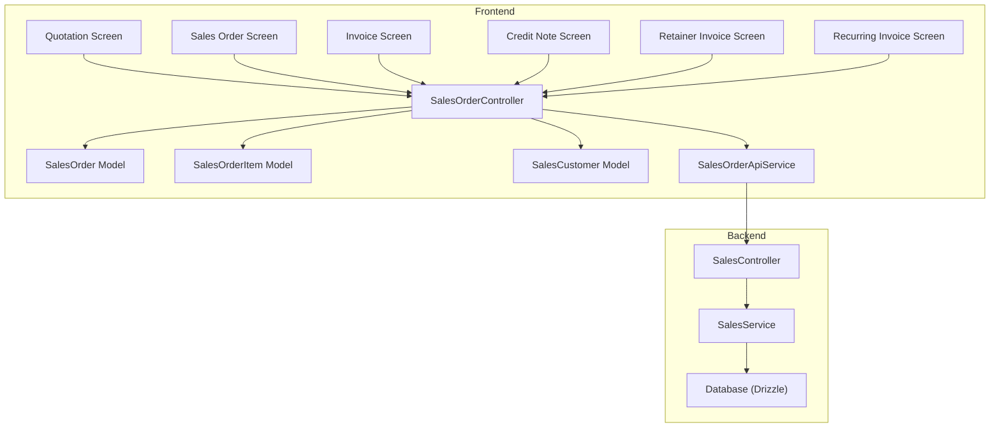
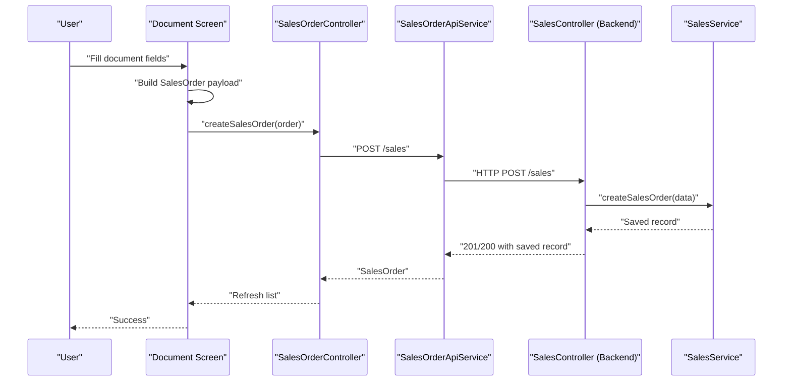
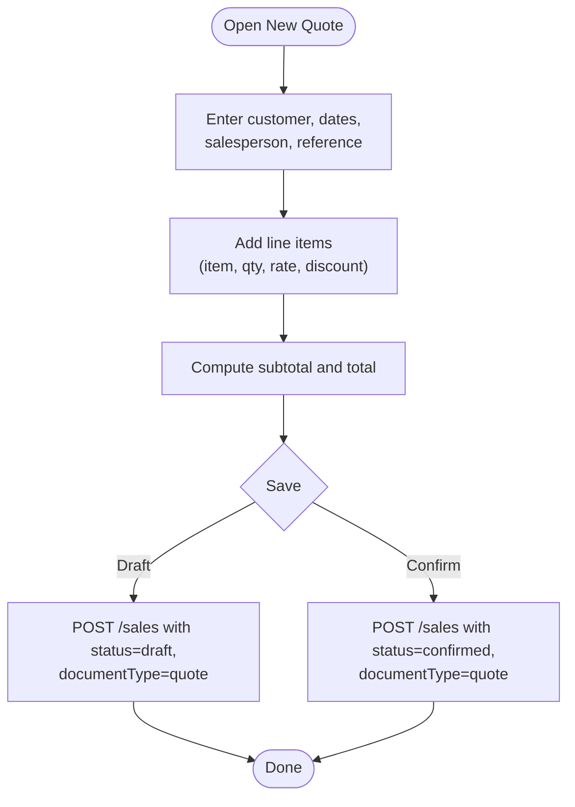
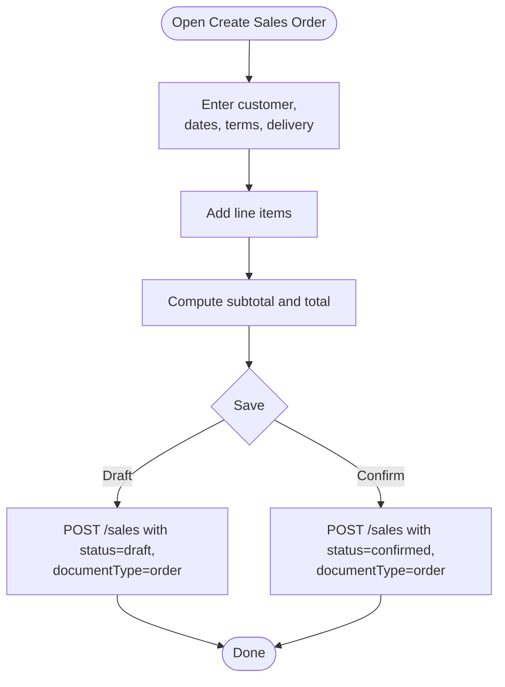
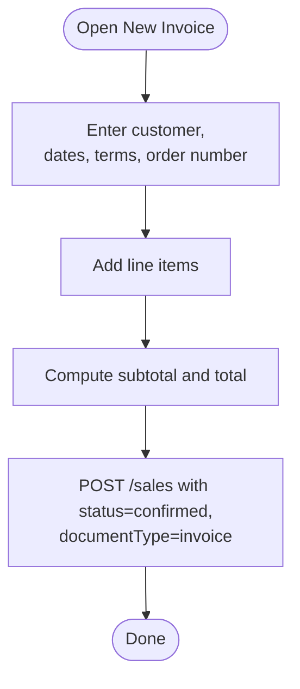
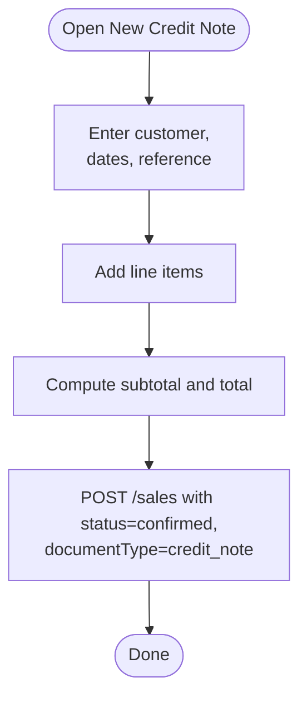
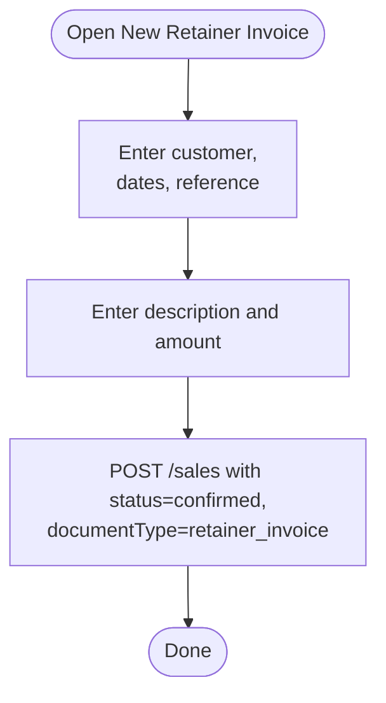
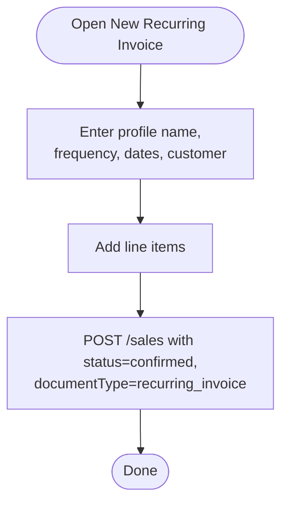
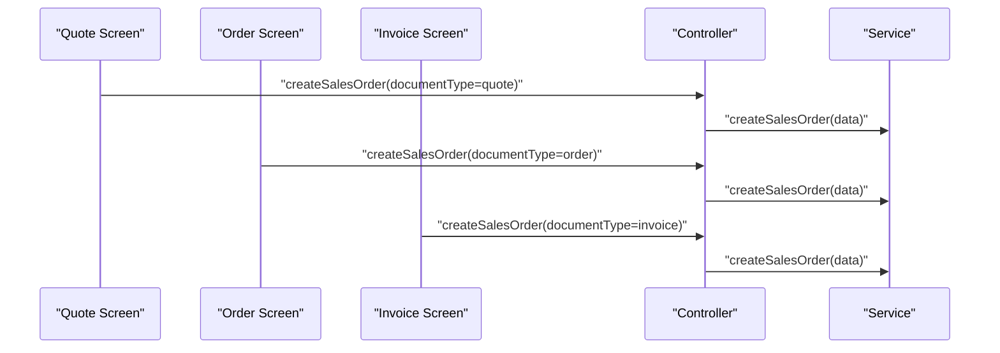
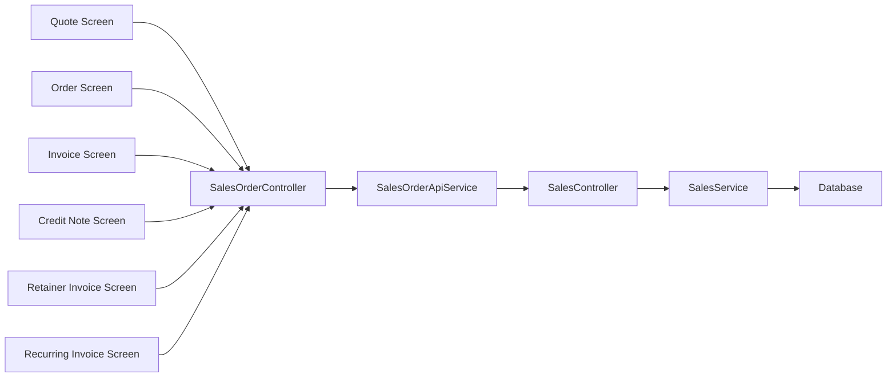

# Sales Document Workflow

<cite>
**Referenced Files in This Document**
- [sales_quotation_quotation_create.dart](file://lib/modules/sales/presentation/sales_quotation_quotation_create.dart)
- [sales_sales_order_create.dart](file://lib/modules/sales/presentation/sales_sales_order_create.dart)
- [sales_invoice_invoice_create.dart](file://lib/modules/sales/presentation/sales_invoice_invoice_create.dart)
- [sales_credit_note_create.dart](file://lib/modules/sales/presentation/sales_credit_note_create.dart)
- [sales_retainer_invoice_create.dart](file://lib/modules/sales/presentation/sales_retainer_invoice_create.dart)
- [sales_recurring_invoice_create.dart](file://lib/modules/sales/presentation/sales_recurring_invoice_create.dart)
- [sales_order_model.dart](file://lib/modules/sales/models/sales_order_model.dart)
- [sales_order_item_model.dart](file://lib/modules/sales/models/sales_order_item_model.dart)
- [sales_customer_model.dart](file://lib/modules/sales/models/sales_customer_model.dart)
- [sales_order_controller.dart](file://lib/modules/sales/controller/sales_order_controller.dart)
- [sales_order_api_service.dart](file://lib/modules/sales/services/sales_order_api_service.dart)
- [sales_order_item_row.dart](file://lib/modules/sales/presentation/widgets/sales_order_item_row.dart)
- [sales.controller.ts](file://backend/src/sales/sales.controller.ts)
- [sales.service.ts](file://backend/src/sales/sales.service.ts)
</cite>

## 0. Process Workflows (System Source of Truth)

These workflows define the strict business logic for sales documents within Zerpai ERP.

### 0.1 Sales Process Workflow

#### Mermaid Diagram
```mermaid
graph TD
    ~W_OD2oDP8k0["Create Bills"] --> ~W_OW9SAGXd2["Create Invoice"]
    .W_OE1S7P2sq["Receive Quotation Request"] --> .W_Op-X3dQ8u["Create Quotation"]
    .W_OLvgC2oKA["Check Stock Availability"] -->|In stock| .W_Obghnu2iz["Generate Picklist (Available for Sales)"]
    .W_Op-X3dQ8u["Create Quotation"] --> .W_OLt_dtnaJ["Send Quotation to Customer"]
    q18O1c2~iJhM["Check Inventory"] -->|In Stock| q18OOzoNLvz8["Generate Picklist"]
    LS_OFN9AmXF8["Check Stock Availability"] -->|Not in stock| MS_Oerlmjym7["Create Purchase Order to Vendor"]
    r18O0VU47SF6["Deliver to Customer"] --> q18O4M2VTCaM["End"]
    q18OOzoNLvz8["Generate Picklist"] --> q18Oal0ZW._1["Create Invoice"]
    q18Oal0ZW._1["Create Invoice"] --> r18O0VU47SF6["Deliver to Customer"]
    ~W_ODXONCu0t["Customer Response"] -->|Reject| .W_OvlKs_vy0["End"]
    q18OOhOIuxax["Vendor Invoice Type"] -->|Separate Bill| r18OcDXDnr8a["Enter Bill Directly"]
    .W_ONWHpX~Hn["Convert Quotation to Sales Order"] --> .W_OLvgC2oKA["Check Stock Availability"]
    MS_OzZkvHSYh["Create Picklist After Receipt"] --> MS_OhULT_jBB["Package Items"]
    MS_O3lnIzRUr["Create Picklist"] --> MS_OhULT_jBB["Package Items"]
    .W_OuODF8jDx["Package Items"] --> .W_OU7~tApuZ["Ship Items (Shipment)"]
    q18O-_HNS~zc["Start"] --> q18OTzZkWYv1["Receive Customer Order"]
    ~W_OqMF6_1y6["Receive Items (Purchase Receives)"] --> .W_Obghnu2iz["Generate Picklist (Available for Sales)"]
    .W_OLt_dtnaJ["Send Quotation to Customer"] --> ~W_ODXONCu0t["Customer Response"]
    MS_O3W~TNac.["Ship Items"] --> LS_OW4wFilvV["Create Final Invoice"]
    ~W_OW9SAGXd2["Create Invoice"] --> ~W_OZdX.~0yV["Generate E-way Bills"]
    r18O0VU47SF6["Deliver to Customer"] --> q18O4M2VTCaM["End"]
    .W_ONWHpX~Hn["Convert Quotation to Sales Order"] --> .W_OLvgC2oKA["Check Stock Availability"]
    r18OcDXDnr8a["Enter Bill Directly"] --> r18OjMJ88Qlj["Convert Bill to Invoice"]
    .W_OLvgC2oKA["Check Stock Availability"] -->|Non stocked item| .W_OeXFD5971["Create Purchase Order"]
    MS_OGeLUgaRS["Customer Pays"] --> LS_OEA6ZzQAW["Convert Retainer Invoice to Payment Made"]
    .W_OeXFD5971["Create Purchase Order"] --> ~W_OqMF6_1y6["Receive Items (Purchase Receives)"]
    MS_Oerlmjym7["Create Purchase Order to Vendor"] --> MS_ONZGQss3D["Receive Items from Vendor"]
    q18OWgli.bS3["Enter Purchase Receives"] --> q18OYgMhz0Ce["Enter Bill"]
    LS_Oim882Ere["Start"] --> LS_OLlU9rDer["Raise Sales Order"]
    q18OYgMhz0Ce["Enter Bill"] --> q18OkdUecEyT["Generate Picklist After Receipt"]
    LS_OW4wFilvV["Create Final Invoice"] --> LS_OqDNt5O-b["End"]
    LS_OFN9AmXF8["Check Stock Availability"] -->|In stock| MS_O3lnIzRUr["Create Picklist"]
    MS_O3W~TNac.["Ship Items"] --> LS_OW4wFilvV["Create Final Invoice"]
    DhzQT1F9vcZw["convert to payment made"] --> .W_ONWHpX~Hn["Convert Quotation to Sales Order"]
    r18OjMJ88Qlj["Convert Bill to Invoice"] --> r18O0VU47SF6["Deliver to Customer"]
    LS_OH_qN0I.W["Enter Bill"] --> MS_OzZkvHSYh["Create Picklist After Receipt"]
    ~W_OW9SAGXd2["Create Invoice"] --> ~W_OZdX.~0yV["Generate E-way Bills"]
    q18O1c2~iJhM["Check Inventory"] -->|No Stock| q18O80_E91md["Create Purchase Order to Vendor"]
    q18Oal0ZW._1["Create Invoice"] --> r18O0VU47SF6["Deliver to Customer"]
    .W_Orm4XHp_U["Accept Orders from Outlets (SO)"] --> .W_OLvgC2oKA["Check Stock Availability"]
    wfzQpyWHBe~y["request retainer invoice"] --> DhzQT1F9vcZw["convert to payment made"]
    q18OOhOIuxax["Vendor Invoice Type"] -->|Combined Invoice| q18OWgli.bS3["Enter Purchase Receives"]
    LS_OLlU9rDer["Raise Sales Order"] --> LS_OMAMuKcdd["Request Retainer Invoice"]
    .W_OktXIvJG8["Start"] --> .W_OE1S7P2sq["Receive Quotation Request"]
    ~W_OqMF6_1y6["Receive Items (Purchase Receives)"] --> ~W_OD2oDP8k0["Create Bills"]
    ~W_ODXONCu0t["Customer Response"] -->|Accept| wfzQpyWHBe~y["request retainer invoice"]
    .W_OU7~tApuZ["Ship Items (Shipment)"] --> ~W_OW9SAGXd2["Create Invoice"]
    .W_Obghnu2iz["Generate Picklist (Available for Sales)"] --> .W_OuODF8jDx["Package Items"]
    LS_OEA6ZzQAW["Convert Retainer Invoice to Payment Made"] --> LS_OFN9AmXF8["Check Stock Availability"]
    q18OkdUecEyT["Generate Picklist After Receipt"] --> q18Oal0ZW._1["Create Invoice"]
    ~W_OZdX.~0yV["Generate E-way Bills"] --> ~W_O8p0cVKeQ["Deliver to Outlet Customer"]
    q18O80_E91md["Create Purchase Order to Vendor"] --> q18OOhOIuxax["Vendor Invoice Type"]
    q18OTzZkWYv1["Receive Customer Order"] --> q18O1c2~iJhM["Check Inventory"]
    LS_OW4wFilvV["Create Final Invoice"] --> LS_OqDNt5O-b["End"]
    ~W_O8p0cVKeQ["Deliver to Outlet Customer"] --> .W_OvlKs_vy0["End"]
    LS_OMAMuKcdd["Request Retainer Invoice"] --> MS_OGeLUgaRS["Customer Pays"]
    MS_OhULT_jBB["Package Items"] --> MS_O3W~TNac.["Ship Items"]
    MS_ONZGQss3D["Receive Items from Vendor"] --> LS_OH_qN0I.W["Enter Bill"]
    .W_OktXIvJG8["Start"] --> .W_Orm4XHp_U["Accept Orders from Outlets (SO)"]
    MS_OhULT_jBB["Package Items"] --> MS_O3W~TNac.["Ship Items"]
```

#### Written Workflow
- **Receive Order:** Start -> Receive Customer Order -> Check Inventory.
- **In Stock Flow:** Check Inventory (In Stock) -> Generate Picklist -> Create Invoice -> Deliver to Customer.
- **Out of Stock Flow:** Check Inventory (No Stock) -> Create Purchase Order to Vendor -> Vendor Invoice Type.
- **Quotation Flow:** Receive Quotation Request -> Create Quotation -> Send Quotation to Customer -> Customer Response.
- **Acceptance:** Customer Response (Accept) -> request retainer invoice -> convert to payment made -> Convert Quotation to Sales Order.
- **Fulfillment:** Generate Picklist -> Package Items -> Ship Items (Shipment) -> Create Invoice -> Generate E-way Bills -> Deliver to Customer.

### 0.2 Detailed Module Workflows

#### Mermaid Diagram
```mermaid
graph TD
    buqPy5TtCGY3["Enter Bill"] --> buqPYGJxOZ.a["Generate Picklist"]
    mjqPtrNA3skL["Prepare Estimate(quatation) (Optional)"] --> mjqPfppiCHhQ["Accepted Estimate"]
    I7qPnk.-EOze["Delivered Order"] --> I7qPxeoquyCe["Sales Return Created"]
    mjqPVNHxq822["Shipment"] --> mjqPIjMbAlVd["Create Invoice"]
    I7qPAfZ.2~V3["Picklist Created"] --> I7qPgikgbVOd["Package Created"]
    mjqPFmPQFoKc["Stock Available?"] -->|No| mjqPbCv-u7T.["Create Purchase Order"]
    I7qPg8coFvX2["Shipment Created"] -->|Full| I7qPpXHXEXSI["Full Delivery → Invoice → Paid"]
    I7qP6KmGTpyo["Purchase Request (Auto/Manual)"] --> I7qPnxCeAvI6["Purchase Order (PO)"]
    I7qP5yaI5Whc["Vendor Bill Recorded"] --> I7qPvpJ2rdes["Vendor Payment"]
    mjqPFmPQFoKc["Stock Available?"] -->|Yes| mjqPaCwgd8la["Create Picklist"]
    I7qPnxCeAvI6["Purchase Order (PO)"] --> I7qPu4fvknrp["purchase recieves"]
    H7qP1SrqFnHn["Customer Request"] --> J7qPc~n_hB9-["Customer Advance / Retainer Invoice"]
    J7qPT9TewTDW["Adjust with Future Bills"] --> I7qP5yaI5Whc["Vendor Bill Recorded"]
    I7qP7rTcjhq7["Goods Received Back (Stock Increased)"] --> I7qPXZbleBXA["Credit Note Issued"]
    buqPxz._cO26["Package Items"] --> buqP65XRq6S9["Shipment"]
    buqPirUNPn-9["Start"] --> buqPzmxJR1kJ["Sales Order (SO)"]
    buqPhU6F-7v1["Raise Purchase Order to Vendor"] --> buqPvgTHmTqO["Purchase Receives"]
    mjqPaCwgd8la["Create Picklist"] --> mjqPKrZ4wRni["Package Items"]
    mjqPKrZ4wRni["Package Items"] --> mjqPVNHxq822["Shipment"]
    I7qPiy6V36EB["Return to Supplier(purchase return)"] --> I7qP2dcMI8xC["Vendor Credit Note"]
    I7qPXZbleBXA["Credit Note Issued"] --> I7qPozU2NqGz["Customer: Refund or Apply as Credit?"]
    I7qPERxUTw2u["Confirm Sales Order"] --> I7qPOKpm5kj1["Check Stock Availability"]
    I7qPXZbleBXA["Credit Note Issued"] -->|NON ACTIVE GOODS| I7qPiy6V36EB["Return to Supplier(purchase return)"]
    mjqP1xHdO1E9["Enter Vendor Bills"] --> mjqPaCwgd8la["Create Picklist"]
    mjqPUawRGLYw["Customer Request"] --> mjqP5lyV3J5.["Create Sales Order"]
    I7qPnk.-EOze["Delivered Order"] --> I7qPxeoquyCe["Sales Return Created"]
    I7qPOKpm5kj1["Check Stock Availability"] -->|Stock Available| I7qPAfZ.2~V3["Picklist Created"]
    I7qPILDwd0Dm["Refund Processed"] --> J7qPEbfuRYW8["End"]
    buqP65XRq6S9["Shipment"] --> cuqP9rv4MwQI["invoice"]
    mjqPbCv-u7T.["Create Purchase Order"] --> mjqP2VHa7dsB["Receive Purchased Items(PURCHASE RECIEVE)"]
    I7qP_0dpnDh6["Create Sales Order (SO)"] --> I7qPERxUTw2u["Confirm Sales Order"]
    I7qPNHu-IcmK["Mark as Delivered"] -->|if reject| I7qPnk.-EOze["Delivered Order"]
    I7qPg80M2_n2["PAID"] --> J7qPEbfuRYW8["End"]
    H7qPyX5DprAq["Start"] --> H7qP1SrqFnHn["Customer Request"]
    mjqP2VHa7dsB["Receive Purchased Items(PURCHASE RECIEVE)"] --> mjqP1xHdO1E9["Enter Vendor Bills"]
    I7qPxeoquyCe["Sales Return Created"] --> I7qP7rTcjhq7["Goods Received Back (Stock Increased)"]
    I7qPXZbleBXA["Credit Note Issued"] -->|ACTIVE STOCK| j7ZPSohrRueb["transfer orders"]
    I7qPNHu-IcmK["Mark as Delivered"] -->|if accept| I7qPYZANBrm9["Invoice Created (Draft)"]
    buqPvgTHmTqO["Purchase Receives"] --> buqPy5TtCGY3["Enter Bill"]
    I7qP-brN8NSh["Stock Increased + Batch Created"] --> I7qP5yaI5Whc["Vendor Bill Recorded"]
    I7qP03kSnnC5["Applied as Credit to Future Invoice"] --> I7qPYZANBrm9["Invoice Created (Draft)"]
    I7qPPaZWr1P7["Vendor: Refund or Adjust with Future Bills?"] -->|Adjust| J7qPT9TewTDW["Adjust with Future Bills"]
    J7qPc~n_hB9-["Customer Advance / Retainer Invoice"] --> J7qPPEN8kGiM["Advance Payment Received"]
    I7qP1Lo89wdo["Invoice Sent"] --> I7qPnr0JdP3e["Payment Received"]
    cuqPYyXFC3.1["Stock available?"] -->||Stocked|| buqPYGJxOZ.a["Generate Picklist"]
    I7qPYZANBrm9["Invoice Created (Draft)"] --> I7qP1Lo89wdo["Invoice Sent"]
    I7qPg8coFvX2["Shipment Created"] -->|Partial| I7qPREBC.DHs["Partial Delivery → Partial Invoice + Backorder"]
    buqPYGJxOZ.a["Generate Picklist"] --> buqPxz._cO26["Package Items"]
    I7qPvpJ2rdes["Vendor Payment"] --> I7qPYZANBrm9["Invoice Created (Draft)"]
    mjqPpRxjpX9P["Start"] --> mjqPUawRGLYw["Customer Request"]
    I7qP5yaI5Whc["Vendor Bill Recorded"] --> I7qPYZANBrm9["Invoice Created (Draft)"]
    I7qPOKpm5kj1["Check Stock Availability"] -->|Stock Not Available| I7qP6KmGTpyo["Purchase Request (Auto/Manual)"]
    H7qPmUu0~2eO["Accepted Estimate"] --> I7qP_0dpnDh6["Create Sales Order (SO)"]
    I7qPu4fvknrp["purchase recieves"] --> I7qP-brN8NSh["Stock Increased + Batch Created"]
    I7qP2dcMI8xC["Vendor Credit Note"] --> I7qPPaZWr1P7["Vendor: Refund or Adjust with Future Bills?"]
    mjqPbf9BTnZV["Confirm Sales Order"] --> mjqPFmPQFoKc["Stock Available?"]
    I7qPu4fvknrp["purchase recieves"] --> I7qP-brN8NSh["Stock Increased + Batch Created"]
    H7qP1SrqFnHn["Customer Request"] --> H7qPZ1teyN7w["Estimate(QUOTES) (Optional)"]
    buqPy5TtCGY3["Enter Bill"] --> cuqP9rv4MwQI["invoice"]
    J7qPFt6~Z7fA["Stored as Customer Credit"] --> J7qPv3wCRTGf["Auto Apply to Future Invoices"]
    mjqPfppiCHhQ["Accepted Estimate"] --> mjqP5lyV3J5.["Create Sales Order"]
    I7qPozU2NqGz["Customer: Refund or Apply as Credit?"] -->|Apply as Credit| I7qP03kSnnC5["Applied as Credit to Future Invoice"]
    J7qPPEN8kGiM["Advance Payment Received"] --> J7qPFt6~Z7fA["Stored as Customer Credit"]
    I7qPu4fvknrp["purchase recieves"] --> I7qPAfZ.2~V3["Picklist Created"]
    J7qP~l_JrJsc["Vendor Refund"] --> J7qPEbfuRYW8["End"]
    H7qPZ1teyN7w["Estimate(QUOTES) (Optional)"] --> H7qPmUu0~2eO["Accepted Estimate"]
    mjqP5lyV3J5.["Create Sales Order"] --> mjqPbf9BTnZV["Confirm Sales Order"]
    mjqP98BFcWvy["Receive Payment"] --> mjqPcZ9LOf0e["End"]
    H7qP1SrqFnHn["Customer Request"] --> I7qP_0dpnDh6["Create Sales Order (SO)"]
    I7qPnr0JdP3e["Payment Received"] --> I7qPg80M2_n2["PAID"]
    J7qPv3wCRTGf["Auto Apply to Future Invoices"] --> I7qPYZANBrm9["Invoice Created (Draft)"]
    mjqPUawRGLYw["Customer Request"] --> mjqPtrNA3skL["Prepare Estimate(quatation) (Optional)"]
    buqPzmxJR1kJ["Sales Order (SO)"] --> cuqPYyXFC3.1["Stock available?"]
    I7qPRWhz6a0T["Failed Delivery → Return Entry"] --> I7qPxeoquyCe["Sales Return Created"]
    cuqPYyXFC3.1["Stock available?"] -->||Non-stocked|| buqPhU6F-7v1["Raise Purchase Order to Vendor"]
    I7qPozU2NqGz["Customer: Refund or Apply as Credit?"] -->|Refund| I7qPILDwd0Dm["Refund Processed"]
    mjqPIjMbAlVd["Create Invoice"] --> mjqP98BFcWvy["Receive Payment"]
    I7qPg8coFvX2["Shipment Created"] -->|Failed| I7qPRWhz6a0T["Failed Delivery → Return Entry"]
    I7qPg8coFvX2["Shipment Created"] --> I7qPvP8H2Xey["Delivery Challan (Optional)"]
    I7qPvP8H2Xey["Delivery Challan (Optional)"] --> I7qPNHu-IcmK["Mark as Delivered"]
    I7qPgikgbVOd["Package Created"] --> I7qPg8coFvX2["Shipment Created"]
    I7qPPaZWr1P7["Vendor: Refund or Adjust with Future Bills?"] -->|Refund| J7qP~l_JrJsc["Vendor Refund"]
```

#### Written Workflow
- **Enter Bill** -> Generate Picklist
- **Prepare Estimate(quatation) (Optional)** -> Accepted Estimate
- **Delivered Order** -> Sales Return Created
- **Shipment** -> Create Invoice
- **Picklist Created** -> Package Created
- **Stock Available? (No)** -> Create Purchase Order
- **Shipment Created (Full)** -> Full Delivery → Invoice → Paid
- **Purchase Request (Auto/Manual)** -> Purchase Order (PO)
- **Vendor Bill Recorded** -> Vendor Payment
- **Stock Available? (Yes)** -> Create Picklist
- **Purchase Order (PO)** -> purchase recieves
- **Customer Request** -> Customer Advance / Retainer Invoice
- **Adjust with Future Bills** -> Vendor Bill Recorded
- **Goods Received Back (Stock Increased)** -> Credit Note Issued
- **Package Items** -> Shipment
- **Start** -> Sales Order (SO)
- **Raise Purchase Order to Vendor** -> Purchase Receives
- **Create Picklist** -> Package Items
- **Package Items** -> Shipment
- **Return to Supplier(purchase return)** -> Vendor Credit Note
- **Credit Note Issued** -> Customer: Refund or Apply as Credit?
- **Confirm Sales Order** -> Check Stock Availability
- **Credit Note Issued (NON ACTIVE GOODS)** -> Return to Supplier(purchase return)
- **Enter Vendor Bills** -> Create Picklist
- **Customer Request** -> Create Sales Order
- **Delivered Order** -> Sales Return Created
- **Check Stock Availability (Stock Available)** -> Picklist Created
- **Refund Processed** -> End
- **Shipment** -> invoice
- **Create Purchase Order** -> Receive Purchased Items(PURCHASE RECIEVE)
- **Create Sales Order (SO)** -> Confirm Sales Order
- **Mark as Delivered (if reject)** -> Delivered Order
- **PAID** -> End
- **Start** -> Customer Request
- **Receive Purchased Items(PURCHASE RECIEVE)** -> Enter Vendor Bills
- **Sales Return Created** -> Goods Received Back (Stock Increased)
- **Credit Note Issued (ACTIVE STOCK)** -> transfer orders
- **Mark as Delivered (if accept)** -> Invoice Created (Draft)
- **Purchase Receives** -> Enter Bill
- **Stock Increased + Batch Created** -> Vendor Bill Recorded
- **Applied as Credit to Future Invoice** -> Invoice Created (Draft)
- **Vendor: Refund or Adjust with Future Bills? (Adjust)** -> Adjust with Future Bills
- **Customer Advance / Retainer Invoice** -> Advance Payment Received
- **Invoice Sent** -> Payment Received
- **Stock available? (Stocked)** -> Generate Picklist
- **Invoice Created (Draft)** -> Invoice Sent
- **Shipment Created (Partial)** -> Partial Delivery → Partial Invoice + Backorder
- **Generate Picklist** -> Package Items
- **Vendor Payment** -> Invoice Created (Draft)
- **Start** -> Customer Request
- **Vendor Bill Recorded** -> Invoice Created (Draft)
- **Check Stock Availability (Stock Not Available)** -> Purchase Request (Auto/Manual)
- **Accepted Estimate** -> Create Sales Order (SO)
- **purchase recieves** -> Stock Increased + Batch Created
- **Vendor Credit Note** -> Vendor: Refund or Adjust with Future Bills?
- **Confirm Sales Order** -> Stock Available?
- **purchase recieves** -> Stock Increased + Batch Created
- **Customer Request** -> Estimate(QUOTES) (Optional)
- **Enter Bill** -> invoice
- **Stored as Customer Credit** -> Auto Apply to Future Invoices
- **Accepted Estimate** -> Create Sales Order
- **Customer: Refund or Apply as Credit? (Apply as Credit)** -> Applied as Credit to Future Invoice
- **Advance Payment Received** -> Stored as Customer Credit
- **purchase recieves** -> Picklist Created
- **Vendor Refund** -> End
- **Estimate(QUOTES) (Optional)** -> Accepted Estimate
- **Create Sales Order** -> Confirm Sales Order
- **Receive Payment** -> End
- **Customer Request** -> Create Sales Order (SO)
- **Payment Received** -> PAID
- **Auto Apply to Future Invoices** -> Invoice Created (Draft)
- **Customer Request** -> Prepare Estimate(quatation) (Optional)
- **Sales Order (SO)** -> Stock available?
- **Failed Delivery → Return Entry** -> Sales Return Created
- **Stock available? (Non-stocked)** -> Raise Purchase Order to Vendor
- **Customer: Refund or Apply as Credit? (Refund)** -> Refund Processed
- **Create Invoice** -> Receive Payment
- **Shipment Created (Failed)** -> Failed Delivery → Return Entry
- **Shipment Created** -> Delivery Challan (Optional)
- **Delivery Challan (Optional)** -> Mark as Delivered
- **Package Created** -> Shipment Created
- **Vendor: Refund or Adjust with Future Bills? (Refund)** -> Vendor Refund

---

### 0.2 Return Process Workflow

#### Mermaid Diagram
```mermaid
graph TD
    tepPD0~uL5wk["Customer Reports Damaged Goods"] --> tepPJ-hPq8xg["No Goods Returned to HO Inventory"]
    YepPVw3~WzcG["Receive Credit Note from Vendor"] --> YepPE~Q8as9B["Convert Purchase Return to Vendor Credits"]
    mhoPmZ328~hW["Start"] --> mhoPQh_ebcd8["Sales Return"]
    XepPybe59SGz["Start"] --> XepPNh1C_q_Y["Invoice to Customer(outlet)"]
    YepPE~Q8as9B["Convert Purchase Return to Vendor Credits"] --> XepPoGl2XndD["End"]
    XepPCYe_1_37["Create Purchase Return Request to HO"] --> XepPRHgGh5LW["HO Accepts Return Request?"]
    XepPxUMeUD1H["Customer Returns Item to Outlet"] --> XepPpMQM.oS6["Item Condition at Outlet?"]
    XepPpMQM.oS6["Item Condition at Outlet?"] -->|Non-damaged or non-expired| XepP4Hv5LgtQ["Keep in Outlet Inventory"]
    YepPMyyY4m04["Create Sales Return at HO"] --> YepPko0wTCoC["Convert to Return Receives"]
    j90PP5DJ4HwA["purchase return in outlet convert into damage (inventory adjustment)"] --> XepPoGl2XndD["End"]
    tepPN3Sxcsju["Generate Sales Return"] --> tepP0m.J2oqK["Create Credit Note for Customer"]
    tepPJ-hPq8xg["No Goods Returned to HO Inventory"] --> tepPrzLIA8Fz["Outlet Raises PR Request to HO"]
    tepP0m.J2oqK["Create Credit Note for Customer"] --> tepPfXglb9tM["End"]
    tepPU4Z.ujct["Courier from HO Arrives Damaged"] --> tepPD0~uL5wk["Customer Reports Damaged Goods"]
    YepPiG18XlSd["Create Purchase Return to Vendor"] --> YepPVw3~WzcG["Receive Credit Note from Vendor"]
    tepPN-soAb8I["HO Accepts PO Request?"] -->|Accept| tepPN3Sxcsju["Generate Sales Return"]
    mhoPq.cVCx7j["Transfer Orders"] --> mhoP2m~n-PrC["End"]
    XepPpMQM.oS6["Item Condition at Outlet?"] -->|Damaged or expired| XepPmVfbuO1c["Return Item to HO"]
    XepPmVfbuO1c["Return Item to HO"] --> XepPCYe_1_37["Create Purchase Return Request to HO"]
    YepPvts8soGZ["Create Credit Note at HO"] -->|Non-damaged or non-expired goods| YepPbRL6uvL1["Create Transfer Order to Main Warehouse"]
    XepPNh1C_q_Y["Invoice to Customer(outlet)"] --> XepPxUMeUD1H["Customer Returns Item to Outlet"]
    mhoPgJnvNZNW["Purchase Return"] --> mhoP~PNQouY5["Vendor Credits"]
    mhoPQh_ebcd8["Sales Return"] --> mhoPTpsPjPxH["Sales Return Receives"]
    mhoP~Cpbogpi["Credit Note"] -->|Non-expired items| mhoPq.cVCx7j["Transfer Orders"]
    YepPbRL6uvL1["Create Transfer Order to Main Warehouse"] --> YepP1~nz52~_["Store as Live Ready Items in Main Warehouse"]
    YepPko0wTCoC["Convert to Return Receives"] --> YepPvts8soGZ["Create Credit Note at HO"]
    XepPRHgGh5LW["HO Accepts Return Request?"] -->|Reject| XepPoGl2XndD["End"]
    XepPRHgGh5LW["HO Accepts Return Request?"] -->|Accept| YepPMyyY4m04["Create Sales Return at HO"]
    YepPvts8soGZ["Create Credit Note at HO"] -->|Damaged or expired goods| YepPiG18XlSd["Create Purchase Return to Vendor"]
    mhoP~Cpbogpi["Credit Note"] -->|Expired or damaged items| mhoPgJnvNZNW["Purchase Return"]
    YepP1~nz52~_["Store as Live Ready Items in Main Warehouse"] --> XepPoGl2XndD["End"]
    XepP4Hv5LgtQ["Keep in Outlet Inventory"] --> j90PP5DJ4HwA["purchase return in outlet convert into damage (inventory adjustment)"]
    tepPrzLIA8Fz["Outlet Raises PR Request to HO"] --> tepPN-soAb8I["HO Accepts PO Request?"]
    tepPUi-DjrV4["Start"] --> tepPU4Z.ujct["Courier from HO Arrives Damaged"]
    mhoPTpsPjPxH["Sales Return Receives"] --> mhoP~Cpbogpi["Credit Note"]
    mhoP~PNQouY5["Vendor Credits"] --> mhoP2m~n-PrC["End"]
    tepPN-soAb8I["HO Accepts PO Request?"] -->|Reject| tepPfXglb9tM["End"]
```

#### Written Workflow
- **Customer Return at Outlet:** Customer Returns Item to Outlet -> Item Condition at Outlet?.
- **Good Condition:** Item Condition at Outlet? (Non-damaged or non-expired) -> Keep in Outlet Inventory -> purchase return in outlet convert into damage (inventory adjustment).
- **Damaged/Expired:** Item Condition at Outlet? (Damaged or expired) -> Return Item to HO -> Create Purchase Return Request to HO -> HO Accepts Return Request?.
- **HO Acceptance:** HO Accepts Return Request? (Accept) -> Create Sales Return at HO -> Convert to Return Receives -> Create Credit Note at HO.
- **Disposal/Stocking:** Create Credit Note at HO (Non-damaged or non-expired goods) -> Create Transfer Order to Main Warehouse -> Store as Live Ready Items in Main Warehouse.
- **Vendor Return:** Create Credit Note at HO (Damaged or expired goods) -> Create Purchase Return to Vendor -> Receive Credit Note from Vendor -> Convert Purchase Return to Vendor Credits.

---

## Table of Contents
1. [Introduction](#introduction)
2. [Project Structure](#project-structure)
3. [Core Components](#core-components)
4. [Architecture Overview](#architecture-overview)
5. [Detailed Component Analysis](#detailed-component-analysis)
6. [Dependency Analysis](#dependency-analysis)
7. [Performance Considerations](#performance-considerations)
8. [Troubleshooting Guide](#troubleshooting-guide)
9. [Conclusion](#conclusion)
10. [Appendices](#appendices)

## Introduction
This document describes the Sales Document Workflow system that supports the end-to-end sales lifecycle from quotation to invoice generation. It covers the supported document types (quotes, sales orders, invoices, credit notes, retainer invoices, and recurring invoices), creation workflows, totals computation, and the underlying frontend/backend integration. It also outlines the current state of numbering schemes, approval/status transitions, templates, and inventory integration points.

## Project Structure
The sales workflow spans the frontend Flutter modules and the NestJS backend:
- Frontend (Flutter):
  - Presentation screens for each document type
  - Models for documents and items
  - Controller/provider for state and API orchestration
  - API service for HTTP communication
- Backend (NestJS):
  - REST endpoints for sales, customers, payments, e-way bills, and payment links
  - Service layer persisting to database via Drizzle ORM

```mermaid
graph TB
subgraph "Frontend"
UI_Quote["Quotation Screen"]
UI_Order["Sales Order Screen"]
UI_Invoice["Invoice Screen"]
UI_CN["Credit Note Screen"]
UI_Ret["Retainer Invoice Screen"]
UI_Recur["Recurring Invoice Screen"]
Model_Order["SalesOrder Model"]
Model_Item["SalesOrderItem Model"]
Model_Customer["SalesCustomer Model"]
Controller["SalesOrderController"]
ApiService["SalesOrderApiService"]
end
subgraph "Backend"
Ctrl["SalesController"]
Svc["SalesService"]
DB["Database (Drizzle)"]
end
UI_Quote --> Controller
UI_Order --> Controller
UI_Invoice --> Controller
UI_CN --> Controller
UI_Ret --> Controller
UI_Recur --> Controller
Controller --> ApiService
ApiService --> Ctrl
Ctrl --> Svc
Svc --> DB
Controller --> Model_Order
Controller --> Model_Item
Controller --> Model_Customer
```

**Diagram sources**
- [sales_quotation_quotation_create.dart](file://lib/modules/sales/presentation/sales_quotation_quotation_create.dart#L1-L559)
- [sales_sales_order_create.dart](file://lib/modules/sales/presentation/sales_sales_order_create.dart#L1-L685)
- [sales_invoice_invoice_create.dart](file://lib/modules/sales/presentation/sales_invoice_invoice_create.dart#L1-L573)
- [sales_credit_note_create.dart](file://lib/modules/sales/presentation/sales_credit_note_create.dart#L1-L520)
- [sales_retainer_invoice_create.dart](file://lib/modules/sales/presentation/sales_retainer_invoice_create.dart#L1-L280)
- [sales_recurring_invoice_create.dart](file://lib/modules/sales/presentation/sales_recurring_invoice_create.dart#L1-L346)
- [sales_order_model.dart](file://lib/modules/sales/models/sales_order_model.dart#L1-L118)
- [sales_order_item_model.dart](file://lib/modules/sales/models/sales_order_item_model.dart#L1-L62)
- [sales_customer_model.dart](file://lib/modules/sales/models/sales_customer_model.dart#L1-L93)
- [sales_order_controller.dart](file://lib/modules/sales/controller/sales_order_controller.dart#L1-L119)
- [sales_order_api_service.dart](file://lib/modules/sales/services/sales_order_api_service.dart#L1-L192)
- [sales.controller.ts](file://backend/src/sales/sales.controller.ts#L1-L102)
- [sales.service.ts](file://backend/src/sales/sales.service.ts#L1-L162)

**Section sources**
- [sales_quotation_quotation_create.dart](file://lib/modules/sales/presentation/sales_quotation_quotation_create.dart#L1-L559)
- [sales_sales_order_create.dart](file://lib/modules/sales/presentation/sales_sales_order_create.dart#L1-L685)
- [sales_invoice_invoice_create.dart](file://lib/modules/sales/presentation/sales_invoice_invoice_create.dart#L1-L573)
- [sales_credit_note_create.dart](file://lib/modules/sales/presentation/sales_credit_note_create.dart#L1-L520)
- [sales_retainer_invoice_create.dart](file://lib/modules/sales/presentation/sales_retainer_invoice_create.dart#L1-L280)
- [sales_recurring_invoice_create.dart](file://lib/modules/sales/presentation/sales_recurring_invoice_create.dart#L1-L346)
- [sales_order_model.dart](file://lib/modules/sales/models/sales_order_model.dart#L1-L118)
- [sales_order_item_model.dart](file://lib/modules/sales/models/sales_order_item_model.dart#L1-L62)
- [sales_customer_model.dart](file://lib/modules/sales/models/sales_customer_model.dart#L1-L93)
- [sales_order_controller.dart](file://lib/modules/sales/controller/sales_order_controller.dart#L1-L119)
- [sales_order_api_service.dart](file://lib/modules/sales/services/sales_order_api_service.dart#L1-L192)
- [sales.controller.ts](file://backend/src/sales/sales.controller.ts#L1-L102)
- [sales.service.ts](file://backend/src/sales/sales.service.ts#L1-L162)

## Core Components
- SalesOrder model: encapsulates header-level fields (customer, dates, totals, status, document type) and optional items.
- SalesOrderItem model: encapsulates per-line item details (quantity, rate, discount, tax info, and optional item linkage).
- SalesCustomer model: customer metadata used across documents.
- SalesOrderController: Riverpod state notifier orchestrating sales data and customer lists.
- SalesOrderApiService: HTTP client wrapper for sales endpoints.
- Document-specific screens: each screen builds a SalesOrder payload and delegates creation to the controller.

Key totals computation highlights:
- Subtotal computed as sum of (quantity × rate) minus discount per line.
- Shipping and adjustment adjustments applied to total.
- Tax total is currently set to zero in the order/invoice screens; tax computation is not implemented in the frontend forms.

**Section sources**
- [sales_order_model.dart](file://lib/modules/sales/models/sales_order_model.dart#L4-L118)
- [sales_order_item_model.dart](file://lib/modules/sales/models/sales_order_item_model.dart#L3-L62)
- [sales_customer_model.dart](file://lib/modules/sales/models/sales_customer_model.dart#L1-L93)
- [sales_order_controller.dart](file://lib/modules/sales/controller/sales_order_controller.dart#L67-L119)
- [sales_order_api_service.dart](file://lib/modules/sales/services/sales_order_api_service.dart#L104-L121)
- [sales_sales_order_create.dart](file://lib/modules/sales/presentation/sales_sales_order_create.dart#L96-L114)
- [sales_invoice_invoice_create.dart](file://lib/modules/sales/presentation/sales_invoice_invoice_create.dart#L91-L108)

## Architecture Overview
The frontend uses Riverpod providers to manage state and fetch data. Each document creation screen constructs a SalesOrder object and calls the controller’s createSalesOrder method, which posts to the backend endpoint. The backend persists the record and returns it to the frontend.

```mermaid
sequenceDiagram
participant U as "User"
participant V as "Document Screen"
participant C as "SalesOrderController"
participant A as "SalesOrderApiService"
participant R as "SalesController (Backend)"
participant S as "SalesService"
U->>V : "Fill document fields"
V->>V : "Build SalesOrder payload"
V->>C : "createSalesOrder(order)"
C->>A : "POST /sales"
A->>R : "HTTP POST /sales"
R->>S : "createSalesOrder(data)"
S-->>R : "Saved record"
R-->>A : "201/200 with saved record"
A-->>C : "SalesOrder"
C-->>V : "Refresh list"
V-->>U : "Success"
```

**Diagram sources**
- [sales_sales_order_create.dart](file://lib/modules/sales/presentation/sales_sales_order_create.dart#L635-L683)
- [sales_order_controller.dart](file://lib/modules/sales/controller/sales_order_controller.dart#L86-L95)
- [sales_order_api_service.dart](file://lib/modules/sales/services/sales_order_api_service.dart#L104-L121)
- [sales.controller.ts](file://backend/src/sales/sales.controller.ts#L91-L95)
- [sales.service.ts](file://backend/src/sales/sales.service.ts#L80-L97)

**Section sources**
- [sales_order_controller.dart](file://lib/modules/sales/controller/sales_order_controller.dart#L67-L119)
- [sales_order_api_service.dart](file://lib/modules/sales/services/sales_order_api_service.dart#L104-L121)
- [sales.controller.ts](file://backend/src/sales/sales.controller.ts#L77-L101)
- [sales.service.ts](file://backend/src/sales/sales.service.ts#L80-L97)

## Detailed Component Analysis

### Quotation Creation Workflow
- Auto-numbering scheme: “QT-YYYYMMDD-HHMM” prefix.
- Fields include customer, quote number, reference, dates, salesperson, and line items.
- Totals computed locally; save action sends a SalesOrder with documentType set to “quote”.

```mermaid
flowchart TD
Start(["Open New Quote"]) --> Header["Enter customer, dates,<br/>salesperson, reference"]
Header --> Lines["Add line items<br/>(item, qty, rate, discount)"]
Lines --> Compute["Compute subtotal and total"]
Compute --> Save{"Save"}
Save --> |Draft| Create["POST /sales with status=draft,<br/>documentType=quote"]
Save --> |Confirm| Confirm["POST /sales with status=confirmed,<br/>documentType=quote"]
Create --> Done(["Done"])
Confirm --> Done
```

**Diagram sources**
- [sales_quotation_quotation_create.dart](file://lib/modules/sales/presentation/sales_quotation_quotation_create.dart#L47-L61)
- [sales_quotation_quotation_create.dart](file://lib/modules/sales/presentation/sales_quotation_quotation_create.dart#L512-L551)
- [sales_order_model.dart](file://lib/modules/sales/models/sales_order_model.dart#L14-L15)

**Section sources**
- [sales_quotation_quotation_create.dart](file://lib/modules/sales/presentation/sales_quotation_quotation_create.dart#L25-L61)
- [sales_quotation_quotation_create.dart](file://lib/modules/sales/presentation/sales_quotation_quotation_create.dart#L512-L551)

### Sales Order Creation Workflow
- Auto-numbering scheme: “SO-YYYYMMDD-HHMM” prefix.
- Supports draft and confirmed states; includes expected shipment date, payment terms, delivery method, and salesperson.
- Totals computed locally; save action sends a SalesOrder with documentType set to “order”.

```mermaid
flowchart TD
StartSO(["Open Create Sales Order"]) --> HeaderSO["Enter customer,<br/>dates, terms, delivery"]
HeaderSO --> LinesSO["Add line items"]
LinesSO --> ComputeSO["Compute subtotal and total"]
ComputeSO --> SaveSO{"Save"}
SaveSO --> |Draft| CreateSO["POST /sales with status=draft,<br/>documentType=order"]
SaveSO --> |Confirm| ConfirmSO["POST /sales with status=confirmed,<br/>documentType=order"]
CreateSO --> DoneSO(["Done"])
ConfirmSO --> DoneSO
```

**Diagram sources**
- [sales_sales_order_create.dart](file://lib/modules/sales/presentation/sales_sales_order_create.dart#L50-L65)
- [sales_sales_order_create.dart](file://lib/modules/sales/presentation/sales_sales_order_create.dart#L635-L683)
- [sales_order_model.dart](file://lib/modules/sales/models/sales_order_model.dart#L14-L15)

**Section sources**
- [sales_sales_order_create.dart](file://lib/modules/sales/presentation/sales_sales_order_create.dart#L27-L65)
- [sales_sales_order_create.dart](file://lib/modules/sales/presentation/sales_sales_order_create.dart#L635-L683)

### Invoice Creation Workflow
- Auto-numbering scheme: “INV-YYYYMMDD-HHMM” prefix.
- Includes invoice date, due date, terms, and order number linkage.
- Totals computed locally; save action sends a SalesOrder with documentType set to “invoice”.

```mermaid
flowchart TD
StartINV(["Open New Invoice"]) --> HeaderINV["Enter customer,<br/>dates, terms, order number"]
HeaderINV --> LinesINV["Add line items"]
LinesINV --> ComputeINV["Compute subtotal and total"]
ComputeINV --> SaveINV["POST /sales with status=confirmed,<br/>documentType=invoice"]
SaveINV --> DoneINV(["Done"])
```

**Diagram sources**
- [sales_invoice_invoice_create.dart](file://lib/modules/sales/presentation/sales_invoice_invoice_create.dart#L48-L62)
- [sales_invoice_invoice_create.dart](file://lib/modules/sales/presentation/sales_invoice_invoice_create.dart#L525-L565)
- [sales_order_model.dart](file://lib/modules/sales/models/sales_order_model.dart#L14-L15)

**Section sources**
- [sales_invoice_invoice_create.dart](file://lib/modules/sales/presentation/sales_invoice_invoice_create.dart#L25-L62)
- [sales_invoice_invoice_create.dart](file://lib/modules/sales/presentation/sales_invoice_invoice_create.dart#L525-L565)

### Credit Note Creation Workflow
- Auto-numbering scheme: “CN-YYYYMMDD-HHMM” prefix.
- Supports line items with quantity, rate, discount; total equals subtotal.
- Save action sends a SalesOrder with documentType set to “credit_note”.

```mermaid
flowchart TD
StartCN(["Open New Credit Note"]) --> HeaderCN["Enter customer,<br/>dates, reference"]
HeaderCN --> LinesCN["Add line items"]
LinesCN --> ComputeCN["Compute subtotal and total"]
ComputeCN --> SaveCN["POST /sales with status=confirmed,<br/>documentType=credit_note"]
SaveCN --> DoneCN(["Done"])
```

**Diagram sources**
- [sales_credit_note_create.dart](file://lib/modules/sales/presentation/sales_credit_note_create.dart#L43-L52)
- [sales_credit_note_create.dart](file://lib/modules/sales/presentation/sales_credit_note_create.dart#L473-L512)
- [sales_order_model.dart](file://lib/modules/sales/models/sales_order_model.dart#L14-L15)

**Section sources**
- [sales_credit_note_create.dart](file://lib/modules/sales/presentation/sales_credit_note_create.dart#L25-L52)
- [sales_credit_note_create.dart](file://lib/modules/sales/presentation/sales_credit_note_create.dart#L473-L512)

### Retainer Invoice Creation Workflow
- Auto-numbering scheme: “RET-YYYYMMDD-HHMM” prefix.
- Single line item with description and amount; no per-item line items.
- Save action sends a SalesOrder with documentType set to “retainer_invoice”.

```mermaid
flowchart TD
StartRET(["Open New Retainer Invoice"]) --> HeaderRET["Enter customer,<br/>dates, reference"]
HeaderRET --> LineRET["Enter description and amount"]
LineRET --> SaveRET["POST /sales with status=confirmed,<br/>documentType=retainer_invoice"]
SaveRET --> DoneRET(["Done"])
```

**Diagram sources**
- [sales_retainer_invoice_create.dart](file://lib/modules/sales/presentation/sales_retainer_invoice_create.dart#L36-L45)
- [sales_retainer_invoice_create.dart](file://lib/modules/sales/presentation/sales_retainer_invoice_create.dart#L241-L278)
- [sales_order_model.dart](file://lib/modules/sales/models/sales_order_model.dart#L14-L15)

**Section sources**
- [sales_retainer_invoice_create.dart](file://lib/modules/sales/presentation/sales_retainer_invoice_create.dart#L22-L45)
- [sales_retainer_invoice_create.dart](file://lib/modules/sales/presentation/sales_retainer_invoice_create.dart#L241-L278)

### Recurring Invoice Creation Workflow
- Profile-based recurring setup with frequency (weekly/monthly/yearly), start/end dates, and linked customer.
- Line items captured per recurrence profile.
- Save action sends a SalesOrder with documentType set to “recurring_invoice”.

```mermaid
flowchart TD
StartREC(["Open New Recurring Invoice"]) --> Profile["Enter profile name,<br/>frequency, dates, customer"]
Profile --> LinesREC["Add line items"]
LinesREC --> SaveREC["POST /sales with status=confirmed,<br/>documentType=recurring_invoice"]
SaveREC --> DoneREC(["Done"])
```

**Diagram sources**
- [sales_recurring_invoice_create.dart](file://lib/modules/sales/presentation/sales_recurring_invoice_create.dart#L40-L45)
- [sales_recurring_invoice_create.dart](file://lib/modules/sales/presentation/sales_recurring_invoice_create.dart#L308-L344)
- [sales_order_model.dart](file://lib/modules/sales/models/sales_order_model.dart#L14-L15)

**Section sources**
- [sales_recurring_invoice_create.dart](file://lib/modules/sales/presentation/sales_recurring_invoice_create.dart#L25-L45)
- [sales_recurring_invoice_create.dart](file://lib/modules/sales/presentation/sales_recurring_invoice_create.dart#L308-L344)

### Status Transitions and Approval
- Draft vs Confirmed: Sales orders support draft and confirmed states; quotes, invoices, credit notes, retainer invoices, and recurring invoices are created with confirmed status in their respective screens.
- No explicit approval workflow is implemented in the frontend screens; transitions are driven by the save actions.

**Section sources**
- [sales_sales_order_create.dart](file://lib/modules/sales/presentation/sales_sales_order_create.dart#L576-L589)
- [sales_quotation_quotation_create.dart](file://lib/modules/sales/presentation/sales_quotation_quotation_create.dart#L498-L501)
- [sales_invoice_invoice_create.dart](file://lib/modules/sales/presentation/sales_invoice_invoice_create.dart#L511-L513)
- [sales_credit_note_create.dart](file://lib/modules/sales/presentation/sales_credit_note_create.dart#L459-L461)
- [sales_retainer_invoice_create.dart](file://lib/modules/sales/presentation/sales_retainer_invoice_create.dart#L228-L231)
- [sales_recurring_invoice_create.dart](file://lib/modules/sales/presentation/sales_recurring_invoice_create.dart#L295-L298)

### Pricing, Discount, and Tax Computation
- Pricing and discount:
  - Per-line amount computed as (quantity × rate) − discount.
  - Subtotal aggregated across lines.
- Totals:
  - Subtotal plus shipping and adjustment yields total.
  - Tax total is initialized to zero in order/invoice screens; tax computation is not implemented in the frontend forms.
- Currency:
  - Currency persisted at the sales order level; defaults to INR in backend insertion.

**Section sources**
- [sales_sales_order_create.dart](file://lib/modules/sales/presentation/sales_sales_order_create.dart#L96-L114)
- [sales_invoice_invoice_create.dart](file://lib/modules/sales/presentation/sales_invoice_invoice_create.dart#L91-L108)
- [sales_order_model.dart](file://lib/modules/sales/models/sales_order_model.dart#L16-L21)
- [sales.service.ts](file://backend/src/sales/sales.service.ts#L80-L97)

### Inventory Integration
- Current state:
  - Item selection uses a dropdown populated from the items controller.
  - No stock availability checks or reservations are implemented in the frontend screens.
- Integration points:
  - Items are fetched via items controller provider.
  - Item model is referenced in sales order item linkage.

**Section sources**
- [sales_quotation_quotation_create.dart](file://lib/modules/sales/presentation/sales_quotation_quotation_create.dart#L111-L112)
- [sales_sales_order_create.dart](file://lib/modules/sales/presentation/sales_sales_order_create.dart#L118-L119)
- [sales_invoice_invoice_create.dart](file://lib/modules/sales/presentation/sales_invoice_invoice_create.dart#L112-L113)
- [sales_order_item_model.dart](file://lib/modules/sales/models/sales_order_item_model.dart#L1-L62)

### Templates, Customization, and Branding
- Templates:
  - Not implemented in the current screens; document creation is form-driven.
- Customization:
  - Fields vary by document type (e.g., expiry date for quotes, due date for invoices, frequency for recurring).
- Branding:
  - UI follows shared layout components; no document template branding features are present.

**Section sources**
- [sales_quotation_quotation_create.dart](file://lib/modules/sales/presentation/sales_quotation_quotation_create.dart#L1-L559)
- [sales_sales_order_create.dart](file://lib/modules/sales/presentation/sales_sales_order_create.dart#L1-L685)
- [sales_invoice_invoice_create.dart](file://lib/modules/sales/presentation/sales_invoice_invoice_create.dart#L1-L573)
- [sales_credit_note_create.dart](file://lib/modules/sales/presentation/sales_credit_note_create.dart#L1-L520)
- [sales_retainer_invoice_create.dart](file://lib/modules/sales/presentation/sales_retainer_invoice_create.dart#L1-L280)
- [sales_recurring_invoice_create.dart](file://lib/modules/sales/presentation/sales_recurring_invoice_create.dart#L1-L346)

### Validation Rules and Audit Trails
- Validation:
  - Basic UI validation via form keys and required fields in screens.
  - No server-side validation rules are visible in the provided backend service.
- Audit:
  - Created timestamps are stored in models; backend inserts do not populate createdAt in the current implementation.

**Section sources**
- [sales_sales_order_create.dart](file://lib/modules/sales/presentation/sales_sales_order_create.dart#L27-L28)
- [sales_order_model.dart](file://lib/modules/sales/models/sales_order_model.dart#L26-L27)
- [sales.service.ts](file://backend/src/sales/sales.service.ts#L80-L97)

### Practical Examples

#### Example 1: Complete Sales Transaction (Quote → Sales Order → Invoice)
- Quote:
  - Create a quote with customer, items, and dates; save as draft or confirm.
- Sales Order:
  - Convert quote to order; confirm order; expected shipment date set.
- Invoice:
  - Generate invoice from order; set invoice date and due date; confirm invoice.

```mermaid
sequenceDiagram
participant Q as "Quote Screen"
participant O as "Order Screen"
participant I as "Invoice Screen"
participant C as "Controller"
participant S as "Service"
Q->>C : "createSalesOrder(documentType=quote)"
C->>S : "createSalesOrder(data)"
O->>C : "createSalesOrder(documentType=order)"
C->>S : "createSalesOrder(data)"
I->>C : "createSalesOrder(documentType=invoice)"
C->>S : "createSalesOrder(data)"
```

**Diagram sources**
- [sales_quotation_quotation_create.dart](file://lib/modules/sales/presentation/sales_quotation_quotation_create.dart#L512-L551)
- [sales_sales_order_create.dart](file://lib/modules/sales/presentation/sales_sales_order_create.dart#L635-L683)
- [sales_invoice_invoice_create.dart](file://lib/modules/sales/presentation/sales_invoice_invoice_create.dart#L525-L565)
- [sales_order_controller.dart](file://lib/modules/sales/controller/sales_order_controller.dart#L86-L95)
- [sales.service.ts](file://backend/src/sales/sales.service.ts#L80-L97)

#### Example 2: Partial Fulfillment and Amendments
- Partial fulfillment:
  - The current backend does not implement order-to-invoice fulfillment mapping; this would require extending the service and schema.
- Amendments:
  - The current backend does not implement amendment records; deletion and recreation would be required.

[No sources needed since this section provides conceptual guidance]

#### Example 3: Cancellations
- Cancellation:
  - The current backend exposes a delete endpoint; however, cancellation semantics are not implemented in the frontend screens.

**Section sources**
- [sales_order_controller.dart](file://lib/modules/sales/controller/sales_order_controller.dart#L97-L105)
- [sales_order_api_service.dart](file://lib/modules/sales/services/sales_order_api_service.dart#L123-L132)
- [sales.controller.ts](file://backend/src/sales/sales.controller.ts#L97-L100)

## Dependency Analysis
- Frontend dependencies:
  - Screens depend on SalesOrderController and SalesOrderApiService.
  - Models are shared across screens.
- Backend dependencies:
  - SalesController delegates to SalesService.
  - SalesService uses Drizzle ORM to access database tables.

```mermaid
graph LR
Screen_Q["Quote Screen"] --> Ctrl["SalesOrderController"]
Screen_O["Order Screen"] --> Ctrl
Screen_I["Invoice Screen"] --> Ctrl
Screen_CN["Credit Note Screen"] --> Ctrl
Screen_RET["Retainer Invoice Screen"] --> Ctrl
Screen_REC["Recurring Invoice Screen"] --> Ctrl
Ctrl --> ApiSvc["SalesOrderApiService"]
ApiSvc --> Ctrl_TS["SalesController"]
Ctrl_TS --> Svc_TS["SalesService"]
Svc_TS --> DB["Database"]
```

**Diagram sources**
- [sales_order_controller.dart](file://lib/modules/sales/controller/sales_order_controller.dart#L12-L25)
- [sales_order_api_service.dart](file://lib/modules/sales/services/sales_order_api_service.dart#L10-L11)
- [sales.controller.ts](file://backend/src/sales/sales.controller.ts#L14-L16)
- [sales.service.ts](file://backend/src/sales/sales.service.ts#L6-L7)

**Section sources**
- [sales_order_controller.dart](file://lib/modules/sales/controller/sales_order_controller.dart#L12-L25)
- [sales_order_api_service.dart](file://lib/modules/sales/services/sales_order_api_service.dart#L10-L11)
- [sales.controller.ts](file://backend/src/sales/sales.controller.ts#L14-L16)
- [sales.service.ts](file://backend/src/sales/sales.service.ts#L6-L7)

## Performance Considerations
- Local totals computation:
  - Totals are recalculated on each input change; consider debouncing for large item sets.
- Network requests:
  - Each save triggers a POST to /sales; batch operations are not implemented.
- Data fetching:
  - Customers and sales lists are fetched via providers; caching and pagination are not implemented.

[No sources needed since this section provides general guidance]

## Troubleshooting Guide
- Error handling:
  - Frontend shows a snackbar on save failure.
  - Backend throws exceptions on invalid responses or missing resources.
- Common issues:
  - Missing customer selection prevents saving.
  - Invalid numeric inputs cause parsing failures; ensure numeric keyboards are used.
  - Backend errors return descriptive messages; inspect network tab for status codes.

**Section sources**
- [sales_sales_order_create.dart](file://lib/modules/sales/presentation/sales_sales_order_create.dart#L676-L682)
- [sales_order_api_service.dart](file://lib/modules/sales/services/sales_order_api_service.dart#L114-L120)
- [sales.service.ts](file://backend/src/sales/sales.service.ts#L34-L40)
- [sales.service.ts](file://backend/src/sales/sales.service.ts#L72-L78)

## Conclusion
The Sales Document Workflow provides a solid foundation for managing the sales lifecycle across multiple document types. The frontend offers intuitive creation screens with auto-numbering and local totals computation, while the backend persists records and exposes CRUD endpoints. Areas for enhancement include tax computation, inventory reservations, approval workflows, and amendment/cancellation semantics.

## Appendices

### Document Types and Auto-Numbering Scheme
- Quote: “QT-YYYYMMDD-HHMM”
- Sales Order: “SO-YYYYMMDD-HHMM”
- Invoice: “INV-YYYYMMDD-HHMM”
- Credit Note: “CN-YYYYMMDD-HHMM”
- Retainer Invoice: “RET-YYYYMMDD-HHMM”
- Recurring Invoice: Profile-based (no fixed prefix in current screens)

**Section sources**
- [sales_quotation_quotation_create.dart](file://lib/modules/sales/presentation/sales_quotation_quotation_create.dart#L49-L51)
- [sales_sales_order_create.dart](file://lib/modules/sales/presentation/sales_sales_order_create.dart#L53-L55)
- [sales_invoice_invoice_create.dart](file://lib/modules/sales/presentation/sales_invoice_invoice_create.dart#L50-L52)
- [sales_credit_note_create.dart](file://lib/modules/sales/presentation/sales_credit_note_create.dart#L45-L47)
- [sales_retainer_invoice_create.dart](file://lib/modules/sales/presentation/sales_retainer_invoice_create.dart#L38-L40)
- [sales_recurring_invoice_create.dart](file://lib/modules/sales/presentation/sales_recurring_invoice_create.dart#L308-L344)