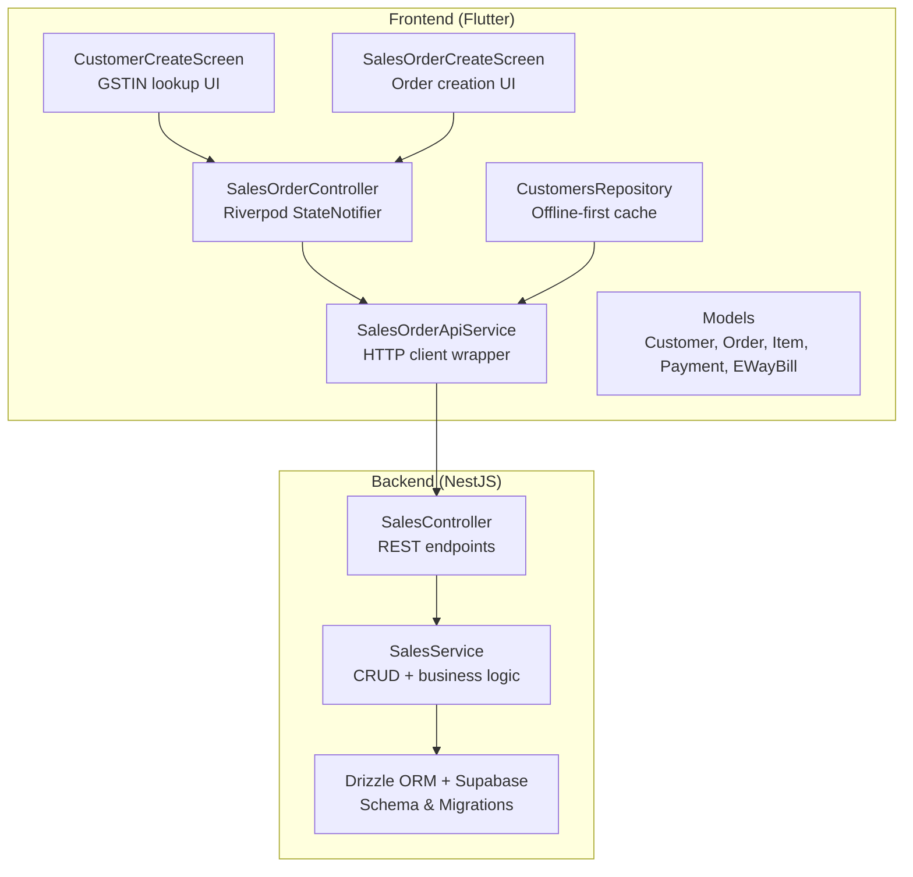
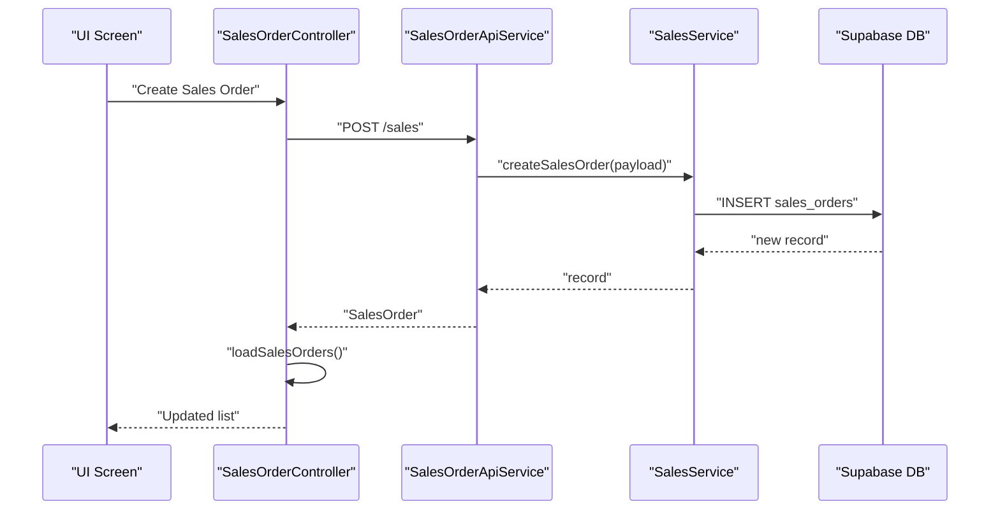
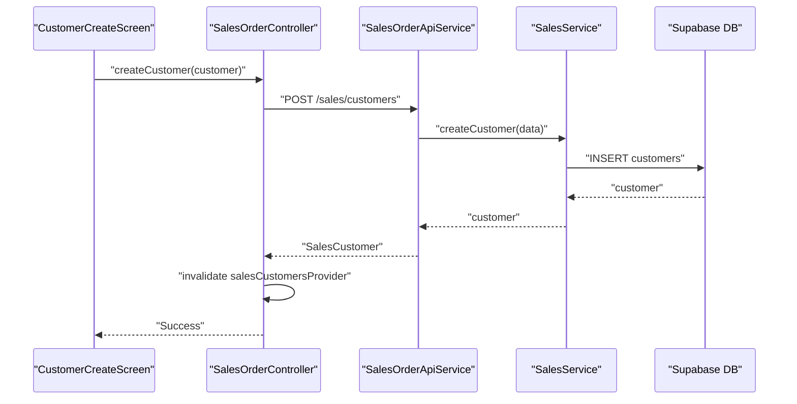
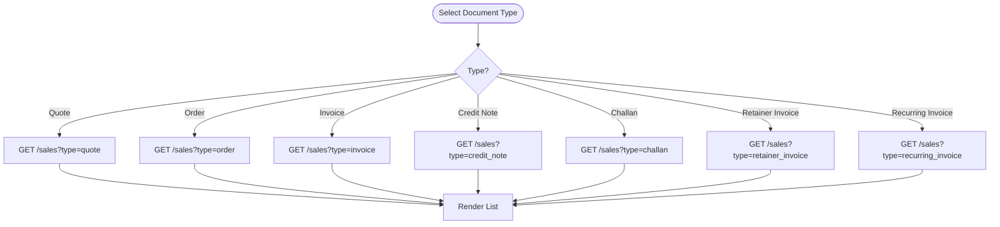
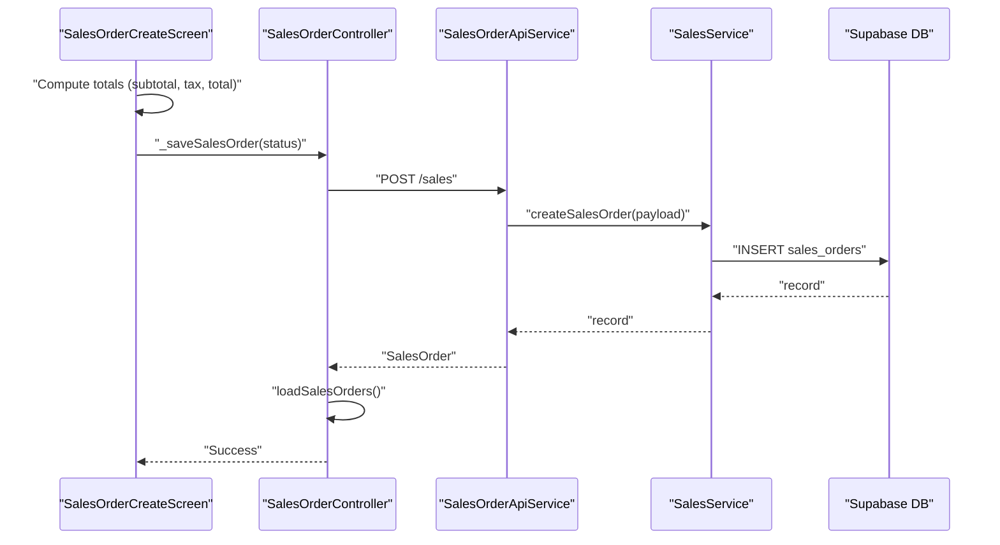
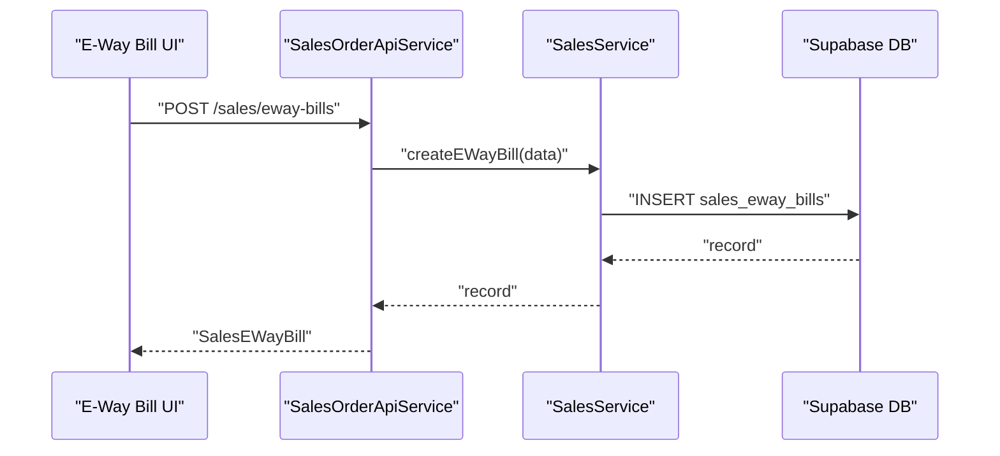
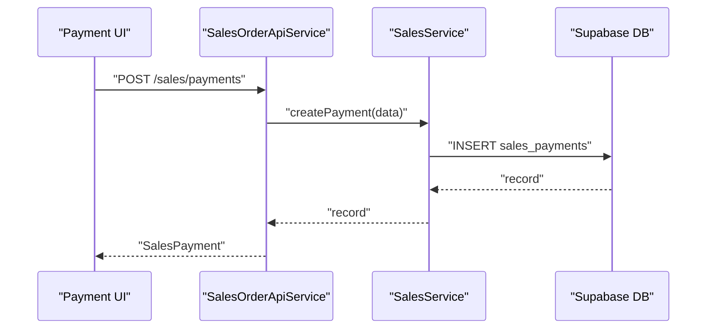
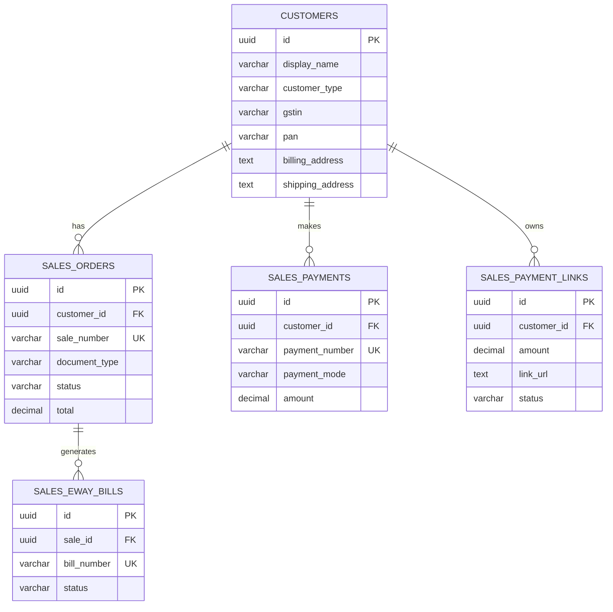
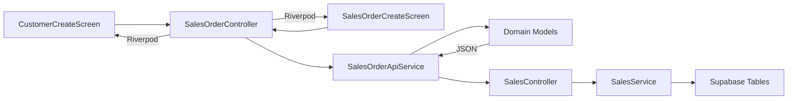

# Sales Module

<cite>
**Referenced Files in This Document**
- [sales_order_controller.dart](file://lib/modules/sales/controller/sales_order_controller.dart)
- [sales_order_api_service.dart](file://lib/modules/sales/services/sales_order_api_service.dart)
- [sales_customer_model.dart](file://lib/modules/sales/models/sales_customer_model.dart)
- [sales_order_model.dart](file://lib/modules/sales/models/sales_order_model.dart)
- [sales_order_item_model.dart](file://lib/modules/sales/models/sales_order_item_model.dart)
- [sales_payment_model.dart](file://lib/modules/sales/models/sales_payment_model.dart)
- [sales_eway_bill_model.dart](file://lib/modules/sales/models/sales_eway_bill_model.dart)
- [gstin_lookup_model.dart](file://lib/modules/sales/models/gstin_lookup_model.dart)
- [gstin_lookup_service.dart](file://lib/modules/sales/services/gstin_lookup_service.dart)
- [customers_repository.dart](file://lib/modules/sales/repositories/customers_repository.dart)
- [sales_customer_customer_create.dart](file://lib/modules/sales/presentation/sales_customer_customer_create.dart)
- [sales_sales_order_create.dart](file://lib/modules/sales/presentation/sales_sales_order_create.dart)
- [sales.controller.ts](file://backend/src/sales/sales.controller.ts)
- [sales.service.ts](file://backend/src/sales/sales.service.ts)
- [sales.module.ts](file://backend/src/sales/sales.module.ts)
- [schema.ts](file://backend/src/db/schema.ts)
- [001_schema_redesigned.sql](file://supabase/migrations/001_schema_redesigned.sql)
</cite>

## Table of Contents
1. [Introduction](#introduction)
2. [Project Structure](#project-structure)
3. [Core Components](#core-components)
4. [Architecture Overview](#architecture-overview)
5. [Detailed Component Analysis](#detailed-component-analysis)
6. [Dependency Analysis](#dependency-analysis)
7. [Performance Considerations](#performance-considerations)
8. [Troubleshooting Guide](#troubleshooting-guide)
9. [Conclusion](#conclusion)
10. [Appendices](#appendices)

## Introduction
This document provides comprehensive documentation for the Sales module, covering the complete sales lifecycle management. It explains customer management (creation, profile management, GST compliance), the multi-document workflow (quotations, sales orders, invoices, credit notes, delivery challans), e-way bill generation with GST compliance, payment processing (multiple methods, payment links, reconciliation), reporting and analytics, integrations with customer databases, inventory systems, and accounting modules, and implementation details for sales order lifecycle, numbering schemes, and approval workflows. Practical examples illustrate end-to-end transactions from customer inquiry to payment receipt, including edge cases and error handling.

## Project Structure
The Sales module spans the frontend Flutter application and the NestJS backend:
- Frontend (Flutter):
  - Controllers and state management for sales entities
  - Models for domain entities (customer, order, item, payment, e-way bill)
  - Services for API communication and GSTIN lookup
  - Repositories for offline-first customer caching
  - Presentation screens for customer creation and sales order creation
- Backend (NestJS + Drizzle ORM + Supabase):
  - Sales controller exposing REST endpoints
  - Sales service implementing CRUD and business logic
  - Database schema for customers, sales orders, payments, e-way bills, and payment links
  - Supabase migrations defining the relational model

**Diagram sources**
- [sales_order_controller.dart](file://lib/modules/sales/controller/sales_order_controller.dart#L67-L119)
- [sales_order_api_service.dart](file://lib/modules/sales/services/sales_order_api_service.dart#L10-L192)
- [sales_customer_customer_create.dart](file://lib/modules/sales/presentation/sales_customer_customer_create.dart#L27-L270)
- [sales_sales_order_create.dart](file://lib/modules/sales/presentation/sales_sales_order_create.dart#L17-L685)
- [sales.controller.ts](file://backend/src/sales/sales.controller.ts#L14-L102)
- [sales.service.ts](file://backend/src/sales/sales.service.ts#L7-L162)
- [schema.ts](file://backend/src/db/schema.ts#L213-L292)
- [001_schema_redesigned.sql](file://supabase/migrations/001_schema_redesigned.sql#L25-L104)

**Section sources**
- [sales_order_controller.dart](file://lib/modules/sales/controller/sales_order_controller.dart#L1-L119)
- [sales_order_api_service.dart](file://lib/modules/sales/services/sales_order_api_service.dart#L1-L192)
- [sales.controller.ts](file://backend/src/sales/sales.controller.ts#L1-L102)
- [sales.service.ts](file://backend/src/sales/sales.service.ts#L1-L162)
- [schema.ts](file://backend/src/db/schema.ts#L213-L292)
- [001_schema_redesigned.sql](file://supabase/migrations/001_schema_redesigned.sql#L1-L180)

## Core Components
- SalesOrderController: Manages asynchronous lists of sales documents and exposes create/delete operations for orders and customers.
- SalesOrderApiService: Encapsulates HTTP calls to backend endpoints for customers, sales orders, payments, e-way bills, and payment links.
- Domain Models: SalesCustomer, SalesOrder, SalesOrderItem, SalesPayment, SalesEWayBill define typed data structures and JSON serialization.
- GSTIN Lookup: GstinLookupService and GstinLookupResult support GST compliance by validating and enriching customer GST details.
- CustomersRepository: Implements online-first with offline fallback for customer data, caching via Hive and API synchronization.
- UI Screens: Customer creation screen integrates GSTIN lookup; Sales order creation screen manages items, totals, and document submission.

**Section sources**
- [sales_order_controller.dart](file://lib/modules/sales/controller/sales_order_controller.dart#L67-L119)
- [sales_order_api_service.dart](file://lib/modules/sales/services/sales_order_api_service.dart#L10-L192)
- [sales_customer_model.dart](file://lib/modules/sales/models/sales_customer_model.dart#L1-L93)
- [sales_order_model.dart](file://lib/modules/sales/models/sales_order_model.dart#L4-L118)
- [sales_order_item_model.dart](file://lib/modules/sales/models/sales_order_item_model.dart#L3-L62)
- [sales_payment_model.dart](file://lib/modules/sales/models/sales_payment_model.dart#L1-L61)
- [sales_eway_bill_model.dart](file://lib/modules/sales/models/sales_eway_bill_model.dart#L1-L52)
- [gstin_lookup_model.dart](file://lib/modules/sales/models/gstin_lookup_model.dart#L1-L173)
- [gstin_lookup_service.dart](file://lib/modules/sales/services/gstin_lookup_service.dart#L1-L28)
- [customers_repository.dart](file://lib/modules/sales/repositories/customers_repository.dart#L1-L165)
- [sales_customer_customer_create.dart](file://lib/modules/sales/presentation/sales_customer_customer_create.dart#L27-L270)
- [sales_sales_order_create.dart](file://lib/modules/sales/presentation/sales_sales_order_create.dart#L17-L685)

## Architecture Overview
The Sales module follows a layered architecture:
- Presentation Layer: Flutter screens and Riverpod providers orchestrate user interactions and state.
- Domain Layer: Strongly-typed models encapsulate business data and serialization.
- Service Layer: API service abstracts HTTP communication; repository handles offline caching.
- Application Layer: Controller coordinates operations and refreshes UI state.
- Infrastructure Layer: Backend REST APIs, Drizzle ORM, and Supabase schema implement persistence.

**Diagram sources**
- [sales_sales_order_create.dart](file://lib/modules/sales/presentation/sales_sales_order_create.dart#L635-L683)
- [sales_order_controller.dart](file://lib/modules/sales/controller/sales_order_controller.dart#L86-L95)
- [sales_order_api_service.dart](file://lib/modules/sales/services/sales_order_api_service.dart#L104-L121)
- [sales.service.ts](file://backend/src/sales/sales.service.ts#L80-L97)
- [schema.ts](file://backend/src/db/schema.ts#L236-L253)

## Detailed Component Analysis

### Customer Management
- Creation and Profile Management:
  - The customer creation screen collects personal/business details, contact info, billing/shipping addresses, PAN/GSTIN, currency, payment terms, and optional custom fields.
  - On save, the controller invokes the API service to create a customer and invalidates the customers provider to refresh the UI.
- GST Compliance Features:
  - GSTIN lookup service supports fetching and parsing GSTIN details with flexible key mapping.
  - The UI integrates GSTIN lookup to prefill legal/trade names and addresses, aiding compliance.

**Diagram sources**
- [sales_customer_customer_create.dart](file://lib/modules/sales/presentation/sales_customer_customer_create.dart#L233-L269)
- [sales_order_controller.dart](file://lib/modules/sales/controller/sales_order_controller.dart#L107-L117)
- [sales_order_api_service.dart](file://lib/modules/sales/services/sales_order_api_service.dart#L27-L40)
- [sales.service.ts](file://backend/src/sales/sales.service.ts#L42-L61)
- [schema.ts](file://backend/src/db/schema.ts#L213-L234)

**Section sources**
- [sales_customer_customer_create.dart](file://lib/modules/sales/presentation/sales_customer_customer_create.dart#L27-L270)
- [gstin_lookup_service.dart](file://lib/modules/sales/services/gstin_lookup_service.dart#L7-L26)
- [gstin_lookup_model.dart](file://lib/modules/sales/models/gstin_lookup_model.dart#L18-L74)
- [sales_order_controller.dart](file://lib/modules/sales/controller/sales_order_controller.dart#L107-L117)
- [sales_order_api_service.dart](file://lib/modules/sales/services/sales_order_api_service.dart#L27-L40)
- [sales.service.ts](file://backend/src/sales/sales.service.ts#L42-L61)
- [schema.ts](file://backend/src/db/schema.ts#L213-L234)

### Multi-Document Workflow
- Supported Documents: Quotes, Sales Orders, Invoices, Credit Notes, Delivery Challans, Retainer Invoices, Recurring Invoices.
- Retrieval and Filtering:
  - The API service supports retrieving documents by type via a query parameter.
  - Riverpod providers expose typed lists for each document type.
- Lifecycle:
  - Create: Submit JSON payload via POST to the generic sales endpoint.
  - Read: GET by ID or list filtered by type.
  - Update/Delete: Update operations are not exposed in the current API; deletion is supported via DELETE by ID.

**Diagram sources**
- [sales_order_api_service.dart](file://lib/modules/sales/services/sales_order_api_service.dart#L43-L57)
- [sales_order_controller.dart](file://lib/modules/sales/controller/sales_order_controller.dart#L27-L57)
- [sales.service.ts](file://backend/src/sales/sales.service.ts#L64-L78)

**Section sources**
- [sales_order_api_service.dart](file://lib/modules/sales/services/sales_order_api_service.dart#L43-L57)
- [sales_order_controller.dart](file://lib/modules/sales/controller/sales_order_controller.dart#L27-L57)
- [sales.service.ts](file://backend/src/sales/sales.service.ts#L64-L78)

### Sales Order Lifecycle
- Creation:
  - The order creation screen initializes a default sale number, captures customer, dates, payment terms, delivery method, salesperson, items, quantities, rates, discounts, and totals.
  - Totals are computed dynamically; taxes are calculated in the backend/service layer.
- Submission:
  - On confirm/save, the controller serializes the order and posts it to the backend; the list is refreshed upon success.
- Numbering Scheme:
  - The UI generates a default sale number pattern; the backend persists a unique sale number and enforces uniqueness.

**Diagram sources**
- [sales_sales_order_create.dart](file://lib/modules/sales/presentation/sales_sales_order_create.dart#L635-L683)
- [sales_order_controller.dart](file://lib/modules/sales/controller/sales_order_controller.dart#L86-L95)
- [sales_order_api_service.dart](file://lib/modules/sales/services/sales_order_api_service.dart#L104-L121)
- [sales.service.ts](file://backend/src/sales/sales.service.ts#L80-L97)
- [schema.ts](file://backend/src/db/schema.ts#L236-L253)

**Section sources**
- [sales_sales_order_create.dart](file://lib/modules/sales/presentation/sales_sales_order_create.dart#L51-L114)
- [sales_sales_order_create.dart](file://lib/modules/sales/presentation/sales_sales_order_create.dart#L635-L683)
- [sales_order_controller.dart](file://lib/modules/sales/controller/sales_order_controller.dart#L86-L95)
- [sales_order_api_service.dart](file://lib/modules/sales/services/sales_order_api_service.dart#L104-L121)
- [sales.service.ts](file://backend/src/sales/sales.service.ts#L80-L97)
- [schema.ts](file://backend/src/db/schema.ts#L236-L253)

### E-Way Bill Generation and GST Compliance
- E-Way Bill Model:
  - Supports bill number/date, supply/sub-type, transporter ID, vehicle number, and status.
- Creation Flow:
  - The API service exposes endpoints to list and create e-way bills.
  - The backend service persists e-way bill records linked to sales orders.
- GST Compliance:
  - The GSTIN lookup service retrieves legal/trade names and addresses to support compliance during customer onboarding and order processing.

**Diagram sources**
- [sales_order_api_service.dart](file://lib/modules/sales/services/sales_order_api_service.dart#L148-L161)
- [sales.service.ts](file://backend/src/sales/sales.service.ts#L133-L145)
- [schema.ts](file://backend/src/db/schema.ts#L269-L282)

**Section sources**
- [sales_eway_bill_model.dart](file://lib/modules/sales/models/sales_eway_bill_model.dart#L1-L52)
- [sales_order_api_service.dart](file://lib/modules/sales/services/sales_order_api_service.dart#L135-L161)
- [sales.service.ts](file://backend/src/sales/sales.service.ts#L128-L145)
- [schema.ts](file://backend/src/db/schema.ts#L269-L282)
- [gstin_lookup_service.dart](file://lib/modules/sales/services/gstin_lookup_service.dart#L7-L26)
- [gstin_lookup_model.dart](file://lib/modules/sales/models/gstin_lookup_model.dart#L18-L74)

### Payment Processing
- Payment Methods and Records:
  - Payment model includes mode, amount, bank charges, reference, deposit account, notes, and customer linkage.
  - The API service supports listing and creating payments; the backend persists payment records.
- Payment Links:
  - Payment links are supported with URL generation and status tracking.
- Reconciliation:
  - The payment records can be queried and reconciled against sales documents via customer and amount fields.

**Diagram sources**
- [sales_order_api_service.dart](file://lib/modules/sales/services/sales_order_api_service.dart#L77-L90)
- [sales.service.ts](file://backend/src/sales/sales.service.ts#L113-L126)
- [schema.ts](file://backend/src/db/schema.ts#L254-L267)

**Section sources**
- [sales_payment_model.dart](file://lib/modules/sales/models/sales_payment_model.dart#L1-L61)
- [sales_order_api_service.dart](file://lib/modules/sales/services/sales_order_api_service.dart#L63-L90)
- [sales.service.ts](file://backend/src/sales/sales.service.ts#L108-L126)
- [schema.ts](file://backend/src/db/schema.ts#L254-L267)

### Reporting and Analytics
- Daily Sales Report:
  - A dedicated screen exists for daily sales reporting, indicating analytics capabilities within the module.
- Totals and Summaries:
  - The sales order creation screen computes and displays subtotals, taxes, shipping, adjustments, and totals, supporting basic transaction analytics.

**Section sources**
- [sales_sales_order_create.dart](file://lib/modules/sales/presentation/sales_sales_order_create.dart#L497-L514)

### Integrations
- Customer Database:
  - Supabase customers table stores customer profiles, GSTIN/PAN, addresses, and payment terms.
- Inventory Systems:
  - Sales order items reference product IDs; the global product master schema supports organization-specific extensions and inventory settings.
- Accounting Modules:
  - Accounts and inventory valuation methods are defined in the schema, enabling integration with accounting workflows.

**Diagram sources**
- [schema.ts](file://backend/src/db/schema.ts#L213-L292)

**Section sources**
- [schema.ts](file://backend/src/db/schema.ts#L213-L292)
- [001_schema_redesigned.sql](file://supabase/migrations/001_schema_redesigned.sql#L25-L104)

## Dependency Analysis
- Frontend Dependencies:
  - SalesOrderController depends on SalesOrderApiService and Riverpod providers.
  - SalesOrderApiService depends on ApiClient and domain models.
  - UI screens depend on controllers and models.
- Backend Dependencies:
  - SalesController delegates to SalesService.
  - SalesService uses Drizzle ORM to query Supabase tables.
- Data Model Dependencies:
  - Sales orders reference customers; e-way bills reference sales orders; payments reference customers; payment links reference customers.

**Diagram sources**
- [sales_order_controller.dart](file://lib/modules/sales/controller/sales_order_controller.dart#L67-L119)
- [sales_order_api_service.dart](file://lib/modules/sales/services/sales_order_api_service.dart#L10-L192)
- [sales_sales_order_create.dart](file://lib/modules/sales/presentation/sales_sales_order_create.dart#L17-L685)
- [sales_customer_customer_create.dart](file://lib/modules/sales/presentation/sales_customer_customer_create.dart#L27-L270)
- [sales.controller.ts](file://backend/src/sales/sales.controller.ts#L14-L102)
- [sales.service.ts](file://backend/src/sales/sales.service.ts#L7-L162)
- [schema.ts](file://backend/src/db/schema.ts#L213-L292)

**Section sources**
- [sales_order_controller.dart](file://lib/modules/sales/controller/sales_order_controller.dart#L67-L119)
- [sales_order_api_service.dart](file://lib/modules/sales/services/sales_order_api_service.dart#L10-L192)
- [sales.controller.ts](file://backend/src/sales/sales.controller.ts#L14-L102)
- [sales.service.ts](file://backend/src/sales/sales.service.ts#L7-L162)
- [schema.ts](file://backend/src/db/schema.ts#L213-L292)

## Performance Considerations
- Offline-First Customer Access:
  - The customer repository caches data locally and falls back to cached data when the API is unavailable, reducing latency and improving reliability.
- Efficient UI Updates:
  - Riverpod providers invalidate and refresh lists after create/update/delete operations, ensuring UI consistency without manual polling.
- API Payload Size:
  - The sales order payload includes only essential fields; consider lazy-loading item details and deferring heavy computations to the backend to minimize payload sizes.

[No sources needed since this section provides general guidance]

## Troubleshooting Guide
- Customer Creation Failures:
  - Validate required fields and handle exceptions thrown by the API service; ensure GSTIN/PAN formats align with backend expectations.
- Sales Order Submission Errors:
  - Inspect API error responses and log payloads for debugging; confirm unique sale numbers and valid customer IDs.
- E-Way Bill Issues:
  - Verify sale ID linkage and status transitions; ensure mandatory fields like bill number/date are present.
- Payment Discrepancies:
  - Reconcile payment records against sales documents; confirm amounts, modes, and references match transaction records.
- Offline Data Sync:
  - Monitor cache staleness thresholds and last sync timestamps; refresh data manually if needed.

**Section sources**
- [sales_order_api_service.dart](file://lib/modules/sales/services/sales_order_api_service.dart#L114-L120)
- [customers_repository.dart](file://lib/modules/sales/repositories/customers_repository.dart#L146-L163)

## Conclusion
The Sales module provides a robust foundation for managing the complete sales lifecycle, including customer management with GST compliance, multi-document workflows, e-way bill generation, payment processing, and reporting. Its layered architecture ensures maintainability, while offline-first caching and Riverpod-driven state management deliver a responsive user experience. Integrations with customer, inventory, and accounting systems are modeled through well-defined schemas and REST endpoints.

[No sources needed since this section summarizes without analyzing specific files]

## Appendices

### Implementation Details: Document Numbering and Approval Workflows
- Numbering Scheme:
  - The UI generates a default sale number pattern; the backend persists a unique sale number and enforces uniqueness.
- Approval Workflows:
  - Current API supports draft and confirmed statuses; approval workflows can be extended by adding status transitions and validation rules in the backend service.

**Section sources**
- [sales_sales_order_create.dart](file://lib/modules/sales/presentation/sales_sales_order_create.dart#L53-L55)
- [sales.service.ts](file://backend/src/sales/sales.service.ts#L80-L97)

### Practical Example: Complete Sales Transaction
- From Inquiry to Payment Receipt:
  - Create a customer with GSTIN/PAN and addresses.
  - Create a sales order with items, quantities, rates, and totals; submit as draft or confirmed.
  - Optionally generate an e-way bill for shipment.
  - Record payments via cash/card/transfer or payment links; reconcile against the order.
  - Generate daily sales reports for analytics.

**Section sources**
- [sales_customer_customer_create.dart](file://lib/modules/sales/presentation/sales_customer_customer_create.dart#L233-L269)
- [sales_sales_order_create.dart](file://lib/modules/sales/presentation/sales_sales_order_create.dart#L635-L683)
- [sales_order_api_service.dart](file://lib/modules/sales/services/sales_order_api_service.dart#L148-L161)
- [sales_order_api_service.dart](file://lib/modules/sales/services/sales_order_api_service.dart#L77-L90)