# Sales Reporting & Analytics

<cite>
**Referenced Files in This Document**
- [reports_reports_dashboard.dart](file://lib/modules/reports/presentation/reports_reports_dashboard.dart)
- [reports_sales_sales_daily.dart](file://lib/modules/reports/presentation/reports_sales_sales_daily.dart)
- [sales_generic_list.dart](file://lib/modules/sales/presentation/sales_generic_list.dart)
- [sales_generic_list_table.dart](file://lib/modules/sales/presentation/sections/sales_generic_list_table.dart)
- [sales_generic_list_table_logic.dart](file://lib/modules/sales/presentation/sections/sales_generic_list_table_logic.dart)
- [sales_generic_list_filter.dart](file://lib/modules/sales/presentation/sections/sales_generic_list_filter.dart)
- [sales_generic_list_search_dialog.dart](file://lib/modules/sales/presentation/sections/sales_generic_list_search_dialog.dart)
- [sales_generic_list_columns.dart](file://lib/modules/sales/presentation/sections/sales_generic_list_columns.dart)
- [sales_generic_list_import_export_dialog.dart](file://lib/modules/sales/presentation/sections/sales_generic_list_import_export_dialog.dart)
- [sales_generic_list_ui.dart](file://lib/modules/sales/presentation/sections/sales_generic_list_ui.dart)
</cite>

## Table of Contents
1. [Introduction](#introduction)
2. [Project Structure](#project-structure)
3. [Core Components](#core-components)
4. [Architecture Overview](#architecture-overview)
5. [Detailed Component Analysis](#detailed-component-analysis)
6. [Dependency Analysis](#dependency-analysis)
7. [Performance Considerations](#performance-considerations)
8. [Troubleshooting Guide](#troubleshooting-guide)
9. [Conclusion](#conclusion)
10. [Appendices](#appendices)

## Introduction
This document describes the Sales Reporting and Analytics capabilities implemented in the system. It focuses on:
- Sales dashboard components with summary cards and report navigation
- Daily sales reporting with aggregation and totals
- Generic list functionality enabling customizable views, filtering, sorting, advanced search, import/export, and bulk actions
- Practical examples of common sales reports and how to create custom views
- Guidance for integrating with external BI tools and visualization platforms
- Implementation notes for data aggregation, caching strategies, and real-time analytics processing

## Project Structure
The Sales Reporting and Analytics features are primarily implemented in the Flutter frontend under the modules directory:
- Reports: dashboard and daily sales report
- Sales: generic list screen and supporting sections for columns, filtering, search, import/export, and UI actions

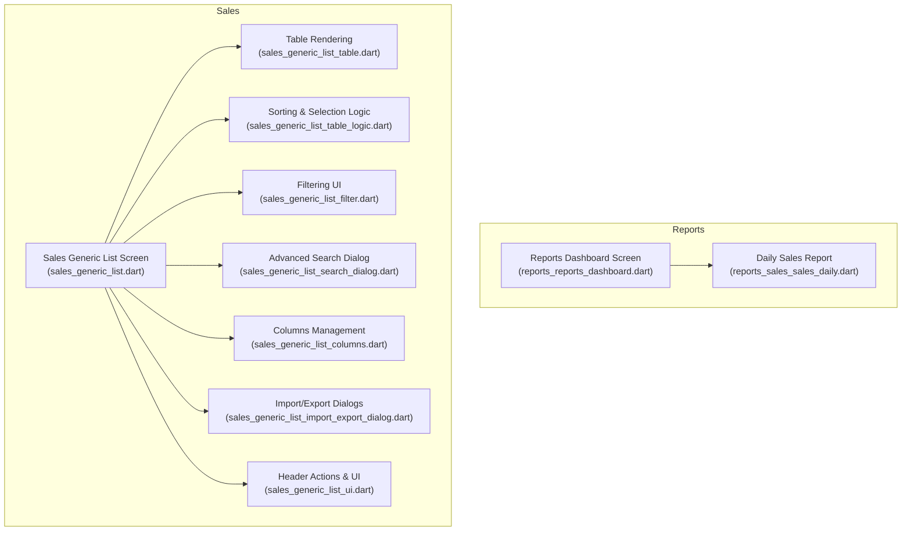

**Diagram sources**
- [reports_reports_dashboard.dart](file://lib/modules/reports/presentation/reports_reports_dashboard.dart#L1-L214)
- [reports_sales_sales_daily.dart](file://lib/modules/reports/presentation/reports_sales_sales_daily.dart#L1-L213)
- [sales_generic_list.dart](file://lib/modules/sales/presentation/sales_generic_list.dart#L1-L414)
- [sales_generic_list_table.dart](file://lib/modules/sales/presentation/sections/sales_generic_list_table.dart#L1-L287)
- [sales_generic_list_table_logic.dart](file://lib/modules/sales/presentation/sections/sales_generic_list_table_logic.dart#L1-L99)
- [sales_generic_list_filter.dart](file://lib/modules/sales/presentation/sections/sales_generic_list_filter.dart#L1-L221)
- [sales_generic_list_search_dialog.dart](file://lib/modules/sales/presentation/sections/sales_generic_list_search_dialog.dart#L1-L958)
- [sales_generic_list_columns.dart](file://lib/modules/sales/presentation/sections/sales_generic_list_columns.dart#L1-L405)
- [sales_generic_list_import_export_dialog.dart](file://lib/modules/sales/presentation/sections/sales_generic_list_import_export_dialog.dart#L1-L550)
- [sales_generic_list_ui.dart](file://lib/modules/sales/presentation/sections/sales_generic_list_ui.dart#L1-L460)

**Section sources**
- [reports_reports_dashboard.dart](file://lib/modules/reports/presentation/reports_reports_dashboard.dart#L1-L214)
- [reports_sales_sales_daily.dart](file://lib/modules/reports/presentation/reports_sales_sales_daily.dart#L1-L213)
- [sales_generic_list.dart](file://lib/modules/sales/presentation/sales_generic_list.dart#L1-L414)

## Core Components
- Reports Dashboard: Presents summary cards and categorized report links for quick navigation to sales reports.
- Daily Sales Report: Aggregates sales by date, computes counts and totals, and renders a summarized table with totals row.
- Generic List Screen: A reusable, extensible list interface supporting:
  - Customizable columns (visibility, ordering, width)
  - Sorting and selection
  - Filtering via overlay menu and favorites
  - Advanced search dialog with multiple criteria
  - Import/export dialogs with format and privacy options
  - Bulk actions toolbar and empty-state handling

**Section sources**
- [reports_reports_dashboard.dart](file://lib/modules/reports/presentation/reports_reports_dashboard.dart#L32-L212)
- [reports_sales_sales_daily.dart](file://lib/modules/reports/presentation/reports_sales_sales_daily.dart#L23-L203)
- [sales_generic_list.dart](file://lib/modules/sales/presentation/sales_generic_list.dart#L35-L150)

## Architecture Overview
The Sales Reporting and Analytics architecture follows a layered pattern:
- Presentation layer: Screens and widgets render UI, handle user interactions, and orchestrate data display
- Data layer: Riverpod providers supply asynchronous data streams to screens
- Services: APIs/services fetch and transform data (referenced by screens)
- Models: Strongly typed models represent domain entities (e.g., SalesOrder, SalesCustomer)

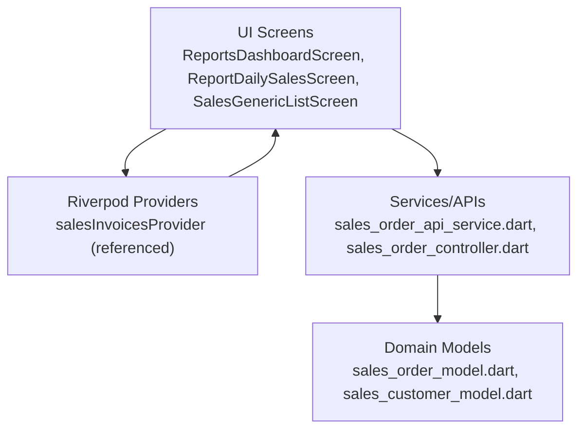

**Diagram sources**
- [reports_reports_dashboard.dart](file://lib/modules/reports/presentation/reports_reports_dashboard.dart#L5-L30)
- [reports_sales_sales_daily.dart](file://lib/modules/reports/presentation/reports_sales_sales_daily.dart#L9-L23)
- [sales_generic_list.dart](file://lib/modules/sales/presentation/sales_generic_list.dart#L1-L20)

## Detailed Component Analysis

### Reports Dashboard
- Purpose: Central hub for accessing all reports with summary cards and categorized report tiles.
- Highlights:
  - Summary cards for key metrics (e.g., Total Sales, Total Customers, Pending Invoices, Escaped Profits)
  - Grid of report categories (Sales, Inventory, Receivables, Tax) with actionable items
  - Navigation to specific reports (e.g., Daily Sales)

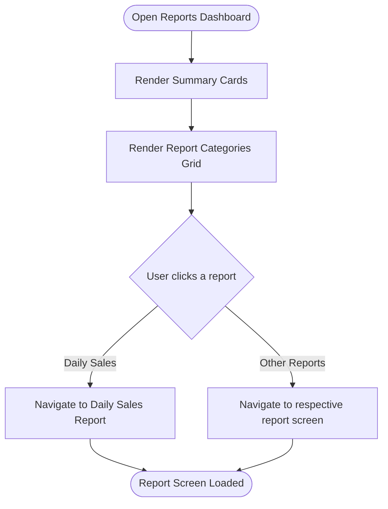

**Diagram sources**
- [reports_reports_dashboard.dart](file://lib/modules/reports/presentation/reports_reports_dashboard.dart#L114-L212)

**Section sources**
- [reports_reports_dashboard.dart](file://lib/modules/reports/presentation/reports_reports_dashboard.dart#L32-L212)

### Daily Sales Report
- Purpose: Summarize sales activity by day with invoice counts and totals.
- Highlights:
  - Uses a Riverpod provider to watch sales data asynchronously
  - Groups sales by date (year-month-day) and aggregates counts and amounts
  - Renders a bordered table with header, rows, and a totals row
  - Handles loading and error states gracefully

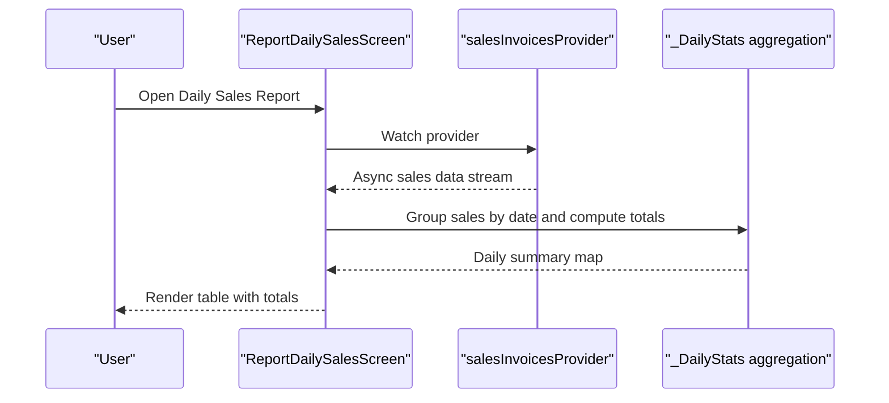

**Diagram sources**
- [reports_sales_sales_daily.dart](file://lib/modules/reports/presentation/reports_sales_sales_daily.dart#L13-L203)

**Section sources**
- [reports_sales_sales_daily.dart](file://lib/modules/reports/presentation/reports_sales_sales_daily.dart#L23-L203)

### Generic List Screen (Reusable Sales Data View)
- Purpose: A flexible, configurable list for viewing and managing sales-related entities (e.g., orders, customers, payments, e-way bills, payment links).
- Key capabilities:
  - Customizable columns: visibility, ordering, width, and persistence prompts
  - Sorting: single-column ascending/descending toggle
  - Selection: select-all and per-row selection with bulk actions toolbar
  - Filtering: overlay menu with default and favorite filters
  - Advanced search: comprehensive dialog with multiple criteria
  - Import/Export: dialogs for supported formats and privacy controls
  - Empty state and navigation to create new records

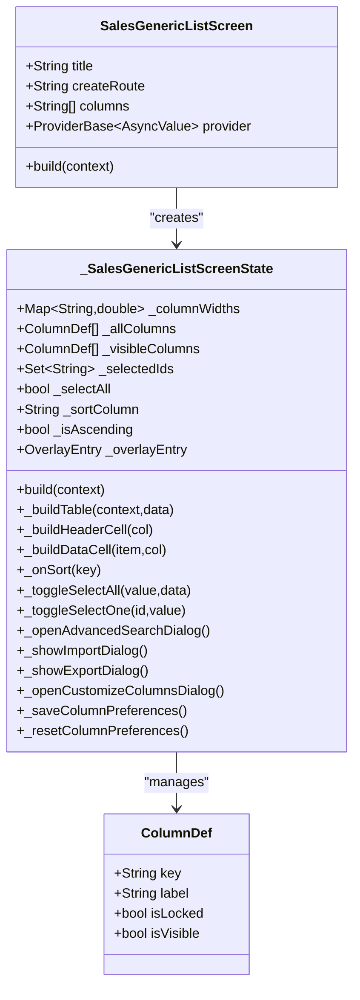

**Diagram sources**
- [sales_generic_list.dart](file://lib/modules/sales/presentation/sales_generic_list.dart#L35-L150)
- [sales_generic_list_columns.dart](file://lib/modules/sales/presentation/sections/sales_generic_list_columns.dart#L21-L151)

**Section sources**
- [sales_generic_list.dart](file://lib/modules/sales/presentation/sales_generic_list.dart#L35-L414)
- [sales_generic_list_ui.dart](file://lib/modules/sales/presentation/sections/sales_generic_list_ui.dart#L48-L140)
- [sales_generic_list_columns.dart](file://lib/modules/sales/presentation/sections/sales_generic_list_columns.dart#L3-L151)
- [sales_generic_list_table.dart](file://lib/modules/sales/presentation/sections/sales_generic_list_table.dart#L3-L80)
- [sales_generic_list_table_logic.dart](file://lib/modules/sales/presentation/sections/sales_generic_list_table_logic.dart#L3-L99)
- [sales_generic_list_filter.dart](file://lib/modules/sales/presentation/sections/sales_generic_list_filter.dart#L3-L221)
- [sales_generic_list_search_dialog.dart](file://lib/modules/sales/presentation/sections/sales_generic_list_search_dialog.dart#L3-L221)
- [sales_generic_list_import_export_dialog.dart](file://lib/modules/sales/presentation/sections/sales_generic_list_import_export_dialog.dart#L3-L136)

### Table Rendering and Cell Content
- Purpose: Render the table body with dynamic columns, cell formatting, and status badges.
- Highlights:
  - Per-entity rendering for SalesCustomer, SalesOrder, SalesPayment, SalesEWayBill, SalesPaymentLink
  - Currency formatting and status badges with color-coded states
  - Hover and selection visuals for improved UX

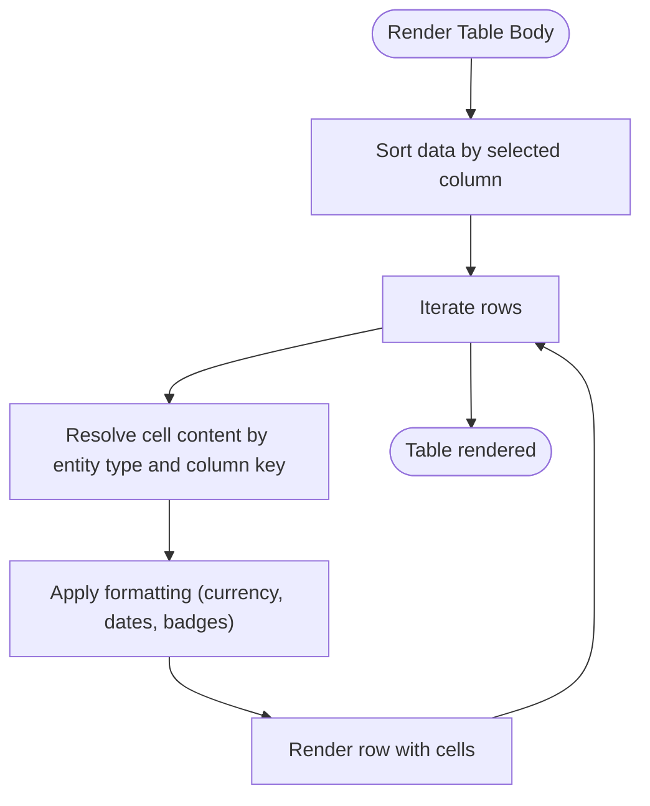

**Diagram sources**
- [sales_generic_list_table.dart](file://lib/modules/sales/presentation/sections/sales_generic_list_table.dart#L82-L286)

**Section sources**
- [sales_generic_list_table.dart](file://lib/modules/sales/presentation/sections/sales_generic_list_table.dart#L82-L286)

### Sorting and Selection Logic
- Purpose: Manage sort state, compare values, and selection state for bulk actions.
- Highlights:
  - Single-column sort with ascending/descending toggles
  - Numeric vs string comparison with null handling
  - Select-all and per-row selection with persistent selection set

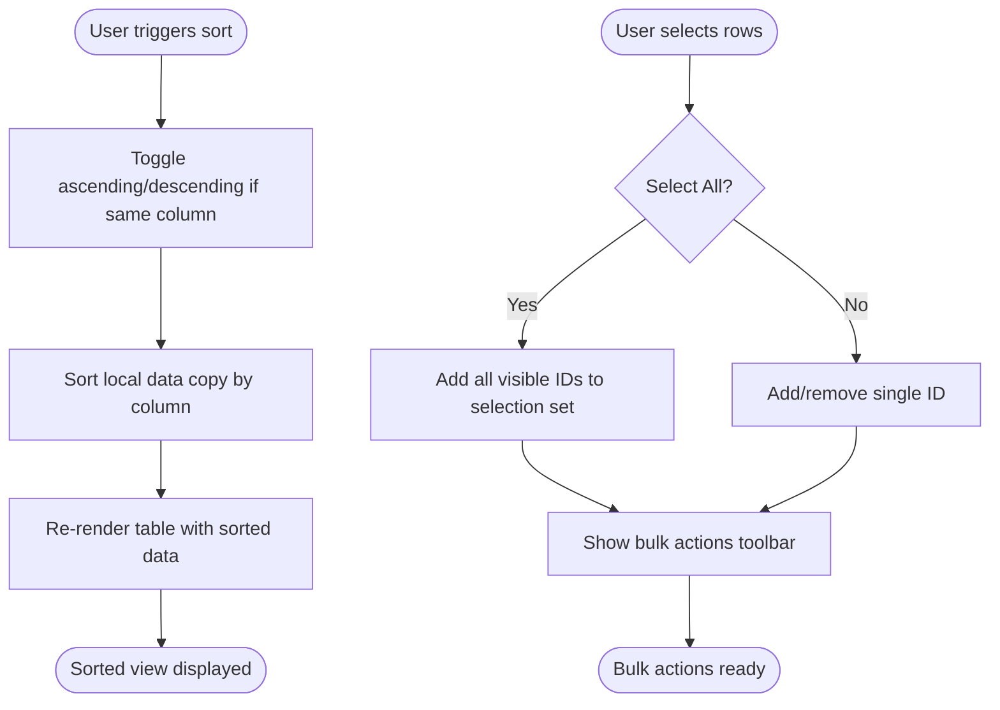

**Diagram sources**
- [sales_generic_list_table_logic.dart](file://lib/modules/sales/presentation/sections/sales_generic_list_table_logic.dart#L59-L97)

**Section sources**
- [sales_generic_list_table_logic.dart](file://lib/modules/sales/presentation/sections/sales_generic_list_table_logic.dart#L3-L99)

### Filtering and Favorites
- Purpose: Provide an overlay menu for selecting predefined and favorite filters.
- Highlights:
  - Default filters (e.g., Active Customers, Overdue Customers)
  - Favorite filters with star toggle
  - Persistent selection and visual feedback

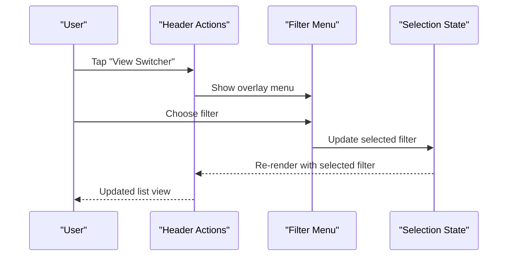

**Diagram sources**
- [sales_generic_list_filter.dart](file://lib/modules/sales/presentation/sections/sales_generic_list_filter.dart#L17-L126)

**Section sources**
- [sales_generic_list_filter.dart](file://lib/modules/sales/presentation/sections/sales_generic_list_filter.dart#L3-L221)

### Advanced Search Dialog
- Purpose: Allow complex, multi-criteria searches across entities.
- Highlights:
  - Modular selection (Customers, Items, Documents, etc.)
  - Filter presets (e.g., All Customers)
  - Extensive customer search fields (names, contact info, GST treatment, place of supply)
  - Search and filter input with live filtering

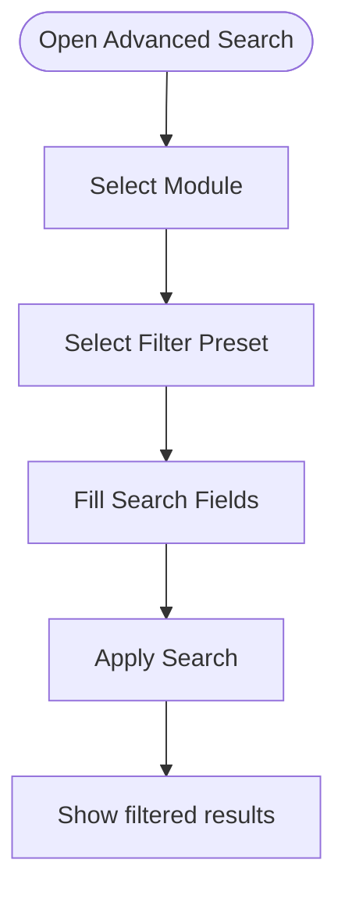

**Diagram sources**
- [sales_generic_list_search_dialog.dart](file://lib/modules/sales/presentation/sections/sales_generic_list_search_dialog.dart#L99-L221)

**Section sources**
- [sales_generic_list_search_dialog.dart](file://lib/modules/sales/presentation/sections/sales_generic_list_search_dialog.dart#L3-L221)

### Import/Export Dialogs
- Purpose: Enable importing and exporting data with format and privacy controls.
- Highlights:
  - Export formats: CSV, XLS, XLSX
  - Entity types: Customers, Contact Persons, Addresses
  - Decimal format options and optional password protection
  - Import options for entities

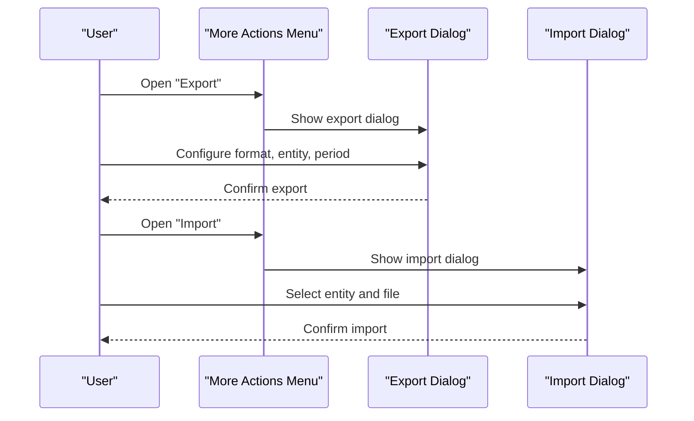

**Diagram sources**
- [sales_generic_list_import_export_dialog.dart](file://lib/modules/sales/presentation/sections/sales_generic_list_import_export_dialog.dart#L138-L484)

**Section sources**
- [sales_generic_list_import_export_dialog.dart](file://lib/modules/sales/presentation/sections/sales_generic_list_import_export_dialog.dart#L3-L550)

### Columns Management
- Purpose: Customize visible columns, reorder, resize, and persist preferences.
- Highlights:
  - Locked columns (e.g., Name)
  - Resizable columns with min/max constraints
  - Save/reset preferences with user feedback

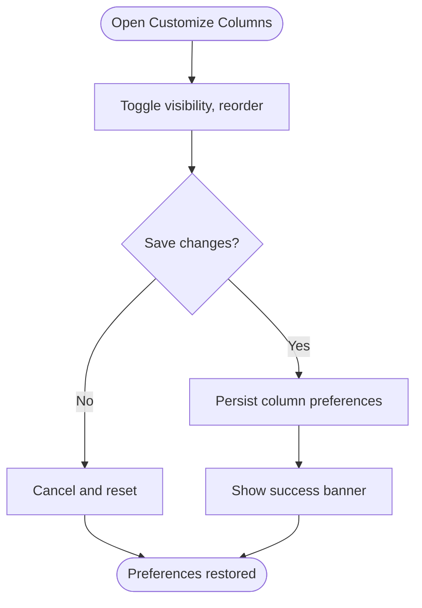

**Diagram sources**
- [sales_generic_list_columns.dart](file://lib/modules/sales/presentation/sections/sales_generic_list_columns.dart#L122-L151)

**Section sources**
- [sales_generic_list_columns.dart](file://lib/modules/sales/presentation/sections/sales_generic_list_columns.dart#L3-L151)

### Practical Examples and Workflows
- Daily Sales Summary
  - Navigate to Daily Sales Report from Reports Dashboard
  - The screen groups invoices by date, computes counts and totals, and displays a summarized table
  - Use the “Refresh List” action to reload data
  - Use “Export” to export the current view to CSV/XLSX

- Custom Sales Views
  - Use “Customize Columns” to adjust visibility and order
  - Use “Sort by” to change the primary sort column
  - Use “Filter” to apply default or favorite filters
  - Use “Advanced Search” to refine results with multiple criteria
  - Use “Reset Column Width” to restore defaults

- Executive Dashboards
  - Combine summary cards from the Reports Dashboard with detailed lists from the Generic List Screen
  - Use export to share reports with stakeholders
  - Integrate with external BI tools by exporting to CSV/XLSX and importing into visualization platforms

**Section sources**
- [reports_reports_dashboard.dart](file://lib/modules/reports/presentation/reports_reports_dashboard.dart#L114-L212)
- [reports_sales_sales_daily.dart](file://lib/modules/reports/presentation/reports_sales_sales_daily.dart#L13-L203)
- [sales_generic_list_ui.dart](file://lib/modules/sales/presentation/sections/sales_generic_list_ui.dart#L142-L273)
- [sales_generic_list_columns.dart](file://lib/modules/sales/presentation/sections/sales_generic_list_columns.dart#L122-L151)
- [sales_generic_list_import_export_dialog.dart](file://lib/modules/sales/presentation/sections/sales_generic_list_import_export_dialog.dart#L138-L484)

## Dependency Analysis
- Presentation-to-Provider: Screens depend on Riverpod providers for asynchronous data streams
- Provider-to-Service: Providers delegate to services for data retrieval and transformation
- Model-to-Service: Services operate on strongly typed models
- UI-to-Sections: Generic list screen composes multiple feature-specific sections

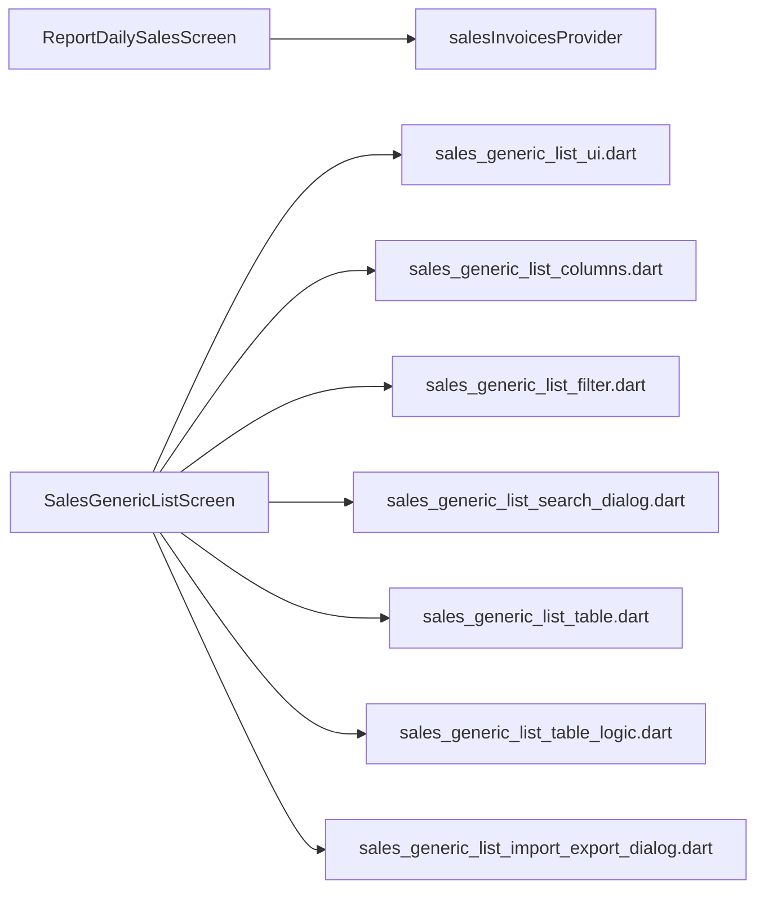

**Diagram sources**
- [reports_sales_sales_daily.dart](file://lib/modules/reports/presentation/reports_sales_sales_daily.dart#L9-L23)
- [sales_generic_list.dart](file://lib/modules/sales/presentation/sales_generic_list.dart#L1-L20)
- [sales_generic_list_ui.dart](file://lib/modules/sales/presentation/sections/sales_generic_list_ui.dart#L1-L460)
- [sales_generic_list_columns.dart](file://lib/modules/sales/presentation/sections/sales_generic_list_columns.dart#L1-L405)
- [sales_generic_list_filter.dart](file://lib/modules/sales/presentation/sections/sales_generic_list_filter.dart#L1-L221)
- [sales_generic_list_search_dialog.dart](file://lib/modules/sales/presentation/sections/sales_generic_list_search_dialog.dart#L1-L958)
- [sales_generic_list_table.dart](file://lib/modules/sales/presentation/sections/sales_generic_list_table.dart#L1-L287)
- [sales_generic_list_table_logic.dart](file://lib/modules/sales/presentation/sections/sales_generic_list_table_logic.dart#L1-L99)
- [sales_generic_list_import_export_dialog.dart](file://lib/modules/sales/presentation/sections/sales_generic_list_import_export_dialog.dart#L1-L550)

**Section sources**
- [reports_sales_sales_daily.dart](file://lib/modules/reports/presentation/reports_sales_sales_daily.dart#L9-L23)
- [sales_generic_list.dart](file://lib/modules/sales/presentation/sales_generic_list.dart#L104-L107)

## Performance Considerations
- Local sorting and selection: Sorting and selection are performed locally on the client. For very large datasets, consider server-side pagination and filtering to reduce payload sizes.
- Column resizing and re-rendering: Frequent resizing triggers rebuilds; persist preferences to minimize repeated recalculations.
- Asynchronous data loading: Use Riverpod providers to avoid blocking the UI during data fetches.
- Export limits: The export dialog indicates a maximum row limit; implement server-side exports for larger datasets.
- Caching strategies: While the UI does not implement explicit caching, consider caching frequently accessed report slices (e.g., last 30 days of sales) to improve responsiveness.

[No sources needed since this section provides general guidance]

## Troubleshooting Guide
- No data shown in Daily Sales Report
  - Verify the provider is wired correctly and returns data
  - Check for loading and error states and display appropriate messages
- Sorting not working as expected
  - Ensure the sort key matches the underlying model fields
  - Confirm numeric vs string comparison logic handles nulls
- Columns not saving after resizing
  - Use the “Save Column Preferences” prompt or “Reset Column Width”
- Export fails or limited rows
  - Confirm selected format and row limits
  - Use backup/export for larger datasets
- Filter menu not closing
  - Ensure overlay entry is disposed and hidden properly

**Section sources**
- [reports_sales_sales_daily.dart](file://lib/modules/reports/presentation/reports_sales_sales_daily.dart#L184-L199)
- [sales_generic_list_table_logic.dart](file://lib/modules/sales/presentation/sections/sales_generic_list_table_logic.dart#L59-L97)
- [sales_generic_list_columns.dart](file://lib/modules/sales/presentation/sections/sales_generic_list_columns.dart#L91-L120)
- [sales_generic_list_import_export_dialog.dart](file://lib/modules/sales/presentation/sections/sales_generic_list_import_export_dialog.dart#L430-L484)
- [sales_generic_list_filter.dart](file://lib/modules/sales/presentation/sections/sales_generic_list_filter.dart#L4-L15)

## Conclusion
The Sales Reporting and Analytics system provides a robust foundation for monitoring sales performance and generating actionable insights. The Reports Dashboard offers quick access to key reports, while the Daily Sales Report delivers timely summaries. The Generic List Screen enables flexible, user-driven exploration of sales data with powerful customization, filtering, and export capabilities. By leveraging Riverpod for data streams and implementing server-side pagination/export for large datasets, the system can scale effectively and integrate seamlessly with external BI tools.

[No sources needed since this section summarizes without analyzing specific files]

## Appendices
- Integration with BI Tools
  - Export reports to CSV/XLSX for ingestion into visualization platforms
  - Use scheduled exports to automate report distribution
- Real-time Analytics
  - Implement periodic refresh and push updates for near real-time dashboards
- KPI Tracking and Forecasting
  - Define KPIs in the Reports Dashboard and Daily Sales Report
  - Extend the Generic List Screen to surface KPI metrics per entity
- Regional Comparisons
  - Use advanced search and filters to segment by region and compare performance

[No sources needed since this section provides general guidance]