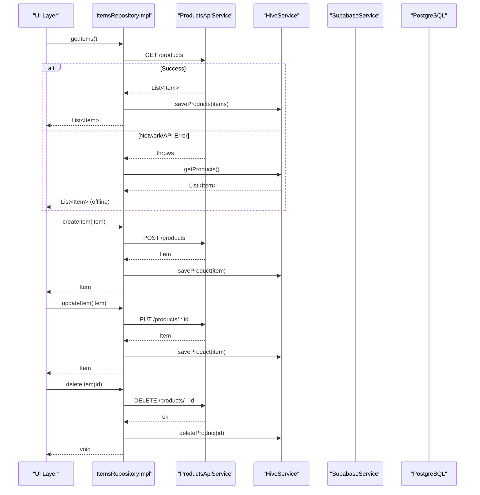
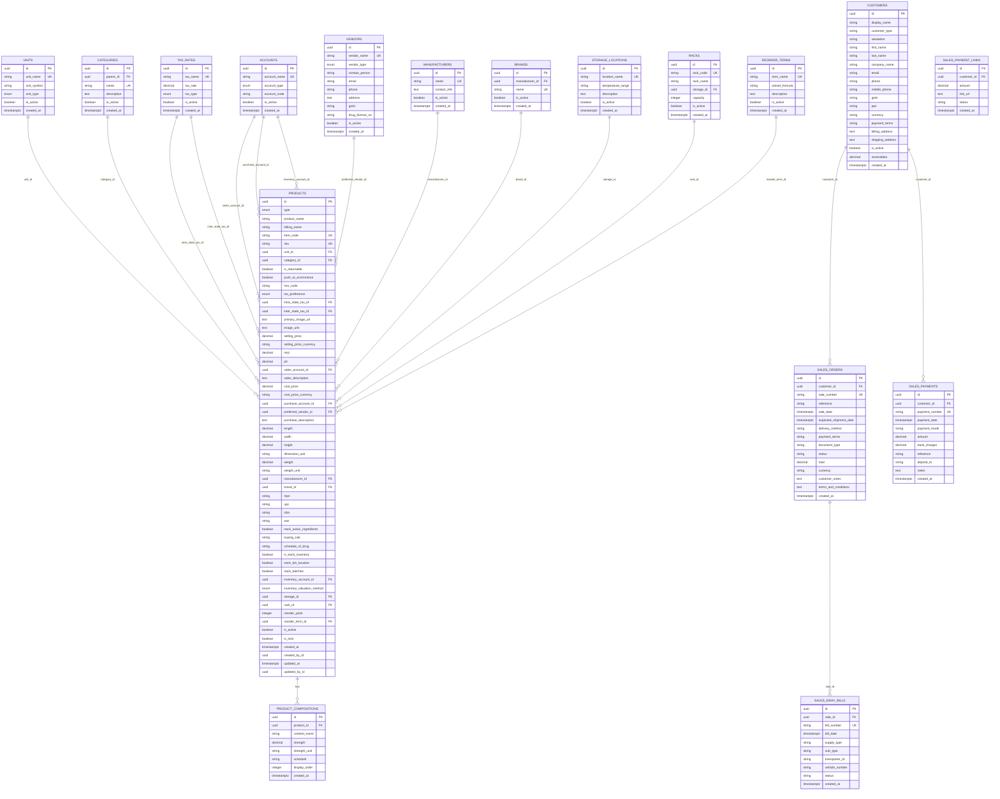
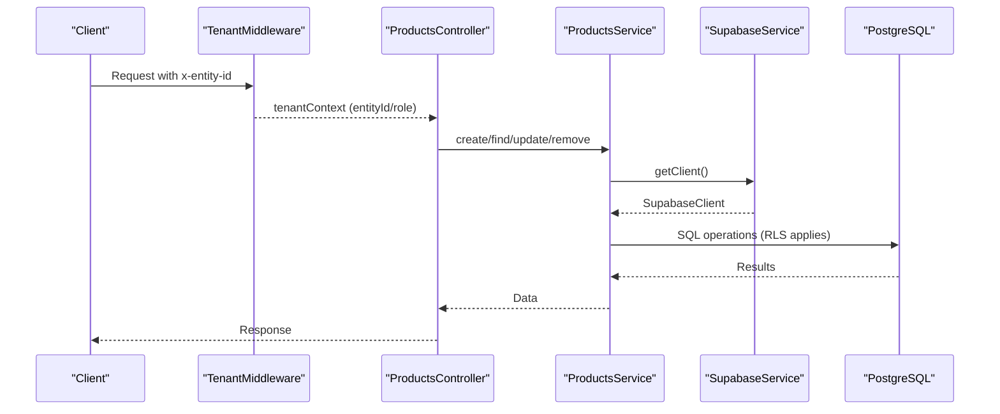
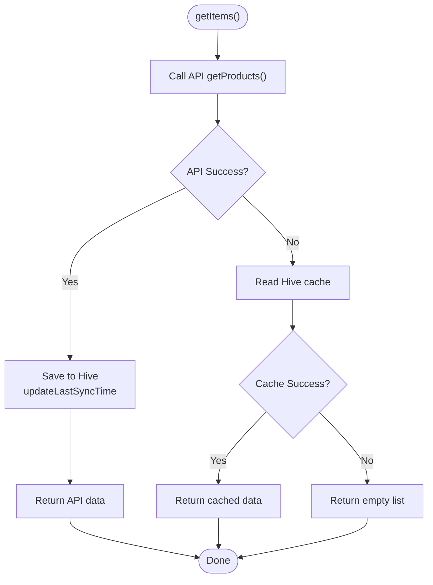
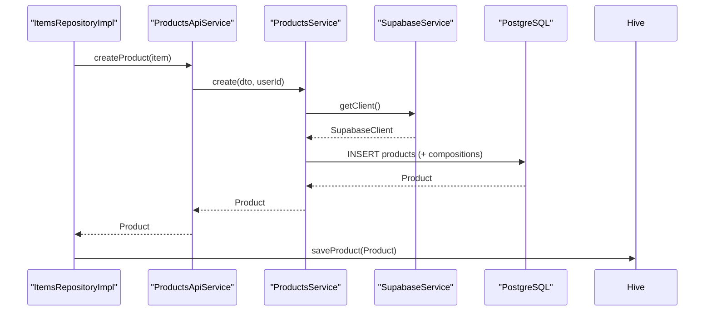
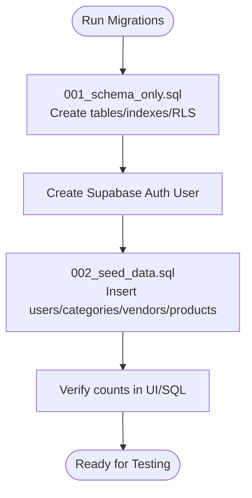
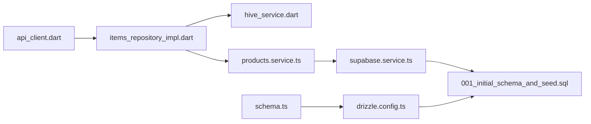

# Data Management
**Last Updated: 2026-04-20 12:46:08**

<cite>
**Referenced Files in This Document**
- [001_initial_schema_and_seed.sql](file://supabase/migrations/001_initial_schema_and_seed.sql)
- [002_seed_data.sql](file://supabase/migrations/002_seed_data.sql)
- [README.md](file://supabase/migrations/README.md)
- [schema.ts](file://backend/src/db/schema.ts)
- [db.ts](file://backend/src/db/db.ts)
- [drizzle.config.ts](file://backend/drizzle.config.ts)
- [supabase.service.ts](file://backend/src/supabase/supabase.service.ts)
- [tenant.middleware.ts](file://backend/src/common/middleware/tenant.middleware.ts)
- [products.service.ts](file://backend/src/products/products.service.ts)
- [sales.service.ts](file://backend/src/sales/sales.service.ts)
- [api_client.dart](file://lib/shared/services/api_client.dart)
- [hive_service.dart](file://lib/shared/services/hive_service.dart)
- [storage_service.dart](file://lib/shared/services/storage_service.dart)
- [items_repository.dart](file://lib/modules/items/repositories/items_repository.dart)
- [items_repository_impl.dart](file://lib/modules/items/repositories/items_repository_impl.dart)
- [supabase_item_repository.dart](file://lib/modules/items/repositories/supabase_item_repository.dart)
</cite>

## Table of Contents
1. [Introduction](#introduction)
2. [Project Structure](#project-structure)
3. [Core Components](#core-components)
4. [Architecture Overview](#architecture-overview)
5. [Detailed Component Analysis](#detailed-component-analysis)
6. [Dependency Analysis](#dependency-analysis)
7. [Performance Considerations](#performance-considerations)
8. [Troubleshooting Guide](#troubleshooting-guide)
9. [Conclusion](#conclusion)
10. [Appendices](#appendices)

## Introduction
This document describes the data management strategy for ZerpAI ERP, covering database schema design, Supabase integration, row-level security (RLS), multi-tenant isolation, local storage with Hive, API integration patterns, synchronization mechanisms, migrations, data seeding, validation, indexing, performance optimization, audit logging, and security measures. It also provides examples of common data operations and troubleshooting guidance.

## Project Structure
ZerpAI ERP separates concerns across:
- Backend (NestJS) with Drizzle ORM for schema and Supabase client for product data
- Frontend (Flutter) with Hive for offline caching and R2 for images
- Supabase migrations for schema and seed data

```mermaid
graph TB
subgraph "Frontend (Flutter)"
API["ApiClient<br/>Dio"]
Repo["ItemsRepositoryImpl<br/>Offline-first"]
Hive["HiveService<br/>Local Cache"]
R2["StorageService<br/>Cloudflare R2"]
end
subgraph "Backend (NestJS)"
SupabaseSvc["SupabaseService"]
ProdSvc["ProductsService"]
SalesSvc["SalesService"]
Drizzle["Drizzle ORM<br/>schema.ts"]
DB["PostgreSQL"]
end
subgraph "Supabase"
Migrations["Migrations<br/>001_* / 002_*"]
end
API --> ProdSvc
API --> SalesSvc
Repo --> API
Repo --> Hive
ProdSvc --> SupabaseSvc
SupabaseSvc --> DB
Drizzle --> DB
Migrations --> DB
R2 <- --> API
```

**Diagram sources**
- [api_client.dart](file://lib/shared/services/api_client.dart#L1-L62)
- [items_repository_impl.dart](file://lib/modules/items/repositories/items_repository_impl.dart#L1-L297)
- [hive_service.dart](file://lib/shared/services/hive_service.dart#L1-L134)
- [storage_service.dart](file://lib/shared/services/storage_service.dart#L1-L227)
- [supabase.service.ts](file://backend/src/supabase/supabase.service.ts#L1-L32)
- [products.service.ts](file://backend/src/products/products.service.ts#L1-L723)
- [sales.service.ts](file://backend/src/sales/sales.service.ts#L1-L162)
- [schema.ts](file://backend/src/db/schema.ts#L1-L293)
- [db.ts](file://backend/src/db/db.ts#L1-L13)
- [001_initial_schema_and_seed.sql](file://supabase/migrations/001_initial_schema_and_seed.sql#L1-L218)
- [002_seed_data.sql](file://supabase/migrations/002_seed_data.sql#L1-L88)

**Section sources**
- [api_client.dart](file://lib/shared/services/api_client.dart#L1-L62)
- [items_repository_impl.dart](file://lib/modules/items/repositories/items_repository_impl.dart#L1-L297)
- [hive_service.dart](file://lib/shared/services/hive_service.dart#L1-L134)
- [storage_service.dart](file://lib/shared/services/storage_service.dart#L1-L227)
- [supabase.service.ts](file://backend/src/supabase/supabase.service.ts#L1-L32)
- [products.service.ts](file://backend/src/products/products.service.ts#L1-L723)
- [sales.service.ts](file://backend/src/sales/sales.service.ts#L1-L162)
- [schema.ts](file://backend/src/db/schema.ts#L1-L293)
- [db.ts](file://backend/src/db/db.ts#L1-L13)
- [001_initial_schema_and_seed.sql](file://supabase/migrations/001_initial_schema_and_seed.sql#L1-L218)
- [002_seed_data.sql](file://supabase/migrations/002_seed_data.sql#L1-L88)

## Core Components
- Database schema: Drizzle ORM schema defines entities and enums; Supabase migrations define initial tables, indexes, and RLS policies.
- Supabase client: Backend initializes a Supabase client for product data operations.
- Middleware: Tenant middleware injects unified entity context via x-entity-id header.
- Services: ProductsService orchestrates product CRUD and metadata sync; SalesService handles sales entities via Drizzle.
- Offline-first repository: ItemsRepositoryImpl integrates API calls with Hive caching and fallback.
- Local storage: HiveService manages boxes for products, customers, POS drafts, and config; StorageService uploads/deletes images to Cloudflare R2.
- API client: ApiClient centralizes HTTP requests with timeouts and interceptors.

**Section sources**
- [schema.ts](file://backend/src/db/schema.ts#L1-L293)
- [db.ts](file://backend/src/db/db.ts#L1-L13)
- [supabase.service.ts](file://backend/src/supabase/supabase.service.ts#L1-L32)
- [tenant.middleware.ts](file://backend/src/common/middleware/tenant.middleware.ts#L1-L70)
- [products.service.ts](file://backend/src/products/products.service.ts#L1-L723)
- [sales.service.ts](file://backend/src/sales/sales.service.ts#L1-L162)
- [items_repository_impl.dart](file://lib/modules/items/repositories/items_repository_impl.dart#L1-L297)
- [hive_service.dart](file://lib/shared/services/hive_service.dart#L1-L134)
- [storage_service.dart](file://lib/shared/services/storage_service.dart#L1-L227)
- [api_client.dart](file://lib/shared/services/api_client.dart#L1-L62)

## Architecture Overview
The system follows an online-first architecture with offline fallback:
- API requests are attempted first; successful responses are cached to Hive.
- On failure, the repository falls back to Hive cache.
- Image assets are uploaded to Cloudflare R2 via StorageService.
- Backend services use Supabase for product data and Drizzle for sales data.



**Diagram sources**
- [items_repository_impl.dart](file://lib/modules/items/repositories/items_repository_impl.dart#L24-L272)
- [hive_service.dart](file://lib/shared/services/hive_service.dart#L19-L45)
- [api_client.dart](file://lib/shared/services/api_client.dart#L46-L60)
- [supabase.service.ts](file://backend/src/supabase/supabase.service.ts#L28-L30)
- [products.service.ts](file://backend/src/products/products.service.ts#L18-L89)

## Detailed Component Analysis

### Database Schema Design
- Entities: products, categories, vendors, units, tax rates, accounts, storage locations, racks, reorder terms, manufacturers, brands, product compositions, customers, sales orders/payments/e-way bills/payment links.
- Enums: product type, tax preference, inventory valuation method, unit type, tax type, account type, vendor type.
- Keys and constraints: UUID primary keys, unique constraints on entity-scoped identifiers, foreign keys, and JSON-like fields stored as text.
- Indexes: composite indexes on entity_id and selective columns for performance.
- RLS: Policies and enable statements were intentionally removed for development; re-enable before production.



**Diagram sources**
- [schema.ts](file://backend/src/db/schema.ts#L1-L293)

**Section sources**
- [schema.ts](file://backend/src/db/schema.ts#L1-L293)
- [001_initial_schema_and_seed.sql](file://supabase/migrations/001_initial_schema_and_seed.sql#L24-L141)

### Supabase Integration and Multi-Tenant Isolation
- Supabase client initialization with service role key and disabled auth persistence.
- Tenant context injection via middleware; currently bypassed for testing; production-ready code is commented and can be enabled.
- Product operations use Supabase client for create/read/update/delete and metadata sync helpers.



**Diagram sources**
- [tenant.middleware.ts](file://backend/src/common/middleware/tenant.middleware.ts#L24-L68)
- [supabase.service.ts](file://backend/src/supabase/supabase.service.ts#L10-L30)
- [products.service.ts](file://backend/src/products/products.service.ts#L18-L194)

**Section sources**
- [supabase.service.ts](file://backend/src/supabase/supabase.service.ts#L1-L32)
- [tenant.middleware.ts](file://backend/src/common/middleware/tenant.middleware.ts#L1-L70)
- [products.service.ts](file://backend/src/products/products.service.ts#L1-L723)

### Local Storage Strategy with Hive and Offline Patterns
- HiveService provides typed boxes for products, customers, POS drafts, and config.
- ItemsRepositoryImpl implements online-first with Hive caching and fallback:
  - Fetch from API; on success, cache to Hive and update last sync timestamps.
  - On network/API errors, fall back to Hive cache.
  - Supports force refresh, offline availability check, and cache stats.



**Diagram sources**
- [items_repository_impl.dart](file://lib/modules/items/repositories/items_repository_impl.dart#L24-L112)
- [hive_service.dart](file://lib/shared/services/hive_service.dart#L19-L45)

**Section sources**
- [hive_service.dart](file://lib/shared/services/hive_service.dart#L1-L134)
- [items_repository_impl.dart](file://lib/modules/items/repositories/items_repository_impl.dart#L1-L297)

### API Integration Patterns and Synchronization
- ApiClient centralizes HTTP configuration and interceptors.
- ProductsService exposes CRUD and metadata sync helpers:
  - create/findOne/update/remove for products
  - lookup methods for units, categories, tax rates, manufacturers, brands, vendors, storage, racks, reorder terms, accounts, contents, strengths, buying rules, schedules
  - Generic syncTableMetadata with upsert and deactivation of unused records
- SalesService uses Drizzle ORM for customers, sales orders, payments, e-way bills, and payment links.



**Diagram sources**
- [items_repository_impl.dart](file://lib/modules/items/repositories/items_repository_impl.dart#L166-L197)
- [products.service.ts](file://backend/src/products/products.service.ts#L18-L89)
- [supabase.service.ts](file://backend/src/supabase/supabase.service.ts#L28-L30)

**Section sources**
- [api_client.dart](file://lib/shared/services/api_client.dart#L1-L62)
- [products.service.ts](file://backend/src/products/products.service.ts#L1-L723)
- [sales.service.ts](file://backend/src/sales/sales.service.ts#L1-L162)

### Data Seeding and Migration Procedures
- Initial schema and seed: creates tables, indexes, and inserts sample data; RLS disabled for development.
- Seed data script: inserts users, categories, vendors, and products; prints org/branch IDs for testing.
- Migration configuration: Drizzle config pointing to DATABASE_URL and schema file.



**Diagram sources**
- [README.md](file://supabase/migrations/README.md#L1-L48)
- [001_initial_schema_and_seed.sql](file://supabase/migrations/001_initial_schema_and_seed.sql#L144-L218)
- [002_seed_data.sql](file://supabase/migrations/002_seed_data.sql#L7-L87)
- [drizzle.config.ts](file://backend/drizzle.config.ts#L1-L16)

**Section sources**
- [README.md](file://supabase/migrations/README.md#L1-L48)
- [001_initial_schema_and_seed.sql](file://supabase/migrations/001_initial_schema_and_seed.sql#L1-L218)
- [002_seed_data.sql](file://supabase/migrations/002_seed_data.sql#L1-L88)
- [drizzle.config.ts](file://backend/drizzle.config.ts#L1-L16)

### Data Validation Strategies
- Frontend repository validates presence of item ID before update and logs warnings on cache failures.
- Backend services validate DTO fields and enforce unique constraints; throw conflicts for duplicates.
- Lookup usage checks ensure referential integrity before deletions.

**Section sources**
- [items_repository_impl.dart](file://lib/modules/items/repositories/items_repository_impl.dart#L200-L206)
- [products.service.ts](file://backend/src/products/products.service.ts#L47-L50)
- [products.service.ts](file://backend/src/products/products.service.ts#L172-L176)

### Indexing Approaches and Performance Optimization
- Indexes on entity_id, type, category_id, vendor_id, is_selectable, item_code for efficient filtering and joins.
- Drizzle schema uses enums and precise numeric types to reduce storage and improve query performance.
- API client sets connect/receive timeouts to avoid long blocking.

**Section sources**
- [001_initial_schema_and_seed.sql](file://supabase/migrations/001_initial_schema_and_seed.sql#L122-L134)
- [schema.ts](file://backend/src/db/schema.ts#L1-L293)
- [api_client.dart](file://lib/shared/services/api_client.dart#L13-L25)

### Audit Logging and Data Security Measures
- Audit fields in products: created_at, created_by_id, last_modified_by, last_modified_date.
- RLS policies intentionally disabled for development; enable before production.
- Tenant middleware injects entityId; production code path is active for x-entity-id header.

**Section sources**
- [001_initial_schema_and_seed.sql](file://supabase/migrations/001_initial_schema_and_seed.sql#L80-L84)
- [001_initial_schema_and_seed.sql](file://supabase/migrations/001_initial_schema_and_seed.sql#L137-L141)
- [tenant.middleware.ts](file://backend/src/common/middleware/tenant.middleware.ts#L41-L67)

### Examples of Common Data Operations
- Create product: call createProduct via API; repository caches result; backend maps legacy fields and inserts compositions.
- Get products: online-first fetch; on success, cache and update last sync; on failure, return cached data.
- Sync lookups: generic syncTableMetadata upserts records and deactivates unused ones.
- Upload images: StorageService signs and uploads to R2; returns URL.

**Section sources**
- [items_repository_impl.dart](file://lib/modules/items/repositories/items_repository_impl.dart#L166-L197)
- [products.service.ts](file://backend/src/products/products.service.ts#L18-L89)
- [products.service.ts](file://backend/src/products/products.service.ts#L609-L716)
- [storage_service.dart](file://lib/shared/services/storage_service.dart#L25-L44)

## Dependency Analysis
- Frontend depends on ApiClient, ItemsRepositoryImpl, HiveService, and StorageService.
- Backend depends on SupabaseService for product data and Drizzle ORM for sales data.
- Supabase migrations define schema and indexes; Drizzle config maps schema to database.



**Diagram sources**
- [api_client.dart](file://lib/shared/services/api_client.dart#L1-L62)
- [items_repository_impl.dart](file://lib/modules/items/repositories/items_repository_impl.dart#L1-L297)
- [hive_service.dart](file://lib/shared/services/hive_service.dart#L1-L134)
- [products.service.ts](file://backend/src/products/products.service.ts#L1-L723)
- [supabase.service.ts](file://backend/src/supabase/supabase.service.ts#L1-L32)
- [schema.ts](file://backend/src/db/schema.ts#L1-L293)
- [drizzle.config.ts](file://backend/drizzle.config.ts#L1-L16)
- [001_initial_schema_and_seed.sql](file://supabase/migrations/001_initial_schema_and_seed.sql#L1-L218)

**Section sources**
- [api_client.dart](file://lib/shared/services/api_client.dart#L1-L62)
- [items_repository_impl.dart](file://lib/modules/items/repositories/items_repository_impl.dart#L1-L297)
- [hive_service.dart](file://lib/shared/services/hive_service.dart#L1-L134)
- [products.service.ts](file://backend/src/products/products.service.ts#L1-L723)
- [supabase.service.ts](file://backend/src/supabase/supabase.service.ts#L1-L32)
- [schema.ts](file://backend/src/db/schema.ts#L1-L293)
- [drizzle.config.ts](file://backend/drizzle.config.ts#L1-L16)
- [001_initial_schema_and_seed.sql](file://supabase/migrations/001_initial_schema_and_seed.sql#L1-L218)

## Performance Considerations
- Use indexes on entity_id and frequently filtered columns.
- Prefer online-first with Hive caching to minimize repeated network calls.
- Batch operations where possible; leverage Supabase upsert for metadata sync.
- Monitor cache hit ratios and prune stale data periodically.

## Troubleshooting Guide
- Network/API errors: ItemsRepositoryImpl falls back to Hive; check cache stats and last sync timestamps.
- Duplicate item codes: Backend throws conflict exceptions; adjust item_code or SKU uniqueness.
- Missing tenant context: Ensure x-entity-id header is present; middleware injects tenantContext.
- RLS issues: Confirm RLS policies are enabled and properly configured in Supabase.
- Image upload failures: Verify Cloudflare credentials and bucket permissions; inspect signed authorization headers.

**Section sources**
- [items_repository_impl.dart](file://lib/modules/items/repositories/items_repository_impl.dart#L57-L82)
- [products.service.ts](file://backend/src/products/products.service.ts#L47-L50)
- [tenant.middleware.ts](file://backend/src/common/middleware/tenant.middleware.ts#L24-L68)
- [001_initial_schema_and_seed.sql](file://supabase/migrations/001_initial_schema_and_seed.sql#L137-L141)
- [storage_service.dart](file://lib/shared/services/storage_service.dart#L108-L136)

## Conclusion
ZerpAI ERP employs a robust data management strategy combining Supabase-backed product data, Drizzle-driven sales data, Hive-based offline caching, and Cloudflare R2 for images. The system supports multi-tenant isolation, configurable RLS, and scalable synchronization patterns. Adhering to the outlined procedures ensures reliable data operations, strong security, and optimal performance.

## Appendices
- Migration and seeding steps are documented in the Supabase migrations README.
- Drizzle configuration points to the schema and DATABASE_URL for schema generation and migrations.

**Section sources**
- [README.md](file://supabase/migrations/README.md#L1-L48)
- [drizzle.config.ts](file://backend/drizzle.config.ts#L1-L16)