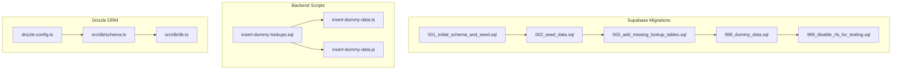
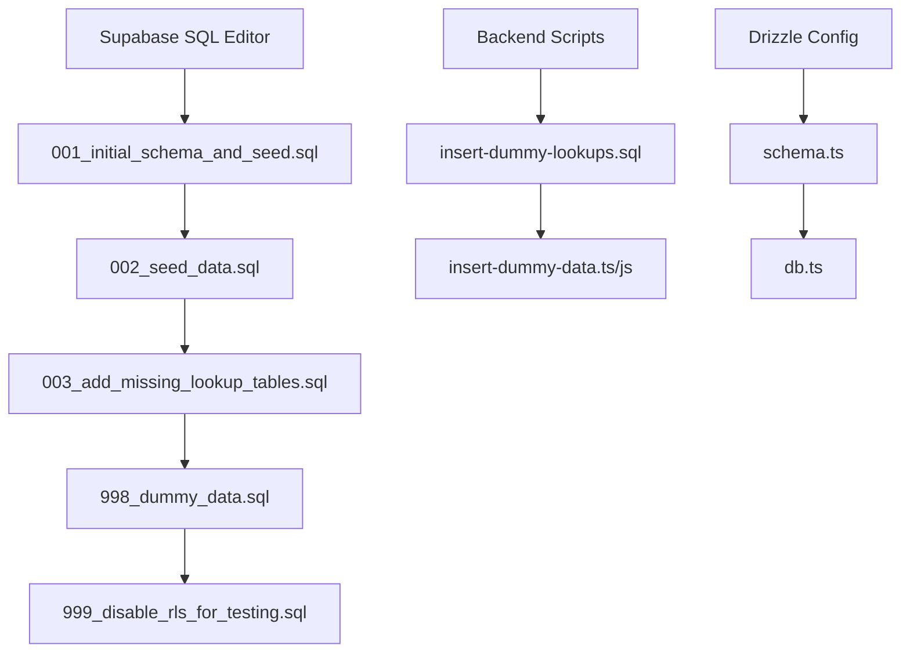
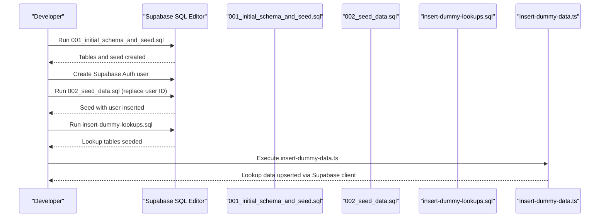
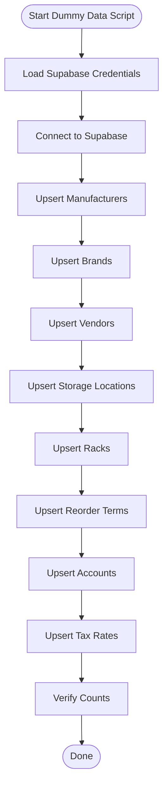
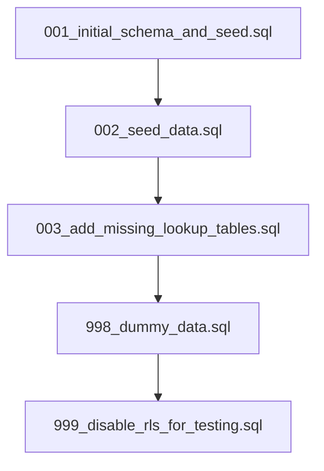
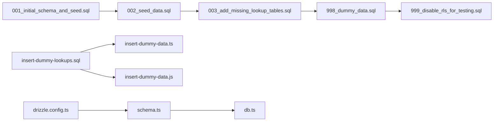

# Data Migration & Seeding

<cite>
**Referenced Files in This Document**
- [README.md](file://supabase/migrations/README.md)
- [001_initial_schema_and_seed.sql](file://supabase/migrations/001_initial_schema_and_seed.sql)
- [002_seed_data.sql](file://supabase/migrations/002_seed_data.sql)
- [003_add_missing_lookup_tables.sql](file://supabase/migrations/003_add_missing_lookup_tables.sql)
- [998_dummy_data.sql](file://supabase/migrations/998_dummy_data.sql)
- [999_disable_rls_for_testing.sql](file://supabase/migrations/999_disable_rls_for_testing.sql)
- [insert-dummy-data.ts](file://backend/scripts/insert-dummy-data.ts)
- [insert-dummy-data.js](file://backend/scripts/insert-dummy-data.js)
- [insert-dummy-lookups.sql](file://backend/scripts/insert-dummy-lookups.sql)
- [drizzle.config.ts](file://backend/drizzle.config.ts)
- [db.ts](file://backend/src/db/db.ts)
- [schema.ts](file://backend/src/db/schema.ts)
- [RUN_MIGRATION_INSTRUCTIONS.md](file://RUN_MIGRATION_INSTRUCTIONS.md)
- [package.json](file://backend/package.json)
</cite>

## Table of Contents
1. [Introduction](#introduction)
2. [Project Structure](#project-structure)
3. [Core Components](#core-components)
4. [Architecture Overview](#architecture-overview)
5. [Detailed Component Analysis](#detailed-component-analysis)
6. [Dependency Analysis](#dependency-analysis)
7. [Performance Considerations](#performance-considerations)
8. [Troubleshooting Guide](#troubleshooting-guide)
9. [Conclusion](#conclusion)
10. [Appendices](#appendices)

## Introduction
This document explains the database migration and seeding system used by ZerpAI ERP. It covers migration file structure, naming conventions, execution order, seed data creation (including lookup tables and initial business data), rollback strategies and version management, dummy data generation scripts for development and testing, production deployment migration process, and database initialization sequence with dependency management.

## Project Structure
The migration and seeding system spans two primary areas:
- Supabase SQL migrations under supabase/migrations
- Backend scripts and Drizzle ORM configuration under backend

Key responsibilities:
- Supabase migrations define schema and seed data for development and testing
- Backend scripts populate lookup tables and support hot-reload scenarios
- Drizzle ORM config maps the schema to TypeScript models for type-safe operations

**Diagram sources**
- [001_initial_schema_and_seed.sql](file://supabase/migrations/001_initial_schema_and_seed.sql#L1-L218)
- [002_seed_data.sql](file://supabase/migrations/002_seed_data.sql#L1-L88)
- [003_add_missing_lookup_tables.sql](file://supabase/migrations/003_add_missing_lookup_tables.sql#L1-L78)
- [998_dummy_data.sql](file://supabase/migrations/998_dummy_data.sql#L1-L157)
- [999_disable_rls_for_testing.sql](file://supabase/migrations/999_disable_rls_for_testing.sql#L1-L54)
- [insert-dummy-lookups.sql](file://backend/scripts/insert-dummy-lookups.sql#L1-L94)
- [insert-dummy-data.ts](file://backend/scripts/insert-dummy-data.ts#L1-L141)
- [insert-dummy-data.js](file://backend/scripts/insert-dummy-data.js#L1-L139)
- [drizzle.config.ts](file://backend/drizzle.config.ts#L1-L16)
- [schema.ts](file://backend/src/db/schema.ts#L1-L293)
- [db.ts](file://backend/src/db/db.ts#L1-L13)

**Section sources**
- [README.md](file://supabase/migrations/README.md#L1-L48)
- [001_initial_schema_and_seed.sql](file://supabase/migrations/001_initial_schema_and_seed.sql#L1-L218)
- [002_seed_data.sql](file://supabase/migrations/002_seed_data.sql#L1-L88)
- [003_add_missing_lookup_tables.sql](file://supabase/migrations/003_add_missing_lookup_tables.sql#L1-L78)
- [998_dummy_data.sql](file://supabase/migrations/998_dummy_data.sql#L1-L157)
- [999_disable_rls_for_testing.sql](file://supabase/migrations/999_disable_rls_for_testing.sql#L1-L54)
- [insert-dummy-lookups.sql](file://backend/scripts/insert-dummy-lookups.sql#L1-L94)
- [insert-dummy-data.ts](file://backend/scripts/insert-dummy-data.ts#L1-L141)
- [insert-dummy-data.js](file://backend/scripts/insert-dummy-data.js#L1-L139)
- [drizzle.config.ts](file://backend/drizzle.config.ts#L1-L16)
- [schema.ts](file://backend/src/db/schema.ts#L1-L293)
- [db.ts](file://backend/src/db/db.ts#L1-L13)

## Core Components
- Supabase migrations: Define schema and seed data for development and testing. They include:
  - Initial schema and seed
  - Additional lookup tables
  - Dummy data for comprehensive testing
  - RLS toggles for development
- Backend scripts:
  - SQL script to seed lookup tables
  - TypeScript/JavaScript scripts to upsert lookup data via Supabase client
- Drizzle ORM:
  - Configuration mapping schema to TypeScript models
  - Runtime database connection and typed queries

**Section sources**
- [001_initial_schema_and_seed.sql](file://supabase/migrations/001_initial_schema_and_seed.sql#L1-L218)
- [002_seed_data.sql](file://supabase/migrations/002_seed_data.sql#L1-L88)
- [003_add_missing_lookup_tables.sql](file://supabase/migrations/003_add_missing_lookup_tables.sql#L1-L78)
- [998_dummy_data.sql](file://supabase/migrations/998_dummy_data.sql#L1-L157)
- [999_disable_rls_for_testing.sql](file://supabase/migrations/999_disable_rls_for_testing.sql#L1-L54)
- [insert-dummy-lookups.sql](file://backend/scripts/insert-dummy-lookups.sql#L1-L94)
- [insert-dummy-data.ts](file://backend/scripts/insert-dummy-data.ts#L1-L141)
- [insert-dummy-data.js](file://backend/scripts/insert-dummy-data.js#L1-L139)
- [drizzle.config.ts](file://backend/drizzle.config.ts#L1-L16)
- [schema.ts](file://backend/src/db/schema.ts#L1-L293)
- [db.ts](file://backend/src/db/db.ts#L1-L13)

## Architecture Overview
The migration and seeding architecture follows a layered approach:
- Supabase SQL migrations handle schema and seed data for development
- Backend scripts complement seeds and enable quick updates during development
- Drizzle ORM provides type-safe schema definitions and runtime connectivity

**Diagram sources**
- [001_initial_schema_and_seed.sql](file://supabase/migrations/001_initial_schema_and_seed.sql#L1-L218)
- [002_seed_data.sql](file://supabase/migrations/002_seed_data.sql#L1-L88)
- [003_add_missing_lookup_tables.sql](file://supabase/migrations/003_add_missing_lookup_tables.sql#L1-L78)
- [998_dummy_data.sql](file://supabase/migrations/998_dummy_data.sql#L1-L157)
- [999_disable_rls_for_testing.sql](file://supabase/migrations/999_disable_rls_for_testing.sql#L1-L54)
- [insert-dummy-lookups.sql](file://backend/scripts/insert-dummy-lookups.sql#L1-L94)
- [insert-dummy-data.ts](file://backend/scripts/insert-dummy-data.ts#L1-L141)
- [insert-dummy-data.js](file://backend/scripts/insert-dummy-data.js#L1-L139)
- [drizzle.config.ts](file://backend/drizzle.config.ts#L1-L16)
- [schema.ts](file://backend/src/db/schema.ts#L1-L293)
- [db.ts](file://backend/src/db/db.ts#L1-L13)

## Detailed Component Analysis

### Migration File Naming and Execution Order
- Files are numbered sequentially to define execution order.
- Typical progression:
  - 001_initial_schema_and_seed.sql: Creates core tables and seeds initial data
  - 002_seed_data.sql: Adds user and repeats seed data with user reference
  - 003_add_missing_lookup_tables.sql: Adds lookup tables referenced by backend
  - 998_dummy_data.sql: Comprehensive dummy data for testing
  - 999_disable_rls_for_testing.sql: Disables RLS for development
- The README provides step-by-step guidance for creating tables, adding a user, and inserting seed data.

**Section sources**
- [README.md](file://supabase/migrations/README.md#L1-L48)
- [001_initial_schema_and_seed.sql](file://supabase/migrations/001_initial_schema_and_seed.sql#L1-L218)
- [002_seed_data.sql](file://supabase/migrations/002_seed_data.sql#L1-L88)
- [003_add_missing_lookup_tables.sql](file://supabase/migrations/003_add_missing_lookup_tables.sql#L1-L78)
- [998_dummy_data.sql](file://supabase/migrations/998_dummy_data.sql#L1-L157)
- [999_disable_rls_for_testing.sql](file://supabase/migrations/999_disable_rls_for_testing.sql#L1-L54)

### Seed Data Creation Process
- Initial seed (001_initial_schema_and_seed.sql):
  - Creates tables: products, categories, vendors
  - Inserts sample categories, vendors, and products
  - Provides counts and status confirmations
- User-based seed (002_seed_data.sql):
  - Requires a real Supabase auth user ID
  - Inserts user into users table and seeds categories, vendors, and products
  - Prints entity_id for API testing
- Lookup table population:
  - SQL script (insert-dummy-lookups.sql) inserts manufacturers, brands, vendors, storage locations, racks, reorder terms, accounts, and tax rates
  - TypeScript/JavaScript scripts (insert-dummy-data.ts, insert-dummy-data.js) upsert the same lookup data using Supabase client with conflict handling

**Diagram sources**
- [001_initial_schema_and_seed.sql](file://supabase/migrations/001_initial_schema_and_seed.sql#L1-L218)
- [002_seed_data.sql](file://supabase/migrations/002_seed_data.sql#L1-L88)
- [insert-dummy-lookups.sql](file://backend/scripts/insert-dummy-lookups.sql#L1-L94)
- [insert-dummy-data.ts](file://backend/scripts/insert-dummy-data.ts#L1-L141)

**Section sources**
- [001_initial_schema_and_seed.sql](file://supabase/migrations/001_initial_schema_and_seed.sql#L144-L218)
- [002_seed_data.sql](file://supabase/migrations/002_seed_data.sql#L1-L88)
- [insert-dummy-lookups.sql](file://backend/scripts/insert-dummy-lookups.sql#L1-L94)
- [insert-dummy-data.ts](file://backend/scripts/insert-dummy-data.ts#L16-L138)

### Migration Rollback Strategies and Version Management
- Current migrations do not include explicit rollback scripts. The repository provides:
  - A manual migration instruction guide for adding a column (track_serial_number) via SQL editor
  - An RLS toggle migration for development
- Recommended rollback strategies:
  - Manual SQL reversal for small, isolated changes (e.g., adding a column)
  - Maintain a separate rollback branch per migration with inverse SQL operations
  - Use version control to tag releases and track applied migrations
- Version management:
  - Use sequential numbering to enforce order
  - Document each migration’s purpose and dependencies
  - Keep a changelog of schema changes and seed additions

**Section sources**
- [RUN_MIGRATION_INSTRUCTIONS.md](file://RUN_MIGRATION_INSTRUCTIONS.md#L1-L56)
- [999_disable_rls_for_testing.sql](file://supabase/migrations/999_disable_rls_for_testing.sql#L1-L54)

### Dummy Data Generation Scripts
- Purpose:
  - Provide comprehensive test data for development and QA
  - Enable hot reload scenarios by upserting lookup data via Supabase client
- Scripts:
  - insert-dummy-lookups.sql: Inserts predefined lookup data into multiple tables
  - insert-dummy-data.ts and insert-dummy-data.js: Upsert lookup data with conflict handling and verification counts
- Environment:
  - Both backend scripts require Supabase URL and service role key configured in environment variables

**Diagram sources**
- [insert-dummy-data.ts](file://backend/scripts/insert-dummy-data.ts#L16-L138)
- [insert-dummy-data.js](file://backend/scripts/insert-dummy-data.js#L14-L136)

**Section sources**
- [insert-dummy-lookups.sql](file://backend/scripts/insert-dummy-lookups.sql#L1-L94)
- [insert-dummy-data.ts](file://backend/scripts/insert-dummy-data.ts#L1-L141)
- [insert-dummy-data.js](file://backend/scripts/insert-dummy-data.js#L1-L139)

### Production Deployment Migration Process
- Pre-deployment checks:
  - Ensure RLS is enabled and policies are in place
  - Verify user table and auth integration are active
  - Confirm all required lookup tables exist and are seeded
- Deployment steps:
  - Apply migrations in order (001 → 002 → 003 → ...)
  - Run backend dummy data scripts to populate lookup tables
  - Verify counts and integrity checks
- Post-deployment verification:
  - Confirm tables, indexes, and RLS policies
  - Validate seed data presence and correctness
  - Test API endpoints requiring x-entity-id header

**Section sources**
- [README.md](file://supabase/migrations/README.md#L34-L47)
- [001_initial_schema_and_seed.sql](file://supabase/migrations/001_initial_schema_and_seed.sql#L137-L141)
- [002_seed_data.sql](file://supabase/migrations/002_seed_data.sql#L17-L27)
- [003_add_missing_lookup_tables.sql](file://supabase/migrations/003_add_missing_lookup_tables.sql#L1-L78)
- [998_dummy_data.sql](file://supabase/migrations/998_dummy_data.sql#L1-L157)
- [999_disable_rls_for_testing.sql](file://supabase/migrations/999_disable_rls_for_testing.sql#L1-L54)

### Database Initialization Sequence and Dependencies
- Initialization sequence:
  - Create core schema and seed initial data (001)
  - Add user and repeat seed with user reference (002)
  - Add missing lookup tables (003)
  - Populate comprehensive dummy data (998)
  - Toggle RLS for development (999)
- Dependencies:
  - 002 depends on a real user existing in auth.users
  - 003 adds lookup tables referenced by backend models
  - 998 depends on 003 for lookup tables to be present
  - 999 disables RLS for development; re-enable RLS before production

**Diagram sources**
- [001_initial_schema_and_seed.sql](file://supabase/migrations/001_initial_schema_and_seed.sql#L1-L218)
- [002_seed_data.sql](file://supabase/migrations/002_seed_data.sql#L1-L88)
- [003_add_missing_lookup_tables.sql](file://supabase/migrations/003_add_missing_lookup_tables.sql#L1-L78)
- [998_dummy_data.sql](file://supabase/migrations/998_dummy_data.sql#L1-L157)
- [999_disable_rls_for_testing.sql](file://supabase/migrations/999_disable_rls_for_testing.sql#L1-L54)

**Section sources**
- [001_initial_schema_and_seed.sql](file://supabase/migrations/001_initial_schema_and_seed.sql#L1-L218)
- [002_seed_data.sql](file://supabase/migrations/002_seed_data.sql#L1-L88)
- [003_add_missing_lookup_tables.sql](file://supabase/migrations/003_add_missing_lookup_tables.sql#L1-L78)
- [998_dummy_data.sql](file://supabase/migrations/998_dummy_data.sql#L1-L157)
- [999_disable_rls_for_testing.sql](file://supabase/migrations/999_disable_rls_for_testing.sql#L1-L54)

## Dependency Analysis
- Supabase migrations depend on each other in sequence
- Backend dummy data scripts depend on Supabase credentials and target tables
- Drizzle ORM depends on schema.ts and db.ts for runtime connectivity

**Diagram sources**
- [001_initial_schema_and_seed.sql](file://supabase/migrations/001_initial_schema_and_seed.sql#L1-L218)
- [002_seed_data.sql](file://supabase/migrations/002_seed_data.sql#L1-L88)
- [003_add_missing_lookup_tables.sql](file://supabase/migrations/003_add_missing_lookup_tables.sql#L1-L78)
- [998_dummy_data.sql](file://supabase/migrations/998_dummy_data.sql#L1-L157)
- [999_disable_rls_for_testing.sql](file://supabase/migrations/999_disable_rls_for_testing.sql#L1-L54)
- [insert-dummy-lookups.sql](file://backend/scripts/insert-dummy-lookups.sql#L1-L94)
- [insert-dummy-data.ts](file://backend/scripts/insert-dummy-data.ts#L1-L141)
- [insert-dummy-data.js](file://backend/scripts/insert-dummy-data.js#L1-L139)
- [drizzle.config.ts](file://backend/drizzle.config.ts#L1-L16)
- [schema.ts](file://backend/src/db/schema.ts#L1-L293)
- [db.ts](file://backend/src/db/db.ts#L1-L13)

**Section sources**
- [drizzle.config.ts](file://backend/drizzle.config.ts#L1-L16)
- [schema.ts](file://backend/src/db/schema.ts#L1-L293)
- [db.ts](file://backend/src/db/db.ts#L1-L13)
- [package.json](file://backend/package.json#L22-L37)

## Performance Considerations
- Indexes are created for performance in initial schema and lookup tables
- RLS toggles are provided for development; disable RLS only in non-production environments
- Use upsert with conflict handling in backend scripts to avoid duplicates and reduce overhead

[No sources needed since this section provides general guidance]

## Troubleshooting Guide
- Missing Supabase credentials:
  - Ensure SUPABASE_URL and SUPABASE_SERVICE_ROLE_KEY are set for backend scripts
- User ID replacement:
  - Replace placeholder user ID in 002_seed_data.sql with a real auth.users ID
- RLS issues:
  - Use 999_disable_rls_for_testing.sql for development; re-enable RLS before production
- Migration verification:
  - Use provided verification queries to confirm counts and schema changes
- Drizzle connectivity:
  - Ensure DATABASE_URL is configured and Drizzle config matches schema.ts

**Section sources**
- [insert-dummy-data.ts](file://backend/scripts/insert-dummy-data.ts#L6-L12)
- [insert-dummy-data.js](file://backend/scripts/insert-dummy-data.js#L4-L10)
- [002_seed_data.sql](file://supabase/migrations/002_seed_data.sql#L5-L6)
- [999_disable_rls_for_testing.sql](file://supabase/migrations/999_disable_rls_for_testing.sql#L1-L54)
- [README.md](file://supabase/migrations/README.md#L34-L47)
- [drizzle.config.ts](file://backend/drizzle.config.ts#L10-L12)

## Conclusion
ZerpAI ERP’s migration and seeding system combines Supabase SQL migrations with backend scripts and Drizzle ORM to provide a robust development and testing environment. By following the documented execution order, using the provided scripts, and managing RLS appropriately, teams can reliably initialize databases, populate lookup tables, and validate deployments across environments.

[No sources needed since this section summarizes without analyzing specific files]

## Appendices
- Appendix A: Supabase Migration Instructions
  - See [README.md](file://supabase/migrations/README.md#L1-L48)
- Appendix B: Manual Migration for track_serial_number
  - See [RUN_MIGRATION_INSTRUCTIONS.md](file://RUN_MIGRATION_INSTRUCTIONS.md#L1-L56)