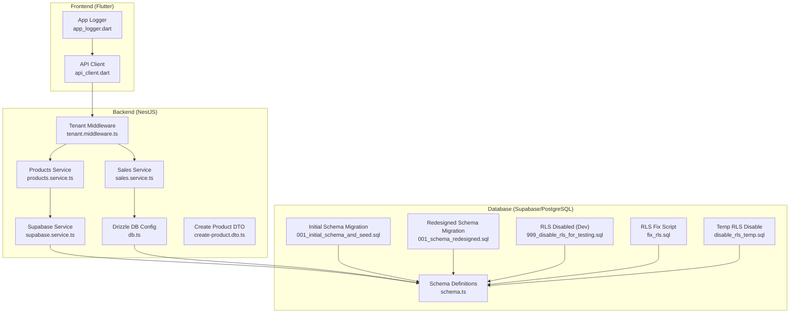
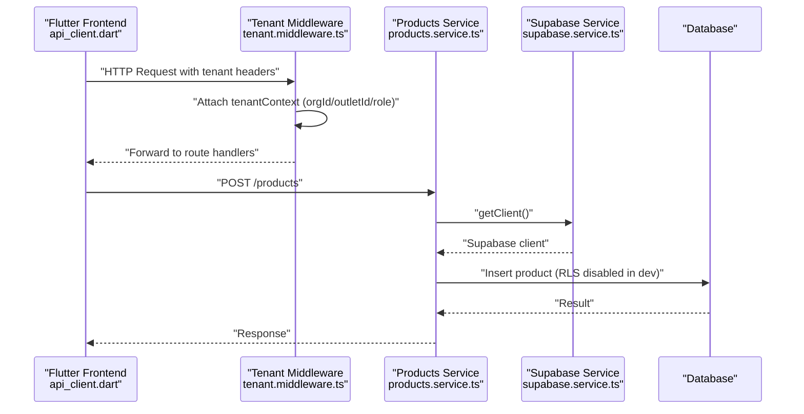
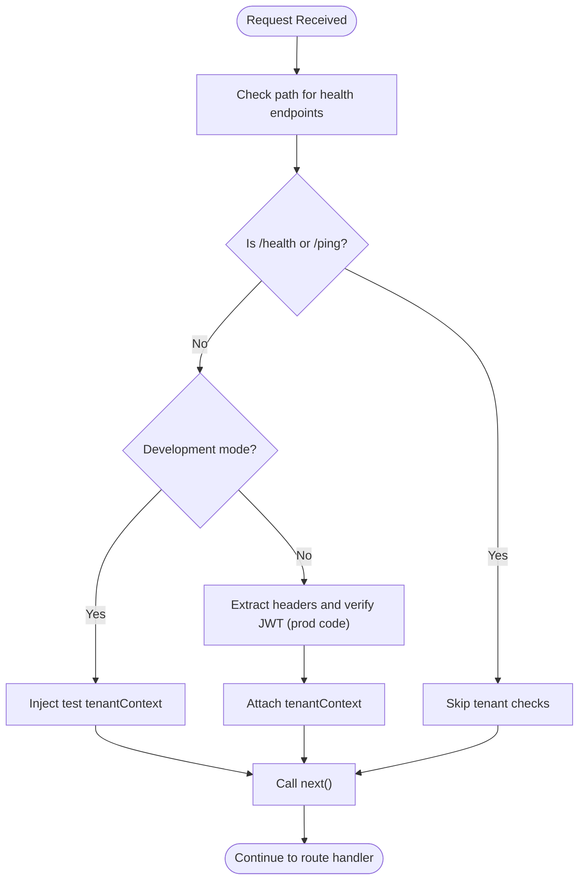
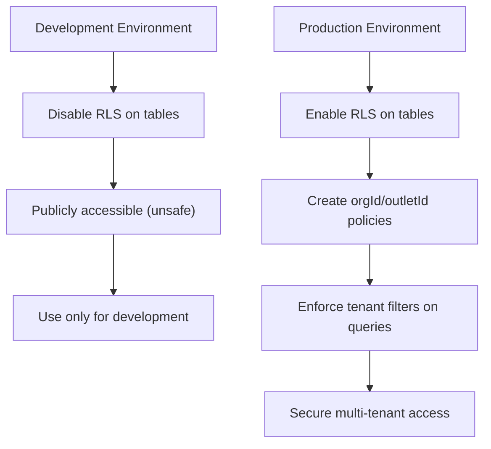
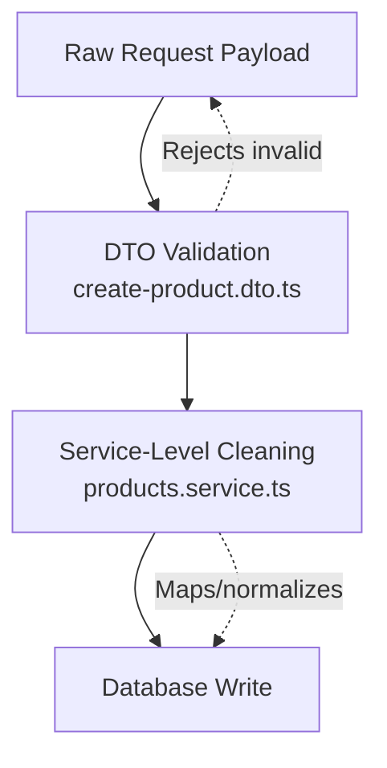
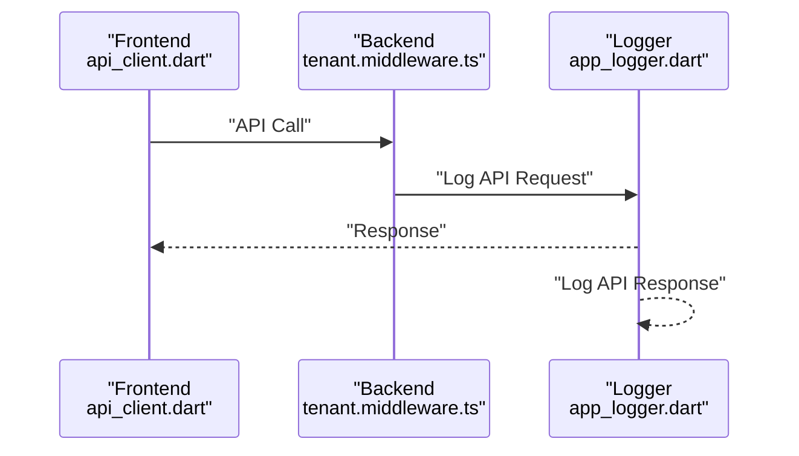
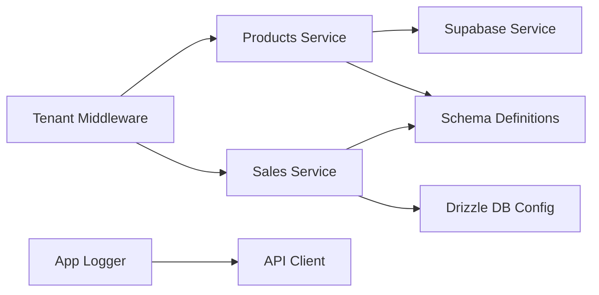

# Data Security & Integrity

<cite>
**Referenced Files in This Document**
- [tenant.middleware.ts](file://backend/src/common/middleware/tenant.middleware.ts)
- [schema.ts](file://backend/src/db/schema.ts)
- [db.ts](file://backend/src/db/db.ts)
- [supabase.service.ts](file://backend/src/supabase/supabase.service.ts)
- [app_logger.dart](file://lib/core/logging/app_logger.dart)
- [001_initial_schema_and_seed.sql](file://supabase/migrations/001_initial_schema_and_seed.sql)
- [001_schema_redesigned.sql](file://supabase/migrations/001_schema_redesigned.sql)
- [999_disable_rls_for_testing.sql](file://supabase/migrations/999_disable_rls_for_testing.sql)
- [fix_rls.sql](file://backend/fix_rls.sql)
- [disable_rls_temp.sql](file://backend/disable_rls_temp.sql)
- [create-product.dto.ts](file://backend/src/products/dto/create-product.dto.ts)
- [products.service.ts](file://backend/src/products/products.service.ts)
- [sales.service.ts](file://backend/src/sales/sales.service.ts)
- [api_client.dart](file://lib/shared/services/api_client.dart)
</cite>

## Table of Contents
1. [Introduction](#introduction)
2. [Project Structure](#project-structure)
3. [Core Components](#core-components)
4. [Architecture Overview](#architecture-overview)
5. [Detailed Component Analysis](#detailed-component-analysis)
6. [Dependency Analysis](#dependency-analysis)
7. [Performance Considerations](#performance-considerations)
8. [Troubleshooting Guide](#troubleshooting-guide)
9. [Conclusion](#conclusion)
10. [Appendices](#appendices)

## Introduction
This document details the data security and integrity measures implemented in ZerpAI ERP. It focuses on:
- Multi-tenant data isolation via Row-Level Security (RLS) and tenant middleware
- Tenant context propagation across requests
- Data validation and input sanitization strategies
- Audit logging and data access monitoring
- Backup and recovery, encryption at rest and in transit, and disaster recovery planning
- Data retention and GDPR compliance features, including anonymization capabilities

Note: As of the current repository state, RLS is disabled for development/testing environments. Production readiness requires enabling RLS and implementing robust authentication/authorization.

## Project Structure
Security-relevant components span backend NestJS services, Supabase/PostgreSQL schema and migrations, Drizzle ORM usage, and Flutter frontend API client.

**Diagram sources**
- [tenant.middleware.ts](file://backend/src/common/middleware/tenant.middleware.ts#L1-L70)
- [products.service.ts](file://backend/src/products/products.service.ts#L1-L723)
- [sales.service.ts](file://backend/src/sales/sales.service.ts#L1-L162)
- [db.ts](file://backend/src/db/db.ts#L1-L13)
- [supabase.service.ts](file://backend/src/supabase/supabase.service.ts#L1-L32)
- [schema.ts](file://backend/src/db/schema.ts#L1-L293)
- [001_initial_schema_and_seed.sql](file://supabase/migrations/001_initial_schema_and_seed.sql#L1-L218)
- [001_schema_redesigned.sql](file://supabase/migrations/001_schema_redesigned.sql#L1-L180)
- [999_disable_rls_for_testing.sql](file://supabase/migrations/999_disable_rls_for_testing.sql#L1-L54)
- [fix_rls.sql](file://backend/fix_rls.sql#L1-L16)
- [disable_rls_temp.sql](file://backend/disable_rls_temp.sql#L1-L14)
- [api_client.dart](file://lib/shared/services/api_client.dart#L1-L62)
- [app_logger.dart](file://lib/core/logging/app_logger.dart#L1-L218)

**Section sources**
- [tenant.middleware.ts](file://backend/src/common/middleware/tenant.middleware.ts#L1-L70)
- [schema.ts](file://backend/src/db/schema.ts#L1-L293)
- [db.ts](file://backend/src/db/db.ts#L1-L13)
- [supabase.service.ts](file://backend/src/supabase/supabase.service.ts#L1-L32)
- [001_initial_schema_and_seed.sql](file://supabase/migrations/001_initial_schema_and_seed.sql#L1-L218)
- [001_schema_redesigned.sql](file://supabase/migrations/001_schema_redesigned.sql#L1-L180)
- [999_disable_rls_for_testing.sql](file://supabase/migrations/999_disable_rls_for_testing.sql#L1-L54)
- [fix_rls.sql](file://backend/fix_rls.sql#L1-L16)
- [disable_rls_temp.sql](file://backend/disable_rls_temp.sql#L1-L14)
- [api_client.dart](file://lib/shared/services/api_client.dart#L1-L62)
- [app_logger.dart](file://lib/core/logging/app_logger.dart#L1-L218)

## Core Components
- Tenant Middleware: Establishes multi-tenant context per request and enforces tenant boundaries. Currently configured for development/testing with placeholder context; production-ready logic is present as commented code.
- Supabase Service: Initializes a Supabase client with secure configuration and validates environment variables.
- Drizzle ORM: Provides type-safe database access for sales domain entities.
- Schema Definitions: Define tables and enums used across modules; multi-tenant fields are present in product schemas.
- Migrations: Define initial and redesigned schemas; RLS is disabled for development and can be enabled via policy creation.
- DTO Validation: Strong typing and validation constraints for product creation inputs.
- Logging: Structured logging with optional tenant/user context for audit trails.

**Section sources**
- [tenant.middleware.ts](file://backend/src/common/middleware/tenant.middleware.ts#L1-L70)
- [supabase.service.ts](file://backend/src/supabase/supabase.service.ts#L1-L32)
- [db.ts](file://backend/src/db/db.ts#L1-L13)
- [schema.ts](file://backend/src/db/schema.ts#L1-L293)
- [001_initial_schema_and_seed.sql](file://supabase/migrations/001_initial_schema_and_seed.sql#L1-L218)
- [001_schema_redesigned.sql](file://supabase/migrations/001_schema_redesigned.sql#L1-L180)
- [create-product.dto.ts](file://backend/src/products/dto/create-product.dto.ts#L1-L265)
- [app_logger.dart](file://lib/core/logging/app_logger.dart#L1-L218)

## Architecture Overview
The system routes requests through a tenant-aware middleware that attaches tenant context to each request. Backend services use either Supabase client for product operations or Drizzle ORM for sales operations. Logging captures API interactions for monitoring and auditing.

**Diagram sources**
- [api_client.dart](file://lib/shared/services/api_client.dart#L1-L62)
- [tenant.middleware.ts](file://backend/src/common/middleware/tenant.middleware.ts#L1-L70)
- [products.service.ts](file://backend/src/products/products.service.ts#L1-L723)
- [supabase.service.ts](file://backend/src/supabase/supabase.service.ts#L1-L32)
- [999_disable_rls_for_testing.sql](file://supabase/migrations/999_disable_rls_for_testing.sql#L1-L54)

## Detailed Component Analysis

### Tenant Middleware and Multi-Tenant Context
- Purpose: Enforce tenant boundaries by attaching orgId/outletId/role to each request and skipping checks for health endpoints.
- Development vs Production: Placeholder tenant context is injected for development; production logic is present as commented code and includes extracting org/outlet from headers and verifying JWT claims.
- Impact: Ensures downstream services operate within tenant scope; requires authentication headers in production.

**Diagram sources**
- [tenant.middleware.ts](file://backend/src/common/middleware/tenant.middleware.ts#L24-L68)

**Section sources**
- [tenant.middleware.ts](file://backend/src/common/middleware/tenant.middleware.ts#L1-L70)

### Row-Level Security (RLS) Implementation and Policies
- Current State: RLS is disabled in development via dedicated migrations and temporary scripts. This allows public access for testing but is unsafe for production.
- Required Actions for Production:
  - Enable RLS on all tenant-scoped tables.
  - Create policies enforcing orgId and outletId constraints.
  - Ensure all inserts/updates/deletes honor tenant context.
- Impacted Tables: Products, categories, vendors, accounts, storage locations, racks, reorder terms, and related lookup tables.

**Diagram sources**
- [999_disable_rls_for_testing.sql](file://supabase/migrations/999_disable_rls_for_testing.sql#L1-L54)
- [fix_rls.sql](file://backend/fix_rls.sql#L1-L16)
- [disable_rls_temp.sql](file://backend/disable_rls_temp.sql#L1-L14)
- [001_initial_schema_and_seed.sql](file://supabase/migrations/001_initial_schema_and_seed.sql#L137-L141)
- [001_schema_redesigned.sql](file://supabase/migrations/001_schema_redesigned.sql#L161-L166)

**Section sources**
- [999_disable_rls_for_testing.sql](file://supabase/migrations/999_disable_rls_for_testing.sql#L1-L54)
- [fix_rls.sql](file://backend/fix_rls.sql#L1-L16)
- [disable_rls_temp.sql](file://backend/disable_rls_temp.sql#L1-L14)
- [001_initial_schema_and_seed.sql](file://supabase/migrations/001_initial_schema_and_seed.sql#L137-L141)
- [001_schema_redesigned.sql](file://supabase/migrations/001_schema_redesigned.sql#L161-L166)

### Data Validation and Input Sanitization
- DTO Validation: Strong typing and validation constraints for product creation DTOs ensure acceptable shapes and values.
- Service-Level Cleaning: UUID normalization and field mapping in product service reduce malformed inputs.
- Recommendations:
  - Add request/response DTOs for all endpoints.
  - Introduce sanitization for free-text fields.
  - Enforce length limits and charset restrictions.
  - Apply rate limiting and input size caps.

**Diagram sources**
- [create-product.dto.ts](file://backend/src/products/dto/create-product.dto.ts#L21-L244)
- [products.service.ts](file://backend/src/products/products.service.ts#L11-L38)

**Section sources**
- [create-product.dto.ts](file://backend/src/products/dto/create-product.dto.ts#L1-L265)
- [products.service.ts](file://backend/src/products/products.service.ts#L11-L38)

### Audit Logging and Access Monitoring
- Backend Logging: Structured logging supports contextual fields (module, orgId, userId) and API request/response logging.
- Frontend Logging: Centralized logger with emoji-enhanced log levels and performance metrics.
- Recommendations:
  - Include tenant context in all logs.
  - Add correlation IDs for end-to-end tracing.
  - Centralize logs to a SIEM for alerting and retention.
  - Log sensitive actions (deletes, price changes).

**Diagram sources**
- [api_client.dart](file://lib/shared/services/api_client.dart#L1-L62)
- [tenant.middleware.ts](file://backend/src/common/middleware/tenant.middleware.ts#L1-L70)
- [app_logger.dart](file://lib/core/logging/app_logger.dart#L135-L171)

**Section sources**
- [app_logger.dart](file://lib/core/logging/app_logger.dart#L1-L218)
- [tenant.middleware.ts](file://backend/src/common/middleware/tenant.middleware.ts#L1-L70)

### Data Access Monitoring
- Current Mechanisms: Structured logs capture request/response metadata; tenant context can be attached via middleware.
- Recommended Enhancements:
  - Add database-level triggers for DML events.
  - Implement centralized audit trail tables with tenant scoping.
  - Integrate with SIEM for real-time alerts on unauthorized access attempts.

[No sources needed since this section provides general guidance]

### Backup and Recovery Procedures
- Database Backups: Use managed backups (e.g., Supabase/managed PostgreSQL) with automated snapshots and point-in-time recovery.
- Encryption at Rest: Enable server-side encryption for backups and storage.
- Encryption in Transit: TLS termination at load balancer/proxy; enforce HTTPS across all endpoints.
- Disaster Recovery Plan:
  - Define RTO/RPO targets.
  - Test cross-region restore procedures.
  - Maintain immutable backups and offsite replication.

[No sources needed since this section provides general guidance]

### Data Retention and GDPR Compliance
- Retention Policies: Define lifecycle policies for customer data, transactions, and logs with automatic purge schedules.
- GDPR Features:
  - Right to erasure: Implement soft-deletion with anonymization pathways.
  - Data portability: Export customer data in standardized formats.
  - Lawful basis: Track consent and processing purposes.
  - Data minimization: Limit collected fields to business needs.
- Anonymization Capabilities:
  - Hash identifiers for analytics datasets.
  - Remove or encrypt PII from non-production environments.

[No sources needed since this section provides general guidance]

## Dependency Analysis
- Tenant Middleware depends on Express request augmentation and environment-driven configuration.
- Products Service depends on Supabase client initialization and schema definitions.
- Sales Service depends on Drizzle ORM configuration and schema definitions.
- Logging spans both backend and frontend layers.

**Diagram sources**
- [tenant.middleware.ts](file://backend/src/common/middleware/tenant.middleware.ts#L1-L70)
- [products.service.ts](file://backend/src/products/products.service.ts#L1-L723)
- [sales.service.ts](file://backend/src/sales/sales.service.ts#L1-L162)
- [supabase.service.ts](file://backend/src/supabase/supabase.service.ts#L1-L32)
- [db.ts](file://backend/src/db/db.ts#L1-L13)
- [schema.ts](file://backend/src/db/schema.ts#L1-L293)
- [app_logger.dart](file://lib/core/logging/app_logger.dart#L1-L218)
- [api_client.dart](file://lib/shared/services/api_client.dart#L1-L62)

**Section sources**
- [tenant.middleware.ts](file://backend/src/common/middleware/tenant.middleware.ts#L1-L70)
- [products.service.ts](file://backend/src/products/products.service.ts#L1-L723)
- [sales.service.ts](file://backend/src/sales/sales.service.ts#L1-L162)
- [supabase.service.ts](file://backend/src/supabase/supabase.service.ts#L1-L32)
- [db.ts](file://backend/src/db/db.ts#L1-L13)
- [schema.ts](file://backend/src/db/schema.ts#L1-L293)
- [app_logger.dart](file://lib/core/logging/app_logger.dart#L1-L218)
- [api_client.dart](file://lib/shared/services/api_client.dart#L1-L62)

## Performance Considerations
- RLS Overhead: Enabling RLS adds predicate evaluation; ensure appropriate indexes on orgId/outletId columns.
- Logging Volume: Reduce log verbosity in production; use sampling for high-frequency endpoints.
- Database Connections: Tune pool sizes and timeouts for Drizzle and Supabase clients.

[No sources needed since this section provides general guidance]

## Troubleshooting Guide
- RLS Permission Denied Errors:
  - Symptom: Queries fail with permission errors.
  - Action: Re-run RLS fix script and confirm policies exist; ensure tenant context is attached.
- Development Access Issues:
  - Symptom: Tables appear empty or inaccessible.
  - Action: Confirm RLS is disabled for development via migration; verify environment variables.
- Authentication Failures:
  - Symptom: Missing authorization header exceptions.
  - Action: Implement production middleware logic; ensure JWT verification and tenant header extraction.

**Section sources**
- [fix_rls.sql](file://backend/fix_rls.sql#L1-L16)
- [999_disable_rls_for_testing.sql](file://supabase/migrations/999_disable_rls_for_testing.sql#L1-L54)
- [tenant.middleware.ts](file://backend/src/common/middleware/tenant.middleware.ts#L41-L67)

## Conclusion
ZerpAI ERP currently lacks production-grade data security due to disabled RLS and placeholder tenant context. Immediate steps include enabling RLS with tenant-scoped policies, implementing robust authentication/authorization in middleware, and hardening input validation and logging. Once these controls are in place, the system can achieve strong multi-tenant isolation, comprehensive auditability, and GDPR alignment.

[No sources needed since this section summarizes without analyzing specific files]

## Appendices
- Appendix A: RLS Enablement Checklist
  - Enable RLS on all tenant-scoped tables.
  - Create orgId/outletId policies.
  - Verify inserts/updates/deletes apply policies.
  - Re-test with tenant headers.
- Appendix B: Production Hardening Tasks
  - Add JWT verification and tenant header extraction.
  - Implement request/response DTOs and sanitization.
  - Configure centralized logging and SIEM integration.
  - Define backup, encryption, and DR plans.

[No sources needed since this section provides general guidance]