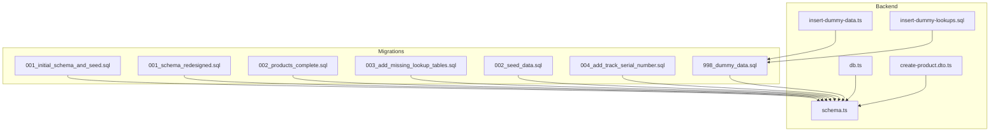
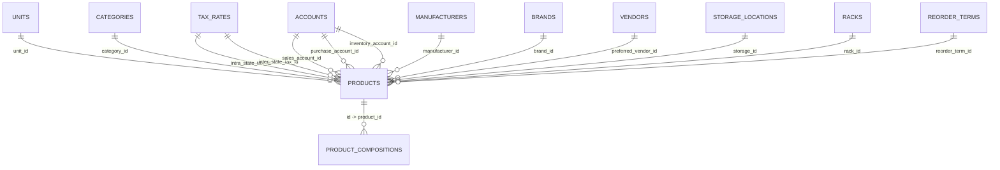
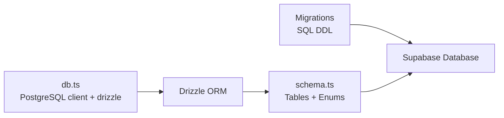

# Database Schema & Design

<cite>
**Referenced Files in This Document**
- [001_initial_schema_and_seed.sql](file://supabase/migrations/001_initial_schema_and_seed.sql)
- [001_schema_redesigned.sql](file://supabase/migrations/001_schema_redesigned.sql)
- [002_products_complete.sql](file://supabase/migrations/002_products_complete.sql)
- [003_add_missing_lookup_tables.sql](file://supabase/migrations/003_add_missing_lookup_tables.sql)
- [002_seed_data.sql](file://supabase/migrations/002_seed_data.sql)
- [004_add_track_serial_number.sql](file://supabase/migrations/004_add_track_serial_number.sql)
- [998_dummy_data.sql](file://supabase/migrations/998_dummy_data.sql)
- [schema.ts](file://backend/src/db/schema.ts)
- [db.ts](file://backend/src/db/db.ts)
- [create-product.dto.ts](file://backend/src/products/dto/create-product.dto.ts)
- [insert-dummy-data.ts](file://backend/scripts/insert-dummy-data.ts)
- [insert-dummy-lookups.sql](file://backend/scripts/insert-dummy-lookups.sql)
</cite>

## Table of Contents
1. [Introduction](#introduction)
2. [Project Structure](#project-structure)
3. [Core Components](#core-components)
4. [Architecture Overview](#architecture-overview)
5. [Detailed Component Analysis](#detailed-component-analysis)
6. [Dependency Analysis](#dependency-analysis)
7. [Performance Considerations](#performance-considerations)
8. [Troubleshooting Guide](#troubleshooting-guide)
9. [Conclusion](#conclusion)
10. [Appendices](#appendices)

## Introduction
This document describes the ZerpAI ERP database schema and design. It covers the current normalized schema for products, customers, sales orders, inventory, and lookup tables. It explains entity relationships, foreign key constraints, referential integrity, enum definitions, multi-tenant design patterns, UUID primary keys, timestamps, indexing strategies, performance considerations, and seed data population. It also documents the evolution from earlier migrations and the current Drizzle ORM model used by the backend.

Authoritative source note:
- The current live table inventory is maintained in `PRD/prd_schema.md`, regenerated from `current schema.txt` on 2026-03-24.
- If this repowiki summary conflicts with `PRD/prd_schema.md`, trust `PRD/prd_schema.md`.

## Project Structure
The database schema is defined primarily via the live schema snapshot in `PRD/prd_schema.md`, supported by Supabase SQL migrations, and mirrored in the backend using Drizzle ORM. The key elements are:
- Migrations define the canonical schema and seed data
- Backend schema.ts defines enums and table structures for type-safe ORM usage
- Scripts populate lookup tables and sample data for development/testing
- Indexes and constraints are declared in migrations for performance and integrity

**Diagram sources**
- [001_initial_schema_and_seed.sql](file://supabase/migrations/001_initial_schema_and_seed.sql#L1-L218)
- [001_schema_redesigned.sql](file://supabase/migrations/001_schema_redesigned.sql#L1-L180)
- [002_products_complete.sql](file://supabase/migrations/002_products_complete.sql#L1-L381)
- [003_add_missing_lookup_tables.sql](file://supabase/migrations/003_add_missing_lookup_tables.sql#L1-L78)
- [002_seed_data.sql](file://supabase/migrations/002_seed_data.sql#L1-L88)
- [004_add_track_serial_number.sql](file://supabase/migrations/004_add_track_serial_number.sql#L1-L15)
- [998_dummy_data.sql](file://supabase/migrations/998_dummy_data.sql#L1-L157)
- [schema.ts](file://backend/src/db/schema.ts#L1-L293)
- [db.ts](file://backend/src/db/db.ts#L1-L13)
- [create-product.dto.ts](file://backend/src/products/dto/create-product.dto.ts#L1-L265)
- [insert-dummy-data.ts](file://backend/scripts/insert-dummy-data.ts#L1-L141)
- [insert-dummy-lookups.sql](file://backend/scripts/insert-dummy-lookups.sql#L1-L94)

**Section sources**
- [001_initial_schema_and_seed.sql](file://supabase/migrations/001_initial_schema_and_seed.sql#L1-L218)
- [002_products_complete.sql](file://supabase/migrations/002_products_complete.sql#L1-L381)
- [schema.ts](file://backend/src/db/schema.ts#L1-L293)

## Core Components
This section outlines the core tables and their roles in ZerpAI ERP.

- Lookup tables (master data)
  - Units: measurement units with types
  - Categories: hierarchical product categories
  - Tax rates: tax configurations (IGST, CGST, SGST)
  - Manufacturers: product manufacturers
  - Brands: branded products linked to manufacturers
  - Accounts: chart of accounts (sales, purchase, inventory, expense, asset)
  - Storage locations and Racks: physical inventory storage
  - Reorder terms: inventory reorder rules
  - Vendors: suppliers with types and GSTIN
  - Additional lookup tables: contents, strengths, buying rules, drug schedules

- Products table
  - Central product entity with sales/purchase/pricing, formulation, composition, inventory settings, and tax preferences
  - References lookup tables via foreign keys
  - Includes composition table for ingredient details

- Sales module tables
  - Customers: customer profiles and addresses
  - Sales orders/invoices: order lifecycle and totals
  - Sales payments and payment links
  - E-way bills

- Multi-tenancy
  - Many tables include org_id and outlet_id fields to isolate data per organization and outlet
  - Indexes support filtering by org/outlet combinations

- Enums and constraints
  - Enumerations for product types, tax preferences, valuation methods, unit types, tax types, account types, vendor types
  - Unique constraints on item_code and SKU per organization
  - Check constraints on allowed values for enums

**Section sources**
- [002_products_complete.sql](file://supabase/migrations/002_products_complete.sql#L24-L226)
- [schema.ts](file://backend/src/db/schema.ts#L117-L195)
- [002_products_complete.sql](file://supabase/migrations/002_products_complete.sql#L229-L241)
- [schema.ts](file://backend/src/db/schema.ts#L197-L207)
- [schema.ts](file://backend/src/db/schema.ts#L213-L234)
- [schema.ts](file://backend/src/db/schema.ts#L237-L291)

## Architecture Overview
The database follows a normalized relational design with:
- UUID primary keys for global uniqueness and multi-tenancy friendliness
- Foreign keys linking products to units, categories, tax rates, accounts, manufacturers, brands, vendors, storage, racks, and reorder terms
- Dedicated composition table for product ingredients
- Sales module tables referencing customers and encapsulating order/payment/e-way bill flows
- Extensive indexes to optimize frequent queries by type, code, SKU, category, vendor, and org/outlet

**Diagram sources**
- [002_products_complete.sql](file://supabase/migrations/002_products_complete.sql#L24-L226)
- [002_products_complete.sql](file://supabase/migrations/002_products_complete.sql#L229-L241)
- [schema.ts](file://backend/src/db/schema.ts#L117-L195)
- [schema.ts](file://backend/src/db/schema.ts#L197-L207)

## Detailed Component Analysis

### Lookup Tables
- Units
  - Purpose: Define measurement units and types (count, weight, volume, length)
  - Keys: id (UUID), unique unit_name
  - Notes: Some later migrations introduce base/unit relationships and conversions

- Categories
  - Purpose: Hierarchical product classification
  - Keys: id (UUID), unique name per organization context
  - Parent-child relationship via parent_id

- Tax rates
  - Purpose: Tax configurations with types IGST, CGST, SGST
  - Keys: id (UUID), unique tax_name

- Manufacturers and Brands
  - Purpose: Branding and sourcing metadata
  - Keys: id (UUID), unique name
  - Brands reference manufacturers

- Accounts (Chart of Accounts)
  - Purpose: Financial accounting entries
  - Keys: id (UUID), unique account_name/account_code

- Storage locations and Racks
  - Purpose: Physical inventory placement
  - Keys: id (UUID), unique identifiers
  - Racks reference storage locations

- Reorder terms
  - Purpose: Inventory reorder automation rules
  - Keys: id (UUID), unique term_name

- Vendors
  - Purpose: Supplier information with GSTIN and types
  - Keys: id (UUID), unique vendor_name

- Additional lookups
  - Contents, strengths, buying rules, drug schedules
  - Purpose: Ingredient composition and regulatory controls

**Section sources**
- [002_products_complete.sql](file://supabase/migrations/002_products_complete.sql#L25-L127)
- [003_add_missing_lookup_tables.sql](file://supabase/migrations/003_add_missing_lookup_tables.sql#L4-L39)
- [schema.ts](file://backend/src/db/schema.ts#L13-L114)

### Products Table
- Core fields
  - Identity: type (goods/service), product_name, billing_name, item_code (unique), sku (unique)
  - Unit and category linkage
  - Tax preferences and intra/inter-state tax references
  - Sales/purchase pricing and accounts
  - Formulation: dimensions, weight, manufacturer/brand identifiers
  - Composition tracking and buying rules
  - Inventory settings: tracking flags, valuation method, storage/rack, reorder point/term
  - Status flags: is_active, is_lock
  - System fields: created_at/updated_at, created_by_id/updated_by_id

- Constraints and indexes
  - Unique constraints on item_code and SKU
  - Extensive indexes on type, item_code, sku, category, unit, manufacturer, brand, vendor, active flag, HSN code

- Composition table
  - product_id (FK, cascade delete)
  - content_name, strength, strength_unit, schedule, display_order
  - Unique constraint on (product_id, content_name)

**Section sources**
- [002_products_complete.sql](file://supabase/migrations/002_products_complete.sql#L132-L226)
- [002_products_complete.sql](file://supabase/migrations/002_products_complete.sql#L229-L241)
- [schema.ts](file://backend/src/db/schema.ts#L117-L195)
- [schema.ts](file://backend/src/db/schema.ts#L197-L207)

### Sales Module Tables
- Customers
  - Personal/business profile, GSTIN/PAN, addresses, payment terms, receivables

- Sales orders
  - Customer reference, sale number, reference, dates, delivery/payment terms, document type, status, totals, notes

- Payments and payment links
  - Payment records and online payment links

- E-way bills
  - Transport and vehicle details, supply/sub-type, status

**Section sources**
- [schema.ts](file://backend/src/db/schema.ts#L213-L291)

### Multi-Tenant Design Patterns
- Many tables include org_id and outlet_id to segment data by organization and outlet
- Indexes on org_id and org_id+outlet_id improve filtering performance
- Seed data scripts demonstrate org_id/outlet_id usage for initial data population

**Section sources**
- [001_initial_schema_and_seed.sql](file://supabase/migrations/001_initial_schema_and_seed.sql#L26-L89)
- [002_seed_data.sql](file://supabase/migrations/002_seed_data.sql#L7-L82)
- [001_schema_redesigned.sql](file://supabase/migrations/001_schema_redesigned.sql#L53-L104)

### Enum Definitions and Business Rules
- Product type: goods, service
- Tax preference: taxable, non-taxable, exempt
- Inventory valuation method: FIFO, LIFO, Weighted Average, Specific Identification
- Unit type: count, weight, volume, length
- Tax type: IGST, CGST, SGST
- Account type: sales, purchase, inventory, expense, asset
- Vendor type: manufacturer, distributor, wholesaler

These enums are enforced via database CHECK constraints and Drizzle enum types.

**Section sources**
- [schema.ts](file://backend/src/db/schema.ts#L3-L11)
- [002_products_complete.sql](file://supabase/migrations/002_products_complete.sql#L138-L184)

### Entity Relationships and Referential Integrity
- Products references:
  - Units, Categories, Tax rates (two FKs), Accounts (three FKs), Manufacturers, Brands, Vendors, Storage locations, Racks, Reorder terms
- Product compositions reference Products (ON DELETE CASCADE)
- Hierarchical categories via parent_id
- Sales orders reference Customers
- Payments and e-way bills reference Sales orders

**Section sources**
- [002_products_complete.sql](file://supabase/migrations/002_products_complete.sql#L132-L226)
- [002_products_complete.sql](file://supabase/migrations/002_products_complete.sql#L229-L241)
- [schema.ts](file://backend/src/db/schema.ts#L213-L291)

### Indexing Strategies and Performance Considerations
- Products: type, item_code, sku, category_id, unit_id, manufacturer_id, brand_id, preferred_vendor_id, is_active, push_to_ecommerce, hsn_code
- Product compositions: product_id
- Categories: parent_id, is_active
- Racks: storage_id
- Brands: manufacturer_id
- Additional lookups: active flag indexes
- Serial number tracking: dedicated index on track_serial_number for true values

These indexes support common filters, joins, and lookups in product management and sales workflows.

**Section sources**
- [002_products_complete.sql](file://supabase/migrations/002_products_complete.sql#L244-L271)
- [003_add_missing_lookup_tables.sql](file://supabase/migrations/003_add_missing_lookup_tables.sql#L41-L45)
- [004_add_track_serial_number.sql](file://supabase/migrations/004_add_track_serial_number.sql#L10-L11)

### Seed Data and Initial Population
- Initial seed data scripts insert sample organizations, outlets, categories, vendors, and products
- Drizzle ORM seed scripts insert standardized lookup data (manufacturers, brands, vendors, storage, racks, reorder terms, accounts, tax rates)
- Dummy data migration populates a broader set of lookups and sample products

**Section sources**
- [001_initial_schema_and_seed.sql](file://supabase/migrations/001_initial_schema_and_seed.sql#L144-L218)
- [002_seed_data.sql](file://supabase/migrations/002_seed_data.sql#L7-L82)
- [insert-dummy-data.ts](file://backend/scripts/insert-dummy-data.ts#L16-L141)
- [insert-dummy-lookups.sql](file://backend/scripts/insert-dummy-lookups.sql#L1-L94)
- [998_dummy_data.sql](file://supabase/migrations/998_dummy_data.sql#L1-L157)

## Dependency Analysis
The backend relies on Drizzle ORM to connect to the database and enforce schema and enums. The connection is configured via DATABASE_URL.

**Diagram sources**
- [db.ts](file://backend/src/db/db.ts#L1-L13)
- [schema.ts](file://backend/src/db/schema.ts#L1-L293)
- [002_products_complete.sql](file://supabase/migrations/002_products_complete.sql#L1-L381)

**Section sources**
- [db.ts](file://backend/src/db/db.ts#L1-L13)
- [schema.ts](file://backend/src/db/schema.ts#L1-L293)

## Performance Considerations
- Use org_id and org_id+outlet_id filters to limit scans to tenant scope
- Leverage existing indexes for product searches by type, item_code, category, vendor, and active status
- Prefer unique constraints on item_code and SKU to avoid duplicates and speed lookups
- For composition-heavy products, use product_id index to fetch ingredients efficiently
- Consider adding indexes for frequently filtered attributes not covered by defaults (e.g., HSN code, tax preference)
- Monitor and adjust reorder-related queries using reorder_point and reorder_term_id

[No sources needed since this section provides general guidance]

## Troubleshooting Guide
- Row Level Security (RLS)
  - During development, RLS is disabled for convenience; scripts exist to quickly disable RLS on all tables
  - Re-enable RLS and tenant-aware policies before production deployment

- Connection and ORM
  - Ensure DATABASE_URL is configured; the backend connects using drizzle with a PostgreSQL client

- Seed data issues
  - If UUID conflicts occur, use ON CONFLICT clauses present in seed scripts
  - For user-dependent seeds, replace placeholder user IDs with actual auth.user IDs

**Section sources**
- [db.ts](file://backend/src/db/db.ts#L1-L13)
- [002_seed_data.sql](file://supabase/migrations/002_seed_data.sql#L17-L27)

## Conclusion
ZerpAI ERP employs a normalized, multi-tenant relational schema with UUID primary keys, extensive enums, and robust foreign key relationships. The design supports product catalogs, inventory management, and sales workflows while enabling scalable tenant isolation. Indexes and constraints are strategically placed to maintain performance and data integrity. The backend mirrors the schema via Drizzle ORM, ensuring type safety and consistency across the stack.

[No sources needed since this section summarizes without analyzing specific files]

## Appendices

### Appendix A: Enum Definitions
- Product type: goods, service
- Tax preference: taxable, non-taxable, exempt
- Inventory valuation method: FIFO, LIFO, Weighted Average, Specific Identification
- Unit type: count, weight, volume, length
- Tax type: IGST, CGST, SGST
- Account type: sales, purchase, inventory, expense, asset
- Vendor type: manufacturer, distributor, wholesaler

**Section sources**
- [schema.ts](file://backend/src/db/schema.ts#L3-L11)

### Appendix B: Key Constraints and Uniqueness
- Products: unique(item_code), unique(sku)
- Lookups: unique(name) for units, categories, tax rates, manufacturers, brands, vendors; unique(account_name), unique(account_code) for accounts
- Organization products (alternative design): unique(org_id, item_code), unique(org_id, product_master_id, outlet_id)

**Section sources**
- [002_products_complete.sql](file://supabase/migrations/002_products_complete.sql#L141-L142)
- [002_products_complete.sql](file://supabase/migrations/002_products_complete.sql#L308-L315)
- [002_products_complete.sql](file://supabase/migrations/002_products_complete.sql#L317-L322)
- [002_products_complete.sql](file://supabase/migrations/002_products_complete.sql#L115-L127)
- [001_schema_redesigned.sql](file://supabase/migrations/001_schema_redesigned.sql#L102-L103)

### Appendix C: Multi-Tenant Fields and Indexes
- Common tenant fields: org_id, outlet_id
- Tenant indexes: products(org_id, outlet_id), categories(org_id), vendors(org_id), etc.

**Section sources**
- [001_initial_schema_and_seed.sql](file://supabase/migrations/001_initial_schema_and_seed.sql#L125-L134)
- [001_schema_redesigned.sql](file://supabase/migrations/001_schema_redesigned.sql#L149-L159)
