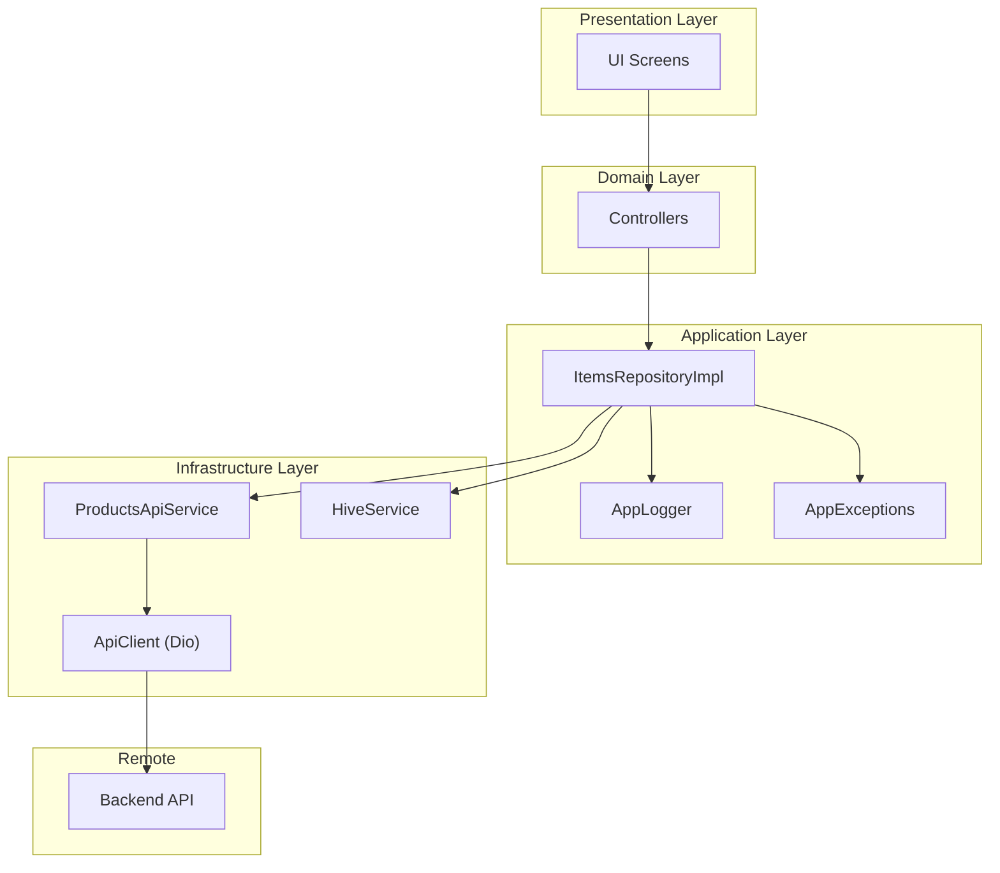
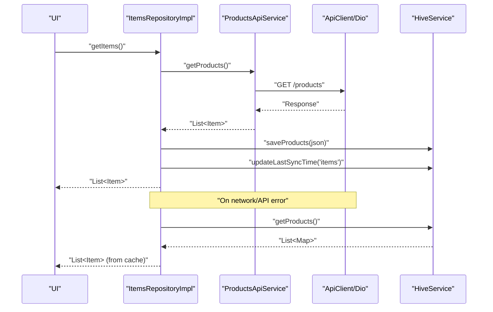
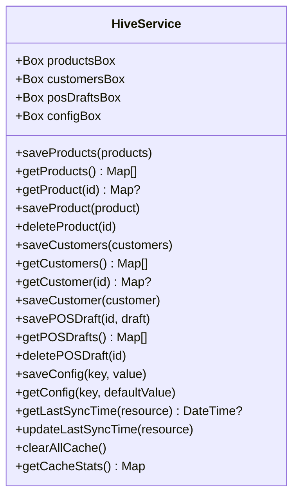
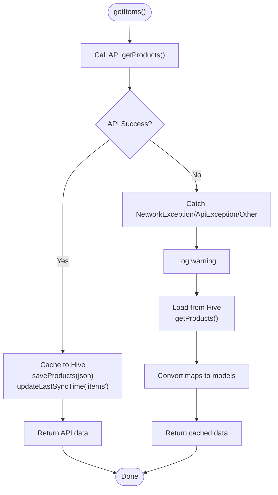
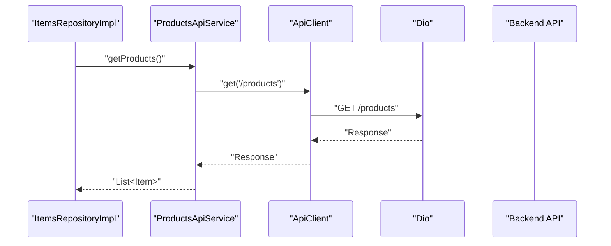
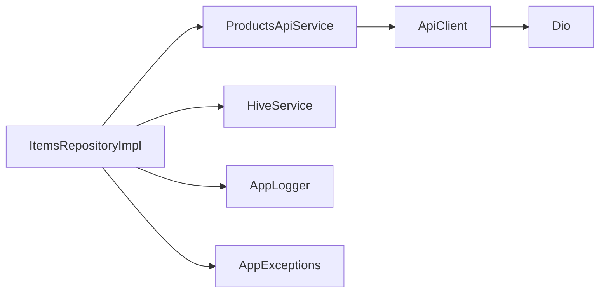

# Local Storage & Offline Sync

<cite>
**Referenced Files in This Document**
- [P0_OFFLINE_SUPPORT_COMPLETE.md](file://PRD/P0_OFFLINE_SUPPORT_COMPLETE.md)
- [hive_service.dart](file://lib/shared/services/hive_service.dart)
- [storage_service.dart](file://lib/shared/services/storage_service.dart)
- [api_client.dart](file://lib/shared/services/api_client.dart)
- [items_repository.dart](file://lib/modules/items/repositories/items_repository.dart)
- [items_repository_impl.dart](file://lib/modules/items/repositories/items_repository_impl.dart)
- [supabase_item_repository.dart](file://lib/modules/items/repositories/supabase_item_repository.dart)
- [products_api_service.dart](file://lib/modules/items/services/products_api_service.dart)
- [app_logger.dart](file://lib/core/logging/app_logger.dart)
- [app_exceptions.dart](file://lib/core/errors/app_exceptions.dart)
</cite>

## Table of Contents
1. [Introduction](#introduction)
2. [Project Structure](#project-structure)
3. [Core Components](#core-components)
4. [Architecture Overview](#architecture-overview)
5. [Detailed Component Analysis](#detailed-component-analysis)
6. [Dependency Analysis](#dependency-analysis)
7. [Performance Considerations](#performance-considerations)
8. [Troubleshooting Guide](#troubleshooting-guide)
9. [Conclusion](#conclusion)
10. [Appendices](#appendices)

## Introduction
This document explains the local storage and offline synchronization system in ZerpAI ERP. It covers the Hive database integration for offline functionality, data persistence patterns, and local caching strategies. It also documents the synchronization mechanism between local storage and the remote API, including conflict resolution approaches, data consistency guarantees, background sync processes, retry mechanisms, error handling for network failures, data models used for offline storage, and user experience considerations during connectivity issues.

## Project Structure
The offline system is centered around a repository abstraction layered over an API service, with Hive acting as the local cache. Supporting services handle API communication and optional cloud storage for images. The PRD report outlines the completed offline support infrastructure and the migration from a direct Supabase repository to an online-first repository with offline fallback.

**Diagram sources**
- [items_repository_impl.dart](file://lib/modules/items/repositories/items_repository_impl.dart#L14-L83)
- [products_api_service.dart](file://lib/modules/items/services/products_api_service.dart#L7-L64)
- [api_client.dart](file://lib/shared/services/api_client.dart#L6-L41)
- [hive_service.dart](file://lib/shared/services/hive_service.dart#L6-L16)
- [app_logger.dart](file://lib/core/logging/app_logger.dart)
- [app_exceptions.dart](file://lib/core/errors/app_exceptions.dart)

**Section sources**
- [P0_OFFLINE_SUPPORT_COMPLETE.md](file://PRD/P0_OFFLINE_SUPPORT_COMPLETE.md#L95-L114)

## Core Components
- HiveService: Provides centralized access to Hive boxes for products, customers, POS drafts, and configuration. It supports saving, loading, deleting, and metadata like last sync timestamps and cache statistics.
- ItemsRepositoryImpl: Implements the repository interface with an online-first strategy. It attempts API calls first, caches successful responses to Hive, and falls back to Hive on network/API errors.
- ProductsApiService: Wraps API calls to the backend using ApiClient and provides repository-compatible methods for raw Map data to support caching.
- ApiClient: Thin wrapper around Dio with base URL from environment variables and shared interceptors.
- StorageService: Handles Cloudflare R2 image uploads and deletions; not part of offline sync but relevant to asset persistence.

Key responsibilities:
- Persistence: HiveService persists JSON-like maps for offline access.
- Synchronization: ItemsRepositoryImpl updates last sync timestamps and maintains cache consistency.
- Error handling: Repository catches network and API exceptions and falls back to cache.
- Observability: AppLogger records performance and error events.

**Section sources**
- [hive_service.dart](file://lib/shared/services/hive_service.dart#L6-L134)
- [items_repository_impl.dart](file://lib/modules/items/repositories/items_repository_impl.dart#L14-L297)
- [products_api_service.dart](file://lib/modules/items/services/products_api_service.dart#L7-L208)
- [api_client.dart](file://lib/shared/services/api_client.dart#L6-L62)
- [storage_service.dart](file://lib/shared/services/storage_service.dart#L9-L227)

## Architecture Overview
The system follows an online-first architecture with automatic offline fallback. On successful API calls, data is cached to Hive and the last sync timestamp is updated. On failures, the repository reads from Hive and logs appropriate messages. The PRD report illustrates the before/after architecture and testing steps.

**Diagram sources**
- [items_repository_impl.dart](file://lib/modules/items/repositories/items_repository_impl.dart#L24-L83)
- [products_api_service.dart](file://lib/modules/items/services/products_api_service.dart#L51-L64)
- [api_client.dart](file://lib/shared/services/api_client.dart#L46-L48)
- [hive_service.dart](file://lib/shared/services/hive_service.dart#L19-L30)

**Section sources**
- [P0_OFFLINE_SUPPORT_COMPLETE.md](file://PRD/P0_OFFLINE_SUPPORT_COMPLETE.md#L95-L114)
- [items_repository_impl.dart](file://lib/modules/items/repositories/items_repository_impl.dart#L24-L83)

## Detailed Component Analysis

### HiveService: Local Cache Abstraction
HiveService encapsulates:
- Boxes: products, customers, pos_drafts, config
- CRUD operations for products and customers
- POS draft management
- Config management including last sync timestamps
- Cache statistics and clearing utilities

Persistence patterns:
- Products and customers are cached as lists of maps keyed by id.
- POS drafts are stored as individual entries.
- Config stores metadata like last sync per resource.

Serialization and deserialization:
- Repository methods pass JSON maps to HiveService for storage.
- Retrieval converts cached maps back to typed models.

**Diagram sources**
- [hive_service.dart](file://lib/shared/services/hive_service.dart#L6-L134)

**Section sources**
- [hive_service.dart](file://lib/shared/services/hive_service.dart#L11-L134)

### ItemsRepositoryImpl: Online-First with Offline Fallback
Responsibilities:
- Attempt API calls first for fresh data.
- Cache successful responses to Hive.
- Update last sync timestamps.
- On exceptions, fall back to Hive cache.
- Provide forced refresh and offline availability checks.

Error handling:
- Catches network and API exceptions and logs warnings.
- Catches unexpected errors and logs errors.
- Returns empty collections gracefully when cache retrieval fails.

**Diagram sources**
- [items_repository_impl.dart](file://lib/modules/items/repositories/items_repository_impl.dart#L24-L83)
- [hive_service.dart](file://lib/shared/services/hive_service.dart#L19-L30)

**Section sources**
- [items_repository_impl.dart](file://lib/modules/items/repositories/items_repository_impl.dart#L24-L112)

### ProductsApiService and ApiClient: Remote Integration
- ApiClient sets up Dio with base URL from environment variables and shared interceptors.
- ProductsApiService wraps HTTP calls, maps responses to typed models, and exposes repository-compatible methods for raw Map data.

**Diagram sources**
- [products_api_service.dart](file://lib/modules/items/services/products_api_service.dart#L51-L64)
- [api_client.dart](file://lib/shared/services/api_client.dart#L46-L60)

**Section sources**
- [products_api_service.dart](file://lib/modules/items/services/products_api_service.dart#L7-L208)
- [api_client.dart](file://lib/shared/services/api_client.dart#L6-L62)

### SupabaseItemRepository: Legacy Repository
A legacy implementation that directly calls the API service without offline fallback. It remains for comparison and historical context.

**Section sources**
- [supabase_item_repository.dart](file://lib/modules/items/repositories/supabase_item_repository.dart#L7-L42)

### Data Models and Serialization Patterns
- Models: Item and related models are used for typed operations.
- Serialization: Repository methods convert models to JSON maps for caching; HiveService stores these maps; retrieval reconstructs models from cached maps.
- Repository compatibility: ProductsApiService provides methods returning raw maps to support caching without model conversion overhead.

**Section sources**
- [items_repository.dart](file://lib/modules/items/repositories/items_repository.dart#L3-L9)
- [items_repository_impl.dart](file://lib/modules/items/repositories/items_repository_impl.dart#L38-L41)
- [products_api_service.dart](file://lib/modules/items/services/products_api_service.dart#L141-L155)

### Conflict Resolution and Consistency Guarantees
Observed behavior:
- Online-first writes bypass cache initially; subsequent reads may serve cached data.
- Last sync timestamps are recorded per resource to inform freshness.
- On read failures, the repository returns empty data rather than throwing, ensuring resilience.

Consistency characteristics:
- Eventual consistency: Local cache reflects the last successful sync; newer local changes are not propagated until a future sync.
- No explicit server-side merge or conflict detection is implemented in the repository layer.

Recommendations:
- Introduce a pending-changes queue and a background sync process to reconcile local edits with remote state.
- Implement optimistic updates with conflict markers and a deterministic merge strategy (e.g., last-writer-wins with metadata).

**Section sources**
- [items_repository_impl.dart](file://lib/modules/items/repositories/items_repository_impl.dart#L274-L295)
- [hive_service.dart](file://lib/shared/services/hive_service.dart#L101-L113)

### Background Sync Processes, Retry Mechanisms, and Error Handling
Observed behavior:
- No explicit background sync loop is present in the repository.
- Retry logic is not implemented; the fallback is immediate upon exceptions.
- Logging is comprehensive, aiding debugging and observability.

Recommendations:
- Implement periodic background sync using platform-specific scheduling.
- Add exponential backoff and retry for transient network errors.
- Queue local mutations and apply them when connectivity is restored.

**Section sources**
- [items_repository_impl.dart](file://lib/modules/items/repositories/items_repository_impl.dart#L57-L82)
- [app_logger.dart](file://lib/core/logging/app_logger.dart)

### State Management and User Experience During Connectivity Issues
Observed behavior:
- UI continues to function by loading cached data when network/API calls fail.
- Logs indicate fallback actions and last sync timestamps.
- There is no explicit UI indicator for offline mode.

Recommendations:
- Add UI indicators for offline mode and cache staleness.
- Provide a manual refresh action with progress feedback.
- Show a “Last synced” timestamp and offer a “Retry now” option.

**Section sources**
- [P0_OFFLINE_SUPPORT_COMPLETE.md](file://PRD/P0_OFFLINE_SUPPORT_COMPLETE.md#L117-L131)
- [items_repository_impl.dart](file://lib/modules/items/repositories/items_repository_impl.dart#L57-L82)

## Dependency Analysis
The repository depends on the API service and HiveService. The API service depends on ApiClient and Dio. HiveService is a standalone persistence layer.

**Diagram sources**
- [items_repository_impl.dart](file://lib/modules/items/repositories/items_repository_impl.dart#L14-L22)
- [products_api_service.dart](file://lib/modules/items/services/products_api_service.dart#L7-L8)
- [api_client.dart](file://lib/shared/services/api_client.dart#L6-L10)
- [hive_service.dart](file://lib/shared/services/hive_service.dart#L6-L9)

**Section sources**
- [items_repository_impl.dart](file://lib/modules/items/repositories/items_repository_impl.dart#L14-L22)
- [products_api_service.dart](file://lib/modules/items/services/products_api_service.dart#L7-L8)
- [api_client.dart](file://lib/shared/services/api_client.dart#L6-L10)
- [hive_service.dart](file://lib/shared/services/hive_service.dart#L6-L9)

## Performance Considerations
- Online-first approach reduces latency when network is available.
- Caching avoids repeated network requests for the same data.
- Logging includes performance metrics for API calls.
- Consider batching cache writes and reads for large datasets.

[No sources needed since this section provides general guidance]

## Troubleshooting Guide
Common issues and remedies:
- Network/API errors: Repository falls back to cache; check logs for warnings and errors.
- Cache corruption: Use cache statistics and clear cache cautiously.
- Stale data: Trigger forced refresh to bypass cache.
- Environment configuration: Verify API base URL and credentials.

**Section sources**
- [items_repository_impl.dart](file://lib/modules/items/repositories/items_repository_impl.dart#L57-L82)
- [hive_service.dart](file://lib/shared/services/hive_service.dart#L118-L132)
- [api_client.dart](file://lib/shared/services/api_client.dart#L12-L25)

## Conclusion
ZerpAI ERP implements a robust offline-first foundation using Hive for local caching and an online-first repository pattern with automatic fallback. The system ensures resilience during connectivity issues, maintains cache freshness via last-sync timestamps, and provides comprehensive logging. Future enhancements should focus on background sync, retries, conflict resolution, and improved user experience indicators for offline scenarios.

[No sources needed since this section summarizes without analyzing specific files]

## Appendices

### Appendix A: Testing Offline Mode
Follow the PRD testing steps to validate offline behavior:
- Load items while online to populate cache.
- Disable network.
- Reload items to confirm cache fallback.
- Review logs for fallback messages.

**Section sources**
- [P0_OFFLINE_SUPPORT_COMPLETE.md](file://PRD/P0_OFFLINE_SUPPORT_COMPLETE.md#L117-L131)

### Appendix B: Image Storage (Cloudflare R2)
StorageService handles image uploads and deletions to R2. While not part of offline sync, it complements asset persistence.

**Section sources**
- [storage_service.dart](file://lib/shared/services/storage_service.dart#L25-L45)
- [storage_service.dart](file://lib/shared/services/storage_service.dart#L138-L136)