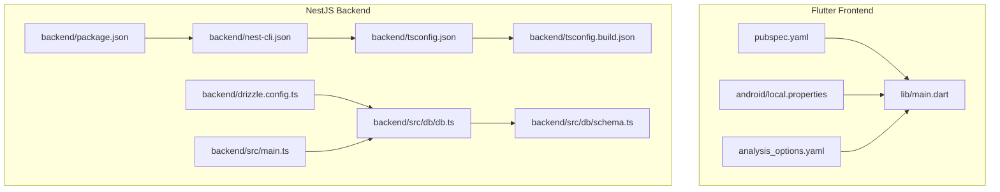
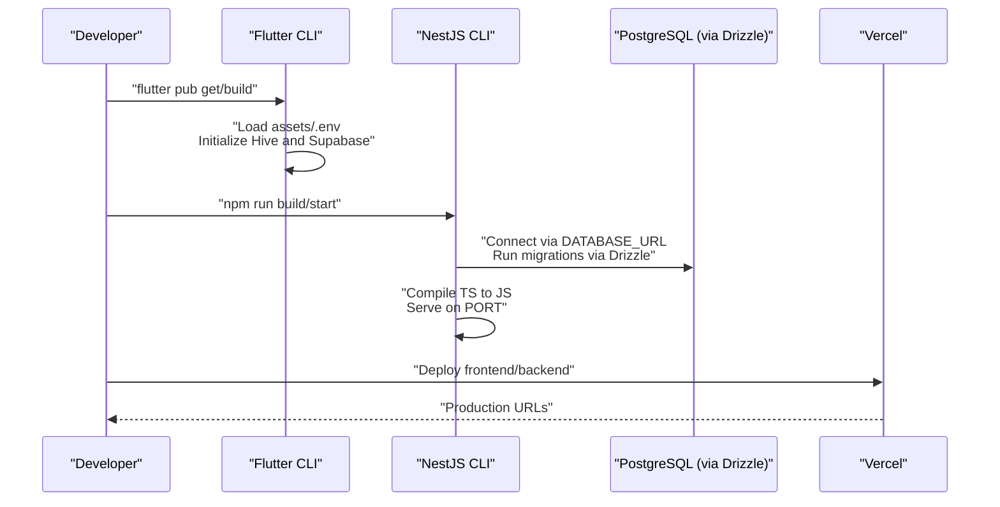
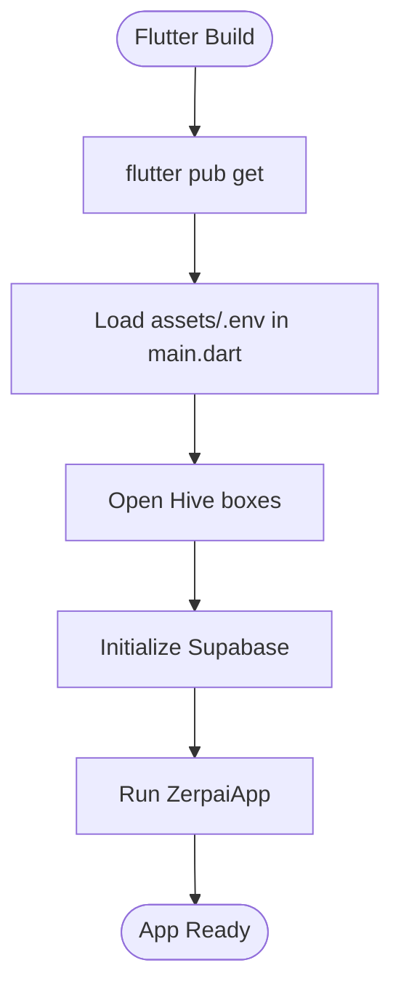
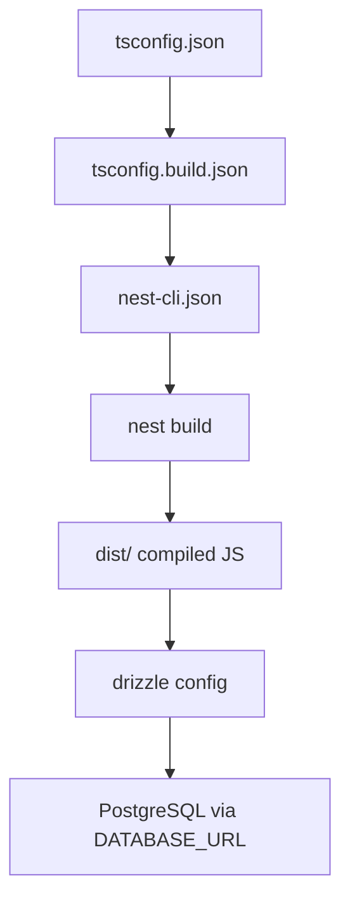
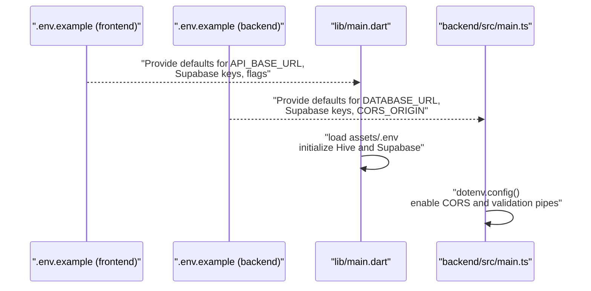
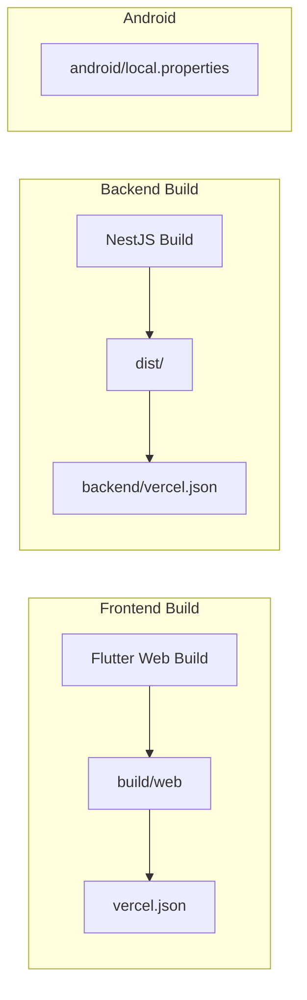
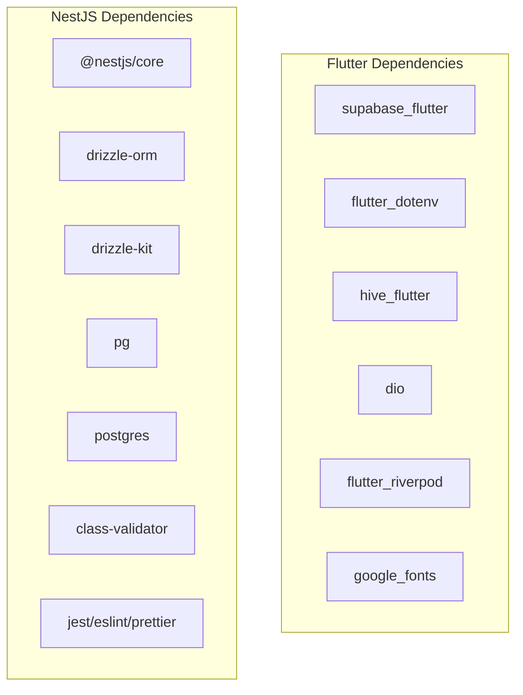

# Build & Configuration

<cite>
**Referenced Files in This Document**
- [pubspec.yaml](file://pubspec.yaml)
- [analysis_options.yaml](file://analysis_options.yaml)
- [android/local.properties](file://android/local.properties)
- [lib/main.dart](file://lib/main.dart)
- [backend/package.json](file://backend/package.json)
- [backend/nest-cli.json](file://backend/nest-cli.json)
- [backend/tsconfig.json](file://backend/tsconfig.json)
- [backend/tsconfig.build.json](file://backend/tsconfig.build.json)
- [backend/drizzle.config.ts](file://backend/drizzle.config.ts)
- [backend/src/main.ts](file://backend/src/main.ts)
- [backend/src/db/db.ts](file://backend/src/db/db.ts)
- [backend/src/db/schema.ts](file://backend/src/db/schema.ts)
- [backend/.env.example](file://backend/.env.example)
- [backend/vercel.json](file://backend/vercel.json)
- [.env.example](file://.env.example)
- [vercel.json](file://vercel.json)
</cite>

## Table of Contents
1. [Introduction](#introduction)
2. [Project Structure](#project-structure)
3. [Core Components](#core-components)
4. [Architecture Overview](#architecture-overview)
5. [Detailed Component Analysis](#detailed-component-analysis)
6. [Dependency Analysis](#dependency-analysis)
7. [Performance Considerations](#performance-considerations)
8. [Troubleshooting Guide](#troubleshooting-guide)
9. [Conclusion](#conclusion)
10. [Appendices](#appendices)

## Introduction
This document explains how to build and configure ZerpAI ERP across its Flutter frontend and NestJS backend. It covers:
- Flutter build process, dependencies, assets, and optimization settings
- NestJS backend compilation, TypeScript configuration, and Drizzle ORM setup
- Build pipelines for both frontend and backend, including environment-specific builds, minification, and bundle optimization
- Dependency management, version compatibility, and troubleshooting
- Environment configuration for development, staging, and production
- Build artifact generation and deployment via Vercel

## Project Structure
ZerpAI ERP is a monorepo with two primary build systems:
- Flutter frontend under the repository root
- NestJS backend under backend/

Key build-related directories and files:
- Flutter: pubspec.yaml, lib/main.dart, android/local.properties, analysis_options.yaml
- Backend: backend/package.json, backend/nest-cli.json, backend/tsconfig*.json, backend/drizzle.config.ts, backend/src/main.ts, backend/src/db/*



**Diagram sources**
- [pubspec.yaml](file://pubspec.yaml#L1-L128)
- [lib/main.dart](file://lib/main.dart#L1-L29)
- [android/local.properties](file://android/local.properties#L1-L5)
- [analysis_options.yaml](file://analysis_options.yaml#L1-L29)
- [backend/package.json](file://backend/package.json#L1-L79)
- [backend/nest-cli.json](file://backend/nest-cli.json#L1-L12)
- [backend/tsconfig.json](file://backend/tsconfig.json#L1-L22)
- [backend/tsconfig.build.json](file://backend/tsconfig.build.json#L1-L18)
- [backend/drizzle.config.ts](file://backend/drizzle.config.ts#L1-L16)
- [backend/src/main.ts](file://backend/src/main.ts#L1-L56)
- [backend/src/db/db.ts](file://backend/src/db/db.ts#L1-L13)
- [backend/src/db/schema.ts](file://backend/src/db/schema.ts#L1-L293)

**Section sources**
- [pubspec.yaml](file://pubspec.yaml#L1-L128)
- [lib/main.dart](file://lib/main.dart#L1-L29)
- [android/local.properties](file://android/local.properties#L1-L5)
- [analysis_options.yaml](file://analysis_options.yaml#L1-L29)
- [backend/package.json](file://backend/package.json#L1-L79)
- [backend/nest-cli.json](file://backend/nest-cli.json#L1-L12)
- [backend/tsconfig.json](file://backend/tsconfig.json#L1-L22)
- [backend/tsconfig.build.json](file://backend/tsconfig.build.json#L1-L18)
- [backend/drizzle.config.ts](file://backend/drizzle.config.ts#L1-L16)
- [backend/src/main.ts](file://backend/src/main.ts#L1-L56)
- [backend/src/db/db.ts](file://backend/src/db/db.ts#L1-L13)
- [backend/src/db/schema.ts](file://backend/src/db/schema.ts#L1-L293)

## Core Components
This section documents the essential build and configuration components for both frontend and backend.

- Flutter build and dependencies
  - Versioning and environment constraints
  - Dependencies and dev-dependencies
  - Assets and environment file handling
  - Lint configuration

- NestJS backend build and dependencies
  - Scripts and build commands
  - TypeScript compiler options and build config
  - Drizzle ORM configuration and schema
  - Environment variables and CORS setup

**Section sources**
- [pubspec.yaml](file://pubspec.yaml#L1-L128)
- [analysis_options.yaml](file://analysis_options.yaml#L1-L29)
- [lib/main.dart](file://lib/main.dart#L1-L29)
- [backend/package.json](file://backend/package.json#L1-L79)
- [backend/tsconfig.json](file://backend/tsconfig.json#L1-L22)
- [backend/tsconfig.build.json](file://backend/tsconfig.build.json#L1-L18)
- [backend/drizzle.config.ts](file://backend/drizzle.config.ts#L1-L16)
- [backend/src/db/db.ts](file://backend/src/db/db.ts#L1-L13)
- [backend/src/db/schema.ts](file://backend/src/db/schema.ts#L1-L293)
- [backend/src/main.ts](file://backend/src/main.ts#L1-L56)

## Architecture Overview
The build pipeline integrates environment configuration, asset bundling, and backend compilation. The frontend loads environment variables from an asset and initializes Supabase and Hive. The backend compiles TypeScript, connects to the database via Drizzle, and exposes REST endpoints.



**Diagram sources**
- [lib/main.dart](file://lib/main.dart#L1-L29)
- [backend/src/main.ts](file://backend/src/main.ts#L1-L56)
- [backend/src/db/db.ts](file://backend/src/db/db.ts#L1-L13)
- [backend/drizzle.config.ts](file://backend/drizzle.config.ts#L1-L16)
- [backend/package.json](file://backend/package.json#L1-L79)
- [vercel.json](file://vercel.json#L1-L12)
- [backend/vercel.json](file://backend/vercel.json#L1-L18)

## Detailed Component Analysis

### Flutter Build Configuration
- Dependencies and dev-dependencies
  - Core: flutter sdk, lucide_icons, google_fonts, dio, hive_flutter, flutter_riverpod, supabase_flutter, flutter_dotenv
  - Dev: flutter_lints, build_runner, hive_generator
- Assets
  - assets/.env is included for runtime environment loading
- Environment loading
  - lib/main.dart loads assets/.env and initializes Supabase and Hive before runApp
- Linting
  - analysis_options.yaml enforces Flutter lints



**Diagram sources**
- [lib/main.dart](file://lib/main.dart#L1-L29)
- [pubspec.yaml](file://pubspec.yaml#L38-L128)
- [analysis_options.yaml](file://analysis_options.yaml#L1-L29)

**Section sources**
- [pubspec.yaml](file://pubspec.yaml#L38-L128)
- [analysis_options.yaml](file://analysis_options.yaml#L1-L29)
- [lib/main.dart](file://lib/main.dart#L1-L29)

### NestJS Backend Build Configuration
- Scripts
  - build, start, start:dev, start:debug, start:prod, lint, test, test:watch, test:cov, test:debug, test:e2e
- TypeScript configuration
  - tsconfig.json: target ES2021, sourceMap, strictNullChecks off, skipLibCheck, incremental
  - tsconfig.build.json: extends base, commonjs output, excludes tests and node_modules
- NestJS CLI
  - nest-cli.json: assets include, watchAssets, deleteOutDir
- Drizzle ORM
  - drizzle.config.ts: schema path, output dir, driver pg, dbCredentials from DATABASE_URL, strict mode



**Diagram sources**
- [backend/tsconfig.json](file://backend/tsconfig.json#L1-L22)
- [backend/tsconfig.build.json](file://backend/tsconfig.build.json#L1-L18)
- [backend/nest-cli.json](file://backend/nest-cli.json#L1-L12)
- [backend/drizzle.config.ts](file://backend/drizzle.config.ts#L1-L16)

**Section sources**
- [backend/package.json](file://backend/package.json#L1-L79)
- [backend/tsconfig.json](file://backend/tsconfig.json#L1-L22)
- [backend/tsconfig.build.json](file://backend/tsconfig.build.json#L1-L18)
- [backend/nest-cli.json](file://backend/nest-cli.json#L1-L12)
- [backend/drizzle.config.ts](file://backend/drizzle.config.ts#L1-L16)

### Drizzle ORM Setup
- Connection
  - backend/src/db/db.ts creates a PostgreSQL client and a drizzle instance using DATABASE_URL
- Schema
  - backend/src/db/schema.ts defines tables and enums for products, categories, tax rates, accounts, vendors, customers, and sales
- Migration and configuration
  - drizzle.config.ts points to schema.ts and sets output directory and driver

```mermaid
erDiagram
UNITS {
uuid id PK
varchar unitName UK
varchar unitSymbol
enum unitType
boolean isActive
timestamp createdAt
}
CATEGORIES {
uuid id PK
varchar name UK
text description
uuid parentId FK
boolean isActive
timestamp createdAt
}
TAX_RATES {
uuid id PK
varchar taxName UK
decimal taxRate
enum taxType
boolean isActive
timestamp createdAt
}
PRODUCTS {
uuid id PK
enum type
varchar productName
varchar billingName
varchar itemCode UK
varchar sku
uuid unitId FK
uuid categoryId FK
boolean isReturnable
boolean pushToEcommerce
varchar hsnCode
enum taxPreference
uuid intraStateTaxId FK
uuid interStateTaxId FK
text primaryImageUrl
text imageUrls
decimal sellingPrice
varchar sellingPriceCurrency
decimal mrp
decimal ptr
uuid salesAccountId FK
text salesDescription
decimal costPrice
varchar costPriceCurrency
uuid purchaseAccountId FK
uuid preferredVendorId FK
text purchaseDescription
decimal length
decimal width
decimal height
varchar dimensionUnit
decimal weight
varchar weightUnit
uuid manufacturerId FK
uuid brandId FK
varchar mpn
varchar upc
varchar isbn
varchar ean
boolean trackAssocIngredients
varchar buyingRule
varchar scheduleOfDrug
boolean isTrackInventory
boolean trackBinLocation
boolean trackBatches
uuid inventoryAccountId FK
enum inventoryValuationMethod
uuid storageId FK
uuid rackId FK
integer reorderPoint
uuid reorderTermId FK
boolean isActive
boolean isLock
timestamp createdAt
uuid createdById
timestamp updatedAt
uuid updatedById
}
PRODUCTS ||--|| UNITS : "unitId"
PRODUCTS ||--|| CATEGORIES : "categoryId"
PRODUCTS ||--o{| TAX_RATES : "intraStateTaxId"
PRODUCTS ||--o{| TAX_RATES : "interStateTaxId"
```

**Diagram sources**
- [backend/src/db/schema.ts](file://backend/src/db/schema.ts#L1-L293)
- [backend/src/db/db.ts](file://backend/src/db/db.ts#L1-L13)
- [backend/drizzle.config.ts](file://backend/drizzle.config.ts#L1-L16)

**Section sources**
- [backend/src/db/db.ts](file://backend/src/db/db.ts#L1-L13)
- [backend/src/db/schema.ts](file://backend/src/db/schema.ts#L1-L293)
- [backend/drizzle.config.ts](file://backend/drizzle.config.ts#L1-L16)

### Environment Configuration
- Frontend environment template
  - .env.example defines API_BASE_URL, Supabase keys, ENVIRONMENT, feature flags, cache settings, timeouts, and logging
- Backend environment template
  - backend/.env.example defines DATABASE_URL, Supabase credentials, JWT_SECRET, PORT, CORS_ORIGIN, API_PREFIX, API_VERSION, Cloudflare R2 storage, and deployment URLs
- Runtime environment loading
  - Flutter: lib/main.dart loads assets/.env and initializes Supabase and Hive
  - Backend: backend/src/main.ts loads environment variables and enables CORS



**Diagram sources**
- [.env.example](file://.env.example#L1-L68)
- [backend/.env.example](file://backend/.env.example#L1-L40)
- [lib/main.dart](file://lib/main.dart#L1-L29)
- [backend/src/main.ts](file://backend/src/main.ts#L1-L56)

**Section sources**
- [.env.example](file://.env.example#L1-L68)
- [backend/.env.example](file://backend/.env.example#L1-L40)
- [lib/main.dart](file://lib/main.dart#L1-L29)
- [backend/src/main.ts](file://backend/src/main.ts#L1-L56)

### Build Pipeline and Artifacts
- Flutter
  - Build artifacts: build/web (static site)
  - Vercel configuration: vercel.json routes all paths to static output
- NestJS
  - Build artifacts: dist/ (compiled JS)
  - Vercel configuration: backend/vercel.json routes all paths to src/main.ts with @vercel/node
- Android build metadata
  - android/local.properties defines sdk.dir, flutter.sdk, build modes, and versionName/code



**Diagram sources**
- [vercel.json](file://vercel.json#L1-L12)
- [backend/vercel.json](file://backend/vercel.json#L1-L18)
- [android/local.properties](file://android/local.properties#L1-L5)

**Section sources**
- [vercel.json](file://vercel.json#L1-L12)
- [backend/vercel.json](file://backend/vercel.json#L1-L18)
- [android/local.properties](file://android/local.properties#L1-L5)

## Dependency Analysis
- Flutter
  - SDK constraint: ^3.8.1
  - Key libraries: supabase_flutter, flutter_dotenv, hive_flutter, dio, flutter_riverpod, google_fonts
- NestJS
  - Core: @nestjs/* (common, core, platform-express)
  - ORM: drizzle-orm, drizzle-kit
  - Database: pg, postgres
  - Validation: class-validator, class-transformer
  - Testing/Linting: jest, eslint, prettier, ts-jest, ts-node



**Diagram sources**
- [pubspec.yaml](file://pubspec.yaml#L38-L70)
- [backend/package.json](file://backend/package.json#L22-L60)

**Section sources**
- [pubspec.yaml](file://pubspec.yaml#L38-L70)
- [backend/package.json](file://backend/package.json#L22-L60)

## Performance Considerations
- Flutter
  - Keep assets minimal; only include assets/.env and necessary resources
  - Use release builds for production deployments
- NestJS
  - Enable production mode via NODE_ENV=production
  - Use Drizzle’s strict mode and schema validation to prevent runtime errors
  - Leverage incremental builds and source maps for debugging during development

[No sources needed since this section provides general guidance]

## Troubleshooting Guide
- Flutter environment loading
  - Ensure assets/.env exists and is readable by the app initialization
  - Verify lib/main.dart loads the environment before initializing Supabase/Hive
- Backend database connectivity
  - Confirm DATABASE_URL is present in the environment
  - Validate Drizzle configuration and connection client settings
- CORS issues
  - Adjust CORS_ORIGINS in backend/src/main.ts and CORS_ORIGIN in backend/.env.example
- Build failures
  - Flutter: run flutter pub get and ensure analysis_options.yaml is valid
  - NestJS: verify tsconfig.json/tsconfig.build.json and nest-cli.json settings

**Section sources**
- [lib/main.dart](file://lib/main.dart#L1-L29)
- [backend/src/main.ts](file://backend/src/main.ts#L1-L56)
- [backend/src/db/db.ts](file://backend/src/db/db.ts#L1-L13)
- [backend/drizzle.config.ts](file://backend/drizzle.config.ts#L1-L16)
- [analysis_options.yaml](file://analysis_options.yaml#L1-L29)

## Conclusion
ZerpAI ERP’s build and configuration rely on well-defined Flutter and NestJS pipelines. The frontend loads environment variables from assets and initializes Supabase and Hive, while the backend compiles TypeScript, connects to PostgreSQL via Drizzle, and serves REST endpoints. Environment-specific builds are supported via environment templates and Vercel configurations. Following the outlined steps ensures reliable development, testing, and production deployments.

[No sources needed since this section summarizes without analyzing specific files]

## Appendices

### Environment Templates Reference
- Frontend environment template
  - Path: .env.example
  - Key variables: API_BASE_URL, SUPABASE_URL, SUPABASE_ANON_KEY, SUPABASE_SERVICE_ROLE_KEY, ENVIRONMENT, feature flags, cache settings, timeouts, logging
- Backend environment template
  - Path: backend/.env.example
  - Key variables: DATABASE_URL, SUPABASE_URL, SUPABASE_ANON_KEY, SUPABASE_SERVICE_ROLE_KEY, JWT_SECRET, PORT, CORS_ORIGIN, API_PREFIX, API_VERSION, Cloudflare R2 storage, deployment URLs

**Section sources**
- [.env.example](file://.env.example#L1-L68)
- [backend/.env.example](file://backend/.env.example#L1-L40)

### Build Commands Reference
- Flutter
  - flutter pub get
  - flutter build web (produces build/web)
- NestJS
  - npm run build (compiles to dist/)
  - npm run start:dev (watch mode)
  - npm run start:prod (serve dist/main)
  - npm run test (Jest)
  - npx drizzle-kit generate (generate migrations)
  - npx drizzle-kit migrate (apply migrations)

**Section sources**
- [pubspec.yaml](file://pubspec.yaml#L1-L128)
- [backend/package.json](file://backend/package.json#L1-L79)
- [backend/drizzle.config.ts](file://backend/drizzle.config.ts#L1-L16)