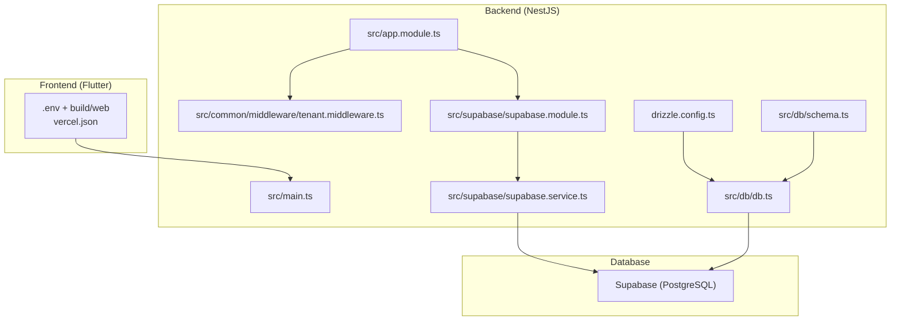
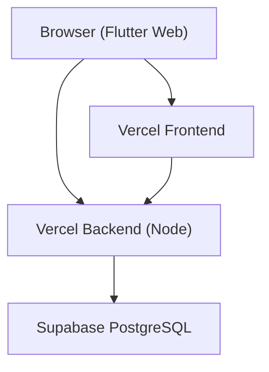
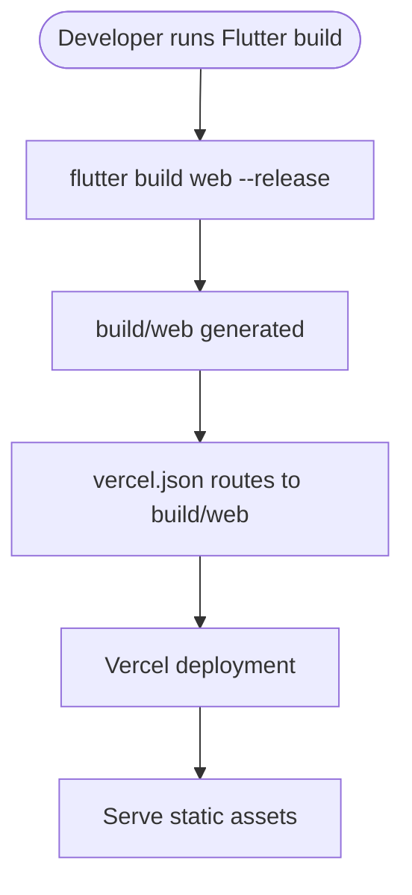
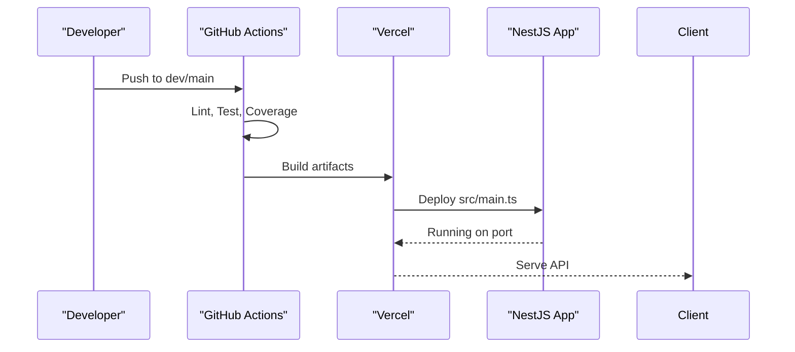
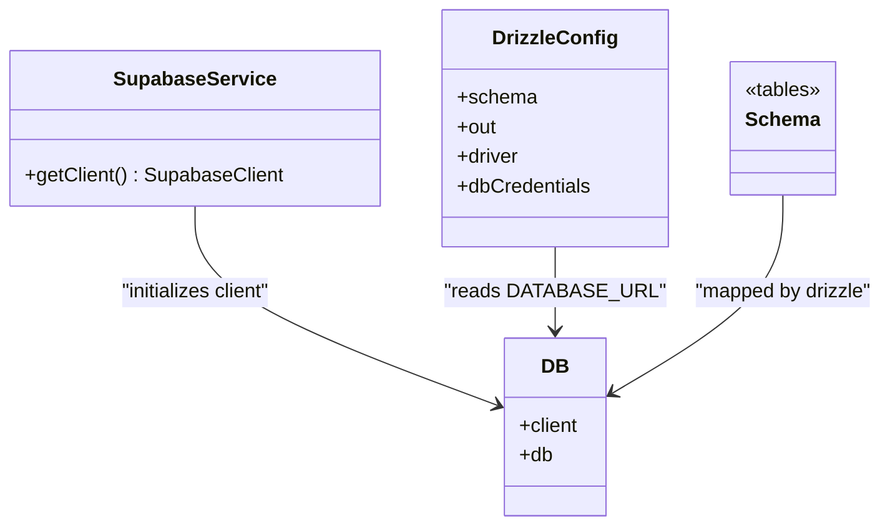
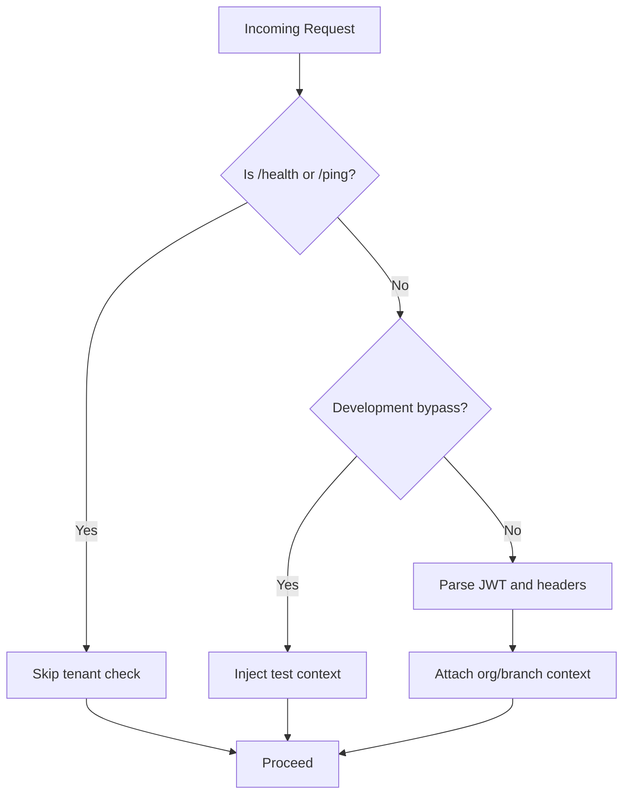
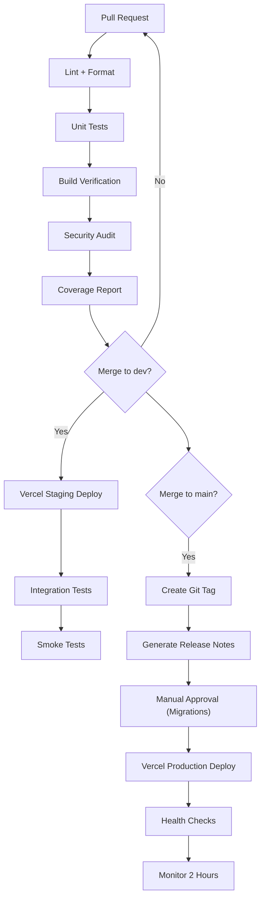
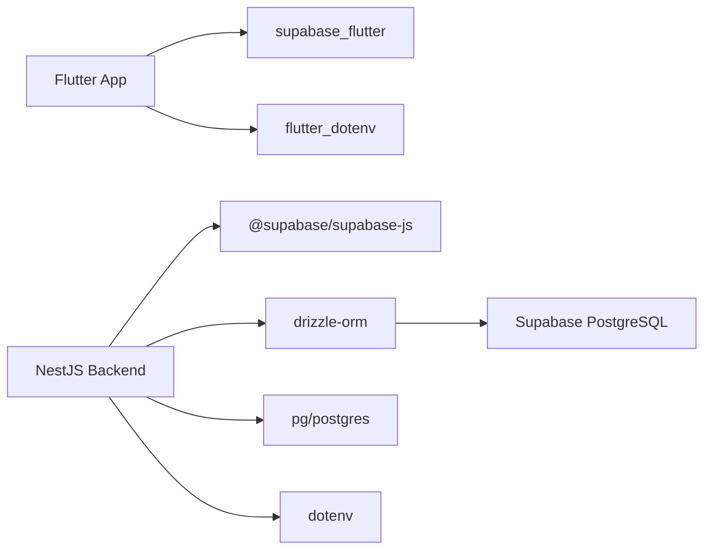

# Deployment & DevOps
**Last Updated: 2026-04-20 12:46:08**

<cite>
**Referenced Files in This Document**
- [backend/package.json](file://backend/package.json)
- [backend/nest-cli.json](file://backend/nest-cli.json)
- [backend/.env.example](file://backend/.env.example)
- [backend/vercel.json](file://backend/vercel.json)
- [backend/src/main.ts](file://backend/src/main.ts)
- [backend/src/app.module.ts](file://backend/src/app.module.ts)
- [backend/src/common/middleware/tenant.middleware.ts](file://backend/src/common/middleware/tenant.middleware.ts)
- [backend/src/supabase/supabase.module.ts](file://backend/src/supabase/supabase.module.ts)
- [backend/src/supabase/supabase.service.ts](file://backend/src/supabase/supabase.service.ts)
- [backend/src/db/db.ts](file://backend/src/db/db.ts)
- [backend/drizzle.config.ts](file://backend/drizzle.config.ts)
- [backend/src/db/schema.ts](file://backend/src/db/schema.ts)
- [.env.example](file://.env.example)
- [pubspec.yaml](file://pubspec.yaml)
- [vercel.json](file://vercel.json)
- [PRD/prd_deployment.md](file://PRD/prd_deployment.md)
- [PRD/prd_monitoring.md](file://PRD/prd_monitoring.md)
- [supabase/migrations/README.md](file://supabase/migrations/README.md)
</cite>

## Table of Contents
1. [Introduction](#introduction)
2. [Project Structure](#project-structure)
3. [Core Components](#core-components)
4. [Architecture Overview](#architecture-overview)
5. [Detailed Component Analysis](#detailed-component-analysis)
6. [Dependency Analysis](#dependency-analysis)
7. [Performance Considerations](#performance-considerations)
8. [Troubleshooting Guide](#troubleshooting-guide)
9. [Conclusion](#conclusion)
10. [Appendices](#appendices)

## Introduction
This document provides comprehensive deployment and DevOps guidance for ZerpAI ERP. It covers build configuration for Flutter and NestJS, environment setup, Vercel deployment for the frontend, backend hosting options, database configuration with Supabase and Drizzle, CI/CD pipeline setup, automated testing, release management, monitoring and alerting, logging strategies, performance monitoring, disaster recovery, backup strategies, maintenance schedules, environment-specific configuration management, secrets handling, scaling considerations, security hardening, SSL/TLS configuration, and load balancing setup.

## Project Structure
ZerpAI ERP consists of:
- Flutter web frontend under the repository root, configured to build to build/web and deploy via Vercel.
- NestJS backend under backend/, built with TypeScript, using Drizzle ORM and Supabase for database operations.
- Supabase migrations under supabase/migrations/ for schema initialization and seed data.
- PRD documents under PRD/ detailing deployment, release management, and monitoring.

**Diagram sources**
- [vercel.json](file://vercel.json#L1-L12)
- [backend/src/main.ts](file://backend/src/main.ts#L1-L56)
- [backend/src/app.module.ts](file://backend/src/app.module.ts#L1-L20)
- [backend/src/common/middleware/tenant.middleware.ts](file://backend/src/common/middleware/tenant.middleware.ts#L1-L70)
- [backend/src/supabase/supabase.module.ts](file://backend/src/supabase/supabase.module.ts#L1-L12)
- [backend/src/supabase/supabase.service.ts](file://backend/src/supabase/supabase.service.ts#L1-L32)
- [backend/src/db/db.ts](file://backend/src/db/db.ts#L1-L13)
- [backend/drizzle.config.ts](file://backend/drizzle.config.ts#L1-L16)
- [backend/src/db/schema.ts](file://backend/src/db/schema.ts#L1-L293)

**Section sources**
- [vercel.json](file://vercel.json#L1-L12)
- [backend/src/main.ts](file://backend/src/main.ts#L1-L56)
- [backend/src/app.module.ts](file://backend/src/app.module.ts#L1-L20)
- [backend/src/common/middleware/tenant.middleware.ts](file://backend/src/common/middleware/tenant.middleware.ts#L1-L70)
- [backend/src/supabase/supabase.module.ts](file://backend/src/supabase/supabase.module.ts#L1-L12)
- [backend/src/supabase/supabase.service.ts](file://backend/src/supabase/supabase.service.ts#L1-L32)
- [backend/src/db/db.ts](file://backend/src/db/db.ts#L1-L13)
- [backend/drizzle.config.ts](file://backend/drizzle.config.ts#L1-L16)
- [backend/src/db/schema.ts](file://backend/src/db/schema.ts#L1-L293)

## Core Components
- Frontend build and deployment:
  - Flutter builds to build/web and deploys via Vercel using vercel.json.
  - Environment variables are loaded via .env and assets configuration in pubspec.yaml.
- Backend build and deployment:
  - NestJS project with TypeScript, compiled via Nest CLI and deployed to Vercel Node builder.
  - Environment variables managed via .env.example and runtime configuration.
- Database:
  - Supabase-backed PostgreSQL with Drizzle ORM for schema definition and migrations.
  - Supabase client initialized with service role key for admin operations.
- Middleware and tenant isolation:
  - Tenant middleware injects organization/branch context; development bypass is present pending production auth implementation.

**Section sources**
- [pubspec.yaml](file://pubspec.yaml#L1-L128)
- [backend/package.json](file://backend/package.json#L1-L79)
- [backend/nest-cli.json](file://backend/nest-cli.json#L1-L12)
- [backend/.env.example](file://backend/.env.example#L1-L40)
- [backend/vercel.json](file://backend/vercel.json#L1-L18)
- [backend/src/main.ts](file://backend/src/main.ts#L1-L56)
- [backend/src/supabase/supabase.service.ts](file://backend/src/supabase/supabase.service.ts#L1-L32)
- [backend/src/db/db.ts](file://backend/src/db/db.ts#L1-L13)
- [backend/drizzle.config.ts](file://backend/drizzle.config.ts#L1-L16)
- [backend/src/db/schema.ts](file://backend/src/db/schema.ts#L1-L293)
- [backend/src/common/middleware/tenant.middleware.ts](file://backend/src/common/middleware/tenant.middleware.ts#L1-L70)

## Architecture Overview
The system follows a modern cloud-native architecture:
- Frontend (Flutter web) served statically via Vercel.
- Backend (NestJS) serverless on Vercel Node builder.
- Database (Supabase) managed externally; backend connects via DATABASE_URL and uses Supabase service role key for privileged operations.
- CI/CD via GitHub Actions for both frontend and backend, with automated testing and coverage reporting.

**Diagram sources**
- [vercel.json](file://vercel.json#L1-L12)
- [backend/vercel.json](file://backend/vercel.json#L1-L18)
- [backend/src/main.ts](file://backend/src/main.ts#L1-L56)

**Section sources**
- [PRD/prd_deployment.md](file://PRD/prd_deployment.md#L15-L122)
- [backend/vercel.json](file://backend/vercel.json#L1-L18)
- [vercel.json](file://vercel.json#L1-L12)

## Detailed Component Analysis

### Frontend Build and Vercel Deployment (Flutter)
- Build target: build/web.
- Static file serving via Vercel with vercel.json.
- Environment variables loaded at runtime via .env and Flutter dotenv support.

**Diagram sources**
- [vercel.json](file://vercel.json#L1-L12)
- [pubspec.yaml](file://pubspec.yaml#L1-L128)

**Section sources**
- [vercel.json](file://vercel.json#L1-L12)
- [pubspec.yaml](file://pubspec.yaml#L1-L128)

### Backend Build and Vercel Deployment (NestJS)
- NestJS build and watch scripts defined in package.json.
- Vercel Node builder configured to serve src/main.ts.
- Environment variables loaded via dotenv in main.ts and drizzle config.

**Diagram sources**
- [PRD/prd_deployment.md](file://PRD/prd_deployment.md#L84-L121)
- [backend/vercel.json](file://backend/vercel.json#L1-L18)
- [backend/package.json](file://backend/package.json#L1-L79)

**Section sources**
- [backend/package.json](file://backend/package.json#L1-L79)
- [backend/vercel.json](file://backend/vercel.json#L1-L18)
- [PRD/prd_deployment.md](file://PRD/prd_deployment.md#L15-L122)

### Database Configuration (Supabase + Drizzle)
- Connection string sourced from DATABASE_URL.
- Drizzle ORM schema defined in schema.ts with enums and tables.
- Drizzle config reads DATABASE_URL for migrations and schema generation.

**Diagram sources**
- [backend/src/supabase/supabase.service.ts](file://backend/src/supabase/supabase.service.ts#L1-L32)
- [backend/src/db/db.ts](file://backend/src/db/db.ts#L1-L13)
- [backend/drizzle.config.ts](file://backend/drizzle.config.ts#L1-L16)
- [backend/src/db/schema.ts](file://backend/src/db/schema.ts#L1-L293)

**Section sources**
- [backend/src/db/db.ts](file://backend/src/db/db.ts#L1-L13)
- [backend/drizzle.config.ts](file://backend/drizzle.config.ts#L1-L16)
- [backend/src/db/schema.ts](file://backend/src/db/schema.ts#L1-L293)
- [supabase/migrations/README.md](file://supabase/migrations/README.md#L1-L48)

### Middleware and Tenant Isolation
- Tenant middleware attaches org/branch context to requests.
- Development bypass exists; production auth is commented and requires JWT verification and role extraction.

**Diagram sources**
- [backend/src/common/middleware/tenant.middleware.ts](file://backend/src/common/middleware/tenant.middleware.ts#L1-L70)

**Section sources**
- [backend/src/common/middleware/tenant.middleware.ts](file://backend/src/common/middleware/tenant.middleware.ts#L1-L70)

### Environment Setup and Secrets Management
- Backend environment variables include database URL, Supabase keys, JWT secret, CORS origins, API prefix, Cloudflare R2 storage, and frontend/backend URLs.
- Frontend environment variables include API base URL, Supabase keys, environment, feature flags, cache settings, timeouts, and logging preferences.
- Secrets handling:
  - Store sensitive keys in Vercel project settings and environment variables.
  - Do not commit .env or .env.local to version control.

**Section sources**
- [backend/.env.example](file://backend/.env.example#L1-L40)
- [.env.example](file://.env.example#L1-L68)

### CI/CD Pipeline Setup
- GitHub Actions workflows for Flutter and NestJS:
  - Flutter CI: format check, analyze, tests with coverage, upload coverage, build web release.
  - NestJS CI: format check, lint, tests with coverage, security audit, build.
- Release process:
  - Pre-release checklist, versioning with semantic versioning, Git tagging, PR to main, manual approval, database migrations (manual approval), Vercel auto-deploy, health checks, monitoring.

**Diagram sources**
- [PRD/prd_deployment.md](file://PRD/prd_deployment.md#L15-L42)
- [PRD/prd_deployment.md](file://PRD/prd_deployment.md#L44-L121)

**Section sources**
- [PRD/prd_deployment.md](file://PRD/prd_deployment.md#L15-L42)
- [PRD/prd_deployment.md](file://PRD/prd_deployment.md#L44-L121)

### Monitoring and Alerting
- Tools: Sentry (errors), Vercel Analytics (performance), UptimeRobot (uptime), Vercel Logs (logs), Google Analytics 4 (business metrics).
- Metrics and thresholds for error rate, API response time, page load time, and database queries.
- Health check endpoint: GET /api/health.
- Alerting: Slack alerts for error spikes and performance thresholds; PagerDuty for critical incidents.

**Section sources**
- [PRD/prd_monitoring.md](file://PRD/prd_monitoring.md#L1-L181)

### Disaster Recovery and Backup Strategies
- Database migrations require rollback scripts; rollback tested in staging before production.
- Post-rollback actions include notifications, incident report, post-mortem, and checklist updates.
- Recommended: regular database backups via Supabase snapshot/backup features and versioned migration scripts.

**Section sources**
- [PRD/prd_deployment.md](file://PRD/prd_deployment.md#L357-L424)

### Maintenance Schedules
- Daily: check error dashboard.
- Weekly: review performance trends.
- Monthly: deep dive on metrics and action items.
- Quarterly: review alerting rules and update thresholds.

**Section sources**
- [PRD/prd_monitoring.md](file://PRD/prd_monitoring.md#L170-L176)

### Scaling Considerations
- Horizontal scaling: Vercel’s autoscaling handles frontend and backend Node instances.
- Database scaling: leverage Supabase managed PostgreSQL scaling and read replicas as needed.
- Caching: implement Redis caching for frequently accessed data and API responses.
- CDN: serve static assets via Vercel CDN.

**Section sources**
- [PRD/prd_monitoring.md](file://PRD/prd_monitoring.md#L150-L167)

### Security Hardening, SSL/TLS, and Load Balancing
- SSL/TLS: Vercel provides managed TLS termination; enforce HTTPS in frontend and backend.
- CORS: configured in backend main.ts for allowed origins and headers.
- JWT: implement JWT verification in tenant middleware (currently development bypass).
- Secrets: store in Vercel environment variables; rotate keys periodically.
- Load balancing: Vercel distributes traffic globally; ensure backend endpoints are stateless.

**Section sources**
- [backend/src/main.ts](file://backend/src/main.ts#L13-L24)
- [backend/src/common/middleware/tenant.middleware.ts](file://backend/src/common/middleware/tenant.middleware.ts#L41-L67)

## Dependency Analysis
- Frontend depends on Flutter SDK, supabase_flutter, flutter_dotenv, and other UI/storage utilities.
- Backend depends on NestJS, @supabase/supabase-js, drizzle-orm, pg/postgres, and dotenv.
- Database dependencies: Supabase managed PostgreSQL with Drizzle ORM.

**Diagram sources**
- [pubspec.yaml](file://pubspec.yaml#L1-L128)
- [backend/package.json](file://backend/package.json#L1-L79)

**Section sources**
- [pubspec.yaml](file://pubspec.yaml#L1-L128)
- [backend/package.json](file://backend/package.json#L1-L79)

## Performance Considerations
- Optimize database queries, add indexes, and avoid N+1 queries.
- Implement caching (Redis) for repeated reads.
- Compress images and use CDN for static assets.
- Monitor API p95 latency and page load times; alert on regressions.

**Section sources**
- [PRD/prd_monitoring.md](file://PRD/prd_monitoring.md#L150-L167)

## Troubleshooting Guide
- CI build failing:
  - Check GitHub Actions logs, run local builds, resolve dependency conflicts.
- Migration fails in production:
  - Inspect Vercel migration logs, manually verify schema, rollback migration, fix script, redeploy.
- Vercel deployment stuck:
  - Check Vercel status, cancel and retry, contact support if persistent.

**Section sources**
- [PRD/prd_deployment.md](file://PRD/prd_deployment.md#L608-L637)

## Conclusion
ZerpAI ERP leverages Vercel for scalable frontend and backend hosting, Supabase for managed PostgreSQL, and Drizzle ORM for schema management. The documented CI/CD pipeline, monitoring stack, and release management processes provide a robust foundation for reliable deployments. Strengthening tenant authentication, implementing Redis caching, and enforcing JWT-based authorization will further enhance security and performance.

## Appendices

### Environment Variables Reference
- Backend (.env.example):
  - DATABASE_URL, SUPABASE_URL, SUPABASE_ANON_KEY, SUPABASE_SERVICE_ROLE_KEY, JWT_SECRET, PORT, NODE_ENV, CORS_ORIGIN, API_PREFIX, API_VERSION, CLOUDFLARE_* keys, FRONTEND_URL, BACKEND_URL.
- Frontend (.env.example):
  - API_BASE_URL, SUPABASE_URL, SUPABASE_ANON_KEY, SUPABASE_SERVICE_ROLE_KEY, ENVIRONMENT, ENABLE_OFFLINE_MODE, ENABLE_DEBUG_LOGGING, ENABLE_PERFORMANCE_MONITORING, DEV_ORG_ID, DEV_branch_id, R2_ENDPOINT, R2_ACCESS_KEY_ID, R2_SECRET_ACCESS_KEY, R2_BUCKET_NAME, CACHE_STALENESS_HOURS, MAX_CACHE_SIZE_MB, API_CONNECT_TIMEOUT, API_RECEIVE_TIMEOUT, LOG_LEVEL, ENABLE_STRUCTURED_LOGGING.

**Section sources**
- [backend/.env.example](file://backend/.env.example#L1-L40)
- [.env.example](file://.env.example#L1-L68)