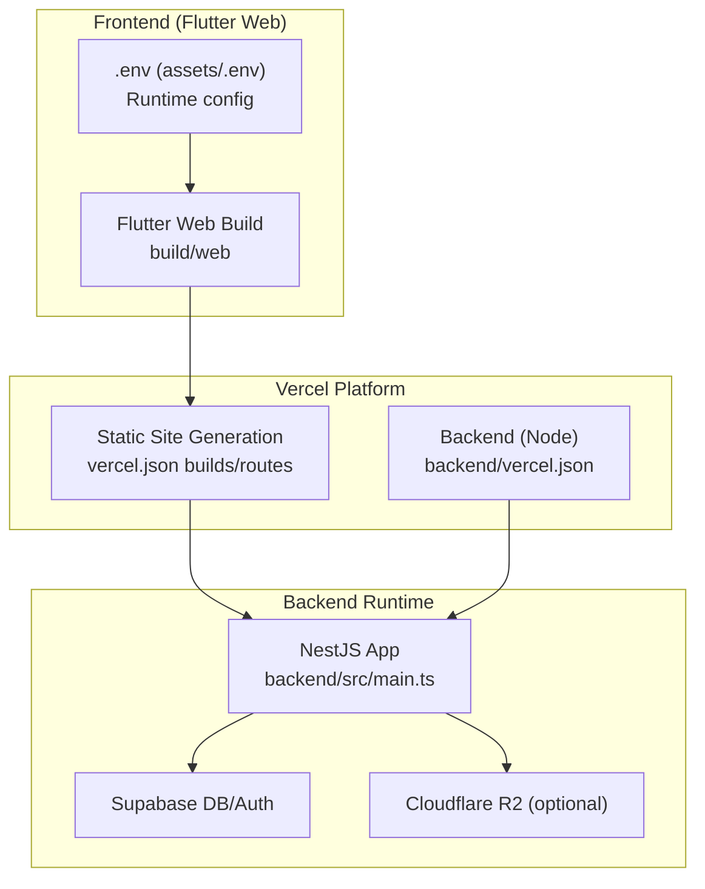
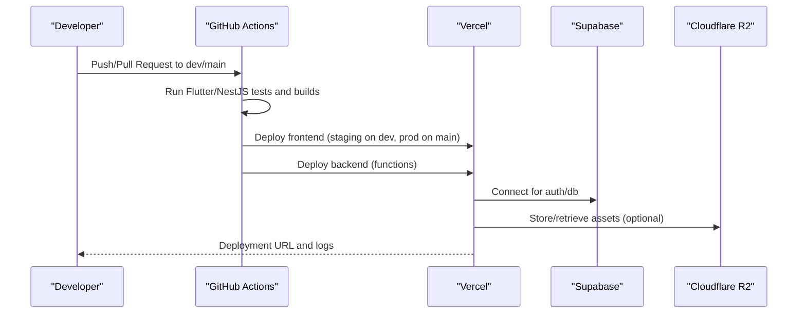
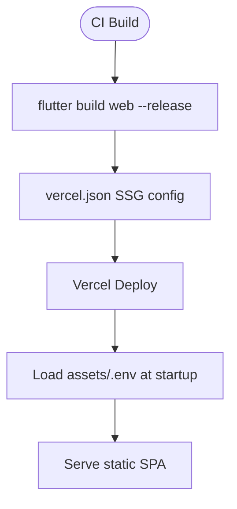
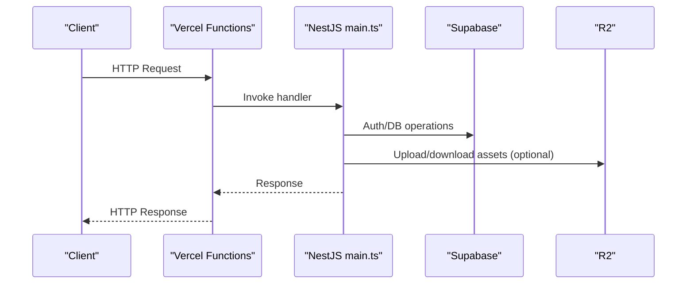
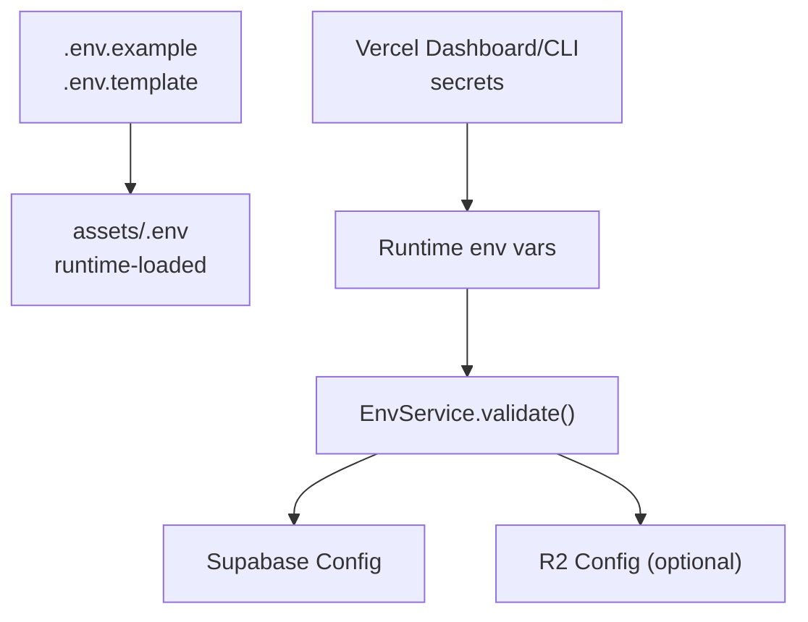
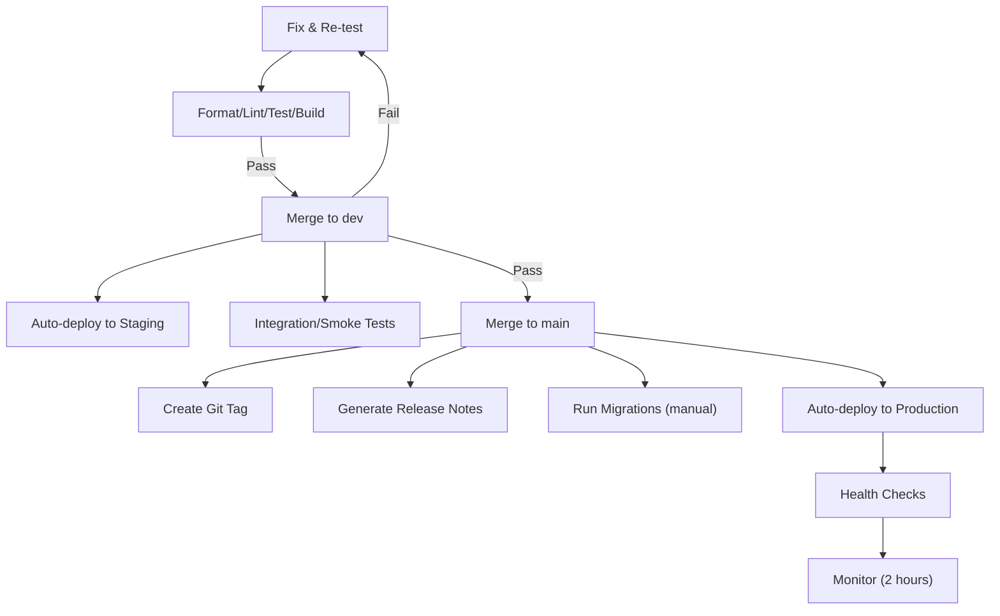
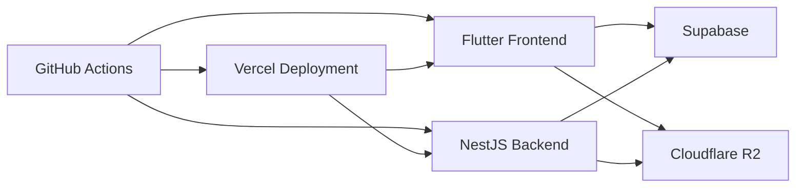

# Deployment Strategies

<cite>
**Referenced Files in This Document**
- [vercel.json](file://vercel.json)
- [backend/vercel.json](file://backend/vercel.json)
- [PRD/prd_deployment.md](file://PRD/prd_deployment.md)
- [VERCEL_DEPLOY.md](file://VERCEL_DEPLOY.md)
- [backend/.env.example](file://backend/.env.example)
- [.env.example](file://.env.example)
- [backend/package.json](file://backend/package.json)
- [pubspec.yaml](file://pubspec.yaml)
- [backend/src/main.ts](file://backend/src/main.ts)
- [lib/shared/services/env_service.dart](file://lib/shared/services/env_service.dart)
- [lib/main.dart](file://lib/main.dart)
- [web/index.html](file://web/index.html)
</cite>

## Table of Contents
1. [Introduction](#introduction)
2. [Project Structure](#project-structure)
3. [Core Components](#core-components)
4. [Architecture Overview](#architecture-overview)
5. [Detailed Component Analysis](#detailed-component-analysis)
6. [Dependency Analysis](#dependency-analysis)
7. [Performance Considerations](#performance-considerations)
8. [Troubleshooting Guide](#troubleshooting-guide)
9. [Conclusion](#conclusion)
10. [Appendices](#appendices)

## Introduction
This document provides a comprehensive deployment strategy for ZerpAI ERP, covering the Flutter frontend deployment on Vercel, backend deployment options, environment variable management, and the end-to-end CI/CD pipeline from development to production. It also outlines multi-environment strategies, rollback procedures, domain and SSL configuration, and load balancing considerations.

## Project Structure
ZerpAI ERP consists of:
- Flutter frontend (web) served statically via Vercel
- NestJS backend deployed via Vercel Functions or serverless
- Supabase for authentication and database
- Optional Cloudflare R2 for object storage
- GitHub Actions-based CI/CD pipeline

**Diagram sources**
- [vercel.json](file://vercel.json#L1-L12)
- [backend/vercel.json](file://backend/vercel.json#L1-L18)
- [backend/src/main.ts](file://backend/src/main.ts#L1-L56)
- [lib/main.dart](file://lib/main.dart#L1-L29)

**Section sources**
- [vercel.json](file://vercel.json#L1-L12)
- [backend/vercel.json](file://backend/vercel.json#L1-L18)
- [pubspec.yaml](file://pubspec.yaml#L1-L128)
- [backend/src/main.ts](file://backend/src/main.ts#L1-L56)
- [lib/main.dart](file://lib/main.dart#L1-L29)

## Core Components
- Static frontend deployment via Vercel with SSG configuration and route handling
- Backend deployment via Vercel Functions using Node builder
- Environment variable management for both frontend and backend
- CI/CD pipeline with automated testing, staging, and production deployment
- Supabase integration for authentication and database
- Optional Cloudflare R2 for media/image storage

**Section sources**
- [vercel.json](file://vercel.json#L1-L12)
- [backend/vercel.json](file://backend/vercel.json#L1-L18)
- [.env.example](file://.env.example#L1-L68)
- [backend/.env.example](file://backend/.env.example#L1-L40)
- [PRD/prd_deployment.md](file://PRD/prd_deployment.md#L15-L42)

## Architecture Overview
The deployment architecture integrates frontend and backend on Vercel, with Supabase and optional R2 for storage. The CI/CD pipeline automates quality gates and deploys to staging and production environments.

**Diagram sources**
- [PRD/prd_deployment.md](file://PRD/prd_deployment.md#L17-L42)
- [backend/vercel.json](file://backend/vercel.json#L1-L18)
- [vercel.json](file://vercel.json#L1-L12)

## Detailed Component Analysis

### Vercel Frontend Deployment (Flutter Web)
- Static site generation configuration:
  - Builds: Uses a static builder for the Flutter web output directory
  - Routes: Generic catch-all route forwarding
  - Output directory: build/web
  - Framework: Explicitly set to none for Flutter
- Environment variables:
  - Loaded at runtime from assets/.env during app initialization
  - Required keys validated by EnvService
- Base href and routing:
  - index.html uses a placeholder base href suitable for Vercel’s routing
- Build command:
  - Flutter build web --release performed in CI

**Diagram sources**
- [vercel.json](file://vercel.json#L1-L12)
- [web/index.html](file://web/index.html#L17)
- [lib/main.dart](file://lib/main.dart#L20-L25)
- [lib/shared/services/env_service.dart](file://lib/shared/services/env_service.dart#L1-L72)

**Section sources**
- [vercel.json](file://vercel.json#L1-L12)
- [web/index.html](file://web/index.html#L17)
- [lib/main.dart](file://lib/main.dart#L20-L25)
- [lib/shared/services/env_service.dart](file://lib/shared/services/env_service.dart#L1-L72)
- [PRD/prd_deployment.md](file://PRD/prd_deployment.md#L46-L82)

### Backend Deployment (NestJS on Vercel Functions)
- Builder and routes:
  - Node builder configured for src/main.ts
  - Catch-all route forwards to the entrypoint
- Environment:
  - NODE_ENV set to production
- CORS and validation:
  - CORS enabled for development and production origins
  - Global validation pipe with detailed error logging
- Supabase and R2 integration:
  - Supabase URL and keys configured via environment
  - Optional R2 configuration supported

**Diagram sources**
- [backend/vercel.json](file://backend/vercel.json#L1-L18)
- [backend/src/main.ts](file://backend/src/main.ts#L1-L56)
- [backend/.env.example](file://backend/.env.example#L1-L40)

**Section sources**
- [backend/vercel.json](file://backend/vercel.json#L1-L18)
- [backend/src/main.ts](file://backend/src/main.ts#L13-L46)
- [backend/.env.example](file://backend/.env.example#L1-L40)

### Environment Variable Management and Secrets
- Frontend:
  - .env loaded from assets/.env at runtime
  - Keys validated by EnvService
  - Example template in .env.example
- Backend:
  - Supabase and R2 configuration via environment variables
  - Example template in backend/.env.example
- Vercel:
  - Environment variables managed via Vercel dashboard or CLI
  - Secrets stored securely on Vercel platform

**Diagram sources**
- [.env.example](file://.env.example#L1-L68)
- [lib/shared/services/env_service.dart](file://lib/shared/services/env_service.dart#L48-L70)
- [lib/main.dart](file://lib/main.dart#L20-L25)
- [backend/.env.example](file://backend/.env.example#L1-L40)
- [VERCEL_DEPLOY.md](file://VERCEL_DEPLOY.md#L33-L46)

**Section sources**
- [.env.example](file://.env.example#L1-L68)
- [lib/shared/services/env_service.dart](file://lib/shared/services/env_service.dart#L1-L72)
- [lib/main.dart](file://lib/main.dart#L20-L25)
- [backend/.env.example](file://backend/.env.example#L1-L40)
- [VERCEL_DEPLOY.md](file://VERCEL_DEPLOY.md#L33-L46)

### CI/CD Pipeline and Deployment Triggers
- Stages:
  - PR checks: format, analyze, tests, coverage
  - Merge to dev: deploy to staging, integration and smoke tests
  - Merge to main: create tag, generate release notes, run migrations (manual), deploy to production, health checks, monitor
- Workflows:
  - Flutter CI workflow for web builds and tests
  - NestJS CI workflow for backend builds and tests
- Versioning:
  - Semantic versioning with automatic tagging on main merges

**Diagram sources**
- [PRD/prd_deployment.md](file://PRD/prd_deployment.md#L17-L42)
- [PRD/prd_deployment.md](file://PRD/prd_deployment.md#L222-L339)

**Section sources**
- [PRD/prd_deployment.md](file://PRD/prd_deployment.md#L17-L42)
- [PRD/prd_deployment.md](file://PRD/prd_deployment.md#L222-L339)

### Multi-Environment Deployment Strategies
- Development (local):
  - Local Supabase instance, hot reload, debug logging, mock data
- Staging (Vercel Preview):
  - Separate Supabase staging database, anonymized data, analytics and Sentry in test mode
  - Auto-deploy on merge to dev
- Production (Vercel):
  - Production Supabase database, full analytics and Sentry, all security measures
  - Manual merge to main with approvals required

**Section sources**
- [PRD/prd_deployment.md](file://PRD/prd_deployment.md#L125-L170)

### Rollback Procedures
- Immediate rollback triggers:
  - Error rate > threshold, critical feature failure, data corruption, security vulnerability
- Application rollback (Vercel):
  - Dashboard or CLI promotion of previous stable deployment
- Database migration rollback:
  - Rollback scripts executed and verified in staging prior to production
- Post-rollback actions:
  - User notification, incident report, post-mortem, root cause fix, checklist updates

**Section sources**
- [PRD/prd_deployment.md](file://PRD/prd_deployment.md#L357-L424)

### Domain Configuration, SSL, and Load Balancing
- Domains and URLs:
  - Frontend URL and backend URL configured in Vercel and .env
  - Example URLs documented in deployment guide
- SSL:
  - Vercel provides free TLS termination; ensure DNS records point to Vercel
- Load balancing:
  - Vercel’s global edge network distributes traffic; no manual load balancer required
- CORS:
  - Backend enables CORS for development and production origins; ensure frontend origin matches

**Section sources**
- [VERCEL_DEPLOY.md](file://VERCEL_DEPLOY.md#L10-L11)
- [VERCEL_DEPLOY.md](file://VERCEL_DEPLOY.md#L33-L46)
- [backend/.env.example](file://backend/.env.example#L23)
- [backend/src/main.ts](file://backend/src/main.ts#L19-L24)

## Dependency Analysis
- Frontend depends on:
  - Supabase for auth and database
  - Optional R2 for assets
- Backend depends on:
  - Supabase for auth and database
  - Optional R2 for assets
- CI/CD depends on:
  - GitHub Actions workflows for Flutter and NestJS
  - Vercel for deployment and environment management

**Diagram sources**
- [backend/src/main.ts](file://backend/src/main.ts#L1-L56)
- [lib/main.dart](file://lib/main.dart#L22-L25)
- [backend/.env.example](file://backend/.env.example#L1-L40)
- [PRD/prd_deployment.md](file://PRD/prd_deployment.md#L17-L42)

**Section sources**
- [backend/src/main.ts](file://backend/src/main.ts#L1-L56)
- [lib/main.dart](file://lib/main.dart#L22-L25)
- [backend/.env.example](file://backend/.env.example#L1-L40)
- [PRD/prd_deployment.md](file://PRD/prd_deployment.md#L17-L42)

## Performance Considerations
- Optimize Flutter build for production and enable compression on Vercel
- Minimize backend cold starts by keeping functions lean and preloading dependencies
- Use Supabase connection pooling and R2 for efficient asset delivery
- Monitor Vercel Analytics and Sentry for performance regressions

[No sources needed since this section provides general guidance]

## Troubleshooting Guide
- CI build failing:
  - Check GitHub Actions logs, reproduce locally with flutter build web or npm run build
  - Resolve dependency conflicts
- Migration fails in production:
  - Inspect migration logs in Vercel, rollback migration, fix script, redeploy
- Vercel deployment stuck:
  - Check Vercel status, cancel and retry, contact support if persistent
- API requests failing:
  - Verify backend URL environment variables and CORS configuration

**Section sources**
- [PRD/prd_deployment.md](file://PRD/prd_deployment.md#L608-L637)
- [VERCEL_DEPLOY.md](file://VERCEL_DEPLOY.md#L88-L107)

## Conclusion
ZerpAI ERP follows a robust, automated deployment strategy leveraging Vercel for both frontend and backend, with Supabase and optional R2 for data and assets. The CI/CD pipeline enforces quality gates and supports safe production releases with clear rollback procedures. Proper environment variable management and domain/SSL configuration ensure secure and reliable operation across environments.

[No sources needed since this section summarizes without analyzing specific files]

## Appendices

### Appendix A: Environment Variables Quick Reference
- Frontend (.env):
  - SUPABASE_URL, SUPABASE_ANON_KEY, SUPABASE_SERVICE_ROLE_KEY, ENVIRONMENT, ENABLE_OFFLINE_MODE, LOG_LEVEL, etc.
- Backend (.env):
  - DATABASE_URL, SUPABASE_URL, SUPABASE_ANON_KEY, SUPABASE_SERVICE_ROLE_KEY, JWT_SECRET, PORT, CORS_ORIGIN, API_PREFIX, API_VERSION, CLOUDFLARE_* variables, FRONTEND_URL, BACKEND_URL

**Section sources**
- [.env.example](file://.env.example#L1-L68)
- [backend/.env.example](file://backend/.env.example#L1-L40)

### Appendix B: Vercel Deployment Commands
- Deploy to preview or production
- View logs and list deployments
- Force rebuild to clear cache

**Section sources**
- [VERCEL_DEPLOY.md](file://VERCEL_DEPLOY.md#L69-L86)