# Monitoring & Maintenance
**Last Updated: 2026-04-20 12:46:08**

<cite>
**Referenced Files in This Document**
- [prd_monitoring.md](file://PRD/prd_monitoring.md)
- [prd_disaster_recovery.md](file://PRD/prd_disaster_recovery.md)
- [app_logger.dart](file://lib/core/logging/app_logger.dart)
- [main.ts](file://backend/src/main.ts)
- [app.module.ts](file://backend/src/app.module.ts)
- [tenant.middleware.ts](file://backend/src/common/middleware/tenant.middleware.ts)
- [supabase.service.ts](file://backend/src/supabase/supabase.service.ts)
- [db.ts](file://backend/src/db/db.ts)
- [schema.ts](file://backend/src/db/schema.ts)
- [products.controller.ts](file://backend/src/products/products.controller.ts)
- [sales.controller.ts](file://backend/src/sales/sales.controller.ts)
- [.env.example](file://backend/.env.example)
- [vercel.json](file://vercel.json)
- [001_initial_schema_and_seed.sql](file://supabase/migrations/001_initial_schema_and_seed.sql)
- [drizzle.config.ts](file://backend/drizzle.config.ts)
- [package.json](file://backend/package.json)
</cite>

## Table of Contents
1. [Introduction](#introduction)
2. [Project Structure](#project-structure)
3. [Core Components](#core-components)
4. [Architecture Overview](#architecture-overview)
5. [Detailed Component Analysis](#detailed-component-analysis)
6. [Dependency Analysis](#dependency-analysis)
7. [Performance Considerations](#performance-considerations)
8. [Troubleshooting Guide](#troubleshooting-guide)
9. [Conclusion](#conclusion)
10. [Appendices](#appendices)

## Introduction
This document provides comprehensive monitoring and maintenance guidance for ZerpAI ERP. It covers application monitoring setup (performance metrics, error tracking, health checks), logging strategies and alerting, database monitoring and optimization, maintenance procedures, disaster recovery and business continuity, incident response, and operational processes such as maintenance schedules and change management.

## Project Structure
ZerpAI ERP consists of:
- Flutter/Dart frontend (UI and logging utilities)
- NestJS backend (REST API, middleware, database integration)
- Supabase-managed PostgreSQL database
- Vercel deployment for frontend and static assets
- PRD-driven monitoring and DR plans

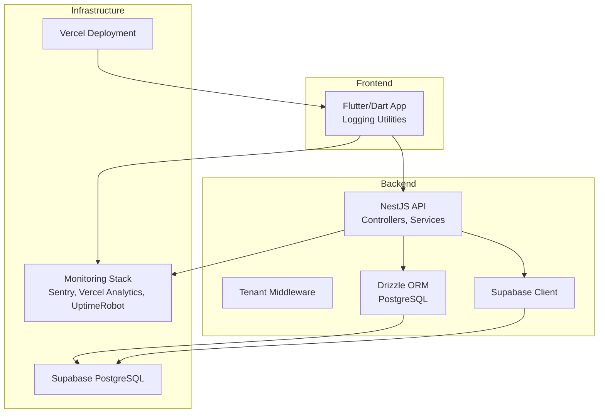

**Diagram sources**
- [app_logger.dart](file://lib/core/logging/app_logger.dart#L1-L218)
- [main.ts](file://backend/src/main.ts#L1-L56)
- [app.module.ts](file://backend/src/app.module.ts#L1-L20)
- [tenant.middleware.ts](file://backend/src/common/middleware/tenant.middleware.ts#L1-L70)
- [supabase.service.ts](file://backend/src/supabase/supabase.service.ts#L1-L32)
- [db.ts](file://backend/src/db/db.ts#L1-L13)
- [schema.ts](file://backend/src/db/schema.ts#L1-L293)
- [vercel.json](file://vercel.json#L1-L12)
- [prd_monitoring.md](file://PRD/prd_monitoring.md#L1-L181)

**Section sources**
- [app_logger.dart](file://lib/core/logging/app_logger.dart#L1-L218)
- [main.ts](file://backend/src/main.ts#L1-L56)
- [app.module.ts](file://backend/src/app.module.ts#L1-L20)
- [tenant.middleware.ts](file://backend/src/common/middleware/tenant.middleware.ts#L1-L70)
- [supabase.service.ts](file://backend/src/supabase/supabase.service.ts#L1-L32)
- [db.ts](file://backend/src/db/db.ts#L1-L13)
- [schema.ts](file://backend/src/db/schema.ts#L1-L293)
- [vercel.json](file://vercel.json#L1-L12)
- [prd_monitoring.md](file://PRD/prd_monitoring.md#L1-L181)

## Core Components
- Monitoring stack: Sentry (errors), Vercel Analytics (performance), UptimeRobot (uptime), Vercel Logs (logs), GA4 (business metrics)
- Health endpoint: GET /api/health
- Logging: Structured JSON logs with levels and context
- Database: Drizzle ORM with Supabase PostgreSQL; migration and indexing strategy
- Middleware: Tenant-aware middleware with test-mode bypass
- Controllers: Products and Sales APIs with logging hooks

**Section sources**
- [prd_monitoring.md](file://PRD/prd_monitoring.md#L11-L181)
- [app_logger.dart](file://lib/core/logging/app_logger.dart#L1-L218)
- [db.ts](file://backend/src/db/db.ts#L1-L13)
- [schema.ts](file://backend/src/db/schema.ts#L123-L135)
- [tenant.middleware.ts](file://backend/src/common/middleware/tenant.middleware.ts#L24-L40)
- [products.controller.ts](file://backend/src/products/products.controller.ts#L32-L44)
- [sales.controller.ts](file://backend/src/sales/sales.controller.ts#L18-L33)

## Architecture Overview
The monitoring and maintenance architecture integrates frontend and backend telemetry with external observability platforms and internal health checks.

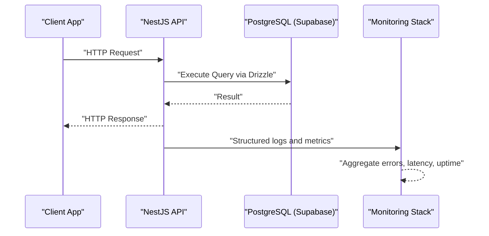

**Diagram sources**
- [main.ts](file://backend/src/main.ts#L26-L42)
- [db.ts](file://backend/src/db/db.ts#L10-L12)
- [prd_monitoring.md](file://PRD/prd_monitoring.md#L48-L67)

## Detailed Component Analysis

### Monitoring Stack and Health Checks
- Tools: Sentry (errors), Vercel Analytics (performance), UptimeRobot (uptime), Vercel Logs (logs), GA4 (business metrics)
- Health endpoint: GET /api/health returns status, timestamp, version, and service statuses
- Monitoring cadence: UptimeRobot pings every 5 minutes; daily error dashboard review; weekly performance trend review; monthly deep dives; quarterly alerting rule reviews

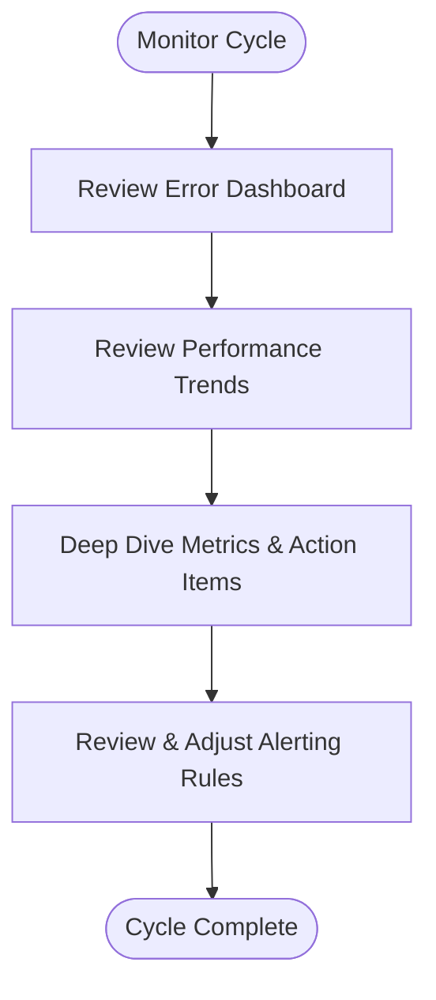

**Section sources**
- [prd_monitoring.md](file://PRD/prd_monitoring.md#L11-L181)

### Logging Strategy and Standards
- Structured JSON logs with fields: level, timestamp, service, message, context
- Log levels: DEBUG, INFO, WARN, ERROR, FATAL
- Context enrichment: org_id, user_id, correlation_id, module, data
- API request/response logging helpers
- Cache and sync operation logging
- Performance metrics logging with emoji indicators

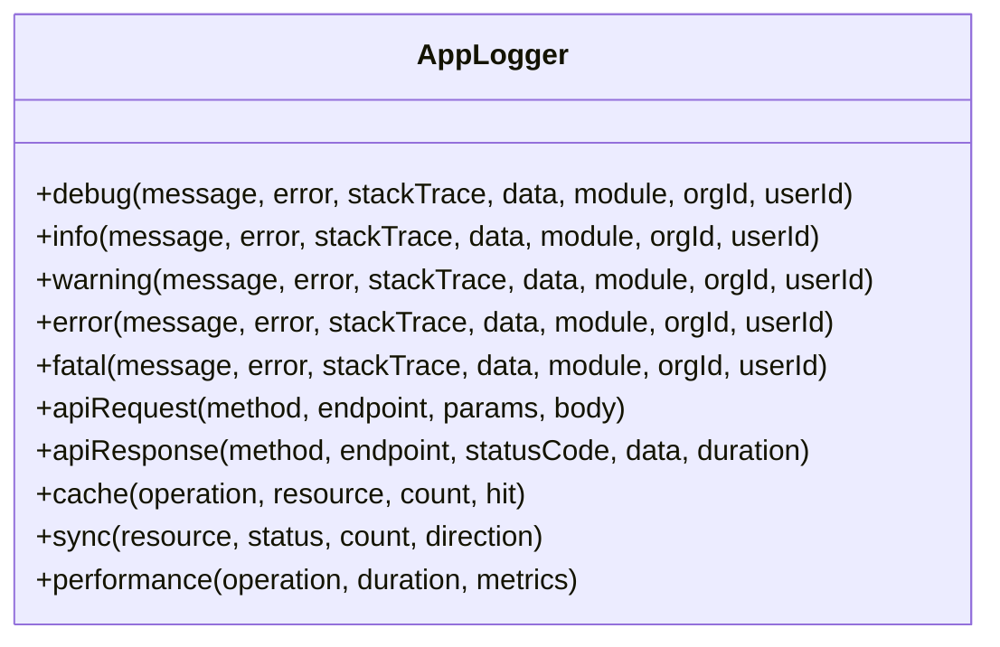

**Diagram sources**
- [app_logger.dart](file://lib/core/logging/app_logger.dart#L13-L217)

**Section sources**
- [app_logger.dart](file://lib/core/logging/app_logger.dart#L1-L218)
- [prd_monitoring.md](file://PRD/prd_monitoring.md#L88-L114)

### Error Tracking and Alerting
- Error metrics: error rate, P0 errors, affected users
- Thresholds: error rate > 10/min, P0 errors trigger on-call paging, affected users > 5%
- Alert channels: Slack #engineering for performance and deployments; PagerDuty for system down, P0, data corruption
- Business metrics: DAU, invoices/day, POS transactions/day, revenue processed, sync errors

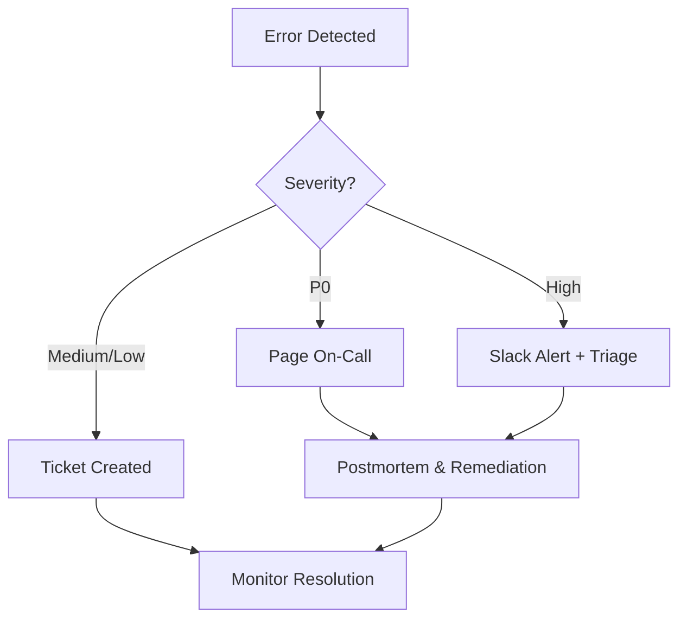

**Section sources**
- [prd_monitoring.md](file://PRD/prd_monitoring.md#L22-L85)

### Performance Monitoring and Optimization
- Performance targets: API p95 < 500ms, page load < 2s, database queries < 200ms
- Optimization triggers: sustained exceedance of thresholds, user complaints
- Optimization checklist: add indexes, implement caching, optimize N+1 queries, compress images, code splitting, CDN for static assets

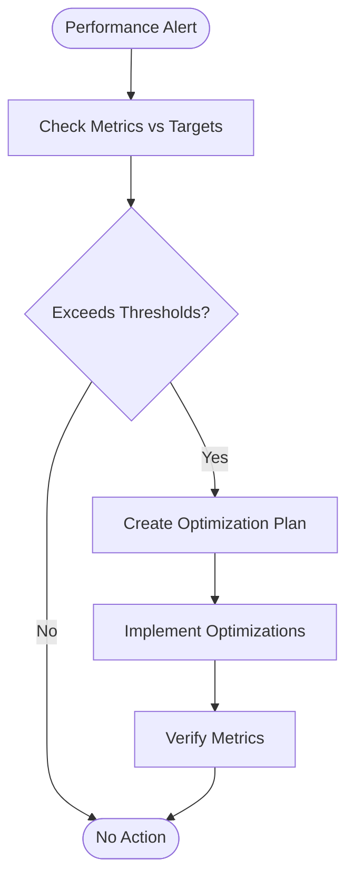

**Section sources**
- [prd_monitoring.md](file://PRD/prd_monitoring.md#L30-L167)

### Database Monitoring, Indexing, and Capacity Planning
- Database: Supabase PostgreSQL accessed via Drizzle ORM
- Indexes: presence of indexes on org/branch, type, category, vendor, selectable, item_code
- Migration tooling: Drizzle CLI configured with DATABASE_URL
- Capacity planning: align backups, PITR retention, and storage growth with business needs

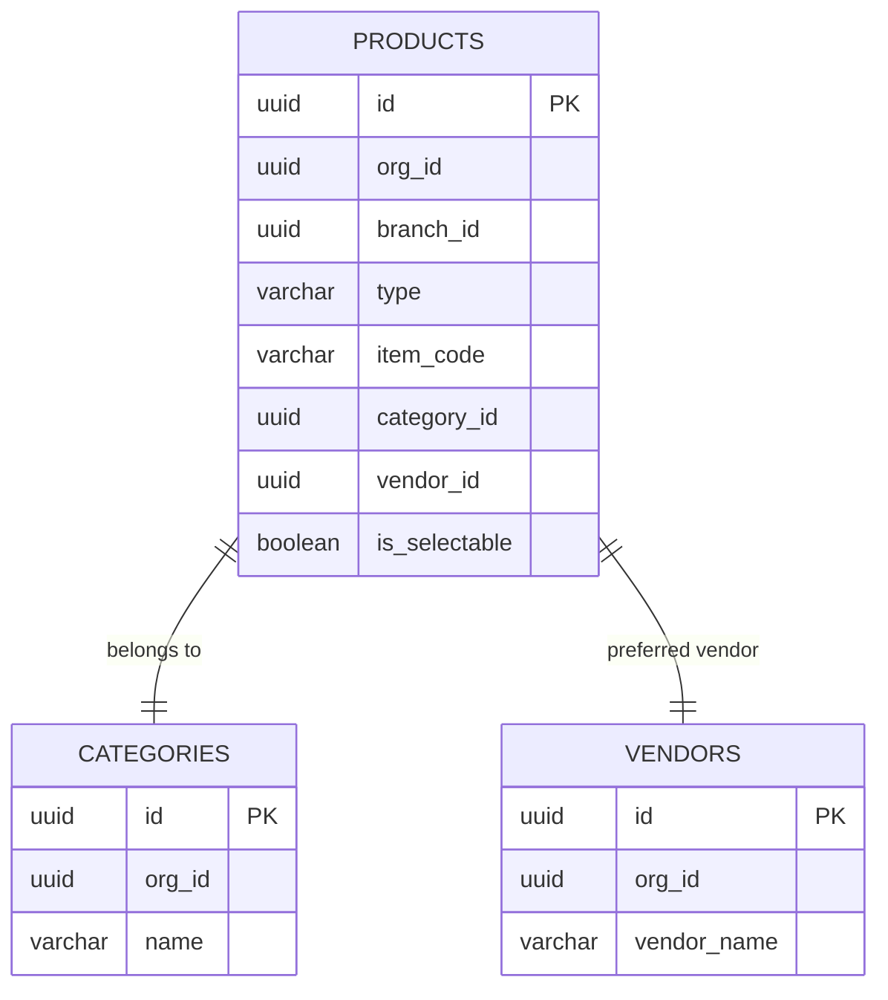

**Diagram sources**
- [schema.ts](file://backend/src/db/schema.ts#L26-L89)
- [schema.ts](file://backend/src/db/schema.ts#L94-L120)
- [schema.ts](file://backend/src/db/schema.ts#L108-L120)
- [001_initial_schema_and_seed.sql](file://supabase/migrations/001_initial_schema_and_seed.sql#L123-L135)

**Section sources**
- [db.ts](file://backend/src/db/db.ts#L1-L13)
- [schema.ts](file://backend/src/db/schema.ts#L1-L293)
- [001_initial_schema_and_seed.sql](file://supabase/migrations/001_initial_schema_and_seed.sql#L123-L135)
- [drizzle.config.ts](file://backend/drizzle.config.ts#L1-L16)

### Middleware and Tenant Context
- Tenant middleware attaches org/branch context to requests
- Health/ping endpoints bypass tenant checks
- Development mode currently allows test context; production code is commented out for future activation

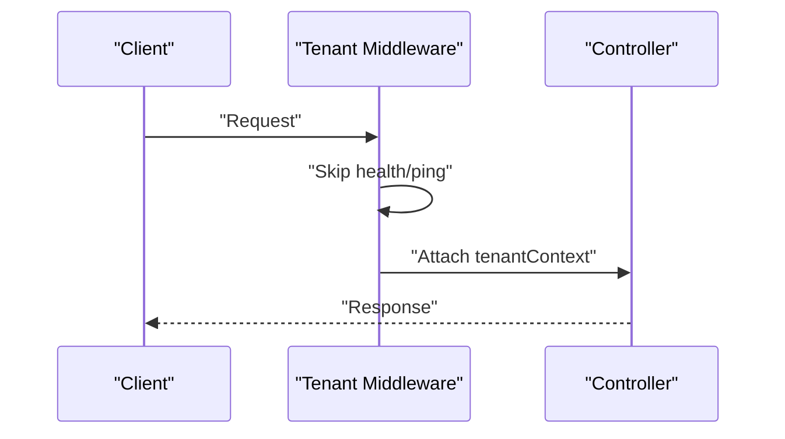

**Diagram sources**
- [tenant.middleware.ts](file://backend/src/common/middleware/tenant.middleware.ts#L24-L40)

**Section sources**
- [tenant.middleware.ts](file://backend/src/common/middleware/tenant.middleware.ts#L1-L70)

### API Controllers and Logging Hooks
- Products controller logs sync requests and exceptions
- Sales controller exposes customer, payment, e-way bill, and payment link endpoints
- Controllers integrate with services; logging occurs around sync operations and CRUD flows

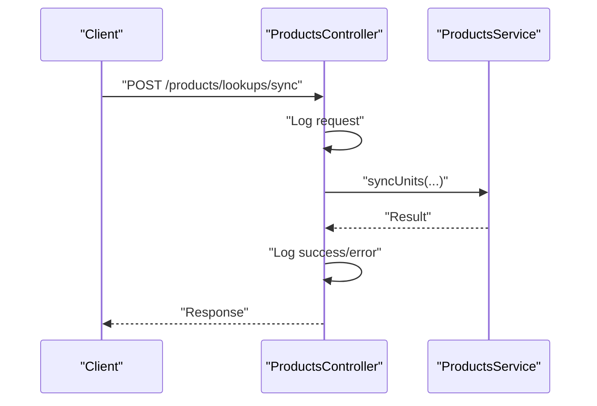

**Diagram sources**
- [products.controller.ts](file://backend/src/products/products.controller.ts#L32-L44)

**Section sources**
- [products.controller.ts](file://backend/src/products/products.controller.ts#L1-L250)
- [sales.controller.ts](file://backend/src/sales/sales.controller.ts#L1-L102)

### Supabase Client and Environment
- Supabase client initialization with service role key
- Environment variables include database URL, Supabase keys, JWT secret, CORS origins, cloud storage, and deployment URLs

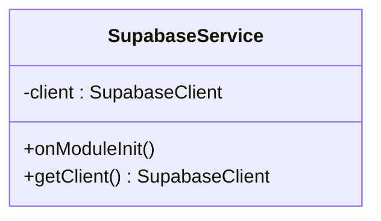

**Diagram sources**
- [supabase.service.ts](file://backend/src/supabase/supabase.service.ts#L6-L31)

**Section sources**
- [supabase.service.ts](file://backend/src/supabase/supabase.service.ts#L1-L32)
- [.env.example](file://backend/.env.example#L1-L40)

### Frontend Deployment and Static Assets
- Vercel configuration serves Flutter web build output
- Frontend URL and backend URL configured in environment

**Section sources**
- [vercel.json](file://vercel.json#L1-L12)
- [.env.example](file://backend/.env.example#L36-L39)

## Dependency Analysis
- Backend depends on NestJS, Drizzle ORM, Supabase client, and environment configuration
- Database schema defines relationships and indexes
- Monitoring stack is external; backend emits structured logs and metrics

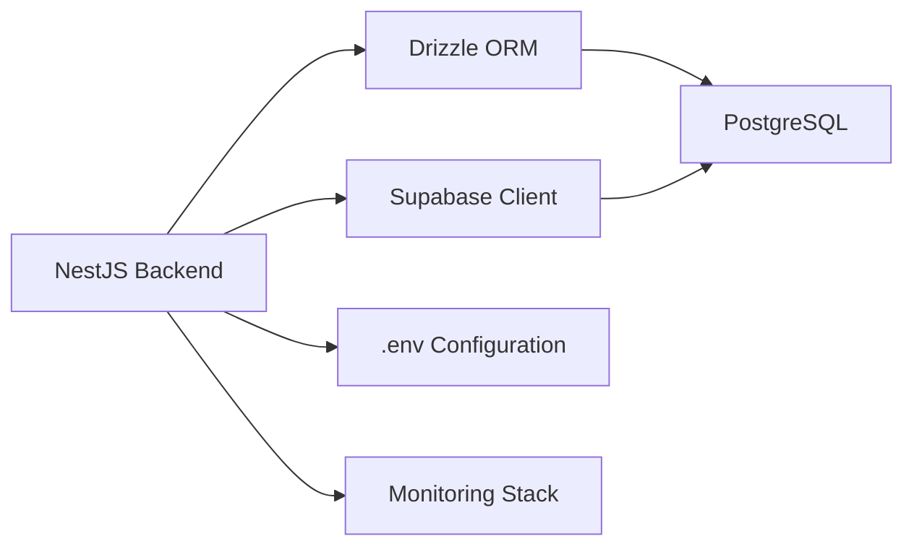

**Diagram sources**
- [package.json](file://backend/package.json#L22-L37)
- [db.ts](file://backend/src/db/db.ts#L1-L13)
- [supabase.service.ts](file://backend/src/supabase/supabase.service.ts#L10-L26)
- [prd_monitoring.md](file://PRD/prd_monitoring.md#L11-L16)

**Section sources**
- [package.json](file://backend/package.json#L1-L79)
- [db.ts](file://backend/src/db/db.ts#L1-L13)
- [supabase.service.ts](file://backend/src/supabase/supabase.service.ts#L1-L32)
- [prd_monitoring.md](file://PRD/prd_monitoring.md#L1-L181)

## Performance Considerations
- Database query optimization: leverage existing indexes (org/branch, type, category, vendor, selectable, item_code)
- Reduce N+1 queries in services; batch operations for lookups
- Enable caching for frequently accessed lookup tables
- Compress images and use CDN for static assets
- Monitor API p95 and page load; enforce thresholds via alerting
- Use structured logging to capture latency and error patterns

[No sources needed since this section provides general guidance]

## Troubleshooting Guide
- Health check failures: verify backend connectivity, database readiness, and middleware configuration
- Error spikes: inspect Sentry for top events, affected users, and stack traces
- Slow performance: review Vercel Analytics, backend logs, and database query patterns
- Authentication/tenant issues: confirm tenant middleware behavior and environment headers
- Database connectivity: validate DATABASE_URL and Supabase credentials

**Section sources**
- [prd_monitoring.md](file://PRD/prd_monitoring.md#L48-L85)
- [tenant.middleware.ts](file://backend/src/common/middleware/tenant.middleware.ts#L24-L40)
- [supabase.service.ts](file://backend/src/supabase/supabase.service.ts#L14-L16)
- [db.ts](file://backend/src/db/db.ts#L8-L12)

## Conclusion
ZerpAI ERP’s monitoring and maintenance framework combines structured logging, health checks, and external observability tools to ensure reliability and performance. Database optimization, robust alerting, and a clear incident response process support continuous operations. Disaster recovery and business continuity plans provide resilience against failures and breaches.

[No sources needed since this section summarizes without analyzing specific files]

## Appendices

### Maintenance Procedures
- Routine updates: deploy via Vercel; monitor health and logs; verify business metrics
- Database cleanup: archive old data per retention policy; validate PITR and backups
- System optimization: add missing indexes, implement caching, reduce N+1 queries, compress assets

**Section sources**
- [prd_monitoring.md](file://PRD/prd_monitoring.md#L170-L176)
- [001_initial_schema_and_seed.sql](file://supabase/migrations/001_initial_schema_and_seed.sql#L123-L135)

### Disaster Recovery and Business Continuity
- Backup strategy: daily automated backups, manual backups before major changes, monthly testing
- Recovery objectives: RTO < 4 hours, RPO < 24 hours (critical data < 1 hour)
- Scenarios: database loss, Vercel outage, security breach, accidental deletion
- Runbooks: maintain runbooks for database failure, deployment rollback, security breach, data corruption, auth outage

**Section sources**
- [prd_disaster_recovery.md](file://PRD/prd_disaster_recovery.md#L15-L416)

### Incident Response Protocols
- Severity levels: P0 (immediate), P1 (< 2 hours), P2 (< 24 hours), P3 (next sprint)
- Workflow: detection → assessment → communication → mitigation → resolution → post-mortem
- Runbooks: maintain templates and required runbooks for common incidents

**Section sources**
- [prd_disaster_recovery.md](file://PRD/prd_disaster_recovery.md#L99-L184)

### Maintenance Schedules and Change Management
- Daily: error dashboard review
- Weekly: performance trend review
- Monthly: deep dive and action items
- Quarterly: alerting rule review
- Change management: require PR reviews for protected branches; document environment variables; restrict access to secrets

**Section sources**
- [prd_monitoring.md](file://PRD/prd_monitoring.md#L170-L176)
- [prd_disaster_recovery.md](file://PRD/prd_disaster_recovery.md#L45-L62)