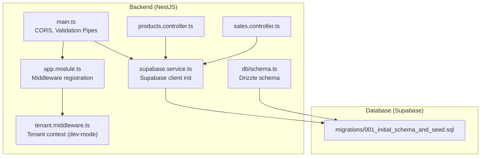
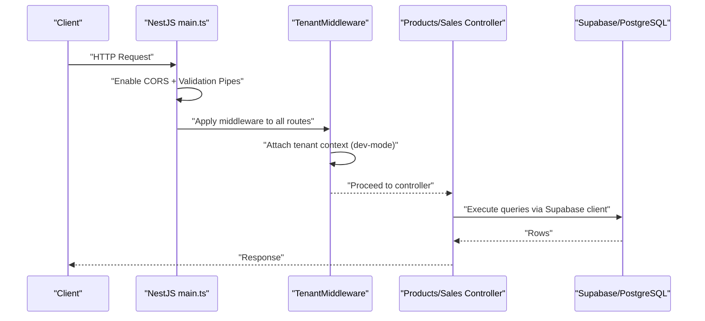
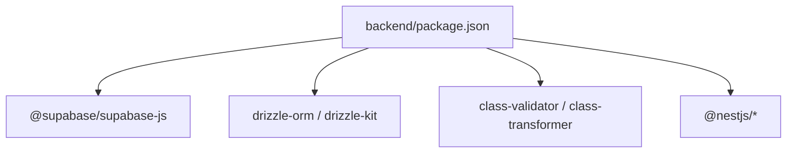

# Security & Operations

<cite>
**Referenced Files in This Document**
- [backend/src/main.ts](file://backend/src/main.ts)
- [backend/src/common/middleware/tenant.middleware.ts](file://backend/src/common/middleware/tenant.middleware.ts)
- [backend/src/db/schema.ts](file://backend/src/db/schema.ts)
- [backend/src/supabase/supabase.service.ts](file://backend/src/supabase/supabase.service.ts)
- [backend/src/app.module.ts](file://backend/src/app.module.ts)
- [backend/src/products/products.controller.ts](file://backend/src/products/products.controller.ts)
- [backend/src/sales/sales.controller.ts](file://backend/src/sales/sales.controller.ts)
- [backend/package.json](file://backend/package.json)
- [backend/.env.example](file://backend/.env.example)
- [cors_config.json](file://cors_config.json)
- [supabase/migrations/001_initial_schema_and_seed.sql](file://supabase/migrations/001_initial_schema_and_seed.sql)
- [PRD/PRD.md](file://PRD/PRD.md)
- [PRD/prd_monitoring.md](file://PRD/prd_monitoring.md)
- [PRD/prd_disaster_recovery.md](file://PRD/prd_disaster_recovery.md)
</cite>

## Table of Contents
1. [Introduction](#introduction)
2. [Project Structure](#project-structure)
3. [Core Components](#core-components)
4. [Architecture Overview](#architecture-overview)
5. [Detailed Component Analysis](#detailed-component-analysis)
6. [Dependency Analysis](#dependency-analysis)
7. [Performance Considerations](#performance-considerations)
8. [Troubleshooting Guide](#troubleshooting-guide)
9. [Conclusion](#conclusion)
10. [Appendices](#appendices)

## Introduction
This document provides comprehensive security and operations guidance for ZerpAI ERP. It covers security hardening, database security configurations, row-level security (RLS) setup, permission management, CORS configuration, API security measures, authentication/authorization readiness, operational procedures, security audits, vulnerability assessments, compliance requirements, monitoring and incident response, and backup/restore procedures. It consolidates findings from the backend NestJS server, Supabase database schema and migrations, middleware, environment configuration, and PRD-defined security posture.

## Project Structure
ZerpAI ERP consists of:
- Backend: NestJS server with TypeScript, Supabase client, Drizzle ORM schema, and middleware for tenant context.
- Database: Supabase-hosted PostgreSQL with migrations and a multi-tenant schema.
- Frontend: Flutter Web (referenced in PRD for UI/UX and offline capabilities).
- Operational docs: Monitoring, disaster recovery, and compliance guidance.

**Diagram sources**
- [backend/src/main.ts](file://backend/src/main.ts#L10-L56)
- [backend/src/app.module.ts](file://backend/src/app.module.ts#L14-L19)
- [backend/src/common/middleware/tenant.middleware.ts](file://backend/src/common/middleware/tenant.middleware.ts#L23-L68)
- [backend/src/supabase/supabase.service.ts](file://backend/src/supabase/supabase.service.ts#L7-L31)
- [backend/src/db/schema.ts](file://backend/src/db/schema.ts#L1-L293)
- [supabase/migrations/001_initial_schema_and_seed.sql](file://supabase/migrations/001_initial_schema_and_seed.sql#L1-L218)
- [backend/src/products/products.controller.ts](file://backend/src/products/products.controller.ts#L1-L250)
- [backend/src/sales/sales.controller.ts](file://backend/src/sales/sales.controller.ts#L1-L102)

**Section sources**
- [backend/src/main.ts](file://backend/src/main.ts#L10-L56)
- [backend/src/app.module.ts](file://backend/src/app.module.ts#L14-L19)
- [backend/src/common/middleware/tenant.middleware.ts](file://backend/src/common/middleware/tenant.middleware.ts#L23-L68)
- [backend/src/supabase/supabase.service.ts](file://backend/src/supabase/supabase.service.ts#L7-L31)
- [backend/src/db/schema.ts](file://backend/src/db/schema.ts#L1-L293)
- [supabase/migrations/001_initial_schema_and_seed.sql](file://supabase/migrations/001_initial_schema_and_seed.sql#L1-L218)
- [PRD/PRD.md](file://PRD/PRD.md#L259-L276)

## Core Components
- Supabase client initialization with service role key and disabled auth persistence.
- Tenant middleware that currently bypasses auth in development; intended to enforce org/outlet context and role.
- Drizzle schema defining multi-tenant tables with org_id and outlet_id scopes.
- Controllers for products and sales exposing endpoints; validation pipes applied globally.
- Environment variables for database, Supabase, JWT secret, CORS origins, and cloud storage.

Security posture:
- Authentication is not active in development; middleware stubs production-ready guards.
- Row-level security policies are disabled in migrations for development simplicity.
- CORS configuration supports localhost and production domains; wildcard headers and methods are configured.

**Section sources**
- [backend/src/supabase/supabase.service.ts](file://backend/src/supabase/supabase.service.ts#L7-L31)
- [backend/src/common/middleware/tenant.middleware.ts](file://backend/src/common/middleware/tenant.middleware.ts#L23-L68)
- [backend/src/db/schema.ts](file://backend/src/db/schema.ts#L116-L195)
- [backend/src/products/products.controller.ts](file://backend/src/products/products.controller.ts#L217-L248)
- [backend/src/sales/sales.controller.ts](file://backend/src/sales/sales.controller.ts#L77-L100)
- [backend/src/main.ts](file://backend/src/main.ts#L13-L42)
- [backend/.env.example](file://backend/.env.example#L1-L40)
- [supabase/migrations/001_initial_schema_and_seed.sql](file://supabase/migrations/001_initial_schema_and_seed.sql#L137-L141)

## Architecture Overview
The backend initializes Supabase client, applies CORS and validation, registers tenant middleware globally, and exposes controllers for products and sales. The database schema defines multi-tenant tables with org_id and outlet_id, and RLS policies are intentionally disabled in development.

**Diagram sources**
- [backend/src/main.ts](file://backend/src/main.ts#L13-L42)
- [backend/src/common/middleware/tenant.middleware.ts](file://backend/src/common/middleware/tenant.middleware.ts#L23-L68)
- [backend/src/products/products.controller.ts](file://backend/src/products/products.controller.ts#L217-L248)
- [backend/src/sales/sales.controller.ts](file://backend/src/sales/sales.controller.ts#L77-L100)
- [backend/src/supabase/supabase.service.ts](file://backend/src/supabase/supabase.service.ts#L28-L30)

## Detailed Component Analysis

### Database Security Configurations and RLS
- Multi-tenant design: Tables include org_id and outlet_id to isolate data per organization and outlet.
- RLS policies: Explicitly disabled in development migrations; must be enabled and hardened before production.
- Indexes: Optimized indexes exist for performance; ensure they do not leak cross-tenant data.
- Audit fields: created_by_id and updated_by_id present in schema; align with RBAC and audit trails.

Recommendations:
- Enforce RLS policies per table with org_id and outlet_id checks.
- Add fine-grained policies for sensitive tables (transactions, financials).
- Use Supabase Auth users and JWT claims to populate created_by_id/updated_by_id.
- Regularly review and test RLS policies.

**Section sources**
- [backend/src/db/schema.ts](file://backend/src/db/schema.ts#L116-L195)
- [supabase/migrations/001_initial_schema_and_seed.sql](file://supabase/migrations/001_initial_schema_and_seed.sql#L137-L141)
- [PRD/PRD.md](file://PRD/PRD.md#L267-L270)

### Permission Management and Authentication/Authorization
- Current state: No active authentication; middleware stubs production-ready guards.
- Intended design: Tenant context via headers (org_id, outlet_id, role) and JWT extraction.
- Controllers: Use req.user for user context when available; schema includes created_by_id/updated_by_id.

Hardening steps:
- Implement JWT guard and strategy; parse org_id/outlet_id/role from claims.
- Enforce RBAC roles (admin, manager, staff) at controller/service level.
- Add guards to protect sensitive endpoints and enforce tenant isolation.
- Store JWT secret securely and rotate periodically.

**Section sources**
- [backend/src/common/middleware/tenant.middleware.ts](file://backend/src/common/middleware/tenant.middleware.ts#L23-L68)
- [backend/src/products/products.controller.ts](file://backend/src/products/products.controller.ts#L229-L242)
- [backend/src/db/schema.ts](file://backend/src/db/schema.ts#L190-L195)
- [PRD/PRD.md](file://PRD/PRD.md#L261-L266)

### CORS Configuration
- Backend enables CORS with allowed origins regex for localhost and credentials support.
- Allowed methods and headers include Authorization and tenant headers.
- Separate cors_config.json exists with wildcard headers and broad methods.

Recommendations:
- Align backend CORS with cors_config.json or consolidate to one configuration.
- Restrict AllowedOrigins to production domains only in production.
- Avoid wildcard headers in production; enumerate required headers.

**Section sources**
- [backend/src/main.ts](file://backend/src/main.ts#L13-L24)
- [cors_config.json](file://cors_config.json#L1-L21)

### API Security Measures
- Validation pipes: Global whitelist and forbidNonWhitelisted enabled; detailed error logging.
- DTOs: Strong typing for request bodies; controllers validate inputs.
- Supabase client: Service role key used; autoRefreshToken and persistSession disabled.

Recommendations:
- Add rate limiting and request size limits.
- Implement input sanitization and output encoding.
- Secure JWT secret and avoid logging sensitive fields.
- Add API key or token-based auth for integrations.

**Section sources**
- [backend/src/main.ts](file://backend/src/main.ts#L26-L42)
- [backend/src/products/products.controller.ts](file://backend/src/products/products.controller.ts#L16-L17)
- [backend/src/sales/sales.controller.ts](file://backend/src/sales/sales.controller.ts#L1-L11)
- [backend/src/supabase/supabase.service.ts](file://backend/src/supabase/supabase.service.ts#L18-L23)

### Operational Procedures
- System administration:
  - Manage environment variables via .env.example; keep secrets out of code.
  - Use Supabase dashboard for DB operations, backups, and monitoring.
- User management and access control:
  - Implement Supabase Auth users and roles.
  - Enforce RLS and RBAC; log access attempts and changes.
- Health checks:
  - Use /api/health endpoint for uptime monitoring.

**Section sources**
- [backend/.env.example](file://backend/.env.example#L1-L40)
- [PRD/prd_monitoring.md](file://PRD/prd_monitoring.md#L48-L68)

### Security Audit Procedures and Vulnerability Assessment
- Conduct quarterly audits aligned with PRD’s risk mitigation guidelines.
- Validate RLS policies and tenant isolation.
- Review Supabase Auth configuration and JWT handling.
- Perform dependency security scans and update to latest stable versions.

**Section sources**
- [PRD/PRD.md](file://PRD/PRD.md#L318-L325)
- [backend/package.json](file://backend/package.json#L22-L79)

### Compliance Requirements
- GST and tax reporting: Ensure accurate tax fields and calculations per PRD.
- Data retention: Align with legal requirements (e.g., GST records minimum retention).
- Privacy: Honor user deletion requests and minimize retained data.

**Section sources**
- [PRD/PRD.md](file://PRD/PRD.md#L272-L276)
- [PRD/prd_disaster_recovery.md](file://PRD/prd_disaster_recovery.md#L333-L344)

### Monitoring, Threat Detection, and Incident Response
- Monitoring stack: Sentry, Vercel Analytics, UptimeRobot, Vercel Logs, Google Analytics 4.
- Metrics and thresholds: Error rate, API response time, page load time, database query latency.
- Health checks: /api/health endpoint monitored every 5 minutes.
- Alerting: Slack alerts and PagerDuty escalation for P0/P1 incidents.
- Dashboards: Sentry, Vercel Analytics, custom business dashboards.

**Section sources**
- [PRD/prd_monitoring.md](file://PRD/prd_monitoring.md#L1-L181)

### Backup and Restore Procedures
- Database backups: Daily automated backups; manual backups before major migrations.
- Point-in-Time Recovery (PITR): Enabled for production databases.
- Backup testing: Monthly restore to test database with integrity checks.
- Code and secrets: Git repository protected; secrets stored securely and rotated weekly.
- Offload storage: Cloudflare R2 for user-uploaded files; optional AWS S3 Glacier archival.

**Section sources**
- [PRD/prd_disaster_recovery.md](file://PRD/prd_disaster_recovery.md#L15-L71)
- [PRD/prd_disaster_recovery.md](file://PRD/prd_disaster_recovery.md#L188-L304)

## Dependency Analysis
Backend dependencies include NestJS, Supabase client, Drizzle ORM, and validation libraries. Ensure all dependencies are pinned to latest stable versions and scanned for vulnerabilities.

**Diagram sources**
- [backend/package.json](file://backend/package.json#L22-L79)

**Section sources**
- [backend/package.json](file://backend/package.json#L22-L79)

## Performance Considerations
- Apply database indexes as defined in migrations.
- Implement caching and optimize N+1 queries.
- Monitor API response times and database query latency.
- Compress images and leverage CDN for static assets.

[No sources needed since this section provides general guidance]

## Troubleshooting Guide
Common issues and resolutions:
- CORS errors: Verify allowed origins and credentials; avoid wildcard headers in production.
- Validation failures: Review ValidationPipe error logs and DTO constraints.
- Supabase connectivity: Confirm SUPABASE_URL and SUPABASE_SERVICE_ROLE_KEY are set and valid.
- Tenant context missing: Ensure org_id/outlet_id headers are provided; middleware bypasses auth in dev-mode.

**Section sources**
- [backend/src/main.ts](file://backend/src/main.ts#L13-L24)
- [backend/src/main.ts](file://backend/src/main.ts#L26-L42)
- [backend/src/supabase/supabase.service.ts](file://backend/src/supabase/supabase.service.ts#L14-L16)
- [backend/src/common/middleware/tenant.middleware.ts](file://backend/src/common/middleware/tenant.middleware.ts#L41-L67)

## Conclusion
ZerpAI ERP is “Auth-Ready” with a multi-tenant schema and middleware foundation. Security hardening requires enabling RLS, implementing JWT-based authentication and RBAC, tightening CORS, and establishing robust monitoring and incident response. Disaster recovery and compliance must be integrated with Supabase-managed backups and legal retention requirements.

[No sources needed since this section summarizes without analyzing specific files]

## Appendices

### Appendix A: Security Hardening Playbook
- Enable RLS policies and test tenant isolation.
- Implement JWT guard and RBAC enforcement.
- Harden CORS and restrict allowed headers/methods.
- Rotate secrets and monitor dependency vulnerabilities.
- Document and test incident response runbooks.

[No sources needed since this section provides general guidance]