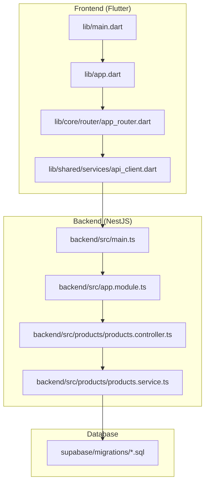
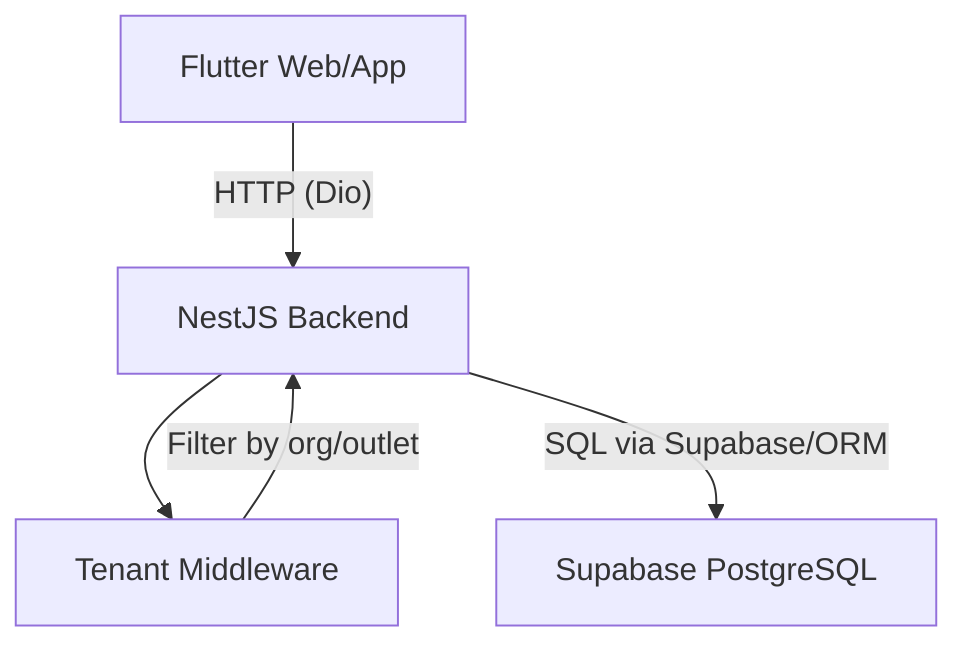
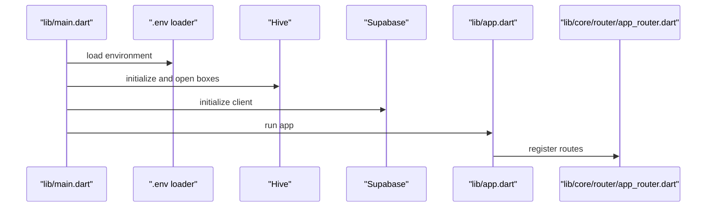
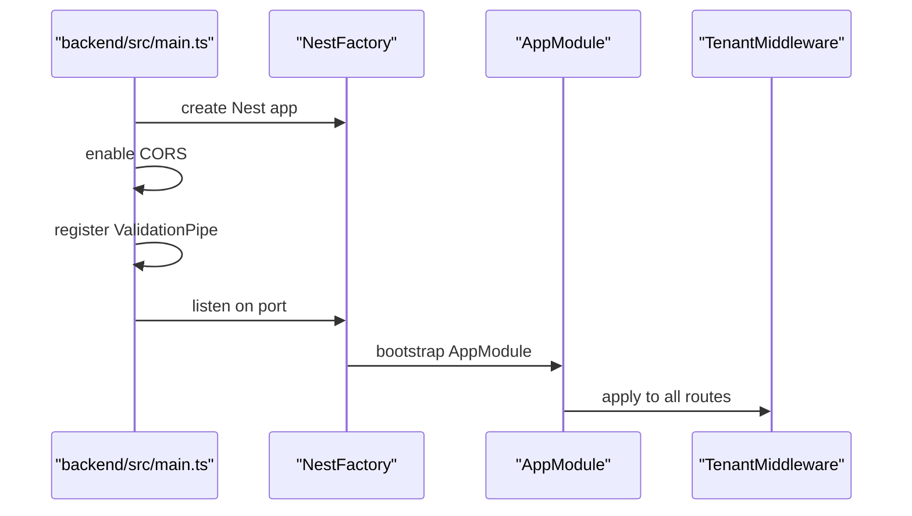
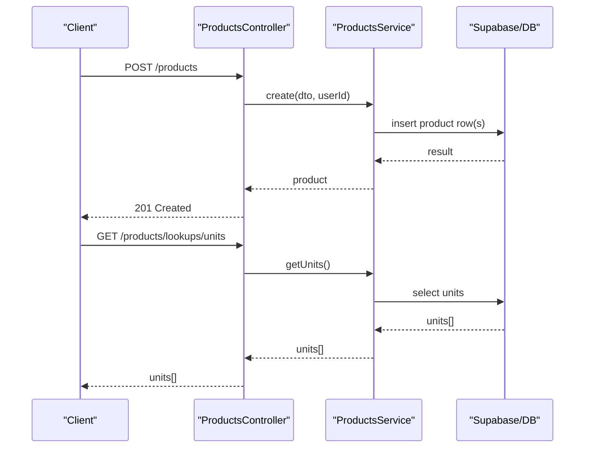
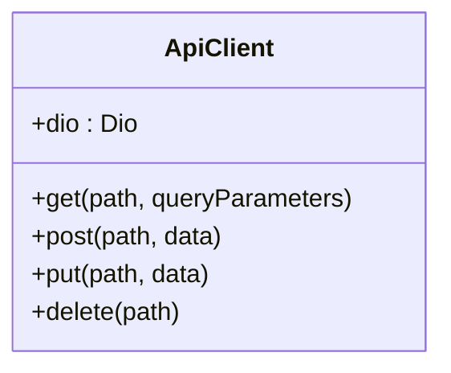
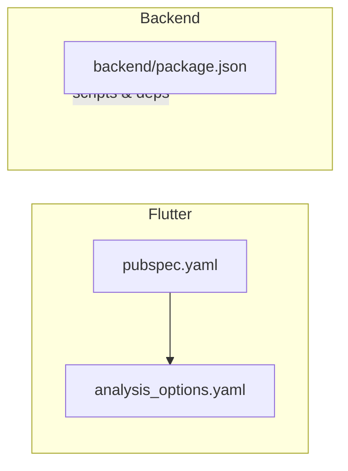

# Development Guidelines

<cite>
**Referenced Files in This Document**
- [CONTRIBUTING.md](file://CONTRIBUTING.md)
- [README.md](file://README.md)
- [analysis_options.yaml](file://analysis_options.yaml)
- [pubspec.yaml](file://pubspec.yaml)
- [backend/SETUP.md](file://backend/SETUP.md)
- [backend/TESTING.md](file://backend/TESTING.md)
- [backend/package.json](file://backend/package.json)
- [backend/src/main.ts](file://backend/src/main.ts)
- [backend/src/app.module.ts](file://backend/src/app.module.ts)
- [backend/src/products/products.controller.ts](file://backend/src/products/products.controller.ts)
- [backend/src/products/products.service.ts](file://backend/src/products/products.service.ts)
- [lib/app.dart](file://lib/app.dart)
- [lib/main.dart](file://lib/main.dart)
- [lib/core/router/app_router.dart](file://lib/core/router/app_router.dart)
- [lib/shared/services/api_client.dart](file://lib/shared/services/api_client.dart)
</cite>

## Table of Contents
1. [Introduction](#introduction)
2. [Project Structure](#project-structure)
3. [Core Components](#core-components)
4. [Architecture Overview](#architecture-overview)
5. [Detailed Component Analysis](#detailed-component-analysis)
6. [Dependency Analysis](#dependency-analysis)
7. [Performance Considerations](#performance-considerations)
8. [Troubleshooting Guide](#troubleshooting-guide)
9. [Conclusion](#conclusion)
10. [Appendices](#appendices)

## Introduction
This document defines comprehensive development guidelines for ZerpAI ERP. It consolidates coding standards, file naming conventions, code organization principles, branching and pull request processes, testing requirements, and quality assurance practices. It also outlines the development workflow, change impact considerations (including backward compatibility), and collaboration practices grounded in the repository’s current structure and documented processes.

## Project Structure
ZerpAI ERP follows a monorepo layout with a Flutter frontend (web and Android), a NestJS backend, and Supabase-managed database migrations. The frontend is organized around core, shared, and feature modules. The backend is organized by domain modules (e.g., products, sales) and common infrastructure (middleware, database).

**Diagram sources**
- [lib/main.dart](file://lib/main.dart#L1-L29)
- [lib/app.dart](file://lib/app.dart#L1-L32)
- [lib/core/router/app_router.dart](file://lib/core/router/app_router.dart#L1-L341)
- [lib/shared/services/api_client.dart](file://lib/shared/services/api_client.dart#L1-L62)
- [backend/src/main.ts](file://backend/src/main.ts#L1-L56)
- [backend/src/app.module.ts](file://backend/src/app.module.ts#L1-L20)
- [backend/src/products/products.controller.ts](file://backend/src/products/products.controller.ts#L1-L250)
- [backend/src/products/products.service.ts](file://backend/src/products/products.service.ts#L1-L723)

**Section sources**
- [README.md](file://README.md#L5-L28)
- [lib/main.dart](file://lib/main.dart#L1-L29)
- [lib/app.dart](file://lib/app.dart#L1-L32)
- [lib/core/router/app_router.dart](file://lib/core/router/app_router.dart#L1-L341)
- [backend/src/main.ts](file://backend/src/main.ts#L1-L56)
- [backend/src/app.module.ts](file://backend/src/app.module.ts#L1-L20)

## Core Components
- Frontend initialization and environment loading are centralized in the Flutter entrypoint and environment loader.
- The frontend app wraps routes with a shared layout shell and exposes a central router mapping.
- The backend initializes NestJS, applies global validation, enables CORS, and registers domain modules and middleware.
- The products domain demonstrates a layered pattern: controller (routes and DTO binding), service (business logic and persistence), and DTOs for validation.

Key implementation patterns:
- Centralized environment loading and Supabase initialization in the Flutter entrypoint.
- Centralized routing and navigation shell in the router.
- Global validation pipeline and CORS configuration in the NestJS bootstrap.
- Domain-driven controllers and services with explicit DTO usage and consistent error handling.

**Section sources**
- [lib/main.dart](file://lib/main.dart#L1-L29)
- [lib/app.dart](file://lib/app.dart#L1-L32)
- [lib/core/router/app_router.dart](file://lib/core/router/app_router.dart#L1-L341)
- [backend/src/main.ts](file://backend/src/main.ts#L1-L56)
- [backend/src/app.module.ts](file://backend/src/app.module.ts#L1-L20)
- [backend/src/products/products.controller.ts](file://backend/src/products/products.controller.ts#L1-L250)
- [backend/src/products/products.service.ts](file://backend/src/products/products.service.ts#L1-L723)

## Architecture Overview
The system architecture connects the Flutter frontend to the NestJS backend via REST, which in turn interacts with Supabase PostgreSQL. Multi-tenancy is enforced via middleware and tenant headers.

**Diagram sources**
- [lib/shared/services/api_client.dart](file://lib/shared/services/api_client.dart#L1-L62)
- [backend/src/main.ts](file://backend/src/main.ts#L1-L56)
- [backend/src/app.module.ts](file://backend/src/app.module.ts#L1-L20)

**Section sources**
- [README.md](file://README.md#L83-L91)
- [backend/src/main.ts](file://backend/src/main.ts#L1-L56)
- [backend/src/app.module.ts](file://backend/src/app.module.ts#L1-L20)

## Detailed Component Analysis

### Frontend Initialization and Routing
- Initialization loads environment variables, initializes Hive for offline storage, and initializes Supabase.
- The app sets a theme and routes, delegating navigation to the centralized router.
- The router defines named routes and wraps screens with a shared layout shell.

**Diagram sources**
- [lib/main.dart](file://lib/main.dart#L1-L29)
- [lib/app.dart](file://lib/app.dart#L1-L32)
- [lib/core/router/app_router.dart](file://lib/core/router/app_router.dart#L1-L341)

**Section sources**
- [lib/main.dart](file://lib/main.dart#L1-L29)
- [lib/app.dart](file://lib/app.dart#L1-L32)
- [lib/core/router/app_router.dart](file://lib/core/router/app_router.dart#L1-L341)

### Backend Bootstrapping and Middleware
- Bootstrap configures environment variables, CORS, and a global validation pipe with detailed error logging.
- The application module registers domain modules and applies tenant middleware to all routes.

**Diagram sources**
- [backend/src/main.ts](file://backend/src/main.ts#L1-L56)
- [backend/src/app.module.ts](file://backend/src/app.module.ts#L1-L20)

**Section sources**
- [backend/src/main.ts](file://backend/src/main.ts#L1-L56)
- [backend/src/app.module.ts](file://backend/src/app.module.ts#L1-L20)

### Products Domain: Controller and Service
- The controller exposes CRUD and lookup endpoints, including specialized sync endpoints for lookup tables.
- The service encapsulates business logic, mapping legacy keys to DB columns, handling soft deletes, and implementing a generic metadata synchronization routine.

**Diagram sources**
- [backend/src/products/products.controller.ts](file://backend/src/products/products.controller.ts#L1-L250)
- [backend/src/products/products.service.ts](file://backend/src/products/products.service.ts#L1-L723)

**Section sources**
- [backend/src/products/products.controller.ts](file://backend/src/products/products.controller.ts#L1-L250)
- [backend/src/products/products.service.ts](file://backend/src/products/products.service.ts#L1-L723)

### API Client Pattern
- The API client encapsulates base URL, timeouts, headers, and interceptors, exposing convenience methods for HTTP verbs.

**Diagram sources**
- [lib/shared/services/api_client.dart](file://lib/shared/services/api_client.dart#L1-L62)

**Section sources**
- [lib/shared/services/api_client.dart](file://lib/shared/services/api_client.dart#L1-L62)

## Dependency Analysis
- Flutter dependencies and dev dependencies are declared centrally, enabling consistent linting and code generation.
- Backend dependencies include NestJS, Supabase client, Drizzle ORM, and testing frameworks. Scripts define linting, formatting, and test commands.

**Diagram sources**
- [pubspec.yaml](file://pubspec.yaml#L1-L128)
- [analysis_options.yaml](file://analysis_options.yaml#L1-L29)
- [backend/package.json](file://backend/package.json#L1-L79)

**Section sources**
- [pubspec.yaml](file://pubspec.yaml#L1-L128)
- [analysis_options.yaml](file://analysis_options.yaml#L1-L29)
- [backend/package.json](file://backend/package.json#L1-L79)

## Performance Considerations
- Prefer lazy-loaded route pages and modular feature organization to minimize initial bundle size.
- Use Riverpod providers judiciously; avoid unnecessary rebuilds by scoping state precisely.
- Backend: leverage database joins and selective field selection to reduce payload sizes.
- Use pagination and filtering on the backend for large datasets.
- Minimize repeated network calls by caching small, stable lookup data in memory or Hive where appropriate.

## Troubleshooting Guide
- Backend CORS errors: ensure the frontend origin is included in CORS configuration and environment variables.
- Database connectivity: validate environment variables and test connectivity locally before deploying.
- Backend build failures: ensure TypeScript compiles locally and all environment variables are present.
- Frontend environment loading: verify the .env file is loaded and keys match expected names.

**Section sources**
- [backend/SETUP.md](file://backend/SETUP.md#L218-L246)
- [backend/src/main.ts](file://backend/src/main.ts#L1-L56)
- [lib/main.dart](file://lib/main.dart#L1-L29)

## Conclusion
These guidelines consolidate the repository’s established patterns for structure, routing, validation, and quality. Following them will ensure consistent development, predictable testing, and smoother collaboration across the Flutter and NestJS codebases.

## Appendices

### Coding Standards and Formatting
- Follow existing project structure under lib/ and add new features under lib/modules/.
- Keep UI logic in widgets and business logic in providers/services.
- Use consistent naming conventions for files and folders aligned with the existing structure.
- Format Dart code using the project’s formatter and ensure analysis passes locally before submitting changes.

**Section sources**
- [CONTRIBUTING.md](file://CONTRIBUTING.md#L22-L25)
- [analysis_options.yaml](file://analysis_options.yaml#L1-L29)

### Linting and Quality Assurance
- Run analysis locally and fix reported issues.
- Ensure tests pass before opening a pull request.
- Format code before committing.

**Section sources**
- [CONTRIBUTING.md](file://CONTRIBUTING.md#L13-L16)

### Branching Strategy and Pull Requests
- Create feature branches prefixed with feat/, fix/, or chore/.
- Target the dev branch for pull requests.
- Include a short description, motivation, and screenshots for UI changes.

**Section sources**
- [CONTRIBUTING.md](file://CONTRIBUTING.md#L7-L9)

### Development Workflow
- Create feature branch from main.
- Make changes and test locally.
- Submit a pull request for review.

**Section sources**
- [README.md](file://README.md#L113-L119)

### Adding New Features and Backward Compatibility
- Add new modules under lib/modules/ following existing patterns.
- Maintain backward compatibility by avoiding breaking changes to public APIs and routes.
- For backend, keep DTOs and endpoint signatures stable; introduce new endpoints rather than altering existing ones.

**Section sources**
- [CONTRIBUTING.md](file://CONTRIBUTING.md#L24-L25)
- [backend/src/products/products.controller.ts](file://backend/src/products/products.controller.ts#L1-L250)

### Testing Requirements
- Backend: run tests locally and ensure coverage; CI executes analysis and tests on PRs and pushes to dev and main.
- Frontend: run tests locally and ensure analysis passes.

**Section sources**
- [CONTRIBUTING.md](file://CONTRIBUTING.md#L18-L20)
- [backend/TESTING.md](file://backend/TESTING.md#L1-L72)
- [backend/package.json](file://backend/package.json#L1-L79)

### Team Collaboration Practices
- Use the Code of Conduct for interactions.
- Engage constructively during reviews and discussions.

**Section sources**
- [CODE_OF_CONDUCT.md](file://CODE_OF_CONDUCT.md#L1-L31)