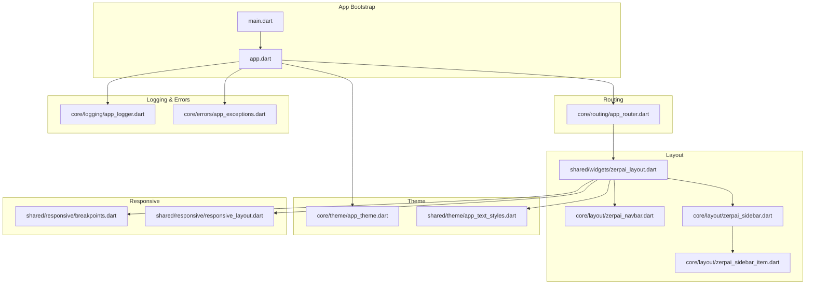
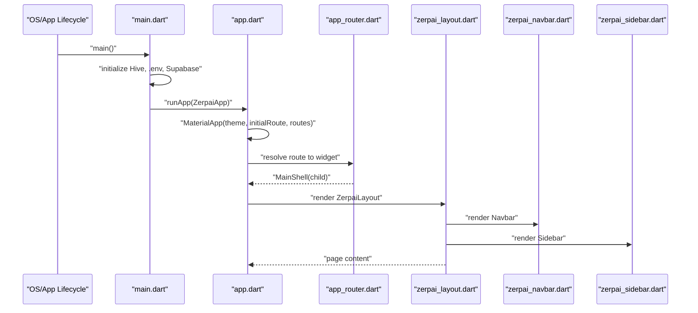
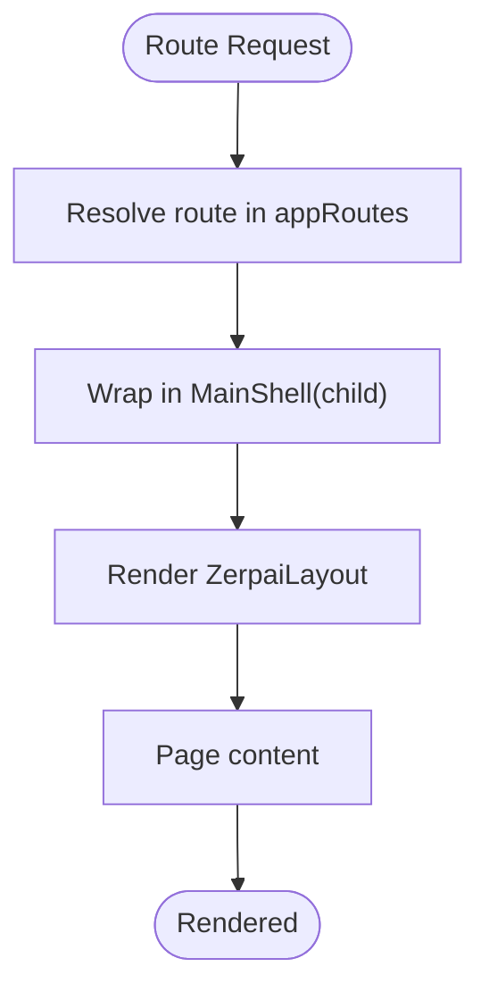
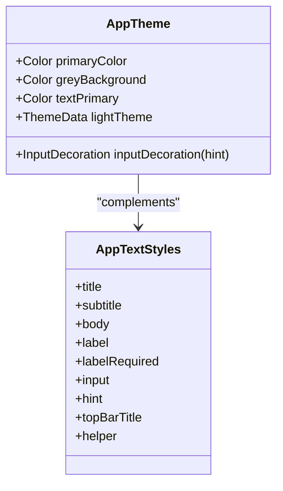
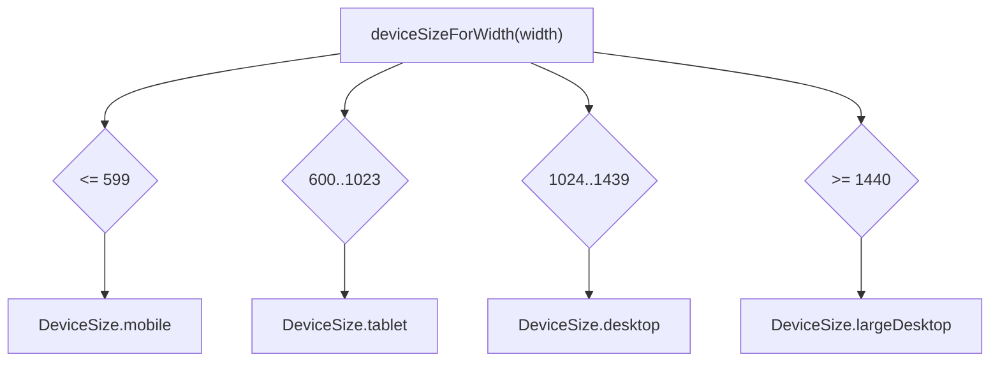
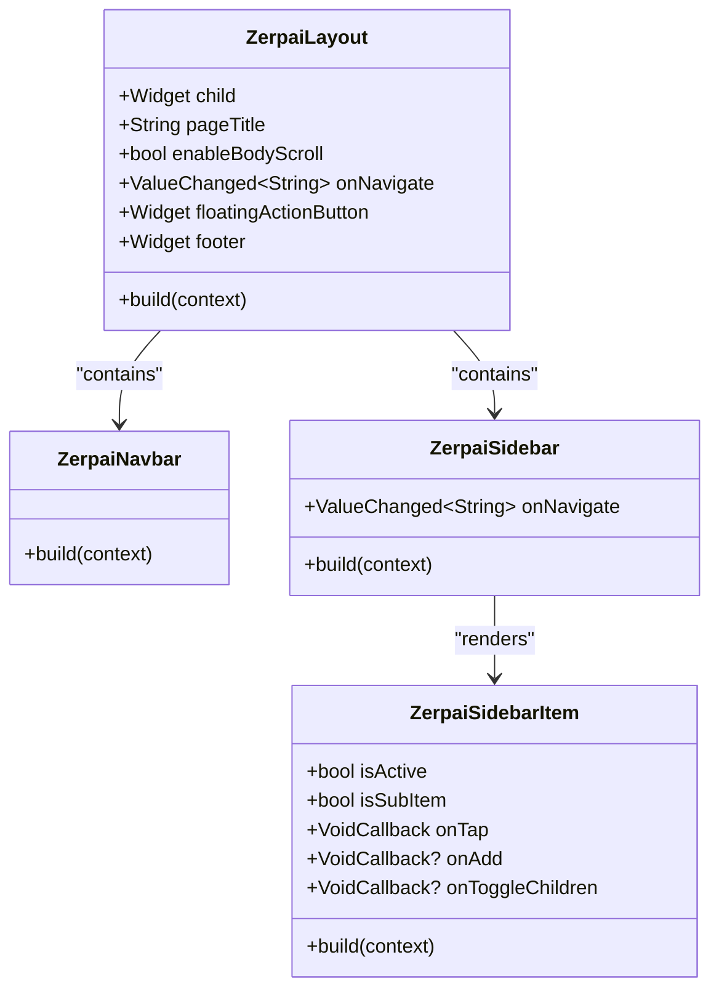
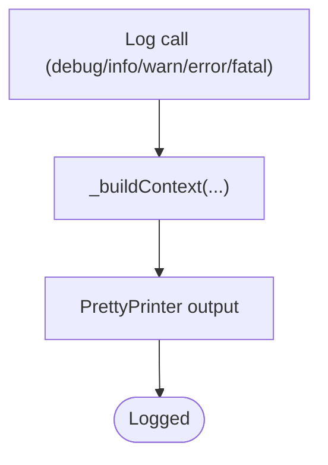
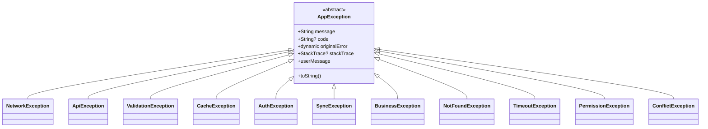
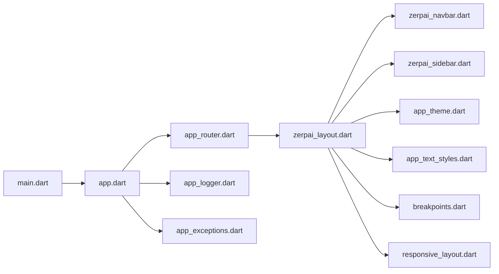

# Core Infrastructure

<cite>
**Referenced Files in This Document**
- [app_router.dart](file://lib/core/routing/app_router.dart)
- [app_theme.dart](file://lib/core/theme/app_theme.dart)
- [zerpai_layout.dart](file://lib/shared/widgets/zerpai_layout.dart)
- [zerpai_navbar.dart](file://lib/core/layout/zerpai_navbar.dart)
- [zerpai_sidebar.dart](file://lib/core/layout/zerpai_sidebar.dart)
- [zerpai_sidebar_item.dart](file://lib/core/layout/zerpai_sidebar_item.dart)
- [app_logger.dart](file://lib/core/logging/app_logger.dart)
- [app_exceptions.dart](file://lib/core/errors/app_exceptions.dart)
- [breakpoints.dart](file://lib/shared/responsive/breakpoints.dart)
- [responsive_layout.dart](file://lib/shared/responsive/responsive_layout.dart)
- [main.dart](file://lib/main.dart)
- [app.dart](file://lib/app.dart)
- [app_text_styles.dart](file://lib/shared/theme/app_text_styles.dart)
</cite>

## Table of Contents
1. [Introduction](#introduction)
2. [Project Structure](#project-structure)
3. [Core Components](#core-components)
4. [Architecture Overview](#architecture-overview)
5. [Detailed Component Analysis](#detailed-component-analysis)
6. [Dependency Analysis](#dependency-analysis)
7. [Performance Considerations](#performance-considerations)
8. [Troubleshooting Guide](#troubleshooting-guide)
9. [Conclusion](#conclusion)
10. [Appendices](#appendices)

## Introduction
This document describes the core infrastructure of the ZerpAI ERP frontend, focusing on the routing system, theme management, responsive layout, logging, and error handling. It explains how routes are defined and navigated, how Material Design principles are applied to color and typography, how the page layout adapts across devices, and how logging and error handling are standardized. Practical examples illustrate how to add new routes, customize themes, and extend the layout system, along with performance considerations and best practices.

Canonical placement rule:
- `lib/core/` = app infrastructure only
- `lib/core/layout/` = shell/navigation infrastructure such as sidebar and navbar
- `lib/shared/widgets/` = reusable page wrappers and reusable UI widgets

## Project Structure
The core infrastructure spans several modules:
- Routing: centralized route definitions and navigation
- Layout: reusable page shell with sidebar and navbar
- Theme: Material Design-based color and typography system
- Responsive: breakpoint utilities and responsive layout wrappers
- Logging: structured logging service
- Errors: standardized exception hierarchy

**Diagram sources**
- [main.dart](file://lib/main.dart#L1-L29)
- [app.dart](file://lib/app.dart#L1-L32)
- [app_router.dart](file://lib/core/routing/app_router.dart#L1-L341)
- [zerpai_layout.dart](file://lib/shared/widgets/zerpai_layout.dart#L1-L73)
- [zerpai_navbar.dart](file://lib/core/layout/zerpai_navbar.dart#L1-L382)
- [zerpai_sidebar.dart](file://lib/core/layout/zerpai_sidebar.dart#L1-L1044)
- [zerpai_sidebar_item.dart](file://lib/core/layout/zerpai_sidebar_item.dart#L1-L461)
- [app_theme.dart](file://lib/core/theme/app_theme.dart#L1-L85)
- [app_text_styles.dart](file://lib/shared/theme/app_text_styles.dart#L1-L58)
- [breakpoints.dart](file://lib/shared/responsive/breakpoints.dart#L1-L64)
- [responsive_layout.dart](file://lib/shared/responsive/responsive_layout.dart#L1-L48)
- [app_logger.dart](file://lib/core/logging/app_logger.dart#L1-L218)
- [app_exceptions.dart](file://lib/core/errors/app_exceptions.dart#L1-L218)

**Section sources**
- [main.dart](file://lib/main.dart#L1-L29)
- [app.dart](file://lib/app.dart#L1-L32)

## Core Components
- Routing system: centralized route constants and route-to-widget mapping with a common shell wrapper
- Layout system: page shell with sidebar, navbar, and optional footer/fab
- Theme system: Material 3 light theme with consistent colors, typography, and form controls
- Responsive system: logical breakpoints and a responsive layout wrapper
- Logging system: structured logger with levels, context, and specialized helpers
- Error system: standardized exception classes with user-friendly messages

**Section sources**
- [app_router.dart](file://lib/core/routing/app_router.dart#L28-L265)
- [zerpai_layout.dart](file://lib/shared/widgets/zerpai_layout.dart#L5-L73)
- [app_theme.dart](file://lib/core/theme/app_theme.dart#L5-L85)
- [breakpoints.dart](file://lib/shared/responsive/breakpoints.dart#L8-L64)
- [responsive_layout.dart](file://lib/shared/responsive/responsive_layout.dart#L7-L48)
- [app_logger.dart](file://lib/core/logging/app_logger.dart#L13-L218)
- [app_exceptions.dart](file://lib/core/errors/app_exceptions.dart#L4-L218)

## Architecture Overview
The app initializes platform services, sets up the app shell with theme and routes, and renders the current screen inside a shared layout. Navigation is handled via named routes and a common shell wrapper.

**Diagram sources**
- [main.dart](file://lib/main.dart#L8-L28)
- [app.dart](file://lib/app.dart#L10-L30)
- [app_router.dart](file://lib/core/routing/app_router.dart#L93-L101)
- [zerpai_layout.dart](file://lib/shared/widgets/zerpai_layout.dart#L24-L71)
- [zerpai_navbar.dart](file://lib/core/layout/zerpai_navbar.dart#L57-L382)
- [zerpai_sidebar.dart](file://lib/core/layout/zerpai_sidebar.dart#L589-L630)

## Detailed Component Analysis

### Routing System
- Route definitions: constants define canonical paths for all features
- Route mapping: a map translates each route to a widget, wrapped in a common shell
- Navigation pattern: the shell accepts an onNavigate callback; the sidebar invokes it to navigate
- Parameter handling: routes are string-based; parameters are not used in the current implementation

**Diagram sources**
- [app_router.dart](file://lib/core/routing/app_router.dart#L93-L101)
- [zerpai_layout.dart](file://lib/shared/widgets/zerpai_layout.dart#L24-L71)

Practical example: adding a new route
- Define a constant in the AppRoutes class
- Add an entry in the appRoutes map with a MainShell wrapper
- Reference the target screen widget in the route mapping

Parameter handling
- Current routes are path-only; parameters are not used. For query parameters or path segments, consider using a dedicated navigator wrapper or route observers.

**Section sources**
- [app_router.dart](file://lib/core/routing/app_router.dart#L28-L265)

### Theme Management
- Material Design: uses Material 3 with a light theme
- Colors: primary color, background, and text colors configured centrally
- Typography: consistent text styles via shared text styles
- Form controls: unified InputDecoration and button themes
- AppBar/Card/Input/Button themes: configured for consistency

**Diagram sources**
- [app_theme.dart](file://lib/core/theme/app_theme.dart#L5-L85)
- [app_text_styles.dart](file://lib/shared/theme/app_text_styles.dart#L3-L58)

Customizing themes
- Modify AppTheme colors and ThemeData properties for global changes
- Extend AppTextStyles for new text roles
- Update AppBarTheme, CardTheme, and inputDecorationTheme for UI consistency

**Section sources**
- [app_theme.dart](file://lib/core/theme/app_theme.dart#L10-L85)
- [app_text_styles.dart](file://lib/shared/theme/app_text_styles.dart#L3-L58)

### Responsive Layout System
- Breakpoints: logical breakpoints for mobile/tablet/desktop/large desktop
- Helpers: functions to detect device size from width or BuildContext
- ResponsiveLayout: a widget that selects desktop/tablet/mobile layouts based on constraints

**Diagram sources**
- [breakpoints.dart](file://lib/shared/responsive/breakpoints.dart#L26-L37)

Adaptive design patterns
- Use ResponsiveLayout to switch UI for different breakpoints
- Use deviceSizeOf(context) to branch logic in widgets
- Apply padding/margins and component sizing based on device type

**Section sources**
- [breakpoints.dart](file://lib/shared/responsive/breakpoints.dart#L8-L64)
- [responsive_layout.dart](file://lib/shared/responsive/responsive_layout.dart#L7-L48)

### Layout System (Sidebar, Navbar, Page Shell)
- ZerpaiLayout: provides the page shell with sidebar, navbar, page title, optional footer/FAB, and scrollable body
- ZerpaiNavbar: search bar with category dropdown, quick actions, notifications, and profile area
- ZerpaiSidebar: collapsible navigation with parent-child menus, floating submenu on hover/collapse, and add buttons for child items

**Diagram sources**
- [zerpai_layout.dart](file://lib/shared/widgets/zerpai_layout.dart#L5-L73)
- [zerpai_navbar.dart](file://lib/core/layout/zerpai_navbar.dart#L3-L382)
- [zerpai_sidebar.dart](file://lib/core/layout/zerpai_sidebar.dart#L506-L630)
- [zerpai_sidebar_item.dart](file://lib/core/layout/zerpai_sidebar_item.dart#L233-L315)

Extending the layout system
- Add new menu entries in ZerpaiSidebar’s menu configuration
- Use ZerpaiLayout to wrap new pages and pass onNavigate to maintain consistent navigation
- Customize ZerpaiNavbar for additional actions or branding

**Section sources**
- [zerpai_layout.dart](file://lib/shared/widgets/zerpai_layout.dart#L24-L71)
- [zerpai_navbar.dart](file://lib/core/layout/zerpai_navbar.dart#L57-L382)
- [zerpai_sidebar.dart](file://lib/core/layout/zerpai_sidebar.dart#L518-L630)
- [zerpai_sidebar_item.dart](file://lib/core/layout/zerpai_sidebar_item.dart#L281-L315)

### Logging Infrastructure
- Centralized logger with PrettyPrinter, levels, and emoji-enhanced logs
- Helpers for API requests/responses, cache operations, sync events, and performance metrics
- Context injection via module/org/user/data fields

**Diagram sources**
- [app_logger.dart](file://lib/core/logging/app_logger.dart#L14-L133)

Best practices
- Use info for normal operations, debug for development, error for failures
- Attach contextual data (module, org, user) for traceability
- Use apiRequest/apiResponse for network diagnostics

**Section sources**
- [app_logger.dart](file://lib/core/logging/app_logger.dart#L13-L218)

### Error Handling
- Standardized exception hierarchy with user-friendly messages
- Categories: network, API, validation, cache/storage, auth, sync, business, not found, timeout, permission, conflict
- Consistent userMessage property for displaying friendly messages

**Diagram sources**
- [app_exceptions.dart](file://lib/core/errors/app_exceptions.dart#L4-L218)

Best practices
- Throw specific exceptions to enable targeted user messaging
- Log exceptions with AppLogger.error including stack traces
- Display userMessage to the UI for graceful error communication

**Section sources**
- [app_exceptions.dart](file://lib/core/errors/app_exceptions.dart#L4-L218)

## Dependency Analysis
The routing and layout modules depend on the shared theme and responsive utilities. The app bootstrap initializes external services and registers the router with the app shell.

**Diagram sources**
- [main.dart](file://lib/main.dart#L1-L29)
- [app.dart](file://lib/app.dart#L1-L32)
- [app_router.dart](file://lib/core/routing/app_router.dart#L1-L341)
- [zerpai_layout.dart](file://lib/shared/widgets/zerpai_layout.dart#L1-L73)
- [zerpai_navbar.dart](file://lib/core/layout/zerpai_navbar.dart#L1-L382)
- [zerpai_sidebar.dart](file://lib/core/layout/zerpai_sidebar.dart#L1-L1044)
- [app_theme.dart](file://lib/core/theme/app_theme.dart#L1-L85)
- [app_text_styles.dart](file://lib/shared/theme/app_text_styles.dart#L1-L58)
- [breakpoints.dart](file://lib/shared/responsive/breakpoints.dart#L1-L64)
- [responsive_layout.dart](file://lib/shared/responsive/responsive_layout.dart#L1-L48)
- [app_logger.dart](file://lib/core/logging/app_logger.dart#L1-L218)
- [app_exceptions.dart](file://lib/core/errors/app_exceptions.dart#L1-L218)

**Section sources**
- [app.dart](file://lib/app.dart#L10-L30)
- [app_router.dart](file://lib/core/routing/app_router.dart#L93-L101)

## Performance Considerations
- Routing
  - Keep route mappings minimal and avoid heavy widget construction in route builders
  - Use lightweight placeholders for “Coming Soon” features
- Layout
  - Avoid unnecessary rebuilds by passing only required props to ZerpaiLayout
  - Use enableBodyScroll judiciously to prevent excessive scrolling containers
- Theme
  - Centralize theme definitions to reduce duplication and improve render performance
  - Prefer ThemeData overrides over per-widget styling
- Responsive
  - Use LayoutBuilder and constraints-aware widgets to minimize recompositions
  - Cache device size checks when used frequently in a single frame
- Logging
  - Disable debug logs in production builds
  - Avoid logging large payloads; truncate or summarize when necessary
- Errors
  - Catch and log exceptions early; avoid rethrowing unless necessary
  - Use userMessage to prevent leaking internal details to users

[No sources needed since this section provides general guidance]

## Troubleshooting Guide
- Navigation issues
  - Verify the route constant exists and the mapping is present in appRoutes
  - Ensure onNavigate is passed correctly from ZerpaiLayout to ZerpaiSidebar
- Theme inconsistencies
  - Confirm ThemeData is set in ZerpaiApp and AppTheme is aligned with shared text styles
  - Check that widgets use AppTextStyles or theme defaults consistently
- Responsive problems
  - Validate device size detection helpers and breakpoints
  - Ensure ResponsiveLayout receives proper maxWidth and fallbacks
- Logging
  - Confirm PrettyPrinter is initialized and log level is appropriate
  - Use apiRequest/apiResponse helpers for network debugging
- Errors
  - Inspect userMessage for each exception subclass to ensure correct messaging
  - Log stack traces with AppLogger.error for failures

**Section sources**
- [app_router.dart](file://lib/core/routing/app_router.dart#L93-L101)
- [zerpai_layout.dart](file://lib/shared/widgets/zerpai_layout.dart#L42-L45)
- [app_theme.dart](file://lib/core/theme/app_theme.dart#L10-L85)
- [breakpoints.dart](file://lib/shared/responsive/breakpoints.dart#L26-L64)
- [responsive_layout.dart](file://lib/shared/responsive/responsive_layout.dart#L32-L46)
- [app_logger.dart](file://lib/core/logging/app_logger.dart#L14-L114)
- [app_exceptions.dart](file://lib/core/errors/app_exceptions.dart#L14-L218)

## Conclusion
The ZerpAI ERP frontend’s core infrastructure provides a scalable foundation:
- A centralized routing system with a common shell ensures consistent navigation and page structure
- A Material Design-based theme and typography system deliver visual coherence
- A responsive layout and breakpoint utilities support adaptive experiences
- Structured logging and standardized error handling improve observability and user experience

By following the patterns and best practices described, teams can reliably add new routes, customize themes, and extend the layout while maintaining performance and consistency.

[No sources needed since this section summarizes without analyzing specific files]

## Appendices

### Practical Examples

- Implementing a new route
  - Add a constant in AppRoutes
  - Add an entry in appRoutes mapping to a MainShell-wrapped screen
  - Reference the new route in the sidebar menu or elsewhere

- Customizing themes
  - Modify AppTheme colors and ThemeData
  - Extend AppTextStyles for new roles
  - Rebuild the app to apply changes globally

- Extending the layout system
  - Add menu items in ZerpaiSidebar
  - Wrap new pages with ZerpaiLayout
  - Pass onNavigate to maintain consistent navigation behavior

[No sources needed since this section provides general guidance]

