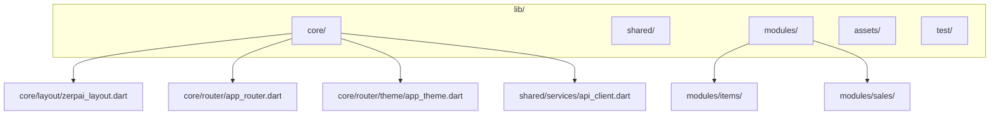
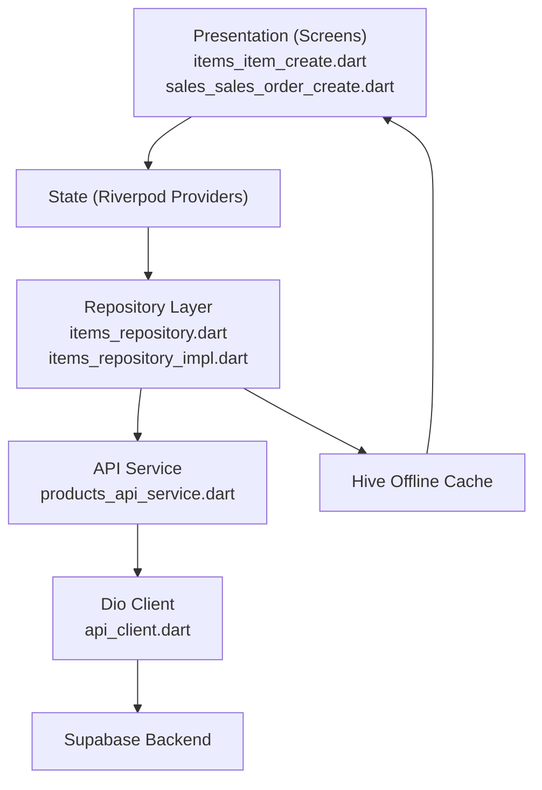
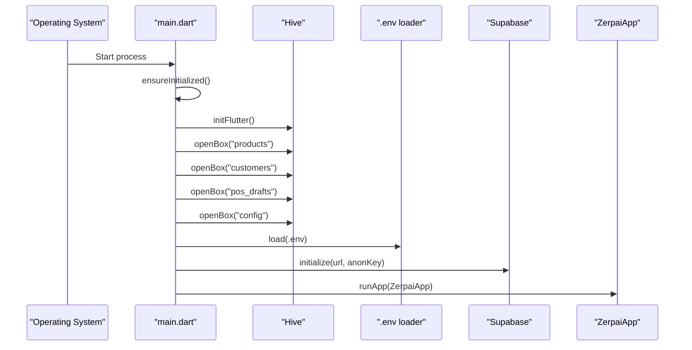
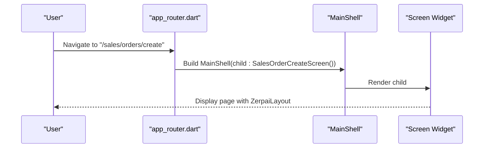
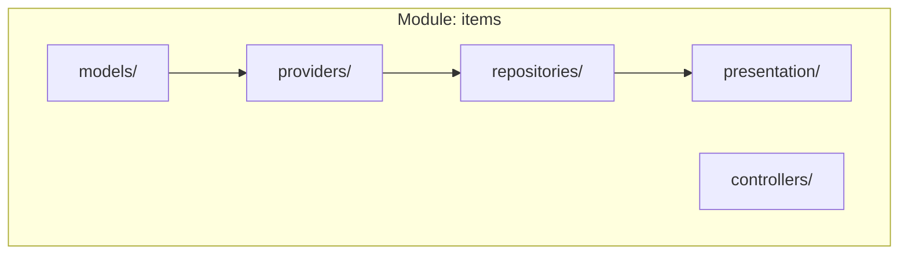
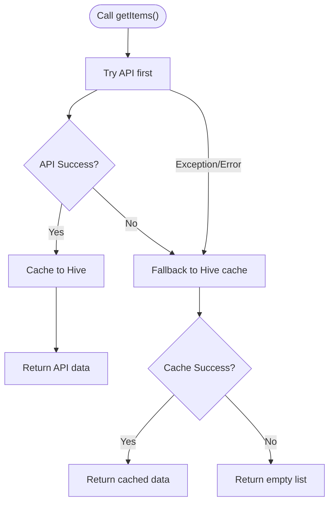
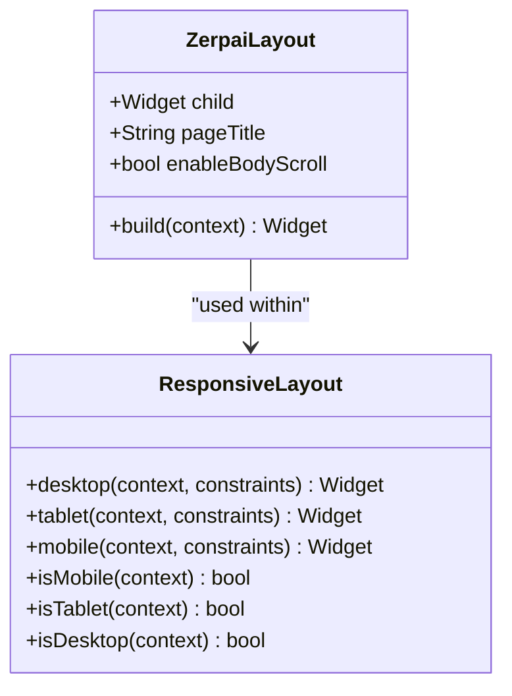
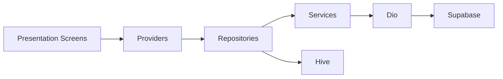

# Flutter Application Structure

<cite>
**Referenced Files in This Document**
- [main.dart](file://lib/main.dart)
- [app.dart](file://lib/app.dart)
- [app_router.dart](file://lib/core/router/app_router.dart)
- [zerpai_layout.dart](file://lib/core/layout/zerpai_layout.dart)
- [app_theme.dart](file://lib/core/router/theme/app_theme.dart)
- [api_client.dart](file://lib/shared/services/api_client.dart)
- [items_item_create.dart](file://lib/modules/items/presentation/items_item_create.dart)
- [sales_sales_order_create.dart](file://lib/modules/sales/presentation/sales_sales_order_create.dart)
- [items_repository.dart](file://lib/modules/items/repositories/items_repository.dart)
- [items_repository_impl.dart](file://lib/modules/items/repositories/items_repository_impl.dart)
- [responsive_layout.dart](file://lib/shared/responsive/responsive_layout.dart)
- [app_colors.dart](file://lib/core/constants/app_colors.dart)
- [PRD.md](file://PRD/PRD.md)
- [prd_folder_structure.md](file://PRD/prd_folder_structure.md)
</cite>

## Table of Contents
1. [Introduction](#introduction)
2. [Project Structure](#project-structure)
3. [Core Components](#core-components)
4. [Architecture Overview](#architecture-overview)
5. [Detailed Component Analysis](#detailed-component-analysis)
6. [Dependency Analysis](#dependency-analysis)
7. [Performance Considerations](#performance-considerations)
8. [Troubleshooting Guide](#troubleshooting-guide)
9. [Conclusion](#conclusion)
10. [Appendices](#appendices)

## Introduction
This document explains the Flutter application structure of ZerpAI ERP as defined by the PRD and implemented in the codebase. It covers the modular architecture, directory hierarchy, file naming conventions, and the bootstrapping process. It also provides guidelines for adding new modules and features while maintaining consistency across the codebase.

## Project Structure
ZerpAI ERP follows a strict, standardized folder structure for the Flutter frontend:
- lib/core/: Core infrastructure and reusable components (routing, theme, layout, API client, logging, utilities, extensions)
- lib/shared/: Shared providers and models used across modules
- lib/modules/<module>/: Feature-specific modules with a consistent internal structure (models/, providers/, repositories/, presentation/)
- assets/: Static assets (images, icons, fonts)
- test/: Mirrors lib/ structure for unit, widget, and integration tests

**Diagram sources**
- [zerpai_layout.dart](file://lib/core/layout/zerpai_layout.dart#L1-L73)
- [app_router.dart](file://lib/core/router/app_router.dart#L1-L341)
- [app_theme.dart](file://lib/core/router/theme/app_theme.dart#L1-L93)
- [api_client.dart](file://lib/shared/services/api_client.dart#L1-L62)
- [items_item_create.dart](file://lib/modules/items/presentation/items_item_create.dart#L1-L200)
- [sales_sales_order_create.dart](file://lib/modules/sales/presentation/sales_sales_order_create.dart#L1-L200)

**Section sources**
- [PRD.md](file://PRD/PRD.md#L136-L160)
- [prd_folder_structure.md](file://PRD/prd_folder_structure.md#L21-L193)

## Core Components
- Application entry point: Initializes platform services, environment variables, and runs the app.
- Root app widget: MaterialApp configured with theme, initial route, and centralized routing.
- Centralized router: Defines all routes and wraps screens with a common layout shell.
- Core layout: Provides sidebar, navbar, and page header with a consistent Zerpai branding.
- Theme and colors: Centralized theme definitions and color constants.
- API client: Singleton Dio client with base options and interceptors.
- Responsive layout: Utility for device-specific layouts.

**Section sources**
- [main.dart](file://lib/main.dart#L1-L29)
- [app.dart](file://lib/app.dart#L1-L32)
- [app_router.dart](file://lib/core/router/app_router.dart#L1-L341)
- [zerpai_layout.dart](file://lib/core/layout/zerpai_layout.dart#L1-L73)
- [app_theme.dart](file://lib/core/router/theme/app_theme.dart#L1-L93)
- [app_colors.dart](file://lib/core/constants/app_colors.dart#L1-L10)
- [api_client.dart](file://lib/shared/services/api_client.dart#L1-L62)
- [responsive_layout.dart](file://lib/shared/responsive/responsive_layout.dart#L1-L48)

## Architecture Overview
The application follows an online-first architecture with offline fallback:
- UI layer (presentation) uses Riverpod for state management and calls into repositories.
- Repository layer abstracts data access and implements offline caching with Hive.
- Service layer handles HTTP requests via Dio.
- Core infrastructure (router, theme, layout) is shared across the app.

**Diagram sources**
- [items_item_create.dart](file://lib/modules/items/presentation/items_item_create.dart#L1-L200)
- [sales_sales_order_create.dart](file://lib/modules/sales/presentation/sales_sales_order_create.dart#L1-L200)
- [items_repository.dart](file://lib/modules/items/repositories/items_repository.dart#L1-L53)
- [items_repository_impl.dart](file://lib/modules/items/repositories/items_repository_impl.dart#L1-L200)
- [api_client.dart](file://lib/shared/services/api_client.dart#L1-L62)

## Detailed Component Analysis

### Application Bootstrapping
The app initializes platform services, environment variables, and Supabase, then runs the root app widget.

**Diagram sources**
- [main.dart](file://lib/main.dart#L8-L28)

**Section sources**
- [main.dart](file://lib/main.dart#L1-L29)

### Routing and Navigation
The centralized router defines all routes and wraps each screen with a common layout shell. The app sets an initial route and uses a map of routes to widgets.

**Diagram sources**
- [app_router.dart](file://lib/core/router/app_router.dart#L93-L170)
- [zerpai_layout.dart](file://lib/core/layout/zerpai_layout.dart#L35-L71)

**Section sources**
- [app_router.dart](file://lib/core/router/app_router.dart#L1-L341)
- [zerpai_layout.dart](file://lib/core/layout/zerpai_layout.dart#L1-L73)

### Module Structure and Patterns
Modules follow a standardized internal structure:
- models/: Data models for entities
- providers/: Riverpod providers for state
- controllers/: Optional business logic for complex flows
- repositories/: Abstract data access interface and implementation
- presentation/: Screens and widgets

**Diagram sources**
- [items_item_create.dart](file://lib/modules/items/presentation/items_item_create.dart#L1-L200)
- [items_repository.dart](file://lib/modules/items/repositories/items_repository.dart#L1-L53)
- [items_repository_impl.dart](file://lib/modules/items/repositories/items_repository_impl.dart#L1-L200)

**Section sources**
- [prd_folder_structure.md](file://PRD/prd_folder_structure.md#L196-L244)

### Data Access and Offline Strategy
The repository pattern separates data access logic:
- Abstract repository defines CRUD operations
- Implementation performs online-first fetch, caches to Hive, and falls back to cache on errors
- Services use Dio for HTTP requests

**Diagram sources**
- [items_repository_impl.dart](file://lib/modules/items/repositories/items_repository_impl.dart#L24-L112)

**Section sources**
- [items_repository.dart](file://lib/modules/items/repositories/items_repository.dart#L1-L53)
- [items_repository_impl.dart](file://lib/modules/items/repositories/items_repository_impl.dart#L1-L200)
- [api_client.dart](file://lib/shared/services/api_client.dart#L1-L62)

### UI Layout and Responsiveness
The Zerpai layout composes sidebar, navbar, page title, and content area. ResponsiveLayout adapts the UI based on viewport width.

**Diagram sources**
- [zerpai_layout.dart](file://lib/core/layout/zerpai_layout.dart#L5-L72)
- [responsive_layout.dart](file://lib/shared/responsive/responsive_layout.dart#L7-L47)

**Section sources**
- [zerpai_layout.dart](file://lib/core/layout/zerpai_layout.dart#L1-L73)
- [responsive_layout.dart](file://lib/shared/responsive/responsive_layout.dart#L1-L48)

### Theme and Branding
The theme defines colors, typography, and component styles. Color constants and theme definitions are centralized.

**Section sources**
- [app_theme.dart](file://lib/core/router/theme/app_theme.dart#L1-L93)
- [app_colors.dart](file://lib/core/constants/app_colors.dart#L1-L10)

## Dependency Analysis
The application enforces a clear dependency flow:
- Presentation depends on Riverpod providers
- Providers depend on repositories
- Repositories depend on services and Hive
- Services depend on Dio and environment configuration

**Diagram sources**
- [items_item_create.dart](file://lib/modules/items/presentation/items_item_create.dart#L1-L200)
- [items_repository_impl.dart](file://lib/modules/items/repositories/items_repository_impl.dart#L1-L200)
- [api_client.dart](file://lib/shared/services/api_client.dart#L1-L62)

**Section sources**
- [items_item_create.dart](file://lib/modules/items/presentation/items_item_create.dart#L1-L200)
- [sales_sales_order_create.dart](file://lib/modules/sales/presentation/sales_sales_order_create.dart#L1-L200)
- [items_repository_impl.dart](file://lib/modules/items/repositories/items_repository_impl.dart#L1-L200)
- [api_client.dart](file://lib/shared/services/api_client.dart#L1-L62)

## Performance Considerations
- Online-first with offline fallback minimizes latency and improves resilience.
- Hive caching reduces redundant network calls and supports offline operation.
- Riverpod enables fine-grained reactive updates and efficient state management.
- ResponsiveLayout helps optimize rendering across devices.

[No sources needed since this section provides general guidance]

## Troubleshooting Guide
Common areas to check when encountering issues:
- Environment variables: Ensure .env is loaded and keys are present.
- Hive initialization: Verify boxes are opened before use.
- Supabase configuration: Confirm URL and anonymous key are valid.
- Router: Validate route names and screen wrappers.
- Repository fallback: Confirm cache retrieval and error logs.

**Section sources**
- [main.dart](file://lib/main.dart#L20-L25)
- [app_router.dart](file://lib/core/router/app_router.dart#L93-L170)
- [items_repository_impl.dart](file://lib/modules/items/repositories/items_repository_impl.dart#L57-L82)

## Conclusion
ZerpAI ERP’s Flutter codebase adheres to a disciplined, modular architecture with strict folder conventions and naming rules. The centralized router, shared layout, and repository pattern with offline-first caching provide a scalable foundation. Following the PRD guidelines ensures consistency, maintainability, and readiness for future enhancements.

[No sources needed since this section summarizes without analyzing specific files]

## Appendices

### Guidelines for Adding a New Module
- Create the module directory with the standardized internal structure.
- Implement models, providers, repositories, and presentation files following naming conventions.
- Add routes in the centralized router and wrap screens with the common layout shell.
- Add corresponding tests mirroring the module structure.

**Section sources**
- [prd_folder_structure.md](file://PRD/prd_folder_structure.md#L196-L244)
- [app_router.dart](file://lib/core/router/app_router.dart#L93-L170)

### Guidelines for Creating New Features
- Use snake_case for filenames and follow the module’s internal structure.
- Prefer Riverpod for state management and repository pattern for data access.
- Wrap screens with ZerpaiLayout for consistent UI.
- Keep shared widgets in core/shared folders; module-specific widgets in modules/<module>/presentation/widgets/.
- Add tests in the mirrored test structure.

**Section sources**
- [PRD.md](file://PRD/PRD.md#L136-L160)
- [zerpai_layout.dart](file://lib/core/layout/zerpai_layout.dart#L1-L73)