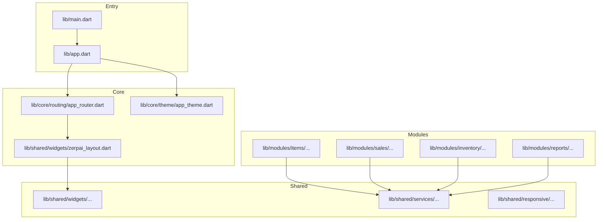
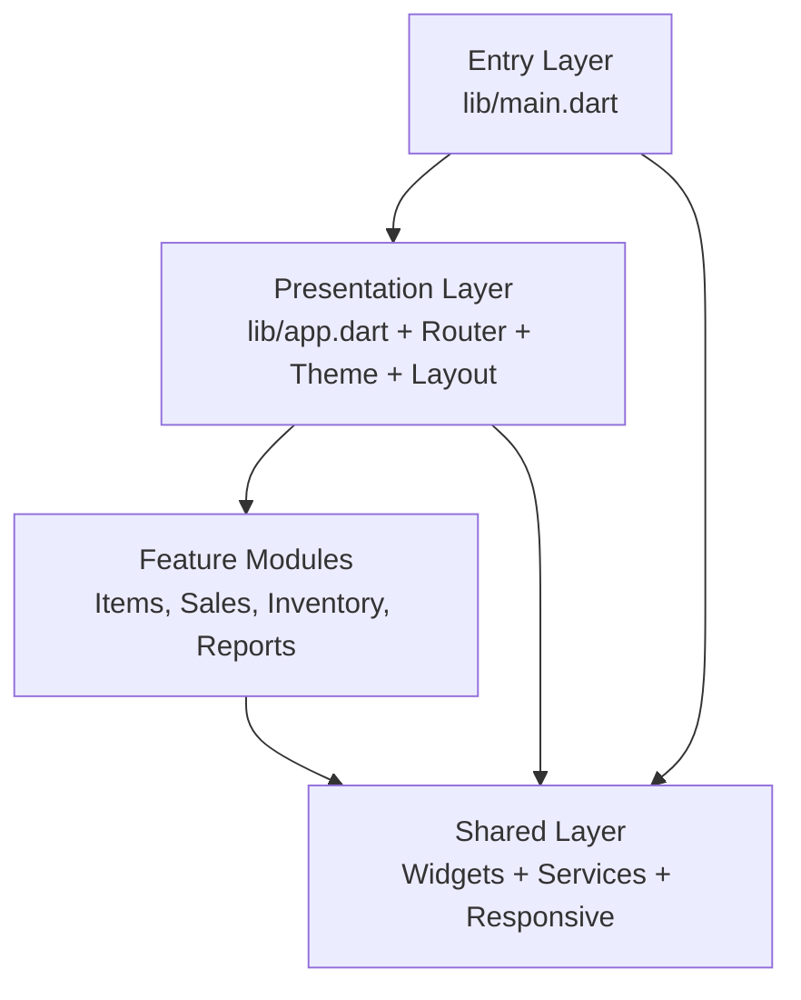
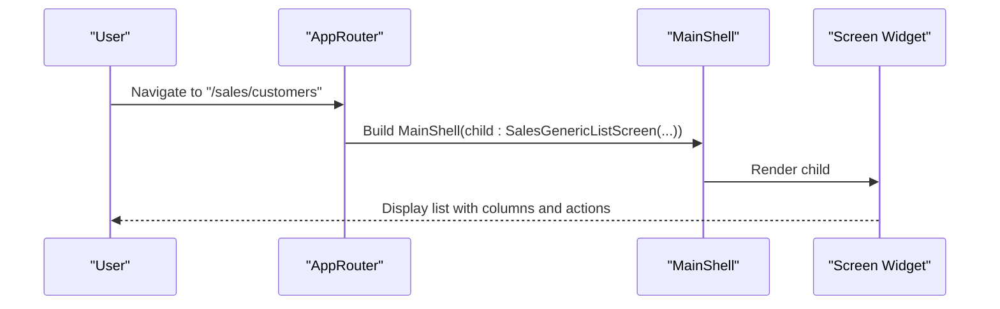
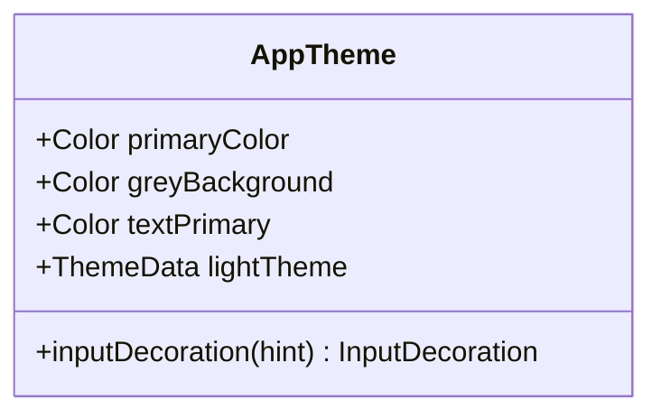
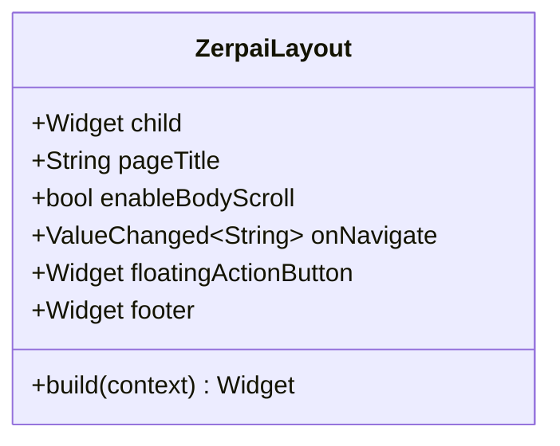
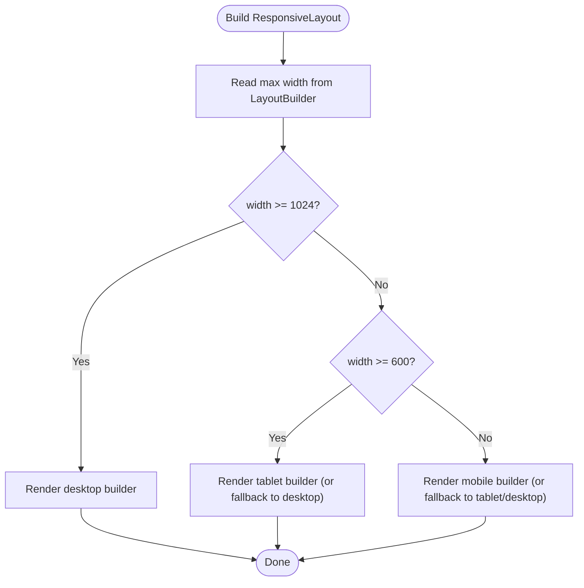
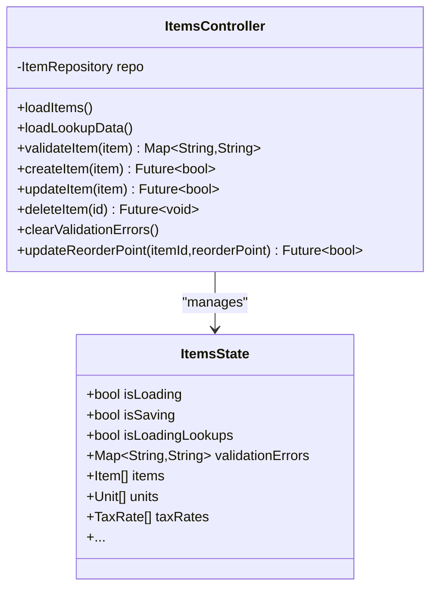
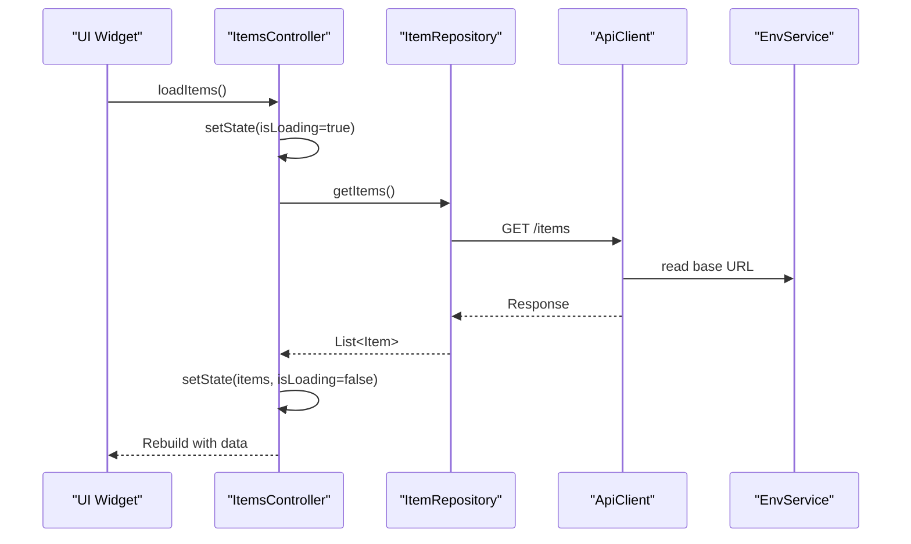
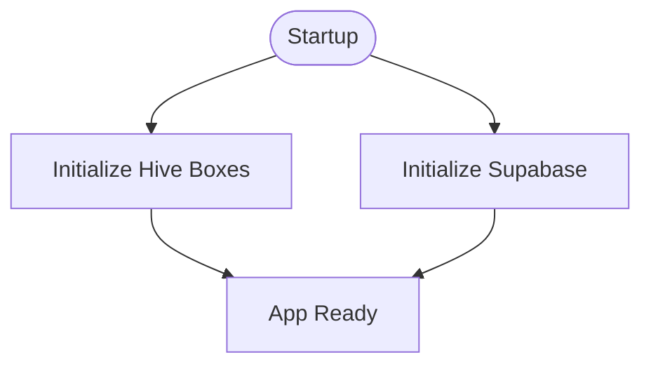
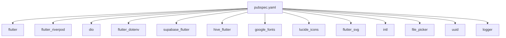

# Frontend Development

<cite>
**Referenced Files in This Document**
- [main.dart](file://lib/main.dart)
- [app.dart](file://lib/app.dart)
- [pubspec.yaml](file://pubspec.yaml)
- [app_router.dart](file://lib/core/routing/app_router.dart)
- [app_theme.dart](file://lib/core/theme/app_theme.dart)
- [zerpai_layout.dart](file://lib/shared/widgets/zerpai_layout.dart)
- [breakpoints.dart](file://lib/shared/responsive/breakpoints.dart)
- [responsive_context.dart](file://lib/shared/responsive/responsive_context.dart)
- [responsive_layout.dart](file://lib/shared/responsive/responsive_layout.dart)
- [items_controller.dart](file://lib/modules/items/controller/items_controller.dart)
- [items_state.dart](file://lib/modules/items/controller/items_state.dart)
- [api_client.dart](file://lib/shared/services/api_client.dart)
- [storage_service.dart](file://lib/shared/services/storage_service.dart)
- [env_service.dart](file://lib/shared/services/env_service.dart)
</cite>

## Table of Contents
1. [Introduction](#introduction)
2. [Project Structure](#project-structure)
3. [Core Components](#core-components)
4. [Architecture Overview](#architecture-overview)
5. [Detailed Component Analysis](#detailed-component-analysis)
6. [Dependency Analysis](#dependency-analysis)
7. [Performance Considerations](#performance-considerations)
8. [Troubleshooting Guide](#troubleshooting-guide)
9. [Conclusion](#conclusion)
10. [Appendices](#appendices)

## Introduction
This document provides comprehensive frontend development guidance for the Flutter-based ZerpAI ERP application. It explains the project structure, file naming conventions, module organization, Riverpod state management, routing, theming, reusable components, shared services, and utility functions. It also covers API integration patterns, error handling strategies, offline data synchronization, responsive design, and best practices for building new features consistently across the application.

Canonical placement rule:
- `lib/core/` = app infrastructure only
- `lib/core/layout/` = shell/navigation infrastructure only
- `lib/shared/widgets/` = reusable UI widgets and responsive UI primitives
- `lib/shared/services/` = cross-feature services
- `lib/modules/` = feature-specific code

## Project Structure
The application follows a layered, feature-based organization:
- Root entrypoint initializes platform services and runs the app.
- Core modules define cross-cutting concerns like routing, theming, and layout.
- Modules encapsulate feature domains (e.g., items, sales, inventory, reports).
- Shared contains reusable UI widgets, responsive utilities, and services.
- Tests reside under test/ for unit and widget tests.

**Diagram sources**
- [main.dart](file://lib/main.dart#L1-L29)
- [app.dart](file://lib/app.dart#L1-L32)
- [app_router.dart](file://lib/core/routing/app_router.dart#L1-L341)
- [app_theme.dart](file://lib/core/theme/app_theme.dart#L1-L85)
- [zerpai_layout.dart](file://lib/shared/widgets/zerpai_layout.dart#L1-L73)

**Section sources**
- [main.dart](file://lib/main.dart#L1-L29)
- [app.dart](file://lib/app.dart#L1-L32)
- [pubspec.yaml](file://pubspec.yaml#L1-L128)

## Core Components
- Initialization and bootstrapping:
  - Offline storage initialization, environment loading, and Supabase SDK initialization occur in the entrypoint.
- Centralized routing:
  - Routes are defined centrally and mapped to screen widgets, wrapped in a common shell for consistent layout.
- Theming:
  - Global theme configuration and reusable input decoration helpers are provided.
- Layout:
  - A shared layout composes sidebar, navbar, page title, and body content with optional footer and floating action button.
- Responsive utilities:
  - Breakpoints, device size helpers, and a responsive layout wrapper enable adaptive UIs.
- Riverpod state management:
  - Feature controllers extend StateNotifier with dedicated providers for reactive UI updates.
- Shared services:
  - API client, environment service, and storage service encapsulate networking, configuration, and cloud storage operations.

**Section sources**
- [main.dart](file://lib/main.dart#L8-L28)
- [app_router.dart](file://lib/core/routing/app_router.dart#L28-L276)
- [app_theme.dart](file://lib/core/theme/app_theme.dart#L10-L83)
- [zerpai_layout.dart](file://lib/shared/widgets/zerpai_layout.dart#L5-L72)
- [breakpoints.dart](file://lib/shared/responsive/breakpoints.dart#L8-L64)
- [responsive_layout.dart](file://lib/shared/responsive/responsive_layout.dart#L7-L47)
- [items_controller.dart](file://lib/modules/items/controller/items_controller.dart#L16-L23)
- [api_client.dart](file://lib/shared/services/api_client.dart#L6-L44)
- [env_service.dart](file://lib/shared/services/env_service.dart#L6-L71)
- [storage_service.dart](file://lib/shared/services/storage_service.dart#L9-L136)

## Architecture Overview
The frontend architecture emphasizes separation of concerns:
- Entry layer initializes platform integrations.
- Presentation layer uses a central router and shared layout.
- Domain layer organizes features into modules with controllers and repositories.
- Shared layer provides reusable UI, responsive utilities, and cross-cutting services.

**Diagram sources**
- [main.dart](file://lib/main.dart#L8-L28)
- [app.dart](file://lib/app.dart#L10-L29)
- [app_router.dart](file://lib/core/routing/app_router.dart#L93-L265)
- [zerpai_layout.dart](file://lib/shared/widgets/zerpai_layout.dart#L35-L71)

## Detailed Component Analysis

### Routing System
- Route definitions are centralized in a single file with named constants and a route map.
- Screens are wrapped in a common shell that applies consistent layout and navigation behavior.
- Placeholder screens are used for upcoming features.

**Diagram sources**
- [app_router.dart](file://lib/core/routing/app_router.dart#L93-L120)

**Section sources**
- [app_router.dart](file://lib/core/routing/app_router.dart#L29-L90)
- [app_router.dart](file://lib/core/routing/app_router.dart#L93-L265)
- [app_router.dart](file://lib/core/routing/app_router.dart#L268-L340)

### Theme Management
- Global theme configuration and reusable input decoration helpers are defined in a dedicated theme module.
- The app’s theme is applied at the root widget level.

**Diagram sources**
- [app_theme.dart](file://lib/core/theme/app_theme.dart#L5-L83)

**Section sources**
- [app_theme.dart](file://lib/core/theme/app_theme.dart#L10-L83)
- [app.dart](file://lib/app.dart#L17-L22)

### Layout and Navigation
- The shared layout composes sidebar, navbar, page title, and body content.
- Optional footer and floating action button slots are supported.
- The layout delegates navigation to the router via a callback.

**Diagram sources**
- [zerpai_layout.dart](file://lib/shared/widgets/zerpai_layout.dart#L5-L72)

**Section sources**
- [zerpai_layout.dart](file://lib/shared/widgets/zerpai_layout.dart#L24-L71)
- [zerpai_layout.dart](file://lib/shared/widgets/zerpai_layout.dart#L1-L2)

### Responsive Design
- Breakpoints define device categories and helper functions compute device sizes from width.
- A responsive layout wrapper switches between desktop/tablet/mobile views.
- A context extension provides convenient width/height and device size checks.

**Diagram sources**
- [responsive_layout.dart](file://lib/shared/responsive/responsive_layout.dart#L31-L46)

**Section sources**
- [breakpoints.dart](file://lib/shared/responsive/breakpoints.dart#L8-L64)
- [responsive_context.dart](file://lib/shared/responsive/responsive_context.dart#L5-L19)
- [responsive_layout.dart](file://lib/shared/responsive/responsive_layout.dart#L7-L47)

### Riverpod State Management
- Controllers extend StateNotifier and manage state transitions for loading, saving, validation, and error reporting.
- Providers wire controllers to repositories and expose state to widgets.
- Logging and error handling are integrated into state updates.

**Diagram sources**
- [items_controller.dart](file://lib/modules/items/controller/items_controller.dart#L16-L561)
- [items_state.dart](file://lib/modules/items/controller/items_state.dart)

**Section sources**
- [items_controller.dart](file://lib/modules/items/controller/items_controller.dart#L16-L23)
- [items_controller.dart](file://lib/modules/items/controller/items_controller.dart#L25-L60)
- [items_controller.dart](file://lib/modules/items/controller/items_controller.dart#L66-L184)
- [items_controller.dart](file://lib/modules/items/controller/items_controller.dart#L232-L288)
- [items_controller.dart](file://lib/modules/items/controller/items_controller.dart#L289-L346)
- [items_controller.dart](file://lib/modules/items/controller/items_controller.dart#L348-L378)
- [items_controller.dart](file://lib/modules/items/controller/items_controller.dart#L509-L511)
- [items_controller.dart](file://lib/modules/items/controller/items_controller.dart#L513-L560)

### API Integration Patterns
- A singleton API client wraps HTTP requests with timeouts and interceptors.
- Environment variables are accessed via a dedicated service for type-safe retrieval.
- Cloud storage operations integrate with external services using signed requests.

**Diagram sources**
- [items_controller.dart](file://lib/modules/items/controller/items_controller.dart#L25-L60)
- [api_client.dart](file://lib/shared/services/api_client.dart#L6-L44)
- [env_service.dart](file://lib/shared/services/env_service.dart#L6-L71)

**Section sources**
- [api_client.dart](file://lib/shared/services/api_client.dart#L6-L61)
- [env_service.dart](file://lib/shared/services/env_service.dart#L6-L71)
- [storage_service.dart](file://lib/shared/services/storage_service.dart#L25-L136)

### Offline Data Synchronization
- Offline storage is initialized at startup for core entities.
- The application integrates with Supabase for real-time and server-side capabilities.
- Image uploads leverage cloud storage with signed requests.

**Diagram sources**
- [main.dart](file://lib/main.dart#L11-L25)

**Section sources**
- [main.dart](file://lib/main.dart#L11-L25)

## Dependency Analysis
The frontend relies on a curated set of packages for UI, state management, networking, environment configuration, and storage.

**Diagram sources**
- [pubspec.yaml](file://pubspec.yaml#L38-L69)

**Section sources**
- [pubspec.yaml](file://pubspec.yaml#L38-L69)

## Performance Considerations
- Parallel loading of lookup data reduces initial load time.
- Logging includes performance timing for key operations.
- Responsive layouts minimize unnecessary rebuilds by switching views based on constraints.
- Use of Riverpod providers enables fine-grained reactivity and selective widget rebuilds.

**Section sources**
- [items_controller.dart](file://lib/modules/items/controller/items_controller.dart#L71-L88)
- [items_controller.dart](file://lib/modules/items/controller/items_controller.dart#L34-L35)

## Troubleshooting Guide
- Environment validation:
  - Ensure required environment variables are present before runtime.
- API connectivity:
  - Verify base URL and network availability; inspect request/response logs via interceptors.
- Storage operations:
  - Confirm credentials and bucket configuration for cloud storage uploads/deletes.
- State and error handling:
  - Review controller state transitions and error messages propagated to UI.

**Section sources**
- [env_service.dart](file://lib/shared/services/env_service.dart#L48-L70)
- [api_client.dart](file://lib/shared/services/api_client.dart#L27-L40)
- [storage_service.dart](file://lib/shared/services/storage_service.dart#L17-L23)
- [items_controller.dart](file://lib/modules/items/controller/items_controller.dart#L43-L58)

## Conclusion
ZerpAI ERP’s frontend is structured around clear layers and Riverpod-driven state management. The centralized router, shared layout, and responsive utilities promote consistency and scalability. Robust API integration, environment management, and offline initialization provide a solid foundation for feature development. Following the patterns documented here ensures maintainability and a cohesive user experience.

## Appendices

### Guidelines for Creating New Features
- Module organization:
  - Place feature-specific code under a dedicated module directory with controller, models, repositories, services, and presentation layers.
- State management:
  - Define a StateNotifier controller and a provider; keep state immutable and update via copyWith.
- Routing:
  - Add route constants and entries in the central router; wrap screens with the shared layout shell.
- UI consistency:
  - Use shared widgets and responsive utilities; adhere to breakpoint and device size helpers.
- API integration:
  - Encapsulate HTTP calls in a service using the shared API client; handle errors and propagate user-friendly messages.
- Offline support:
  - Initialize required Hive boxes at startup; design repositories to handle offline scenarios gracefully.

[No sources needed since this section provides general guidance]

