# Shared Components & Services

<cite>
**Referenced Files in This Document**
- [api_client.dart](file://lib/shared/services/api_client.dart)
- [env_service.dart](file://lib/shared/services/env_service.dart)
- [hive_service.dart](file://lib/shared/services/hive_service.dart)
- [storage_service.dart](file://lib/shared/services/storage_service.dart)
- [breakpoints.dart](file://lib/shared/responsive/breakpoints.dart)
- [responsive_context.dart](file://lib/shared/responsive/responsive_context.dart)
- [responsive_layout.dart](file://lib/shared/responsive/responsive_layout.dart)
- [responsive_form.dart](file://lib/shared/responsive/responsive_form.dart)
- [z_button.dart](file://lib/shared/widgets/z_button.dart)
- [form_row.dart](file://lib/shared/widgets/form_row.dart)
- [text_input.dart](file://lib/shared/widgets/inputs/text_input.dart)
- [custom_text_field.dart](file://lib/shared/widgets/inputs/custom_text_field.dart)
- [dropdown_input.dart](file://lib/shared/widgets/inputs/dropdown_input.dart)
- [radio_input.dart](file://lib/shared/widgets/inputs/radio_input.dart)
- [shared_field_layout.dart](file://lib/shared/widgets/inputs/shared_field_layout.dart)
</cite>

## Table of Contents
1. [Introduction](#introduction)
2. [Project Structure](#project-structure)
3. [Core Components](#core-components)
4. [Architecture Overview](#architecture-overview)
5. [Detailed Component Analysis](#detailed-component-analysis)
6. [Dependency Analysis](#dependency-analysis)
7. [Performance Considerations](#performance-considerations)
8. [Troubleshooting Guide](#troubleshooting-guide)
9. [Conclusion](#conclusion)
10. [Appendices](#appendices)

## Introduction
This document describes the shared components and services ecosystem in ZerpAI ERP. It covers:
- API client implementation and HTTP communication patterns
- Environment service for configuration management
- Hive service for local data persistence
- Reusable widget library including inputs, buttons, and form elements
- Responsive design utilities and cross-platform considerations
- Guidelines for creating new shared components, extending services, and maintaining reusability
- Accessibility, performance optimization, and testing strategies

## Project Structure
The shared layer is organized into three main areas:
- Services: centralized clients for HTTP, environment configuration, local storage, and cloud storage
- Responsive: breakpoint definitions and utilities for adaptive UI
- Widgets: reusable UI primitives for forms, inputs, and actions

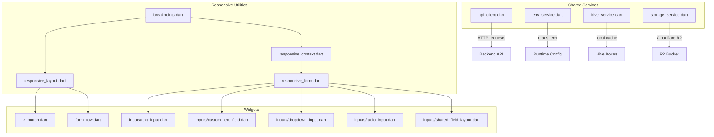

**Diagram sources**
- [api_client.dart](file://lib/shared/services/api_client.dart#L1-L62)
- [env_service.dart](file://lib/shared/services/env_service.dart#L1-L72)
- [hive_service.dart](file://lib/shared/services/hive_service.dart#L1-L134)
- [storage_service.dart](file://lib/shared/services/storage_service.dart#L1-L227)
- [breakpoints.dart](file://lib/shared/responsive/breakpoints.dart#L1-L64)
- [responsive_context.dart](file://lib/shared/responsive/responsive_context.dart#L1-L20)
- [responsive_layout.dart](file://lib/shared/responsive/responsive_layout.dart#L1-L48)
- [responsive_form.dart](file://lib/shared/responsive/responsive_form.dart#L1-L36)
- [z_button.dart](file://lib/shared/widgets/z_button.dart#L1-L75)
- [form_row.dart](file://lib/shared/widgets/form_row.dart#L1-L58)
- [text_input.dart](file://lib/shared/widgets/inputs/text_input.dart#L1-L44)
- [custom_text_field.dart](file://lib/shared/widgets/inputs/custom_text_field.dart#L1-L234)
- [dropdown_input.dart](file://lib/shared/widgets/inputs/dropdown_input.dart#L1-L608)
- [radio_input.dart](file://lib/shared/widgets/inputs/radio_input.dart#L1-L29)
- [shared_field_layout.dart](file://lib/shared/widgets/inputs/shared_field_layout.dart#L1-L148)

**Section sources**
- [api_client.dart](file://lib/shared/services/api_client.dart#L1-L62)
- [env_service.dart](file://lib/shared/services/env_service.dart#L1-L72)
- [hive_service.dart](file://lib/shared/services/hive_service.dart#L1-L134)
- [storage_service.dart](file://lib/shared/services/storage_service.dart#L1-L227)
- [breakpoints.dart](file://lib/shared/responsive/breakpoints.dart#L1-L64)
- [responsive_context.dart](file://lib/shared/responsive/responsive_context.dart#L1-L20)
- [responsive_layout.dart](file://lib/shared/responsive/responsive_layout.dart#L1-L48)
- [responsive_form.dart](file://lib/shared/responsive/responsive_form.dart#L1-L36)
- [z_button.dart](file://lib/shared/widgets/z_button.dart#L1-L75)
- [form_row.dart](file://lib/shared/widgets/form_row.dart#L1-L58)
- [text_input.dart](file://lib/shared/widgets/inputs/text_input.dart#L1-L44)
- [custom_text_field.dart](file://lib/shared/widgets/inputs/custom_text_field.dart#L1-L234)
- [dropdown_input.dart](file://lib/shared/widgets/inputs/dropdown_input.dart#L1-L608)
- [radio_input.dart](file://lib/shared/widgets/inputs/radio_input.dart#L1-L29)
- [shared_field_layout.dart](file://lib/shared/widgets/inputs/shared_field_layout.dart#L1-L148)

## Core Components
- API Client: Singleton HTTP client built on Dio with environment-driven base URL, timeouts, JSON headers, and interceptors.
- Environment Service: Type-safe loader and validator for .env-backed configuration (Supabase, R2, environment mode).
- Hive Service: Centralized local cache manager for products, customers, POS drafts, and config metadata.
- Storage Service: Cloudflare R2 image upload and deletion utilities with AWS4-style signing.
- Responsive Utilities: Breakpoint constants, device-size helpers, and layout wrappers for adaptive UI.
- Widget Library: Buttons, form rows, inputs (text, dropdown, radio), and a shared field layout with tooltips and compact modes.

**Section sources**
- [api_client.dart](file://lib/shared/services/api_client.dart#L6-L43)
- [env_service.dart](file://lib/shared/services/env_service.dart#L6-L71)
- [hive_service.dart](file://lib/shared/services/hive_service.dart#L6-L133)
- [storage_service.dart](file://lib/shared/services/storage_service.dart#L9-L226)
- [breakpoints.dart](file://lib/shared/responsive/breakpoints.dart#L8-L64)
- [responsive_context.dart](file://lib/shared/responsive/responsive_context.dart#L5-L19)
- [responsive_layout.dart](file://lib/shared/responsive/responsive_layout.dart#L7-L47)
- [responsive_form.dart](file://lib/shared/responsive/responsive_form.dart#L6-L35)
- [z_button.dart](file://lib/shared/widgets/z_button.dart#L3-L28)
- [form_row.dart](file://lib/shared/widgets/form_row.dart#L4-L16)
- [text_input.dart](file://lib/shared/widgets/inputs/text_input.dart#L4-L16)
- [custom_text_field.dart](file://lib/shared/widgets/inputs/custom_text_field.dart#L12-L51)
- [dropdown_input.dart](file://lib/shared/widgets/inputs/dropdown_input.dart#L4-L53)
- [radio_input.dart](file://lib/shared/widgets/inputs/radio_input.dart#L5-L17)
- [shared_field_layout.dart](file://lib/shared/widgets/inputs/shared_field_layout.dart#L6-L34)

## Architecture Overview
The shared layer provides a cohesive foundation for UI, networking, configuration, and persistence across platforms. The diagram below maps actual source files and their interactions.

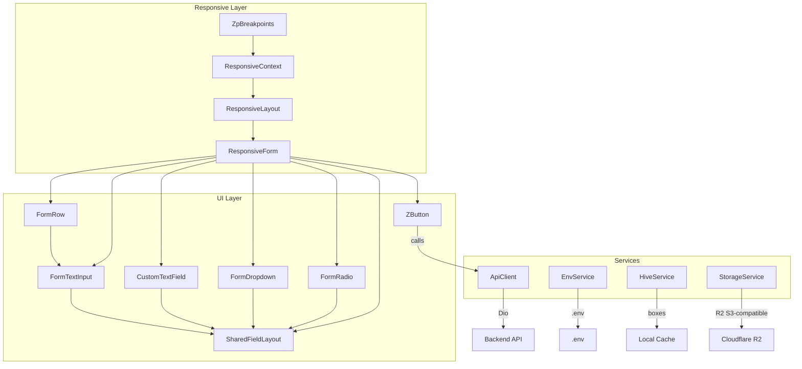

**Diagram sources**
- [z_button.dart](file://lib/shared/widgets/z_button.dart#L3-L28)
- [form_row.dart](file://lib/shared/widgets/form_row.dart#L4-L16)
- [text_input.dart](file://lib/shared/widgets/inputs/text_input.dart#L4-L16)
- [custom_text_field.dart](file://lib/shared/widgets/inputs/custom_text_field.dart#L12-L51)
- [dropdown_input.dart](file://lib/shared/widgets/inputs/dropdown_input.dart#L4-L53)
- [radio_input.dart](file://lib/shared/widgets/inputs/radio_input.dart#L5-L17)
- [shared_field_layout.dart](file://lib/shared/widgets/inputs/shared_field_layout.dart#L6-L34)
- [breakpoints.dart](file://lib/shared/responsive/breakpoints.dart#L8-L64)
- [responsive_context.dart](file://lib/shared/responsive/responsive_context.dart#L5-L19)
- [responsive_layout.dart](file://lib/shared/responsive/responsive_layout.dart#L7-L47)
- [responsive_form.dart](file://lib/shared/responsive/responsive_form.dart#L6-L35)
- [api_client.dart](file://lib/shared/services/api_client.dart#L6-L43)
- [env_service.dart](file://lib/shared/services/env_service.dart#L6-L71)
- [hive_service.dart](file://lib/shared/services/hive_service.dart#L6-L133)
- [storage_service.dart](file://lib/shared/services/storage_service.dart#L9-L226)

## Detailed Component Analysis

### API Client
- Purpose: Provide a singleton HTTP client with environment-driven base URL, timeouts, and JSON headers.
- Interceptors: Wrapper for request/response/error logging hooks.
- Methods: get, post, put, delete delegating to Dio.

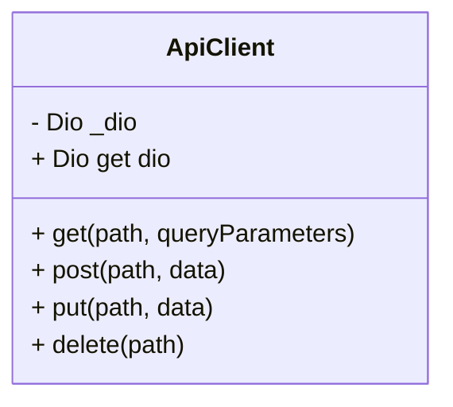

**Diagram sources**
- [api_client.dart](file://lib/shared/services/api_client.dart#L6-L43)

**Section sources**
- [api_client.dart](file://lib/shared/services/api_client.dart#L6-L43)

### Environment Service
- Purpose: Load and expose environment variables with validation and environment mode detection.
- Validation: Ensures required keys are present; throws descriptive errors if missing.

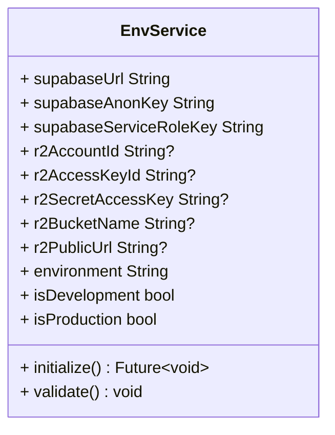

**Diagram sources**
- [env_service.dart](file://lib/shared/services/env_service.dart#L6-L71)

**Section sources**
- [env_service.dart](file://lib/shared/services/env_service.dart#L6-L71)

### Hive Service
- Purpose: Centralized local cache for products, customers, POS drafts, and config metadata.
- Features: Save/get/delete per entity, last-sync timestamps, cache stats, and safe clearing.

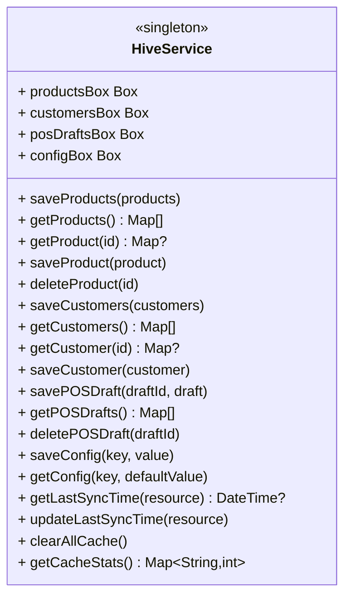

**Diagram sources**
- [hive_service.dart](file://lib/shared/services/hive_service.dart#L6-L133)

**Section sources**
- [hive_service.dart](file://lib/shared/services/hive_service.dart#L6-L133)

### Storage Service (Cloudflare R2)
- Purpose: Upload and delete images to R2 using AWS4 signature computation compatible with S3-compatible endpoints.
- Upload: Iterates files, computes SHA256, builds canonical request, signs, and sends PUT.
- Delete: Computes signature and sends DELETE to object path.

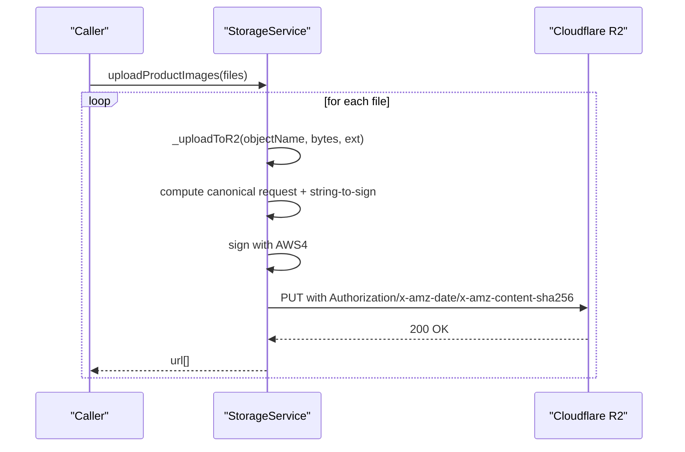

**Diagram sources**
- [storage_service.dart](file://lib/shared/services/storage_service.dart#L25-L136)

**Section sources**
- [storage_service.dart](file://lib/shared/services/storage_service.dart#L25-L136)

### Responsive Utilities
- Breakpoints: Logical constants and device-size helpers for media queries.
- Context extensions: Width/height, device-type booleans, and column width constraints.
- Layout wrapper: Desktop/tablet/mobile branching with LayoutBuilder.
- Form layout: Wrap-based responsive form with constrained column widths.

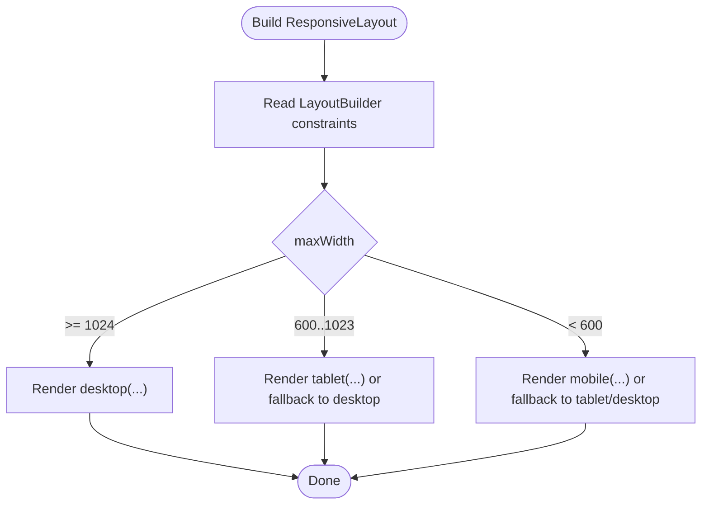

**Diagram sources**
- [responsive_layout.dart](file://lib/shared/responsive/responsive_layout.dart#L31-L46)

**Section sources**
- [breakpoints.dart](file://lib/shared/responsive/breakpoints.dart#L8-L64)
- [responsive_context.dart](file://lib/shared/responsive/responsive_context.dart#L5-L19)
- [responsive_layout.dart](file://lib/shared/responsive/responsive_layout.dart#L7-L47)
- [responsive_form.dart](file://lib/shared/responsive/responsive_form.dart#L6-L35)

### Widget Library

#### ZButton
- Purpose: Unified primary/secondary button with loading state and consistent sizing.
- Behaviors: Disabled onPressed when loading, distinct styles for primary vs secondary.

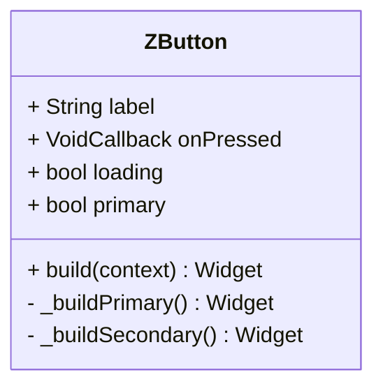

**Diagram sources**
- [z_button.dart](file://lib/shared/widgets/z_button.dart#L3-L28)

**Section sources**
- [z_button.dart](file://lib/shared/widgets/z_button.dart#L3-L28)

#### FormRow
- Purpose: Label + helper + child layout with required asterisk and consistent spacing.

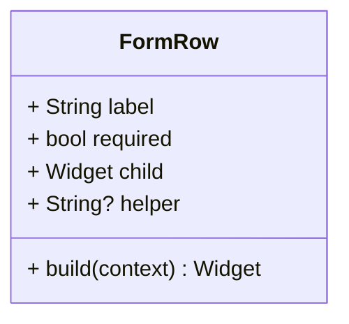

**Diagram sources**
- [form_row.dart](file://lib/shared/widgets/form_row.dart#L4-L16)

**Section sources**
- [form_row.dart](file://lib/shared/widgets/form_row.dart#L4-L16)

#### Inputs

##### FormTextInput
- Purpose: Lightweight text input with theme-aware styles and multiline support.

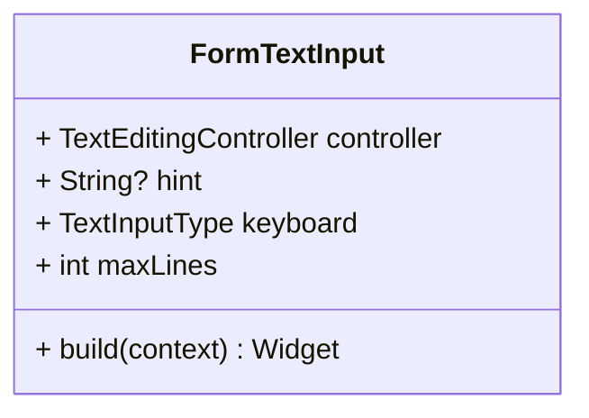

**Diagram sources**
- [text_input.dart](file://lib/shared/widgets/inputs/text_input.dart#L4-L16)

**Section sources**
- [text_input.dart](file://lib/shared/widgets/inputs/text_input.dart#L4-L16)

##### CustomTextField
- Purpose: Rich text input with label, prefix icon/widget, error state, focus styling, uppercase formatter, and multiline support.

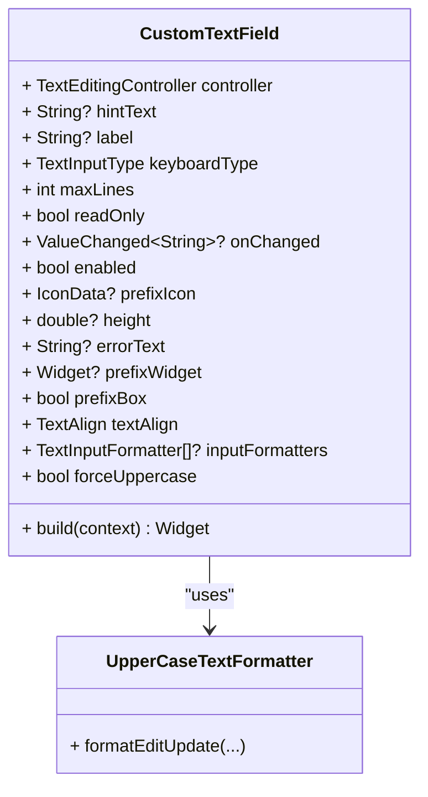

**Diagram sources**
- [custom_text_field.dart](file://lib/shared/widgets/inputs/custom_text_field.dart#L12-L51)
- [custom_text_field.dart](file://lib/shared/widgets/inputs/custom_text_field.dart#L222-L233)

**Section sources**
- [custom_text_field.dart](file://lib/shared/widgets/inputs/custom_text_field.dart#L12-L51)
- [custom_text_field.dart](file://lib/shared/widgets/inputs/custom_text_field.dart#L222-L233)

##### FormDropdown
- Purpose: Advanced dropdown with search, settings row, custom item rendering, per-item enablement, clear, and overlay positioning.

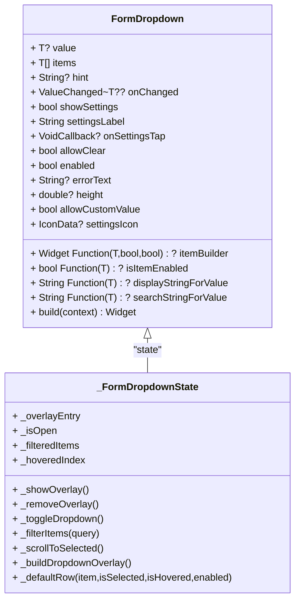

**Diagram sources**
- [dropdown_input.dart](file://lib/shared/widgets/inputs/dropdown_input.dart#L4-L53)
- [dropdown_input.dart](file://lib/shared/widgets/inputs/dropdown_input.dart#L56-L119)

**Section sources**
- [dropdown_input.dart](file://lib/shared/widgets/inputs/dropdown_input.dart#L4-L53)
- [dropdown_input.dart](file://lib/shared/widgets/inputs/dropdown_input.dart#L56-L119)

##### FormRadio
- Purpose: Simple radio with label and theme-aware text style.

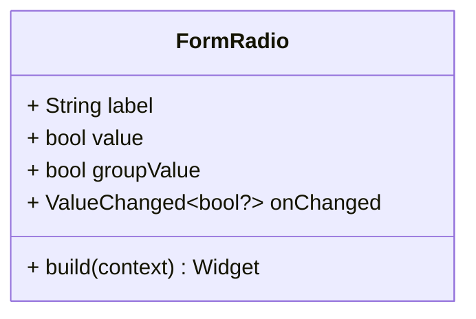

**Diagram sources**
- [radio_input.dart](file://lib/shared/widgets/inputs/radio_input.dart#L5-L17)

**Section sources**
- [radio_input.dart](file://lib/shared/widgets/inputs/radio_input.dart#L5-L17)

##### SharedFieldLayout
- Purpose: Adaptive label/input layout with tooltip, compact horizontal mode, and helper text.

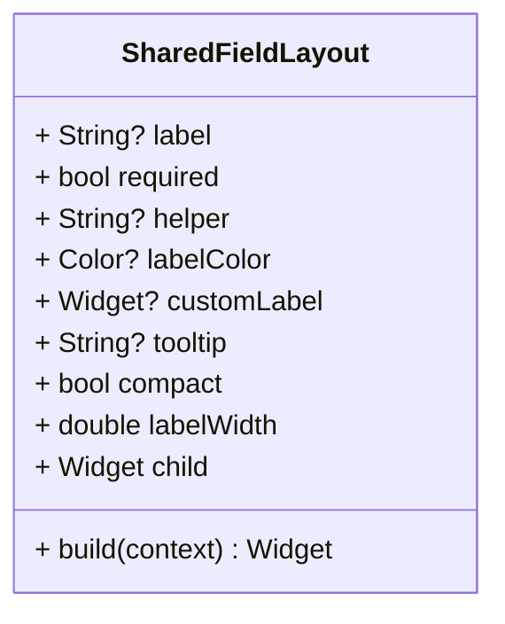

**Diagram sources**
- [shared_field_layout.dart](file://lib/shared/widgets/inputs/shared_field_layout.dart#L6-L34)

**Section sources**
- [shared_field_layout.dart](file://lib/shared/widgets/inputs/shared_field_layout.dart#L6-L34)

## Dependency Analysis
- Services depend on external libraries:
  - ApiClient depends on Dio and flutter_dotenv
  - EnvService depends on flutter_dotenv
  - HiveService depends on hive_flutter
  - StorageService depends on crypto, dio, file_picker, flutter/foundation, flutter_dotenv
- Widgets depend on Flutter material and theme styles
- Responsive utilities depend on Flutter widgets and media queries

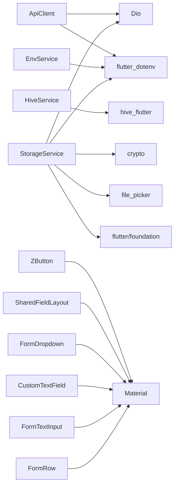

**Diagram sources**
- [api_client.dart](file://lib/shared/services/api_client.dart#L3-L4)
- [env_service.dart](file://lib/shared/services/env_service.dart#L3)
- [hive_service.dart](file://lib/shared/services/hive_service.dart#L4)
- [storage_service.dart](file://lib/shared/services/storage_service.dart#L1-L8)
- [z_button.dart](file://lib/shared/widgets/z_button.dart#L1)
- [shared_field_layout.dart](file://lib/shared/widgets/inputs/shared_field_layout.dart#L1-L4)
- [dropdown_input.dart](file://lib/shared/widgets/inputs/dropdown_input.dart#L1-L3)
- [custom_text_field.dart](file://lib/shared/widgets/inputs/custom_text_field.dart#L1-L4)
- [text_input.dart](file://lib/shared/widgets/inputs/text_input.dart#L1-L3)
- [form_row.dart](file://lib/shared/widgets/form_row.dart#L1-L2)

**Section sources**
- [api_client.dart](file://lib/shared/services/api_client.dart#L3-L4)
- [env_service.dart](file://lib/shared/services/env_service.dart#L3)
- [hive_service.dart](file://lib/shared/services/hive_service.dart#L4)
- [storage_service.dart](file://lib/shared/services/storage_service.dart#L1-L8)
- [z_button.dart](file://lib/shared/widgets/z_button.dart#L1)
- [shared_field_layout.dart](file://lib/shared/widgets/inputs/shared_field_layout.dart#L1-L4)
- [dropdown_input.dart](file://lib/shared/widgets/inputs/dropdown_input.dart#L1-L3)
- [custom_text_field.dart](file://lib/shared/widgets/inputs/custom_text_field.dart#L1-L4)
- [text_input.dart](file://lib/shared/widgets/inputs/text_input.dart#L1-L3)
- [form_row.dart](file://lib/shared/widgets/form_row.dart#L1-L2)

## Performance Considerations
- API Client
  - Reuse the singleton Dio instance to avoid connection overhead.
  - Keep timeouts reasonable; adjust per environment.
- Hive Service
  - Batch operations (clear + put loops) are synchronous; consider chunking large datasets.
  - Use targeted getters (single record) to minimize deserialization costs.
- Storage Service
  - Compute SHA256 per file; ensure efficient file picking and early exits for null bytes.
  - Consider retry/backoff for transient network failures.
- Widgets
  - Avoid unnecessary rebuilds by passing immutable props and using const constructors where possible.
  - Dropdown overlay uses OverlayEntry; ensure removal on dispose to prevent leaks.
- Responsive
  - Prefer LayoutBuilder and MediaQuery checks sparingly; cache computed sizes when reused.

[No sources needed since this section provides general guidance]

## Troubleshooting Guide
- Environment validation failures
  - Symptom: Startup throws environment validation errors.
  - Action: Verify required keys are present in .env and call initialization before use.
- API errors
  - Symptom: Network failures or timeouts.
  - Action: Inspect base URL, headers, and interceptor logs; confirm backend availability.
- Hive cache inconsistencies
  - Symptom: Stale or missing records.
  - Action: Confirm box names, last sync timestamps, and clear cache selectively when needed.
- R2 upload failures
  - Symptom: Images not uploaded or returned URLs unusable.
  - Action: Check credentials, bucket permissions, and whether public access is configured; review signatures and endpoint formatting.

**Section sources**
- [env_service.dart](file://lib/shared/services/env_service.dart#L48-L70)
- [api_client.dart](file://lib/shared/services/api_client.dart#L13-L40)
- [hive_service.dart](file://lib/shared/services/hive_service.dart#L118-L132)
- [storage_service.dart](file://lib/shared/services/storage_service.dart#L108-L136)

## Conclusion
The shared layer in ZerpAI ERP provides a robust, reusable foundation for networking, configuration, persistence, and UI. By adhering to the patterns and guidelines outlined here—singleton services, validated environments, efficient caching, responsive layouts, and accessible widgets—you can extend the system reliably across platforms while maintaining performance and usability.

[No sources needed since this section summarizes without analyzing specific files]

## Appendices

### Creating New Shared Components
- Choose the appropriate location under lib/shared/widgets or lib/shared/responsive.
- Prefer const constructors and immutable props.
- Use theme-aware styles and consistent spacing.
- Add LayoutBuilder or MediaQuery usage for responsive behavior.
- Provide clear labels, helpers, and tooltips for accessibility.

[No sources needed since this section provides general guidance]

### Extending Services
- API Client: Add interceptors for logging or auth tokens; keep base URL configurable.
- Env Service: Add typed getters and validation for new keys.
- Hive Service: Add new boxes and CRUD helpers; maintain last sync and stats.
- Storage Service: Add new upload/delete flows with proper signing and error handling.

[No sources needed since this section provides general guidance]

### Testing Strategies
- Unit tests for services: mock Dio/Hive/R2 interactions; assert environment validation and error paths.
- Widget tests: verify layout branches, disabled/enabled states, and overlay interactions.
- Integration tests: end-to-end flows for API calls and local cache updates.

[No sources needed since this section provides general guidance]