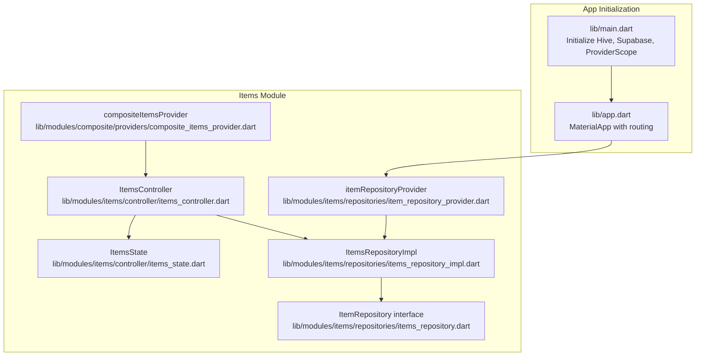
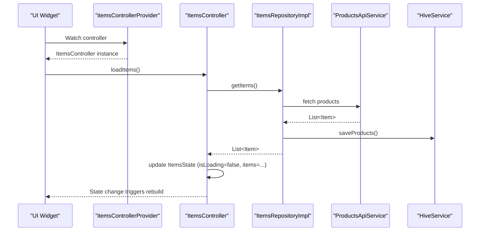
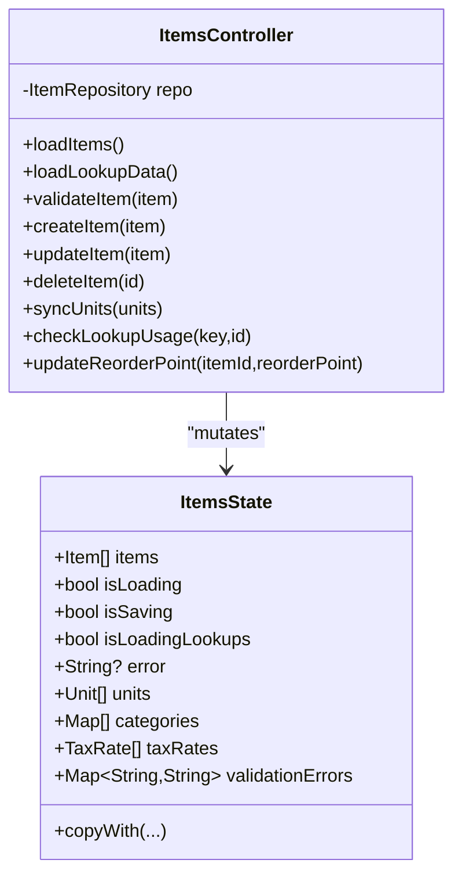
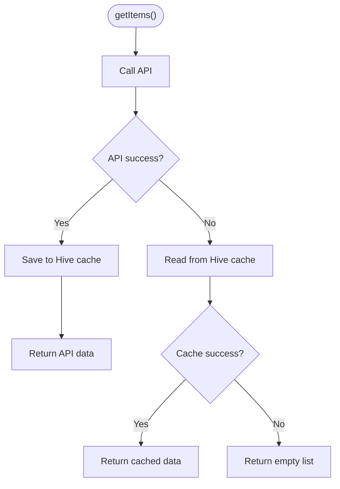
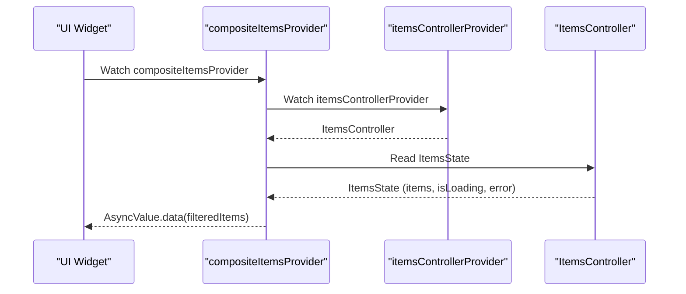
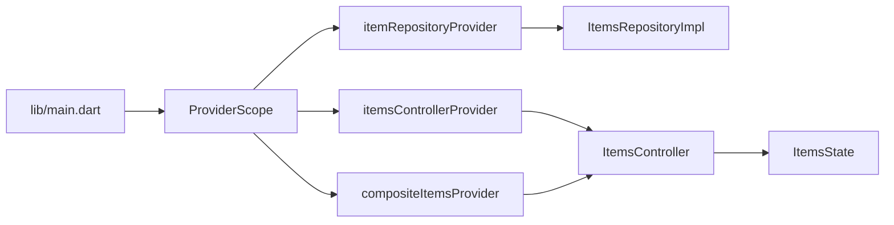

# State Management with Riverpod

<cite>
**Referenced Files in This Document**
- [items_controller.dart](file://lib/modules/items/controller/items_controller.dart)
- [items_state.dart](file://lib/modules/items/controller/items_state.dart)
- [composite_items_provider.dart](file://lib/modules/composite/providers/composite_items_provider.dart)
- [item_repository_provider.dart](file://lib/modules/items/repositories/item_repository_provider.dart)
- [items_repository.dart](file://lib/modules/items/repositories/items_repository.dart)
- [items_repository_impl.dart](file://lib/modules/items/repositories/items_repository_impl.dart)
- [supabase_item_repository.dart](file://lib/modules/items/repositories/supabase_item_repository.dart)
- [main.dart](file://lib/main.dart)
- [app.dart](file://lib/app.dart)
</cite>

## Table of Contents
1. [Introduction](#introduction)
2. [Project Structure](#project-structure)
3. [Core Components](#core-components)
4. [Architecture Overview](#architecture-overview)
5. [Detailed Component Analysis](#detailed-component-analysis)
6. [Dependency Analysis](#dependency-analysis)
7. [Performance Considerations](#performance-considerations)
8. [Troubleshooting Guide](#troubleshooting-guide)
9. [Conclusion](#conclusion)
10. [Appendices](#appendices)

## Introduction
This document explains the Riverpod-based state management implementation in ZerpAI ERP with a focus on the Items module. It covers the provider pattern, reactive programming concepts, and how controllers, providers, and repositories coordinate between UI and data layers. It also documents the state lifecycle, provider inheritance, dependency injection, and practical guidance for creating new providers, managing complex state, and optimizing performance. Finally, it outlines common pitfalls, debugging techniques, and best practices for scalable state management.

## Project Structure
ZerpAI initializes Riverpod at the application root and organizes state management around the Items module. Providers are declared in feature-specific locations, while repositories encapsulate data access and offline caching.

**Diagram sources**
- [main.dart](file://lib/main.dart#L1-L29)
- [app.dart](file://lib/app.dart#L1-L32)
- [items_controller.dart](file://lib/modules/items/controller/items_controller.dart#L16-L568)
- [items_state.dart](file://lib/modules/items/controller/items_state.dart#L7-L113)
- [items_repository.dart](file://lib/modules/items/repositories/items_repository.dart#L3-L53)
- [items_repository_impl.dart](file://lib/modules/items/repositories/items_repository_impl.dart#L14-L297)
- [item_repository_provider.dart](file://lib/modules/items/repositories/item_repository_provider.dart#L8-L12)
- [composite_items_provider.dart](file://lib/modules/composite/providers/composite_items_provider.dart#L8-L26)

**Section sources**
- [main.dart](file://lib/main.dart#L1-L29)
- [app.dart](file://lib/app.dart#L1-L32)
- [items_controller.dart](file://lib/modules/items/controller/items_controller.dart#L1-L568)
- [items_state.dart](file://lib/modules/items/controller/items_state.dart#L1-L113)
- [items_repository.dart](file://lib/modules/items/repositories/items_repository.dart#L1-L53)
- [items_repository_impl.dart](file://lib/modules/items/repositories/items_repository_impl.dart#L1-L297)
- [item_repository_provider.dart](file://lib/modules/items/repositories/item_repository_provider.dart#L1-L12)
- [composite_items_provider.dart](file://lib/modules/composite/providers/composite_items_provider.dart#L1-L26)

## Core Components
- ItemsController: A StateNotifier that manages ItemsState, orchestrates data loading, validation, persistence, and lookup synchronization. It exposes methods to load items, load lookup data, validate items, create/update/delete items, and manage reorder points.
- ItemsState: Immutable snapshot of the Items domain state, including lists, flags, errors, and validation maps.
- Repositories: Abstraction via ItemRepository and production implementation ItemsRepositoryImpl with online-first caching and offline fallback. A Supabase-backed alternative is available.
- Providers: itemRepositoryProvider injects the repository; itemsControllerProvider constructs the controller with DI; compositeItemsProvider transforms controller state into filtered AsyncValue.

Key responsibilities:
- StateNotifier-driven updates: All UI reactions derive from ItemsState mutations.
- Reactive reads: UI widgets watch providers and rebuild on state changes.
- Dependency injection: Providers supply repositories and controllers to consumers.

**Section sources**
- [items_controller.dart](file://lib/modules/items/controller/items_controller.dart#L16-L568)
- [items_state.dart](file://lib/modules/items/controller/items_state.dart#L7-L113)
- [items_repository.dart](file://lib/modules/items/repositories/items_repository.dart#L3-L53)
- [items_repository_impl.dart](file://lib/modules/items/repositories/items_repository_impl.dart#L14-L297)
- [supabase_item_repository.dart](file://lib/modules/items/repositories/supabase_item_repository.dart#L7-L42)
- [item_repository_provider.dart](file://lib/modules/items/repositories/item_repository_provider.dart#L8-L12)
- [composite_items_provider.dart](file://lib/modules/composite/providers/composite_items_provider.dart#L8-L26)

## Architecture Overview
The system follows a layered architecture:
- UI layer: Widgets observe Riverpod providers and render based on state.
- Controller layer: ItemsController coordinates data operations and updates ItemsState.
- Repository layer: ItemRepository and ItemsRepositoryImpl handle API calls, caching, and offline fallback.
- Services: LookupsApiService and ProductsApiService provide external data and synchronization.

**Diagram sources**
- [items_controller.dart](file://lib/modules/items/controller/items_controller.dart#L25-L60)
- [items_repository_impl.dart](file://lib/modules/items/repositories/items_repository_impl.dart#L24-L83)
- [items_repository_provider.dart](file://lib/modules/items/repositories/item_repository_provider.dart#L8-L12)

## Detailed Component Analysis

### ItemsController and ItemsState
ItemsController extends StateNotifier<ItemsState> and encapsulates:
- Loading lifecycle: toggles isLoading and isLoadingLookups during async operations.
- Error handling: maps exceptions to user-friendly messages and clears on success.
- Validation: client-side validation prior to create/update.
- CRUD operations: delegates to repository and refreshes state.
- Lookup synchronization: parallel loading and per-lookup normalization; generic sync helpers for multiple lookup types.

ItemsState holds immutable snapshots of:
- Core lists: items, units, categories, tax rates, and many lookup collections.
- Flags: isLoading, isSaving, isLoadingLookups, selectedItemId.
- Errors and validation maps.

**Diagram sources**
- [items_state.dart](file://lib/modules/items/controller/items_state.dart#L7-L113)
- [items_controller.dart](file://lib/modules/items/controller/items_controller.dart#L16-L568)

**Section sources**
- [items_controller.dart](file://lib/modules/items/controller/items_controller.dart#L16-L568)
- [items_state.dart](file://lib/modules/items/controller/items_state.dart#L7-L113)

### Repository Layer and Offline Support
ItemsRepositoryImpl implements ItemRepository with an online-first strategy:
- getItems(): attempts API, caches to Hive, falls back to cache on network/API errors.
- getItemById(): similar online-first pattern with caching.
- create/update/delete: persist via API and update cache.
- Utility methods: forceRefresh, hasOfflineData, getCacheInfo.

Supabase-backed alternative (SupabaseItemRepository) delegates to ProductsApiService for all operations.

**Diagram sources**
- [items_repository_impl.dart](file://lib/modules/items/repositories/items_repository_impl.dart#L24-L112)

**Section sources**
- [items_repository.dart](file://lib/modules/items/repositories/items_repository.dart#L3-L53)
- [items_repository_impl.dart](file://lib/modules/items/repositories/items_repository_impl.dart#L14-L297)
- [supabase_item_repository.dart](file://lib/modules/items/repositories/supabase_item_repository.dart#L7-L42)

### Provider Pattern and Dependency Injection
- itemRepositoryProvider: Supplies ItemsRepositoryImpl to consumers.
- itemsControllerProvider: Constructs ItemsController with injected repository and auto-initializes loadItems and loadLookupData.
- compositeItemsProvider: Watches itemsControllerProvider and produces AsyncValue<List<Item>> filtered for composite items.

**Diagram sources**
- [composite_items_provider.dart](file://lib/modules/composite/providers/composite_items_provider.dart#L8-L26)
- [items_controller.dart](file://lib/modules/items/controller/items_controller.dart#L563-L568)
- [item_repository_provider.dart](file://lib/modules/items/repositories/item_repository_provider.dart#L8-L12)

**Section sources**
- [item_repository_provider.dart](file://lib/modules/items/repositories/item_repository_provider.dart#L8-L12)
- [items_controller.dart](file://lib/modules/items/controller/items_controller.dart#L563-L568)
- [composite_items_provider.dart](file://lib/modules/composite/providers/composite_items_provider.dart#L8-L26)

### Reactive Programming Concepts
- StateNotifier-driven updates: UI observes providers; state changes trigger rebuilds.
- Asynchronous state: compositeItemsProvider returns AsyncValue to represent loading/error/data states.
- Computed providers: compositeItemsProvider derives derived data from controller state.
- Isolation of concerns: UI does not directly call repositories; it interacts through controllers and providers.

**Section sources**
- [items_controller.dart](file://lib/modules/items/controller/items_controller.dart#L25-L60)
- [composite_items_provider.dart](file://lib/modules/composite/providers/composite_items_provider.dart#L8-L26)

## Dependency Analysis
Providers and their dependencies form a directed acyclic graph centered on the Items module.

**Diagram sources**
- [main.dart](file://lib/main.dart#L27-L28)
- [item_repository_provider.dart](file://lib/modules/items/repositories/item_repository_provider.dart#L8-L12)
- [items_repository_impl.dart](file://lib/modules/items/repositories/items_repository_impl.dart#L14-L23)
- [items_controller.dart](file://lib/modules/items/controller/items_controller.dart#L563-L568)
- [items_state.dart](file://lib/modules/items/controller/items_state.dart#L7-L113)
- [composite_items_provider.dart](file://lib/modules/composite/providers/composite_items_provider.dart#L8-L26)

**Section sources**
- [main.dart](file://lib/main.dart#L1-L29)
- [items_controller.dart](file://lib/modules/items/controller/items_controller.dart#L16-L568)
- [items_repository_impl.dart](file://lib/modules/items/repositories/items_repository_impl.dart#L14-L297)
- [composite_items_provider.dart](file://lib/modules/composite/providers/composite_items_provider.dart#L8-L26)

## Performance Considerations
- Parallel lookup loading: ItemsController loads multiple lookup sets concurrently to reduce latency.
- Online-first with caching: ItemsRepositoryImpl caches successful API responses to Hive, enabling fast offline access and degraded performance mode.
- Minimal rebuilds: StateNotifier updates are granular; only affected widgets rebuild.
- AsyncValue for derived data: compositeItemsProvider avoids recomputing until upstream state changes.
- Logging and timing: Controllers and repositories log performance metrics to guide optimization.

Recommendations:
- Prefer ProviderScope at the app root to avoid redundant scopes.
- Use selective state updates via copyWith to minimize unnecessary rebuilds.
- Cache frequently accessed data and invalidate only changed keys.
- Monitor logs for slow operations and optimize hot paths.

**Section sources**
- [items_controller.dart](file://lib/modules/items/controller/items_controller.dart#L72-L88)
- [items_repository_impl.dart](file://lib/modules/items/repositories/items_repository_impl.dart#L24-L83)

## Troubleshooting Guide
Common issues and resolutions:
- Network/API failures: ItemsRepositoryImpl falls back to Hive cache; verify cache presence and last sync time.
- Validation errors: ItemsController sets validationErrors; clear them after correcting input.
- Unexpected errors: ItemsController catches unhandled exceptions and sets user-friendly messages.
- Debugging tips:
  - Inspect ItemsState flags (isLoading, isSaving, isLoadingLookups) to understand current operation.
  - Use AsyncValue.when for robust UI rendering of loading/error/data states.
  - Verify provider initialization order and ensure ProviderScope wraps the app.

**Section sources**
- [items_controller.dart](file://lib/modules/items/controller/items_controller.dart#L43-L59)
- [items_repository_impl.dart](file://lib/modules/items/repositories/items_repository_impl.dart#L57-L82)

## Conclusion
ZerpAI’s Riverpod implementation centers on a clear separation of concerns: controllers orchestrate state, repositories handle data and caching, and providers inject dependencies and expose reactive streams to the UI. The Items module demonstrates robust patterns for asynchronous state, computed providers, and offline-first data access. Following the guidelines in this document will help maintain scalability, readability, and performance as the application grows.

## Appendices

### Practical Examples

- Creating a new provider:
  - Define a Provider that watches existing providers and returns derived data or AsyncValue.
  - Example pattern: see compositeItemsProvider for filtering items based on controller state.

- Managing complex state scenarios:
  - Use StateNotifier for imperative updates and copyWith for immutable diffs.
  - Combine multiple flags (isLoading, isSaving, isLoadingLookups) to drive UI feedback.

- Optimizing performance:
  - Parallelize independent async tasks in controllers.
  - Cache results and leverage HiveService for offline access.
  - Keep state minimal and focused; avoid storing redundant data.

- Best practices:
  - Always wrap the app with ProviderScope.
  - Centralize repository instantiation via providers.
  - Use AsyncValue for UI rendering of async operations.
  - Keep validation close to the controller and clear errors after resolution.

**Section sources**
- [composite_items_provider.dart](file://lib/modules/composite/providers/composite_items_provider.dart#L8-L26)
- [items_controller.dart](file://lib/modules/items/controller/items_controller.dart#L62-L64)
- [items_repository_impl.dart](file://lib/modules/items/repositories/items_repository_impl.dart#L24-L83)