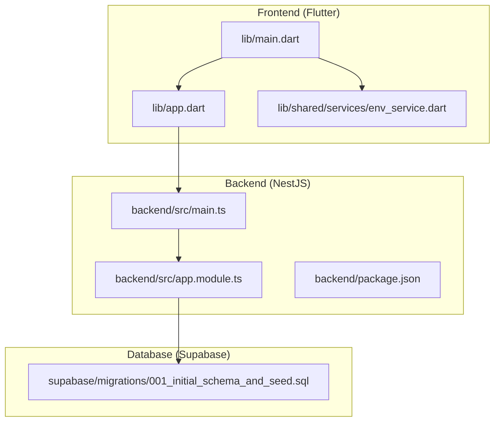
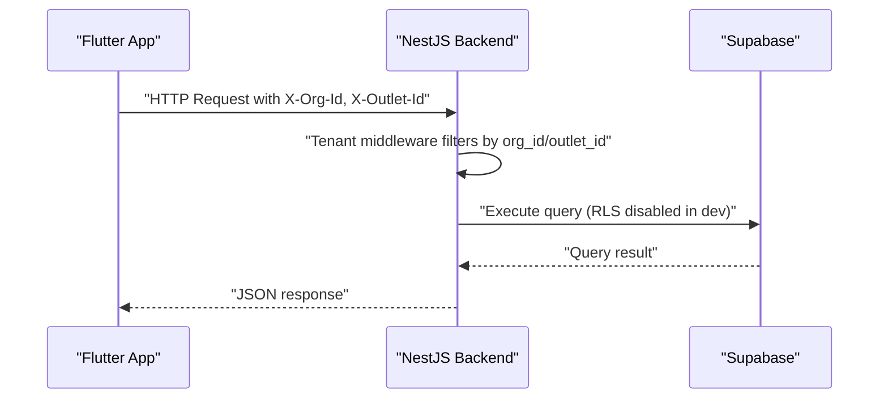
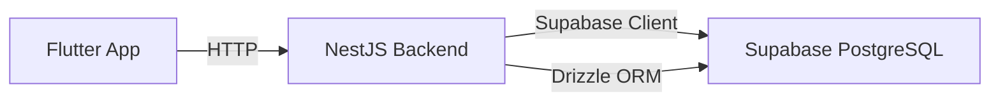

# Getting Started

<cite>
**Referenced Files in This Document**
- [README.md](file://README.md)
- [pubspec.yaml](file://pubspec.yaml)
- [backend/package.json](file://backend/package.json)
- [backend/.env.example](file://backend/.env.example)
- [.env.example](file://.env.example)
- [backend/QUICKSTART.md](file://backend/QUICKSTART.md)
- [backend/SETUP.md](file://backend/SETUP.md)
- [backend/src/main.ts](file://backend/src/main.ts)
- [backend/src/app.module.ts](file://backend/src/app.module.ts)
- [lib/main.dart](file://lib/main.dart)
- [lib/shared/services/env_service.dart](file://lib/shared/services/env_service.dart)
- [lib/app.dart](file://lib/app.dart)
- [supabase/migrations/001_initial_schema_and_seed.sql](file://supabase/migrations/001_initial_schema_and_seed.sql)
- [backend/drizzle.config.ts](file://backend/drizzle.config.ts)
</cite>

## Table of Contents
1. [Introduction](#introduction)
2. [Project Structure](#project-structure)
3. [Core Components](#core-components)
4. [Architecture Overview](#architecture-overview)
5. [Detailed Component Analysis](#detailed-component-analysis)
6. [Dependency Analysis](#dependency-analysis)
7. [Performance Considerations](#performance-considerations)
8. [Troubleshooting Guide](#troubleshooting-guide)
9. [Conclusion](#conclusion)
10. [Appendices](#appendices)

## Introduction
This guide helps you set up ZerpAI ERP from scratch. It covers prerequisites, step-by-step installation for both the Flutter frontend and NestJS backend, environment variable configuration, database setup, and initial verification. You will learn how to run the development servers, understand the multi-tenancy headers, and resolve common setup issues.

## Project Structure
ZerpAI ERP is a monorepo with:
- Flutter frontend (lib/) for Web and Android
- NestJS backend (backend/) with TypeScript
- Supabase database and migrations (supabase/migrations/)
- Flutter dependencies and assets configuration

**Diagram sources**
- [lib/main.dart](file://lib/main.dart#L1-L29)
- [lib/app.dart](file://lib/app.dart#L1-L32)
- [lib/shared/services/env_service.dart](file://lib/shared/services/env_service.dart#L1-L72)
- [backend/src/main.ts](file://backend/src/main.ts#L1-L56)
- [backend/src/app.module.ts](file://backend/src/app.module.ts#L1-L20)
- [backend/package.json](file://backend/package.json#L1-L79)
- [supabase/migrations/001_initial_schema_and_seed.sql](file://supabase/migrations/001_initial_schema_and_seed.sql#L1-L218)

**Section sources**
- [README.md](file://README.md#L5-L28)
- [pubspec.yaml](file://pubspec.yaml#L1-L128)
- [backend/package.json](file://backend/package.json#L1-L79)

## Core Components
- Flutter frontend initializes Hive for offline storage, loads environment variables, and connects to Supabase.
- NestJS backend loads environment variables, enables CORS, applies global validation, and listens on a configurable port.
- Supabase database schema is provided via SQL migrations.

Key responsibilities:
- Frontend: load .env, initialize Supabase, run app
- Backend: load .env, enable CORS, apply tenant middleware, serve API
- Database: seed schema and lookup tables

**Section sources**
- [lib/main.dart](file://lib/main.dart#L1-L29)
- [lib/shared/services/env_service.dart](file://lib/shared/services/env_service.dart#L1-L72)
- [backend/src/main.ts](file://backend/src/main.ts#L1-L56)
- [backend/src/app.module.ts](file://backend/src/app.module.ts#L1-L20)
- [supabase/migrations/001_initial_schema_and_seed.sql](file://supabase/migrations/001_initial_schema_and_seed.sql#L1-L218)

## Architecture Overview
High-level flow:
- Flutter app runs in browser or Android and communicates with NestJS backend via REST.
- Backend uses Supabase client and optionally Drizzle ORM to query the database.
- Multi-tenancy is enforced via X-Org-Id and X-Outlet-Id headers.

**Diagram sources**
- [backend/src/main.ts](file://backend/src/main.ts#L1-L56)
- [backend/src/app.module.ts](file://backend/src/app.module.ts#L1-L20)
- [supabase/migrations/001_initial_schema_and_seed.sql](file://supabase/migrations/001_initial_schema_and_seed.sql#L137-L142)

## Detailed Component Analysis

### Prerequisites
- Flutter SDK 3.x
- Node.js 20+
- Supabase account

Verification steps:
- Confirm Flutter SDK version and device/emulator availability.
- Confirm Node.js version meets the requirement.
- Create a Supabase project and note the project URL and keys.

**Section sources**
- [README.md](file://README.md#L39-L42)

### Database Setup
- Use the provided SQL migration to create the initial schema and seed data.
- The migration disables Row Level Security (RLS) for development convenience.

Steps:
1. Open Supabase Dashboard → SQL Editor.
2. Paste the contents of the initial schema migration.
3. Run the query to create tables and indexes.

Notes:
- Development uses public access; re-enable RLS and policies before production.

**Section sources**
- [README.md](file://README.md#L44-L50)
- [supabase/migrations/001_initial_schema_and_seed.sql](file://supabase/migrations/001_initial_schema_and_seed.sql#L137-L142)

### Backend Setup (NestJS)
Prerequisites:
- Node.js 20+ installed
- npm available

Installation and startup:
1. Change to the backend directory.
2. Install dependencies.
3. Start the development server.

Ports and configuration:
- Default port is 3001; configurable via environment variable.
- CORS is enabled for localhost origins and accepts tenant headers.

Environment variables:
- Required: SUPABASE_URL, SUPABASE_SERVICE_ROLE_KEY, PORT
- Optional: CORS_ORIGIN, JWT_SECRET, CLOUDFLARE_* settings

Verification:
- Confirm server starts on the expected port.
- Test health endpoint if exposed.

**Section sources**
- [README.md](file://README.md#L52-L58)
- [backend/QUICKSTART.md](file://backend/QUICKSTART.md#L1-L17)
- [backend/SETUP.md](file://backend/SETUP.md#L3-L25)
- [backend/src/main.ts](file://backend/src/main.ts#L1-L56)
- [backend/.env.example](file://backend/.env.example#L1-L40)

### Frontend Setup (Flutter)
Prerequisites:
- Flutter SDK 3.x
- Node.js 20+ (for backend)
- Supabase account

Installation and startup:
1. Fetch Flutter dependencies.
2. Run the app targeting Chrome for web development.

Environment variables:
- Required: SUPABASE_URL, SUPABASE_ANON_KEY, API_BASE_URL
- Optional: offline mode flags, cache settings, timeouts, logging

Asset configuration:
- The Flutter app expects an assets/.env file to be loaded at runtime.

Validation:
- The environment service checks for required variables and throws if missing.

**Section sources**
- [README.md](file://README.md#L60-L65)
- [pubspec.yaml](file://pubspec.yaml#L1-L128)
- [lib/main.dart](file://lib/main.dart#L1-L29)
- [.env.example](file://.env.example#L1-L68)
- [lib/shared/services/env_service.dart](file://lib/shared/services/env_service.dart#L1-L72)

### Environment Variable Configuration

#### Backend (.env)
- SUPABASE_URL: Supabase project URL
- SUPABASE_SERVICE_ROLE_KEY: Secret admin key
- PORT: Server port (default 3001)
- Optional: CORS_ORIGIN, JWT_SECRET, Cloudflare R2 settings, FRONTEND_URL, BACKEND_URL

Example reference:
- See the backend environment template for a complete list of supported variables.

**Section sources**
- [backend/.env.example](file://backend/.env.example#L1-L40)

#### Frontend (.env)
- SUPABASE_URL: Supabase project URL
- SUPABASE_ANON_KEY: Public key for client-side access
- API_BASE_URL: Base URL for the backend API
- Optional: ENVIRONMENT, feature flags, offline mode, cache settings, timeouts, logging

Example reference:
- See the frontend environment template for a complete list of supported variables.

**Section sources**
- [.env.example](file://.env.example#L1-L68)

### Development Workflow
End-to-end steps to run the first successful build:

1. Prepare the database
   - Run the initial schema migration in the Supabase SQL Editor.

2. Start the backend
   - Navigate to the backend directory.
   - Install dependencies.
   - Start the development server.

3. Configure frontend environment
   - Copy the frontend environment template to .env.local.
   - Fill in SUPABASE_URL, SUPABASE_ANON_KEY, and API_BASE_URL.

4. Start the frontend
   - Fetch Flutter dependencies.
   - Run the app targeting Chrome.

5. Verify connectivity
   - Ensure the frontend can reach the backend API.
   - Confirm the app loads without environment-related errors.

**Section sources**
- [README.md](file://README.md#L44-L65)
- [backend/QUICKSTART.md](file://backend/QUICKSTART.md#L1-L17)
- [.env.example](file://.env.example#L1-L68)
- [lib/main.dart](file://lib/main.dart#L1-L29)

### Multi-Tenancy Headers
- Every request must include:
  - X-Org-Id: organization identifier
  - X-Outlet-Id: outlet/branch identifier
- The backend middleware filters database queries by org_id automatically.

**Section sources**
- [README.md](file://README.md#L93-L99)
- [backend/src/app.module.ts](file://backend/src/app.module.ts#L1-L20)

### IDE Configuration Recommendations
- Flutter: Recommended IDEs include VS Code or Android Studio. Enable Flutter and Dart plugins.
- NestJS: Use VS Code or WebStorm with TypeScript integration.
- Environment files: Keep .env and .env.local out of version control; use .env.example as a template.

[No sources needed since this section provides general guidance]

## Dependency Analysis
Runtime dependencies:
- Flutter frontend depends on supabase_flutter, flutter_dotenv, dio, hive, riverpod, and others.
- Backend depends on NestJS, Supabase client, Drizzle ORM, and PostgreSQL drivers.

Build-time dependencies:
- Flutter uses dev dependencies for testing and code generation.
- Backend uses Jest, ESLint, TypeScript, and Drizzle Kit.

**Diagram sources**
- [pubspec.yaml](file://pubspec.yaml#L38-L70)
- [backend/package.json](file://backend/package.json#L22-L40)
- [backend/drizzle.config.ts](file://backend/drizzle.config.ts#L1-L16)

**Section sources**
- [pubspec.yaml](file://pubspec.yaml#L38-L70)
- [backend/package.json](file://backend/package.json#L22-L40)
- [backend/drizzle.config.ts](file://backend/drizzle.config.ts#L1-L16)

## Performance Considerations
- Use indexed columns for frequent filters (e.g., org_id, outlet_id, item_code).
- Minimize payload sizes by requesting only required fields.
- Enable offline mode selectively and tune cache staleness thresholds.
- Monitor API timeouts and adjust based on network conditions.

[No sources needed since this section provides general guidance]

## Troubleshooting Guide

Common issues and resolutions:
- Backend does not start
  - Ensure Node.js meets the version requirement.
  - Verify environment variables are set and accessible to the process.
  - Check that PORT is free; otherwise change it.

- CORS errors
  - Confirm CORS_ORIGIN includes your frontend URL(s).
  - Ensure the backend allows the tenant headers.

- Database connection failures
  - Verify DATABASE_URL in backend .env.
  - Confirm the Supabase project is active and reachable.
  - Use Drizzle Studio to test connectivity.

- Frontend cannot connect to backend
  - Ensure API_BASE_URL points to the correct backend endpoint.
  - Confirm the backend is running and listening on the expected port.

- Flutter environment validation errors
  - Ensure required variables are present in assets/.env.
  - Confirm the file is bundled and loaded at startup.

- Port already in use
  - Identify the process using the port and terminate it, or change the port.

- Memory issues during npm install
  - Increase Node.js memory allocation.
  - Clear npm cache or install with legacy peer deps.

**Section sources**
- [backend/QUICKSTART.md](file://backend/QUICKSTART.md#L81-L101)
- [backend/SETUP.md](file://backend/SETUP.md#L218-L246)
- [backend/src/main.ts](file://backend/src/main.ts#L13-L24)
- [lib/shared/services/env_service.dart](file://lib/shared/services/env_service.dart#L48-L70)

## Conclusion
You now have the prerequisites, environment configuration, and step-by-step instructions to set up ZerpAI ERP locally. Start with the database migration, then launch the backend and frontend. Use the troubleshooting section to resolve common issues quickly. Once verified, explore the multi-tenancy model and begin building features.

[No sources needed since this section summarizes without analyzing specific files]

## Appendices

### Appendix A: Backend Startup Procedures
- Development mode: start with hot reload.
- Production build and run: compile and serve the built application.
- Database tasks: generate and push schema, open Drizzle Studio.

**Section sources**
- [backend/QUICKSTART.md](file://backend/QUICKSTART.md#L1-L17)
- [backend/SETUP.md](file://backend/SETUP.md#L57-L71)
- [backend/SETUP.md](file://backend/SETUP.md#L200-L216)

### Appendix B: Frontend Startup Procedures
- Fetch dependencies.
- Run the app targeting Chrome for web development.
- Load environment variables from assets/.env.

**Section sources**
- [README.md](file://README.md#L60-L65)
- [lib/main.dart](file://lib/main.dart#L1-L29)

### Appendix C: Multi-Tenancy Header Reference
- X-Org-Id: organization identifier
- X-Outlet-Id: outlet/branch identifier

**Section sources**
- [README.md](file://README.md#L95-L99)