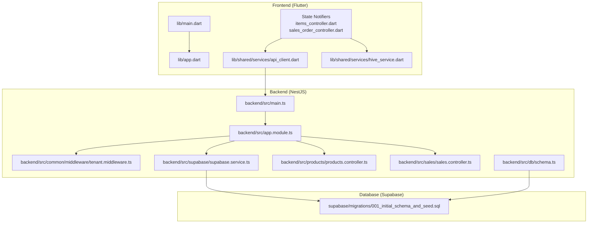
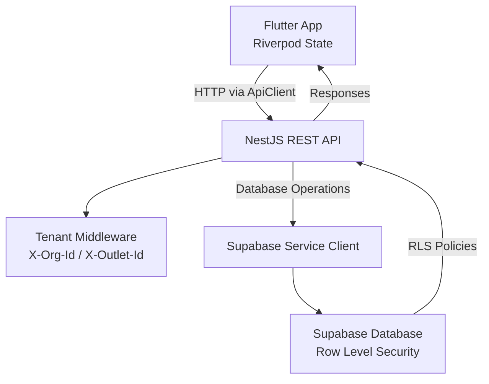
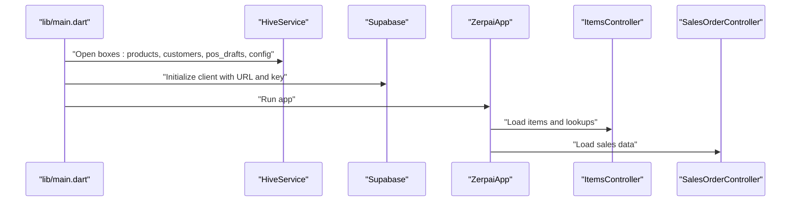
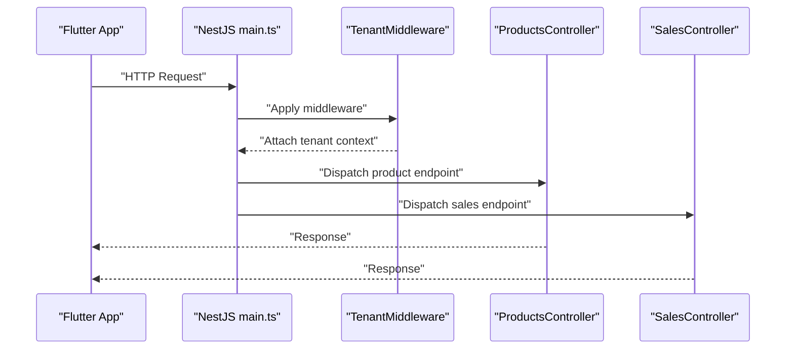
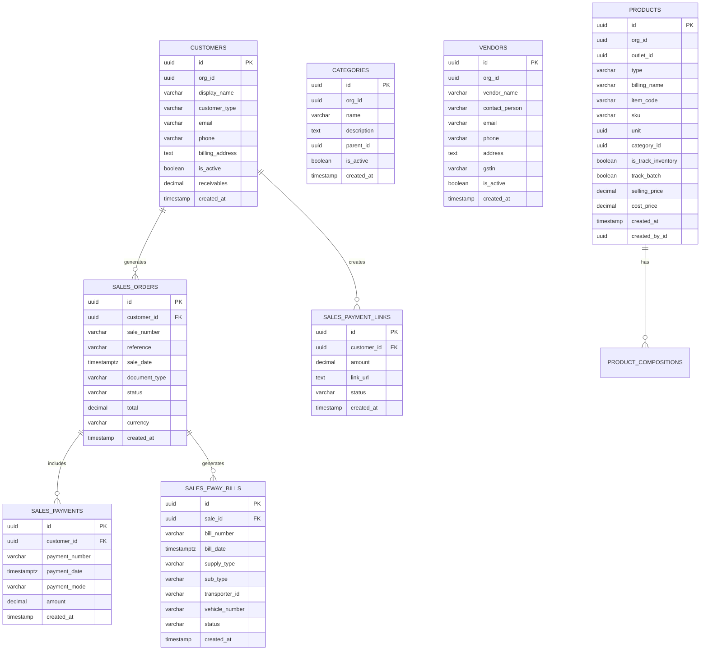
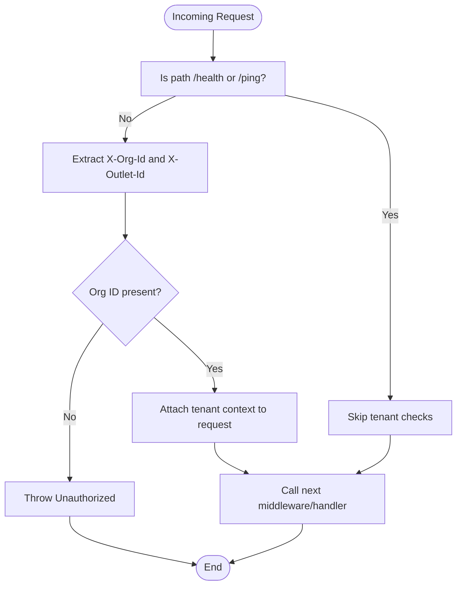
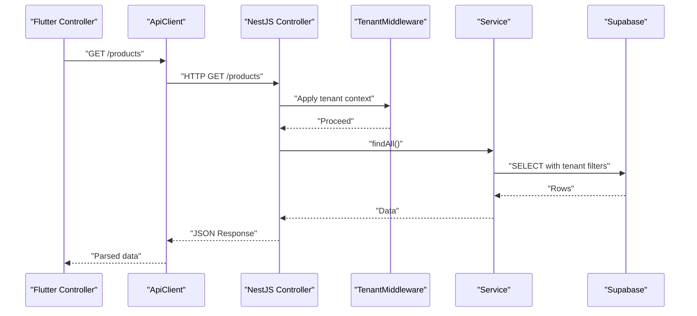
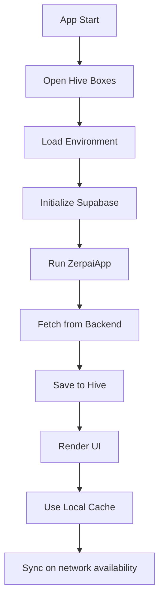
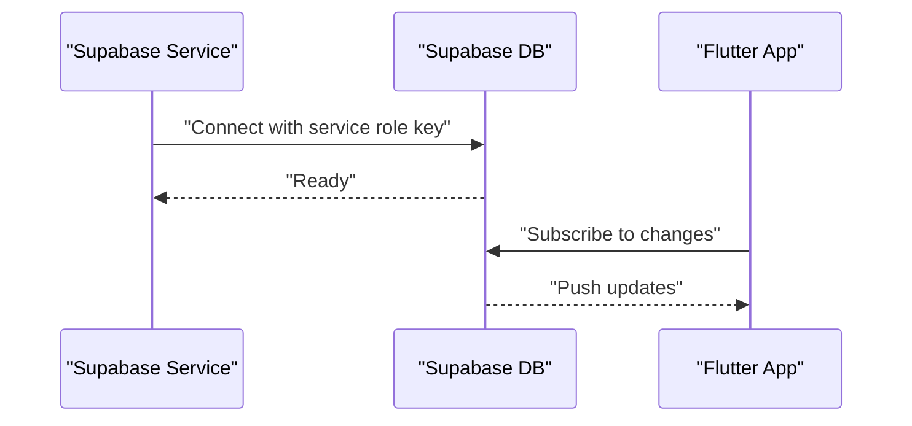
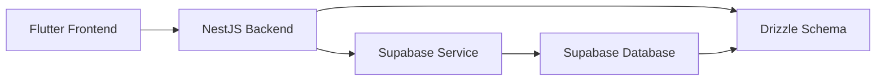

# Architecture Overview

<cite>
**Referenced Files in This Document**
- [main.dart](file://lib/main.dart)
- [app.dart](file://lib/app.dart)
- [api_client.dart](file://lib/shared/services/api_client.dart)
- [hive_service.dart](file://lib/shared/services/hive_service.dart)
- [items_controller.dart](file://lib/modules/items/controller/items_controller.dart)
- [sales_order_controller.dart](file://lib/modules/sales/controller/sales_order_controller.dart)
- [supabase_item_repository.dart](file://lib/modules/items/repositories/supabase_item_repository.dart)
- [main.ts](file://backend/src/main.ts)
- [app.module.ts](file://backend/src/app.module.ts)
- [tenant.middleware.ts](file://backend/src/common/middleware/tenant.middleware.ts)
- [supabase.service.ts](file://backend/src/supabase/supabase.service.ts)
- [products.controller.ts](file://backend/src/products/products.controller.ts)
- [sales.controller.ts](file://backend/src/sales/sales.controller.ts)
- [schema.ts](file://backend/src/db/schema.ts)
- [001_initial_schema_and_seed.sql](file://supabase/migrations/001_initial_schema_and_seed.sql)
</cite>

## Table of Contents
1. [Introduction](#introduction)
2. [Project Structure](#project-structure)
3. [Core Components](#core-components)
4. [Architecture Overview](#architecture-overview)
5. [Detailed Component Analysis](#detailed-component-analysis)
6. [Dependency Analysis](#dependency-analysis)
7. [Performance Considerations](#performance-considerations)
8. [Troubleshooting Guide](#troubleshooting-guide)
9. [Conclusion](#conclusion)

## Introduction
This document describes the ZerpAI ERP system architecture as a three-tier application:
- Flutter frontend with Riverpod state management and Hive local storage for offline-first operation
- NestJS backend with modular controllers and a tenant middleware for multi-tenancy
- Supabase database with Row Level Security (RLS) policies and a typed schema via Drizzle ORM

The system enforces data isolation using org_id and outlet_id headers, supports offline-first workflows with local caching, and synchronizes with the backend for real-time updates. The document also outlines scalability, security, and deployment considerations.

## Project Structure
The repository follows a clear separation of concerns:
- Frontend: Flutter application under lib/, organized by modules (items, sales), shared services (API client, Hive), and core infrastructure (router, theme)
- Backend: NestJS application under backend/src/, organized by domain modules (products, sales), common middleware (tenant), and database schema (Drizzle)
- Database: Supabase migrations and seed data under supabase/migrations/

**Diagram sources**
- [main.dart](file://lib/main.dart#L1-L29)
- [app.dart](file://lib/app.dart#L1-L32)
- [items_controller.dart](file://lib/modules/items/controller/items_controller.dart#L1-L568)
- [sales_order_controller.dart](file://lib/modules/sales/controller/sales_order_controller.dart#L1-L119)
- [api_client.dart](file://lib/shared/services/api_client.dart#L1-L62)
- [hive_service.dart](file://lib/shared/services/hive_service.dart#L1-L134)
- [main.ts](file://backend/src/main.ts#L1-L56)
- [app.module.ts](file://backend/src/app.module.ts#L1-L20)
- [tenant.middleware.ts](file://backend/src/common/middleware/tenant.middleware.ts#L1-L70)
- [supabase.service.ts](file://backend/src/supabase/supabase.service.ts#L1-L32)
- [products.controller.ts](file://backend/src/products/products.controller.ts#L1-L250)
- [sales.controller.ts](file://backend/src/sales/sales.controller.ts#L1-L102)
- [schema.ts](file://backend/src/db/schema.ts#L1-L293)
- [001_initial_schema_and_seed.sql](file://supabase/migrations/001_initial_schema_and_seed.sql#L1-L218)

**Section sources**
- [main.dart](file://lib/main.dart#L1-L29)
- [app.dart](file://lib/app.dart#L1-L32)
- [main.ts](file://backend/src/main.ts#L1-L56)
- [app.module.ts](file://backend/src/app.module.ts#L1-L20)
- [schema.ts](file://backend/src/db/schema.ts#L1-L293)
- [001_initial_schema_and_seed.sql](file://supabase/migrations/001_initial_schema_and_seed.sql#L1-L218)

## Core Components
- Flutter entrypoint initializes Hive, loads environment, and initializes Supabase before launching the app.
- Riverpod controllers orchestrate UI state, fetch data from services, and coordinate with repositories.
- API client encapsulates HTTP requests and response handling.
- Hive service provides offline-first caching for products, customers, POS drafts, and configuration.
- Backend main bootstraps NestJS, enables CORS, applies global validation, and listens on configured port.
- Tenant middleware extracts org_id and outlet_id headers to enforce multi-tenant boundaries.
- Supabase service creates a client for database operations.
- Controllers expose REST endpoints for products and sales, including lookup and sync endpoints.
- Drizzle schema defines database tables and enums; Supabase migration script seeds tables and indexes.

**Section sources**
- [main.dart](file://lib/main.dart#L8-L28)
- [items_controller.dart](file://lib/modules/items/controller/items_controller.dart#L16-L60)
- [sales_order_controller.dart](file://lib/modules/sales/controller/sales_order_controller.dart#L67-L84)
- [api_client.dart](file://lib/shared/services/api_client.dart#L6-L43)
- [hive_service.dart](file://lib/shared/services/hive_service.dart#L6-L133)
- [main.ts](file://backend/src/main.ts#L10-L52)
- [tenant.middleware.ts](file://backend/src/common/middleware/tenant.middleware.ts#L24-L68)
- [supabase.service.ts](file://backend/src/supabase/supabase.service.ts#L7-L31)
- [products.controller.ts](file://backend/src/products/products.controller.ts#L19-L249)
- [sales.controller.ts](file://backend/src/sales/sales.controller.ts#L14-L101)
- [schema.ts](file://backend/src/db/schema.ts#L1-L293)
- [001_initial_schema_and_seed.sql](file://supabase/migrations/001_initial_schema_and_seed.sql#L24-L141)

## Architecture Overview
The system follows a RESTful three-tier architecture with explicit multi-tenant boundaries and offline-first capabilities.

**Diagram sources**
- [main.dart](file://lib/main.dart#L20-L25)
- [api_client.dart](file://lib/shared/services/api_client.dart#L12-L43)
- [main.ts](file://backend/src/main.ts#L19-L24)
- [tenant.middleware.ts](file://backend/src/common/middleware/tenant.middleware.ts#L24-L68)
- [supabase.service.ts](file://backend/src/supabase/supabase.service.ts#L10-L30)
- [001_initial_schema_and_seed.sql](file://supabase/migrations/001_initial_schema_and_seed.sql#L137-L141)

## Detailed Component Analysis

### Frontend: Flutter Application
- Initialization sequence opens Hive boxes, loads environment, initializes Supabase, and runs the app.
- State management uses Riverpod StateNotifier for items and sales domains.
- Offline-first caching via HiveService stores frequently accessed entities locally.
- API client centralizes HTTP configuration and interceptors.

**Diagram sources**
- [main.dart](file://lib/main.dart#L8-L28)
- [hive_service.dart](file://lib/shared/services/hive_service.dart#L11-L16)
- [api_client.dart](file://lib/shared/services/api_client.dart#L12-L43)
- [items_controller.dart](file://lib/modules/items/controller/items_controller.dart#L25-L60)
- [sales_order_controller.dart](file://lib/modules/sales/controller/sales_order_controller.dart#L76-L84)

**Section sources**
- [main.dart](file://lib/main.dart#L8-L28)
- [app.dart](file://lib/app.dart#L7-L31)
- [items_controller.dart](file://lib/modules/items/controller/items_controller.dart#L16-L60)
- [sales_order_controller.dart](file://lib/modules/sales/controller/sales_order_controller.dart#L67-L84)
- [api_client.dart](file://lib/shared/services/api_client.dart#L6-L43)
- [hive_service.dart](file://lib/shared/services/hive_service.dart#L6-L133)

### Backend: NestJS REST API
- Bootstrapping enables CORS for development origins and sets allowed headers including tenant identifiers.
- Global ValidationPipe ensures DTO validation and structured error responses.
- AppModule wires modules and applies TenantMiddleware globally.
- Controllers expose CRUD and lookup endpoints for products and sales, including sync endpoints.

**Diagram sources**
- [main.ts](file://backend/src/main.ts#L19-L45)
- [app.module.ts](file://backend/src/app.module.ts#L14-L19)
- [tenant.middleware.ts](file://backend/src/common/middleware/tenant.middleware.ts#L24-L68)
- [products.controller.ts](file://backend/src/products/products.controller.ts#L19-L249)
- [sales.controller.ts](file://backend/src/sales/sales.controller.ts#L14-L101)

**Section sources**
- [main.ts](file://backend/src/main.ts#L10-L52)
- [app.module.ts](file://backend/src/app.module.ts#L9-L19)
- [products.controller.ts](file://backend/src/products/products.controller.ts#L19-L249)
- [sales.controller.ts](file://backend/src/sales/sales.controller.ts#L14-L101)

### Database: Supabase with Row Level Security
- Supabase migration script defines tables with org_id and outlet_id for multi-tenant isolation.
- Indexes are created for performance on tenant-scoped fields.
- RLS policies are intentionally disabled in the development migration; they should be enabled in production.

**Diagram sources**
- [001_initial_schema_and_seed.sql](file://supabase/migrations/001_initial_schema_and_seed.sql#L26-L89)
- [001_initial_schema_and_seed.sql](file://supabase/migrations/001_initial_schema_and_seed.sql#L108-L120)
- [001_initial_schema_and_seed.sql](file://supabase/migrations/001_initial_schema_and_seed.sql#L213-L281)

**Section sources**
- [001_initial_schema_and_seed.sql](file://supabase/migrations/001_initial_schema_and_seed.sql#L24-L141)
- [schema.ts](file://backend/src/db/schema.ts#L117-L195)
- [schema.ts](file://backend/src/db/schema.ts#L213-L291)

### Multi-Tenant Design Pattern
- Tenant context is attached to each request via middleware, extracting org_id and outlet_id from headers.
- Development middleware currently injects test values; production code should parse JWT and enforce policy.
- Backend controllers and services operate within the tenant context to scope queries and mutations.

**Diagram sources**
- [tenant.middleware.ts](file://backend/src/common/middleware/tenant.middleware.ts#L24-L68)

**Section sources**
- [tenant.middleware.ts](file://backend/src/common/middleware/tenant.middleware.ts#L6-L68)

### RESTful API Communication Flow
- Clients send HTTP requests through the API client, which sets base URL and headers.
- Backend validates requests using ValidationPipe and responds with structured data.
- Controllers handle product and sales operations, including lookup and sync endpoints.

**Diagram sources**
- [api_client.dart](file://lib/shared/services/api_client.dart#L46-L52)
- [products.controller.ts](file://backend/src/products/products.controller.ts#L217-L220)
- [tenant.middleware.ts](file://backend/src/common/middleware/tenant.middleware.ts#L24-L68)
- [schema.ts](file://backend/src/db/schema.ts#L117-L195)

**Section sources**
- [api_client.dart](file://lib/shared/services/api_client.dart#L6-L43)
- [products.controller.ts](file://backend/src/products/products.controller.ts#L217-L249)

### Offline-First Architecture with Hive
- HiveService manages local caches for products, customers, POS drafts, and configuration.
- The service supports saving, retrieving, and clearing cached data, and tracks last sync timestamps.
- UI controllers trigger data refresh and update state accordingly.

**Diagram sources**
- [main.dart](file://lib/main.dart#L11-L25)
- [hive_service.dart](file://lib/shared/services/hive_service.dart#L19-L45)
- [items_controller.dart](file://lib/modules/items/controller/items_controller.dart#L25-L60)

**Section sources**
- [hive_service.dart](file://lib/shared/services/hive_service.dart#L6-L133)
- [items_controller.dart](file://lib/modules/items/controller/items_controller.dart#L25-L60)

### Real-Time Synchronization Through Supabase
- Supabase service initializes a client configured for server-side operations.
- The current migration disables RLS for development; production deployments should enable RLS and appropriate policies.
- Real-time subscriptions and triggers can be integrated to synchronize changes across clients.

**Diagram sources**
- [supabase.service.ts](file://backend/src/supabase/supabase.service.ts#L10-L30)
- [001_initial_schema_and_seed.sql](file://supabase/migrations/001_initial_schema_and_seed.sql#L137-L141)

**Section sources**
- [supabase.service.ts](file://backend/src/supabase/supabase.service.ts#L7-L31)
- [001_initial_schema_and_seed.sql](file://supabase/migrations/001_initial_schema_and_seed.sql#L137-L141)

## Dependency Analysis
The system exhibits low coupling between layers:
- Frontend depends on API client and Riverpod for state
- Backend depends on Supabase service and Drizzle schema
- Database depends on migration scripts and RLS policies

**Diagram sources**
- [api_client.dart](file://lib/shared/services/api_client.dart#L12-L43)
- [supabase.service.ts](file://backend/src/supabase/supabase.service.ts#L10-L30)
- [schema.ts](file://backend/src/db/schema.ts#L1-L293)
- [001_initial_schema_and_seed.sql](file://supabase/migrations/001_initial_schema_and_seed.sql#L24-L141)

**Section sources**
- [api_client.dart](file://lib/shared/services/api_client.dart#L6-L43)
- [supabase.service.ts](file://backend/src/supabase/supabase.service.ts#L7-L31)
- [schema.ts](file://backend/src/db/schema.ts#L1-L293)
- [001_initial_schema_and_seed.sql](file://supabase/migrations/001_initial_schema_and_seed.sql#L24-L141)

## Performance Considerations
- Parallel loading of lookup data in controllers reduces UI latency.
- Indexes on org_id and outlet_id improve tenant-scoped queries.
- ValidationPipe prevents invalid payloads from reaching services.
- Hive caching minimizes network usage and improves responsiveness.

[No sources needed since this section provides general guidance]

## Troubleshooting Guide
- CORS configuration: Ensure allowed origins and headers include X-Org-Id and X-Outlet-Id.
- Validation errors: Review structured error messages returned by ValidationPipe.
- Tenant context: Confirm headers are present and tenant middleware attaches context.
- Supabase connectivity: Verify environment variables and service role key.
- Hive cache: Use cache stats and clear operations to diagnose stale data.

**Section sources**
- [main.ts](file://backend/src/main.ts#L19-L24)
- [main.ts](file://backend/src/main.ts#L27-L42)
- [tenant.middleware.ts](file://backend/src/common/middleware/tenant.middleware.ts#L24-L68)
- [supabase.service.ts](file://backend/src/supabase/supabase.service.ts#L10-L16)
- [hive_service.dart](file://lib/shared/services/hive_service.dart#L124-L132)

## Conclusion
ZerpAI ERP implements a robust three-tier architecture with clear separation of concerns, multi-tenant isolation via org_id and outlet_id, and an offline-first design leveraging Hive. The NestJS backend provides modular controllers and middleware, while Supabase offers scalable persistence with RLS-ready schema. Production readiness requires enabling RLS, integrating JWT-based tenant extraction, and establishing real-time synchronization mechanisms.