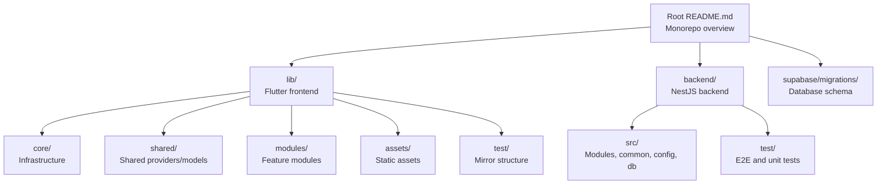
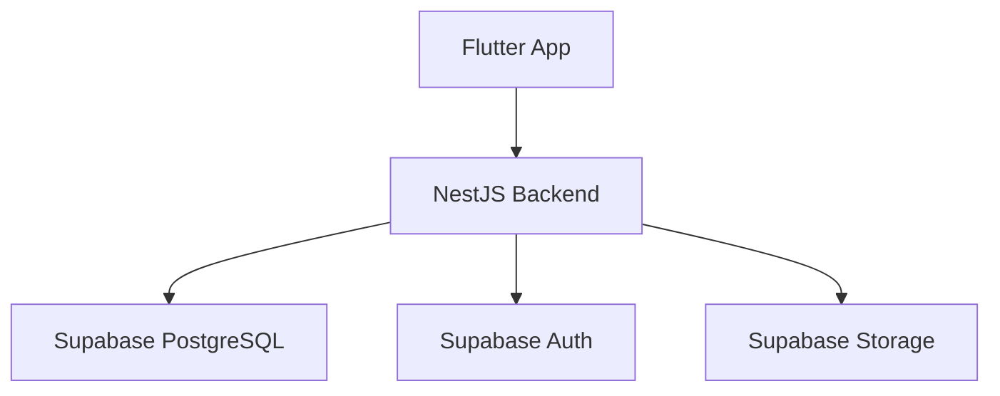
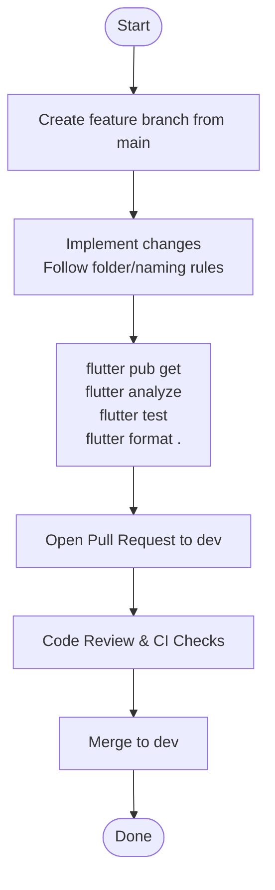
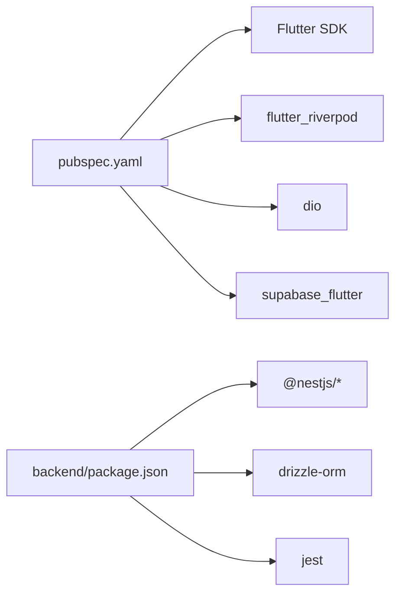

# Contributing Guide

<cite>
**Referenced Files in This Document**
- [CONTRIBUTING.md](file://CONTRIBUTING.md)
- [README.md](file://README.md)
- [CODE_OF_CONDUCT.md](file://CODE_OF_CONDUCT.md)
- [analysis_options.yaml](file://analysis_options.yaml)
- [PRD/prd_folder_structure.md](file://PRD/prd_folder_structure.md)
- [backend/TESTING.md](file://backend/TESTING.md)
- [backend/SETUP.md](file://backend/SETUP.md)
- [pubspec.yaml](file://pubspec.yaml)
- [backend/package.json](file://backend/package.json)
</cite>

## Table of Contents
1. [Introduction](#introduction)
2. [Project Structure](#project-structure)
3. [Core Components](#core-components)
4. [Architecture Overview](#architecture-overview)
5. [Detailed Component Analysis](#detailed-component-analysis)
6. [Dependency Analysis](#dependency-analysis)
7. [Performance Considerations](#performance-considerations)
8. [Troubleshooting Guide](#troubleshooting-guide)
9. [Conclusion](#conclusion)
10. [Appendices](#appendices)

## Introduction
This guide documents how to contribute effectively to ZerpAI ERP. It covers the development workflow, branching and naming conventions, local testing, pull request process, code review expectations, coding standards, quality assurance, and community norms. It also provides templates for issues and pull requests.

## Project Structure
ZerpAI ERP is a monorepo with a Flutter frontend, a NestJS backend, and a Supabase database. The frontend follows a strict folder and naming convention to ensure scalability and maintainability.

**Diagram sources**
- [README.md](file://README.md#L5-L28)
- [PRD/prd_folder_structure.md](file://PRD/prd_folder_structure.md#L21-L175)

**Section sources**
- [README.md](file://README.md#L5-L28)
- [PRD/prd_folder_structure.md](file://PRD/prd_folder_structure.md#L21-L175)

## Core Components
- Branching and PR targets: Create feature branches from main and open pull requests against dev. Include motivation, description, and screenshots for UI changes.
- Local checks before submitting: Run dependency setup, analyzer, tests, and formatter locally.
- CI: Automated analysis and tests run on PRs and pushes to dev and main.

**Section sources**
- [CONTRIBUTING.md](file://CONTRIBUTING.md#L5-L21)

## Architecture Overview
The system comprises:
- Flutter frontend (Riverpod, Dio) consuming REST endpoints
- NestJS backend with multi-tenancy via org_id/outlet_id headers
- Supabase PostgreSQL with Row Level Security (RLS)

**Diagram sources**
- [README.md](file://README.md#L83-L91)

**Section sources**
- [README.md](file://README.md#L30-L91)

## Detailed Component Analysis

### Development Workflow
- Create a feature branch from main with a descriptive name (use prefixes like feat/, fix/, chore/).
- Implement changes following the established folder structure and naming conventions.
- Run local checks: get dependencies, analyze, test, and format.
- Open a pull request targeting dev with a clear description, motivation, and screenshots for UI changes.

**Section sources**
- [CONTRIBUTING.md](file://CONTRIBUTING.md#L7-L16)
- [README.md](file://README.md#L113-L118)

### Coding Standards and Linting
- Flutter linting is configured via analysis_options.yaml, inheriting recommended Flutter lints.
- Enforce file naming conventions (snake_case) and import ordering.
- Keep UI logic in widgets and business logic in providers/services.

**Section sources**
- [analysis_options.yaml](file://analysis_options.yaml#L8-L10)
- [analysis_options.yaml](file://analysis_options.yaml#L23-L28)
- [CONTRIBUTING.md](file://CONTRIBUTING.md#L22-L25)

### File Naming Conventions and Folder Structure
- Flutter: snake_case filenames with patterns like module_entity_type.dart.
- Screens: *_overview_screen.dart, *_create_screen.dart, *_edit_screen.dart, *_detail_screen.dart.
- Widgets: *_card.dart, *_list_tile.dart, *_dialog.dart, *_sheet.dart.
- Decision tree: Place files in core/, shared/, modules/, or test/ mirrors based on scope and reusability.
- Backend: NestJS modules with controller/service/entity/dto folders and consistent naming.

**Section sources**
- [PRD/prd_folder_structure.md](file://PRD/prd_folder_structure.md#L248-L275)
- [PRD/prd_folder_structure.md](file://PRD/prd_folder_structure.md#L277-L306)
- [PRD/prd_folder_structure.md](file://PRD/prd_folder_structure.md#L437-L452)

### Quality Assurance Requirements
- Run analyzer and tests locally before submitting.
- Ensure tests mirror lib/ structure in test/.
- Backend: Use curl or similar to test endpoints locally; verify multi-tenancy headers are set.
- Backend: Use Jest for unit/integration tests; ensure coverage and linting pass.

**Section sources**
- [CONTRIBUTING.md](file://CONTRIBUTING.md#L11-L16)
- [backend/TESTING.md](file://backend/TESTING.md#L1-L72)
- [backend/package.json](file://backend/package.json#L8-L21)

### Code Review Expectations
Reviewers verify:
- File naming follows snake_case.
- File placement matches the decision tree.
- Modules follow internal structure (models, providers, repositories, presentation).
- No PascalCase or kebab-case filenames.
- Imports are organized (core → shared → modules).
- Mirrored test structure exists.

**Section sources**
- [PRD/prd_folder_structure.md](file://PRD/prd_folder_structure.md#L680-L690)

### Communication Channels and Community Expectations
- Contributor Covenant applies; maintain an inclusive, respectful environment.
- Report issues and discuss via repository mechanisms.
- Contact maintainers through the designated channel for conduct-related matters.

**Section sources**
- [CODE_OF_CONDUCT.md](file://CODE_OF_CONDUCT.md#L1-L31)

### Templates

#### Issue Template
- Title: Brief, descriptive summary
- Description: Expected behavior, actual behavior, steps to reproduce, environment details
- Labels: bug, enhancement, help wanted, documentation
- Screenshots: Attach where relevant

#### Pull Request Template
- Summary: What changed and why
- Related Issue: Link to issue number
- Motivation: Why this change is needed
- Test Plan: How you verified changes locally
- Screenshots: UI changes (if applicable)
- Other: Breaking changes, migration notes, documentation updates

**Section sources**
- [CONTRIBUTING.md](file://CONTRIBUTING.md#L5-L9)

## Dependency Analysis
- Flutter dependencies and dev dependencies are declared in pubspec.yaml.
- Backend dependencies and scripts are declared in backend/package.json.
- CI commands are defined in CONTRIBUTING.md and backend scripts.

**Diagram sources**
- [pubspec.yaml](file://pubspec.yaml#L38-L86)
- [backend/package.json](file://backend/package.json#L22-L60)

**Section sources**
- [pubspec.yaml](file://pubspec.yaml#L38-L86)
- [backend/package.json](file://backend/package.json#L22-L60)

## Performance Considerations
- Keep widgets modular; use the Part-File Sectioning pattern for large screens to improve maintainability.
- Prefer Riverpod providers for scalable state management.
- Minimize unnecessary rebuilds by structuring UI and state clearly.

**Section sources**
- [PRD/prd_folder_structure.md](file://PRD/prd_folder_structure.md#L741-L787)

## Troubleshooting Guide
- Backend setup: Ensure environment variables are copied and configured; install dependencies; run locally with hot reload.
- CORS issues: Confirm CORS_ORIGIN includes both local and deployed origins.
- Database connectivity: Test connection locally; verify Drizzle studio and migrations.
- Vercel deployment: Ensure all environment variables are set; check logs for build errors.

**Section sources**
- [backend/SETUP.md](file://backend/SETUP.md#L9-L255)
- [backend/TESTING.md](file://backend/TESTING.md#L220-L246)

## Conclusion
By following this guide—using the correct branches, adhering to folder and naming conventions, running local QA checks, and engaging respectfully—you help maintain a high-quality, scalable codebase for ZerpAI ERP.

## Appendices

### Contribution Types
- Bug fixes: Target dev; include reproduction steps and tests.
- Feature additions: Align with module structure and naming; add tests and documentation.
- Documentation improvements: Keep examples accurate and consistent with current code.

**Section sources**
- [CONTRIBUTING.md](file://CONTRIBUTING.md#L5-L9)