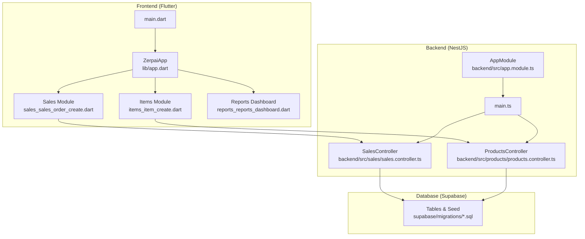
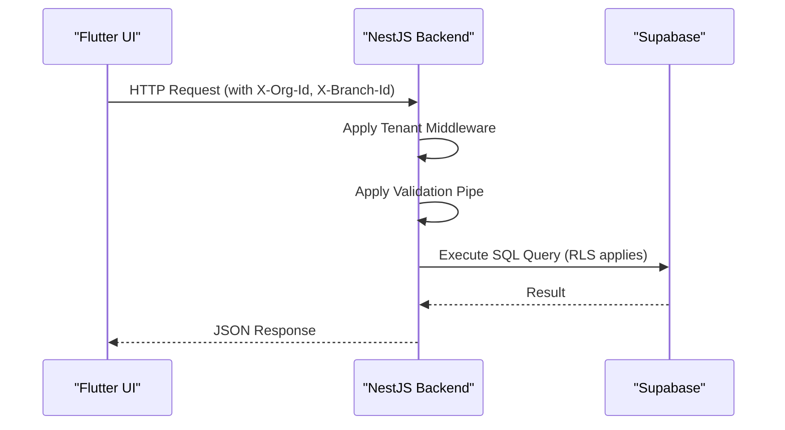
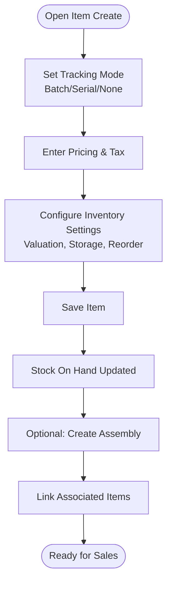
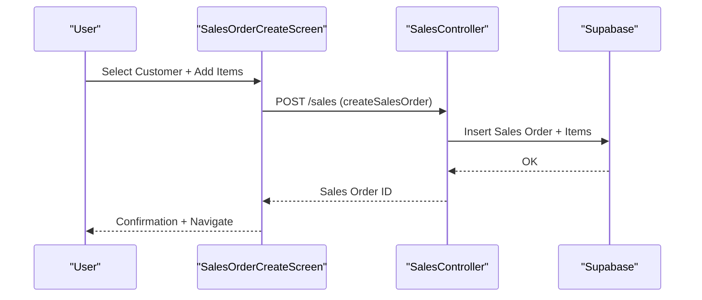
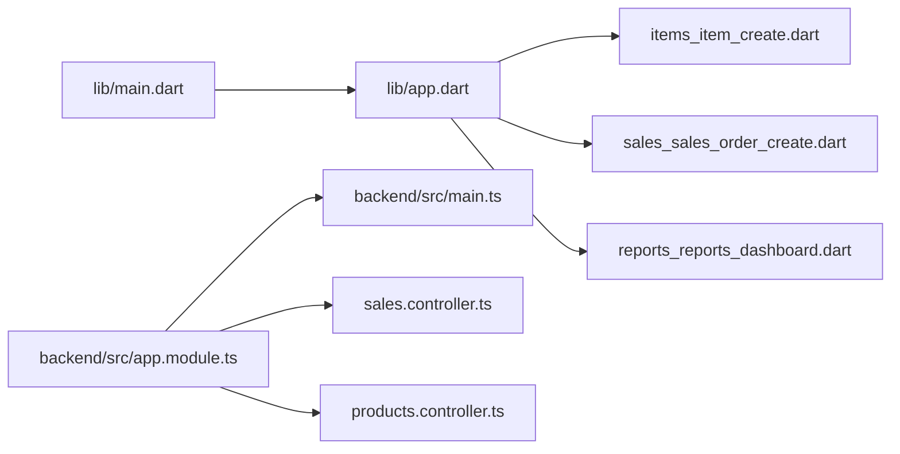

# Core Features
**Last Updated: 2026-04-20 12:46:08**

<cite>
**Referenced Files in This Document**
- [README.md](file://README.md)
- [lib/app.dart](file://lib/app.dart)
- [lib/main.dart](file://lib/main.dart)
- [backend/src/app.module.ts](file://backend/src/app.module.ts)
- [backend/src/main.ts](file://backend/src/main.ts)
- [lib/modules/items/presentation/items_item_create.dart](file://lib/modules/items/presentation/items_item_create.dart)
- [lib/modules/items/models/item_model.dart](file://lib/modules/items/models/item_model.dart)
- [lib/modules/inventory/assemblies/presentation/inventory_assemblies_assembly_create.dart](file://lib/modules/inventory/assemblies/presentation/inventory_assemblies_assembly_create.dart)
- [lib/modules/sales/presentation/sales_sales_order_create.dart](file://lib/modules/sales/presentation/sales_sales_order_create.dart)
- [lib/modules/sales/presentation/sales_customer_customer_create.dart](file://lib/modules/sales/presentation/sales_customer_customer_create.dart)
- [backend/src/sales/sales.controller.ts](file://backend/src/sales/sales.controller.ts)
- [backend/src/products/products.controller.ts](file://backend/src/products/products.controller.ts)
- [lib/modules/reports/presentation/reports_reports_dashboard.dart](file://lib/modules/reports/presentation/reports_reports_dashboard.dart)
- [lib/shared/models/account_node.dart](file://lib/shared/models/account_node.dart)
</cite>

## Table of Contents
1. [Introduction](#introduction)
2. [Project Structure](#project-structure)
3. [Core Components](#core-components)
4. [Architecture Overview](#architecture-overview)
5. [Detailed Component Analysis](#detailed-component-analysis)
6. [Dependency Analysis](#dependency-analysis)
7. [Performance Considerations](#performance-considerations)
8. [Troubleshooting Guide](#troubleshooting-guide)
9. [Conclusion](#conclusion)

## Introduction
This document describes the core capabilities of ZerpAI ERP as implemented in the repository. It focuses on inventory management with real-time stock tracking and batch management, sales operations covering multi-document workflows (quotes, orders, invoices, returns), customer management with GST compliance, financial management with a chart of accounts, and a comprehensive reporting dashboard. For each feature, we explain business value, key workflows, user interface components, and integration patterns. Practical examples and interconnections among features are included to support end-to-end business processes.

## Project Structure
ZerpAI ERP follows a modern monorepo architecture:
- Flutter frontend (web and Android) with Riverpod state management and REST clients
- NestJS backend with multi-tenant middleware and Supabase integration
- Supabase database with RLS-enabled tables and seed data via migrations
- Shared UI components and services for cross-module reuse

**Diagram sources**
- [lib/app.dart](file://lib/app.dart#L1-L32)
- [lib/main.dart](file://lib/main.dart#L1-L29)
- [backend/src/app.module.ts](file://backend/src/app.module.ts#L1-L20)
- [backend/src/main.ts](file://backend/src/main.ts#L1-L56)
- [lib/modules/items/presentation/items_item_create.dart](file://lib/modules/items/presentation/items_item_create.dart#L1-L544)
- [lib/modules/sales/presentation/sales_sales_order_create.dart](file://lib/modules/sales/presentation/sales_sales_order_create.dart#L1-L685)
- [lib/modules/reports/presentation/reports_reports_dashboard.dart](file://lib/modules/reports/presentation/reports_reports_dashboard.dart#L1-L214)
- [backend/src/sales/sales.controller.ts](file://backend/src/sales/sales.controller.ts#L1-L102)
- [backend/src/products/products.controller.ts](file://backend/src/products/products.controller.ts#L1-L250)

**Section sources**
- [README.md](file://README.md#L1-L122)
- [lib/app.dart](file://lib/app.dart#L1-L32)
- [lib/main.dart](file://lib/main.dart#L1-L29)
- [backend/src/app.module.ts](file://backend/src/app.module.ts#L1-L20)
- [backend/src/main.ts](file://backend/src/main.ts#L1-L56)

## Core Components
- Inventory Management
  - Real-time stock tracking and batch/serial number support
  - Product registration with tax, pricing, and inventory settings
  - Assembly creation with associated items and batch linkage
- Sales Operations
  - Multi-document workflow: quotes, orders, invoices, returns
  - Customer onboarding with GSTIN lookup and compliance
  - Payments, e-way bills, and payment links
- Customer Management
  - Comprehensive customer profile with address, contacts, and GST settings
  - GST treatment selection and PAN/GSTIN verification
- Financial Management
  - Chart of accounts model for financial posting
  - Accounts hierarchy via tree nodes
- Reporting Dashboard
  - Summary cards and categorized report listings
  - Navigation to daily sales and other report views

**Section sources**
- [lib/modules/items/presentation/items_item_create.dart](file://lib/modules/items/presentation/items_item_create.dart#L1-L544)
- [lib/modules/items/models/item_model.dart](file://lib/modules/items/models/item_model.dart#L1-L461)
- [lib/modules/inventory/assemblies/presentation/inventory_assemblies_assembly_create.dart](file://lib/modules/inventory/assemblies/presentation/inventory_assemblies_assembly_create.dart#L1-L590)
- [lib/modules/sales/presentation/sales_sales_order_create.dart](file://lib/modules/sales/presentation/sales_sales_order_create.dart#L1-L685)
- [lib/modules/sales/presentation/sales_customer_customer_create.dart](file://lib/modules/sales/presentation/sales_customer_customer_create.dart#L1-L454)
- [backend/src/sales/sales.controller.ts](file://backend/src/sales/sales.controller.ts#L1-L102)
- [backend/src/products/products.controller.ts](file://backend/src/products/products.controller.ts#L1-L250)
- [lib/modules/reports/presentation/reports_reports_dashboard.dart](file://lib/modules/reports/presentation/reports_reports_dashboard.dart#L1-L214)
- [lib/shared/models/account_node.dart](file://lib/shared/models/account_node.dart#L1-L14)

## Architecture Overview
The system enforces multi-tenancy via X-Org-Id and X-Branch-Id headers. The frontend communicates with the backend using REST APIs, which apply validation and tenant filtering before querying Supabase.

**Diagram sources**
- [backend/src/main.ts](file://backend/src/main.ts#L10-L56)
- [backend/src/app.module.ts](file://backend/src/app.module.ts#L14-L19)
- [README.md](file://README.md#L93-L100)

**Section sources**
- [README.md](file://README.md#L83-L100)
- [backend/src/main.ts](file://backend/src/main.ts#L10-L56)
- [backend/src/app.module.ts](file://backend/src/app.module.ts#L14-L19)

## Detailed Component Analysis

### Inventory Management
Business value:
- Accurate stock visibility reduces out-of-stocks and overstock costs
- Batch/serial tracking supports expiry control, recalls, and traceability
- Assembly capability enables finished goods production with material consumption

Key workflows:
- Register items with tax, pricing, and inventory flags (batch/serial tracking)
- Track stock on hand and reorder points
- Create assemblies linking composite items to constituent materials

UI components:
- Item registration screen with tabs for composition, formulation, sales, purchase
- Inventory flags and valuation method selection
- Assembly creation with associated items table and batch dialog trigger

Integration patterns:
- Backend exposes product lookup endpoints and CRUD operations
- Item model encapsulates inventory-related fields and flags

**Diagram sources**
- [lib/modules/items/presentation/items_item_create.dart](file://lib/modules/items/presentation/items_item_create.dart#L246-L280)
- [lib/modules/items/models/item_model.dart](file://lib/modules/items/models/item_model.dart#L75-L98)
- [lib/modules/inventory/assemblies/presentation/inventory_assemblies_assembly_create.dart](file://lib/modules/inventory/assemblies/presentation/inventory_assemblies_assembly_create.dart#L202-L232)

**Section sources**
- [lib/modules/items/presentation/items_item_create.dart](file://lib/modules/items/presentation/items_item_create.dart#L1-L544)
- [lib/modules/items/models/item_model.dart](file://lib/modules/items/models/item_model.dart#L1-L461)
- [lib/modules/inventory/assemblies/presentation/inventory_assemblies_assembly_create.dart](file://lib/modules/inventory/assemblies/presentation/inventory_assemblies_assembly_create.dart#L1-L590)
- [backend/src/products/products.controller.ts](file://backend/src/products/products.controller.ts#L1-L250)

### Sales Operations
Business value:
- Streamlined multi-document workflow accelerates revenue cycles
- GST-compliant customer records reduce compliance risk
- Payment tracking and e-way bill generation support auditability

Key workflows:
- Create sales orders with customer selection, items, quantities, rates, discounts
- Generate invoices, returns, and manage payments/e-way bills/payment links
- Customer onboarding with GSTIN lookup and GST treatment selection

UI components:
- Sales order creation screen with header, items table, totals, notes
- Customer creation screen with tabs for primary info, addresses, other details, contacts, custom fields, reporting tags, remarks
- GSTIN lookup service integration for compliance

**Diagram sources**
- [lib/modules/sales/presentation/sales_sales_order_create.dart](file://lib/modules/sales/presentation/sales_sales_order_create.dart#L635-L683)
- [backend/src/sales/sales.controller.ts](file://backend/src/sales/sales.controller.ts#L91-L95)

**Section sources**
- [lib/modules/sales/presentation/sales_sales_order_create.dart](file://lib/modules/sales/presentation/sales_sales_order_create.dart#L1-L685)
- [lib/modules/sales/presentation/sales_customer_customer_create.dart](file://lib/modules/sales/presentation/sales_customer_customer_create.dart#L1-L454)
- [backend/src/sales/sales.controller.ts](file://backend/src/sales/sales.controller.ts#L1-L102)

### Customer Management with GST Compliance
Business value:
- Structured customer profiles improve relationship management
- GSTIN/PAN verification and GST treatment classification ensure regulatory compliance

Key workflows:
- Create customer with primary info, addresses, phones, emails
- GSTIN lookup and GST treatment selection
- Optional additional details, contact persons, custom fields, reporting tags

UI components:
- Tabbed customer creation screen
- GSTIN lookup service integration
- Place of supply selection and currency options

**Section sources**
- [lib/modules/sales/presentation/sales_customer_customer_create.dart](file://lib/modules/sales/presentation/sales_customer_customer_create.dart#L1-L454)
- [backend/src/sales/sales.controller.ts](file://backend/src/sales/sales.controller.ts#L35-L39)

### Financial Management with Chart of Accounts
Business value:
- Hierarchical chart of accounts enables accurate financial reporting and analytics
- Tree-based account nodes support drill-down and grouping

Key workflows:
- Define and maintain account nodes with selectable children
- Use accounts in inventory and sales postings

UI components:
- Account tree node model for hierarchical representation

**Section sources**
- [lib/shared/models/account_node.dart](file://lib/shared/models/account_node.dart#L1-L14)

### Reporting Dashboard
Business value:
- Executive dashboards summarize KPIs and drive data-driven decisions
- Categorized report lists streamline access to sales, inventory, receivables, and tax reports

Key workflows:
- View summary cards (total sales, customers, pending invoices, profits)
- Browse report categories and navigate to specific reports (e.g., daily sales)

UI components:
- Summary cards with icons and colors
- Grid of report categories with actionable items

**Section sources**
- [lib/modules/reports/presentation/reports_reports_dashboard.dart](file://lib/modules/reports/presentation/reports_reports_dashboard.dart#L1-L214)

## Dependency Analysis
- Frontend depends on:
  - Riverpod for state management
  - Supabase Flutter SDK for offline/local caching and auth
  - Custom widgets/services for UI and API communication
- Backend depends on:
  - NestJS modules for products and sales
  - Supabase module for database client
  - Tenant middleware for multi-tenancy
  - Validation pipes for request sanitization

**Diagram sources**
- [lib/main.dart](file://lib/main.dart#L1-L29)
- [lib/app.dart](file://lib/app.dart#L1-L32)
- [backend/src/app.module.ts](file://backend/src/app.module.ts#L1-L20)
- [backend/src/main.ts](file://backend/src/main.ts#L1-L56)
- [backend/src/sales/sales.controller.ts](file://backend/src/sales/sales.controller.ts#L1-L102)
- [backend/src/products/products.controller.ts](file://backend/src/products/products.controller.ts#L1-L250)

**Section sources**
- [lib/main.dart](file://lib/main.dart#L1-L29)
- [lib/app.dart](file://lib/app.dart#L1-L32)
- [backend/src/app.module.ts](file://backend/src/app.module.ts#L1-L20)
- [backend/src/main.ts](file://backend/src/main.ts#L1-L56)

## Performance Considerations
- Use batch/serial tracking judiciously to balance accuracy with query complexity
- Leverage backend validation pipes to prevent malformed requests and reduce retries
- Cache frequently accessed lookup data (units, categories, tax rates) in the frontend
- Optimize report queries with appropriate filters and pagination

## Troubleshooting Guide
Common issues and resolutions:
- Multi-tenancy filtering not applied
  - Verify X-Org-Id and X-Branch-Id headers are present on all requests
  - Confirm tenant middleware is configured globally
- Validation errors on save
  - Review validation pipe logs for field-specific constraints
  - Ensure required fields are populated and formatted correctly
- Image upload failures
  - Check storage service configuration and permissions
  - Confirm network connectivity and Supabase storage availability

**Section sources**
- [backend/src/main.ts](file://backend/src/main.ts#L26-L42)
- [lib/modules/items/presentation/items_item_create.dart](file://lib/modules/items/presentation/items_item_create.dart#L328-L347)

## Conclusion
ZerpAI ERP provides a cohesive foundation for modern business operations with robust inventory tracking, a complete sales lifecycle, GST-compliant customer management, financial accounting via a chart of accounts, and a practical reporting dashboard. The modular frontend and backend, combined with Supabase’s RLS and migrations, enable scalable, secure, and maintainable deployments across organizations and branchs.