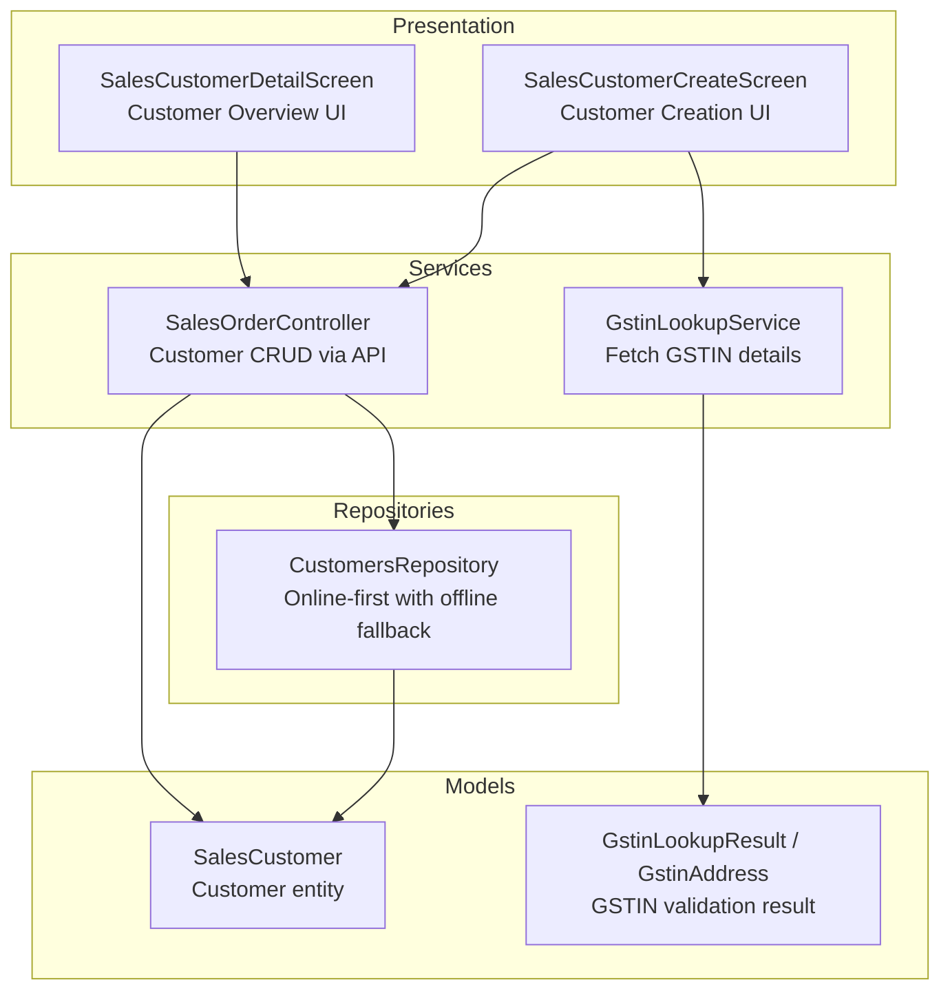
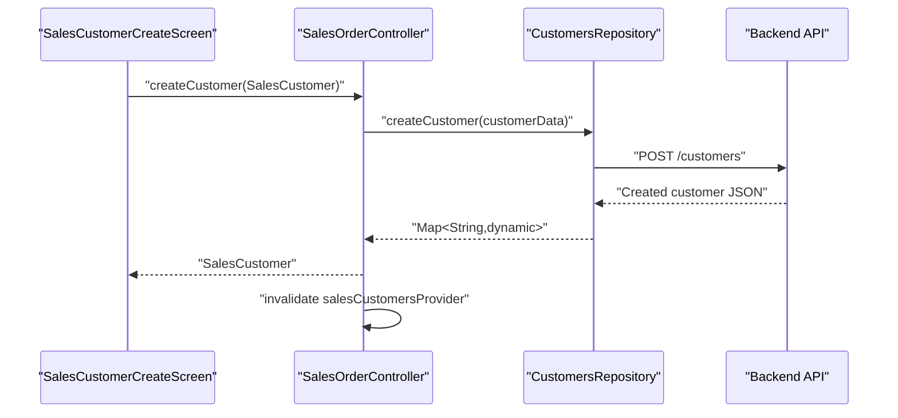
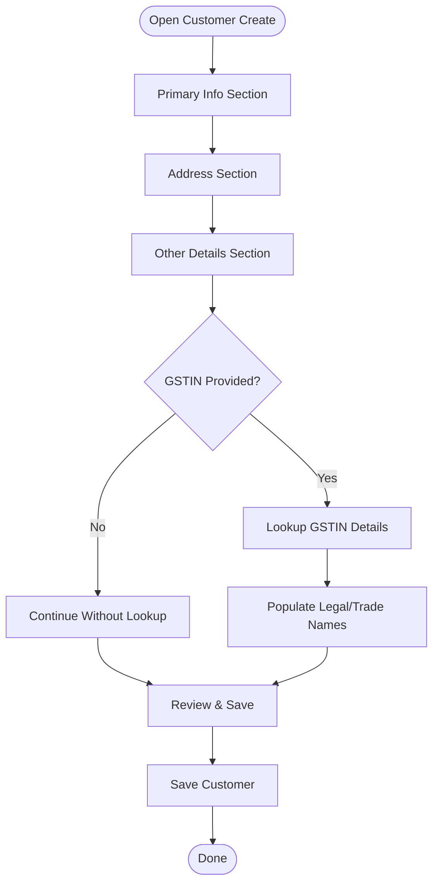
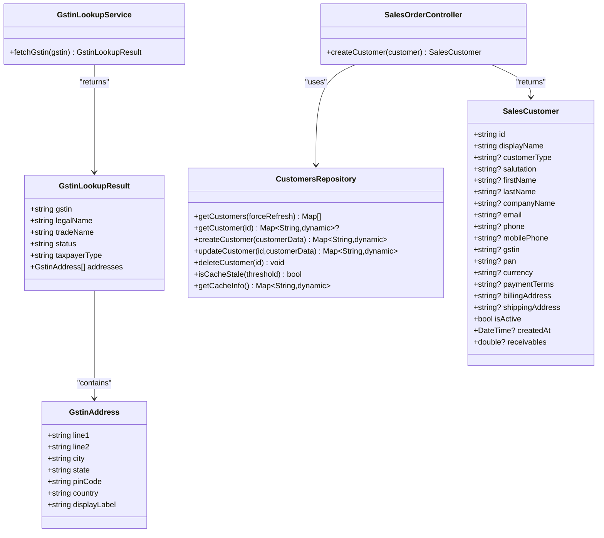

# Customer Management

<cite>
**Referenced Files in This Document**
- [sales_customer_model.dart](file://lib/modules/sales/models/sales_customer_model.dart)
- [gstin_lookup_model.dart](file://lib/modules/sales/models/gstin_lookup_model.dart)
- [gstin_lookup_service.dart](file://lib/modules/sales/services/gstin_lookup_service.dart)
- [customers_repository.dart](file://lib/modules/sales/repositories/customers_repository.dart)
- [sales_customer_customer_create.dart](file://lib/modules/sales/presentation/sales_customer_customer_create.dart)
- [sales_customer_customer_overview.dart](file://lib/modules/sales/presentation/sales_customer_customer_overview.dart)
- [sales_customer_primary_info_section.dart](file://lib/modules/sales/presentation/sections/sales_customer_primary_info_section.dart)
- [sales_customer_address_section.dart](file://lib/modules/sales/presentation/sections/sales_customer_address_section.dart)
- [sales_customer_other_details_section.dart](file://lib/modules/sales/presentation/sections/sales_customer_other_details_section.dart)
- [sales_order_controller.dart](file://lib/modules/sales/controller/sales_order_controller.dart)
- [pricelist_model.dart](file://lib/modules/pricelist/models/pricelist_model.dart)
</cite>

## Table of Contents
1. [Introduction](#introduction)
2. [Project Structure](#project-structure)
3. [Core Components](#core-components)
4. [Architecture Overview](#architecture-overview)
5. [Detailed Component Analysis](#detailed-component-analysis)
6. [Dependency Analysis](#dependency-analysis)
7. [Performance Considerations](#performance-considerations)
8. [Troubleshooting Guide](#troubleshooting-guide)
9. [Conclusion](#conclusion)
10. [Appendices](#appendices)

## Introduction
This document provides comprehensive documentation for the Customer Management feature. It covers customer onboarding workflows, GST compliance requirements, customer categorization, credit management, and customer communication features. It also explains customer profile management, GSTIN validation, customer segmentation, pricing customization, and customer history tracking. Practical examples illustrate customer creation workflows, GST compliance scenarios, customer service interactions, and customer data management. Finally, it documents integrations with sales operations, payment tracking, and customer communication channels.

## Project Structure
The Customer Management feature spans model definitions, UI screens, services, and repositories. The frontend is organized by domain: models define data structures, services encapsulate external API interactions, repositories handle caching and offline-first behavior, and presentation components assemble forms and views.



**Diagram sources**
- [sales_customer_customer_create.dart](file://lib/modules/sales/presentation/sales_customer_customer_create.dart#L27-L270)
- [sales_customer_customer_overview.dart](file://lib/modules/sales/presentation/sales_customer_customer_overview.dart#L14-L188)
- [sales_customer_model.dart](file://lib/modules/sales/models/sales_customer_model.dart#L1-L93)
- [gstin_lookup_model.dart](file://lib/modules/sales/models/gstin_lookup_model.dart#L1-L173)
- [gstin_lookup_service.dart](file://lib/modules/sales/services/gstin_lookup_service.dart#L1-L28)
- [customers_repository.dart](file://lib/modules/sales/repositories/customers_repository.dart#L1-L165)
- [sales_order_controller.dart](file://lib/modules/sales/controller/sales_order_controller.dart#L1-L119)

**Section sources**
- [sales_customer_model.dart](file://lib/modules/sales/models/sales_customer_model.dart#L1-L93)
- [gstin_lookup_model.dart](file://lib/modules/sales/models/gstin_lookup_model.dart#L1-L173)
- [gstin_lookup_service.dart](file://lib/modules/sales/services/gstin_lookup_service.dart#L1-L28)
- [customers_repository.dart](file://lib/modules/sales/repositories/customers_repository.dart#L1-L165)
- [sales_customer_customer_create.dart](file://lib/modules/sales/presentation/sales_customer_customer_create.dart#L1-L454)
- [sales_customer_customer_overview.dart](file://lib/modules/sales/presentation/sales_customer_customer_overview.dart#L1-L217)
- [sales_order_controller.dart](file://lib/modules/sales/controller/sales_order_controller.dart#L1-L119)

## Core Components
- SalesCustomer model: Defines the customer entity with fields for identity, contact, GST/PAN, addresses, currency, payment terms, receivables, and activity status.
- GSTIN lookup model and service: Encapsulates fetching and parsing GSTIN details and addresses from an external endpoint.
- CustomersRepository: Implements online-first retrieval with offline fallback, caching, and staleness checks.
- SalesCustomerCreateScreen and SalesCustomerDetailScreen: Provide the UI for creating, editing, and viewing customer profiles.
- SalesOrderController: Orchestrates customer creation and invalidates providers to refresh UI after changes.

**Section sources**
- [sales_customer_model.dart](file://lib/modules/sales/models/sales_customer_model.dart#L1-L93)
- [gstin_lookup_model.dart](file://lib/modules/sales/models/gstin_lookup_model.dart#L1-L173)
- [gstin_lookup_service.dart](file://lib/modules/sales/services/gstin_lookup_service.dart#L1-L28)
- [customers_repository.dart](file://lib/modules/sales/repositories/customers_repository.dart#L1-L165)
- [sales_customer_customer_create.dart](file://lib/modules/sales/presentation/sales_customer_customer_create.dart#L1-L454)
- [sales_customer_customer_overview.dart](file://lib/modules/sales/presentation/sales_customer_customer_overview.dart#L1-L217)
- [sales_order_controller.dart](file://lib/modules/sales/controller/sales_order_controller.dart#L1-L119)

## Architecture Overview
The system follows a layered architecture:
- Presentation layer: Screens and sections for customer creation and overview.
- Domain layer: Models and services for customer and GSTIN data.
- Infrastructure layer: Repository for caching and offline-first behavior.
- API integration: Controllers and services coordinate with backend APIs.



**Diagram sources**
- [sales_customer_customer_create.dart](file://lib/modules/sales/presentation/sales_customer_customer_create.dart#L233-L269)
- [sales_order_controller.dart](file://lib/modules/sales/controller/sales_order_controller.dart#L107-L117)
- [customers_repository.dart](file://lib/modules/sales/repositories/customers_repository.dart#L78-L98)

## Detailed Component Analysis

### Customer Onboarding Workflow
End-to-end flow from form submission to persistence and UI refresh:
- The creation screen collects primary info, addresses, GST details, and other attributes.
- On save, a SalesCustomer object is constructed and passed to the controller.
- The controller delegates to the repository/service layer and invalidates the customer list provider to reflect changes.

```mermaid
sequenceDiagram
participant User as "User"
participant Create as "SalesCustomerCreateScreen"
participant Controller as "SalesOrderController"
participant Repo as "CustomersRepository"
participant Backend as "Backend API"
User->>Create : "Fill form and click Save"
Create->>Controller : "createCustomer(SalesCustomer)"
Controller->>Repo : "createCustomer(customerData)"
Repo->>Backend : "POST /customers"
Backend-->>Repo : "Customer JSON"
Repo-->>Controller : "Map<String,dynamic>"
Controller->>Controller : "invalidate salesCustomersProvider"
Controller-->>Create : "Success"
Create-->>User : "Navigate back"
```

**Diagram sources**
- [sales_customer_customer_create.dart](file://lib/modules/sales/presentation/sales_customer_customer_create.dart#L233-L269)
- [sales_order_controller.dart](file://lib/modules/sales/controller/sales_order_controller.dart#L107-L117)
- [customers_repository.dart](file://lib/modules/sales/repositories/customers_repository.dart#L78-L98)

**Section sources**
- [sales_customer_customer_create.dart](file://lib/modules/sales/presentation/sales_customer_customer_create.dart#L27-L270)
- [sales_order_controller.dart](file://lib/modules/sales/controller/sales_order_controller.dart#L107-L117)
- [customers_repository.dart](file://lib/modules/sales/repositories/customers_repository.dart#L78-L98)

### GST Compliance Requirements
The system supports GSTIN validation and displays taxpayer details:
- GSTIN lookup service fetches details from an endpoint and parses them into a structured result.
- The UI exposes GST treatment selection, GSTIN/UIN input, legal/trade names, place of supply, and tax preference.
- Conditional fields appear based on GST treatment and taxability.

```mermaid
sequenceDiagram
participant Create as "SalesCustomerCreateScreen"
participant GstinSvc as "GstinLookupService"
participant API as "GSTIN Lookup API"
Create->>Create : "User enters GSTIN"
Create->>GstinSvc : "fetchGstin(gstin)"
GstinSvc->>API : "GET /gstin/lookup?gstin={gstin}"
API-->>GstinSvc : "JSON result"
GstinSvc-->>Create : "GstinLookupResult"
Create->>Create : "Populate legal/trade names and addresses"
```

**Diagram sources**
- [sales_customer_customer_create.dart](file://lib/modules/sales/presentation/sales_customer_customer_create.dart#L48-L78)
- [gstin_lookup_service.dart](file://lib/modules/sales/services/gstin_lookup_service.dart#L7-L26)
- [gstin_lookup_model.dart](file://lib/modules/sales/models/gstin_lookup_model.dart#L1-L173)

**Section sources**
- [sales_customer_other_details_section.dart](file://lib/modules/sales/presentation/sections/sales_customer_other_details_section.dart#L1-L466)
- [gstin_lookup_service.dart](file://lib/modules/sales/services/gstin_lookup_service.dart#L1-L28)
- [gstin_lookup_model.dart](file://lib/modules/sales/models/gstin_lookup_model.dart#L1-L173)

### Customer Profile Management
Key capabilities:
- Primary info: customer type, salutation, names, company, display name, parent linkage, emails, phones, privilege card, language.
- Addresses: separate billing and shipping with copy-from-billing shortcut.
- Other details: GST treatment, GSTIN/UIN, legal/trade names, place of supply, PAN, tax preference, currency, opening balance, credit limit, payment terms, price list, portal enablement, attachments.
- Communication: social handles and website.



**Diagram sources**
- [sales_customer_primary_info_section.dart](file://lib/modules/sales/presentation/sections/sales_customer_primary_info_section.dart#L1-L347)
- [sales_customer_address_section.dart](file://lib/modules/sales/presentation/sections/sales_customer_address_section.dart#L1-L275)
- [sales_customer_other_details_section.dart](file://lib/modules/sales/presentation/sections/sales_customer_other_details_section.dart#L1-L466)
- [gstin_lookup_service.dart](file://lib/modules/sales/services/gstin_lookup_service.dart#L1-L28)

**Section sources**
- [sales_customer_primary_info_section.dart](file://lib/modules/sales/presentation/sections/sales_customer_primary_info_section.dart#L1-L347)
- [sales_customer_address_section.dart](file://lib/modules/sales/presentation/sections/sales_customer_address_section.dart#L1-L275)
- [sales_customer_other_details_section.dart](file://lib/modules/sales/presentation/sections/sales_customer_other_details_section.dart#L1-L466)

### Credit Management
Credit-related fields are captured during customer creation:
- Opening balance: carried-forward amount.
- Credit limit: maximum credit allowed.
- Payment terms: default due dates.
- Receivables: total outstanding receivable amount.

These fields support credit approval workflows and aging reports.

**Section sources**
- [sales_customer_model.dart](file://lib/modules/sales/models/sales_customer_model.dart#L1-L93)
- [sales_customer_other_details_section.dart](file://lib/modules/sales/presentation/sections/sales_customer_other_details_section.dart#L216-L248)

### Customer Communication Features
Communication channels supported:
- Email for notifications and document delivery.
- Social media handles (X, WhatsApp, Facebook) for outreach.
- Website URL for branding.
- Preferred language selection for communications.

**Section sources**
- [sales_customer_primary_info_section.dart](file://lib/modules/sales/presentation/sections/sales_customer_primary_info_section.dart#L168-L183)
- [sales_customer_other_details_section.dart](file://lib/modules/sales/presentation/sections/sales_customer_other_details_section.dart#L387-L418)

### Customer Segmentation and Pricing Customization
Segmentation:
- Customer type: Business or Individual.
- GST treatment: various classifications impacting tax handling.
- Parent customer linkage: hierarchical grouping for shared purchases.

Pricing customization:
- Price list selection: Retail, Wholesale, or custom lists.
- Currency selection: with formatting and decimal preferences.
- Payment terms: Net 30/45/360 or Due on Receipt.

**Section sources**
- [sales_customer_primary_info_section.dart](file://lib/modules/sales/presentation/sections/sales_customer_primary_info_section.dart#L11-L21)
- [sales_customer_other_details_section.dart](file://lib/modules/sales/presentation/sections/sales_customer_other_details_section.dart#L105-L122)
- [sales_customer_other_details_section.dart](file://lib/modules/sales/presentation/sections/sales_customer_other_details_section.dart#L250-L262)
- [pricelist_model.dart](file://lib/modules/pricelist/models/pricelist_model.dart#L1-L150)

### Customer History Tracking
The overview screen organizes customer history across tabs:
- Overview: summary and quick actions.
- Comments: internal notes.
- Transactions: invoices, quotes, challans, credit notes, recurring invoices, retainer invoices.
- Mails: communication logs.
- Statement: summarized ledger view.

This enables customer service interactions and audit trails.

**Section sources**
- [sales_customer_customer_overview.dart](file://lib/modules/sales/presentation/sales_customer_customer_overview.dart#L90-L136)

### Integration with Sales Operations and Payment Tracking
- SalesOrderController orchestrates customer creation and invalidates the customer list provider to keep the UI synchronized.
- The customer entity integrates with sales documents (invoices, quotes, orders) and payments.
- Payment links and e-way bills are part of the broader sales ecosystem and can be associated with customer records.

**Section sources**
- [sales_order_controller.dart](file://lib/modules/sales/controller/sales_order_controller.dart#L107-L117)
- [sales_customer_customer_overview.dart](file://lib/modules/sales/presentation/sales_customer_customer_overview.dart#L112-L131)

## Dependency Analysis
The following diagram shows key dependencies among components involved in customer management:



**Diagram sources**
- [sales_customer_model.dart](file://lib/modules/sales/models/sales_customer_model.dart#L1-L93)
- [gstin_lookup_model.dart](file://lib/modules/sales/models/gstin_lookup_model.dart#L1-L173)
- [gstin_lookup_service.dart](file://lib/modules/sales/services/gstin_lookup_service.dart#L1-L28)
- [customers_repository.dart](file://lib/modules/sales/repositories/customers_repository.dart#L1-L165)
- [sales_order_controller.dart](file://lib/modules/sales/controller/sales_order_controller.dart#L1-L119)

**Section sources**
- [sales_customer_model.dart](file://lib/modules/sales/models/sales_customer_model.dart#L1-L93)
- [gstin_lookup_model.dart](file://lib/modules/sales/models/gstin_lookup_model.dart#L1-L173)
- [gstin_lookup_service.dart](file://lib/modules/sales/services/gstin_lookup_service.dart#L1-L28)
- [customers_repository.dart](file://lib/modules/sales/repositories/customers_repository.dart#L1-L165)
- [sales_order_controller.dart](file://lib/modules/sales/controller/sales_order_controller.dart#L1-L119)

## Performance Considerations
- Offline-first caching: The repository caches customer data locally and falls back to cached data when the API is unavailable, reducing latency and improving reliability.
- Staleness checks: A configurable threshold determines when cached data is considered stale, ensuring freshness without unnecessary network calls.
- UI responsiveness: Riverpod providers and async state management prevent blocking the UI during network operations.

Recommendations:
- Monitor cache sizes and cleanup stale entries periodically.
- Use pagination or lazy loading for large customer lists.
- Debounce GSTIN lookup requests to avoid excessive API calls.

**Section sources**
- [customers_repository.dart](file://lib/modules/sales/repositories/customers_repository.dart#L146-L163)

## Troubleshooting Guide
Common issues and resolutions:
- API failure during customer retrieval: The repository logs warnings and returns cached data if available. If cache is empty, rethrows the error.
- API failure during customer creation/update/delete: Errors are logged and rethrown; ensure backend connectivity and credentials.
- GSTIN lookup failures: Validate the GSTIN format and retry; confirm the lookup endpoint availability.
- UI not updating after customer creation: Ensure the controller invalidates the customer provider after successful creation.

**Section sources**
- [customers_repository.dart](file://lib/modules/sales/repositories/customers_repository.dart#L34-L49)
- [sales_order_controller.dart](file://lib/modules/sales/controller/sales_order_controller.dart#L107-L117)

## Conclusion
The Customer Management feature provides a robust, extensible foundation for onboarding customers, enforcing GST compliance, managing credit, and enabling communication. Its layered architecture ensures maintainability, while offline-first caching improves resilience. Integrations with sales operations and payment tracking streamline end-to-end workflows. The UI sections cover all essential aspects of customer profile management, with clear pathways for GST validation, segmentation, pricing customization, and history tracking.

## Appendices

### Practical Examples

- Customer Creation Workflow
  - Fill primary info, addresses, and GST details.
  - Optionally fetch GSTIN details.
  - Save customer; the UI navigates back upon success.

- GST Compliance Scenarios
  - Registered Business (Regular): Full GST credit and liability.
  - Unregistered Business: No GST credit; taxable supplies.
  - Overseas: Export or non-GST supply depending on specifics.
  - Consumer: B2C supply with applicable tax rules.

- Customer Service Interactions
  - Use the overview screen to review comments, transactions, mails, and statements.
  - Update contact persons and communication preferences as needed.

- Customer Data Management
  - Maintain accurate billing/shipping addresses.
  - Set appropriate payment terms and credit limits.
  - Assign price lists and currencies aligned with customer segments.

[No sources needed since this section provides general guidance]