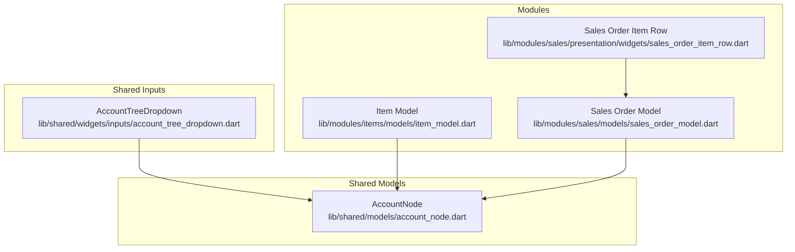
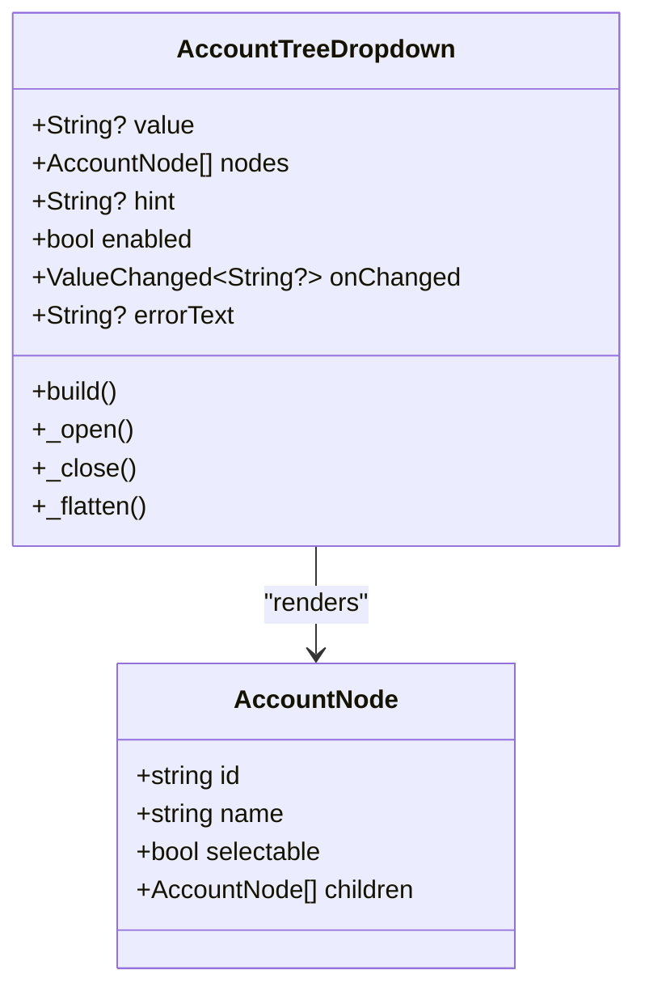
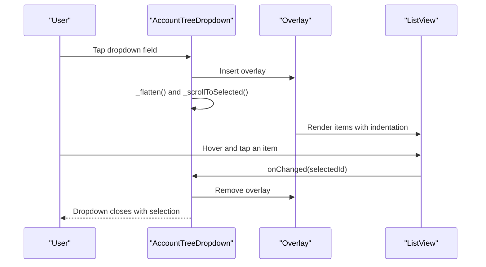
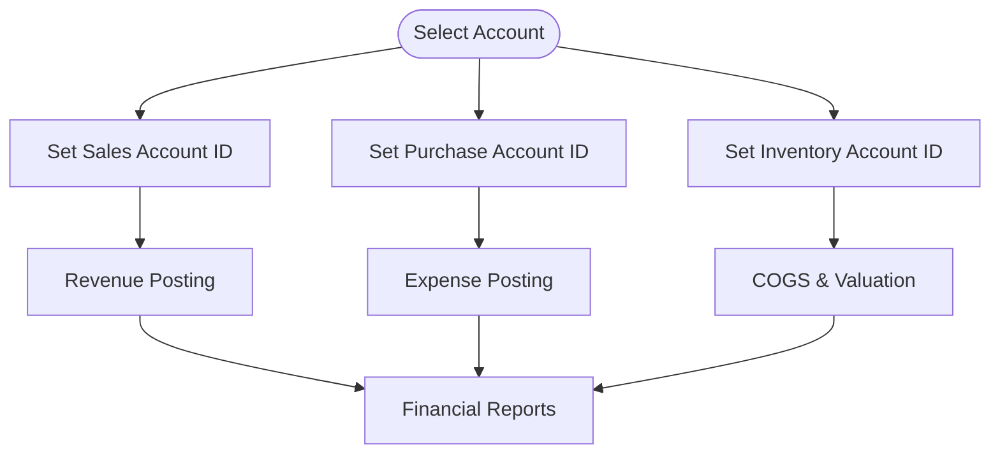
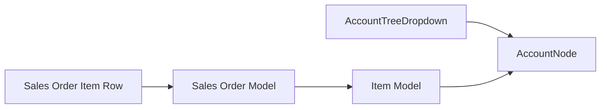

# Chart of Accounts

<cite>
**Referenced Files in This Document**
- [account_node.dart](file://lib/shared/models/account_node.dart)
- [account_tree_dropdown.dart](file://lib/shared/widgets/inputs/account_tree_dropdown.dart)
- [item_model.dart](file://lib/modules/items/models/item_model.dart)
- [items_item_create.dart](file://lib/modules/items/presentation/items_item_create.dart)
- [sales_order_model.dart](file://lib/modules/sales/models/sales_order_model.dart)
- [sales_order_item_row.dart](file://lib/modules/sales/presentation/widgets/sales_order_item_row.dart)
</cite>

## Table of Contents
1. [Introduction](#introduction)
2. [Project Structure](#project-structure)
3. [Core Components](#core-components)
4. [Architecture Overview](#architecture-overview)
5. [Detailed Component Analysis](#detailed-component-analysis)
6. [Dependency Analysis](#dependency-analysis)
7. [Performance Considerations](#performance-considerations)
8. [Troubleshooting Guide](#troubleshooting-guide)
9. [Conclusion](#conclusion)

## Introduction
This document explains the Chart of Accounts system in the ZerpAI ERP codebase. It focuses on the hierarchical account structure represented by the AccountNode model, the account tree navigation via the AccountTreeDropdown widget, and how accounts are mapped to financial transactions across the system. It also covers account classification patterns, practical examples of account creation and selection, integration points with the sales and inventory modules, and how accounts flow through financial reporting.

## Project Structure
The Chart of Accounts functionality is primarily implemented in two reusable components:
- A lightweight data model for hierarchical account nodes
- A dropdown widget that renders and navigates the account tree

These components are used across the application to select accounts for items (sales, purchases, inventory) and potentially for other financial records.

**Diagram sources**
- [account_node.dart](file://lib/shared/models/account_node.dart#L1-L14)
- [account_tree_dropdown.dart](file://lib/shared/widgets/inputs/account_tree_dropdown.dart#L1-L306)
- [item_model.dart](file://lib/modules/items/models/item_model.dart#L1-L461)
- [sales_order_model.dart](file://lib/modules/sales/models/sales_order_model.dart#L1-L118)
- [sales_order_item_row.dart](file://lib/modules/sales/presentation/widgets/sales_order_item_row.dart#L1-L25)

**Section sources**
- [account_node.dart](file://lib/shared/models/account_node.dart#L1-L14)
- [account_tree_dropdown.dart](file://lib/shared/widgets/inputs/account_tree_dropdown.dart#L1-L306)

## Core Components
- AccountNode: A minimal, immutable representation of a chart of accounts node with an ID, display name, a flag indicating whether the node is selectable, and a list of child nodes. This structure supports a flat-to-hierarchical rendering pipeline in the dropdown.
- AccountTreeDropdown: A Flutter StatefulWidget that presents a searchable, scrollable, and selectable tree of AccountNode instances. It manages overlay positioning, selection state, and emits the selected account ID to the parent via a callback.

Practical usage patterns:
- Populate nodes from backend chart of accounts data and pass them to the dropdown.
- Use the selected account ID to populate item-level account mappings (sales, purchase, inventory).
- Validate selections against selectable flags to prevent choosing non-selectable header nodes.

**Section sources**
- [account_node.dart](file://lib/shared/models/account_node.dart#L1-L14)
- [account_tree_dropdown.dart](file://lib/shared/widgets/inputs/account_tree_dropdown.dart#L1-L306)

## Architecture Overview
The Chart of Accounts architecture centers on a simple, flexible data model and a reusable UI component. The dropdown renders a flattened view of the tree with indentation and selection indicators, while the underlying model preserves hierarchy for accurate navigation and validation.

**Diagram sources**
- [account_node.dart](file://lib/shared/models/account_node.dart#L1-L14)
- [account_tree_dropdown.dart](file://lib/shared/widgets/inputs/account_tree_dropdown.dart#L1-L306)

## Detailed Component Analysis

### AccountNode Model
- Purpose: Encapsulate a single chart of accounts entry with hierarchical children.
- Key attributes:
  - id: Unique identifier used for selection and matching.
  - name: Display label for the account.
  - selectable: Indicates whether the account can be chosen for transactions.
  - children: Sub-accounts forming the chart hierarchy.
- Complexity: Construction is O(1); traversal depends on tree depth and breadth.

Integration notes:
- The model is intentionally minimal to support efficient rendering and selection in the dropdown.

**Section sources**
- [account_node.dart](file://lib/shared/models/account_node.dart#L1-L14)

### AccountTreeDropdown Widget
- Rendering pipeline:
  - Flattens the tree into a linear list with depth markers for indentation.
  - Calculates overlay position based on available space above/below the trigger.
  - Renders a scrollable list with hover and selection visuals.
- Selection flow:
  - On item tap, invokes onChanged with the selected node’s ID and closes the overlay.
  - Maintains visual feedback for the currently selected item.
- UX behaviors:
  - Supports keyboard arrow keys via overlay height constraints.
  - Scrolls to the selected item on first open.
  - Displays error state with a dedicated error text prop.

**Diagram sources**
- [account_tree_dropdown.dart](file://lib/shared/widgets/inputs/account_tree_dropdown.dart#L1-L306)

**Section sources**
- [account_tree_dropdown.dart](file://lib/shared/widgets/inputs/account_tree_dropdown.dart#L1-L306)

### Account Classification Patterns
While the repository does not define explicit account types (assets, liabilities, equity, income, expenses) in code, the UI and models indicate how accounts are used operationally:
- Sales account mapping: Items carry a sales account identifier used for revenue posting.
- Purchase account mapping: Items carry a purchase account identifier used for expense/posting.
- Inventory account mapping: Items carry an inventory account identifier used for inventory valuation and COGS adjustments.

These identifiers are stored on the item model and can be set via the account tree dropdown during item creation.

**Diagram sources**
- [item_model.dart](file://lib/modules/items/models/item_model.dart#L1-L461)

**Section sources**
- [item_model.dart](file://lib/modules/items/models/item_model.dart#L1-L461)

### Practical Examples

- Creating an item with account mappings:
  - Open the item creation screen and navigate to the sales, purchase, or inventory tabs.
  - Use the account tree dropdown to select appropriate accounts for sales, purchase, and inventory.
  - Save the item; the model persists the selected account IDs.

- Tree navigation:
  - The dropdown flattens the tree and scrolls to the selected account on first open.
  - Users can hover and tap to choose an account; the dropdown closes automatically after selection.

- Integration with sales:
  - Sales order items reference the item model, which includes sales account information.
  - When generating invoices or reports, the sales account drives revenue recognition.

- Integration with inventory:
  - Inventory adjustments and COGS calculations rely on the item’s inventory account and purchase account.

**Section sources**
- [items_item_create.dart](file://lib/modules/items/presentation/items_item_create.dart#L1-L544)
- [item_model.dart](file://lib/modules/items/models/item_model.dart#L1-L461)
- [sales_order_model.dart](file://lib/modules/sales/models/sales_order_model.dart#L1-L118)
- [sales_order_item_row.dart](file://lib/modules/sales/presentation/widgets/sales_order_item_row.dart#L1-L25)

## Dependency Analysis
- AccountTreeDropdown depends on AccountNode for rendering and selection.
- Item model stores three account identifiers (sales, purchase, inventory) that originate from the chart of accounts.
- Sales order model aggregates totals and references items; item-level account IDs influence financial reporting.

**Diagram sources**
- [account_tree_dropdown.dart](file://lib/shared/widgets/inputs/account_tree_dropdown.dart#L1-L306)
- [account_node.dart](file://lib/shared/models/account_node.dart#L1-L14)
- [item_model.dart](file://lib/modules/items/models/item_model.dart#L1-L461)
- [sales_order_model.dart](file://lib/modules/sales/models/sales_order_model.dart#L1-L118)
- [sales_order_item_row.dart](file://lib/modules/sales/presentation/widgets/sales_order_item_row.dart#L1-L25)

**Section sources**
- [account_tree_dropdown.dart](file://lib/shared/widgets/inputs/account_tree_dropdown.dart#L1-L306)
- [account_node.dart](file://lib/shared/models/account_node.dart#L1-L14)
- [item_model.dart](file://lib/modules/items/models/item_model.dart#L1-L461)
- [sales_order_model.dart](file://lib/modules/sales/models/sales_order_model.dart#L1-L118)
- [sales_order_item_row.dart](file://lib/modules/sales/presentation/widgets/sales_order_item_row.dart#L1-L25)

## Performance Considerations
- Rendering efficiency: The dropdown flattens the tree once per open and uses a ListView.builder to render visible rows only.
- Scrolling: Jump-to-selection avoids unnecessary smooth scrolling and reduces layout thrash.
- Overlay sizing: The overlay height is clamped to a reasonable range to prevent excessive rendering overhead.

[No sources needed since this section provides general guidance]

## Troubleshooting Guide
- Selected account not reflected:
  - Verify the dropdown’s value matches an existing node ID and that the node is selectable.
  - Confirm the parent passes the returned ID to the model and persists it.

- Dropdown opens but does nothing:
  - Ensure the nodes list is populated and the onChanged callback is wired.
  - Check that the enabled flag is true and the overlay insertion succeeds.

- Overlay misaligned:
  - The widget auto-calculates placement based on available space; ensure the widget is mounted and has a RenderBox.

- Selection not applied in item creation:
  - Confirm the item creation screen updates the relevant fields (sales account, purchase account, inventory account) and saves the model.

**Section sources**
- [account_tree_dropdown.dart](file://lib/shared/widgets/inputs/account_tree_dropdown.dart#L1-L306)
- [items_item_create.dart](file://lib/modules/items/presentation/items_item_create.dart#L1-L544)

## Conclusion
The Chart of Accounts system in ZerpAI ERP is built around a simple, reusable model and widget pair. The AccountNode model captures hierarchical account data, while the AccountTreeDropdown provides a robust UI for navigating and selecting accounts. These components integrate with the item model to capture sales, purchase, and inventory account mappings, enabling accurate financial reporting and transaction posting across sales and inventory workflows.