# Financial Management

<cite>
**Referenced Files in This Document**
- [account_node.dart](file://lib/shared/models/account_node.dart)
- [account_tree_dropdown.dart](file://lib/shared/widgets/inputs/account_tree_dropdown.dart)
- [currency_constants.dart](file://lib/shared/constants/currency_constants.dart)
- [reports_reports_dashboard.dart](file://lib/modules/reports/presentation/reports_reports_dashboard.dart)
- [reports_sales_sales_daily.dart](file://lib/modules/reports/presentation/reports_sales_sales_daily.dart)
- [sales_order_model.dart](file://lib/modules/sales/models/sales_order_model.dart)
- [item_model.dart](file://lib/modules/items/models/item_model.dart)
</cite>

## Table of Contents
1. [Introduction](#introduction)
2. [Project Structure](#project-structure)
3. [Core Components](#core-components)
4. [Architecture Overview](#architecture-overview)
5. [Detailed Component Analysis](#detailed-component-analysis)
6. [Dependency Analysis](#dependency-analysis)
7. [Performance Considerations](#performance-considerations)
8. [Troubleshooting Guide](#troubleshooting-guide)
9. [Conclusion](#conclusion)
10. [Appendices](#appendices)

## Introduction
This document describes the Financial Management feature set in the system, focusing on:
- Chart of Accounts: hierarchical account representation and selection via a tree dropdown
- Multi-currency support: standardized currency options and per-entity currency fields
- Financial reporting: dashboard summaries and daily sales reporting
- Accounting integrations: account mapping on items and sales orders
- Financial dashboards: summary cards and report categories
- Sales analytics: daily sales aggregation and totals
- Inventory valuation: item-level valuation method and account mapping
- GST compliance reporting: item tax preferences and tax identifiers
- Financial statement generation: totals and roll-ups for financial reporting

The goal is to provide a practical, accessible guide for building financial workflows, mapping accounts, converting currencies, and visualizing financial data.

## Project Structure
The Financial Management feature spans shared models, UI widgets, and presentation screens:
- Shared models define the chart of accounts hierarchy
- Shared widgets provide reusable UI for account selection
- Presentation screens implement financial dashboards and daily sales reporting
- Domain models capture sales totals and item tax/inventory attributes

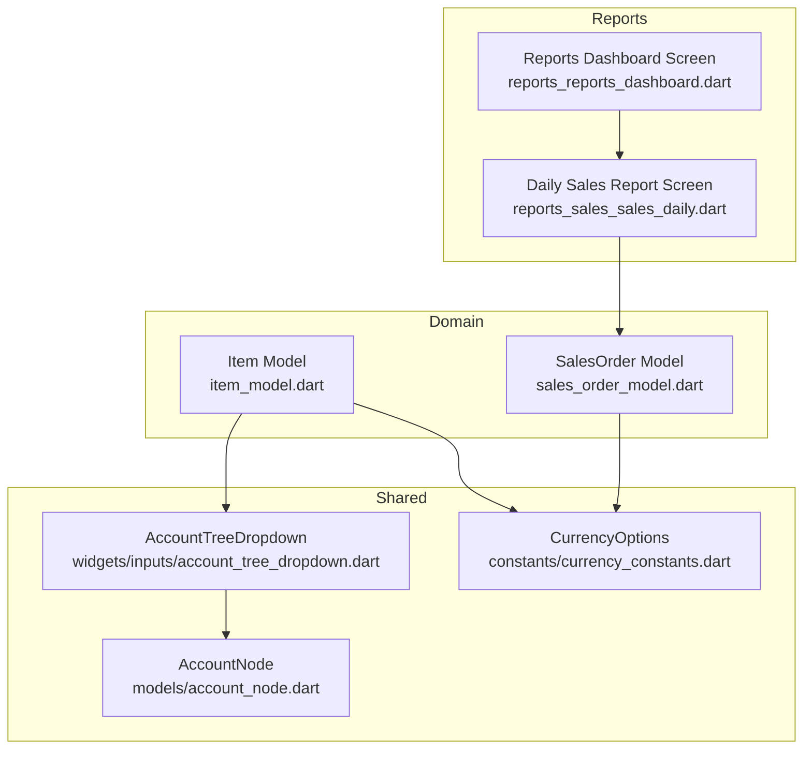

**Diagram sources**
- [account_node.dart](file://lib/shared/models/account_node.dart#L1-L14)
- [account_tree_dropdown.dart](file://lib/shared/widgets/inputs/account_tree_dropdown.dart#L1-L306)
- [currency_constants.dart](file://lib/shared/constants/currency_constants.dart#L1-L2172)
- [reports_reports_dashboard.dart](file://lib/modules/reports/presentation/reports_reports_dashboard.dart#L1-L214)
- [reports_sales_sales_daily.dart](file://lib/modules/reports/presentation/reports_sales_sales_daily.dart#L1-L213)
- [sales_order_model.dart](file://lib/modules/sales/models/sales_order_model.dart#L1-L118)
- [item_model.dart](file://lib/modules/items/models/item_model.dart#L1-L461)

**Section sources**
- [account_node.dart](file://lib/shared/models/account_node.dart#L1-L14)
- [account_tree_dropdown.dart](file://lib/shared/widgets/inputs/account_tree_dropdown.dart#L1-L306)
- [currency_constants.dart](file://lib/shared/constants/currency_constants.dart#L1-L2172)
- [reports_reports_dashboard.dart](file://lib/modules/reports/presentation/reports_reports_dashboard.dart#L1-L214)
- [reports_sales_sales_daily.dart](file://lib/modules/reports/presentation/reports_sales_sales_daily.dart#L1-L213)
- [sales_order_model.dart](file://lib/modules/sales/models/sales_order_model.dart#L1-L118)
- [item_model.dart](file://lib/modules/items/models/item_model.dart#L1-L461)

## Core Components
- Chart of Accounts
  - Hierarchical account nodes with selectable leaf nodes and parent groups
  - Tree dropdown for selecting an account ID with nested indentation and selection feedback
- Multi-currency
  - Standardized currency options with code, name, symbol, decimals, and format
  - Per-entity currency fields on items and sales orders
- Financial Reporting
  - Dashboard with summary cards and categorized report tiles
  - Daily sales report aggregating invoice counts and totals by date
- Accounting Integrations
  - Account mapping on items for sales, purchases, and inventory
  - Sales order totals and tax breakdowns for financial reporting
- GST Compliance
  - Item tax preference and intra/inter-state tax identifiers
- Financial Statement Generation
  - Totals and roll-ups in daily sales report for financial statements

**Section sources**
- [account_node.dart](file://lib/shared/models/account_node.dart#L1-L14)
- [account_tree_dropdown.dart](file://lib/shared/widgets/inputs/account_tree_dropdown.dart#L1-L306)
- [currency_constants.dart](file://lib/shared/constants/currency_constants.dart#L1-L2172)
- [reports_reports_dashboard.dart](file://lib/modules/reports/presentation/reports_reports_dashboard.dart#L1-L214)
- [reports_sales_sales_daily.dart](file://lib/modules/reports/presentation/reports_sales_sales_daily.dart#L1-L213)
- [sales_order_model.dart](file://lib/modules/sales/models/sales_order_model.dart#L1-L118)
- [item_model.dart](file://lib/modules/items/models/item_model.dart#L1-L461)

## Architecture Overview
The Financial Management feature integrates UI, models, and domain data to support financial workflows:
- UI widgets render account selection and financial dashboards
- Models encapsulate financial data (sales totals, taxes, currency)
- Shared constants provide currency standards
- Reports consume domain data to produce financial insights

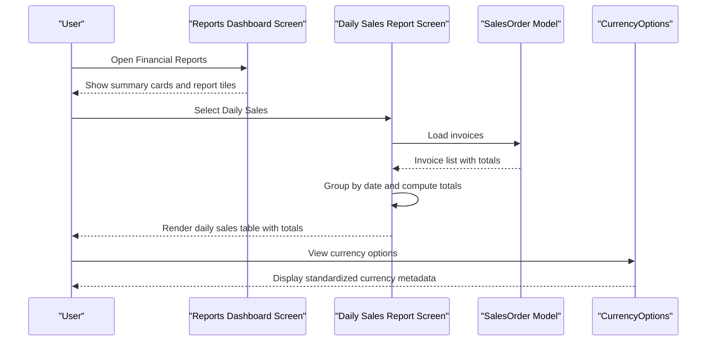

**Diagram sources**
- [reports_reports_dashboard.dart](file://lib/modules/reports/presentation/reports_reports_dashboard.dart#L1-L214)
- [reports_sales_sales_daily.dart](file://lib/modules/reports/presentation/reports_sales_sales_daily.dart#L1-L213)
- [sales_order_model.dart](file://lib/modules/sales/models/sales_order_model.dart#L1-L118)
- [currency_constants.dart](file://lib/shared/constants/currency_constants.dart#L1-L2172)

## Detailed Component Analysis

### Chart of Accounts System
The chart of accounts is represented as a hierarchical tree of nodes. The account tree dropdown renders a searchable, scrollable list of accounts with indentation and selection indicators.

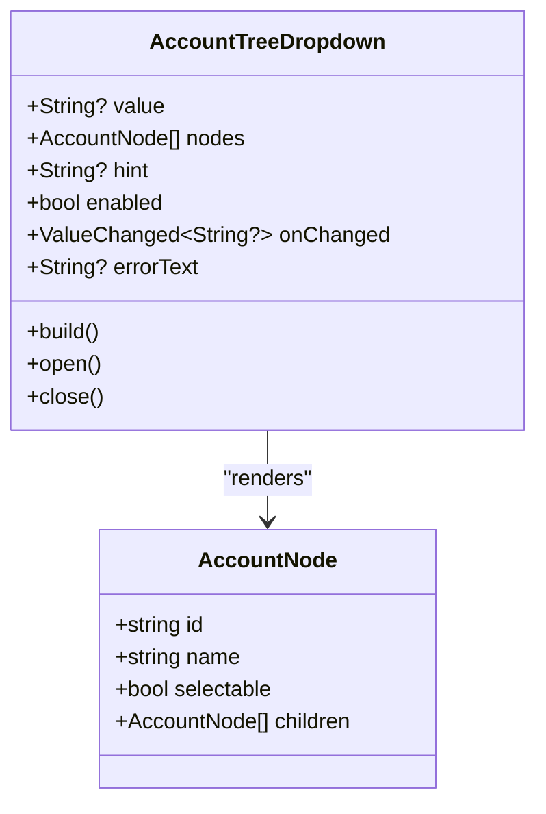

**Diagram sources**
- [account_node.dart](file://lib/shared/models/account_node.dart#L1-L14)
- [account_tree_dropdown.dart](file://lib/shared/widgets/inputs/account_tree_dropdown.dart#L1-L306)

Practical usage:
- Populate nodes from backend lookup or local definitions
- Use the dropdown to select an account ID for mapping on items and sales documents
- Display selected label or placeholder based on value presence

**Section sources**
- [account_node.dart](file://lib/shared/models/account_node.dart#L1-L14)
- [account_tree_dropdown.dart](file://lib/shared/widgets/inputs/account_tree_dropdown.dart#L1-L306)

### Multi-currency Support
Standardized currency options are defined with code, name, symbol, decimals, and format. Items and sales orders include currency fields to support multi-currency operations.

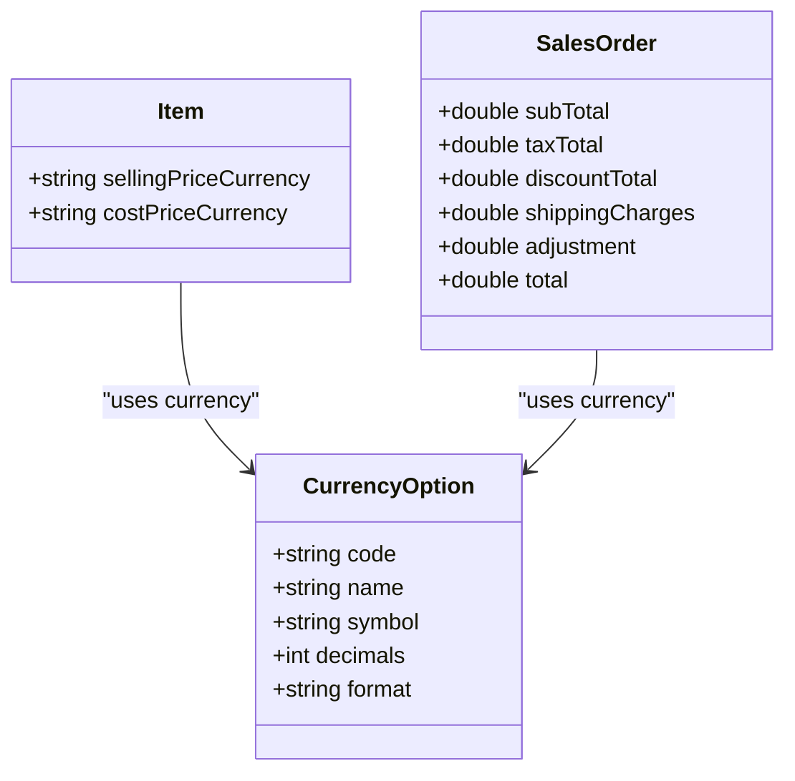

**Diagram sources**
- [currency_constants.dart](file://lib/shared/constants/currency_constants.dart#L1-L2172)
- [item_model.dart](file://lib/modules/items/models/item_model.dart#L1-L461)
- [sales_order_model.dart](file://lib/modules/sales/models/sales_order_model.dart#L1-L118)

Practical usage:
- Present currency options to users for selection during item creation and sales entry
- Store per-item pricing and cost prices with associated currency codes
- Aggregate totals in a base currency for reporting or convert at display time

**Section sources**
- [currency_constants.dart](file://lib/shared/constants/currency_constants.dart#L1-L2172)
- [item_model.dart](file://lib/modules/items/models/item_model.dart#L1-L461)
- [sales_order_model.dart](file://lib/modules/sales/models/sales_order_model.dart#L1-L118)

### Financial Reporting Capabilities
The financial reporting module provides:
- A dashboard with summary cards for key metrics
- A grid of report categories and items
- A daily sales report that aggregates invoice counts and totals by date

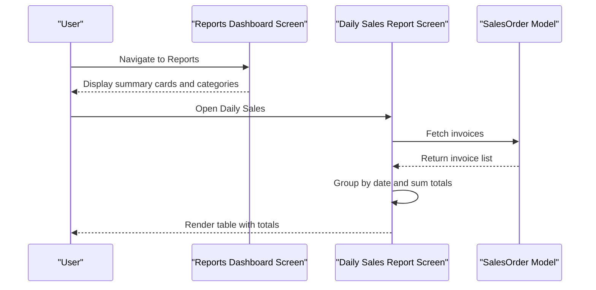

**Diagram sources**
- [reports_reports_dashboard.dart](file://lib/modules/reports/presentation/reports_reports_dashboard.dart#L1-L214)
- [reports_sales_sales_daily.dart](file://lib/modules/reports/presentation/reports_sales_sales_daily.dart#L1-L213)
- [sales_order_model.dart](file://lib/modules/sales/models/sales_order_model.dart#L1-L118)

**Section sources**
- [reports_reports_dashboard.dart](file://lib/modules/reports/presentation/reports_reports_dashboard.dart#L1-L214)
- [reports_sales_sales_daily.dart](file://lib/modules/reports/presentation/reports_sales_sales_daily.dart#L1-L213)
- [sales_order_model.dart](file://lib/modules/sales/models/sales_order_model.dart#L1-L118)

### Accounting Integrations
Account mapping enables financial reporting and compliance:
- Items map to accounts for sales, purchases, and inventory valuation
- Sales orders carry totals and tax breakdowns for financial statements

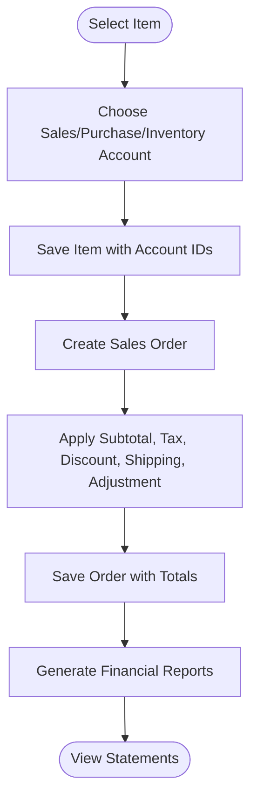

**Diagram sources**
- [item_model.dart](file://lib/modules/items/models/item_model.dart#L1-L461)
- [sales_order_model.dart](file://lib/modules/sales/models/sales_order_model.dart#L1-L118)

**Section sources**
- [item_model.dart](file://lib/modules/items/models/item_model.dart#L1-L461)
- [sales_order_model.dart](file://lib/modules/sales/models/sales_order_model.dart#L1-L118)

### Financial Dashboard Components
The dashboard presents summary cards and categorized report tiles. These visuals provide quick insights into key financial metrics and navigation to detailed reports.

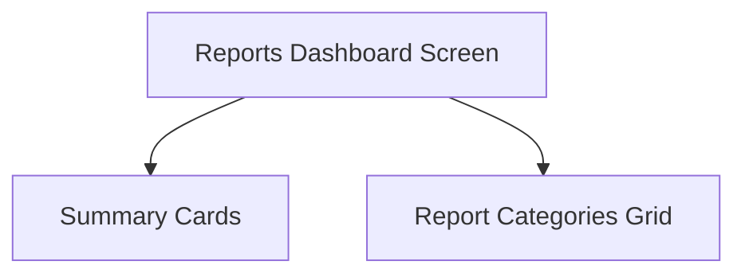

**Diagram sources**
- [reports_reports_dashboard.dart](file://lib/modules/reports/presentation/reports_reports_dashboard.dart#L1-L214)

**Section sources**
- [reports_reports_dashboard.dart](file://lib/modules/reports/presentation/reports_reports_dashboard.dart#L1-L214)

### Sales Analytics
Daily sales analytics aggregates invoice counts and totals by date, enabling trend analysis and financial statement preparation.

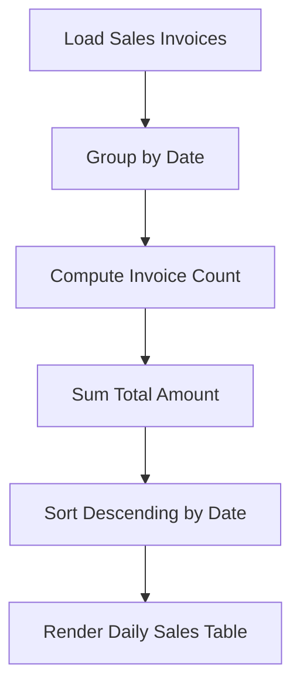

**Diagram sources**
- [reports_sales_sales_daily.dart](file://lib/modules/reports/presentation/reports_sales_sales_daily.dart#L1-L213)

**Section sources**
- [reports_sales_sales_daily.dart](file://lib/modules/reports/presentation/reports_sales_sales_daily.dart#L1-L213)

### Inventory Valuation
Items include valuation method and inventory account mapping, supporting inventory-led financial reporting and balance sheet valuation.

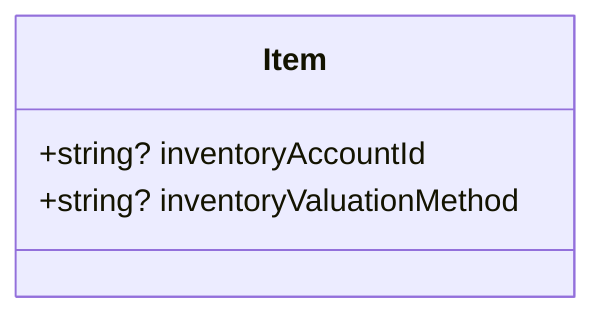

**Diagram sources**
- [item_model.dart](file://lib/modules/items/models/item_model.dart#L1-L461)

**Section sources**
- [item_model.dart](file://lib/modules/items/models/item_model.dart#L1-L461)

### GST Compliance Reporting
Items carry tax preference and intra/inter-state tax identifiers, enabling GST-compliant reporting and liability calculations.

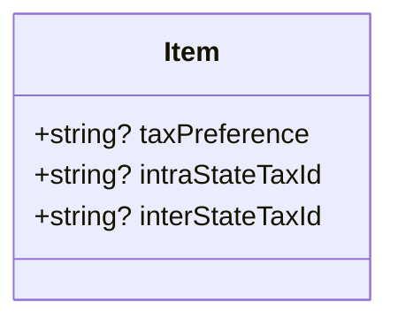

**Diagram sources**
- [item_model.dart](file://lib/modules/items/models/item_model.dart#L1-L461)

**Section sources**
- [item_model.dart](file://lib/modules/items/models/item_model.dart#L1-L461)

### Financial Statement Generation
Financial statements rely on aggregated totals and roll-ups from sales data. The daily sales report demonstrates how totals are computed and presented.

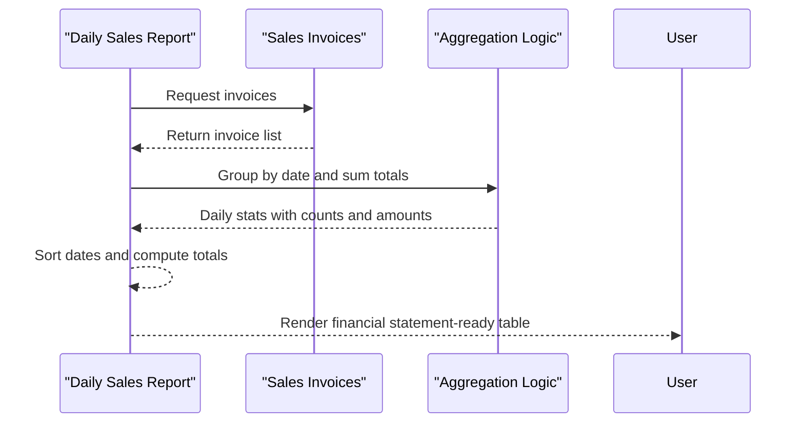

**Diagram sources**
- [reports_sales_sales_daily.dart](file://lib/modules/reports/presentation/reports_sales_sales_daily.dart#L1-L213)

**Section sources**
- [reports_sales_sales_daily.dart](file://lib/modules/reports/presentation/reports_sales_sales_daily.dart#L1-L213)

## Dependency Analysis
The following diagram shows key dependencies among financial components:

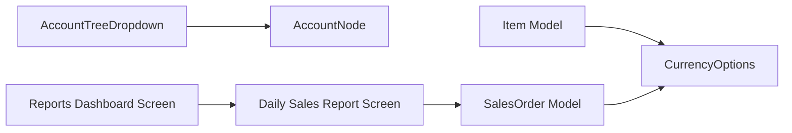

**Diagram sources**
- [account_tree_dropdown.dart](file://lib/shared/widgets/inputs/account_tree_dropdown.dart#L1-L306)
- [account_node.dart](file://lib/shared/models/account_node.dart#L1-L14)
- [reports_reports_dashboard.dart](file://lib/modules/reports/presentation/reports_reports_dashboard.dart#L1-L214)
- [reports_sales_sales_daily.dart](file://lib/modules/reports/presentation/reports_sales_sales_daily.dart#L1-L213)
- [sales_order_model.dart](file://lib/modules/sales/models/sales_order_model.dart#L1-L118)
- [item_model.dart](file://lib/modules/items/models/item_model.dart#L1-L461)
- [currency_constants.dart](file://lib/shared/constants/currency_constants.dart#L1-L2172)

**Section sources**
- [account_tree_dropdown.dart](file://lib/shared/widgets/inputs/account_tree_dropdown.dart#L1-L306)
- [account_node.dart](file://lib/shared/models/account_node.dart#L1-L14)
- [reports_reports_dashboard.dart](file://lib/modules/reports/presentation/reports_reports_dashboard.dart#L1-L214)
- [reports_sales_sales_daily.dart](file://lib/modules/reports/presentation/reports_sales_sales_daily.dart#L1-L213)
- [sales_order_model.dart](file://lib/modules/sales/models/sales_order_model.dart#L1-L118)
- [item_model.dart](file://lib/modules/items/models/item_model.dart#L1-L461)
- [currency_constants.dart](file://lib/shared/constants/currency_constants.dart#L1-L2172)

## Performance Considerations
- Rendering large datasets: Use virtualization or pagination for daily sales tables when datasets grow large
- Currency formatting: Precompute formatted values for display to reduce repeated computations
- Aggregation: Cache daily sales aggregations per session to avoid recomputation on re-open
- Account tree rendering: Limit visible nodes and defer heavy operations until user interaction

## Troubleshooting Guide
- Account selection issues
  - Verify that selectable nodes are properly marked and that the dropdown updates the selected value
  - Ensure the overlay positioning logic handles constrained screen space
- Currency display anomalies
  - Confirm currency option decimals and format align with regional expectations
  - Validate per-entity currency fields are populated consistently
- Sales report empty states
  - Confirm invoice loading completes successfully and handles loading and error states gracefully
  - Validate date grouping logic and sorting behavior
- Account mapping mismatches
  - Ensure item account IDs correspond to existing nodes in the chart of accounts
  - Validate that sales orders reflect correct account mappings for financial reporting

**Section sources**
- [account_tree_dropdown.dart](file://lib/shared/widgets/inputs/account_tree_dropdown.dart#L1-L306)
- [currency_constants.dart](file://lib/shared/constants/currency_constants.dart#L1-L2172)
- [reports_sales_sales_daily.dart](file://lib/modules/reports/presentation/reports_sales_sales_daily.dart#L1-L213)
- [item_model.dart](file://lib/modules/items/models/item_model.dart#L1-L461)
- [sales_order_model.dart](file://lib/modules/sales/models/sales_order_model.dart#L1-L118)

## Conclusion
The Financial Management feature integrates a chart of accounts system, multi-currency support, financial reporting, and accounting integrations. It provides dashboard components, sales analytics, inventory valuation hooks, and GST compliance fields. By leveraging standardized currency options, hierarchical account selection, and robust sales data aggregation, the system supports accurate financial reporting and statement generation.

## Appendices
- Practical examples
  - Financial workflows
    - Create an item with sales/purchase/inventory account IDs and valuation method
    - Record a sales order; ensure totals and taxes are captured
    - Generate the daily sales report to review aggregated metrics
  - Account mapping
    - Use the account tree dropdown to select appropriate ledger accounts for items
    - Validate that mapped accounts appear in financial reports
  - Currency conversion
    - Select currency options for items and sales orders
    - Display totals using currency formatting rules
  - Financial data visualization
    - Use dashboard summary cards to monitor key metrics
    - Drill into daily sales report for detailed insights